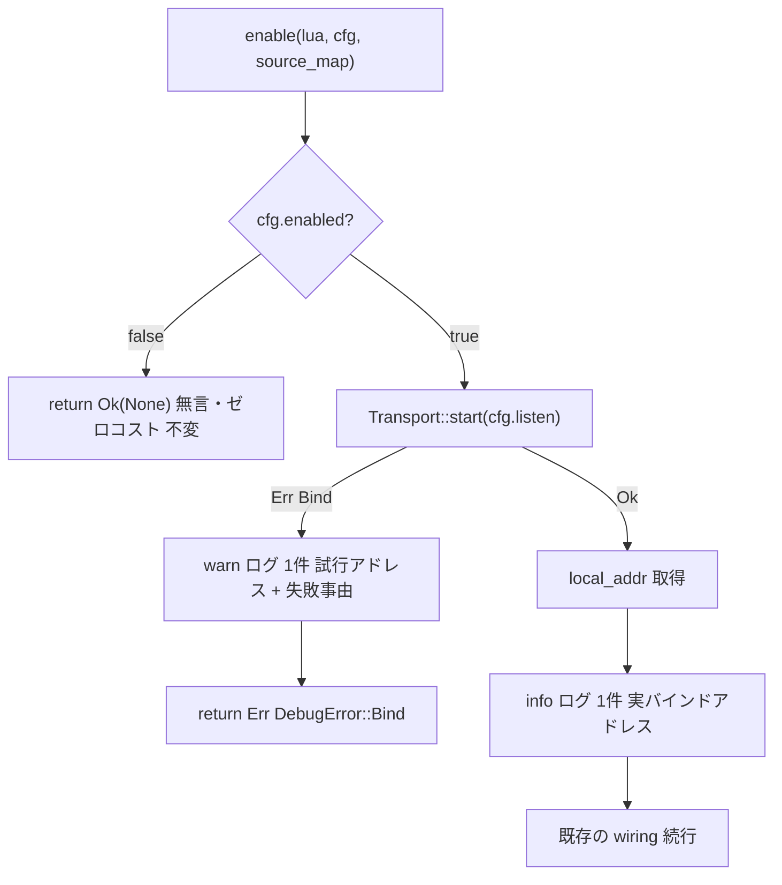

# Design Document

## Overview

**Purpose**: デバッグバックエンド（DAP）有効化時に、待ち受け開始の事実と実バインドアドレスを `pasta.log` 上の単一 `info` ログとして観測可能にし、バインド失敗時には切り分け可能な `warn` ログを 1 件出力する観測性追加である。

**Users**: pasta ゴースト作者が、VSCode から attach する前に「デバッグモードで起動できているか」「どのポートで待ち受けているか」を `pasta.log` で確認できるようになる。

**Impact**: 既存の `enable()`（`crates/pasta_lua/src/debug/mod.rs`）の有効化経路に `tracing` ログ 2 系統（成功 `info` / 失敗 `warn`）を追加する。デバッグの機能挙動・ログ基盤・無効時のゼロコスト経路はいずれも不変。

### Goals
- 待ち受け開始成功時に、実バインドアドレス（loopback `host:port`）を含む `info` ログを 1 件出力する。
- バインド失敗時に、試行アドレスと失敗事由を含む `warn` ログを 1 件出力する。
- デバッグ無効時の完全な無言・ゼロコスト経路を一切変更しない。

### Non-Goals
- 待ち受け開始とは独立した「有効化検知のみ」の専用ログ（待ち受けログに統合）。
- クライアント attach／切断ごとの逐次ログ。
- ログ出力先（`pasta.log`）・フォーマット基盤・レベルフィルタ構成の変更。
- デバッグ機能挙動（BP／ステップ／変数／提示モード／サイドカー）の変更。
- 利用者マニュアルの更新（隣接仕様 `pasta-manual-debugging` 側で対応）。

## Boundary Commitments

### This Spec Owns
- `enable()` の有効化経路における **2 つのログ点**の追加と、その文言・レベル・含有情報の契約。
  - 成功点: `Transport::start` 成功・`local_addr` 取得後の `info` ログ。
  - 失敗点: `Transport::start` 失敗時の `warn` ログ。

### Out of Boundary
- `Transport`・`DebugSession`・`hook`・`wiring` 等の既存挙動・契約（変更しない。観測のみ追加）。
- `DebugConfig` 解決ロジック、無効時の早期 return 経路。
- `tracing` サブスクライバ／`tracing-appender`／`pasta.log` 出力構成（`logging/` 管轄）。

### Allowed Dependencies
- 既存依存 `tracing 0.1`（`pasta_lua` の直接依存）。**新規依存は追加しない**。
- 既存の `tracing::warn!` 慣習（`debug/mod.rs:98`）に倣う。
- 実バインドアドレスの取得は既存 API `Transport::local_addr()`（`Option<SocketAddr>`）に依存。

### Revalidation Triggers
- `Transport::start` のシグネチャ／失敗伝播（`DebugError::Bind`）の変更。
- `local_addr()` の戻り値型・意味（実バインド値の読み戻し）の変更。
- 無効時早期 return（`enable()` ゲート）の位置・条件の変更。
- `pasta.log` のログレベルフィルタ構成が `info`/`warn` を抑制する方向へ変わった場合（下流マニュアルの確認手順が前提を失う）。

## Architecture

### Existing Architecture Analysis

`enable()`（`crates/pasta_lua/src/debug/mod.rs`）はデバッグバックエンドの単一エントリポイント兼有効化ゲートである。

- **ゼロコスト無効ゲート**: 関数冒頭で `if !cfg.enabled { return Ok(None); }`。フック未装着・ポート未開放・スレッド未生成。本設計はこのゲートに一切触れない。
- **トランスポート起動シーム**: 有効時、`let transport = Transport::start(cfg.listen)?;` で `TcpListener` をバインド（失敗は `?` で `DebugError::Bind` に伝播）し、直後に `let local_addr = transport.local_addr();` で**実バインドアドレスを読み戻す**。OS 割り当て（port 0）でも `local_addr` は確定値を返す（要件 1.5 の前提能力は既存）。
- **既存ロギング**: `debug` モジュールに `info` は皆無、`warn` 2 件のみ（`mod.rs:98` 提示モードフォールバック、`source_map.rs:523` サイドカー書込失敗）。`tracing` 基盤は `logging/` で構成済み。

### Architecture Pattern & Boundary Map

新コンポーネントは導入しない。既存の制御フロー上の 2 点に観測（ログ）を挿入するのみ。

**Architecture Integration**:
- Selected pattern: 既存制御フローへの **observation 挿入**（cross-cutting logging）。新規モジュール・抽象化なし。
- 既存パターン踏襲: `tracing` マクロをインライン呼び出し（`tracing::warn!` の既存慣習に一致）。
- 依存方向: 追加コードは `tracing` にのみ依存。`enable()` の既存依存方向（Types → Config → transport/session → wiring）を変えない。
- Steering 準拠: ゼロコスト無効経路の維持（tech/structure のデバッグ設計原則 R5 系）を厳守。

### Technology Stack

| Layer | Choice / Version | Role in Feature | Notes |
|-------|------------------|-----------------|-------|
| Backend / Runtime | `tracing` 0.1（既存直接依存） | `info`/`warn` ログ出力 | 新規依存なし。`pasta_lua` に既存 |
| Test | `tracing-test`（既存 dev-dependency, `Cargo.toml:43`） | ログ出力/非出力のユニット検証 | `#[traced_test]` + `logs_contain` |

## File Structure Plan

### Modified Files
- `crates/pasta_lua/src/debug/mod.rs` — `enable()` に 2 つのログ点を追加:
  1. `Transport::start(cfg.listen)` の失敗時 `warn`（`?` 前に `map_err` で失敗事由＋試行アドレスを握ってログ）。
  2. `local_addr` 取得後の成功時 `info`（`if let Some(addr)` で実バインドアドレスを出力）。
  - 同ファイル `#[cfg(test)] mod tests` に検証テストを追加（既存テストへ `#[traced_test]` 付与＋ログアサーション）。

新規ファイルは作成しない。

## System Flows

制御分岐は上記 Architecture の Mermaid 図に集約済み。要点:
- **gating**: ログは必ず `cfg.enabled == true` ゲート通過後にのみ実行される（無効時は到達不能 → 要件 3.1 を構造的に保証）。
- **失敗時の info 抑制**: `info` ログは `Transport::start` 成功後（`?` を通過した後）にのみ置かれるため、バインド失敗時は到達しない（要件 2.1 を配置で保証）。
- **成功時の warn 不在**: `warn` は失敗分岐（`map_err`）でのみ発火し、成功時は到達しない。

## Requirements Traceability

| Requirement | Summary | 実現要素 | 配置 |
|-------------|---------|----------|------|
| 1.1 | 待ち受け開始時に `info` 1 件 | `enable()` 成功点 `tracing::info!` | `local_addr` 取得後 |
| 1.2 | `info` レベルで出力・`warn` 以上で出さない | `tracing::info!` マクロ使用 | 成功点 |
| 1.3 | デバッグ待ち受けと識別できる文言 | 固定英語メッセージ `debug backend listening` | 成功点 |
| 1.4 | 実バインドアドレス（host:port）を含む | `addr = %addr` 構造化フィールド | 成功点 |
| 1.5 | OS 割り当て時も実確定値 | `Transport::local_addr()` の読み戻し値を使用 | 成功点 |
| 1.6 | loopback addr+port 以外（秘密情報等）を含めない | メッセージは固定文＋`addr` のみ | 成功点 |
| 2.1 | バインド失敗時は `info` を出さない | `info` を `?` 通過後に配置（失敗時は到達不能） | 配置で保証 |
| 2.2 | バインド失敗時に `warn` 1 件 | `Transport::start(...).map_err(|e| { warn!; e })?` | 失敗点 |
| 2.3 | warn に試行アドレス＋失敗事由、秘密情報なし | `addr = %listen, error = %e` ＋固定文 | 失敗点 |
| 3.1 | 無効時はいかなるログも出さない | ログは全てゲート通過後（無効時は到達不能） | 配置で保証 |
| 3.2 | 無効時ゼロコスト経路維持 | 早期 return に触れない | 不変 |
| 3.3 | 無効経路の既存挙動不変 | 同上 | 不変 |
| 4.1 | 既存デバッグ機能挙動不変 | ログ追加のみ。挙動変更なし | — |
| 4.2 | ログ基盤・出力先不変 | 既存 `tracing` 基盤をそのまま使用 | — |
| 4.3 | `cargo test --all` 緑維持 | 既存テスト＋追加テストが成功 | テスト |
| 4.4 | 新規外部依存なし | `tracing`（既存）のみ | — |

## Components and Interfaces

| Component | Domain/Layer | Intent | Req Coverage | Key Dependencies | Contracts |
|-----------|--------------|--------|--------------|------------------|-----------|
| `enable()` ログ点 | debug backend | 待ち受け成功 `info` / 失敗 `warn` の出力 | 1, 2, 3 | `tracing` (P0), `Transport::start`/`local_addr` (P0) | State（観測のみ・新契約なし） |

### debug backend

#### `enable()` のログ挿入

| Field | Detail |
|-------|--------|
| Intent | `enable()` の有効化経路に成功 `info` と失敗 `warn` を 1 件ずつ挿入する |
| Requirements | 1.1, 1.2, 1.3, 1.4, 1.5, 1.6, 2.1, 2.2, 2.3, 3.1 |

**Responsibilities & Constraints**
- 成功 `info` は実バインドアドレス（`Transport::local_addr()` の `Some` 値）のみを構造化フィールド `addr` で出力する。`if let Some(addr)` で握る（防御的。無効時 `None` は無効ゲートで到達不能だが契約上 `Option`）。
- 失敗 `warn` は `Transport::start(cfg.listen)` の `Err` を `map_err` で捕捉し、試行アドレス（`cfg.listen`）と失敗事由（`std::io::Error`）を出力した後、エラーをそのまま伝播（`DebugError::Bind` の伝播挙動は不変）。
- ログは必ず無効ゲート通過後に置く。無効経路（早期 return）には触れない。
- メッセージは簡潔な英語（既存 `tracing` ログと一貫）。秘密情報・資格情報は出力しない（出すのは loopback `host:port` と io エラー文言のみ）。

**Dependencies**
- Outbound: `tracing::{info, warn}` — ログ出力（P0）
- Inbound: `Transport::start` / `Transport::local_addr` — 実バインドアドレスの取得元（P0、いずれも既存・変更なし）

**Contracts**: State [x]（観測のみ。新規 Service/API/Event/Batch 契約なし）

**Implementation Notes**
- Integration: 成功 `info` の参考文言 `tracing::info!(addr = %addr, "debug backend listening")`（`addr` は `local_addr` の `Some` 値）。失敗 `warn` は `cfg.listen` が `Option<SocketAddr>` のため `%`（Display）を直接適用できない。有効ゲート通過済み＝`Some` 確定を前提に**分割代入してから** `%addr` で出す（例: `let Some(listen) = cfg.listen else { unreachable!("enabled => Some") };` 後に `tracing::warn!(addr = %listen, error = %e, "debug transport bind failed")`）。`?cfg.listen`（Debug, `Some(addr)` 表記）でも可だが出力が `Some(...)` で汚れるため非推奨。最終文言は実装時に上記制約内で確定。
- Validation: `#[traced_test]` + `logs_contain(...)` で出力/非出力を検証（下記 Testing Strategy）。
- Risks: 低。挿入点・実バインドアドレス読み戻し・テスト基盤すべて既存で確認済み。無効経路はゲートで物理隔離。

## Error Handling

### Error Strategy
本機能はエラーを新たに生成しない。既存のバインド失敗（`DebugError::Bind`）の**伝播挙動を変えず**、その直前に観測用 `warn` を 1 件加えるのみ。

### Error Categories and Responses
- **バインド失敗（`DebugError::Bind`）**: `Transport::start` が `Err` を返す。`map_err` で `warn` ログ（試行アドレス＋io エラー事由）を出力した後、`?` で従来どおり呼び出し元へ `Err` を伝播する。`info`（待ち受け開始）は出力されない（要件 2.1）。

### Monitoring
追加する 2 ログ自体が本機能の観測点。`pasta.log` の既存出力経路（`tracing-appender`）にそのまま乗る。

## Testing Strategy

### Unit Tests（`crates/pasta_lua/src/debug/mod.rs` の `#[cfg(test)] mod tests`）
いずれも `DebugConfig` を直接構築し、`listen` はポート 0（OS 割り当て）を使用して固定ポート衝突を避ける。

1. **成功時 info 出力**（1.1, 1.2, 1.4, 1.5）: 既存 `enable_enabled_returns_handle` に `#[traced_test]` を付与し、`logs_contain("debug backend listening")` を検証。1.5（OS 割り当ての実値）は、ハンドルから取得した**実アドレス文字列**で照合する（例: `let addr = handle.local_addr().unwrap(); assert!(logs_contain(&addr.to_string()))`）。静的部分文字列ではなく実 `local_addr` 値で照合することで、要求値（port 0）ではなく確定値が出力されることを確かめる。
2. **無効時は無言**（3.1）: 既存 `enable_disabled_returns_none_and_no_trace` に `#[traced_test]` を付与し、待ち受け関連の文言が `logs_contain` で**出ない**ことを検証（現状トレース未検証の名前倒れを実効化）。
3. **失敗時は warn・info なし**（2.1, 2.2）: 既存 `enable_bind_failure_surfaces_debug_error_bind` に `#[traced_test]` を付与し、`debug transport bind failed` 系の `warn` が出ること、`debug backend listening` の `info` が**出ない**ことを検証。

### 非回帰（4.1, 4.3）
- `cargo test --all` 緑を維持（LuaJIT ビルドは環境変数 `NoDefaultCurrentDirectoryInExePath` を外して実行）。
- 既存デバッグテスト（hook/transport/session/source_map）が不変で通過することを確認。

> 補足（research.md「Research Needed」反映）: 検証テストは `DebugConfig` を直接構築するため `PASTA_DEBUG` env 汚染の影響を受けない。`#[traced_test]` は各テストにスコープ付きサブスクライバを設定し、`pasta.log` 用の本番サブスクライバ初期化（ユニットテストは非経由）と衝突しない。
