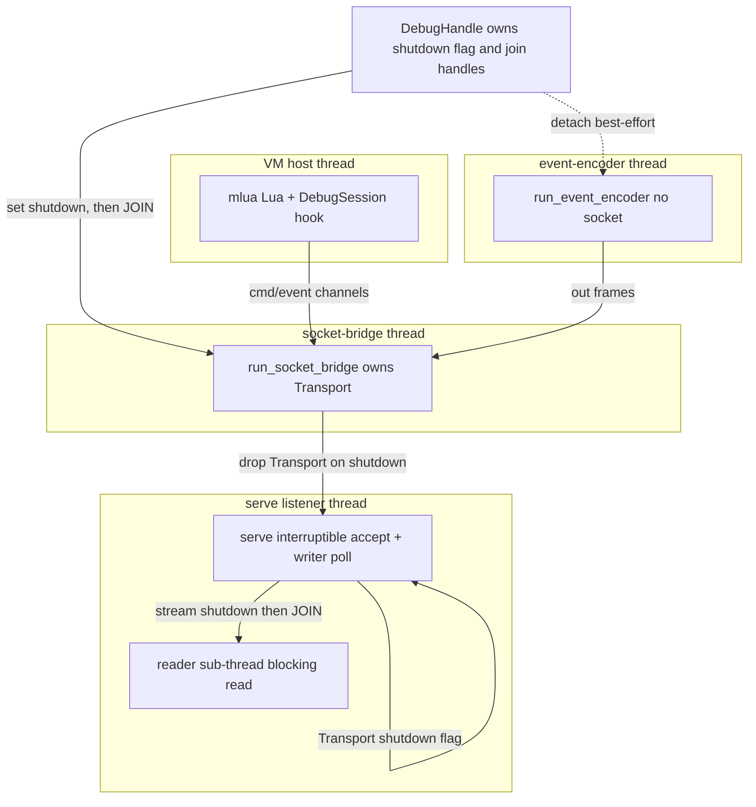
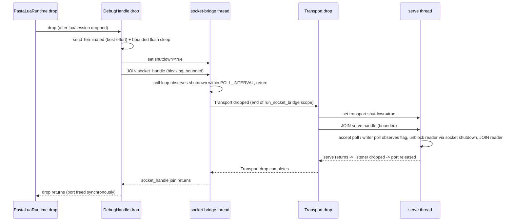

# 技術設計書: debug-transport-hardening

## Overview

**Purpose**: 開発（DEBUG）ビルドのゴーストを SSP 上でゴースト切替して再選択したときに、SHIORI `load()` が debug transport の再バインド失敗（`WSAEADDRINUSE` / `os error 10048`）で落ちる不具合を**根治**する。真因は「accept() で永久ブロックする `serve()` リスナースレッドが teardown で停止・join されずデタッチ生存し、`TcpListener` が固定ポートをプロセス寿命いっぱい握り続ける」リソースリーク。

**Users**: 開発ビルドでゴースト辞書を制作・デバッグするゴースト作者が、SSP を完全再起動せずに同一プロセス内でゴースト切替（unload→reload）を繰り返せるようになる。

**Impact**: 既存 `pasta_lua` debug backend の **teardown ライフサイクルのみ**を変更する。具体的には (1) `serve()` の `accept()` を中断可能化し、teardown 時に**同期的に join** してリスナースレッドと待受ソケットを確実に解放する（根治）、(2) 待受ソケット生成を `socket2` 経由に切り替え `SO_REUSEADDR` 相当を設定する（残存接続状態への防御層）。デバッグ機能（BP/ステップ/変数 inspect/コルーチン/提示モード/ソースマップ/サイドカー）の正常系外部挙動は厳密に保存する。

### Goals
- 同一 SSP プロセス内の unload→reload（約15秒間隔・同一 hinst）で、固定ポート（既定 `9276`）への再バインドが**毎回成功**する（10048 を起こさない）。
- unload 時に debug transport の待受ソケットとリスナースレッドが、**unload 完了までに同期的に**（中断 → join 確認）解放される。投げっぱなしデタッチをしない。
- teardown は**有界時間**で完了し、無限ブロックする `accept()` を join してハングしない。
- 残存接続状態（接続中デバッガを伴う reload 時の TIME_WAIT 等）に対して `SO_REUSEADDR` 相当の防御層が働く。

### Non-Goals
- リリースビルドでの debug transport 無効化／オプトイン化（旧 #3）。pasta.dll は単一 release ビルド配布・debug は同一 DLL の opt-in（既定 off）機能という設計思想のため対象外（要件ディスカッション 2026-06-13 決定）。
- エフェメラルポート対応・実バインドポートのアドバタイズ（旧 #4）。#1+#2 の根治で固定ポート契約のまま 10048 が解消するため不要。固定ポート衝突・多重起動の一般対策は対象外。
- VSCode 拡張側 attach ポート解決の変更。固定ポート `9276` 契約を**維持**するため拡張側は不変。
- デバッグ機能そのもの（BP/ステップ/変数 inspect 等）の振る舞い変更、起動確認ログ基盤の新規追加、SHIORI ライフサイクルの一般再設計、ゴースト辞書側の変更。

## Boundary Commitments

### This Spec Owns
- `Transport`（`crates/pasta_lua/src/debug/transport.rs`）の bind/accept/teardown ライフサイクル：中断可能 accept、待受ソケット生成（`socket2` + `SO_REUSEADDR`）、teardown 時のリスナースレッド同期 join とソケット解放。
- `DebugHandle::drop`（`crates/pasta_lua/src/debug/mod.rs`）の teardown 同期化：socket-bridge スレッドを **detach から join へ**変更し、unload 完了までにポート解放を保証する連鎖。
- socket-bridge（`wiring::run_socket_bridge`）の teardown 戻り経路が `Transport` の同期 drop を引き起こすことの担保（既存 poll 構造の維持）。
- 同一プロセス内 unload→reload 再バインド成立と待受ソケット解放の回帰テスト（10048 の再現・解消の証拠）。

### Out of Boundary
- リリース無効化／オプトイン（旧 #3）、エフェメラル／アドバタイズ（旧 #4）、VSCode 拡張変更 — いずれも Non-Goals。
- debug backend の有効化ゲート（`enable()` / `DebugConfig::resolve` の `enabled`/`port` 解決・優先順位）の変更。**既定 off ＋ opt-in** と **loopback `127.0.0.1` 固定**は不変条件として維持し、本仕様は触れない。
- DAP プロトコル意味論（`DapAdapter`）、フレームコーデック（`read_frame`/`write_frame`）、ソースマップ注入、ステッパ／提示モード（`SharedSourceMode`）の挙動。

### Allowed Dependencies
- 上流 `pasta-vscode-lua-debug`（完了）の `enable()`/`Transport`/`wiring` 本番実装、`pasta-source-map`（完了）のソースマップ注入経路：前提として維持し外部挙動を壊さない。
- 新規 crate 依存 `socket2`（cross-platform、待受ソケットの `SO_REUSEADDR` 設定と非ブロック化のため）。MIT OR Apache-2.0 で本プロジェクトのデュアルライセンス・`cargo-deny` 監査と整合。
- 既存の `POLL_INTERVAL`（5ms）poll 規約、TEST-ONLY watchdog/bounded-join ヘルパ、`#[ctor]` による `PASTA_DEBUG*` env 中和（テスト隔離）。

### Revalidation Triggers
- `Transport` の公開シグネチャ（`start`/`shutdown`/`join`/`local_addr`/`send`/`inbound`）変更 → wiring・テストの再検証。
- teardown の同期セマンティクス（join するか否か）変更 → `DebugHandle::drop` 連鎖と SHIORI unload タイミングの再検証。
- loopback 固定・既定ポート `9276`・有効化ゲートのいずれかが変わる場合 → 本仕様の前提が崩れるため要件へ差し戻し（本仕様では変えない）。

## Architecture

### Existing Architecture Analysis

debug backend のスレッドトポロジ（`enable()` が構築）：

- **VM ホストスレッド**（呼び出し元）：`mlua::Lua`（`!Send`）と line hook 内の `DebugSession` を所有。
- **socket-bridge スレッド**：`Transport`（`!Sync`）の唯一の所有者。`POLL_INTERVAL`（5ms）で `shutdown: Arc<AtomicBool>` を poll し、inbound 受信と outbound 書き込みを多重化。
- **event-encoder スレッド**：session events → DAP frames（`Transport` を持たない・socket/port を持たない）。

`Transport::start` は `TcpListener::bind` を直叩きし、`serve()` を別スレッドへ move。`serve()` は `listener.accept()` で**永久ブロック**（クライアント未接続の通常運用では返らない）。teardown は `DebugHandle::drop` → `shutdown` フラグ → bridge が `Transport` を drop → **`Transport::drop` は `self.outbound = None` のみ**で、accept で眠るリスナースレッドを起こさず `JoinHandle` も join せずデタッチ＝**真因**。

### 修正アーキテクチャ（teardown 同期化 + 中断可能 accept）

**選択パターン**: 既存 `POLL_INTERVAL` 協調 poll 規約への整合（research Option A/C）。`accept()` を非ブロック化して shutdown フラグを poll し、接続後の writer ループも同フラグを poll、reader はソケット shutdown による EOF で停止させてから join する。teardown は全ブロッキング点が有界 poll なので、`Transport::drop` での **同期 join** が安全に成立する。

**Architecture Integration**:
- 選択パターン: 非ブロック poll + 協調 shutdown（既存 socket-bridge の `recv_timeout(POLL_INTERVAL)` 流儀と一致）。
- 境界の分離: `Transport` が**自前の** shutdown 信号（`Arc<AtomicBool>`）を持ち、`Transport::drop`/`shutdown()` が「フラグ立て → serve handle を join」を完結させる（self-contained・単体テスト可）。wiring の既存 shutdown フラグは「bridge ループ停止」専用で従来どおり。
- 保存する既存パターン: 単一クライアント accept、Content-Length フレーミング、channel-only seam、`!Send`/`!Sync` 制約、loopback 固定、有効化ゲート。
- 新規要素の根拠: `socket2`（bind 前 `SO_REUSEADDR` 設定に生ソケット制御が必要・std `TcpListener::bind` 直叩きでは不可）。
- ステアリング遵守: Rust 2024、`Result<T, E>` エラー型、テスト必須・無回帰、Lua VM サンドボックス維持。

### Technology Stack

| Layer | Choice / Version | Role in Feature | Notes |
|-------|------------------|-----------------|-------|
| Backend / Runtime | Rust 2024, std `net`/`thread`/`sync` | 中断可能 accept・同期 join・shutdown フラグ poll | 追加 std 依存なし |
| Networking | `socket2 = "0.5"` | 待受ソケットへ `SO_REUSEADDR` 設定 + 非ブロック化して `TcpListener` 化 | 新規依存。MIT OR Apache-2.0・`cargo-deny` 整合要確認 |
| Test | 既存 watchdog/bounded-join、`ctor 0.2`（dev-dep） | 同一プロセス reload 回帰・10048 再現/解消・env 中和 | 既存パターン流用 |

> `socket2` の `set_reuse_address(true)` は `SO_REUSEADDR` を設定する。Windows ではこのオプションは「現に listen 中のソケットにも bind を許す（socket hijacking 可能）」という Unix と異なる意味を持つ（Security Considerations 参照）。本仕様では根治（旧 listener を閉じてから rebind）と loopback 限定・dev opt-in により、この層を defense-in-depth に留める。

### Dependency Direction

`socket2`（ソケット生成）→ `Transport`（wire 層）→ `wiring`（bridge）→ `enable`/`DebugHandle`（owner）。各層は左方向のみ依存。`Transport` は `pasta_shiori` を import しない（R6 host 非依存を維持）。

## File Structure Plan

### Modified Files
- `Cargo.toml`（ワークスペースルート） — `[workspace.dependencies]` に `socket2 = "0.5"` を追加。
- `crates/pasta_lua/Cargo.toml` — `[dependencies]` に `socket2.workspace = true` を追加（cross-platform、cfg 分岐不要）。
- `crates/pasta_lua/src/debug/transport.rs` — 主戦場。(1) `Transport` に内部 shutdown 信号 `Arc<AtomicBool>` を追加。(2) `Transport::start` の bind を `socket2`（`SO_REUSEADDR` + `set_nonblocking(true)`）経由に変更。(3) `serve()` を中断可能化：非ブロック accept poll、単一 accept 後に listener を drop、接続後の writer ループを `recv_timeout(POLL_INTERVAL)` + shutdown poll 化、teardown 時に reader を `stream.shutdown(Both)` で EOF させて **join**。(4) `Transport::drop`/`shutdown()` を「フラグ立て → serve handle を同期 join」に変更。`local_addr`/`send`/`inbound`/`read_frame`/`write_frame` のシグネチャと挙動は不変。
- `crates/pasta_lua/src/debug/mod.rs` — `DebugHandle::drop`：`socket_handle` を **detach から join へ**変更（unload 完了までにポート解放を保証）。`encoder_handle` は従来どおり detach（socket/port を持たないため）。Terminated 送出 + 有界 flush sleep は維持。

### Created Files
- `crates/pasta_lua/tests/debug_transport_reload.rs`（新規統合テスト、または `transport.rs` の `#[cfg(test)]` 内）— 同一プロセス内 unload→reload 再バインド成立・10048 再現/解消の回帰テスト。配置は既存テスト規約（`crates/*/tests/` 統合・ユニットは同ファイル）に従う。

> 各ファイルは単一責務。`transport.rs` が wire 層ライフサイクル、`mod.rs` が owner 連鎖、Cargo は依存宣言、テストは回帰検証。`wiring.rs` は**変更不要**（既存の shutdown poll + `Transport` by-value drop がそのまま同期 join を引き起こす）。

## System Flows

### Teardown（unload）同期解放シーケンス

**Key Decisions**:
- 同期 join の境界は **socket-bridge スレッド**（`Transport` → serve listener → port を保持する唯一の鎖）。これを join すれば serve() の listener drop（ポート解放）まで完了が保証される。
- すべての待ちは `POLL_INTERVAL`（5ms）境界 + 中断可能 accept なので、`accept()` を join してもハングしない（有界）。
- event-encoder スレッドは socket/port を持たないため detach のまま（`terminate_tx` を握ったまま join すると channel 切断待ちでデッドロックする回避。ポート解放には不要）。
- 単一 accept 後に listener を即 drop することで、クライアント接続時点で待受ポートを早期解放（rebind 衝突面をさらに縮小）。

## Requirements Traceability

| Requirement | Summary | Components | 実現手段 | Flows |
|-------------|---------|------------|---------|-------|
| 1.1 | unload→reload で同一固定ポート再バインド成功（10048 回避） | `Transport`, `DebugHandle` | 中断可能 accept + 同期 join で旧 listener 解放後に rebind | Teardown シーケンス |
| 1.2 | reload 成功時に SHIORI load 完走・OnBoot 発動 | `DebugHandle::drop`, `enable` | unload 完了までに同期解放 → 次 load の `enable`→`Transport::start` が成功 | Teardown シーケンス |
| 1.3 | 連続複数回 reload で各回成功 | `Transport`, `DebugHandle` | 各 teardown が同期完了し port を残さない | Teardown シーケンス |
| 1.4 | 未解放での bind 失敗を回帰テストが検出 | 回帰テスト | 修正なし版で 10048 を再現・検出 | — |
| 2.1 | unload で待受ソケットを閉じポートを残さない | `Transport::drop`, `serve` | serve 戻り → listener drop | Teardown シーケンス |
| 2.2 | 待受待ちリスナースレッドを中断・終了させ同期 join | `Transport`(shutdown flag), `serve`(accept poll) | 非ブロック accept + フラグ poll + handle join | Teardown シーケンス |
| 2.3 | 中断機構で有界時間 join・他処理を不当にブロックしない | `serve`, `POLL_INTERVAL` | 全ブロッキング点を poll 化 | Teardown シーケンス |
| 2.4 | teardown 後に同一構成で再 start 可能 | `Transport::start` | ポート解放済みで再 bind 成功 | — |
| 2.5 | 接続中クライアントの socket も同期解放・join 有界 | `serve`(writer poll + reader join) | writer フラグ poll → `stream.shutdown(Both)` → reader join | Teardown シーケンス |
| 3.1 | 待受ソケットに `SO_REUSEADDR` 相当を適用 | `Transport::start`(socket2) | `Socket::set_reuse_address(true)` | — |
| 3.2 | 残存接続状態のみを理由にした bind 失敗を起こさない | `Transport::start`(socket2) | rebind が TIME_WAIT 等を許容 | — |
| 3.3 | 再利用設定はデバッグ有効時のみ・無効時はソケット非生成 | `Transport::start`(`listen==None` 分岐) | 既存ゼロコスト無効パス維持 | — |
| 4.1 | デバッガ接続中の BP/ステップ等の外部挙動を従来どおり提供 | （不変領域）`wiring`,`dap`,`session` | 変更しない | — |
| 4.2 | 変化を teardown 同期化 + `SO_REUSEADDR` に限定 | `transport.rs`,`mod.rs` | loopback/port/ゲート/機能挙動を保存 | — |
| 4.3 | unload→reload 再バインド・ソケット解放を 10048 再現/解消込みで検証 | 回帰テスト | 同一プロセス reload テスト | Teardown シーケンス |
| 4.4 | 全テスト緑・既存デバッグ挙動を回帰させない | 全テスト | `cargo test --workspace` | — |
| 4.5 | プラットフォーム差異下で Windows 要件充足・他 OS 非破壊 | `Transport::start`(socket2) | cross-platform `socket2`・cfg 分岐なし | — |

## Components and Interfaces

| Component | Layer | Intent | Req Coverage | Key Dependencies (P0/P1) | Contracts |
|-----------|-------|--------|--------------|--------------------------|-----------|
| Transport | wire | 中断可能 accept・SO_REUSEADDR bind・同期 teardown | 1, 2, 3, 4.5 | socket2 (P0), std net/thread/sync (P0) | State |
| DebugHandle teardown | owner | unload 同期化（bridge join） | 1.1, 1.2, 2.x | Transport (P0), wiring (P1) | State |
| Reload 回帰テスト | test | 10048 再現/解消の証拠 | 1.4, 4.3, 4.4 | Transport (P0), ctor (P1) | — |

### wire 層

#### Transport

| Field | Detail |
|-------|--------|
| Intent | 待受ソケットの生成・単一クライアント accept・socket↔channel ブリッジ・同期 teardown |
| Requirements | 1.1, 1.3, 2.1, 2.2, 2.3, 2.4, 2.5, 3.1, 3.2, 3.3, 4.5 |

**Responsibilities & Constraints**
- `listen == None` のとき何も開かない（ゼロコスト無効パス・3.3 維持、既存挙動不変）。
- `listen == Some(addr)` のとき `socket2` で `SO_REUSEADDR` を設定し bind→listen→`TcpListener` 化、非ブロックに設定。`serve()` を別スレッドへ move し、内部 shutdown フラグを共有。
- teardown（`Drop`/`shutdown()`）は内部フラグを立て、serve handle を**同期 join**する（有界）。
- I/O のみ。`mlua::Lua` に触れない（`!Send` 不変）。

**Dependencies**
- External: `socket2` — 待受ソケットの `SO_REUSEADDR` 設定と非ブロック化（P0）。
- External: std `net`/`thread`/`sync` — accept/join/AtomicBool poll（P0）。

**Contracts**: State [x]

##### State Management
- 状態モデル: `inbound: Receiver<Value>` / `outbound: Option<Sender<Value>>` / `handle: Option<JoinHandle<()>>` / `local_addr: Option<SocketAddr>` に加え、**新規** `shutdown: Arc<AtomicBool>`（serve 中断信号）。
- 並行性: `serve()` は非ブロック accept を `POLL_INTERVAL` 間隔で poll し `shutdown` を確認。接続後は writer ループが `out_rx.recv_timeout(POLL_INTERVAL)` + `shutdown` poll、reader サブスレッドはブロック read だが teardown 時に `stream.shutdown(Both)` の EOF で停止し serve が join する。
- 不変条件: teardown 後 `handle` は join 済み（デタッチ生存しない・2.2）。`local_addr`/`send`/`inbound` の公開挙動は不変。

**Implementation Notes**
- Integration: 待受ソケット生成のみ `socket2` 経由へ差し替え。`Socket::new(Domain::IPV4, Type::STREAM, Some(Protocol::TCP))` → `set_reuse_address(true)` → `bind(addr.into())` → `listen(backlog)` → `TcpListener::from(socket)` → `set_nonblocking(true)`。`backlog` は単一クライアント設計のため小さい値（例 `1`）で足りる。bind 失敗は従来どおり `DebugError::Bind` へマップ（1.1/3.1）。
- Integration: `serve(listener, in_tx, out_rx, shutdown)` へ shutdown 信号を追加。単一 accept 成功後 listener を即 drop（早期ポート解放）。
- Validation: 既存 `Transport` ユニットテスト（disabled/enabled 双方向フレーミング、shutdown 冪等、watchdog join）を全て緑に保つ。
- Risks: 接続後 reader の blocking read 停止が `stream.shutdown(Both)` の EOF に依存。EOF が来ない異常時に備え serve は reader join を watchdog 観点で有界に扱う（production は無限ブロックを作らない設計を維持）。
- Risks: **`SO_REUSEADDR` は #1 の同期 join を代替しない**。Windows の hijack 意味により、join を欠いたまま `SO_REUSEADDR` だけでは「漏れた listener が生きていても rebind が成功」して真因をマスクしうる。実装は #1（中断可能 accept + 同期 join）を一次治療とし、`SO_REUSEADDR` は接続中 reload の TIME_WAIT 防御層に限定する（回帰テストはスレッド終了を検証）。

### owner 層

#### DebugHandle teardown

| Field | Detail |
|-------|--------|
| Intent | runtime drop 連鎖で待受ポートを unload 完了までに同期解放する |
| Requirements | 1.1, 1.2, 1.3, 2.1, 2.2, 2.3 |

**Responsibilities & Constraints**
- `Drop` で Terminated 送出（best-effort）+ 有界 flush sleep の後、`shutdown` フラグを立て、**`socket_handle` を join**（従来 detach から変更）。これにより `run_socket_bridge` 戻り → `Transport` drop → serve 同期 join → ポート解放まで待ち合わせる。
- `encoder_handle` は detach のまま（socket/port 非保持。`terminate_tx` 保持中の join はデッドロック源のため避ける）。

**Contracts**: State [x]

##### State Management
- 状態モデル: 既存（`shutdown: Arc<AtomicBool>`、`socket_handle`/`encoder_handle: Option<JoinHandle<()>>`、`terminate_tx`）を流用。変更は `socket_handle.take()` を join するのみ。
- 並行性/有界性: bridge は `POLL_INTERVAL` で shutdown を観測して戻るため join は有界。serve の同期 join は `Transport::drop` 内（bridge スレッド上）で完了。

**Implementation Notes**
- Integration: `let _ = self.socket_handle.take();`（detach）→ `if let Some(h) = self.socket_handle.take() { let _ = h.join(); }`（join）へ変更。`encoder_handle` は不変。
- Validation: 既存 `enable_enabled_returns_handle` / `enable_bind_failure_*` テストが緑であること。`drop(handle)` がハングしないこと（watchdog）。
- Risks: drop 順序依存。`PastaLuaRuntime` のフィールド drop 順で `lua`（session の `event_tx` 保持）が `debug_handle` より先に drop されることに依存（encoder detach の前提）。実装時に drop 順を検証し、必要なら明示順序づけ。

### test 層

#### Reload 回帰テスト

**Responsibilities & Constraints**
- 同一プロセス内で `Transport`（または `enable`/runtime）を **クライアント未接続**で start → 同期 teardown → **同一ポート**で再 start し、再 bind 成功を assert（1.1/2.4）。修正なし版では旧 serve が accept で port を握り 10048 を再現すること（1.4）。
- 接続中クライアントを伴う reload（2.5）と複数回 reload（1.3）も網羅。

**Implementation Notes**
- Integration: ポートは `:0` で OS 割当を取得して capture し、その固定ポートで teardown→rebind サイクルを回す（固定 `9276` 直書きは CI flakiness 源のため避ける）。`#[ctor]` による `PASTA_DEBUG*` env 中和を適用。
- Validation: 既存 watchdog/bounded-join ヘルパで CI ハング防止。
- Risks: CI 固有の事情（8.3 短縮名パス等は本テストでは無関係だがポート競合に留意）。teardown が同期である前提でポート再取得の race を最小化。

## Error Handling

### Error Strategy
- **bind 失敗**: `Transport::start` の `socket2` 経路でも従来どおり `DebugError::Bind(std::io::Error)` へマップ。`enable()` は `DebugError::Bind` を返し、SHIORI load は失敗を記録（既存 `pasta::shiori: PastaShiori load failed` 経路を保存）。根治により reload 時の `WSAEADDRINUSE` は発生しなくなることが正常系。
- **teardown のハング防止**: 全ブロッキング点を `POLL_INTERVAL` poll 化し、accept を中断可能にしたうえでのみ join する。production はタイムアウトを焼き込まない設計方針を維持（既存スレッドモデル ④）。

### Error Categories and Responses
- **System Errors**: ソケット bind/option 設定失敗 → `DebugError::Bind`。reader/writer の I/O エラー → 既存「safe return on error」でスレッドが安全終了（ハングしない）。
- **回帰検出**: teardown 未解放（修正なし版）→ リスナースレッドが生存・listener を保持 → 回帰テストが fail（1.4）。**重要**: Windows の `SO_REUSEADDR` は「listen 中のソケットにも bind を許す（hijack）」意味を持つため、#2 を入れた状態では「漏れた listener が生きていても新 bind が成功」しうる。したがって 1.4 の回帰検出は**「rebind 成功」だけに依存してはならず、teardown 後にリスナースレッドが終了（join 完了）したことを観測**する（#1 同期 join が一次的な治療であり、#2 が真因をマスクしないことを保証する）。

### Monitoring
- 既存 `tracing` ログを流用。新規ログ基盤は追加しない（`debug-startup-logging` 領域・Out of Boundary）。

## Testing Strategy

### Unit Tests（`transport.rs` `#[cfg(test)]`）
- `Transport::start(None)` がゼロコスト（ポート非生成・inbound 即閉）を維持する（3.3 回帰防止）。
- `socket2` 経路で bind した enabled transport が `local_addr` を返し、双方向フレーミングが round-trip する（既存テスト保存、4.2）。
- `shutdown()`/`Drop` がリスナースレッドを有界 join し、デタッチ生存させない（2.2/2.3、watchdog）。
- 接続中クライアントを drop → serve が EOF で reader を join して戻る（2.5、ハングなし）。

### Integration Tests（`crates/pasta_lua/tests/`）
- 同一プロセス・同一ポートで start → teardown → 再 start が成功（1.1/2.4）。
- クライアント未接続のまま teardown→rebind が成功（真因の no-client 経路、1.1）。修正なし版では**リスナースレッドが居残ること**を検出して fail（1.4。前述のとおり Windows では `SO_REUSEADDR` が rebind を見かけ上成功させうるため、bind 成否ではなく**スレッド終了＝join 完了**を一次シグナルとする）。この「スレッド終了」検証は **Transport 単体テスト**（`Transport::shutdown()` + watchdog 付き bounded join の完了）で直接観測する。runtime/SHIORI レベルの rebind 成功は結合シグナルとして補完的に用いる。
- 連続 2 回以上の reload が各回成功（1.3）。
- 接続中クライアントを伴う reload で再 bind 成功（2.5 + 3.2 の TIME_WAIT 防御確認）。

### Cross-platform / Regression
- `cargo test --workspace` 緑、既存デバッグ挙動の無回帰（4.4）。
- 対象環境 Windows で 10048 解消、他プラットフォームでビルド・テスト非破壊（4.5）。LuaJIT ビルドは `NoDefaultCurrentDirectoryInExePath` env を外して実行。

## Security Considerations

- **待受は loopback `127.0.0.1` 固定**（`debug/mod.rs` `LOOPBACK` 定数、host は env/file から上書き不可）。本仕様はこの不変条件を維持し、外部公開経路を作らない。
- **Windows `SO_REUSEADDR` の意味差**: Windows では `SO_REUSEADDR` が「現に listen 中のソケットにも bind を許す（socket hijacking 可能）」という Unix と異なる挙動を持つ。本仕様での影響評価：
  - 根治（#1）により旧 listener は rebind 前に同期的に閉じられるため、「同時に listen 中の正規ソケットを奪う」状況は単一インスタンスの reload では発生しない。`SO_REUSEADDR` の主目的は**接続中デバッガ reload 時の TIME_WAIT 残存への防御**（defense-in-depth）に限定される。
  - hijack の理論的リスクは **loopback 限定 + debug opt-in（既定 off・dev 用途）**に閉じており、リモート攻撃面はゼロ。配布物は既定 off のためポートを開かない。
  - 多重起動時の同一ポート二重 bind（hijack）は #4（エフェメラル化）で扱うべき別問題であり本仕様の対象外（Non-Goals）。許容リスクとして記録する。
