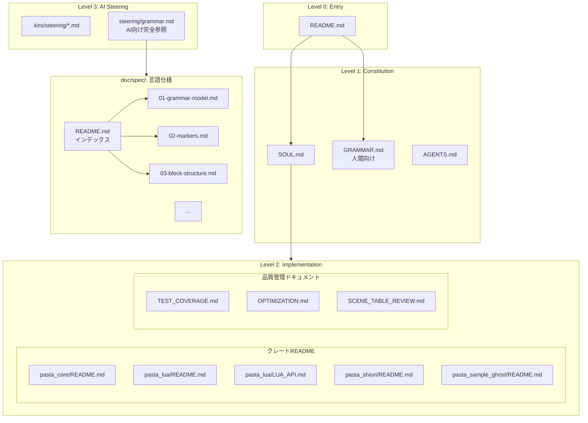
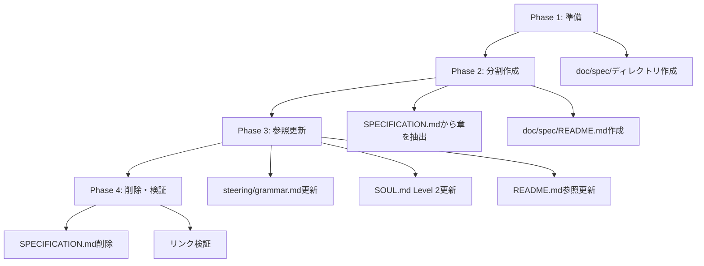

# Design Document: doc-implementation-review

## Overview

**Purpose**: pastaプロジェクトの公開ドキュメント体系を整理・更新し、実装との整合性を確保する。SPECIFICATION.mdの分割管理、ドキュメントヒエラルキーの再定義、およびsteering/grammar.mdの役割明確化を実現する。

**Users**: AI開発支援ツール（GitHub Copilot等）および人間開発者が、適切なドキュメントに効率的にアクセスできるようになる。

**Impact**: 
- AIのコンテキストサイズ最適化（~7,000トークン→~500-1,000トークン/章）
- ドキュメント重複の解消
- ヒエラルキーの明確化によるナビゲーション改善

### Goals

- SPECIFICATION.mdを`doc/spec/`配下に章別分割し、ルート版を廃止
- steering/grammar.mdをAI向け完全参照として再定義
- SOUL.mdのLevel 2に品質管理ドキュメントを追加
- 既存ドキュメントの陳腐化箇所を更新

### Non-Goals

- CHANGELOG.md作成（Phase 4まで延期）
- CONTRIBUTING.md作成（プルリクエスト発生まで延期）
- pasta.toml完全リファレンスの独立ドキュメント化（将来検討）

---

## Architecture

### Existing Architecture Analysis

現在のドキュメント体系:
- **Level 0**: README.md
- **Level 1**: SOUL.md, SPECIFICATION.md, GRAMMAR.md, AGENTS.md
- **Level 2**: クレートREADME（pasta_core, pasta_lua, pasta_shiori, pasta_sample_ghost）
- **Level 3**: .kiro/steering/*.md

**課題**:
1. SPECIFICATION.md（~28KB）全体読み込みによるコンテキスト圧迫
2. 品質管理ドキュメント（TEST_COVERAGE.md等）のヒエラルキー未定義
3. steering/grammar.mdとGRAMMAR.mdの役割混在

### Architecture Pattern & Boundary Map



**Architecture Integration**:
- **Selected pattern**: 階層的ドキュメント構造（Level 0-3）
- **Domain boundaries**: 人間向け（GRAMMAR.md） vs AI向け（steering/grammar.md）
- **New components**: `doc/spec/`配下の章別分割ファイル群
- **Steering compliance**: SOUL.md定義のヒエラルキーを拡張

### Technology Stack

| Layer         | Choice / Version | Role in Feature          | Notes             |
| ------------- | ---------------- | ------------------------ | ----------------- |
| Documentation | Markdown         | すべてのドキュメント形式 | GitHub互換        |
| Diagram       | Mermaid          | アーキテクチャ図         | README.md等で使用 |
| Structure     | doc/spec/        | 言語仕様の章別格納       | 新規ディレクトリ  |

---

## Requirements Traceability

| Requirement | Summary                    | Components                      | Interfaces    | Flows        |
| ----------- | -------------------------- | ------------------------------- | ------------- | ------------ |
| 1           | ドキュメント実装整合性評価 | gap-analysis.md                 | -             | 評価→修正    |
| 2           | 重複・冗長性検出           | steering/grammar.md, GRAMMAR.md | 役割分離      | -            |
| 3           | 欠落ドキュメント特定       | doc/spec/README.md              | -             | -            |
| 4           | ヒエラルキー整合性         | SOUL.md                         | Level 2再定義 | -            |
| 5           | クレートREADME整合性       | -                               | -             | 既に整合済み |
| 6           | 品質管理ドキュメント整合性 | TEST_COVERAGE.md                | -             | 数値更新     |
| 7           | Steeringドキュメント整合性 | steering/grammar.md             | doc/spec/参照 | -            |
| 8           | アクションプラン策定       | tasks.md                        | -             | -            |

---

## Components and Interfaces

### Summary

| Component           | Domain/Layer | Intent             | Req Coverage | Key Dependencies  | Contracts |
| ------------------- | ------------ | ------------------ | ------------ | ----------------- | --------- |
| doc/spec/README.md  | doc/spec     | 仕様書インデックス | 3, 7         | 各章ファイル (P0) | -         |
| doc/spec/01-12.md   | doc/spec     | 章別仕様書         | 7            | -                 | -         |
| steering/grammar.md | Level 3      | AI向け完全参照     | 2, 7         | doc/spec/* (P0)   | -         |
| SOUL.md             | Level 1      | ヒエラルキー定義   | 4            | -                 | -         |
| TEST_COVERAGE.md    | Level 2      | テスト数更新       | 6            | -                 | -         |

### doc/spec Layer

#### doc/spec/README.md

| Field        | Detail                                           |
| ------------ | ------------------------------------------------ |
| Intent       | 言語仕様書のインデックスおよびナビゲーションハブ |
| Requirements | 3, 7                                             |

**Responsibilities & Constraints**
- 章一覧と概要を提供
- 各章へのリンクとアクセスガイド
- AI向け：どの章を読むべきかの指針

**Dependencies**
- Outbound: doc/spec/01-*.md〜12-*.md — 各章へのリンク (P0)

**Implementation Notes**
- 章番号と内容の対応表を含める
- 「よくある参照パターン」セクションを追加

#### doc/spec/章別ファイル（01-12）

| Field        | Detail                                         |
| ------------ | ---------------------------------------------- |
| Intent       | SPECIFICATION.mdの各章を独立ファイルとして管理 |
| Requirements | 7                                              |

**Responsibilities & Constraints**
- 1章1ファイルの原則
- 章間の相互参照は相対リンクで実現
- 各ファイルは自己完結的に読める

**Files to Create**:
```
doc/spec/
├── README.md                   # インデックス
├── 01-grammar-model.md         # 章1: 文法モデルの基本原則
├── 02-markers.md               # 章2: キーワード・マーカー定義
├── 03-block-structure.md       # 章3: 行とブロック構造
├── 04-call-spec.md             # 章4: Callの詳細仕様
├── 05-literals.md              # 章5: リテラル型
├── 06-action-line.md           # 章6: アクション行
├── 07-sakura-script.md         # 章7: Sakuraスクリプト仕様
├── 08-attributes.md            # 章8: 属性
├── 09-variables.md             # 章9: 変数・スコープ
├── 10-words.md                 # 章10: 単語定義
├── 11-actor-dictionary.md      # 章11: アクター辞書
└── 12-future.md                # 章12: 未確定事項・検討中の仕様
```

**Implementation Notes**
- SPECIFICATION.mdから該当章をコピー後、ルートの削除
- 章13（参考資料）はREADME.mdに統合

### Level 3: Steering Layer

#### steering/grammar.md

| Field        | Detail                              |
| ------------ | ----------------------------------- |
| Intent       | AI向けPasta DSL完全参照ドキュメント |
| Requirements | 2, 7                                |

**Responsibilities & Constraints**
- SPECIFICATION.md（doc/spec/）準拠の完全性
- 人間向けGRAMMAR.mdとの役割分離を明確化
- 高頻度参照情報（マーカー一覧、基本パターン）を展開

**Dependencies**
- Outbound: doc/spec/* — 詳細参照 (P0)

**Implementation Notes**
- 冒頭に「このドキュメントの役割」セクション追加
- Runeブロック例をLuaブロック例に更新
- 各セクションにdoc/spec/への参照リンク追加

### Level 1: Constitution Layer

#### SOUL.md

| Field        | Detail                                         |
| ------------ | ---------------------------------------------- |
| Intent       | プロジェクト憲法・ドキュメントヒエラルキー定義 |
| Requirements | 4                                              |

**Responsibilities & Constraints**
- Level 2の定義を「実装層ドキュメント」として再定義
- 品質管理ドキュメントをLevel 2に追加

**Implementation Notes**
- ドキュメントヒエラルキーセクションを更新
- 以下の構造に変更:
  ```
  Level 0: README.md
  Level 1: SOUL.md, GRAMMAR.md, AGENTS.md
  Level 2: 実装層ドキュメント
    - クレートREADME
    - 品質管理ドキュメント（TEST_COVERAGE.md, OPTIMIZATION.md, SCENE_TABLE_REVIEW.md）
  Level 3: steering/*.md
  ```

### Level 2: Quality Layer

#### TEST_COVERAGE.md

| Field        | Detail                           |
| ------------ | -------------------------------- |
| Intent       | テストカバレッジマップの数値更新 |
| Requirements | 6                                |

**Implementation Notes**
- 総テスト数: 736（更新済み）
- 日付: 2026-02-05（更新済み）
- pasta_luaテスト数の確認・更新

---

## Data Models

本仕様はドキュメント構造の変更のみであり、データモデルの変更はない。

---

## Error Handling

本仕様は実装コードを含まないため、エラーハンドリングは不要。

ドキュメント作成時のリスク:
- **リンク切れ**: 相対パスを使用し、doc/spec/内で完結
- **内容不整合**: 章分割時にSPECIFICATION.mdの内容を正確にコピー

---

## Testing Strategy

### Document Validation

- **リンク検証**: doc/spec/内の相互リンクが有効か確認
- **内容完全性**: 分割後の全章を結合してSPECIFICATION.mdと差分比較
- **AI参照テスト**: steering/grammar.mdからdoc/spec/への参照が機能するか確認

### Regression

- 既存のドキュメントリンク（README.md等）が壊れないことを確認
- SPECIFICATION.mdへの参照をdoc/spec/README.mdへ更新

---

## Migration Strategy



### Phase 1: 準備
- `doc/spec/`ディレクトリ作成

### Phase 2: 分割作成
- SPECIFICATION.mdから各章を抽出して個別ファイル作成
- doc/spec/README.md（インデックス）作成

### Phase 3: 参照更新
- steering/grammar.mdの役割明確化・Lua例更新
- SOUL.mdのLevel 2定義更新
- README.md、AGENTS.md等のSPECIFICATION.md参照を更新

### Phase 4: 削除・検証
- ルートのSPECIFICATION.md削除
- 全リンクの検証

### Rollback Trigger
- リンク検証で重大なエラーが発生した場合、SPECIFICATION.md削除を延期
