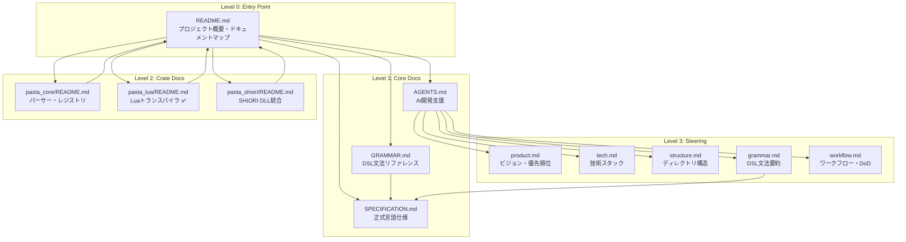

# Technical Design Document

**Feature**: documentation-consolidation  
**Date**: 2026-01-22  
**Phase**: Design Generated

---

## Overview

**Purpose**: 散在するドキュメントを統合・整理し、開発者（人間およびAI）にとって参照しやすい構造を構築する。

**Users**: 
- **DSLユーザー**: Pasta DSL の文法・使用方法を学習
- **開発者**: クレート構造・API・コーディング規約を参照
- **AI開発ツール**: AGENTS.md → ステアリング → 仕様の順で全体コンテキスト取得

**Impact**: 既存の4つのルートレベルドキュメント、5つのステアリングファイル、クレート別READMEを体系的に整備し、相互参照網を構築。

### Goals
- 孤立ドキュメント数を0件に削減
- クレートREADME網羅率を100%に達成
- ステアリング-AGENTS.md間の整合性を完全一致に
- 重複コンテンツを意図的参照のみに制限

### Non-Goals
- ユーザー向けチュートリアルの新規作成（開発者向け情報優先）
- 多言語対応（日本語のみ）
- 自動生成ドキュメント（rustdoc）の整備（別仕様）
- GRAMMAR.md の大幅削減（仕様変更リスクのため現状維持）

---

## Architecture

### Architecture Pattern & Boundary Map

本仕様はドキュメント作業であり、コードアーキテクチャへの変更はありません。ドキュメント構造のみを設計します。



**ドキュメント階層設計**:
- **Level 0**: `README.md` — 全ドキュメントへのナビゲーション
- **Level 1**: コアドキュメント — 言語仕様、文法、AI支援
- **Level 2**: クレート別ドキュメント — 各クレートの独立したREADME
- **Level 3**: ステアリング — AI/仕様駆動開発用コンテキスト

### Technology Stack

| Layer | Choice / Version | Role in Feature | Notes |
|-------|------------------|-----------------|-------|
| ドキュメントフォーマット | Markdown | 全ドキュメント記述 | GitHub/VS Code互換 |
| ダイアグラム | Mermaid | アーキテクチャ図 | コードブロック内に記述 |
| バージョン管理 | Git | ドキュメント変更追跡 | 既存ワークフロー準拠 |

---

## System Flows

### Phase 実装フロー

```mermaid
flowchart LR
    subgraph "Phase 1: 相互参照整備"
        P1A[全ドキュメント走査]
        P1B[クロスリファレンス追加]
        P1C[孤立ドキュメント解消]
    end
    
    subgraph "Phase 2: AGENTS.md再構成"
        P2A[ステアリング参照明示]
        P2B[ワークフロー詳細化]
        P2C[相互リンク追加]
    end
    
    subgraph "Phase 3: README.md拡充"
        P3A[ドキュメントマップ追加]
        P3B[オンボーディングパス追加]
        P3C[クイックスタート追加]
    end
    
    subgraph "Phase 4: クレートREADME作成"
        P4A[pasta_core/README.md作成]
        P4B[pasta_shiori/README.md作成]
        P4C[ルートREADMEからリンク]
    end
    
    subgraph "Phase 5: 保守+アーカイブ整理"
        P5A[workflow.md保守セクション追加]
        P5B[仕様アーカイブ再評価]
        P5C[旧仕様削除]
    end
    
    P1A --> P1B --> P1C
    P2A --> P2B --> P2C
    P3A --> P3B --> P3C
    P4A --> P4B --> P4C
    P5A --> P5B --> P5C
    
    P1C --> P2A
    P2C --> P3A
    P3C --> P4A
    P4C --> P5A
```



---

## Requirements Traceability

| Requirement | Summary | Components | Interfaces | Flows |
|-------------|---------|------------|------------|-------|
| 1.1, 1.2, 1.3 | ドキュメントインベントリ | DocumentInventory | - | Phase 1 |
| 2.1, 2.2, 2.3 | 階層構造定義 | DocumentHierarchy | - | Phase 3 |
| 3.1, 3.2, 3.3, 3.4 | ルートレベル整理 | RootDocuments | - | Phase 2, 3 |
| 4.1, 4.2, 4.3 | クレートREADME | CrateReadmes | - | Phase 4 |
| 5.1, 5.2, 5.3 | ステアリング最適化 | SteeringDocs | - | Phase 2 |
| 6.1, 6.2, 6.3, 6.4 | 相互参照整備 | CrossReferences | - | Phase 1 |
| 7.1, 7.2, 7.3 | オンボーディングパス | OnboardingPaths | - | Phase 3 |
| 8.1, 8.2, 8.3, 8.4, 8.5 | 保守ガイドライン | MaintenanceGuide | - | Phase 5 |

---

## Components and Interfaces

### コンポーネント概要

| Component | Domain/Layer | Intent | Req Coverage | Key Dependencies | Contracts |
|-----------|--------------|--------|--------------|------------------|-----------|
| DocumentInventory | Discovery | 全ドキュメントの現状把握 | 1.1, 1.2, 1.3 | file_search | - |
| CrossReferences | Phase 1 | 相互参照リンク整備 | 6.1, 6.2, 6.3, 6.4 | 全ドキュメント (P0) | - |
| AgentsRestructure | Phase 2 | AGENTS.md再構成 | 3.2, 5.1, 5.2, 5.3 | steering/* (P0) | - |
| ReadmeExpansion | Phase 3 | README.md拡充 | 2.1, 2.2, 2.3, 3.1, 7.1, 7.2, 7.3 | AGENTS.md (P1) | - |
| CrateReadmes | Phase 4 | クレートREADME作成 | 4.1, 4.2, 4.3 | pasta_lua/README.md (P0) | - |
| MaintenanceGuide | Phase 5 | 保守ガイドライン追加 | 8.1, 8.2, 8.3, 8.4 | workflow.md (P0) | - |
| ArchiveCleanup | Phase 5 | 仕様アーカイブ整理 | 8.5 | .kiro/specs/* (P0) | - |

---

### Phase 1: 相互参照整備

#### CrossReferences

| Field | Detail |
|-------|--------|
| Intent | 全ドキュメント間に適切なクロスリファレンスを設定し、孤立ドキュメントを解消 |
| Requirements | 6.1, 6.2, 6.3, 6.4 |

**Responsibilities & Constraints**
- 全ルートドキュメント間の相互リンク追加
- クレートREADME → ルートREADME へのバックリンク設定
- GRAMMAR.md → SPECIFICATION.md 参照強化
- AGENTS.md → steering/* への明示的リンク追加

**Dependencies**
- Inbound: なし
- Outbound: README.md, AGENTS.md, GRAMMAR.md, pasta_lua/README.md (P0)
- External: なし

**対象ドキュメントと追加リンク**:

| From | To | 追加リンク内容 |
|------|-----|---------------|
| README.md | GRAMMAR.md | 「Pasta DSL文法」セクションにリンク |
| README.md | SPECIFICATION.md | 「言語仕様」セクションにリンク |
| README.md | AGENTS.md | 「AI開発支援」セクションにリンク |
| AGENTS.md | steering/* | 「ステアリングファイル」セクションに全5ファイルへのリンク |
| GRAMMAR.md | SPECIFICATION.md | トップの権威的参照を強調、各セクションに詳細参照 |
| pasta_lua/README.md | README.md | 「プロジェクト概要」へのバックリンク |

**Implementation Notes**
- 既存リンクは維持、不足リンクのみ追加
- リンク形式: `[ドキュメント名](相対パス)`
- 孤立ドキュメント（内部ドキュメント除く）は適切な親ドキュメントからリンク

---

### Phase 2: AGENTS.md 再構成

#### AgentsRestructure

| Field | Detail |
|-------|--------|
| Intent | AI開発支援に必要な全情報へのポインタを含み、ステアリングとの関係を明示 |
| Requirements | 3.2, 5.1, 5.2, 5.3 |

**Responsibilities & Constraints**
- ステアリング参照セクションの明示的追加
- Kiro仕様駆動開発ワークフローの詳細化
- steering/*.md との相互リンク設定
- AI開発支援コンテキストの最適化

**Dependencies**
- Inbound: CrossReferences (Phase 1完了後)
- Outbound: steering/* (P0)
- External: なし

**新規セクション構成**:

```markdown
# AGENTS.md 構成案

## Overview
AI開発支援のためのプロジェクトコンテキスト概要

## Agent Persona
（既存維持）

## Project Context
### Paths
（既存維持）

### Steering Files
| ファイル | 責務 | リンク |
|---------|------|--------|
| product.md | ビジョン、フェーズ、優先順位 | [link] |
| tech.md | 技術スタック、依存関係 | [link] |
| structure.md | ディレクトリ構造、命名規則 | [link] |
| grammar.md | DSL文法要約 | [link] |
| workflow.md | 開発ワークフロー、DoD | [link] |

## Development Guidelines
（既存維持 + ステアリング参照追加）

## Minimal Workflow
（既存維持）

## Development Rules
（既存維持）

## Steering Configuration
（既存維持 + ファイル一覧明示）
```

**Implementation Notes**
- 既存セクションは維持、新規セクション追加
- ステアリングファイルテーブルは必須
- AI参照時の優先順位を明示

---

### Phase 3: README.md 拡充

#### ReadmeExpansion

| Field | Detail |
|-------|--------|
| Intent | プロジェクト概要、ドキュメントマップ、オンボーディングパスを提供するエントリーポイント |
| Requirements | 2.1, 2.2, 2.3, 3.1, 7.1, 7.2, 7.3 |

**Responsibilities & Constraints**
- ドキュメントマップセクション追加（階層構造明示）
- オンボーディングパス追加（ユーザー/開発者/AI向け）
- クイックスタートセクション追加
- プロジェクト概要の更新

**Dependencies**
- Inbound: AgentsRestructure (Phase 2完了後)
- Outbound: 全ドキュメント (P1)
- External: なし

**新規セクション構成**:

```markdown
# README.md 追加セクション案

## ドキュメントマップ

### Level 0: Entry Point
- [README.md](README.md) - プロジェクト概要（このドキュメント）

### Level 1: Core Docs
- [GRAMMAR.md](GRAMMAR.md) - Pasta DSL 文法リファレンス
- [SPECIFICATION.md](SPECIFICATION.md) - 言語仕様書（権威的ソース）
- [AGENTS.md](AGENTS.md) - AI開発支援ドキュメント

### Level 2: Crate Docs
- [pasta_core/README.md](crates/pasta_core/README.md) - パーサー・レジストリ
- [pasta_lua/README.md](crates/pasta_lua/README.md) - Luaトランスパイラ
- [pasta_shiori/README.md](crates/pasta_shiori/README.md) - SHIORI DLL統合

### Level 3: Steering
- [.kiro/steering/](./kiro/steering/) - AI/仕様駆動開発コンテキスト

## オンボーディングパス

### DSLユーザー向け
1. [GRAMMAR.md](GRAMMAR.md) - 基本文法を学ぶ
2. [examples/scripts/](examples/scripts/) - サンプルスクリプト
3. クイックスタート（下記）

### 開発者向け
1. [SPECIFICATION.md](SPECIFICATION.md) - 言語仕様の理解
2. [pasta_core/README.md](crates/pasta_core/README.md) - コアアーキテクチャ
3. [.kiro/steering/structure.md](.kiro/steering/structure.md) - プロジェクト構造
4. [.kiro/steering/workflow.md](.kiro/steering/workflow.md) - 開発ワークフロー

### AI開発支援向け
1. [AGENTS.md](AGENTS.md) - AI開発支援概要
2. [.kiro/steering/](./kiro/steering/) - ステアリングファイル群
3. [SPECIFICATION.md](SPECIFICATION.md) - 正式仕様

## クイックスタート

### 前提条件
- Rust 2024 edition
- cargo

### ビルド
\`\`\`bash
cargo build --workspace
\`\`\`

### テスト
\`\`\`bash
cargo test --workspace
\`\`\`
```

**Implementation Notes**
- 既存README.mdのアーキテクチャセクションは維持
- ドキュメントマップは階層を明示
- オンボーディングパスは3種類を明確に分離

---

### Phase 4: クレートREADME作成

#### CrateReadmes

| Field | Detail |
|-------|--------|
| Intent | 各クレートの独立したドキュメントを提供し、クレート単位での開発・保守を可能に |
| Requirements | 4.1, 4.2, 4.3 |

**Responsibilities & Constraints**
- `pasta_core/README.md` 新規作成
- `pasta_shiori/README.md` 新規作成
- pasta_lua/README.md をテンプレートとして使用
- ルートREADMEから各クレートへのリンク追加

**Dependencies**
- Inbound: ReadmeExpansion (Phase 3完了後)
- Outbound: pasta_lua/README.md (P0 - テンプレート)
- External: なし

**pasta_core/README.md 構成**:

```markdown
# pasta_core

Pasta DSL のパーサーとレジストリを提供する言語非依存層クレート。

## 概要
pasta_core は Pasta DSL の構文解析とシーン/単語テーブル管理を担当。
バックエンド（Rune/Lua）に依存しない純粋なパーサーとデータ構造を提供。

## アーキテクチャ
### レイヤー構成
- **Parser**: Pest PEG パーサーによる DSL → AST 変換
- **Registry**: シーン/単語テーブル管理
- **Error**: パースエラー型定義

## ディレクトリ構成
\`\`\`
pasta_core/
├── Cargo.toml
└── src/
    ├── lib.rs           # クレートエントリーポイント
    ├── error.rs         # ParseError, SceneTableError, WordTableError
    ├── parser/          # パーサーレイヤー
    │   ├── mod.rs       # パーサーAPI
    │   ├── ast.rs       # AST定義
    │   └── grammar.pest # Pest文法定義
    └── registry/        # 型管理レイヤー
        ├── mod.rs       # Registry API
        ├── scene_registry.rs
        ├── word_registry.rs
        ├── scene_table.rs
        ├── word_table.rs
        └── random.rs
\`\`\`

## 公開API
### Parser
- `parse_str()` - 文字列からパース
- `parse_file()` - ファイルからパース
- AST型: `PastaFile`, `Statement`, `Expr` 等

### Registry
- `SceneRegistry` - シーン管理
- `WordDefRegistry` - 単語辞書
- `SceneTable` - シーン検索（Radix Trie）
- `WordTable` - 単語検索

### Random
- `RandomSelector` - ランダム選択インターフェース
- `DefaultRandomSelector` - デフォルト実装

## 使用例
\`\`\`rust
use pasta_core::parser::parse_str;
use pasta_core::registry::SceneRegistry;

let source = r#"
＊挨拶
  Alice：こんにちは
"#;

let ast = parse_str(source)?;
let mut registry = SceneRegistry::new();
// ... 処理
\`\`\`

## 依存関係
| クレート | バージョン | 用途 |
|---------|-----------|------|
| pest | 2.8 | PEGパーサー |
| pest_derive | 2.8 | パーサー生成 |
| thiserror | 2 | エラー型定義 |
| fast_radix_trie | 1.1.0 | 前方一致検索 |
| rand | 0.9 | ランダム選択 |

## 関連クレート
- [pasta_lua](../pasta_lua/README.md) - Luaバックエンド
- [pasta_shiori](../pasta_shiori/README.md) - SHIORI DLL統合
- [プロジェクト概要](../../README.md)
```

**pasta_shiori/README.md 構成**:

```markdown
# pasta_shiori

「伺か」SHIORI DLL インターフェースを提供するクレート。

## 概要
pasta_shiori は pasta_lua を使用して SHIORI プロトコルを実装し、
従来の伺かユーザー向けのDLLインターフェースを提供。

## アーキテクチャ
### 統合構成
- **SHIORI Protocol**: SHIORI/3.0 プロトコル実装
- **Lua Runtime**: pasta_lua ランタイムとの統合
- **Windows DLL**: C FFI ラッパー

## ディレクトリ構成
\`\`\`
pasta_shiori/
├── Cargo.toml
└── src/
    ├── lib.rs           # クレートエントリーポイント
    ├── error.rs         # エラー型定義
    ├── shiori.rs        # SHIORI プロトコル実装
    ├── lua_request.rs   # Lua リクエスト処理
    ├── windows.rs       # Windows DLL エクスポート
    └── util/            # ユーティリティ
\`\`\`

## SHIORI プロトコル
### サポートイベント
- `load` - 初期化
- `unload` - 終了
- `request` - イベント処理

## 依存関係
| クレート | バージョン | 用途 |
|---------|-----------|------|
| pasta_lua | workspace | Luaランタイム |
| mlua | 0.9 | Lua FFI |

## 関連クレート
- [pasta_core](../pasta_core/README.md) - パーサー・レジストリ
- [pasta_lua](../pasta_lua/README.md) - Luaバックエンド
- [プロジェクト概要](../../README.md)
```

**Implementation Notes**
- pasta_lua/README.md のセクション構成をベースに
- 各クレートの責務に応じてセクション調整
- 最後に「関連クレート」セクションでバックリンク設定

---

### Phase 5: 保守ガイドラインとアーカイブ整理

#### MaintenanceGuide

| Field | Detail |
|-------|--------|
| Intent | ドキュメント更新ルールを策定し、品質を維持 |
| Requirements | 8.1, 8.2, 8.3, 8.4 |

**Responsibilities & Constraints**
- workflow.md に「ドキュメント保守」セクション追加
- ドキュメント更新チェックリスト作成
- API変更時の更新ルール明示

**Dependencies**
- Inbound: CrateReadmes (Phase 4完了後)
- Outbound: workflow.md (P0)
- External: なし

**workflow.md 追加セクション**:

```markdown
## ドキュメント保守

### 更新チェックリスト
コード変更時に以下を確認：

| 変更種別 | 更新対象ドキュメント |
|---------|---------------------|
| 公開API変更 | クレートREADME、SPECIFICATION.md |
| DSL文法変更 | GRAMMAR.md、steering/grammar.md |
| ディレクトリ構造変更 | steering/structure.md、クレートREADME |
| 依存関係変更 | steering/tech.md、クレートREADME |
| 開発フロー変更 | steering/workflow.md、AGENTS.md |

### 保守責任
| ドキュメント | 更新トリガー |
|-------------|-------------|
| README.md | プロジェクト概要変更、新クレート追加 |
| AGENTS.md | AI開発支援コンテキスト変更 |
| GRAMMAR.md | DSL文法変更 |
| SPECIFICATION.md | 言語仕様変更（権威的） |
| クレートREADME | クレートAPI/構造変更 |
| steering/* | 対応領域の変更 |
```

#### ArchiveCleanup

| Field | Detail |
|-------|--------|
| Intent | 古い仕様を整理し、仕様作成時のブレを防止 |
| Requirements | 8.5 |

**Responsibilities & Constraints**
- `.kiro/specs/` の全完了済み仕様を再評価
- Phase 1-4 で参照した情報の鮮度・relevance に基づき削除対象を選定
- 実装とかけ離れた旧仕様、混乱を招く古い仕様をリストアップ
- 削除実行前の最終確認
- 削除実行とコミット

**Dependencies**
- Inbound: MaintenanceGuide (同Phase内)
- Outbound: .kiro/specs/* (P0)
- External: なし

**削除判断基準**:

| 基準 | 削除対象 | 保持対象 |
|------|---------|---------|
| 実装との乖離 | 大きく乖離 | 現在の実装と整合 |
| 情報の鮮度 | 古い情報が中心 | 最新情報を反映 |
| 混乱リスク | 今後の仕様作成に混乱を招く | 参考価値あり |
| 参照頻度 | Phase 1-4 で未参照 | 有用な参照あり |

**Implementation Notes**
- 削除前に必ず開発者確認
- 削除はgit操作のため復元可能
- 完了レポート（COMPLETION_REPORT.md）は可能な限り保持

---

## Data Models

本仕様はドキュメント作業であり、データモデルの変更はありません。

---

## Error Handling

本仕様はドキュメント作業であり、エラーハンドリングの実装はありません。

**作業エラー対応**:
- リンク切れ発見時: 即時修正
- 誤情報発見時: 最新コードと照合して修正
- 構造不整合発見時: 上位ドキュメントに合わせて調整

---

## Testing Strategy

### ドキュメント品質チェック

| チェック項目 | 方法 | 合格基準 |
|-------------|------|---------|
| リンク切れ | 手動確認 or ツール | 0件 |
| 階層構造整合性 | ドキュメントマップ vs 実ファイル | 完全一致 |
| クロスリファレンス | 各ドキュメントの参照確認 | 孤立ドキュメント0件 |
| 内容整合性 | コード vs ドキュメント照合 | 乖離なし |

### 各Phase完了基準

| Phase | 完了基準 |
|-------|---------|
| Phase 1 | 全ドキュメント間のリンク設定完了、孤立ドキュメント0件 |
| Phase 2 | AGENTS.md にステアリング参照セクション追加完了 |
| Phase 3 | README.md にドキュメントマップ・オンボーディングパス追加完了 |
| Phase 4 | pasta_core, pasta_shiori のREADME.md作成完了 |
| Phase 5 | workflow.md に保守セクション追加完了、アーカイブ整理完了 |

---

## Supporting References

- [research.md](./research.md) — ディスカバリー結果と設計決定の詳細
- [gap-analysis.md](./gap-analysis.md) — 実装ギャップ分析
- [requirements.md](./requirements.md) — 要件定義
- [pasta_lua/README.md](../../crates/pasta_lua/README.md) — クレートREADMEテンプレート
