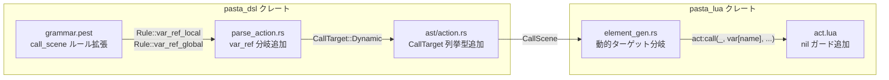

# 設計ドキュメント: dynamic-call-variable

## 概要

**目的**: Pasta DSL の動的コール構文 `＞＄変数名` を実装し、変数値に基づくシーンの動的ディスパッチを DSL レベルで実現する。

**ユーザー**: ゴースト辞書の作者が `.pasta` ファイル内で `＞＄変数名` を記述し、Lua ブロック内での `act:call()` ワークアラウンドを不要にする。

**影響**: pasta_dsl（パーサー・AST）と pasta_lua（コード生成・ランタイム）にまたがる既存コンポーネント拡張。5ファイルの外科的修正で完結する。

### ゴール
- `＞＄変数名` 構文をパーサー→AST→コード生成→ランタイムの全層で動作させる
- 静的コール `＞シーン名` と同一の前方一致検索・ランダム選択セマンティクスを適用する
- 未定義変数（nil）の安全なハンドリングを保証する
- 既存機能（静的コール・950+テスト）に一切の影響を与えない

### ノンゴール
- フィルター構文（`＆key＝value`）対応 — §4.2 により将来予約
- 動的コール専用の新しい検索セマンティクスの導入
- `ACT_IMPL.call` / `ACT_IMPL.find_scene` の構造的リファクタリング

## アーキテクチャ

### 既存アーキテクチャ分析

現行の静的コールパイプライン:

```
.pasta ファイル → [PEG Parser] → CallScene AST → [Transpiler] → Lua コード → [Runtime] act:call()
                  grammar.pest    action.rs       element_gen.rs               act.lua
```

- `call_scene` PEG ルールが `id` のみ受け付け、`var_ref` を拒否するのが根本原因
- `ACT_IMPL.call` は任意文字列の `key` を既に受け付けており、ランタイム層は構造的変更不要

### アーキテクチャパターン & 境界マップ



- **選択パターン**: 既存コンポーネント拡張（Option A）
- **ドメイン境界**: pasta_dsl（構文解析）→ pasta_lua（コード生成・実行）の既存レイヤー構成を維持
- **既存パターン維持**: `VarRef` / `VarScope` の型・解析・コード生成パターンを一貫して流用
- **新規コンポーネント**: `CallTarget` 列挙型のみ（`action.rs` 内に定義）
- **ステアリング準拠**: scope-evolution.md「スコープ拡張を分割より優先」に合致

### 技術スタック

| レイヤー | 選択 / バージョン | 本機能での役割 | 備考 |
|---------|-------------------|---------------|------|
| パーサー | Pest 2.8.6 | `call_scene` ルールに `var_ref` 代替を追加 | PEG 順序付き選択で曖昧性なし |
| AST | Rust 2024 | `CallTarget` 列挙型定義 | `VarScope` を再利用 |
| トランスパイラー | Rust 2024 | 動的ターゲット用 Lua コード生成 | 既存 `VarRef` パターン流用 |
| ランタイム | Lua 5.5 (mlua 0.11) | `ACT_IMPL.call` nil ガード | 3行追加のみ |
| テスト | insta 1.46 | スナップショットテスト追加 | 既存テストフレームワーク |

> 詳細な技術調査は [research.md](./research.md) を参照。

## 要件トレーサビリティ

| 要件 | サマリー | コンポーネント | インターフェース | フロー |
|------|---------|---------------|-----------------|--------|
| 1.1 | `＞＄変数名` パース | grammar.pest, parse_action.rs | `call_scene` PEG ルール | Parse |
| 1.2 | 半角 `>$var` 対応 | grammar.pest | `call_marker`, `var_marker` | Parse |
| 1.3 | グローバル変数 `＞＄＊var` | grammar.pest, parse_action.rs | `var_ref_global` ルール | Parse |
| 1.4 | 静的/動的コール区別 | action.rs | `CallTarget` 列挙型 | — |
| 2.1 | Lua コード生成 | element_gen.rs | `generate_call_scene()` | CodeGen |
| 2.2 | 前方一致セマンティクス維持 | （変更なし） | `ACT_IMPL.call` 既存 | Runtime |
| 3.1 | 一致シーン呼び出し | E2E テスト | — | Runtime |
| 3.2 | 複数一致時ランダム選択 | E2E テスト | — | Runtime |
| 3.3 | 不一致時の空文字列返却 | E2E テスト | — | Runtime |
| 3.4 | Lua ブロック連携 | E2E テスト | — | Runtime |
| 3.5 | nil 変数の早期リターン | act.lua | `ACT_IMPL.call` | Runtime |
| 4.1 | 静的コールの解析不変 | 回帰テスト | — | — |
| 4.2 | 静的コールの Lua 出力不変 | 回帰テスト | — | — |
| 4.3 | 全テストパス | `cargo test --all` | — | — |

## コンポーネントとインターフェース

| コンポーネント | ドメイン/レイヤー | 意図 | 要件カバレッジ | 主要依存関係 | コントラクト |
|---------------|------------------|------|--------------|-------------|-------------|
| `call_scene` PEG ルール | pasta_dsl / Parser | 動的コール構文の受理 | 1.1, 1.2, 1.3 | `var_ref` ルール (P0) | Grammar |
| `CallTarget` 列挙型 | pasta_dsl / AST | 静的/動的ターゲットの型安全な区別 | 1.4 | `VarScope` (P0) | Type |
| `parse_call_scene()` | pasta_dsl / Parser | `var_ref` ペアの AST 変換 | 1.1, 1.3, 1.4 | `CallTarget`, `VarScope` (P0) | Function |
| `generate_call_scene()` | pasta_lua / CodeGen | 動的ターゲットの Lua コード出力 | 2.1, 2.2 | `CallTarget` (P0) | Function |
| `ACT_IMPL.call` nil ガード | pasta_lua / Runtime | nil キーの安全なハンドリング | 3.5 | `log` モジュール (P1) | Guard |

### pasta_dsl / Parser

#### `call_scene` PEG ルール

| フィールド | 詳細 |
|-----------|------|
| 意図 | `＞` マーカーの後に変数参照（`＄変数名`）または静的 ID を受け付ける |
| 要件 | 1.1, 1.2, 1.3 |

**責務と制約**
- `call_scene` ルールの選択肢に `var_ref` を追加（`id` より前に配置）
- PEG 順序付き選択: `＄` で始まる入力は `var_ref` にマッチし、それ以外は `id` にフォールバック
- `var_ref` は silent rule（`=_{}`）のため、内側の `var_ref_local` / `var_ref_global` が AST ペアとして直接展開される

**文法コントラクト**
```pest
# Before
call_scene = { call_marker ~ id ~ s ~ args? }

# After
call_scene = { call_marker ~ (var_ref | id) ~ s ~ args? }
```

- 前提条件: 入力が `call_marker`（`＞` / `>`）で始まること
- 事後条件: `Rule::id` または `Rule::var_ref_local` / `Rule::var_ref_global` のいずれかのペアを含む `call_scene` ペアが生成される
- 不変条件: 既存の静的コール（`＞シーン名`）のパース結果は一切変わらない

### pasta_dsl / AST

#### `CallTarget` 列挙型

| フィールド | 詳細 |
|-----------|------|
| 意図 | コールターゲットを静的（文字列リテラル）と動的（変数参照）で型安全に区別する |
| 要件 | 1.4 |

**型定義コントラクト**
```rust
/// コールターゲットの種別。
pub enum CallTarget {
    /// 静的ターゲット: `＞シーン名` — コンパイル時確定の文字列
    Static(String),
    /// 動的ターゲット: `＞＄変数名` — 実行時に変数値を参照
    Dynamic { name: String, scope: VarScope },
}
```

- `CallScene.target` の型を `String` から `CallTarget` に変更
- `VarScope` を再利用: `Local`（`＄変数名`）、`Global`（`＄＊変数名`）
- `VarScope::Args(u8)` は文法上 `var_id` 経由で到達可能だが、セマンティクス的に「引数値をシーン名として使う」となる

**`CallScene` 構造体の変更**
```rust
pub struct CallScene {
    pub target: CallTarget,  // 旧: String
    pub args: Option<Args>,
    pub span: Span,
}
```

#### `parse_call_scene()` 拡張

| フィールド | 詳細 |
|-----------|------|
| 意図 | `call_scene` ペアから `var_ref_local` / `var_ref_global` を `CallTarget::Dynamic` に変換する |
| 要件 | 1.1, 1.3, 1.4 |

**関数コントラクト**
```rust
pub(crate) fn parse_call_scene(pair: Pair<Rule>) -> Result<CallScene, ParseError>
```

- 前提条件: `pair.as_rule() == Rule::call_scene`
- 事後条件:
  - `Rule::id` → `CallTarget::Static(name)`
  - `Rule::var_ref_local` → `CallTarget::Dynamic { name, scope: VarScope::Local }`（`digit_id` の場合は `VarScope::Args(index)`）
  - `Rule::var_ref_global` → `CallTarget::Dynamic { name, scope: VarScope::Global }`
- 既存パターン: `parse_actions()` 内の `var_ref_local` / `var_ref_global` 処理コードを流用

### pasta_lua / CodeGen

#### `generate_call_scene()` 拡張

| フィールド | 詳細 |
|-----------|------|
| 意図 | `CallTarget::Dynamic` に対して変数値を実行時評価する Lua コードを生成する |
| 要件 | 2.1, 2.2 |

**依存関係**
- インバウンド: `scope_gen.rs` — `CallScene` を渡して呼び出し (P0)
- アウトバウンド: `ACT_IMPL.call` — 生成された Lua コードが実行時に呼び出し (P0)

**コード生成コントラクト**

ターゲット種別に応じた Lua コード出力:

| ターゲット種別 | スコープ | 生成される Lua コード |
|---------------|---------|---------------------|
| `Static("シーン名")` | — | `act:call(SCENE.__global_name__, "シーン名", {}, table.unpack(args))` |
| `Dynamic { name: "target", scope: Local }` | Local | `act:call(SCENE.__global_name__, var["target"], {}, table.unpack(args))` |
| `Dynamic { name: "target", scope: Global }` | Global | `act:call(SCENE.__global_name__, save["target"], {}, table.unpack(args))` |
| `Dynamic { name: "0", scope: Args(0) }` | Args | `act:call(SCENE.__global_name__, args[1], {}, table.unpack(args))` |

- 不変条件: `CallTarget::Static` のコード生成は現行出力と完全一致（既存テスト不破壊）
- 設計判断: 動的ターゲットは `tostring()` で包まない。nil がそのまま `key` に渡り、`ACT_IMPL.call` の nil ガード（3.5）で処理される（[research.md 判断2](./research.md) 参照）

### pasta_lua / Runtime

#### `ACT_IMPL.call` nil ガード

| フィールド | 詳細 |
|-----------|------|
| 意図 | `key` が nil の場合に無意味な5段階検索を防止し、警告ログを出力する |
| 要件 | 3.5 |

**ガードコントラクト**

`ACT_IMPL.call` の先頭に nil チェックを追加:

```
入力: key == nil
動作: log.warn で警告メッセージ出力 → return nil（早期リターン）
```

- 前提条件: `ACT_IMPL.call(self, global_scene_name, key, attrs, ...)` シグネチャ不変
- 事後条件: `key == nil` 時、`find_scene()` は呼び出されない
- 不変条件: `key ~= nil` 時の動作は現行と完全一致

## エラーハンドリング

### エラー戦略

| エラーケース | 検出レイヤー | 対応 |
|-------------|------------|------|
| `＞＄` の後に有効な変数名がない | PEG パーサー | Pest のパースエラー（既存エラー報告機構で処理） |
| nil 変数の動的コール | Lua ランタイム | `ACT_IMPL.call` nil ガード → `log.warn` + `return nil` |
| 動的コール先シーンが見つからない | Lua ランタイム | 既存の `log.error` + `return nil`（変更なし） |

## テスト戦略

### スナップショットテスト（pasta_dsl）
- 動的コール `＞＄target` の AST パース結果
- 半角形式 `>$target` の AST パース結果
- グローバル変数 `＞＄＊target` の AST パース結果
- 動的コール + 引数付き `＞＄target 引数` の AST パース結果

### トランスパイラーテスト（pasta_lua）
- 動的コール（ローカル変数）の Lua コード出力
- 動的コール（グローバル変数）の Lua コード出力
- 静的コールの Lua コード出力が不変であること（回帰）

### E2E テスト
- ローカル変数によるシーン呼び出し（3.1）
- 複数候補からのランダム選択（3.2）
- 一致シーンなし時の挙動（3.3）
- Lua ブロックからの変数設定→動的コール連携（3.4）
- nil 変数時の警告ログ出力と早期リターン（3.5）

### 回帰テスト
- `cargo test --all` 全パス（4.3）
- 既存スナップショットテストの差分なし（4.1, 4.2）
