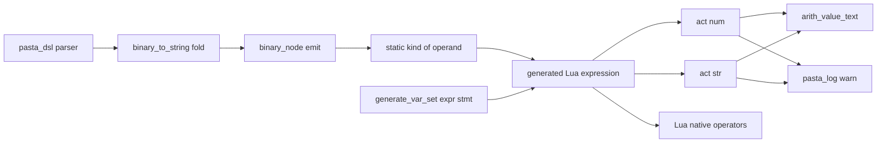
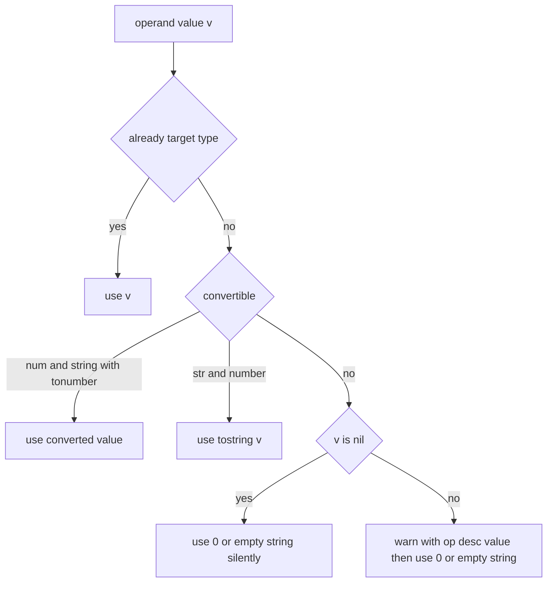

# Design Document: expr-nil-coercion

## Overview

**Purpose**: Pasta DSL の式で、算術（`＋`・`－`・`＊`・`／`・`％`）の被演算子が nil なら 0、連結（`＆`）の被演算子が nil なら空文字列 `""` とみなし、ログを出さずに評価を続ける。nil 以外の変換できない値は、従来と同じ警告を 1 行出したうえで 0・`""` とみなす。これにより `＄＊回数＝＄＊回数＋１` が、初期化の行も Lua も無しに初回から 1・2・3… と数える。

**Users**: ゴースト作者（回数・得点・好感度のような「増やしていく値」を書く人）と、入門ガイド 10 段目の読者。下流 spec `hello-pasta-tutorial-stages`・`getting-started-story-guide` がこの規則に依拠する。

**Impact**: 生成コードの形を「演算ごとに `act:arith`／`act:concat` を呼ぶ」形から、「被演算子を `PASTA.num`／`PASTA.str` に通し、演算は Lua の演算子（`+`・`-`・`*`・`/`・`%`・`..`）で行う」形に変える（開発者の案。`research.md` 5.3）。演算が「値なし」を作ることは無くなり、従来の「内側が失敗すると外側も値なし」という伝播は消える。

### Goals

- 算術の文脈の値は必ず数値、連結の文脈の値は必ず文字列になる（演算子に数値・文字列以外が届かない）。
- nil を 0・`""` とみなしたときはログを出さない。nil 以外の変換できない値の警告は、文言を含めて従来のまま。
- 変換の規則が 2 つの関数（`PASTA.num`・`PASTA.str`）だけにあり、トランスパイラーは「どの被演算子をどちらに通すか」だけを決める。
- マニュアル・スキル・テストが新しい規則に揃い、`＄＊回数＝＄＊回数＋１` の作例がそのまま動くことをテストが固定する。

### Non-Goals

- 演算子の被演算子でない位置の nil（台詞の `＄未代入`、Call のターゲットが変数 1 つ・関数呼び出し 1 つ、関数の引数に nil を 1 つだけ渡す、動的参照 `＠＄名前`）の扱いの変更。
- 「値なしを代入した変数は未代入になる」規則の変更。
- DSL の文法変更（条件分岐・`＋＝`・既定値の構文）。
- 警告の文言・出口の一本化（`failure-output-unification` の持ち場）。
- 0 による除算・剰余の数値の規則（Lua の数値演算どおり）。

## Boundary Commitments

### This Spec Owns

- 被演算子の変換の規則と、その実装 `ACT.num`・`ACT.str`（`act.lua` のモジュール関数。act のメソッドではない）と、`pasta` モジュールでの公開 `PASTA.num`・`PASTA.str`（`init.lua`）。nil は黙って 0・`""`、変換できない値は従来の文言で警告して 0・`""`。
- 二項演算の生成形（`expr_gen.rs` の `binary_node` まわり）。演算ごとに `(左 演算子 右)` を出し、被演算子を生成時に分かる種類に応じて `PASTA.num`・`PASTA.str` に通す。
- 式文 `＄＝式` の生成形のうち、式が関数呼び出しそのものでないときの形（`do local _ = 式 end`）。二項演算の式文を Lua の文として正しくするために要る。
- `ACT_IMPL.arith`・`ACT_IMPL.concat` と、その内部（`ARITH_OPS`・`arith_operand`・`concat_operand`）の撤去（設計ディスカッションで確定。呼び出し元が無くなるので手書きの Lua 向けにも残さない）。
- 上記の挙動を固定するテストと、現行挙動を固定している既存テストの更新。
- マニュアル（`grammar/variables.md`・`grammar/call-jump.md`・`lua/script-api.md`・`internals/internal-modules.md`・`internals/transpiler.md`）と、スキル（`pasta-ghost-authoring/SKILL.md`・`pasta-lua-coding/SKILL.md` の該当行、両スキルの `references/` の再生成）。

### Out of Boundary

- `ACT_IMPL.talk`（台詞の `＄未代入` は空文字＋`act:talk - undefined variable`。5.1）。
- `ACT_IMPL.call_key`・`ACT_IMPL.call`・`ACT_IMPL.failure` の振る舞い（5.2〜5.4 は既存の規則のまま成り立つ）。コードの注釈の文言だけを直す。
- `act:expr_fn`・`act:global_fn`・`act:expr_fn_var` と、その警告（3.3）。
- `WORD.dynamic_key` と動的参照（5.5）。
- 警告の出口・文言の整理（`failure-output-unification`）。`arith_value_text` は呼び出し元を変えずに使い続ける。
- パーサ（`pasta_dsl`）と、二項演算の優先順位の組み直し（`flatten_binary`・`precedence`・`binary_to_string` の畳み方）。
- 完了済み spec（`dsl-codegen-runtime-safety`・`string-concat-operator`・`call-execution-correctness`）の文書。

### Allowed Dependencies

- ランタイム: `act.lua` の既存の局所関数 `arith_value_text` と `@pasta_log`（`log.warn` だけ）。`init.lua`（`pasta`）が `pasta.act` を require する（`pasta.act` は `pasta` を require しないので循環しない）。新しいモジュール・新しいログの出口は作らない（3.2）。
- 生成コード: 生成ファイルの先頭の `local PASTA = require "pasta"`（既存。シーン関数の中からも見える）。先頭の行は変えない。
- トランスパイラー: 既存の `operand_desc`（説明の生成）・`resolve_var_path`・`StringLiteralizer`。
- テスト: 既存の `run_main_scene`（`runtime_safety_test.rs`）・`with_captured_act`（lua_specs）・`ShioriTestEnv`／`copy_fixture_to_temp`（pasta_shiori）。
- 依存の向き: `pasta_dsl`（AST）→ `pasta_lua` code_gen（生成形）→ 生成コード → `pasta_scripts/pasta/init.lua`（`PASTA.num`・`PASTA.str`）→ `pasta_scripts/pasta/act.lua`（`ACT.num`・`ACT.str`）。`act.lua` はトランスパイラーに依存しない。

### Revalidation Triggers

- `PASTA.num`・`PASTA.str` の引数の順序・戻り値の型・警告の文言を変えるとき（生成コードとマニュアルが前提にする）。
- `act:arith`・`act:concat` を撤去するとき: `failure-output-unification`（警告一覧に `act:arith - unknown operator` と `act:arith`・`act:concat` の警告を挙げている）が rebase で一覧を直す。警告の文言（`act:arith - …`・`act:concat - …`）は残るので、出口の一本化の対象は変わらない。
- 演算が nil を返さなくなったこと: `act:call_key` の「値が nil で説明も無いときは黙る」分岐は、生成コードからは届かなくなる（手書き Lua からだけ届く）。`call-execution-correctness` の規則（Call が失敗する値）は変わらない。
- 生成形の変化: 生成コードを文字列で照合する下流のテスト・文書（`hello-pasta-tutorial-stages` が生成コードを照合するなら）は新しい形で照合し直す。
- `act` のメソッドから `arith`・`concat` が消えること: `＠arith（）`・`＠concat（）` が act のメソッドに当たらなくなる（検索の 4 段目以降に進む）。変換関数は act のメソッドに足さないので、検索の 3 段目で新しく見つかる名前は無い（設計ディスカッション #1）。

## Architecture

### Existing Architecture Analysis

- パーサは優先順位を付けずに左結合の二項木を作り、`expr_gen.rs` の `binary_to_string` が項と演算子の列に戻して `＊／％` → `＋－` → `＆` の順に畳む。演算ごとの生成形は `binary_node` だけが決め、被演算子の説明は `operand_desc` だけが決める（説明は変数なら `var.x`／`save.x`／`args[n]`、関数呼び出しなら `@f()`／`@*f()`／`@$var.f()`、括弧は中身の説明、リテラルと入れ子の演算は無し）。
- 現行の `ACT_IMPL.arith(op, l, r, ld, rd)` は両方を `arith_operand` で数値にできれば `ARITH_OPS[op]` を適用し、できなければ警告して nil を返す。`ACT_IMPL.concat` も同じ形。nil で説明も無い被演算子は「内側の失敗の伝播」として黙る。
- 式を書ける位置（変数代入の右辺・式文・関数呼び出しの引数・Call の引数・動的コールのターゲット・プロパティ代入の右辺）は、すべて `generate_expr`／`expr_to_string` を通る。二項演算の生成形を `binary_node` で変えれば、全位置に同じく効く（1.4・2.4）。
- 式文 `＄＝式` は式をそのまま 1 行に書く（`element_gen.rs` の `generate_var_set`）。現行は二項演算が関数呼び出し（`act:concat(…)`）なので Lua の文として正しい。演算子の形に変えると `(a .. b)` だけの行になり、Lua の文にならない。さらに `(` で始まる行は直前の行の続き（関数呼び出し）として読まれる（設計時の実験で確認。`research.md` 6.2）。
- `act` のメソッドは `＠名前（…）`・`＠名前` の検索の 3 段目で見つかる（`find_act_handler` の L3。`ACT_IMPL.__index` が `ACT_IMPL` の関数を返す）。メソッド名を足すと、その名前の `GLOBAL` 関数・グローバルシーンに `＠名前` では届かなくなる。`ACT` モジュール表と `PASTA` は検索されない。そこで変換関数は act のメソッドにせず、`PASTA` に置く（設計ディスカッション #1）。

### Architecture Pattern & Boundary Map

選んだ形: **被演算子ごとの変換関数＋ネイティブ演算子**（開発者の案。比較は `research.md` 6.4）。



- **境界**: 変換の規則（何を 0・`""` にし、何で警告するか）は `act.lua` の `num`・`str` だけが持つ。トランスパイラーは「どの被演算子をどちらに通すか」と「演算子をどう並べるか」だけを持つ。両者の接点は `PASTA.num(op, 値[, 説明])`・`PASTA.str(値[, 説明])` の 2 つの呼び出し形だけである。
- **残す型**: 優先順位の畳み方、説明の生成、`arith_value_text`、警告の文言。
- **新しい部品の理由**: `num`・`str` は「文脈の値は必ず数値・文字列」という要件（4.5）を、そのまま 1 つの関数の事後条件にする。生成時の種類（`StaticKind`）は、すでに数値・文字列と分かっている被演算子（数値リテラル・文字列リテラル・入れ子の演算）に変換の呼び出しを付けないために要る。
- **Steering との整合**: 「書き間違いを 500 にしない」（演算子に届く値は必ず数値・文字列）を保つ。新しい警告・ログの出口を作らない。

### Technology Stack

| Layer | Choice / Version | Role in Feature | Notes |
|-------|------------------|-----------------|-------|
| Transpiler | Rust 2024 / `pasta_lua` code_gen | 二項演算と式文の生成形 | 新しい依存なし |
| Runtime | LuaJIT 2.1（mlua 0.11、`luajit52`） | `PASTA.num`・`PASTA.str` とネイティブ演算 | `tostring(0/0)` は `nan`、`1/0` は `inf`、`0*-1` は `-0`（Windows で確認） |
| Tests | lua_test（lua_specs）・cargo test・insta 1.47 | 規則と生成形の固定 | スナップショット 4 件を更新 |
| Docs | mdBook・`book/tools/gen-skill-refs.mjs`・`link-check.mjs` | マニュアルとスキル references | 再生成と照合 |
| Lint | luacheck v1.2.0（`max_cyclomatic_complexity = 15`） | `act.lua` の静的解析 | `num`・`str` の分岐は 5 以下 |

## File Structure Plan

### Modified Files

ランタイム:
- `crates/pasta_lua/pasta_scripts/pasta/act.lua` — モジュール関数 `ACT.num`・`ACT.str` を足す（`arith_value_text` の直後。`ACT_IMPL` には置かない）。`ACT_IMPL.arith`・`ACT_IMPL.concat`・`ARITH_OPS`・`arith_operand`・`concat_operand` を消す。`ACT_IMPL.call_key` の注釈のうち「内側の演算が警告済み」の文言を「手書きの Lua から nil を渡したとき」に直す（振る舞いは変えない）。

- `crates/pasta_lua/pasta_scripts/pasta/init.lua` — `pasta.act` を require し、`PASTA.num = ACT.num`・`PASTA.str = ACT.str` を公開する（`create_actor` などと同じリダイレクトの形）。

トランスパイラー:
- `crates/pasta_lua/src/code_gen/expr_gen.rs` — 被演算子を `(コード, 説明, 種類)` で運び、`binary_node` が `(左 演算子 右)` を出す。被演算子を `PASTA.num`・`PASTA.str` に通すかを種類で決める。`flatten_binary`・`precedence`・`binary_to_string` の畳み方と `operand_desc` は変えない。
- `crates/pasta_lua/src/code_gen/element_gen.rs` — `generate_var_set` の式文で、式が関数呼び出しそのもの（`FnCall`・`DynamicFnCall`）でなければ `do local _ = 式 end` を出す。

テスト（Rust）:
- `crates/pasta_lua/src/code_gen/expr_gen_tests.rs` — 生成形の期待を新しい形に直し、種類による包み方・演算子の前後の空白・説明の渡し方のケースを足す。
- `crates/pasta_lua/src/code_gen/element_gen_tests.rs` — 動的コールのキーの期待（370 行付近）と、式文の `do local _ = … end` のケース。
- `crates/pasta_lua/tests/transpiler/runtime_safety_test.rs` — `RUNTIME_SAFETY_SOURCE` の期待（`x=1`・`y=0`・台詞 `1`・警告の一覧）、`test_concat_failures_warn_and_yield_nil` の書き直し、nil の出どころと位置を網羅する新しいテスト、全レベルのログを集める補助。`ARITH_CASES`・`CONCAT_CASES` はそのまま残す（組み直しの関門）。
- `crates/pasta_lua/tests/transpiler/snapshots/transpiler__runtime_safety_test__runtime_safety.snap`、`…__dynamic_word_ref_test__dynamic_word_ref.snap`、`…__final_regression_test__r7_1_off_path__fixture_sample.snap`、`…__snapshot_test__dynamic_call_binary_expr.snap` — 生成形の更新（差分は二項演算の行だけ）。
- `crates/pasta_lua/tests/fixtures/sample.expected.lua` — 90 行の生成形。
- `crates/pasta_lua/tests/transpiler/dynamic_word_ref_test.rs`（101 行）・`crates/pasta_lua/tests/property_scope_codegen_test.rs`（140・160 行）・`crates/pasta_lua/tests/transpiler/source_map_seam_test.rs`（191・192 行） — 生成形を照合する文字列。
- `crates/pasta_shiori/tests/codegen_runtime_safety_e2e_test.rs` と `crates/pasta_shiori/tests/fixtures/codegen_runtime_safety/dic/runtime_safety.pasta` — `OnTypoCheck`（U22 は `結果0`）・`OnConcatUnassigned`（警告なし）・`OnConcatNilShow`（`さん` を話す）の期待、回数の作例と再起動のシーン・テスト（1.7・6.5）。
- `crates/pasta_shiori/tests/call_execution_correctness_e2e_test.rs` と `crates/pasta_shiori/tests/fixtures/call_execution_correctness/dic/failed_call.pasta` — `OnFcConcatMid`（`＞＄未代入＆「x」` は `x` を探して「見つからない」の失敗表記）と、5.3・5.4 のシーン。

テスト（Lua）:
- `crates/pasta_lua/tests/lua_specs/act_runtime_safety_test.lua` — `act:arith` の describe を `PASTA.num` の describe に置き換える（数値化の範囲の表のテストは `PASTA.num` で残す）。
- `crates/pasta_lua/tests/lua_specs/act_concat_test.lua` — `act:concat` の describe を `PASTA.str` の describe に置き換える。ファイル名と `init.lua` の登録は変えない（`init.lua` の注釈だけ直す）。
- `crates/pasta_lua/tests/lua_specs/init.lua` — 66 行の注釈。

マニュアル:
- `book/src/grammar/variables.md` — 「算術の評価」「連結の評価」（規則・作例・被演算子の値ごとの表）、「DSL と Lua の対応表」の算術・連結の行と説明。110 行の補足（関数呼び出しが式で値なしになる記述）は、関数呼び出しを演算子なしで書いた場合の記述として正しいままなので変えない（確認のみ）。
- `book/src/grammar/call-jump.md` — 99 行の「値なしになった演算」、失敗の表の「それ以外の式」の行、116 行の補足。
- `book/src/lua/script-api.md` — 「アクター・グローバル関数・算術・連結」の表と `arith`・`concat` の節を消し、`pasta` モジュールの関数として `PASTA.num`・`PASTA.str` の節を置く。`call_key` の節（361 行付近）の「内側の `act:arith`・`act:concat` が…」の括弧書き。
- `book/src/internals/internal-modules.md` — 「生成コード用のメソッド」の見出しと `arith`・`concat` の項。
- `book/src/internals/transpiler.md` — 223〜236 行の生成形と説明の段落。

スキル（実装時に自動モードの分類器に止められることがあるため、独立した最後の手順に置く）:
- `.claude/skills/pasta-ghost-authoring/SKILL.md` — 178・179 行（算術・連結の行）。
- `.claude/skills/pasta-lua-coding/SKILL.md` — 110 行（`pasta.act` の主なメソッドの `act:arith()`・`act:concat()`）。
- `.claude/skills/pasta-ghost-authoring/references/variables.md`・`call-jump.md`、`.claude/skills/pasta-lua-coding/references/script-api.md`・`internal-modules.md` — `node book/tools/gen-skill-refs.mjs` で再生成する（手で直さない）。

新しいファイルは作らない。

## System Flows

被演算子 1 つの扱い（実行時）:



- 「すでに目的の型」は、`num` では `number`、`str` では `string`。
- 生成時に数値・文字列と分かっている被演算子は、そもそも `PASTA.num`・`PASTA.str` を通らない（下の「生成時の種類」）。
- 警告は被演算子ごとに 1 行。入れ子の演算は必ず数値・文字列を返すため、外側で警告が重なることも、外側が値なしになることも無い（1.5・2.3）。

## Requirements Traceability

| Requirement | Summary | Components | Interfaces | Flows |
|-------------|---------|------------|------------|-------|
| 1.1 | 算術の nil は出どころを問わず 0 | ActOperandConversion, BinaryEmitter | `PASTA.num` | 被演算子の扱い |
| 1.2 | 5 演算子・左右とも | BinaryEmitter | `(左 op 右)` | — |
| 1.3 | 除数の nil は 0 除算と同じ（`inf`・`nan`） | ActOperandConversion（0 を返す）、Lua の `/`・`%` | `PASTA.num` | — |
| 1.4 | 式を書けるすべての位置 | BinaryEmitter, ExprStmtEmitter | `generate_expr` 経由 | — |
| 1.5 | 内側の演算は数値として外側に使う | BinaryEmitter（種類 Number は包まない）, ActOperandConversion | — | 被演算子の扱い |
| 1.6 | 値なしを代入した変数も 0 | ActOperandConversion（nil を区別しない） | `PASTA.num` | — |
| 1.7 | 再起動後も保存値から数える | 既存の `@pasta_persistence`、E2E テスト | — | — |
| 1.8 | 数値・数字だけの文字列の結果は不変 | ActOperandConversion（`tonumber` の範囲は不変）, BinaryEmitter | `PASTA.num` | — |
| 2.1 | 連結の nil は `""` | ActOperandConversion, BinaryEmitter | `PASTA.str` | 被演算子の扱い |
| 2.2 | 括弧の算術の結果を連結 | BinaryEmitter（種類 Number は `PASTA.str` に通す） | `PASTA.str` | — |
| 2.3 | 内側の変換できない値は内側の警告 1 行で外側に使う | ActOperandConversion, BinaryEmitter | `PASTA.str`・`PASTA.num` | — |
| 2.4 | 連結を書けるすべての位置 | BinaryEmitter, ExprStmtEmitter | — | — |
| 2.5 | 文字列・数値の連結結果は不変 | ActOperandConversion（`tostring`） | `PASTA.str` | — |
| 3.1 | nil の 0・`""` はログなし | ActOperandConversion | `PASTA.num`・`PASTA.str` | 被演算子の扱い |
| 3.2 | 新しい警告の種類・出口を増やさない | ActOperandConversion（既存の文言・`log.warn` のみ） | — | — |
| 3.3 | 関数が見つからない等の既存警告は不変 | 範囲外（`expr_fn`・`global_fn`・`expr_fn_var` を触らない） | — | — |
| 4.1 | 算術の変換できない値は警告 1 行＋0 | ActOperandConversion | `PASTA.num` | 被演算子の扱い |
| 4.2 | 連結の変換できない値は警告 1 行＋`""` | ActOperandConversion | `PASTA.str` | 被演算子の扱い |
| 4.3 | 警告の文言・情報は不変 | ActOperandConversion（`op`・説明・`arith_value_text`） | 警告の文言 | — |
| 4.4 | 空文字列は nil ではなく変換できない値 | ActOperandConversion（`tonumber("")` は nil → 警告） | `PASTA.num` | — |
| 4.5 | 演算子には数値・文字列だけが届く | ActOperandConversion（事後条件）, BinaryEmitter（包み方の規則） | `PASTA.num`・`PASTA.str` | — |
| 5.1 | 台詞の `＄未代入` は不変 | 範囲外（`ACT_IMPL.talk`） | — | — |
| 5.2 | Call のターゲットが変数 1 つ・関数 1 つの nil は不変 | 範囲外（`call_key` の生成形・実行時） | — | — |
| 5.3 | 連結・算術のターゲットは評価結果で検索 | BinaryEmitter（結果は必ず文字列・数値）、既存 `call_key` | `act:call_key` | — |
| 5.4 | 連結結果が `""` なら従来どおり失敗 | 既存 `call_key` | `act:call_key` | — |
| 5.5 | 値なし代入・引数の nil・動的参照は不変 | 範囲外 | — | — |
| 6.1 | variables.md の規則と作例 | ManualSync | — | — |
| 6.2 | call-jump.md の失敗の表 | ManualSync | — | — |
| 6.3 | script-api.md・internal-modules.md・transpiler.md | ManualSync | — | — |
| 6.4 | スキルの行と references の再生成 | SkillSync | `gen-skill-refs.mjs` | — |
| 6.5 | 入門ガイド 10 段目の作例が 1・2 と数え警告なし | E2E テスト（回数の作例） | — | — |
| 7.1 | ランタイムとトランスパイル→実行の両方で固定 | RuntimeTests, TranspileRunTests | — | — |
| 7.2 | 4・5 を固定 | RuntimeTests, TranspileRunTests, E2E テスト | — | — |
| 7.3 | 既存テストの矛盾する期待を残さない | 既存テストの更新（File Structure Plan） | — | — |
| 7.4 | ワークスペース全体のテストとマニュアル検証が通る | 全体（検証手順） | — | — |

## Components and Interfaces

| Component | Domain/Layer | Intent | Req Coverage | Key Dependencies (P0/P1) | Contracts |
|-----------|--------------|--------|--------------|--------------------------|-----------|
| ActOperandConversion（`ACT.num`・`ACT.str`） | Runtime（`act.lua`） | 被演算子を必ず数値・文字列にする | 1.1, 1.3, 1.6, 1.8, 2.1, 2.5, 3.1, 3.2, 4.1–4.5 | `arith_value_text` (P0), `@pasta_log` (P0) | Service |
| BinaryEmitter（`binary_node` と被演算子の種類） | Transpiler（`expr_gen.rs`） | 演算子の式を出し、被演算子を `num`・`str` に通す | 1.2, 1.4, 1.5, 2.2–2.4, 4.5, 5.3 | `operand_desc` (P0), `binary_to_string` (P0) | Service |
| ExprStmtEmitter（式文の形） | Transpiler（`element_gen.rs`） | 式文を Lua の文として正しく出す | 1.4, 2.4 | `generate_expr` (P0) | Service |
| ArithConcatRetirement | Runtime（`act.lua`） | 呼び出し元の無くなった `arith`・`concat` を消す | 4.5（演算子に届く値の一本化） | なし | — |
| RuntimeTests・TranspileRunTests・E2E テスト | Tests | 規則・境界・作例を固定する | 1.x, 2.x, 3.x, 4.x, 5.x, 6.5, 7.x | `run_main_scene`, `with_captured_act`, `ShioriTestEnv` (P0) | — |
| ManualSync | Docs | マニュアルを新しい規則と生成形に揃える | 6.1–6.3 | — | — |
| SkillSync | Docs（`.claude/skills`） | スキルの手書き行と references を揃える | 6.4 | `gen-skill-refs.mjs` (P0) | — |

### Runtime

#### ActOperandConversion

| Field | Detail |
|-------|--------|
| Intent | 算術・連結の被演算子を、必ず数値・文字列にして返す |
| Requirements | 1.1, 1.3, 1.6, 1.8, 2.1, 2.5, 3.1, 3.2, 4.1, 4.2, 4.3, 4.4, 4.5 |

**Responsibilities & Constraints**
- 変換の規則の唯一の持ち主。トランスパイラーは規則を知らない。
- act のメソッドではない（`self` を取らない）。ACT の状態（`token` など）を読み書きしない。
- 表の値に `__add`・`__concat`・`__tostring` などがあっても呼ばない（`type` で判定し、表に `tostring` しない）。
- ログは `log.warn` だけ。nil のときは何も出さない。

**Dependencies**
- Outbound: `arith_value_text` — 警告の `value=` の表記（P0）
- External: `@pasta_log` — `warn`（P0）

**Contracts**: Service [x] / API [ ] / Event [ ] / Batch [ ] / State [ ]

##### Service Interface

```lua
--- 算術の被演算子を数値にする（算術式の生成コードが PASTA.num として呼ぶ）
--- @param op "+"|"-"|"*"|"/"|"%" 警告に出す演算子
--- @param v any 被演算子の値
--- @param desc string|nil 警告に出す被演算子の説明（"var.x"・"@f()" など）
--- @return number
function ACT.num(op, v, desc) end

--- 連結の被演算子を文字列にする（連結式の生成コードが PASTA.str として呼ぶ）
--- @param v any 被演算子の値
--- @param desc string|nil 警告に出す被演算子の説明
--- @return string
function ACT.str(v, desc) end
```

`num` の規則:

| 値 | 戻り値 | ログ |
| -- | ------ | ---- |
| `number` | そのまま | なし |
| `string` で `tonumber` が数値を返す | その数値 | なし |
| `nil` | `0` | なし |
| それ以外（数字でない文字列・`""`・全角数字・真偽値・表・関数） | `0` | `act:arith - operand is not a number: op='<op>', [operand='<desc>', ]value=<arith_value_text(v)>` を 1 行 |

`str` の規則:

| 値 | 戻り値 | ログ |
| -- | ------ | ---- |
| `string` | そのまま | なし |
| `number` | `tostring(v)` | なし |
| `nil` | `""` | なし |
| それ以外（真偽値・表・関数） | `""` | `act:concat - operand is not a string or number: op='&', [operand='<desc>', ]value=<arith_value_text(v)>` を 1 行 |

- Preconditions: なし（どんな値でも受け取る）。
- Postconditions: `type(num(...)) == "number"`、`type(str(...)) == "string"`。Lua のエラーを投げない。
- Invariants: 警告の文言は現行の `arith_operand`・`concat_operand` と一字一句同じ（4.3）。接頭辞は関数名ではなく演算の種類（`act:arith`・`act:concat`）を表すものとして残す。

**Implementation Notes**
- Integration: `arith_value_text` の直後に置く。`ACT_IMPL.arith`・`ACT_IMPL.concat` を消すと `ARITH_OPS` も不要になる。
- Validation: luacheck の複雑度（しきい値 15）に対し、各関数の分岐は 4〜5。
- 公開: `init.lua` で `PASTA.num`・`PASTA.str` に載せる。act のメソッドではないので、`＠名前` の検索とはぶつからない。

### Transpiler

#### BinaryEmitter

| Field | Detail |
|-------|--------|
| Intent | 二項演算を Lua の演算子の式にし、被演算子を種類に応じて `PASTA.num`・`PASTA.str` に通す |
| Requirements | 1.2, 1.4, 1.5, 2.2, 2.3, 2.4, 4.5, 5.3 |

**Responsibilities & Constraints**
- 演算ごとに `(左 演算子 右)` を出す。すべての演算を括弧で囲むため、Lua の優先順位・結合に頼らない（畳み方は既存の `binary_to_string` のまま）。
- 演算子の前後に必ず空白を 1 つ置く（`(10 - -3)`。`--` が Lua のコメントになるのを防ぐ）。
- 被演算子の種類（生成時に分かるもの）で、変換の呼び出しを付けるかを決める。

```rust
/// 被演算子の値の種類のうち、生成時に分かるもの
#[derive(Clone, Copy, Debug, PartialEq, Eq)]
enum StaticKind {
    /// 数値リテラル・算術の演算（結果は必ず数値）
    Number,
    /// 文字列リテラル・空文字列・連結の演算（結果は必ず文字列）
    String,
    /// 変数参照・関数呼び出し・動的関数呼び出し（実行時まで分からない）
    Unknown,
}

/// 1 つの項
struct Operand {
    code: String,          // Lua の式
    desc: Option<String>,  // 警告用の説明（文字列リテラル）。operand_desc の結果
    kind: StaticKind,      // 括弧は中身の種類
}

/// 1 回の演算。結果の種類は算術なら Number、連結なら String。説明は持たない
fn binary_node(op: BinOp, lhs: Operand, rhs: Operand) -> Operand;
```

包み方の規則:

| 文脈 | 種類 | 生成形 |
| ---- | ---- | ------ |
| 算術（`+ - * / %`） | Number | そのまま |
| 〃 | String・Unknown | `PASTA.num("<op>", <code>)`、説明があれば `PASTA.num("<op>", <code>, <desc>)` |
| 連結（`..`） | String | そのまま |
| 〃 | Number・Unknown | `PASTA.str(<code>)`、説明があれば `PASTA.str(<code>, <desc>)` |

- 連結の Number を `PASTA.str` に通すのは、要件 4.5（連結の値は必ず文字列にしてから演算する）を文字どおりに守り、数値の表記を `str`（`tostring`）の 1 か所に寄せるため（設計ディスカッションで確定）。
- 関数呼び出しの被演算子には必ず説明があるので、値は変換の呼び出しの最後の引数にならない。関数が複数の値を返しても、先頭の 1 つだけが渡る。

生成形の例:

| DSL | Lua |
| --- | --- |
| `＄＊回数＝＄＊回数＋１` | `save.回数 = (PASTA.num("+", save.回数, "save.回数") + 1)` |
| `＄b＝1＋2＊＄y` | `var.b = (1 + (2 * PASTA.num("*", var.y, "var.y")))` |
| `＄c＝（＄x＋1）＊2` | `var.c = (((PASTA.num("+", var.x, "var.x") + 1)) * 2)` |
| `＄n＝「1」＋2` | `var.n = (PASTA.num("+", "1") + 2)` |
| `＄表示＝「合計」＆＄n＆「個」` | `var.表示 = (("合計" .. PASTA.str(var.n, "var.n")) .. "個")` |
| `＄s＝「合計」＆＄a＋＄b` | `var.s = ("合計" .. PASTA.str((PASTA.num("+", var.a, "var.a") + PASTA.num("+", var.b, "var.b"))))` |
| `＄n＝（「1」＆「2」）＋1` | `var.n = (PASTA.num("+", (("1" .. "2"))) + 1)` |
| `＄z＝＠＄f（）＋1` | `var.z = (PASTA.num("+", act:expr_fn_var(var.f, "var.f"), "@$var.f()") + 1)` |
| `＞＄種類＆「_挨拶」` | `… act:call_key((PASTA.str(var.種類, "var.種類") .. "_挨拶")) …` |
| `＄＊g＝＠関数（2＋1）` | `save.g = act:expr_fn("関数", (2 + 1))` |

**Implementation Notes**
- Integration: `binary_operand` が `Operand` を返すようにし、`operand_desc` に並べて種類を返す小さな関数を置く。`binary_to_string` の畳み方は変えない。
- Validation: `ARITH_CASES`・`CONCAT_CASES`（組み直した式の値が平らな Lua 式と一致し、警告が無い）をそのまま関門にする。
- Risks: 生成形を照合するテスト・文書が広く変わる（File Structure Plan に棚卸し済み）。

#### ExprStmtEmitter

| Field | Detail |
|-------|--------|
| Intent | 式文 `＄＝式` を Lua の文として正しく出す |
| Requirements | 1.4, 2.4 |

- 式が関数呼び出しそのもの（`Expr::FnCall`・`Expr::DynamicFnCall`）なら、現行どおり式をそのまま 1 行に書く（`act:expr_fn("副作用関数")`）。
- それ以外（二項演算・括弧・リテラル・変数参照）は `do local _ = <式> end` を書く。`do` で始まるので直前の行の続きとして読まれず、`local` は `do … end` の中に閉じるのでシーン関数のローカル変数の上限（200）を消費し続けない。
- 例: `＄＝＄未代入＆「x」` → `do local _ = (PASTA.str(var.未代入, "var.未代入") .. "x") end`。
- 括弧・リテラル・変数参照の式文にも同じ形を使う（設計ディスカッション #2 で確定）。`＄＝１`・`＄＝＄x`・`＄＝（＠f（））` は現行でも不正な Lua を出す潜在的な欠陥で（`research.md` 6.2）、本仕様で一緒に直す。直したことは生成形のテストと、トランスパイル→実行のテスト（読み込みが通り、`＄＝（＠f（））` の副作用が 1 回だけ起きる）で固定する。

### Runtime（撤去）

#### ArithConcatRetirement

- 生成コードが `act:arith`・`act:concat` を呼ばなくなるため、`ACT_IMPL.arith`・`ACT_IMPL.concat`・`ARITH_OPS`・`arith_operand`・`concat_operand` を消す。`act:arith - unknown operator` の警告も消える（DSL からは届かない経路だった）。
- 手書きの Lua 向けにも残さない（設計ディスカッションで確定）。残すと、呼び出し元の無い公開 API とそのテスト・文書が残る。

### Tests・Docs

- RuntimeTests・TranspileRunTests・E2E テスト: 詳細は Testing Strategy。
- ManualSync: マニュアルは「規則」と「作例」を分け、回避の書き方（レシピ）は載せない。作例は、nil を 0・`""` とみなす例、変換できない値の例（`「abc」＊２` は警告と 0）、空文字列の境界（`＄x＝「」` のあとの `＄x＋１` は警告と 1）、除数の nil（`１／＄未代入` は `inf`、`１％＄未代入` は `nan`）、nil の扱いは書いた場所で決まること（算術の被演算子・連結の被演算子・台詞）を書く（6.1）。call-jump.md は「それ以外の式」の値なしの行と 116 行の補足を消し、`＞＄時間帯＆「の挨拶」` が `の挨拶` を探すことと、`＞＄未代入＆＄未代入２` が空文字列の失敗になることを書く（6.2）。
- SkillSync: 手書きの 3 行（`pasta-ghost-authoring/SKILL.md` 178・179 行、`pasta-lua-coding/SKILL.md` 110 行）を直し、`node book/tools/gen-skill-refs.mjs` で references を再生成し、`--check` と `link-check.mjs` を通す。

## Error Handling

### Error Strategy

- 演算子に届く値は必ず数値・文字列なので、式の評価で Lua の実行時エラーは起きない（4.5）。0 による除算・剰余は Lua の数値の規則どおり `inf`・`-inf`・`nan` になり、エラーにしない（1.3）。
- 書き間違いの検出は 2 か所に残る: (1) 関数が見つからないときの呼び出し時点の警告（3.3、変更なし）、(2) nil 以外の変換できない値の警告（4.1・4.2、文言は不変）。
- nil を黙って 0・`""` にするのは仕様（3.1）。未代入の変数名の書き間違い（`＄回数` と `＄回すう`）はログに出なくなる。これは要件ディスカッションで受け入れた帰結である。

### Monitoring

- ログの種類・出口は増やさない（3.2）。警告は `log.warn` の既存の 2 文言だけ。

## Testing Strategy

### Unit Tests（lua_specs、`with_captured_act`）

1. `PASTA.num` — 数値はそのまま、数値化の範囲の表（`"0x10"`・`" 1 "`・`"1e2"` は数値、`"１２"`・`""`・`"abc"`・`"1a"` は 0＋警告 1 行）がネイティブの `s + 0` の成否と一致する（1.8・4.1・4.4）。
2. `PASTA.num` — nil は説明の有無にかかわらず 0 でログなし（`warn` も `debug` も数える）。真偽値・表・関数は 0＋現行と同じ文言の警告。表の `__add`・`__tostring` を呼ばない（3.1・4.1・4.3・4.5）。
3. `PASTA.str` — 文字列はそのまま、数値は `tostring`（`3`・`3.5`・`0.33333333333333`・`1e+15`・`inf`）。nil は `""` でログなし。真偽値・表・関数は `""`＋現行と同じ文言の警告。`__concat`・`__tostring` を呼ばない（2.1・2.5・3.1・4.2・4.3）。
4. 戻り値の型が常に `number`・`string` であること（4.5）。

### Unit Tests（Rust、code_gen）

1. `binary_node` の包み方: 数値リテラルと算術の演算は包まない、文字列リテラル・連結の演算・変数・関数は `PASTA.num` で包む、連結では文字列リテラル・連結の演算だけ包まない（4.5）。
2. 説明の渡し方: 説明があるときだけ第 3（`num`）・第 2（`str`）引数が付く。括弧は中身の説明・種類。
3. 演算子の前後の空白（`(10 - -3)`）と、すべての演算が括弧で囲まれること。
4. 式文: 関数呼び出しはそのまま、二項演算・括弧・リテラル・変数参照は `do local _ = … end`（1.4・2.4）。`＄＝１`・`＄＝＄x`・`＄＝（＠f（））` の生成コードが Lua として読み込めること（潜在的な欠陥の修正の固定）。

### Integration Tests（トランスパイル→実ランタイム、`runtime_safety_test.rs`）

1. nil の出どころ × 文脈: 未代入のローカル・グローバル・リクエスト変数（`var.` 側）、渡されていないシーン引数（`＞サブ` から呼んだシーンの `＄０＋１`）、値を返さない Lua 関数、見つからない `＠＊未定義（）`（`global_fn` の警告 1 行だけ）、`＠＄未代入（）`（`undefined variable` の警告 1 行だけ）、値なしを代入した変数（1.1・1.6・2.1・3.3・7.1）。各ケースで結果と、全レベルのログ（`trace`〜`error`）を集めて nil 由来のログが 0 件であること（3.1）。
2. 5 演算子と左右: `１－＄未代入`=1、`＄未代入＊２`=0、`＄未代入－１`=-1、`＄未代入％３`=0、`１／＄未代入`=`inf`、`１％＄未代入` は `nan`（`v ~= v`）（1.2・1.3）。
3. 位置: 変数代入・式文・関数呼び出しの引数・Call の引数・動的コールのターゲットで同じ結果（プロパティ代入は生成形のテストで確認）（1.4・2.4）。
4. 入れ子と境界: `（「abc」＊２）＋１` は 1＋警告 1 行、`「合計」＆（＄未代入＋１）` は `合計1`、`「a」＆（＠真（）＆「b」）` は `ab`＋警告 1 行、`（＄未代入＆「x」）＋1` は 1＋`act:arith` の警告 1 行（`value='x' (string)`）、`＄x＝「」` のあとの `＄x＋１` は 1＋警告 1 行、表を返す関数の `＋`・`＆` でメタメソッドが呼ばれない（1.5・2.2・2.3・4.4・4.5）。
5. 既存の関門: `ARITH_CASES`・`CONCAT_CASES` が平らな Lua 式と一致し警告なし（1.8・2.5）。`RUNTIME_SAFETY_SOURCE` は `x=1`・`y=0`・台詞 `1`・警告一覧（`act:arith … value='abc' (string)` は残り、`var.未代入` の警告と `act:talk - undefined variable: 'var.x'` は消える）（7.3）。

### E2E Tests（pasta_shiori）

1. 回数の作例: `＊会話` に `＄＊回数＝＄＊回数＋１` と `女の子：この話をするのは＄＊回数　回目ですね` を置き、1 回目に `1`、2 回目に `2` を話し、ログに警告が無い（6.5）。
2. 再起動: 同じ一時フォルダでゴーストを読み込み → 2 回発火 → 破棄（保存）→ 再読み込み → 発火で `3`（1.7）。
3. Call のターゲット: `＞＄時間帯＆「の挨拶」`（`＄時間帯` 未代入）で `＊の挨拶` が呼ばれる。`＞＄未代入＆＄未代入２` は `【Call失敗：値が空文字列】` と警告 `act:call - key is not a string or number: value='' (string)`。`＞＄未代入＆「x」` は `x` を探して「見つからない」の失敗表記（5.3・5.4・7.2）。
4. 既存 E2E の更新: `OnTypoCheck` の U22 は `結果0`、`OnConcatUnassigned` は警告なしで `続行`、`OnConcatNilShow` は `さん` を話す（7.3）。

### 検証の手順（7.4）

- `cargo test --workspace`（`NoDefaultCurrentDirectoryInExePath` を外して実行。pasta_lua のテストが書き換える `sample.generated.lua` は改行だけの差分なので戻す）。
- `cargo insta` で 4 件のスナップショットの差分が二項演算・式文の行だけであることを確かめて受け入れる。
- luacheck（`act.lua`）、`node book/tools/gen-skill-refs.mjs --check`、`node book/tools/link-check.mjs`。

## Migration Strategy

小さく戻せる手順で入れる。各手順で全テストを通してからコミットする。


1. `ACT.num`・`ACT.str` を足し、lua_specs に単体テストを足す。既存の生成コード・`arith`・`concat` は触らない（追加だけで、挙動は変わらない）。
2. 式文の `do local _ = … end`。この時点の二項演算は関数呼び出し（`act:concat(…)`）なので、二項演算の式文の生成形が変わるだけで挙動は変わらない。式文のスナップショット・生成形のテストを更新。
3. 二項演算の生成形を切り替える（挙動が変わる手順）。先に新しい挙動のテスト（Integration・E2E）を足して失敗を確かめ、切り替えて通す。`ARITH_CASES`・`CONCAT_CASES` が組み直しの関門。既存の期待（スナップショット・生成形の文字列・警告・E2E）をここで更新する。
4. `ACT_IMPL.arith`・`ACT_IMPL.concat` と内部を消し、対応する lua_specs の describe を消す。
5. マニュアル 5 ページ。
6. スキルの手書き 3 行と references の再生成（`.claude/skills/**` の編集が分類器に止められたら、そこで止めて許可を求める）。

戻すとき: 3 を戻せば生成形も挙動も元に戻る（1・2 は単独で無害）。

## Open Questions / Risks

設計ディスカッションですべて確定した。1・2・5・6 は開発者の案と要件の文言から決まるので議題にせず確定し、3・4 は議題 #1・#2 で確定した。

1. **【確定】生成形（Architecture）**: 被演算子を `PASTA.num`・`PASTA.str` に通してネイティブ演算子で計算する形（採用。開発者の案）か、生成形を変えず `act:arith`・`act:concat` の中の変換だけを変える形か。後者は差分が小さい（スナップショット・生成形のテスト・transpiler.md・式文の修正が不要）が、演算ごとの関数と演算子の表が残る。brief の「`act:arith` の引数・戻り値を変えない」制約は、調べた結果 `actor-proxy-act-delegation` は `arith` に依存せず、`call-execution-correctness` は `arith_value_text` の表記にだけ依存していたので、外してよい。推奨: 採用案。→ 確定: 採用案（開発者が要件ディスカッションで示した形そのもの）。範囲が広がる（スナップショット 4 件・生成形のテスト・transpiler.md・式文）ことは File Structure Plan に棚卸し済み。
2. **【確定】`act:arith`・`act:concat` の扱い（ArithConcatRetirement）**: 消す（既定）か、`num`・`str` の上の薄い関数として手書き Lua 向けに残すか。残すと呼び出し元の無い公開 API とそのテスト・文書が残る。推奨: 消す。→ 確定: 消す（1 の帰結。使われない公開 API を残さない）。
3. **【確定】置き場所と名前（ActOperandConversion）**: `num`・`str`（既定。開発者の案で、`talk`・`word`・`call` などの既存の短い名前と揃う）か、衝突しにくい名前（`to_num`・`to_str` など）か。act のメソッドは `＠名前（…）` の検索の 3 段目で見つかるので、`GLOBAL.str` などを `＠str（）` で呼んでいたゴーストは act のメソッドに当たるようになる。推奨: `num`・`str`（script-api.md の「act のメソッド名と同じ名前」の注意に 2 つを足す）。→ 確定（設計ディスカッション #1）: act のメソッドにせず、`pasta` モジュールの関数 `PASTA.num`・`PASTA.str` にする（実体は `act.lua` の `ACT.num`・`ACT.str`）。`PASTA` は `＠名前` の検索の対象ではないので、作者の関数とは名前を問わずぶつからない。`PASTA` の設計権は pasta 側にあるので、名前は短い `num`・`str` でよい。
4. **【確定】式文の形の範囲（ExprStmtEmitter）**: `do local _ = … end` を、関数呼び出しでない式文すべてに使う（既定。`＄＝１`・`＄＝＄x`・`＄＝（＠f（））` の潜在的な欠陥も直る）か、二項演算の式文だけに使うか。推奨: すべて（条件が「関数呼び出しそのものか」の 1 つで済む）。→ 確定（設計ディスカッション #2）: すべて。
5. **【確定】連結の数値の被演算子（BinaryEmitter）**: 数値リテラル・算術の結果も `PASTA.str` に通す（既定。4.5 の文言どおり、表記の出どころが `tostring` の 1 か所）か、Lua の `..` にそのまま渡すか（生成コードが短い。LuaJIT の `..` の数値の表記は `tostring` と同じことを実験で確認済み）。推奨: 既定どおり通す。→ 確定: 通す（要件 4.5 の文言どおり）。
6. **【確定】負の 0 の表記（ManualSync）**: `＄未代入＊－１` は `-0` になり、台詞では `-0` と表示される。マニュアルに書くか。推奨: 書かない（要件に無く、0 を負数倍する作例も無い）。→ 確定: 書かない。

リスク:
- 生成形を照合するテスト・文書の取りこぼし。File Structure Plan の棚卸し（ripgrep で `act:arith`・`act:concat` を全件確認）と、手順 3 の前後での全テストで防ぐ。
- 未代入の変数名の書き間違いがログに出なくなる（受け入れ済み）。
- `failure-output-unification`・`call-attribute-filter` が同じ `act.lua` を触る。本仕様を先に入れ、後から入る側が rebase する。
