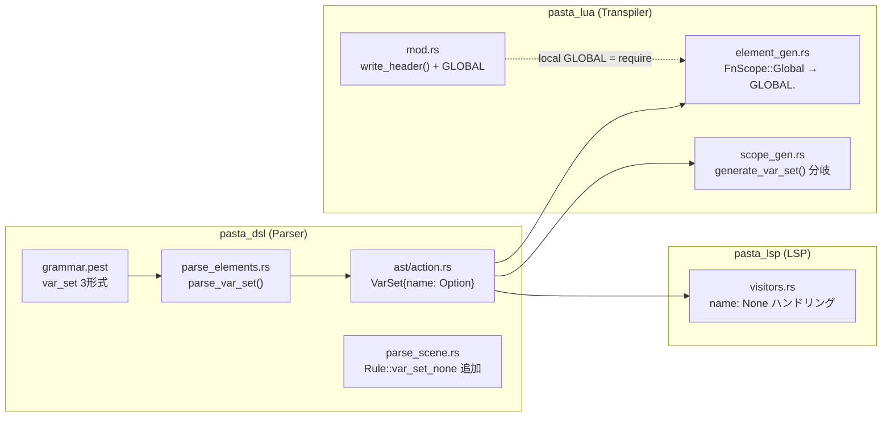
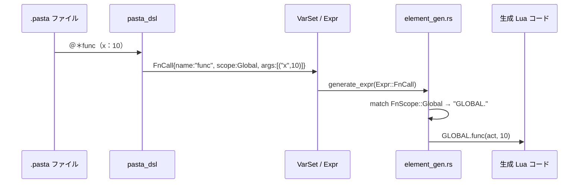
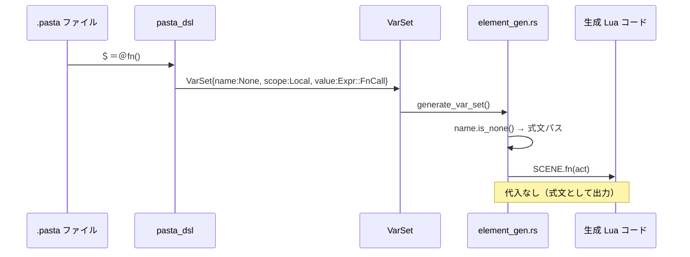
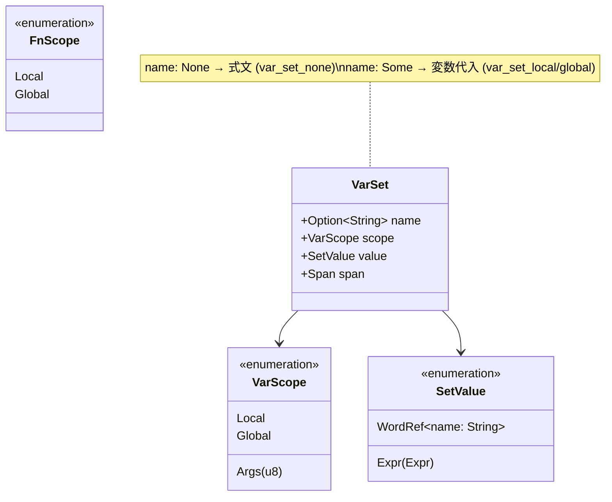

# Technical Design: fn-call-expr-stmt

## Overview

**Purpose**: Pasta DSL の関数呼び出し構文を2点改善し、ゴースト作者の表現力と DSL の一貫性を向上させる。

**Users**: Pasta DSL でゴースト辞書を作成する作者が、グローバル関数の呼び出し（`＠＊XX()`）と副作用専用の式文（`＄＝＠fn()`）を自然に記述できるようになる。

**Impact**: pasta_dsl パーサー（PEG 文法 + AST）、pasta_lua トランスパイラ（コード生成）、pasta_lsp（セマンティックトークン）の3クレートに変更が生じる。既存の `.pasta` ファイルへの影響はなし。

### Goals

- `＠＊XX()` を `GLOBAL.XX(act, ...)` に展開し、変数スコープ（`＄＊` → `save.`）との対称性を実現
- `＄＝expr` 式文を `var_set` の第3バリアントとして追加し、副作用専用呼び出しを簡潔に記述可能にする
- `var_set` 全バリアントを `＄`（`var_marker`）開始に統一し、LSP/TextMate の一貫性を確保
- 仕様ドキュメント（`doc/spec/`）を更新

### Non-Goals

- `GLOBAL` テーブルへの新しいビルトイン関数の追加（既存の `yield`/`チェイントーク` 以外）
- 式の型チェックやセマンティック検証（パーサーは構文のみ担当）
- TextMate 文法（`pasta.tmLanguage.json`）の変更（既存パターンが `＄＝expr` を自然に認識する）

## Architecture

### Existing Architecture Analysis

```
pasta_dsl (Parser)              pasta_lua (Transpiler)         pasta_lsp (LSP)
┌──────────────────┐           ┌──────────────────┐          ┌──────────────────┐
│ grammar.pest     │           │ mod.rs           │          │ visitors.rs      │
│  var_set         │           │  write_header()  │          │  visit_var_set() │
│  fn_call         │           │                  │          │  tokenize_...()  │
│                  │           │ element_gen.rs   │          │                  │
│ parse_elements.rs│──AST──▶  │  generate_var_set│          │                  │
│  parse_var_set() │           │  generate_expr() │          │                  │
│                  │           │  generate_action │          │                  │
│ ast/action.rs    │           │                  │          │                  │
│  VarSet          │           │ scope_gen.rs     │          │                  │
│  FnScope         │           │  generate_items  │          │                  │
└──────────────────┘           └──────────────────┘          └──────────────────┘
```

**現行の制約**:
- `FnScope::Global` が3箇所すべてで `"SCENE."` にハードコード（L183, L244, L312）
- `set` ルール内に `id` があり、`var_set_none`（id なし）を追加できない
- `VarSet.name` が `String` 型で、名前なしの式文を表現できない

### Architecture Pattern & Boundary Map

本機能は既存アーキテクチャの拡張であり、ドメイン境界（Parser / Transpiler / LSP）は不変。



**変更方針**:
- 選択パターン: 既存レイヤードアーキテクチャの最小拡張
- ドメイン境界: Parser → AST → Transpiler/LSP の単方向データフロー維持
- 既存パターン: `var_set_local`/`var_set_global` の2形式パターンに `var_set_none` を追加
- 新コンポーネント: なし（既存コンポーネントの内部拡張のみ）

### Technology Stack

| Layer | Choice / Version | Role in Feature | Notes |
|-------|------------------|-----------------|-------|
| Parser | pest 2.8.6 | PEG 文法定義、`var_set` ルール拡張 | サイレントルールの子ノード昇格を活用 |
| AST | Rust 2024 edition | `VarSet` 型の `name` フィールド `Option` 化 | 型チェッカが未対応箇所を自動検出 |
| Transpiler | mlua 0.11 (Lua 5.5) | `GLOBAL.` プレフィックス生成、ヘッダー追加 | `require` 結果はキャッシュされるため常時出力でも無影響 |
| Test | insta 1.46 | スナップショット一括更新 | `cargo insta review` で GLOBAL ヘッダー差分を自動承認 |

## System Flows

### `＠＊XX()` グローバル関数呼び出しフロー



### `＄＝expr` 式文フロー



## Requirements Traceability

| Requirement | Summary | Components | Interfaces | Flows |
|-------------|---------|------------|------------|-------|
| 1.1 | `＠＊XX()` アクション行展開 | element_gen.rs | `generate_action()` | GLOBAL 関数呼び出し |
| 1.2 | 名前付き引数展開 | element_gen.rs | `generate_args_string()` | GLOBAL 関数呼び出し |
| 1.3 | 変数代入右辺の `＠＊XX()` | element_gen.rs | `generate_expr()`, `generate_expr_to_buffer()` | GLOBAL 関数呼び出し |
| 1.4 | `FnScope::Global` AST 維持 | — | — | — |
| 1.5 | `＠XX()` ローカル展開維持 | element_gen.rs | — | — |
| 1.6 | GLOBAL ヘッダー出力 | mod.rs | `write_header()` | — |
| 2.1 | `＄＝＠fn()` パース | grammar.pest, parse_elements.rs | `parse_var_set()` | 式文 |
| 2.2 | 引数付き `＄＝＠fn(x:10)` | grammar.pest, parse_elements.rs | `parse_var_set()` | 式文 |
| 2.3 | 全角半角混在 | grammar.pest | `var_marker`, `set_marker` | — |
| 2.4 | 式文コード生成 | element_gen.rs | `generate_var_set()` | 式文 |
| 2.5 | `＄＝＠＊fn()` の GLOBAL 展開 | element_gen.rs | `generate_var_set()` + `generate_expr()` | 式文 + GLOBAL |
| 2.6 | `var_set_line` の一部として認識 | grammar.pest | — | — |
| 3.1 | `doc/spec/09-variables.md` 更新 | — | — | — |
| 3.2 | `doc/spec/01-grammar-model.md` 更新 | — | — | — |
| 3.3 | PEG ルール名の仕様記載 | — | — | — |
| 4.1 | `＠XX()` 互換性 | — | — | — |
| 4.2 | `＄XX＝＠fn()` 互換性 | — | — | — |
| 4.3 | 全テスト通過 | — | — | — |

## Components and Interfaces

| Component | Domain/Layer | Intent | Req Coverage | Key Dependencies | Contracts |
|-----------|--------------|--------|--------------|------------------|-----------|
| grammar.pest | Parser | `var_set` 3形式定義、`set` ルール簡素化 | 2.1, 2.2, 2.3, 2.6 | — | — |
| parse_elements.rs | Parser | `var_set_none` の AST 変換 | 2.1, 2.2 | grammar.pest | Service |
| parse_scene.rs | Parser | `Rule::var_set_none` のルーティング | 2.1, 2.6 | parse_elements.rs | — |
| ast/action.rs | Parser/AST | `VarSet.name` の `Option` 化 | 2.1, 2.4 | — | State |
| element_gen.rs | Transpiler | `FnScope::Global` → `GLOBAL.` + 式文生成 | 1.1–1.5, 2.4, 2.5 | AST | Service |
| mod.rs | Transpiler | GLOBAL ヘッダー出力 | 1.6 | — | — |
| visitors.rs | LSP | `name: None` 時のトークン化 | — | AST | — |
| doc/spec/*.md | Documentation | 仕様反映 | 3.1, 3.2, 3.3 | — | — |

### Parser Layer

#### grammar.pest

| Field | Detail |
|-------|--------|
| Intent | `var_set` ルールを3形式に拡張し、`＄＝expr` を `var_set_none` として統合 |
| Requirements | 2.1, 2.2, 2.3, 2.6 |

**Responsibilities & Constraints**
- `var_set` を `var_set_global | var_set_local | var_set_none` の3択に拡張
- `id` を `set` ルールから `var_set_local`/`var_set_global` に移動
- `set` ルールを `set_marker ~ s ~ ( expr | word_ref )` に簡素化
- `var_set_none` は `var_marker ~ set` で定義（`id` なし）
- 全角/半角の混在は既存の `var_marker`（`dollar`）と `set_marker`（`equals`）が処理済み

**変更前後の文法定義**:

```pest
# === BEFORE ===
var_set        =_{ var_set_global | var_set_local }
var_set_local  = { var_marker                 ~ set }
var_set_global = { var_marker ~ global_marker ~ set }
set            =_{ id ~ s ~ set_marker ~ s ~ ( expr | word_ref ) }

# === AFTER ===
var_set        =_{ var_set_global | var_set_local | var_set_none }
var_set_local  = { var_marker ~                 id ~ s ~ set }
var_set_global = { var_marker ~ global_marker ~ id ~ s ~ set }
var_set_none   = { var_marker ~                            set }
set            =_{ set_marker ~ s ~ ( expr | word_ref ) }
```

**Implementation Notes**
- `var_set` の選択肢順序: `var_set_global`（longest match）→ `var_set_local` → `var_set_none`（fallback）
- pest の PEG ordered choice により、`＄XX＝expr` は `var_set_local` にマッチし `var_set_none` には到達しない
- `set` はサイレントルール（`=_{ }`）のため、子ノードは親に昇格 → `parse_var_set()` への影響なし

#### ast/action.rs — VarSet 構造体

| Field | Detail |
|-------|--------|
| Intent | `name` フィールドを `Option<String>` に変更し、式文（`var_set_none`）を型レベルで表現 |
| Requirements | 2.1, 2.4 |

**変更前後**:

```rust
// === BEFORE ===
pub struct VarSet {
    pub name: String,
    pub scope: VarScope,
    pub value: SetValue,
    pub span: Span,
}

// === AFTER ===
pub struct VarSet {
    /// Variable name. `None` for expression statements (`var_set_none`).
    pub name: Option<String>,
    pub scope: VarScope,
    pub value: SetValue,
    pub span: Span,
}
```

**Constraints**:
- `name: None` の場合、`scope` は `VarScope::Local`（デフォルト）だが参照されない
- `name: Some(...)` の場合、既存の動作と完全互換
- `LocalSceneItem::VarSet(VarSet)` バリアントは変更なし（R2-AC6）

#### parse_elements.rs — parse_var_set()

| Field | Detail |
|-------|--------|
| Intent | `Rule::var_set_none` のハンドリング追加、`name` を `Option` で返却 |
| Requirements | 2.1, 2.2 |

**Dependencies**
- Inbound: parse_scene.rs — `Rule::var_set_none` ペアの受け渡し (P0)

**変更内容**:

```rust
// scope 判定に var_set_none を追加
let scope = match pair.as_rule() {
    Rule::var_set_global => VarScope::Global,
    _ => VarScope::Local, // var_set_local, var_set_none ともに Local
};

// name の初期値を Option に
let mut name: Option<String> = None;

// Rule::id マッチ時に Some(name) を設定
Rule::id => {
    if name.is_none() {
        name = Some(inner.as_str().to_string());
    }
}

// VarSet 構築
Ok(VarSet { name, scope, value, span })
```

**Implementation Notes**:
- `var_set_none` では `Rule::id` が出現しないため `name` は `None` のまま
- `var_set_local`/`var_set_global` では従来通り `Some(name)` が設定される
- 式のパース処理（`try_parse_expr`、`word_ref`）は完全に共通

#### parse_scene.rs — Rule::var_set_none ルーティング

| Field | Detail |
|-------|--------|
| Intent | `Rule::var_set_none` を `LocalSceneItem::VarSet` として登録 |
| Requirements | 2.1, 2.6 |

**変更内容**: `parse_local_start_scene_scope()` と `parse_local_scene_scope()` の match arm に追加

```rust
// BEFORE
Rule::var_set_local | Rule::var_set_global => {
    scope.items.push(LocalSceneItem::VarSet(parse_var_set(inner)?));
}

// AFTER
Rule::var_set_local | Rule::var_set_global | Rule::var_set_none => {
    scope.items.push(LocalSceneItem::VarSet(parse_var_set(inner)?));
}
```

### Transpiler Layer

#### element_gen.rs — FnScope::Global 展開修正

| Field | Detail |
|-------|--------|
| Intent | `FnScope::Global` のコード生成先を `SCENE.` から `GLOBAL.` に変更 |
| Requirements | 1.1, 1.2, 1.3, 1.5 |

**変更箇所（3箇所）**:

| Location | Function | Line | Before | After |
|----------|----------|------|--------|-------|
| Action::FnCall | `generate_action()` | ~L184 | `FnScope::Global => "SCENE."` | `FnScope::Global => "GLOBAL."` |
| Expr::FnCall | `generate_expr()` | ~L245 | `FnScope::Global => "SCENE."` | `FnScope::Global => "GLOBAL."` |
| Expr::FnCall | `generate_expr_to_buffer()` | ~L313 | `FnScope::Global => "SCENE."` | `FnScope::Global => "GLOBAL."` |

**Constraints**:
- `FnScope::Local => "SCENE."` は変更なし（1.5）
- 3箇所すべてで同一の変更パターン

#### element_gen.rs — generate_var_set() 式文対応

| Field | Detail |
|-------|--------|
| Intent | `name: None` の場合に代入なしの式文を生成 |
| Requirements | 2.4, 2.5 |

**変更内容**:

```rust
pub fn generate_var_set(&mut self, var_set: &VarSet) -> Result<(), TranspileError> {
    match &var_set.name {
        Some(name) => {
            // 既存パス: var.name = expr or save.name = act:word(...)
            let var_path = match var_set.scope {
                VarScope::Local => format!("var.{}", name),
                VarScope::Global => format!("save.{}", name),
                VarScope::Args(_) => {
                    return Err(TranspileError::invalid_ast(
                        &var_set.span,
                        "Cannot assign to scene argument",
                    ));
                }
            };
            match &var_set.value {
                SetValue::Expr(expr) => {
                    self.write_indent()?;
                    self.write_raw(&format!("{} = ", var_path))?;
                    self.generate_expr(expr)?;
                    writeln!(self.writer)?;
                }
                SetValue::WordRef { name } => {
                    let word_literal = StringLiteralizer::literalize(name)?;
                    self.writeln(&format!("{} = act:word({})", var_path, word_literal))?;
                }
            }
        }
        None => {
            // 式文パス: 式を評価するのみ（代入なし）
            match &var_set.value {
                SetValue::Expr(expr) => {
                    self.write_indent()?;
                    self.generate_expr(expr)?;
                    writeln!(self.writer)?;
                }
                SetValue::WordRef { name } => {
                    let word_literal = StringLiteralizer::literalize(name)?;
                    self.writeln(&format!("act:word({})", word_literal))?;
                }
            }
        }
    }
    Ok(())
}
```

**Implementation Notes**:
- `name: None` + `SetValue::Expr(Expr::FnCall { scope: Global, .. })` → `GLOBAL.fn(act)` が式文として出力される（1.1 + 2.5 の組み合わせ）
- `name: None` + `SetValue::WordRef` → `act:word("...")` が式文として出力（実用上書かれないが文法的に許容: 議題2結論）

#### mod.rs — write_header()

| Field | Detail |
|-------|--------|
| Intent | `local GLOBAL = require "pasta.global"` をヘッダーに追加 |
| Requirements | 1.6 |

**変更内容**:

```rust
pub fn write_header(&mut self) -> Result<(), TranspileError> {
    self.writeln("local PASTA = require \"pasta\"")?;
    self.writeln("local GLOBAL = require \"pasta.global\"")?;
    self.write_blank_line()?;
    Ok(())
}
```

**Implementation Notes**:
- 常時出力（GLOBAL 使用有無に関わらず）— 議題1クローズ済み
- Lua の `require` はモジュールキャッシュするため未使用時のパフォーマンス影響は無視できる
- 全スナップショットにヘッダー行が追加される → `cargo insta review` で一括承認

### LSP Layer

#### visitors.rs — var_set_none トークン化

| Field | Detail |
|-------|--------|
| Intent | `name: None` の場合に変数名トークンをスキップ |
| Requirements | — (LSP は要件外だが影響箇所として設計) |

**変更内容**: `tokenize_var_set_text()` 内の変数名トークン出力部を条件分岐

```rust
// 2) Variable name — var_set_none の場合はスキップ
if let Some(name) = &vs.name {
    // 既存: 変数名トークンを出力
    // ...
}
// else: var_set_none — マーカーの直後に代入演算子が続く
```

**Implementation Notes**:
- マーカートークン（`＄`）は常に出力
- 代入演算子トークン（`＝`）は名前有無に関わらず `set_marker` として出力
- 値トークン（式/単語参照）は共通処理

### Documentation Layer

#### doc/spec/09-variables.md

| Field | Detail |
|-------|--------|
| Intent | `＠＊` のグローバル展開先を明記 |
| Requirements | 3.1 |

**変更内容**:
- 関数呼び出し代入例のセクションに `＠＊func()` → `GLOBAL.func(act)` の展開先を追記
- `＠func()` → `SCENE.func(act)` との対比表を追加

#### doc/spec/01-grammar-model.md

| Field | Detail |
|-------|--------|
| Intent | `＄＝expr` 式文の構文と用途を追加 |
| Requirements | 3.2, 3.3 |

**変更内容**:
- 式サポートセクション（§1.3）に `＄＝expr` の構文定義を追加
- `var_set_none` PEG ルール名を文法テーブルに記載
- 使用例: `＄＝＠func()`, `＄＝＠＊global_func()`

## Data Models

### Domain Model

**VarSet 集約の変更**:



**不変条件**:
- `name: None` の場合、`scope` は参照されない（式文は代入先がない）
- `name: Some(n)` の場合、`n` は空文字列にならない（pest の `id` ルールが保証）
- `FnScope::Global` → `GLOBAL.`、`FnScope::Local` → `SCENE.`（全コード生成パスで統一）

### Logical Data Model

**既存構造への影響**:
- `VarSet.name`: `String` → `Option<String>` — 唯一の型変更
- `FnScope`: 変更なし
- `VarScope`: 変更なし
- `SetValue`: 変更なし
- `LocalSceneItem`: 変更なし（R2-AC6）

**生成 Lua コードのヘッダー変更**:

```lua
-- BEFORE
local PASTA = require "pasta"

-- AFTER
local PASTA = require "pasta"
local GLOBAL = require "pasta.global"
```
