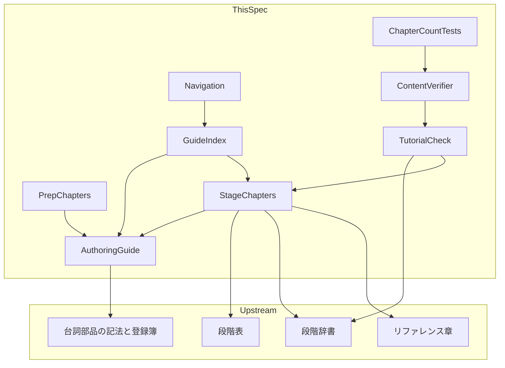
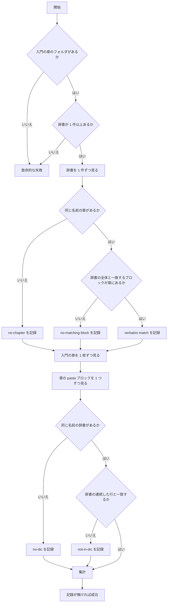

# 設計書: getting-started-story-guide

## Overview

**Purpose**: 入門ガイド（`book/src/getting-started/`）を、段階表（`crates/pasta_sample_ghost/STAGES.md`）の 13 段に 1 章ずつ対応する物語へ書き直す。読者は「こんな表現をしたい」を 1 章で 1 つ叶え、章の終わりでゴーストを起動してその表現を確かめる。

**Users**: ゴースト作者（初心者を含む）がガイドを読む。マニュアルの執筆者（AI エージェントを含む）が、執筆規約（`book/AUTHORING.md`）と検査ツール（`book/tools/`）を使って章を足し、直す。

**Impact**: 入門ガイドは 3 章から 16 章になる（入口 1・準備 2・段 13）。`first-ghost.md` は消え、`first-ghost.html` は入口の章へ転送される。作例の照合（`tutorial-check.mjs`）は「1 枚のどこかにあればよい」から「辞書と同じ名前の章にある」へ変わる。マニュアル全体の章は 47 から 60 になる。

### Goals

- 段階表の 1 段が 1 章になり、どの段の章も同じ型（願い → 表現 → 辞書ファイル → 試す → 送り出し）で読める。
- 説明本体を Claudia の台詞部品で語り、技術的な事実は台詞を読み飛ばしても追える。
- 各段の章の作例が、その段の辞書ファイルと逐語で一致することを CI が確かめる。
- 章を 16 枚に増やした後も、マニュアルの検査一式がすべて通る。
- 古い URL・README・表紙から、新しいガイドへ迷わず入れる。
- 幅 620〜1080px のウィンドウでも、開いた目次がページを移っても開いたままになる。

### Non-Goals

- スクリーンショット・画像（`getting-started-screenshots`）。
- 段階表と段階辞書の内容の変更（`hello-pasta-tutorial-stages` が確定済み）。
- 文法リファレンス・Lua 章・リファレンス・内部設計パートの書き直し。
- `.github/workflows/manual.yml`・`book/tools/verify-static.mjs` の変更（`manual-print-media-refs`）。
- 要件に無い種類の機械検査の追加。リファレンス章との事実の一致と、「台詞を読み飛ばしても事実が追える」ことは機械検査しない（執筆規約のチェックリストとレビューで見る）。検査の側で足すのは、作例の照合の拡張、`first-ghost.md` を名指しする検査の置き換え（`C-steps`・`C-order`）、語りの形と章の型の検査（`C-sections`・`C-prose`）だけである。
- 段階表（`STAGES.md`）を照合ツールで読むこと（`manual.yml` の起動条件に無いため）。
- 目次の中の折りたたみ（パートの開閉）の持ち越しと、mdBook のテンプレート（`index.hbs`）の差し替え。

## Boundary Commitments

### This Spec Owns

- `book/src/getting-started/` の全章の文章と、章のファイル名。
- `book/AUTHORING.md` の第 8 節「入門ガイドの執筆規約」と、第 1・2・3・5 節からの案内。
- `book/tools/tutorial-check.mjs` の照合の規則（辞書と章の対応・抜き出しの判定）と、その自己テスト。
- `book/tools/verify-content.mjs` の C 系の検査のうち、入門ガイドを名指しするもの（`C-steps`・`C-order`・`C-sections`・`C-prose`・`C-tutorial-check` のメッセージ）。
- 章の数を決め打ちしている 3 つの自己テストの数字。
- 目次の入門パート（`SUMMARY.md`）、表紙の「このマニュアルの歩き方」（`introduction.md`）、`first-ghost.html` の転送（`book.toml`）、2 つの README の入門ガイドへのリンク。
- `book/theme/claudia.js` の目次の持ち越しの関数（`claudiaSidebarKeep`）と、その自己テスト（`book/tools/theme-sidebar-test.mjs`）。同じファイルのテーマメニューの関数（`manual-claudia-theme`）は変えない。`book/tools/theme-menu-test.mjs` は、N-4（禁止する名前から `localStorage` を外す・検査名）と、冒頭のコメントだけを直す。

### Out of Boundary

- 段階表・段階辞書・`pasta.toml` の配布版・シェルのファイル（読むだけ）。
- 台詞部品の記法・登録簿・検査（`book/tools/talk/talk.mjs`・`AUTHORING.md` 第 7 節。変えずに使う）。
- 生成対象章・内部設計章の規則（`AUTHORING.md` 第 4・6 節）と、スキル `references/` の生成（`gen-skill-refs.mjs`）。
- `manual.yml`・`verify-static.mjs`・`verify-search.mjs`・`link-check.mjs`（変えない。通ることだけを確かめる）。
- 画像の行と、新しいシェルでの 8 段目の実機の確かめ（`getting-started-screenshots`）。
- 全段が起動することの検証（`cargo test -p pasta_sample_ghost` が持つ）。

### Allowed Dependencies

- 段階表（`STAGES.md`）— 章立て・題・教える範囲・リンク先・確かめる道具の正本。人が読んで章に写す。ツールは読まない。
- 段階辞書（`ghosts/hello-pasta/ghost/master/dic/*.pasta`）— 作例の正本。`tutorial-check.mjs` が読む。
- リファレンス章（`grammar/`・`lua/`・`reference/`）— 事実の権威。章はリンクで送り出す。
- UKADOC・SSP ヘルプ（外部）— ベースウェアの規則と操作の根拠。絶対 URL でリンクする。
- `verify-content.mjs` → `tutorial-check.mjs` の import（既存の向き）。`tutorial-check.mjs` は `node:` の標準モジュールだけに依存し、ほかの `book/tools` を import しない。

### Revalidation Triggers

- 段階辞書のファイルを足す・名前を変える・中身を変える → 同じ名前の章と、その作例を同じ変更で直す（照合が落ちる）。
- 段階表の `願い`・`使う文法要素`・`確かめるための道具` を変える → 該当する段の章の題・リンク・手順を直す（機械検査されない）。
- 入門の章を足す・消す・名前を変える → `SUMMARY.md`・入口の章の一覧・章の数の 3 か所・（名前を変えたときは）README と転送を直す。`getting-started-screenshots` は章のファイル名と見出し「起動して確かめる」を画像の置き場所として使う。
- `setup.md` の見出し「ゴーストのフォルダ構成」を変える → 2 つの README のリンクが落ちる（`readme-manual-url`）。
- 台詞部品の記法・登録簿・導入と締めの検査を変える → 入門の 16 章が対象になる。
- `tutorial-check.mjs` の公開関数の形を変える → `verify-content.mjs` と自己テストを直す。

## Architecture

### Existing Architecture Analysis

- マニュアルは mdBook の静的サイトで、章は `SUMMARY.md` に載ったものだけが公開される。検査は Node のスクリプト群（`book/tools/*.mjs`）で、`manual.yml` が順に走らせる。
- 入門の章にかかる検査は、`verify-content.mjs` の C 系（前提環境・手順・作例の照合）・D 系（口調）・T 系（台詞部品の記法、導入と締め）、`link-check.mjs`、ビルド後の `verify-static.mjs`・`verify-search.mjs` である。本文に台詞・口調を置くことを禁じる検査（`extractBody`）は生成対象章と内部設計章だけにかかり、入門の章にはかからない。
- 作例の照合 `tutorial-check.mjs` は、`first-ghost.md` 1 枚から `pasta` ブロックを全部抜き出し、辞書の各ファイルがどれかのブロックと一致するかを見る。段と章の対応は見ない。
- 守る制約: CLI の名前（`node book/tools/tutorial-check.mjs`）と終了コードを変えない。転送は既存の `[output.html.redirect]` の書き方（相対の転送先）に合わせる。

### Architecture Pattern & Boundary Map



矢印は「左が右を読む・右に従う」を表す。

**Architecture Integration**:

- Selected pattern: 既存の構成の拡張（研究書の Option C）。ツールは既存の 2 本を直し、本文は新しく書く。
- 依存の向き: 上流（段階表・段階辞書・台詞部品・リファレンス章）→ 執筆規約 → 本文 → 導線。ツールは本文と辞書を読むだけで、本文はツールを知らない。逆向きの依存は作らない。
- Existing patterns preserved: 章の構造（H1・`---` 2 本・導入と締めは二人の台詞）、照合の正規化（改行と末尾の空白行だけ）、辞書の列挙（固定の一覧なし）、転送の書き方、自己テストのサンドボックス方式。
- New components rationale: 新しい検査ツールは作らない（足すのはテーマのスクリプトの関数 1 つと、その自己テスト 1 本）。新しい文書は章 15 枚と執筆規約の 1 節だけである。
- Steering compliance: マニュアルが利用者向け情報の唯一の権威（`tech.md`）。ガイドは事実をリファレンス章の範囲に留める。

### Technology Stack

| Layer | Choice / Version | Role in Feature | Notes |
|-------|------------------|-----------------|-------|
| 文書 | mdBook 0.5.3（CI）・Markdown | 入門の 16 章・目次・転送 | 新しいプラグイン・前処理は足さない |
| テーマ | `book/theme/claudia.js`（`additional-js`・依存なし） | 目次の持ち越し | `book.js` の後に実行される。自己テストは導入済みの jsdom を使う |
| 検査ツール | Node.js（ES モジュール・依存なし） | 作例の照合・本文の検査・自己テスト | 新しい npm 依存は足さない |
| CI | `.github/workflows/manual.yml` | 既存の段をそのまま使う | 変更しない |

## File Structure Plan

### Directory Structure

```text
book/
├── AUTHORING.md                      # 変更: 第 8 節を足し、第 1・2・3・5 節から案内
├── book.toml                         # 変更: 転送を 1 行足す
├── src/
│   ├── SUMMARY.md                    # 変更: 入門パートを 16 行に
│   ├── introduction.md               # 変更: 「このマニュアルの歩き方」の文
│   └── getting-started/
│       ├── index.md                  # 書き直し: 入口の章（進め方・13 章の一覧・emo2 の紹介）
│       ├── prerequisites.md          # 書き直し: 準備 1（道具と約束）
│       ├── setup.md                  # 新規: 準備 2（最小一式を置く）
│       ├── 01-boot.md                # 新規: 1 段目
│       ├── 02-talk.md                # 新規: 2 段目
│       ├── 03-face.md                # 新規: 3 段目
│       ├── 04-variety.md             # 新規: 4 段目
│       ├── 05-words.md               # 新規: 5 段目
│       ├── 06-hour.md                # 新規: 6 段目
│       ├── 07-greeting.md            # 新規: 7 段目
│       ├── 08-touch.md               # 新規: 8 段目
│       ├── 09-choice.md              # 新規: 9 段目
│       ├── 10-save.md                # 新規: 10 段目
│       ├── 11-jump.md                # 新規: 11 段目
│       ├── 12-lua.md                 # 新規: 12 段目
│       ├── 13-nar.md                 # 新規: 13 段目（辞書なし）
│       └── first-ghost.md            # 削除
├── theme/
│   └── claudia.js                    # 変更: 目次の持ち越しの関数を足す・冒頭のコメント
└── tools/
    ├── tutorial-check.mjs            # 変更: 辞書 ↔ 同じ名前の章の照合・抜き出しの判定・地の文の段落の判定
    ├── tutorial-check-test.mjs       # 変更: サンドボックスを章ごとに作り直す
    ├── verify-content.mjs            # 変更: C-steps の置き換え・C-order・C-sections・C-prose の追加・コメントの章数
    ├── verify-scripts-test.mjs       # 変更: T 系の件数 47 → 60・C-sections と C-prose の件数
    ├── gen-skill-refs-test.mjs       # 変更: K-10 の章数 47 → 60
    ├── talk/talk-test.mjs            # 変更: J-9 の章数 47 → 60
    ├── theme-menu-test.mjs           # 変更: N-4（禁止する名前から localStorage を外す・検査名）・冒頭のコメント
    └── theme-sidebar-test.mjs        # 新規: 目次の持ち越しの jsdom テスト（CI は *-test.mjs を自動で拾う）
crates/
├── pasta_lua/README.md               # 変更: フォルダ構成へのリンク 1 か所
└── pasta_shiori/README.md            # 変更: フォルダ構成へのリンク 1 か所
```

章のファイル名の規則:

- 段の章は、その段の辞書と同じ名前にする（`dic/07-greeting.pasta` ↔ `getting-started/07-greeting.md`）。照合はこの対応だけを使う。
- 辞書を持たない 13 段目は `13-nar.md` とする。
- 入口は `index.md`、準備は `prerequisites.md`・`setup.md`（番号を付けない）。`index.md` と `prerequisites.md` は今の名前を変えない（表紙の扉と既存の URL がそのまま生きる）。

### Modified Files

- `book/src/getting-started/first-ghost.md` — 削除する。技術的な内容のうち、フォルダ構成・設定ファイル・起動・トラブルシュートは `setup.md` へ、辞書の節は各段の章へ移る（文章は書き直す）。シェルのファイルの転記は移さない。
- `book/AUTHORING.md` — 第 7 節は書き換えない。
- 触らないファイル: `.github/workflows/manual.yml`・`book/tools/verify-static.mjs`・`verify-search.mjs`・`link-check.mjs`・`talk/talk.mjs`・`gen-skill-refs.mjs`・`crates/pasta_sample_ghost/` 配下・`.claude/skills/` 配下。

## System Flows

### 作例の照合（`runTutorialCheck`）



- 照合は 2 つの向きで回す。辞書から章へ（辞書の全体が章にあるか）と、章から辞書へ（章のどのブロックも辞書の全体か抜き出しか）。
- 13 段目・入口・準備の章は同じ名前の辞書を持たない。`pasta` ブロックが無ければ何も記録されず、あれば `no-dic` になる。13 段目のための場合分けは無い。
- 辞書を足すと、列挙に入って `no-chapter` で落ちる。固定の一覧は無い。

## Requirements Traceability

| Requirement | Summary | Components | Interfaces / 検証 |
|-------------|---------|------------|-------------------|
| 1.1 | 入口・準備・13 段の章で構成 | GuideIndex, PrepChapters, StageChapters | File Structure Plan、章の数 60（ChapterCountTests） |
| 1.2 | 段の章を段階の順に並べる | StageChapters, Navigation | `C-order` |
| 1.3 | 章の題で願いが分かる | StageChapters | 「段の章の対応表」の題 |
| 1.4 | 目次に入口・準備・13 段をこの順で | Navigation | `C-order` |
| 1.5 | 入口の章に進め方と 13 章の一覧 | GuideIndex | 入口の章の見出し構成 |
| 1.6 | 辞書の無い 13 段目も 1 章 | StageChapters | `13-nar.md`、TutorialCheck（ブロック無しを失敗にしない） |
| 1.7 | 現状と食い違う記述を残さない | PrepChapters, StageChapters | `first-ghost.md` の削除、通しの確認 |
| 2.1 | 動作環境・エディタ・UTF-8 | PrepChapters | `prerequisites.md`、`C-utf8`・`C-sjis`・`C-env` |
| 2.2 | `pasta.dll` の入手先と `scripts/` の正しい説明 | PrepChapters | `prerequisites.md`・`setup.md`「hello-pasta から写す」 |
| 2.3 | フォルダ構成と最小一式 | PrepChapters | `setup.md`「ゴーストのフォルダ構成」 |
| 2.4 | シェルはそのまま使い、中身を転記しない | PrepChapters | `setup.md`「hello-pasta から写す」 |
| 2.5 | `pasta.toml` は `[actor]` だけが必須・`spot` の意味 | PrepChapters | `setup.md`「pasta.toml を書く」 |
| 2.6 | 準備の終わりはしゃべらない・1 段目へ送る | PrepChapters | `setup.md`「SSP に入れて起動する」、実機の確認 |
| 2.7 | 名前は読者が決める・`hello-pasta` は衝突する | PrepChapters | `setup.md`「名前を決める」 |
| 2.8 | `sakura.name` は表示名・アクター名は `[actor]` | PrepChapters | `setup.md`「descript.txt を書く」 |
| 2.9 | `hello-pasta.nar` から写す手順・ライセンス表示を一緒に置く | PrepChapters | `setup.md`「hello-pasta から写す」 |
| 3.1 | 願いから起こし、新しい表現を説明 | StageChapters | 見出し「叶えたいこと」「新しく覚える表現」 |
| 3.2 | 辞書 1 ファイルを 1 ブロックで逐語 | StageChapters, TutorialCheck | 見出し「辞書ファイルを足す」、`no-matching-block` |
| 3.3 | 置き場所とファイル名・足すだけで次の段 | StageChapters | 見出し「辞書ファイルを足す」 |
| 3.4 | 章末に確かめる手順と成功の目印 | StageChapters | 見出し「起動して確かめる」 |
| 3.5 | 段階表が指定する道具の使い方 | StageChapters | 「段ごとの固有の内容」の道具 |
| 3.6 | 段階表と同じリンク先へ送り出す | StageChapters | 見出し「もっと詳しく」、`link-check.mjs` |
| 3.7 | 段階表に無い文法・API を教えない | StageChapters, AuthoringGuide | 第 8 節のチェックリスト |
| 3.8 | 辞書のコメントと食い違わない | StageChapters | 章ごとのレビュー |
| 3.9 | 転記以外の `pasta` ブロックは連続した抜き出しだけ | StageChapters, TutorialCheck | `isExcerptOf`、`not-in-dic` |
| 4.1 | 2 段目で `[ghost]` の 2 行 | StageChapters | `02-talk.md` |
| 4.2 | 6 段目で開発者用機能と時刻の仮想変更 | StageChapters | `06-hour.md` |
| 4.3 | 7 段目でイベントとシーンの対応を (a)〜(d) の順に | StageChapters | `07-greeting.md` |
| 4.4 | 7 段目で OnBoot・OnClose が来ない規則 | StageChapters | `07-greeting.md`、UKADOC の引用 |
| 4.5 | 7 段目の相手役は emo2・メニューから切り替え | StageChapters | `07-greeting.md` |
| 4.6 | 7 段目でスクリプト入力の `\![raise,…]` | StageChapters | `07-greeting.md` |
| 4.7 | 7 段目で OnFirstBoot が自然には来ないこと | StageChapters | `07-greeting.md` |
| 4.8 | 8 段目で `＄ｒ４`・`Head`・判定の外は空 | StageChapters | `08-touch.md` |
| 4.9 | 9 段目で選択肢・`!select`・自動ルーティング | StageChapters | `09-choice.md` |
| 4.10 | 10 段目で未代入は 0・終了しても残る | StageChapters | `10-save.md` |
| 4.11 | 12 段目で Lua ブロックと `＞＠名前（）` | StageChapters | `12-lua.md` |
| 4.12 | 13 段目で NAR 作成・UKADOC へ | StageChapters | `13-nar.md` |
| 5.1 | 初出のイベントは UKADOC へリンクし短く引用 | StageChapters | 「出典の表」の形 |
| 5.2 | Reference の一覧を丸ごと転載しない | StageChapters, AuthoringGuide | 「出典の表」の形、第 8 節 |
| 5.3 | 一覧と仕組みは Lua 章・文法章へ | StageChapters | `07-greeting.md`「もっと詳しく」 |
| 6.1 | emo2 をショーケースとして紹介・7 段目の相手役 | GuideIndex, StageChapters | `index.md`・`07-greeting.md` |
| 6.2 | 作例は hello-pasta・emo2 の辞書は照合しない | StageChapters, TutorialCheck | emo2 の辞書は `pasta` ブロックに置けない（`not-in-dic`） |
| 6.3 | emo2 の事実は記録された範囲に留める | AuthoringGuide, StageChapters | 第 8 節「事実の範囲」 |
| 7.1 | 説明本体は台詞部品だけで語る | AuthoringGuide, 全章 | 第 8 節「語りの形」、`C-prose` |
| 7.2 | 導入と締めは二人の掛け合い | 全章 | `T-intro`・`T-outro` |
| 7.3 | 事実は台詞以外だけで追える | AuthoringGuide, 全章 | 第 8 節「語りの形」、章ごとのレビュー |
| 7.4 | コード・表のセルなどに口調を入れない | AuthoringGuide, 全章 | `D-codevoice`、第 8 節 |
| 7.5 | 技術的正確さを語りより優先 | AuthoringGuide, 全章 | 第 8 節「変えない規則」 |
| 7.6 | 最初の台詞は章に固有の言葉 | 全章 | `verify-search.mjs` の台詞の検索 |
| 7.7 | 台詞部品の記法を守る | 全章 | `T-syntax`・`T-intro`・`T-outro` |
| 7.8 | アンソニーは本体に出てよいが事実を独占しない | AuthoringGuide, 全章 | 第 8 節「語りの形」 |
| 8.1 | 例外を第 7 節とは別の節に書く | AuthoringGuide | 第 8 節 |
| 8.2 | 語りの形・台詞以外に置けるもの・章の型 | AuthoringGuide | 第 8 節「語りの形」「章の型」、`C-sections` |
| 8.3 | 口調を持ち込まない場所と鉄則を維持 | AuthoringGuide | 第 8 節「変えない規則」 |
| 8.4 | 第 2 節・第 5 節から案内 | AuthoringGuide | 第 2・5 節の追記 |
| 8.5 | 作例は辞書と逐語一致・抜き出しは連続・同じ変更で直す | AuthoringGuide | 第 8 節「作例の規則」 |
| 8.6 | 生成対象章・内部設計章の規則を変えない | AuthoringGuide | 第 4・6・7 節を触らない |
| 8.7 | 辞書以外の転記はリファレンス章と突き合わせる | AuthoringGuide | 第 8 節「辞書以外の転記」 |
| 9.1 | 辞書の各ファイルを段の章と照合 | TutorialCheck | `runTutorialCheck` |
| 9.2 | 段と章の対応で判定 | TutorialCheck | 同じ名前の規則 |
| 9.3 | 一致するブロックが無ければ名指しで失敗 | TutorialCheck | `no-matching-block`、`reportTutorialCheck` |
| 9.4 | 対応する章が無ければ失敗 | TutorialCheck | `no-chapter` |
| 9.5 | 辞書の無い段はブロック無しでよい | TutorialCheck | 章から辞書への向きの判定 |
| 9.6 | 改行と末尾の空白行だけ正規化 | TutorialCheck | `normalizeForCompare`（変更なし） |
| 9.7 | 辞書を足せば自動で対象に入る | TutorialCheck | `listDicFiles`（変更なし） |
| 9.8 | 自己テストで各場合を確かめる | TutorialCheck | `tutorial-check-test.mjs` |
| 9.9 | 辞書以外の転記は照合しない | TutorialCheck | 情報文字列 `pasta` のブロックだけを見る |
| 9.10 | どのブロックも全体か連続した抜き出し | TutorialCheck | `isExcerptOf` |
| 9.11 | どちらでもないブロックは名指しで失敗 | TutorialCheck | `not-in-dic`・`no-dic`・`indented-fence` |
| 10.1 | `first-ghost.md` を名指しする検査を直す | ContentVerifier | `C-steps`・`C-order` |
| 10.2 | 本体の台詞を失敗にしない | ContentVerifier | 変更なし（禁止する検査が入門にかからない）。実リポジトリの実行で確かめる |
| 10.3 | 台詞部品・口調の検査は従来どおり | ContentVerifier | `T-*`・`D-codevoice`（変更なし） |
| 10.4 | 章の数の自己テストが新しい数で通る | ChapterCountTests | 47 → 60 |
| 10.5 | 検査一式がすべて成功 | 全コンポーネント | Testing Strategy「通しの確認」 |
| 10.6 | 最初の台詞の語で章が検索できる | 全章 | `verify-search.mjs --self-test` |
| 10.7 | 段の章が 5 つの見出しをこの順で持つ | ContentVerifier | `C-sections` |
| 10.8 | 台詞以外の段落は指示の一文だけ | ContentVerifier, TutorialCheck | `C-prose`、`findProseParagraphs` |
| 11.1 | 表紙の歩き方の位置づけ | Navigation | `introduction.md` |
| 11.2 | 扉のパート案内は入口の章を指す | Navigation | `index.md` の名前を変えない |
| 11.3 | 廃止ページの URL を転送 | Navigation | `book.toml` の転送 |
| 11.4 | README のリンクを実在する見出しへ | Navigation, PrepChapters | `setup.md`「ゴーストのフォルダ構成」、`readme-manual-url` |
| 11.5 | リンク検証に通る相対リンクだけ | 全章 | `link-check.mjs` |
| 12.1 | 現行の版の文法だけ・回避レシピなし | 全章, AuthoringGuide | 第 8 節「事実の範囲」 |
| 12.2 | リファレンス章と食い違わない | 全章 | 章ごとの突き合わせ |
| 12.3 | ベースウェアの規則は UKADOC へリンク | StageChapters | `06`・`07`・`13` の章のリンク |
| 12.4 | 画像を置かない | 全章 | 章に画像の行を書かない |
| 12.5 | 全章を新しい型でそろえる | 全章 | 16 章を 1 つの変更で出す |
| 13.1 | 幅 620〜1080px で、開いた目次を次のページへ持ち越す | SidebarKeeper | `claudiaSidebarKeep`、`theme-sidebar-test.mjs` |
| 13.2 | 自分で閉じた目次は閉じたまま | SidebarKeeper | 保存値が `visible` のときだけ開く |
| 13.3 | ほかの幅と初回の表示を変えない | SidebarKeeper | 幅と保存値の判定、`theme-sidebar-test.mjs` |
| 13.4 | テーマのスクリプトだけで行う | SidebarKeeper | `claudia.js` だけを変える |

## Components and Interfaces

| Component | Layer | Intent | Req Coverage | Key Dependencies | Contracts |
|-----------|-------|--------|--------------|------------------|-----------|
| AuthoringGuide | 規約 | 入門ガイドだけの書き方を第 8 節に定める | 3.7, 5.2, 6.3, 7.1, 7.3, 7.4, 7.5, 7.8, 8.1–8.7, 12.1 | 第 7 節（P0） | 文書 |
| GuideIndex | 本文 | 進め方と 13 章の一覧、emo2 の紹介 | 1.1, 1.5, 6.1 | AuthoringGuide（P0） | 文書 |
| PrepChapters | 本文 | 道具と約束、最小一式の配置 | 1.1, 1.7, 2.1–2.9, 11.4 | AuthoringGuide（P0）、`reference/pasta-toml.md`（P1） | 文書 |
| StageChapters | 本文 | 13 段の章 | 1.1–1.3, 1.6, 1.7, 3.1–3.9, 4.1–4.12, 5.1–5.3, 6.1, 6.2, 12.3 | 段階表・段階辞書（P0）、AuthoringGuide（P0） | 文書 |
| Navigation | 導線 | 目次・表紙・転送・README | 1.2, 1.4, 11.1–11.4 | GuideIndex・PrepChapters（P0） | 設定 |
| TutorialCheck | ツール | 辞書と同じ名前の章の作例を照合 | 1.6, 3.2, 3.9, 6.2, 9.1–9.11, 10.8 | 段階辞書・入門の章（P0） | Service, Batch |
| ContentVerifier | ツール | 入門を名指しする検査の追従と、語りの形・章の型の検査 | 1.2, 1.4, 2.1, 7.1, 10.1–10.3, 10.7, 10.8 | TutorialCheck（P0） | Batch |
| ChapterCountTests | ツール | 章の数の決め打ちを直す | 1.1, 10.4 | ContentVerifier（P1） | Batch |
| SidebarKeeper | テーマ | 開いた目次を次のページへ持ち越す | 13.1–13.4 | mdBook の `book.js`（P0） | State |

7.2・7.6・7.7・10.5・10.6・11.5・12.2・12.4・12.5 は全章にかかる（本文の 3 コンポーネントが共通に満たす）。

### 規約層

#### AuthoringGuide（`book/AUTHORING.md`）

| Field | Detail |
|-------|--------|
| Intent | 入門ガイドに限った書き方を 1 つの節にまとめ、他の章の規則と混ざらないようにする |
| Requirements | 3.7, 5.2, 6.3, 7.1, 7.3, 7.4, 7.5, 7.8, 8.1, 8.2, 8.3, 8.4, 8.5, 8.6, 8.7, 12.1 |

**Responsibilities & Constraints**

- 第 7 節の後ろに H2「8. 入門ガイドの執筆規約」を足す。見出しに「台詞部品」という語を入れない（`T-authoring` は「台詞部品」を含む最初の H2 を第 7 節として読む）。
- 第 4・6・7 節は書き換えない（8.6）。
- 既存の節への追記は次の 5 か所だけにする。
  - 冒頭のコメントと「対応要件」の行 — 入門ガイドの章は第 8 節に準拠する、と足す。
  - 第 1 節のリズムの文 — 「入門ガイドだけは本体も台詞部品で語る（第 8 節）」と但し書きを足す。
  - 第 2 節の使い分け表の直後 — 「入門ガイド（`book/src/getting-started/`）の説明本体は第 8 節に従う」と案内する（8.4）。表の「持ち込まない場所」は変えない。
  - 第 3 節のサンプル B — 見出しを「手順章の冒頭」に変え、「入門ガイドの章はこの型ではなく第 8 節の型で書く」と 1 行足す（今の見出しは `getting-started` を名指ししており、第 8 節と食い違う）。
  - 第 5 節のチェックリスト — 「説明本体が普通の文体」の項目に「入門ガイドを除く」を足し、「入門ガイドの章は第 8 節のチェックリストを満たしている」を 1 項目足す（8.4）。

**第 8 節の構成**（小見出しと、書く内容）

| 小見出し | 書く内容 | 要件 |
|----------|----------|------|
| 対象 | `book/src/getting-started/` の章だけに適用する。第 1〜5・7 節に加えて守る。本節が上書きするのは説明本体の文体だけ | 8.1 |
| 語りの形 | 説明本体の語りは台詞部品だけで書く。説明の地の文の段落を置かない。台詞以外に置けるのは、操作を指す普通文体の指示の一文・箇条書き（番号付きを含む）・表・コードブロック・見出しだけ。指示の一文は 1 行で句点を 1 つにし、二文以上になるときは箇条書きにする（`C-prose` が確かめる）。引用ブロックは台詞部品だけに使い、用語の説明や出典の引用は箇条書きか表に置く。台詞が語る技術的な事実は、同じ章の台詞以外の部分にも必ず置く（台詞にしか無い事実を作らない）。アンソニーは本体で読者の疑問を代わりに尋ねてよいが、事実の説明をアンソニーの台詞にだけ置かない。導入と締めは第 7 節のまま（両方の話し手・台詞だけ・技術情報を載せない） | 7.1, 7.3, 7.8, 8.2 |
| 変えない規則 | コードブロック内・構文定義・コマンド例・サンプルコード・表のセルに口調を持ち込まない。技術的正確さを最優先し、語りで誤読の余地が生まれるなら台詞以外の部分で言い切る | 7.4, 7.5, 8.3 |
| 章の型 | 入口・準備・段の章の見出し構成（下の各コンポーネントの表）と、段の章の雛形（Supporting References の雛形を載せる）。段の章の 5 つの H2 は文言と順序を変えない（`C-sections` が確かめる）。本体に区切り `---` を置かない（区切りは導入の後と締めの前の 2 本だけ）。最初の台詞は章に固有の 4 文字以上の日本語で始める | 8.2 |
| 作例の規則 | 情報文字列 `pasta` のブロックは、章と同じ名前の辞書の全体か、連続した行の抜き出しに限る。辞書の全体は「辞書ファイルを足す」に 1 つ置く。辞書に無い形の例示は `pasta` で書かない。フェンスは行頭に置き、リスト・引用の中に置かない。辞書が ```` ``` ```` を含むときは 4 本のバッククォートで囲み、```` ```lua ```` を含む抜き出しは開きと閉じの両方を含める。辞書を変えるときは同じ変更で章の作例を直す。確かめるコマンドは `node book/tools/tutorial-check.mjs` | 8.5 |
| 辞書以外の転記 | `install.txt`・`descript.txt`・`pasta.toml` の断片とスクリプト入力の例は、情報文字列 `text`・`toml` で書く。照合されないので、項目名と既定値をリファレンス章（`reference/`）と突き合わせる。シェルのファイルの中身は書き写さない | 8.7 |
| 出典 | 初めて扱うイベントは、UKADOC の項へのリンク・説明の 1 文の引用・その段で使う `Reference` の説明の引用を表に置く。`Reference` の一覧を丸ごと写さない | 5.2 |
| 事実の範囲 | 段階表の `使う文法要素` に無い文法・API を教えない。回避レシピを載せない。emo2 について書く事実は `hello-pasta-tutorial-stages` の「emo2 からの知見」の範囲に留める。画像を置かない | 3.7, 6.3, 12.1 |
| 章を足す・名前を変えるとき | 直す場所の一覧（`SUMMARY.md`・入口の章の一覧・章の数の 3 か所・README・転送）。段の章は辞書と同じ名前にする | 8.5 |
| チェックリスト | 上の規則を章ごとに確かめる項目 | 8.2 |

**Implementation Notes**

- Validation: `node book/tools/verify-content.mjs` の `T-authoring` が従来どおり通る（第 7 節の表を触らないため）。
- Risks: 第 1〜3 節の但し書きが足りないと「本体は普通文体」と読める文が残る。第 8 節を書いた後、`AUTHORING.md` を「入門」「getting-started」で検索して食い違う文が無いことを確かめる。

### 本文層

全章に共通の契約（第 8 節の「語りの形」「変えない規則」のとおり）:

- 先頭行は H1。導入（二人の台詞）→ `---` → 本体 → `---` → 締め（二人の台詞）。
- 本体の語りは台詞部品。台詞以外は指示の一文・箇条書き・表・コードブロック・見出しだけ。
- リンクは `link-check.mjs` に通る相対リンク（章の間は `../grammar/…` の形）と、外部の絶対 URL だけ。
- 画像の行を置かない。

#### GuideIndex（`getting-started/index.md`）

| Field | Detail |
|-------|--------|
| Intent | ガイドの進め方と 13 章の一覧を示し、準備の章へ送る |
| Requirements | 1.1, 1.5, 6.1 |

本体の見出し（この順）:

| H2 | 内容 |
|----|------|
| このガイドで作るもの | 自分の名前を付けたゴーストを 1 体作り、13 段で育てること。用語（ゴースト）は箇条書きで |
| このガイドの進め方 | 1 章 1 段・章の終わりで起動して試す・詳しい文法はリファレンスへ（箇条書き） |
| 章の一覧 | 準備の 2 章と 13 段の章の表（段・章へのリンク・叶うこと・足すファイル）。表のセルに口調を入れない |
| 作りこんだ実例 | emo2（<https://ekicyou.github.io/ghost_dev/emo2/>）を pasta.dll のショーケースゴーストとして紹介する |
| このガイドの先にあるもの | 文法リファレンスと Lua 章への案内 |

- `pasta` ブロックは置かない（同じ名前の辞書が無い）。
- 「途中の段階ではなく最終形が起動する」という今の記述は消す（1.7）。

#### PrepChapters（`prerequisites.md`・`setup.md`）

| Field | Detail |
|-------|--------|
| Intent | 1 段目の辞書を 1 ファイル足すだけで起動する状態まで、読者を連れていく |
| Requirements | 1.1, 1.7, 2.1, 2.2, 2.3, 2.4, 2.5, 2.6, 2.7, 2.8, 2.9, 11.4 |

`prerequisites.md`（題「前提環境と準備」。今の技術的内容を落とさない）:

| H2 | 内容 | 要件 |
|----|------|------|
| 動作環境 | Windows・SSP（表）。用語（ベースウェア）は箇条書き | 2.1 |
| 必要なもの | テキストエディタ、`pasta.dll`。入手先はリリースページ（<https://github.com/ekicyou/pasta/releases>）の `hello-pasta.nar`（完成版のゴースト一式。`pasta.dll`・`THIRD_PARTY_LICENSES.txt`・シェルを含む）。`pasta.dll` だけを入れ替えるときの入手先として `pasta.dll.zip` を 1 行添える。Lua ランタイムは `pasta.dll` の中にあり、`scripts/` は自分のスクリプトを置く場所である | 2.1, 2.2 |
| 文字コードは必ず UTF-8 | UTF-8 の約束、BOM、Shift_JIS の辞書から移すときの注意 | 2.1 |

- `C-utf8`・`C-sjis`・`C-env` は入門の全章を連結して `UTF-8`・`Shift_JIS`・`Windows`・`SSP` の語を探す。この章がそれを満たし続ける。

`setup.md`（題「ゴーストの最小一式を置く」）:

| H2 | 内容 | 要件 |
|----|------|------|
| ゴーストのフォルダ構成 | フォルダの図（`text`）と役割の表。最小一式は `install.txt`・`ghost/master/descript.txt`・`ghost/master/pasta.toml`・`ghost/master/pasta.dll`・`ghost/master/THIRD_PARTY_LICENSES.txt`・`shell/master/`。`dic/` はまだ空。**見出しの文言を変えない**（README が `#ゴーストのフォルダ構成` を指す） | 2.3, 11.4 |
| 名前を決める | フォルダ名・`install.txt` の `name`・`directory`・`descript.txt` の `name` を読者が決める。`hello-pasta` を使うと、配布版と同じ SSP に入れたとき衝突する。`craftman`・`craftmanw` も読者のものにする | 2.7 |
| install.txt を書く | 転記（`text`）。名前の行は例の名前で示し、置き換えを指示する | 2.3, 2.7 |
| descript.txt を書く | 転記（`text`）。`shiori,pasta.dll`。`sakura.name`・`kero.name` は表示名で、辞書で呼ぶアクター名は `pasta.toml` の `[actor]` で決まる | 2.3, 2.8 |
| pasta.toml を書く | `[actor]` だけの最小構成（`toml`）。起動に必須なのは `[actor]` だけ。`spot` の意味。アクター名は辞書と合わせて `女の子`・`男の子` のままにする。詳しくは `reference/pasta-toml.md` へ | 2.5 |
| hello-pasta から写す | 番号付きの手順: (1) リリースページの `hello-pasta.nar` を SSP のウィンドウへドロップして入れる (2) SSP の `ghost/hello-pasta/` を開く (3) `ghost/master/pasta.dll`・`ghost/master/THIRD_PARTY_LICENSES.txt`・`shell/master/`（フォルダごと）を、自分のゴーストの同じ場所へ写す。`THIRD_PARTY_LICENSES.txt` は `pasta.dll` が含むソフトウェアのライセンス表示で、ゴーストを配布するとき一緒に配る。`scripts/` は作らなくてよい。シェルの `descript.txt`・`surfaces.txt` の中身は書き写さない。入れた hello-pasta は完成版の見本としてそのまま残す | 2.2, 2.4, 2.9 |
| SSP に入れて起動する | SSP のゴーストのフォルダへ置き、切り替える。辞書が無いので、立ち絵は出るがしゃべらない。これが準備の終わりの状態で、次は 1 段目 | 2.6 |
| うまく起動しないときは | 文字化け・何も表示されない・辞書が反映されない、の 3 つ（今の `first-ghost.md` の内容を移す） | 1.7 |

- 例の名前は全章で 1 つに統一する（下書きの前提は、フォルダ名と `name` を `my-ghost`）。
- 転記は照合されない（9.9）。`descript.txt`・`pasta.toml` の項目名と既定値は、書くときに `reference/pasta-toml.md` と配布版のファイルを見て確かめる（8.7）。
- 「Lua ランタイム（`scripts/` 配下）も配置する」「シェルの画像を自動生成する」に当たる記述は書かない（1.7）。

#### StageChapters（`01-boot.md`〜`13-nar.md`）

| Field | Detail |
|-------|--------|
| Intent | 段階表の 1 段を 1 章で教え、章の終わりで起動して確かめさせる |
| Requirements | 1.1, 1.2, 1.3, 1.6, 1.7, 3.1–3.9, 4.1–4.12, 5.1, 5.2, 5.3, 6.1, 6.2, 12.3 |

**段の章の型**（本体の H2。この順・この文言。13 枚で共通）

| 順 | H2 | 置くもの | 要件 |
|----|----|----------|------|
| 1 | `## 叶えたいこと` | 段階表の `願い` から起こす台詞。箇条書きで「この章で足すファイル」「叶うこと」 | 3.1 |
| 2 | `## 新しく覚える表現` | 段階表の `新しく覚える表現` の範囲の説明（台詞）。構文は辞書の抜き出し（`pasta`）と箇条書き・表で示す。初めて扱うイベントの出典の表もここに置く | 3.1, 3.7, 3.8, 3.9, 5.1 |
| 3 | `## 辞書ファイルを足す` | 指示の一文（「`ghost/master/dic/NN-name.pasta` を作り、次の内容を UTF-8 で保存する。」）と、辞書の全体の `pasta` ブロック 1 つ。前の段のファイルは変えない、と箇条書きで示す。13 段目は「この段で足す辞書ファイルは無い」と示す | 3.2, 3.3, 1.6 |
| 4 | `## 起動して確かめる` | 番号付きの手順と、「成功の目印」の箇条書き。段階表が道具を指定する段は、道具の手順をここに書く | 3.4, 3.5 |
| 5 | `## もっと詳しく` | リファレンス章へのリンクの箇条書き。リンク先は段階表の同じ行の `使う文法要素` と同じにする（`../../book/src/grammar/…` を `../grammar/…` に読み替える） | 3.6 |

- 確かめる手順の共通の操作は「SSP を終了して、もう一度起動する」とする。開発者用機能を有効にする前（1〜5 段目）でも使えるためである。
- 出典の表の形（5.1・5.2）: 列は「イベント（UKADOC の項へのリンク）」「いつ来るか（UKADOC より）」「この段で使う Reference（UKADOC より）」。引用は説明の 1 文と、その段の辞書が使う `Reference` だけにする。 その段の辞書が `Reference` を使わないとき（1 段目の `OnBoot` など）は 3 列目を省く。
- `pasta` ブロックの規則は第 8 節「作例の規則」のとおり。

**段の章の対応表**

| 段 | 章 | 題（H1・目次） | 辞書 | 初めて扱うイベント（出典の表） |
|----|----|----------------|------|--------------------------------|
| 1 | `01-boot.md` | 1 段目：しゃべらせたい | `01-boot.pasta` | `OnBoot` |
| 2 | `02-talk.md` | 2 段目：二人で掛け合いさせたい | `02-talk.pasta` | — |
| 3 | `03-face.md` | 3 段目：表情を変えたい | `03-face.pasta` | — |
| 4 | `04-variety.md` | 4 段目：毎回ちがうことを言わせたい | `04-variety.pasta` | — |
| 5 | `05-words.md` | 5 段目：単語でちょこっと変えたい | `05-words.pasta` | — |
| 6 | `06-hour.md` | 6 段目：時刻を知らせたい | `06-hour.pasta` | — |
| 7 | `07-greeting.md` | 7 段目：挨拶したい | `07-greeting.pasta` | `OnGhostChanged`・`OnGhostChanging`・`OnFirstBoot`・`OnClose` |
| 8 | `08-touch.md` | 8 段目：触ったら反応してほしい | `08-touch.pasta` | `OnMouseDoubleClick` |
| 9 | `09-choice.md` | 9 段目：選ばせたい | `09-choice.pasta` | `OnChoiceSelectEx` |
| 10 | `10-save.md` | 10 段目：覚えていてほしい | `10-save.pasta` | — |
| 11 | `11-jump.md` | 11 段目：話を続けたい・分岐させたい | `11-jump.pasta` | — |
| 12 | `12-lua.md` | 12 段目：もっと凝ったことをしたい | `12-lua.pasta` | — |
| 13 | `13-nar.md` | 13 段目：配布したい | — | — |

題は「N 段目：」に段階表の `願い` を続けた形にする（1.3）。辞書の先頭のコメント行（`＃ 7 段目：挨拶したい`）と同じ文言になる。目次の通し番号（1.9 など）は段の番号とずれるので、題で段の番号を示す。UKADOC の項の URL は `https://ssp.shillest.net/ukadoc/manual/list_shiori_event.html#<イベント名>` である。

**段ごとの固有の内容**（共通の型に足すもの）

| 段 | 固有の内容 | 道具 | 要件 |
|----|------------|------|------|
| 2 | `pasta.toml` に `[ghost]` の 2 行（`talk_interval_min`・`talk_interval_max`）を書き足させる（`toml`）。既定のままだと数分待つ。`＊会話` は「暇なときに pasta が呼ぶシーンの名前」とだけ説明し、イベントとの対応は 7 段目に回す | — | 4.1 |
| 6 | SSP の本体設定「一般」で開発者用機能を有効にする手順。開発用パレット（`Ctrl+Shift+D`）の「現在時刻の仮想的変更」で正時を待たずに確かめる手順。SSP ヘルプの開発用パレットのページへリンク | 開発者用機能・開発用パレット | 4.2, 12.3 |
| 7 | (a) シーン名をイベント名にすると呼ばれる → (b) マニュアルの一覧に無いイベントも UKADOC で探して同名シーンで応える → (c) `＞transfer_req_to_var` で `＄ｒ０`〜`＄ｒ９` に取り出す → (d) `＄％baseware.name` でベースウェアに聞く、の順に語る。`OnGhostChanged`・`OnGhostChanging` に応えると `OnBoot`・`OnClose` が来ない（何も話さずに終えて 204 のときだけ回る）。相手役は emo2 で、試す手順は SSP のメニューからの切り替えで書く（ゴースト自身の `\![change,ghost]` では試させない）。相手が手元に無いときは「スクリプト入力」の `\![raise,イベント名,…]`。`OnClose` は「`\-` タグで終了しない」を ON にして繰り返し試す。`OnFirstBoot` は自然には呼ばれない（`profile/` を消す方法は案内しない）。送り出しは `lua/shiori-events.md` と `grammar/variables.md` の「リクエスト変数（Reference）」 | スクリプト入力・`\-` タグで終了しない | 4.3, 4.4, 4.5, 4.6, 4.7, 5.3, 6.1, 12.3 |
| 8 | 触られた部位の名前が `＄ｒ４` に入る。部位名は段階表のとおり `Head`。当たり判定の外では空になる。過渡期（今のシェルに当たり判定が無いこと）の注記は書かない | — | 4.8 |
| 9 | 選択肢行、`!select(秒)`、選ばれた先のシーンへの自動ルーティングと `OnChoiceSelectEx` の対応 | — | 4.9 |
| 10 | 未代入のグローバル変数は算術で 0 とみなされる。`＄＊回数` が終了しても残ることを、起動し直して確かめる手順 | — | 4.10 |
| 12 | シーン内の Lua ブロックと `＞＠名前（）`。込み入ったことは Lua 章へ。作例は 4 本のバッククォートで囲む | — | 4.11 |
| 13 | SSP の NAR 作成（段階表「13 段目：配布したい」の 3 手順）。手順の正本として SSP ヘルプ（`dev.html`・`config-dev.html`）へリンク。辞書の差分は無い | 開発者用機能 | 4.12, 1.6, 12.3 |

1・3・4・5・11 段目は、共通の型と段階表の行だけで書く。1 段目だけは、辞書の `＃` の行がコメントであることを箇条書きの 1 行で示し、`grammar/block-structure.md` の「コメント」へ送る（転記した辞書を読者が読めるようにするため。段階表の `使う文法要素` には無いが、要件 3.7 のただし書きで 1 行だけ許す）。emo2 を「作りこむとこうなる」実例として挙げるときは台詞か箇条書きで触れ、emo2 の辞書を `pasta` ブロックで引かない（6.2。引くと `not-in-dic` で落ちる）。

**Implementation Notes**

- Integration: 章を書くときは、段階表の該当行・辞書ファイル・リンク先のリファレンス章の 3 つを開き、事実をそこから写す（12.2）。
- Validation: `node book/tools/tutorial-check.mjs`（作例）、`node book/tools/verify-content.mjs`（記法・導入と締め・口調）、`node book/tools/link-check.mjs`（リンクとアンカー）。
- Risks: 7 段目は内容が最も多い。1 章に収めたまま、見出し「新しく覚える表現」の下を H3 で (a)〜(d) と「来なくなるイベント」に分ける。

### 導線層

#### Navigation（`SUMMARY.md`・`introduction.md`・`book.toml`・README 2 つ）

| Field | Detail |
|-------|--------|
| Intent | 目次・表紙・古い URL・README から新しいガイドへ入れるようにする |
| Requirements | 1.2, 1.4, 11.1, 11.2, 11.3, 11.4 |

- `SUMMARY.md`: 入門パートを、`入門ガイド`（`index.md`）の下に `prerequisites.md`・`setup.md`・`01-boot.md`〜`13-nar.md` をこの順で並べた 16 行にする。目次の題は各章の H1 と同じにする。
- `introduction.md`: 「このマニュアルの歩き方」の入門ガイドの行を「物語で導くガイド。13 の『こんな表現をしたい』を 1 章ずつ叶える」という位置づけに、文法・Lua の行を「リファレンス」という位置づけに書き換える。扉（`hero-toc`）と締めは触らない（11.2）。
- `book.toml`: `[output.html.redirect]` に `"/getting-started/first-ghost.html" = "index.html"` を足す。転送先は既存の行と同じく相対で書く（ルート絶対で書くと `verify-static` の相対参照の検査に落ちる）。
- `crates/pasta_lua/README.md`・`crates/pasta_shiori/README.md`: `…/getting-started/first-ghost.html#ゴーストのフォルダ構成` を `…/getting-started/setup.html#ゴーストのフォルダ構成` に、リンクの文言を新しい章の題に直す。

### ツール層

#### TutorialCheck（`book/tools/tutorial-check.mjs`・`tutorial-check-test.mjs`）

| Field | Detail |
|-------|--------|
| Intent | 入門の各章の `pasta` ブロックが、章と同じ名前の辞書と逐語で一致することを確かめる |
| Requirements | 1.6, 3.2, 3.9, 6.2, 9.1, 9.2, 9.3, 9.4, 9.5, 9.6, 9.7, 9.8, 9.9, 9.10, 9.11, 10.8 |

**Responsibilities & Constraints**

- 照合の規則は 2 つだけである。
  1. 辞書 `dic/X.pasta` があれば、章 `getting-started/X.md` があり、その章に辞書の全体と一致する `pasta` ブロックがある。
  2. 入門のどの章の `pasta` ブロックも、その章と同じ名前の辞書の、連続した行の抜き出し（全体を含む）である。同じ名前の辞書が無い章は `pasta` ブロックを持てない。
- 段階表（`STAGES.md`）は読まない。読み取り専用で、何も書き出さない。
- 比較の正規化は今のまま（改行を LF に、末尾の空白行を除く）。行の中身は変えない（9.6）。
- 情報文字列が `pasta` のブロックだけを見る。`text`・`toml` は見ない（9.9）。

**Dependencies**

- Inbound: `verify-content.mjs`（`runTutorialCheck` を呼ぶ。P0）、`manual.yml`（CLI。P0）、自己テスト（P1）
- Outbound: 段階辞書・入門の章（読み取り。P0）
- External: Node 標準モジュール（`node:fs`・`node:path`・`node:url`）

**Contracts**: Service [x] / API [ ] / Event [ ] / Batch [x] / State [ ]

##### Service Interface

実装は ES モジュール（JavaScript）で、型は JSDoc で書く。下は公開面の形である。

```typescript
export const REPO_ROOT: string;                                  // 変更なし
export const GUIDE_REL: 'book/src/getting-started';              // TUTORIAL_REL を置き換える
export const HELLO_DIC_REL: string;                              // 変更なし

export function listDicFiles(repoRoot?: string): string[];       // 変更なし。dic 直下の *.pasta を辞書順
export function listGuideChapters(repoRoot?: string): string[];  // 新規。GUIDE_REL 直下の *.md を辞書順（ファイル名）
export function extractPastaBlocks(markdown: string): string[];  // 変更なし
export function normalizeForCompare(text: string): string;       // 変更なし
export function matchDicFile(dicContent: string, blocks: string[]): boolean; // 変更なし（全体の一致）
export function isExcerptOf(dicContent: string, block: string): boolean;     // 新規
export function findProseParagraphs(markdown: string): ProseProblem[];      // 新規。C-prose の判定（純粋な関数）
export function runTutorialCheck(repoRoot?: string): TutorialCheckResult;
export function reportTutorialCheck(result: TutorialCheckResult): string;

type DicReason = 'verbatim-match' | 'no-chapter' | 'no-matching-block';
type BlockReason = 'not-in-dic' | 'no-dic' | 'indented-fence';

interface DicResult {
  file: string;      // 辞書（リポジトリルートからの相対）
  chapter: string;   // 対応する章（同上。無くても期待するパスを入れる）
  matched: boolean;
  reason: DicReason;
}
interface BlockProblem {
  chapter: string;   // 章（リポジトリルートからの相対）
  head: string;      // ブロックの先頭行（名指し用）
  reason: BlockReason;
}
interface ProseProblem {
  line: number;     // 段落の先頭行（1 始まり）
  head: string;     // 段落の先頭行の文字列（名指し用）
}
interface TutorialCheckResult {
  ok: boolean;             // fatal が無く、results がすべて matched で、problems が空
  fatal: string | null;    // 入門の章のフォルダが無い・辞書が 1 件も無い
  chapters: number;        // 見た章の数
  blocks: number;          // 見た pasta ブロックの数
  results: DicResult[];    // 辞書 1 ファイルにつき 1 件
  problems: BlockProblem[];
}
```

- `isExcerptOf(dicContent, block)`
  - Preconditions: どちらも文字列。
  - Postconditions: 両方を `normalizeForCompare` して行に分け、ブロックの行の並びが辞書の行の並びのどこかに、連続して・行ごとの完全一致で現れれば `true`。正規化後のブロックが空なら `false`。
  - Invariants: 行の途中からの一致・飛び飛びの行・順序の入れ替えは `false`。辞書の全体は `true`。
- `findProseParagraphs(markdown)`
  - 置き場所の理由: `verify-content.mjs` は import した時点で検査を走らせるので、中の関数を単体テストできない。`tutorial-check.mjs` は `verify-content.mjs` がすでに import しており、サンドボックスの自己テストを持つ。
  - Postconditions: コードフェンスの中を除き、空行で区切った段落ごとに見る。先頭行が見出し（`#`）・引用（`>`。台詞部品）・箇条書き（`-`・`*`・`+`・数字と `.`）・表（`|`）・区切り（`---`）で始まる段落と、字下げで始まる段落（箇条書きの続き）は対象にしない。残った段落のうち、「1 行だけ・末尾が `。`・インラインコード（バッククォートの中）を除いた `。` が 1 つ」を満たさないものを返す。
  - Invariants: 指示の一文（「`dic/02-talk.pasta` を作り、次の内容を貼る。」）は返さない。二文の段落・複数行の段落・句点で終わらない段落は返す。
- `runTutorialCheck(repoRoot)`
  - Postconditions: System Flows の図のとおりに `results` と `problems` を埋める。`no-dic` は同じ名前の辞書が無い章の `pasta` ブロック、`not-in-dic` は辞書の全体でも抜き出しでもないブロック、`indented-fence` は字下げ・引用の中にある `pasta` フェンスの開き行（`extractPastaBlocks` が拾わないので、照合をすり抜けないよう失敗にする）。
  - 空の集合で素通りしない（辞書 0 件は `fatal`）。
- `reportTutorialCheck(result)`
  - 辞書ごとに `MATCH`／`MISMATCH`・辞書・章・理由を 1 行、ブロックの問題ごとに章・先頭行・理由を 1 行出す。失敗のときは対処を出す: 「章の `pasta` ブロックを辞書の現内容に合わせる（辞書の全体か、連続した行の抜き出し）」「辞書と同じ名前の章が無いときは `book/src/getting-started/<辞書の名前>.md` を書く」。`first-ghost.md` の名指しは消す。

##### Batch / Job Contract

- Trigger: `node book/tools/tutorial-check.mjs`（`manual.yml` の既存の段・手元）。引数なし。
- Input / validation: リポジトリルートを自分で解決する。
- Output / destination: 標準出力にレポート。終了コードは 0（成功）・1（不一致）・2（例外）。今と同じ。
- Idempotency & recovery: 読み取りだけ。何度走らせても同じ結果。

**自己テスト（`tutorial-check-test.mjs`）**

サンドボックスは、実リポジトリの辞書から「辞書 1 つにつき章 1 枚」を機械的に作る（`makeSandbox`）。辞書の無い章（`index.md`・`13-nar.md`）も `pasta` ブロック無しで置く。確かめる場合（9.8）:

| 場合 | 仕込み | 期待 |
|------|--------|------|
| 実リポジトリ | なし | `ok`、全辞書が `verbatim-match`、`problems` が空 |
| 段ごとの照合の成功 | サンドボックスのまま | `ok` |
| 章の作例の不一致 | 1 章の全体ブロックに 1 行足す | その辞書が `no-matching-block`、そのブロックが `not-in-dic`、ほかは一致 |
| 章の欠落 | `dic/` に章の無い辞書を足す | `no-chapter`。列挙に自動で入る |
| 辞書の欠落 | 章を残して辞書を 1 つ消す | その章のブロックが `no-dic` |
| 旧方式 | 全部の辞書のブロックを 1 枚の章に集める | ほかの辞書が `no-chapter`、集めた章の余分なブロックが `not-in-dic` |
| 抜き出しの一致 | 章に辞書の連続した 2 行のブロックを足す | `ok` |
| 抜き出しの不一致 | 章に飛び飛びの 2 行・1 文字違いのブロックを足す | `not-in-dic`。レポートに章と先頭行 |
| 辞書の無い章のブロック | `index.md` に `pasta` ブロックを置く | `no-dic` |
| 字下げのフェンス | リストの中に `pasta` フェンスを置く | `indented-fence` |
| `findProseParagraphs` の単体 | 指示の一文・二文の段落・複数行の段落・句点なしの段落・インラインコードの中の `。`・フェンスの中の文・台詞・箇条書き・表 | 仕様どおり |
| `isExcerptOf` の単体 | CRLF・単独 CR・末尾の空白行・空のブロック・4 本フェンスの ```` ```lua ```` を含む抜き出し | 仕様どおり |
| 致命的な失敗 | 入門のフォルダ無し・辞書 0 件 | `fatal`、レポートに `FATAL` |
| CLI | 実リポジトリで起動 | 終了コード 0・`RESULT: OK` |

既存の `extractPastaBlocks`・`normalizeForCompare`・`matchDicFile`・`listDicFiles` の単体テスト（B-4・B-5・B-8・B-8b）は残す。

**Implementation Notes**

- Integration: `TUTORIAL_REL` を外から使うのは自己テストだけである（`verify-content.mjs` は `runTutorialCheck` だけを import する）。`GUIDE_REL` への置き換えで他に影響しない。
- Risks: `manual.yml` 114 行目のコメントが `first-ghost.md` を名指ししたまま残る（実行される行は変わらない）。`manual.yml` を持つ `manual-print-media-refs` へ申し送る。

#### ContentVerifier（`book/tools/verify-content.mjs`）

| Field | Detail |
|-------|--------|
| Intent | `first-ghost.md` を名指しする検査を、新しい章立てに合わせる |
| Requirements | 1.2, 1.4, 2.1, 7.1, 10.1, 10.2, 10.3, 10.7, 10.8 |

| 検査 | 変更 | 判定 |
|------|------|------|
| `C-utf8`・`C-sjis`・`C-env` | なし | 入門の全章を連結して語を探す（今のまま） |
| `C-steps` | 置き換え | 段の章（`getting-started/` のうちファイル名が 2 桁の数字とハイフンで始まる `.md`）が 1 枚以上あり、どれも本文を持つ（`isSubstantive` の既定の 800 文字以上・プレースホルダの語なし）。不足した章を名指しする |
| `C-order` | 新規 | `SUMMARY.md` の `getting-started/` へのリンクの並びが、`index.md`・`prerequisites.md`・`setup.md`・段の章（ファイル名の昇順）と一致する。目次に無い章・順序の違いを名指しする |
| `C-sections` | 新規 | 段の章のそれぞれが、H2「叶えたいこと」「新しく覚える表現」「辞書ファイルを足す」「起動して確かめる」「もっと詳しく」をこの順で持つ（`I-sections` と同じ判定。フェンス内の行は見出しとみなさない）。章ごとに 1 件。欠けた見出し・順序の違いを名指しする |
| `C-prose` | 新規 | 入門の各章で `findProseParagraphs` が 0 件を返す。章ごとに 1 件。失敗のときは章・行番号・段落の先頭行と、対処（台詞にする・箇条書きにする・一文にまとめる）を出す |
| `C-tutorial-check` | メッセージ | 失敗のとき、`results` の不一致と `problems` を「章 ← 辞書 [理由]」「章「先頭行」[理由]」の形で並べる |
| `D-voice`・`D-codevoice`・`T-syntax`・`T-intro`・`T-outro` | なし | 走査の対象は今のまま（`getting-started` を含む）。章が増える分だけ件数が増える |

- 10.2 は変更なしで満たす。本体の台詞・口調を禁じる検査（`extractBody`）は、生成対象章と内部設計章にだけかかる。新しい章を置いた実リポジトリで `verify-content.mjs` が FAIL 0 件になることで確かめる。
- 冒頭のコメントの「全 47 章」を 60 に直す。
- 段の章の列挙は `tutorial-check.mjs` の `listGuideChapters` を使う。

#### ChapterCountTests（3 つの自己テスト）

| Field | Detail |
|-------|--------|
| Intent | 章の数の決め打ちを新しい数に合わせる |
| Requirements | 1.1, 10.4 |

| ファイル | 箇所 | 変更 |
|----------|------|------|
| `book/tools/verify-scripts-test.mjs` | `T-syntax`・`T-intro`・`T-outro` の件数（72 行目）とコメント（69 行目） | 47 → 60 |
| `book/tools/talk/talk-test.mjs` | J-9（453・454 行目） | 47 → 60 |
| `book/tools/gen-skill-refs-test.mjs` | K-10（599 行目） | 47 → 60 |

- 検算: 47 − 3（今の入門）＋ 16（新しい入門）＝ 60。
- `verify-scripts-test.mjs` に、`C-sections` の PASS が 13 件・`C-prose` の PASS が 16 件であることの確認を足す（`I-sections` の件数の確認と同じ形）。
- K-10 は件数のほかに、全章で「本文の範囲が旧来の判定と一致する」ことも見る。新しい章は本体に `---` を置かない（第 8 節「章の型」）ので、範囲は一意に決まる。

### テーマ層

#### SidebarKeeper（`book/theme/claudia.js`・`book/tools/theme-sidebar-test.mjs`）

| Field | Detail |
|-------|--------|
| Intent | 幅 620〜1080px のウィンドウで、読者が開いた目次を次のページでも開いたままにする |
| Requirements | 13.1, 13.2, 13.3, 13.4 |

**原因（mdBook 0.5.x の挙動）**

- ページの先頭のインラインスクリプトは、`document.body.clientWidth >= 1080` のときだけ保存値（`localStorage` の `mdbook-sidebar`）を読む。1080px 未満では保存値を見ずに、毎回閉じた状態で始める。
- 目次を開閉すると、`book.js` は幅に関係なく保存値を `visible`／`hidden` に書く。つまり 1080px 未満でも「読者が最後にどうしたか」は保存されている。読まれていないだけである。
- 620px 未満では、開いた目次が本文を画面の外へ押し出す（`chrome.css` の `min-width: 620px` の境目）。この幅で毎回閉じるのは理にかなっているので、変えない。

**Responsibilities & Constraints**

- `claudia.js` に、テーマメニューの関数とは別の即時関数 `claudiaSidebarKeep` を足す。
- 次の条件をすべて満たすときだけ目次を開く。どれかが外れたら何もしない。
  1. 目次の要素（`#mdbook-sidebar-toggle-anchor`・`#mdbook-sidebar`）がある。
  2. 目次がいま閉じている（チェックボックスが外れている）。
  3. `document.body.clientWidth` が 620 以上 1080 未満である。
  4. 保存値 `mdbook-sidebar` が `visible` である（読めないときは何もしない）。
- 開く手順は `book.js` に任せる。`#mdbook-sidebar` の `style.display` を空に戻し、チェックボックスを入れて `change` イベントを送る（`book.js` の `showSidebar` が、クラス・ARIA 属性・リンクの `tabIndex`・保存値をそろえる）。
- 開くときのアニメーションは出さない。`html` に `sidebar-resizing` を一時的に付けて外す（`chrome.css` は `html:not(.sidebar-resizing)` のときだけ目次を動かす）。
- 保存値は読むだけで、自分では書かない。外部への通信・要素の追加と削除をしない。条件 1 の判定は保存値を読むより前に行う（目次の無いページでは保存値に触れない。テーマメニューの既存の自己テスト `theme-menu-test.mjs` の、実行して確かめる検査 N-1・E-3 は直さずに通る）。
- `theme-menu-test.mjs` の N-4（ソースに保存値の API の名前が無いこと）は、禁止する名前から `localStorage` だけを外す（`sessionStorage`・`setItem`・`removeItem`・通信の名前は残す）。保存値を読むには、この名前がソースに要るためである。`localStorage` に触れるのが `localStorage.getItem('mdbook-sidebar')` の 1 か所だけであることは、`theme-sidebar-test.mjs` の SRC-2 が確かめる。同じファイルの冒頭のコメントも合わせて直す（実装中の訂正。2026-10-10。当初は「直さずに通る」と書いたが、N-4 を見落としていた）。
- `claudia.js` の冒頭のコメントの「してはいけないこと」を、「保存値は目次の `mdbook-sidebar` を読むだけで、書かない」に合わせて直す。

**State Management**

| 幅 | 保存値 | 今 | この変更の後 |
|----|--------|----|--------------|
| 1080px 以上 | どれでも | 保存値どおり（無ければ開く） | 変わらない |
| 620〜1080px | `visible` | 閉じて始まる | 開いて始まる |
| 620〜1080px | `hidden`・無し | 閉じて始まる | 変わらない |
| 620px 未満 | どれでも | 閉じて始まる | 変わらない |

- 広い幅で目次を開いたままにしていた読者がウィンドウを 620〜1080px に狭めて開き直すと、目次は開いて始まる（保存値が `visible` のため）。「開いたら開いたまま」の範囲として受け入れる。

**自己テスト（`theme-sidebar-test.mjs`。jsdom・ビルド不要・`theme-menu-test.mjs` と同じ作り）**

| 場合 | 期待 |
|------|------|
| 幅 800・保存値 `visible`・閉じている | チェックボックスが入り、`change` が 1 回送られ、`display` が空になる |
| 幅 800・保存値 `hidden`／無し | 何もしない |
| 幅 1200・幅 500（保存値 `visible`） | 何もしない |
| すでに開いている | 何もしない |
| 目次の要素が無いページ | 保存値を読まない・例外を出さない |
| 保存値を読むと例外になる | 何もしない・例外を外へ出さない |
| 全部の場合 | 保存値を書かない・通信しない・`sidebar-resizing` が残らない |

**Implementation Notes**

- Risks: jsdom は描画も `book.js` も動かさないので、実際のブラウザで目次が開いて見えることまでは確かめられない。ビルドした出力をブラウザで開いて確かめ（Testing Strategy）、最後に公開して開発者に確かめてもらう（Migration Strategy）。
- Risks: mdBook を上げると、インラインスクリプトの閾値・要素の id・`sidebar-resizing` の規則が変わりうる。自己テストの模型は mdBook 0.5.x の出力の写しなので、上げるときに見直す。

## Error Handling

### Error Strategy

検査ツールは「問題があれば止める」。警告で続行しない。

| 状況 | 検出 | 出力 | 終了コード |
|------|------|------|-----------|
| 入門の章のフォルダが無い・辞書が 0 件 | `runTutorialCheck` | `FATAL` と対象のパス | 1 |
| 辞書と同じ名前の章が無い | `no-chapter` | 辞書と、期待する章のパス | 1 |
| 章に辞書の全体と一致するブロックが無い | `no-matching-block` | 辞書と章 | 1 |
| 章のブロックが辞書の全体でも抜き出しでもない | `not-in-dic` | 章とブロックの先頭行 | 1 |
| 辞書の無い章に `pasta` ブロックがある | `no-dic` | 章とブロックの先頭行 | 1 |
| 字下げ・引用の中の `pasta` フェンス | `indented-fence` | 章とその行 | 1 |
| 段の章の本文が足りない・目次の並びが違う | `C-steps`・`C-order` | 章の名指し | 1 |
| 段の章の見出しが欠けている・順序が違う、台詞以外の段落が指示の一文でない | `C-sections`・`C-prose` | 章・見出し、章・行番号・段落の先頭行 | 1 |
| ツールの例外 | CLI の `catch` | スタック | 2 |

失敗のレポートは、どのファイルをどう直すかを 1〜2 行で示す（9.3）。

### Monitoring

CI（`manual.yml`）の既存の段が、失敗で公開を止める。新しい監視は足さない。

## Testing Strategy

### Unit Tests（`tutorial-check-test.mjs`）

- `isExcerptOf`: 連続した行は一致、飛び飛び・行の途中・1 文字違い・空のブロックは不一致、CRLF と単独 CR は LF と同一視、辞書の全体は一致（9.6・9.10）。
- `runTutorialCheck` のサンドボックス: 上の「自己テスト」の表の各場合（9.1〜9.5・9.8・9.11）。
- `listGuideChapters`: `*.md` だけを辞書順に返し、サブフォルダと他の拡張子を除く。
- `reportTutorialCheck`: 失敗のレポートに章・辞書・ブロックの先頭行・対処が出て、`first-ghost.md` の語が出ない（9.3・9.11）。

### Integration Tests

- `node book/tools/verify-content.mjs`: 新しい 16 章で FAIL 0 件。`C-steps`・`C-order`・`C-tutorial-check` が PASS。`C-sections` が 13 件、`C-prose` が 16 件 PASS（`verify-scripts-test.mjs` が件数を確かめる。10.7・10.8）。本体に台詞がある章で `T-syntax`・`T-intro`・`T-outro` が PASS（10.1・10.2・10.3）。
- `node book/tools/verify-scripts-test.mjs`・`talk/talk-test.mjs`・`gen-skill-refs-test.mjs`: 章の数 60 で通る（10.4）。
- `node book/tools/link-check.mjs`: 章のリンクとアンカー、README のリンク（`setup.md` の見出し「ゴーストのフォルダ構成」の実在）が通る（11.4・11.5）。
- `node book/tools/gen-skill-refs.mjs --check`: 生成物に差分が出ない（入門は生成対象でない）。

### E2E（ビルドした出力）

- `mdbook build book` → 着色 → 台詞部品の変換 → 索引の再生成の後、`verify-static.mjs --no-build --self-test` と `verify-search.mjs --no-build --self-test` が通る（10.5）。16 章のそれぞれが、最初の台詞の語でヒットする（10.6）。
- `book/book/getting-started/first-ghost.html` が転送ページとして生成され、`index.html` へ向く（11.3）。
- `book/tools` の自己テスト全件（`*-test.mjs`）が通る（10.5）。

### 手動の確認

- 通し読み（実装エージェント。公開の前）: 準備の章から 13 段目まで、章の指示だけで新しいゴースト（`my-ghost`。`hello-pasta` でない名前）を組み、段ごとに辞書を 1 枚足して実機の SSP で起動し、各章の「成功の目印」を吹き出しで確かめる（2.6・3.4）。準備の終わり（辞書なし）でしゃべらないことを含む。SSP は SSP の MCP で操作する。イベントは `\![raise,…]` 相当の操作で起こしてよい（7 段目の章が案内する手段と同じ。4.6）。章の指示どおりにやって動かなければ、章を直す。8 段目の部位名は、新しいシェルが入るまで空になる（`getting-started-screenshots` が確かめる）。
- 画面操作が要る確かめ（開発者。公開の後）: エージェントが確実には操作できない次の 3 点は、Migration Strategy の手順 6 で開発者に確かめてもらう。6 段目の開発用パレット「現在時刻の仮想的変更」で時報が出ること（4.2）、7 段目のメニューから emo2 と切り替えて挨拶が出ること（4.5）、13 段目のフォルダのドロップで `.nar` ができること（4.12）。
- 事実の突き合わせ: 章ごとに、段階表の行・辞書のコメント・リンク先のリファレンス章と読み比べる（3.7・3.8・12.1・12.2）。
- 語りの形: 章ごとに、台詞を全部隠しても手順と事実が追えるかを読む（7.3）。地の文の段落が無いこと（7.1）は `C-prose` が見る。
- 古い記述: 入門の全章を「途中の段階」「Lua ランタイム」「変わらない」「自動生成」で検索し、要件 1.7 の 4 つが残っていないことを確かめる。
- 表情の偏り: `node book/tools/talk/talk.mjs --stats` で 16 章の導入と締めの組み合わせを見る。
- 目次の持ち越し（13.1〜13.3）: ビルドした出力をブラウザで開き、幅 800px で「目次を開く → 項目をクリック → 移った先でも開いている」「閉じる → クリック → 閉じたまま」を、幅 1200px と 500px で今と変わらないことを確かめる。

## Migration Strategy

切り替えの順序（タスク分解の前提）:

1. **規約を先に固める**: `AUTHORING.md` 第 8 節と雛形。章の量産より前に、1 段目の章を雛形どおりに 1 枚書いて形を確かめる。
2. **検査ツールを直す**: `tutorial-check.mjs` と自己テスト、`verify-content.mjs` の `C-sections`・`C-prose`。目次の持ち越し（`claudia.js` と `theme-sidebar-test.mjs`）もここで足す（章とは独立で、足した時点で自己テストが通る）。サンドボックスの場合はこの時点で通る。実リポジトリの場合は、章がそろうまで落ちる。
3. **章を書く**: 準備の 2 章、13 段の章、入口の章。章どうしはファイルが分かれているので並行して書ける。
4. **切り替える**: `first-ghost.md` の削除、`SUMMARY.md`、`introduction.md`、`book.toml` の転送、README、`verify-content.mjs` の `C-steps`・`C-order`、章の数の 3 か所。
5. **通しの確認**: 検査一式とビルド、手動の確認。
6. **公開して確かめてもらう**: マージしてマニュアルが公開された後、開発者に次の 4 点を確かめてもらい、結果を聞く（開発者の指示）。(1) 目次: 幅を狭めて開き、項目をクリックしても開いたままか (2) 6 段目: 開発用パレットの時刻の仮想変更で時報が出るか (3) 7 段目: メニューから emo2 と切り替えて挨拶が出るか (4) 13 段目: フォルダをドロップして `.nar` ができるか。章の手順の誤りが見つかったら追いかけて直す。目次の持ち越しが足りないと分かったら、この spec では追わずに別の spec を起票する。

- 2〜4 の間は、実リポジトリの検査が落ちる状態を許す（章のファイルを足した時点で章の数の自己テストが落ち、`first-ghost.md` を消すまで旧い照合は通らない）。合否は 5 で判定する。main へは squash マージで 1 つの変更として入るので、途中の状態は公開されない（12.5）。

途中の手順の合格条件（タスクごとのレビューで示す証拠）:

| 手順 | 合格とする証拠 | この時点で落ちてよいもの |
|------|----------------|--------------------------|
| 1 規約 | `node book/tools/verify-content.mjs` の `T-authoring` が PASS | なし |
| 2 検査ツール | `node book/tools/tutorial-check-test.mjs` のサンドボックスの場合と単体テストが全件 PASS | 同じ自己テストの「実リポジトリ」「CLI」の場合、`tutorial-check.mjs` の実行、`C-tutorial-check`、まだ書き直していない章の `C-sections`・`C-prose` |
| 3 章（1 枚ごと） | `tutorial-check.mjs` のレポートで、その章の辞書が `MATCH` でその章の問題が 0 件。`verify-content.mjs` の `T-syntax`・`T-intro`・`T-outro`・`D-codevoice`・`C-sections`・`C-prose` にその章の FAIL が無い。`link-check.mjs` にその章の失敗が無い | ほかの章の `no-chapter`、章の数の 3 つの自己テスト |
| 4 切り替え・5 通し | 検査一式・自己テスト全件・ビルド後の検査がすべて成功（落ちてよいものは無い） | なし |

- `verify-content.mjs` の D 系・T 系はフォルダを直接走査する（目次を見ない）ので、目次に載せる前の章にも章ごとの結果が出る。
- 戻し方: この spec の変更は文書・検査ツール・マニュアルのテーマのスクリプトだけで、pasta の実行時のコードを変えない。問題が出たら PR 全体を revert する。

## 決定の記録

### 設計で決めたこと（2026-10-10）

- **入門の全章を同じ規則で照合する** — 辞書の無い章の `pasta` ブロックは `no-dic`、字下げ・引用の中のフェンスは `indented-fence` で失敗にする。要件 9.10・9.11 の文面をこれに合わせた。
- **段と章の対応は同じ名前** — 先頭 2 桁だけを合わせる案は、同じ番号の章が重なる場合などの判定が増えるので採らない。
- **確かめる操作は「SSP を終了して起動し直す」で統一する** — 開発者用機能を有効にする前（1〜5 段目）でも使え、段階表の「確かめるための道具」に無い操作を足さない。
- **例の名前は `my-ghost`** — フォルダ名と `name` を `my-ghost` で統一し、「自分の名前に置き換える」と指示する。空欄の形では、そのまま保存しても起動しない。
- **辞書のコメント行は 1 段目で 1 行だけ示す** — 「`＃` で始まる行はコメントで、処理されない」と示し、文法章の「コメント」へ送る。要件 3.7 にただし書きを足した。段階表は変えない。
- **語りの形と章の型を機械で検査する**（議題 1） — 段の章の 5 つの H2（`C-sections`）と、台詞以外の段落が指示の一文だけであること（`C-prose`）を `verify-content.mjs` で確かめる。要件 10.7・10.8 を足した。「台詞を読み飛ばしても事実が追える」（7.3）はレビューで見る。
- **`pasta.dll` とシェルは `hello-pasta.nar` から写す**（議題 2） — `hello-pasta.nar` を SSP に入れ、`ghost/hello-pasta/` から `pasta.dll`・`THIRD_PARTY_LICENSES.txt`・`shell/master/` を写す。入手先が 1 つで済み、完成版が見本として手元で動く。最小一式に `THIRD_PARTY_LICENSES.txt` を足した（要件 2.3・2.9）。nar を展開して写す案、`pasta.dll.zip` とリポジトリから別々に取る案は採らない。
- **段の章の題は「N 段目：願い」**（議題 3） — 「7 段目：挨拶したい」の形にする。目次では通し番号と並ぶ（「1.9. 7 段目：挨拶したい」）が、13 段のどこにいるかが目次・検索結果・ブラウザのタブで分かる。願いだけの題は採らない。
- **開いた目次を次のページへ持ち越す**（議題 4。開発者の要望） — 幅 620〜1080px で、保存値が `visible` のときだけ `claudia.js` が目次を開き直す（要件 13）。目次の中の折りたたみの開閉は持ち越さない。効き目は公開後に開発者が確かめ、足りなければ別の spec にする。
- **実機確認は、エージェントが全 13 段・開発者が画面操作の 3 点と目次**（議題 5） — エージェントが公開の前に全段を実機の SSP でたどり、章の手順の誤りを潰す。開発用パレット・メニュー・ドロップの操作と目次の持ち越しは、公開の後に開発者が確かめる。道具を使う段だけを確かめる案、すべて開発者が確かめる案は採らない。

要件が設計に委ねた 4 項目は、次のとおり決めた（理由は `research.md` の Design Decisions）。

| 項目 | 決定 | 別案 |
|------|------|------|
| 準備の章の数 | 2 章（`prerequisites.md`・`setup.md`）。全 16 章 | 1 章にまとめる |
| 転送先と章のファイル名 | `first-ghost.html` → `index.html`。段の章は辞書と同じ名前、13 段目は `13-nar.md` | `setup.html` や `01-boot.html` へ転送 |
| 段と章の対応 | 章のファイル名（辞書と同じ名前） | 章の中の印・固定の対応表 |
| 章の数の決め打ち | 3 か所の 47 を 60 に直す | 目次から数える |

## Supporting References

### 段の章の雛形（1 段目の例）

`AUTHORING.md` 第 8 節に載せる雛形の下書きである。語りの形（台詞部品だけで語り、台詞以外だけで事実が追える）を、実物で示す。

````markdown
# 1 段目：しゃべらせたい

> 【にっこり】産声をあげる瞬間ですわ。準備で組み上げたあの子に、最初のひとことを授けましょう。

> 【アンソニー】お嬢様、辞書はまだ 1 枚もございませんが。

> 【したり顔】ですから、これから 1 枚目を書きますのよ。たった 2 行で、あの子はしゃべりますわ。

---

## 叶えたいこと

> 【クローディア】この章で叶えるのは「起動したら、ひとことしゃべる」ですわ。辞書を 1 枚足すだけですのよ。

- この章で足すファイル: `ghost/master/dic/01-boot.pasta`
- 叶うこと: ゴーストを起動すると、女の子がひとことしゃべる

## 新しく覚える表現

> 【考え中】ゴーストを起動すると、ベースウェアは「起動しましたわよ」と pasta に知らせてきますの。この知らせを **イベント** と呼び、起動の知らせの名前は `OnBoot` ですわ。

| イベント | いつ来るか（UKADOC より） |
| -------- | ------------------------- |
| [`OnBoot`](https://ssp.shillest.net/ukadoc/manual/list_shiori_event.html#OnBoot) | 「起動した際に発生。」 |

> 【したり顔】行の頭に `＊` を置いて名前を書くと、そこから「シーン」が始まりますの。名前を `OnBoot` にしておけば、起動のたびに pasta がこのシーンを呼びますわ。

```pasta
＊OnBoot
　女の子：やっほー、今日もよろしくね。
```

- `＊OnBoot` — シーンの始まり。`＊` の後ろがシーンの名前である
- `　女の子：やっほー、…` — アクション行。行の頭を字下げし、`アクター名：台詞` の形で書く
- `女の子` — `pasta.toml` の `[actor."女の子"]` で決めたアクターの名前である

## 辞書ファイルを足す

`ghost/master/dic/01-boot.pasta` を作り、次の内容を UTF-8 で保存する。

```pasta
＃ 1 段目：しゃべらせたい
＃ ゴーストが起動すると、pasta は ＊OnBoot という名前のシーンを呼ぶ。
＃ シーンの中に「アクター名：台詞」の行を書くと、そのアクターがしゃべる。

＊OnBoot
　女の子：やっほー、今日もよろしくね。
```

- `＃` で始まる行はコメントで、処理されない

## 起動して確かめる

1. SSP を終了し、もう一度起動する。
2. 自分のゴーストが出ていなければ、メニューから切り替える。

- 成功の目印: 女の子の吹き出しに「やっほー、今日もよろしくね。」と出る

## もっと詳しく

- [グローバルシーン](../grammar/block-structure.md#グローバルシーン)
- [アクション行の基本構文](../grammar/action-line.md#基本構文)
- [`pasta.toml` の `[actor]`](../reference/pasta-toml.md#actor名前アクター設定)
- [コメント](../grammar/block-structure.md#コメント)

---

> 【高笑い】おほほほ！ しゃべりましたわね！ 次は、相方にも口をきかせますわよ。

> 【アンソニー】一人で話し続けるのは、お嬢様だけで十分でございますから。
````

雛形で確かめる点:

- 本体に説明の地の文の段落が無い。台詞以外は、指示の一文・箇条書き・表・コードブロック・見出しだけである。
- 台詞を全部隠しても、「何を足すか」「どう書くか」「どう確かめるか」が残る。
- 2 つ目の `pasta` ブロックは辞書の全体、1 つ目は辞書の最後の 2 行の抜き出しである。どちらも照合に通る。
- 最初の台詞は「産声をあげる瞬間ですわ」で始まり、章に固有の語になっている。
