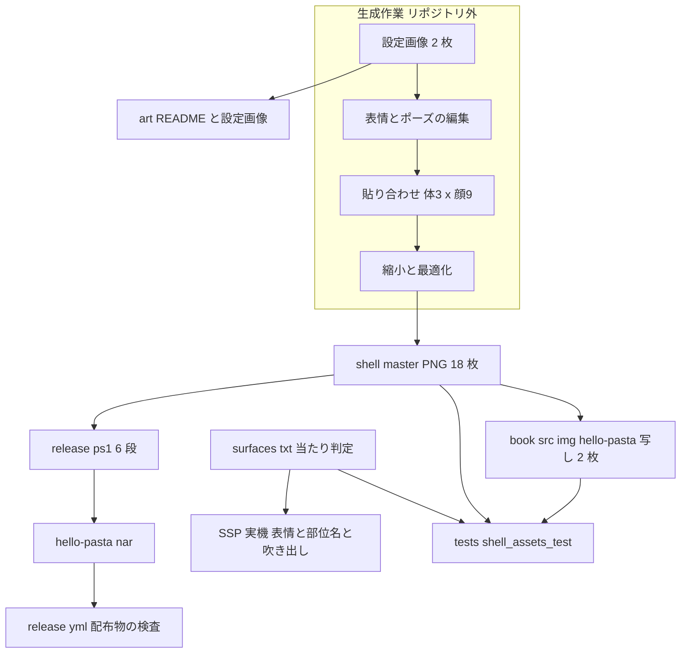
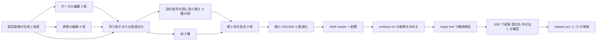

# 設計書: hello-pasta-shell-art

作成: 2026-10-10（要件 `requirements.md` R1〜R11・`research.md` §6 を入力とする）。設計ディスカッション #1〜#5（2026-10-10）でモデルの選定・試作・設定画像の承認・出力の変換・当たり判定の形まで確定済み。「【実装で確定】」と記した値（当たり判定の座標・吹き出しの offset・男の子の `Y_CUT`・顔の矩形）だけを実装で決める。

## Overview

**Purpose**: 入門ガイドの主役であるサンプルゴースト hello-pasta の立ち絵を、画像生成で作ったイラスト 18 枚（1 人 9 表情・1 枚絵）に置き換え、絵を「Rust が毎回描く生成物」から「リポジトリにコミットした素材」へ切り替える。あわせて `surfaces.txt` に当たり判定（`Head`・`Face`・`Body`）を足し、入門ガイドの準備の章に見本の絵を載せる。

**Users**: 入門ガイドの読者（表情が変わるゴーストを実機で見る・8 段目で部位名を聞く）、開発者（素材を壊さずに配布物を作る・作り直す）。

**Impact**: `crates/pasta_sample_ghost` から絵を描くプログラム（`image_generator.rs`・`config_templates.rs`・`main.rs`・`generate_ghost()`）と `image`/`imageproc` 依存が消え、クレートは「辞書と素材の検証テストの置き場」になる。`release.ps1` は 7 段から 6 段になり、`shell/master/` を二度と書き換えない。ライセンス表記は MIT 単独に揃う。

### Goals

- 立ち絵 18 枚を 333×500 px の透過 PNG として `shell/master/` にコミットし、同じ人物の 9 枚で頭の画素が一致し、同じポーズの絵で顔以外の画素が一致する（R1・R2）。
- `surfaces.txt` に `Head`・`Face`・`Body` の当たり判定を置き、8 段目が `＄ｒ４` に部位名を受け取る（R4）。
- 生成コード・CLI・依存を外し、テスト・`release.ps1`・リリース CI のどれを実行しても素材が上書きされない（R5・R6）。
- 素材の壊れ（枚数・寸法・透過・画素一致・`surfaces.txt` の対応・大きさの上限・本の写しの食い違い）を `cargo test -p pasta_sample_ghost` が捕まえる（R7・R10・R11）。
- 生成元・手順・費用・ライセンス（絵は Unlicense）を `crates/pasta_sample_ghost/art/README.md` に記録し、設定画像 2 枚を同じ場所にコミットする（R8）。

### Non-Goals

- 表情の種類・サーフェス番号・辞書・バルーン・マニュアル本文の変更（`setup.md` の見本の行だけは In scope）。
- まばたき・アニメーション、`element` を重ねる構成。
- 生成の再実行スクリプト（手順は文書として残す。Q7）。
- スクリーンショットの撮影（`getting-started-screenshots`）、シェルの説明の章（`manual-shell-guide`）、辞書が無い間の立ち絵（`boot-surface-without-dic`）。
- `book/tools/`・`dic/08-touch.pasta`・`08-touch.md`・`tests/tutorial_stages_test.rs` の変更。

## Boundary Commitments

### This Spec Owns

- `crates/pasta_sample_ghost/ghosts/hello-pasta/shell/master/` の全ファイル（PNG 18 枚・`surfaces.txt`・`descript.txt` の吹き出しの位置）。
- `crates/pasta_sample_ghost/art/`（新設。生成の記録 `README.md` と設定画像 2 枚）。
- `crates/pasta_sample_ghost` のクレート構成（`src/`・`Cargo.toml`・`build.rs`・`README.md`・`tests/integration_test.rs` の絵と吹き出しのテスト・新設 `tests/shell_assets_test.rs`）。
- `crates/pasta_sample_ghost/release.ps1`、ルートの `release.bat`、`.github/workflows/release.yml` の「配布物の検査」の `.nar` エントリ一覧。
- ルートの `Cargo.toml`（`license`・`image`/`imageproc` の行）と `Cargo.lock`。
- ライセンス表記（4 クレートの README・`.kiro/steering/tech.md` L165）。
- `crates/pasta_sample_ghost/STAGES.md` の「`Head` は仮の部位名」の注記。
- `book/src/getting-started/setup.md` の節「シェルの中身」に足す見本の行と、`book/src/img/hello-pasta/`（新設。写し 2 枚）。

### Out of Boundary

- 辞書（`dic/`）、`ghost/master/descript.txt`・`pasta.toml`、`book/tools/`、入門ガイドのほかの章と `setup.md` の既存の文・表。
- `release.yml` の検査以外の段（公開・Azure・crates.io）。リリースの実行中は本仕様の `release.ps1`・`release.yml` の変更を main へ入れない（R6.6）。
- `.kiro/steering/structure.md`・`tech.md` の「画像生成」の記述の同期（完了処理。R5.8）。`tech.md` のライセンスの 1 行だけは本仕様が直す（R8.4）。
- `THIRD_PARTY_LICENSES.txt`（`cargo about` が Rust 依存から作る。絵は載せない）。

### Allowed Dependencies

- 外部サービス: fal.ai（MCP 経由。設計・実装の生成作業にだけ使う。テスト・ビルド・CI は接続しない。R10.5）。
- 手元の道具: ffmpeg（ShareX 同梱 `C:\Program Files\ShareX\ffmpeg.exe`。縮小・最適化）、Node（貼り合わせの一回限りのスクリプト。リポジトリにはコミットしない）。
- Rust: `png` 0.18 を `pasta_sample_ghost` の dev-dependency に置く（`Cargo.lock` に既に入っている版。`image` は使わない。R5.5・Q8）。
- 既存の慣例: `tests/common/mod.rs`（`workspace_root()`）、`tests/tutorial_stages_test.rs` の「表を読んで照合する」型、`book/src/img/claudia/LICENSE.txt` の記録の書式。
- 画風の手本: `https://github.com/ponapalt/claudia`（コミット `02cbd4f5`、Unlicense）の `shell/master/surface0.png` を参照画像として生成に渡す（`surface10.png` のケロは 2 頭身のマスコットで、参照にすると男の子もマスコットになる。設計ディスカッション #3 で確認済み。使わない）。

### Revalidation Triggers

- 立ち絵の寸法（333×500）・サーフェス番号・部位名の集合（`Head`・`Face`・`Body`）が変わる → `getting-started-screenshots`・`manual-shell-guide`・`STAGES.md` の検証の表・8 段目の章を再確認する。
- `shell/master/` のファイル名・枚数が変わる → `release.yml` の検査一覧・`tests/shell_assets_test.rs`・`setup.md` の表を同時に直す。
- `.nar` に新しい種類のファイル（記録・ライセンス表示）を入れる判断になる → Q3・Q14 の再議論（本書は入れない）。
- `release.ps1` の段の数や `-SkipSetup` の意味が変わる → `release.bat`・クレート README・`RELEASE.md` を同時に直す。

## Architecture

### Existing Architecture Analysis

- `ghosts/hello-pasta/` は配布物の SSOT。テキスト系は手書きの正本、絵だけが「生成物だが追跡」の中途半端な状態（`research.md` §2.2）。本仕様は絵を手置きの正本に揃える。
- 検証はテストで行う慣例（辞書は `src/scripts.rs`・`tests/tutorial_stages_test.rs` が実ファイルを読む）。絵と `surfaces.txt` にも同じ型を当てる。
- `.nar` の中身の検査は `release.yml` の「配布物の検査」（エントリ名の列挙）。絵の検査はここに足す。
- `release.ps1` の Step 2（`cargo run -p pasta_sample_ghost`）が手元でもリリース CI でも絵を上書きしている。この段の除去が素材化の核で、**シェルの差し替えと同じ変更に含める**（中間状態で `release.ps1` を実行すると絵が戻るため）。

### Architecture Pattern & Boundary Map

選んだ形: **素材は手置きの正本、検証は 2 層（`cargo test` と `release.ps1`/`release.yml`）、生成はリポジトリ外の記録された手順**（`research.md` §4 Option C）。



**Architecture Integration**:
- Domain boundaries: 「生成」（記録と設定画像だけがリポジトリに残る）／「素材」（`shell/master/`・`book/src/img/hello-pasta/`）／「検証」（テスト・スクリプト・CI）／「クレートの整理」（削除とライセンス表記）。各領域は触るファイルが重ならないので、実装タスクを並べやすい。
- Existing patterns preserved: SSOT の `ghosts/hello-pasta/`、実ファイルを読むテスト、`release.yml` のエントリ検査、`claudia/LICENSE.txt` の記録の書式。
- New components rationale: `tests/shell_assets_test.rs`（素材の機械検証。R10）、`art/`（記録と設定画像。R8）、`book/src/img/hello-pasta/`（本に外部画像を読ませないため。R11.2）。
- Steering compliance: 「作成ツールは問題があれば止める」— 大きさの上限・欠けた絵は `release.ps1` と CI でエラー停止にし、警告続行にしない。

### Technology Stack

| Layer | Choice / Version | Role in Feature | Notes |
|-------|------------------|-----------------|-------|
| 画像生成（編集） | `openai/gpt-image-2.5/flare/edit`（確定。設計ディスカッション #1・2026-10-10 の試作で採用）。`fal-ai/qwen-image-edit-2511` は費用が合わないときの予備 | 設定画像・ポーズ 2 種・表情 8 種の編集 | 候補の比較は「生成パイプライン」節と `research.md` §7.1 |
| 切り抜き | （使わない。確定モデルが透過 PNG を直接出す） | — | 予備の qwen に切り替えた場合だけ `fal-ai/birefnet/v2`（`model=Matting`）を使う |
| 貼り合わせ | Node スクリプト（`pngjs`。一回限り・コミットしない） | 顔の矩形の貼り替え・頭と体の結合 | 手順と本文は `art/README.md` に記録する |
| 縮小・最適化 | ffmpeg（ShareX 同梱 n8.1.1） | 1024×1536 → 333×500 の lanczos 縮小（アルファ乗算）・PNG 圧縮・必要なら減色 | `book/src/img/claudia/LICENSE.txt` の手順を踏襲 |
| 検証（Rust） | `png` 0.18（dev-dependency） | PNG の寸法・色型・画素の読み出し | `image`/`imageproc` は外す。`png` は `Cargo.lock` に既にある |
| 配布 | `release.ps1`（pwsh 7）・`pasta_check release`・`release.yml` | 段の整理・`.nar` の大きさと中身の検査 | 既存の段の動作は変えない（R6.5） |

## File Structure Plan

### Directory Structure

```
crates/pasta_sample_ghost/
├── Cargo.toml                         # [[bin]]・image・imageproc・thiserror を外し、png を dev-dependency に足す
├── README.md                          # 素材の管理に書き直す（特徴・ツリー・6 ステップ・scripts/ の説明・ライセンス MIT・絵は Unlicense）
├── STAGES.md                          # 「Head は仮の部位名」の注記を確定の記述に改める（検証の表 4=Head は維持）
├── release.ps1                        # Step 2 を外して 6 段に。最終段で .nar の大きさ上限（7 MB）を検査しエラー停止
├── art/                               # 新設。生成の記録と設定画像（.nar には入らない）
│   ├── README.md                      # 生成の記録（モデル・指示文・seed・寸法・後処理・試作の実測・費用・日付・ライセンス・Unlicense 原文・著作権の注記）
│   ├── reference-girl.png             # 女の子の設定画像（基本ポーズ・通常の顔・縮小前 1024×1536。設計 #3 で承認・コミット済み。1.49 MB）
│   └── reference-boy.png              # 男の子の設定画像（同上。1.37 MB）
├── src/
│   ├── lib.rs                         # ドキュメントコメントと `mod scripts;` だけ（generate_ghost・GhostError を削除）
│   └── scripts.rs                     # 変更なし（辞書の検証テスト）
├── ghosts/hello-pasta/shell/master/
│   ├── surface0.png … surface8.png    # 女の子 9 枚（差し替え）
│   ├── surface10.png … surface18.png  # 男の子 9 枚（差し替え）
│   ├── surfaces.txt                   # 手書きの正本。18 ブロック × (element0 + collisionex 3 行)
│   └── descript.txt                   # 吹き出しの位置 4 行だけ更新
└── tests/
    ├── shell_assets_test.rs           # 新設。素材の機械検証（R10・R11.3・R7.1）
    ├── integration_test.rs            # 絵のテスト 4 本を削除し、吹き出しの決め打ちを新しい値に
    ├── common/mod.rs                  # 変更なし（workspace_root を shell_assets_test が使う）
    ├── dist_src_validation_test.rs    # 変更なし
    ├── self_deploy_integration_test.rs # 変更なし
    └── tutorial_stages_test.rs        # 変更なし

book/src/
├── getting-started/setup.md           # 節「シェルの中身」の表の直後に見本の表（2 セル）を足す
└── img/hello-pasta/
    ├── surface0.png                   # shell/master/surface0.png のバイト単位の写し
    └── surface10.png                  # 同 surface10.png
```

削除するファイル: `src/image_generator.rs`・`src/config_templates.rs`・`src/main.rs`・`build.rs`。

### Modified Files

- `Cargo.toml`（ルート）— `license = "MIT"`。`image`・`imageproc` の 2 行を外す。`Cargo.lock` は同じ変更で更新してコミットする（`release.yml` の不変検査のため）。
- `crates/pasta_check/README.md`・`crates/pasta_dsl/README.md`・`crates/pasta_lsp/README.md`・`crates/pasta_sample_ghost/README.md` — ライセンスの節を「MIT」に。
- `.kiro/steering/tech.md` L165 — 「MIT OR Apache-2.0: デュアルライセンス」→「MIT」。
- `release.bat`（ルート）— 段の説明「1-3. ... generate images」→ 新しい 6 段の構成に。
- `.github/workflows/release.yml` — 「配布物の検査」の `hello-pasta.nar` の必須エントリに `shell/master/surfaces.txt`・`shell/master/descript.txt`・立ち絵 18 枚を足す。ほかの段は触らない。
- `crates/pasta_sample_ghost/RELEASE.md` — 段の数に触れる記述があれば合わせる（現状は CI 側の手順が中心で、段の数の記述は無い。確認のうえ必要な行だけ）。

## System Flows

### 生成から配布までの流れ



- 判断点（R2.6）: **済み（設計ディスカッション #2・2026-10-10）**。女の子の試作 3 ポーズで人物が揃い、継ぎ目も出なかったので、**ポーズ 3 種で進める**。男の子は実装で同じ手順を踏み、設定画像の段階でネッカチーフと切り線の高さを目で確かめる。戻り先（全表情を基本のポーズ 1 種にする。体は 1 種、`Body` の当たり判定は 9 枚で同一）は、実装で男の子だけが揃わなかったときに男の子にだけ使う。
- 失敗時の扱い: 生成サービスの残高切れ・費用上限（R2.9）→ 止めて開発者に相談する。縮小後に 1 枚 250 KB を超える → 減色（後述）。減色でも超える → Q5 の再議論（本書では寸法を変えない）。

## Requirements Traceability

| Requirement | Summary | Components | Interfaces | Flows |
|-------------|---------|------------|------------|-------|
| 1.1, 1.3, 1.5, 1.6 | 18 枚・透過・333×500・透かし無し | 生成パイプライン, shell/master | `art/README.md` の手順, `shell_assets_test` | 生成から配布 |
| 1.2, 1.9, 1.10 | 構図・ポーズの割り当て・手は顔に重ねない | 生成パイプライン（指示文） | ポーズ表（本書と `shell_assets_test` の定数） | 同上 |
| 1.4, 1.8 | 見た目の区別・画風は手本 | 生成パイプライン（設定画像の指示文・参照画像） | 設定画像の承認 | A |
| 1.7, 2.3 | 表情が読み取れる・別ポーズでも同じ人物 | 実機確認 | SSP（MCP） | L |
| 2.1, 2.2, 2.4 | 頭は 9 枚で画素一致・体はポーズ内で一致・1 枚絵・継ぎ目なし | 貼り合わせ（領域の定義）, `shell_assets_test` | 領域の契約（`surfaces.txt` の `Head`/`Face` 矩形 + 余白） | E, G, K |
| 2.5, 2.6, 2.8, 2.9 | 試作・戻り先・設計段階でのモデル選定・費用 | 設計ディスカッション, `art/README.md` | 費用の記録 | 判断点 |
| 2.7 | アニメーション無し | surfaces.txt | — | — |
| 3.1, 3.2, 3.3, 3.4 | 番号の対応維持・欠番 9・辞書は不変 | surfaces.txt, `shell_assets_test` | — | — |
| 4.1〜4.5, 4.8 | `Head`/`Face`/`Body`・同一座標・描画範囲に一致 | surfaces.txt（当たり判定）, `shell_assets_test` | `collisionex` 契約 | J, K |
| 4.6, 4.7 | 実機で `Reference4` | 実機確認 | SSP `OnMouseDoubleClick` | L |
| 4.9, 4.10 | `STAGES.md` の注記・辞書と章は不変 | STAGES.md | — | — |
| 5.1〜5.7 | 素材化・生成コードの削除・依存の除去・README・build.rs | クレートの整理 | `Cargo.toml` | — |
| 5.8 | steering の同期 | 完了処理 | — | — |
| 6.1〜6.5 | release.ps1 6 段・release.bat・README・`.nar` の中身・CI の検査 | release.ps1, release.yml | 段の契約, エントリ一覧 | M |
| 6.6 | リリース中は入れない | 運用（ウェーブの約束） | — | — |
| 7.1, 7.4 | 1 枚 250 KB・合計 4.5 MB | `shell_assets_test`, 最適化 | 上限の定数 | H, K |
| 7.2, 7.3 | `.nar` 7 MB・実測の記録 | release.ps1（最終段）, `art/README.md` | 上限の定数 | M |
| 8.1, 8.2, 8.5, 8.8, 8.9, 8.11 | 生成の記録・著作権の注記・重みのライセンス・手本の出典・設定画像 | art/ | 記録の目次 | A |
| 8.3, 8.4, 8.6, 8.7 | 絵は Unlicense・MIT 統一・`.nar` に入れない・非商用モデルは使わない | art/README.md, README ×4, Cargo.toml, tech.md | — | — |
| 8.10 | `.nar` に設定画像を含めない | art/ の置き場所（`ghosts/` の外） | release.yml の検査（任意） | M |
| 9.1〜9.4 | 吹き出しの位置・実機・テスト・ほかの項目は不変 | descript.txt, integration_test.rs | — | L |
| 10.1〜10.8 | 素材の検証・ネットワーク非依存・旧テストの置き換え・`cargo test --all` と clippy | `shell_assets_test`, integration_test.rs, クレートの整理 | テストの契約 | K |
| 11.1〜11.6 | 見本の絵の行・写し・食い違いの検査・本文検査に通る書き方・`book/tools/` 不変・CI 一式 | setup.md, book/src/img/hello-pasta, `shell_assets_test` | 表のセルの画像行 | K |

## Components and Interfaces

| Component | Domain/Layer | Intent | Req Coverage | Key Dependencies (P0/P1) | Contracts |
|-----------|--------------|--------|--------------|--------------------------|-----------|
| 生成パイプライン | 生成（リポジトリ外） | 設定画像 → 体 3 × 顔 9 → 18 枚の 333×500 透過 PNG | 1, 2.1〜2.6, 7.1, 8.1 | fal.ai（P0）, ffmpeg（P0）, Node pngjs（P1） | Batch |
| art/（記録と設定画像） | 生成 | 手順・費用・ライセンスの正本と、作り直しの起点 | 8.1〜8.3, 8.5, 8.8〜8.11 | 生成パイプライン（P0） | State |
| shell/master（素材） | 素材 | 配布するシェル。PNG 18 枚・`surfaces.txt`・`descript.txt` | 1, 3, 4, 9 | 生成パイプライン（P0） | State |
| surfaces.txt の当たり判定 | 素材 | `Head`・`Face`・`Body` の矩形。テストの領域定義の正本も兼ねる | 4.1〜4.5, 4.8, 2.1, 2.2 | shell/master（P0） | State |
| shell_assets_test | 検証 | 素材の機械検証（枚数・寸法・透過・画素一致・`surfaces.txt`・大きさ・本の写し） | 10.1〜10.6, 10.8, 7.1, 11.3 | `png`（P0）, surfaces.txt（P0）, common（P1） | Service |
| クレートの整理 | クレート | 生成コード・CLI・依存・`build.rs` の削除、README・ライセンス表記 | 5.2, 5.5〜5.7, 8.4, 10.6, 10.7 | — | — |
| release.ps1 / release.bat | 配布 | 6 段の配布スクリプト。`.nar` の大きさ上限でエラー停止 | 6.1, 6.2, 6.3, 6.5, 7.2, 7.3 | pasta_check（P0） | Batch |
| release.yml の検査 | 配布 CI | `.nar` に `surfaces.txt`・`descript.txt`・18 枚が揃っているか | 6.4 | release.ps1（P0） | Batch |
| 入門ガイドの見本 | マニュアル | `setup.md` の見本の表と `book/src/img/hello-pasta/` の写し | 11.1, 11.2, 11.4, 11.5, 11.6 | shell/master（P0）, `book/tools` の既存検査（P1） | State |

### 生成（リポジトリ外）

#### 生成パイプライン

| Field | Detail |
|-------|--------|
| Intent | 設定画像 2 枚から、体 3 種 × 顔 9 種を貼り合わせて 18 枚を書き出す、記録された手作業の手順 |
| Requirements | 1.1〜1.6, 1.8〜1.10, 2.1, 2.2, 2.4〜2.6, 2.8, 2.9, 7.1, 7.4, 8.1 |

**Responsibilities & Constraints**
- 生成サービスの呼び出しはすべて fal.ai（MCP）。費用は設計の段階 10 ドル・全体 40 ドル以内。使った額を `art/README.md` に記録する。
- 貼り合わせは**縮小前（1024×1536）**で行い、18 枚それぞれを同じフィルタで縮小する。頭と体は**首の高さの水平線で分ける**（頭レイヤー = 切り線より上の全幅、体レイヤー = 切り線より下の全幅）。顔は頭レイヤーの中の**矩形**を貼り替える。頭レイヤー（通常の顔）と体レイヤー（ポーズごと）はそれぞれ 1 枚だけ存在し、9 枚はそれらの組み合わせで作る。したがって同じキャラクターの 9 枚は切り線より上（顔の矩形を除く）の元画素が構造上同じになり、同じポーズの絵は顔の矩形の外の元画素が同じになる（R2.1・R2.2 の根拠）。
- 切り線と顔の矩形には**ぼかし帯**（境界をなじませる幅。full-res で 12 px 程度）を置く。ぼかし帯の中の画素は両レイヤーの混合なので、「一致する領域」からは帯の幅と縮小フィルタの半径（lanczos で出力 3 px）ぶんを除く。この余白を**検査の余白 `MARGIN`**（出力座標で 8 px を既定）として `shell_assets_test` に定数で持つ。
- 女の子のおさげ（肩から胸へ垂れる部分）とリボン、男の子のネッカチーフは切り線より下なので**体の側**に入る。ポーズ間でおさげの垂れ方が少し変わるのは「体が変わる」の範囲として受け入れる（R2.3）。切り線は顎の下・首の位置（おさげが頬の横から離れ、襟が始まる前）に置く。
- 顔の矩形は眉の上から口の下、頬の端から端まで。手はどのポーズでも顔・髪に重ねない指示文にする（R1.10）。
- 人物の背丈は手本の 8〜9 割。設定画像の指示文で「キャンバスの高さの約 85% を占める・足元に小さな余白」とし、承認時に手本（`claudia/shell/master/surface0.png`、333×500）と並べて見る。

**Dependencies**
- External: fal.ai `openai/gpt-image-2.5/flare/edit`／`fal-ai/qwen-image-edit-2511`／`fal-ai/birefnet/v2` — 生成・切り抜き（P0）。詳細は `research.md` §7.1。
- External: ffmpeg（縮小・最適化・減色）（P0）。Node + `pngjs`（貼り合わせ）（P1）。

**Contracts**: Batch [x]

##### Batch / Job Contract（生成の手順＝レシピ）

採用モデル: **`openai/gpt-image-2.5/flare/edit`**（設計ディスカッション #1 で確定。試作 3 枚＝女の子の基本・びっくり・わくわくを 2026-10-10 に生成し、画風・透過出力・ポーズ間の一貫性を確認した。実額は fal のダッシュボードで確認し、1 枚 0.5 ドルを超えるなら予備の qwen へ切り替える）。候補の比較は記録として残す:

| 候補 | 役割 | 利点 | 懸念 |
|------|------|------|------|
| `openai/gpt-image-2.5/flare/edit` | **採用**（手本と同じ系統のモデル） | 手本の画風に最も近づきやすい。参照画像を最大 16 枚渡せる（手本の絵 + 自分の設定画像）。`background: transparent` で切り抜きが要らない。`image_size` を 1024×1536 に指定できる | seed が無く同じ結果を再現できない。fal の価格表示が「1 unit」で実額が不明（OpenAI の定価は high 品質 1024×1536 で 1 枚 0.25 ドル前後と見込む）。出力に C2PA メタデータが入る（可視の透かしではなく、再エンコードで消える） |
| `fal-ai/qwen-image-edit-2511` | 予備。採用モデルの実額が合わないときだけ | 0.03 ドル/MP（1024×1536 ≈ 0.05 ドル/枚）。seed・寸法を固定できる。重みは Apache-2.0。透かしの記述なし | 透過出力が無いので単色背景 + `birefnet/v2` の切り抜きが要る。画風の再現は参照画像頼み |
| `fal-ai/nano-banana-pro/edit` | 比較だけ | 高い一貫性 | 全出力に SynthID。0.15 ドル/枚 |

- **Trigger**: 設計ディスカッション（試作・設定画像の承認）と実装（残りの絵の生成）で、開発者が MCP で手で呼ぶ。
- **Input / validation**: 参照画像は手本の `surface0.png`（女の子用）・`surface10.png`（男の子用）（`https://raw.githubusercontent.com/ponapalt/claudia/02cbd4f5/shell/master/` から fal の CDN へアップロードして渡す）と、承認済みの自分の設定画像。生成寸法は **1024×1536**（333:500 と同じ 2:3。縮小率 ≈ 1/3.07）。設定画像は**承認済み**（設計ディスカッション #3・2026-10-10）で `art/` にコミットしてある。実装は作り直さない。以下は記録（`art/README.md` へ写す）:

  ```text
  女の子（設定画像・基本ポーズ・通常の顔。試作 request_id 01a12595-936e-70f0-a9ce-3c2aaf6513e8 の全文）
  Draw a NEW character in exactly the same art style as the reference image: chibi anime style
  about 3 heads tall, large round eyes, soft cel shading, thin brown outlines, same line weight,
  same head size and same overall body proportions as the reference. Do not copy the reference
  character's clothes, hair or colors.

  The new character: full-body front view of a little girl, a waitress apprentice at a pasta
  restaurant. Chestnut-brown hair in two braids tied with tomato-red ribbons. She wears a red
  apron dress over a white blouse with short puffy sleeves, white socks and brown shoes. She
  stands straight facing the viewer, both arms relaxed and hanging at her sides, calm neutral
  expression with a small closed mouth, eyes looking at the viewer. Hands empty, not touching
  her face or hair; nothing overlaps the face or hair.

  Composition: the character is centered and fills about 85% of the image height, with a small
  margin under the feet and above the head. Fully transparent background, no ground shadow, no
  text, no logo, no watermark, no frame.

  男の子（設定画像）は 3 段階で作った。採用の系譜だけ全文を残す。
  段階 1（request_id 01a1259d-3c95-7ee3-9b13-229f1eaef5b6。参照 = 手本 surface0 + 女の子の設定画像）
  Two reference images are given: the first is a blonde princess, the second is a girl in a red
  apron dress. Draw a NEW character in exactly the same art style as these two references: chibi
  anime style about 3 heads tall, large round detailed eyes with highlights, soft cel shading,
  thin brown outlines, same line weight, same head size and the SAME body proportions and figure
  height as the second reference (the girl in the red apron dress) so that the two could stand
  side by side as a pair. Do not copy the references' clothes, hair or colors.

  The new character: full-body front view of a little boy, an apprentice cook at a pasta
  restaurant. Short black hair under a small white chef's hat, a white double-breasted cook's
  jacket with a blue neckerchief, dark trousers, white socks and brown shoes. He stands straight
  facing the viewer, both arms relaxed and hanging at his sides, calm neutral expression with a
  small closed mouth, eyes looking at the viewer. Hands empty, not touching his face or hair;
  nothing overlaps the face or hair.

  Composition: the character is centered and fills about 85% of the image height, with a small
  margin under the feet and above the hat. Fully transparent background, no ground shadow, no
  text, no logo, no watermark, no frame.

  段階 2（request_id 01a125a5-9260-7c60-843c-65e02ab357bb。参照 = 女の子 + 段階 1 系の男の子
  01a125a4-2dab-7b40-89e6-8701a3058e22。帽子を外して体の釣り合いを女の子に合わせる）
  Two reference images: the first is a girl in a red apron dress, the second is a boy cook
  wearing a chef's hat. Redraw the BOY WITHOUT the chef's hat: bare head, short slightly messy
  black hair fully visible. His body proportions must match the GIRL in the first image: the
  same chibi head-to-body ratio (about 3 heads tall), the same shoulder width as hers, the same
  head size as hers, arms of similar thickness; torso and legs slim and straight, not chubby.
  Keep his face design, eyes, hair color, white double-breasted cook's jacket with rolled
  sleeves, blue neckerchief, white apron, dark trousers, white socks and brown shoes, and keep
  the same art style, line weight and colors as the references. Pose: standing straight facing
  the viewer, both arms relaxed and hanging at his sides, calm neutral expression with a small
  closed mouth. Hands empty, not touching his face or hair.

  Composition: the character is centered; his feet are near the bottom with a small margin, and
  the top of his hair is at about 22% from the top of the image, leaving empty space above the
  head (a hat will be added later). Fully transparent background, no ground shadow, no text, no
  logo, no watermark, no frame.

  段階 3（request_id 01a125a8-92e0-7e90-a326-ccba87020b0e。参照 = 段階 2。帽子を載せる。これが設定画像）
  Edit this character image. Add ONLY a white chef's hat (a classic pleated toque) sitting
  squarely on top of his head: its height is about half of his head's height, its width is
  about the width of his head, with his black bangs and side hair still visible below the band.
  Keep everything else exactly identical: the same character, same art style, same face, eyes,
  expression, hair, jacket, neckerchief, apron, trousers, shoes, colors and line weight. Do not
  move or resize the body or the head; keep the feet at exactly the same place. The hat must not
  cover the face or the eyebrows. Transparent background, no shadow, no text.

  不採用の試行（記録用）: 01a1259c-09ef-74a0-9c8f-fac87e4a1ca4（参照に手本の surface10 を使い 2 頭身の
  マスコットになった）、01a125a1-7e83-7661-8839-9ea4b04b766f（丸く太りすぎ）、01a125a4-2dab-7b40-89e6-
  8701a3058e22（肩幅は中間になったが帽子込みでは釣り合いが決めにくい）、01a125a7-eb1f-7130-aee3-
  0013ebb8ee20（小さな帽子を斜めに載せた案。正統なコック帽でないため不採用）。
  教訓: 帽子など頭の上の小物は、体の釣り合いを帽子なしで確定してから編集で載せる。
  ```

  ポーズの編集（設定画像を入力に。1 人 2 回。試作で使った全文。`{POSE}` を差し替える）:

  ```text
  Edit this character image. Change ONLY the pose of the arms: {POSE}. Keep everything else
  exactly identical: the same character, same art style, same head, face, facial expression,
  hair, braids, ribbons, dress, colors and line weight. Keep the head at exactly the same
  position and size, keep the feet at exactly the same place and keep the character exactly the
  same height. Hands must not touch or overlap the face or hair. Transparent background, no
  shadow, no text.

  びっくり {POSE} = both arms are raised and spread outward at shoulder height with open palms
    facing the viewer, as if startled in surprise
    （試作 request_id 01a12596-a6a6-7dc1-8f6c-7cad30b2a98d）
  女の子の決めポーズ {POSE} = both hands are clasped together in front of her chest, fingers
    interlaced, elbows bent, an excited and bouncy 'can't wait' pose. Hands must stay below the chin
    （試作 request_id 01a12597-0fb7-7cc1-80a1-2c8ecdfcdeb4）
  男の子の決めポーズ {POSE} = arms folded across the chest, an exasperated 'oh dear' pose
    （男の子は hair, braids, ribbons, dress を hair, chef's hat, neckerchief, jacket, apron に読み替える）
  ```

  表情の編集（設定画像を入力に。1 人 8 回。`通常` は設定画像そのもの）:

  ```text
  Change only the facial expression to {expression}. Keep everything else identical: hair,
  head outline, body, pose, colors, lighting, background. Do not move or resize the head.
  Keep all changes inside the face (eyes, eyebrows, mouth, cheeks); no marks outside the face.
  笑顔: a big happy smile, eyes curved into happy arcs
  照れ: shy smile, pink blush on both cheeks, eyes glancing slightly aside
  驚き: wide-open round eyes, raised eyebrows, small open mouth
  泣き: teary eyes with tears on the cheeks, downturned mouth
  困惑: troubled slanted eyebrows, wavy mouth, a single sweat drop on the temple
  キラキラ: sparkling star highlights in the eyes, excited open smile
  眠い: half-closed droopy eyes, small sleepy mouth
  怒り: angry eyebrows pulled down, puffed cheeks, frowning mouth
  ```

  その他のパラメータ（採用モデル。試作と同じ）: `image_size={width:1024,height:1536}`・`quality=high`・`background=transparent`・`output_format=png`・`num_images=1`。seed は無い。予備（qwen）: `image_size={width:1024,height:1536}`・`num_inference_steps=28`・`guidance_scale=4.5`・`seed=`（予備を使うことになった場合は、最初の採用結果の seed を記録して以後固定する）・背景は指示文で「plain flat #00FF00 background」として `birefnet/v2`（`model=Matting`, `operating_resolution=2048x2048`）で切り抜く。
- **Output / destination**: 1 人につき full-res の層 = 頭 1（通常の顔）・顔の矩形 8・体 3。貼り合わせ → 9 枚 → 縮小 → `shell/master/surfaceN.png`。縮小は **290×435 に縮めて 333×500 の下寄せ中央に置く**（設計ディスカッション #3。モデルが人物をキャンバスの 93〜97% で描くため、この縮小で人物の高さが手本の 85%（女の子 405 px）・87%（男の子 415 px・帽子込み）になり、要件 Q5 の 8〜9 割に入る。18 枚とも同じ変換なので画素一致は保たれる）。ffmpeg（`claudia/LICENSE.txt` と同じ考え方）:

  ```text
  縮小: format=gbrap,premultiply=inplace=1,scale=290:435:flags=lanczos,unpremultiply=inplace=1,format=rgba,pad=333:500:21:64:color=0x00000000
        出力オプション -compression_level 9 -pred mixed
        （縮小率 435/1536 = 0.2832。full-res の行 y は出力の round(y × 0.2832) + 64 行目になる。女の子の切り線 500 → 205.6）
  減色（1 枚でも 250 KB を超えたときだけ・同じキャラクターの 9 枚で 1 つのパレットを共有）:
        palettegen=max_colors=256:reserve_transparent=1:stats_mode=full（9 枚をまとめて入力）
        paletteuse=dither=bayer:alpha_threshold=128（誤差拡散ディザは使わない。画素一致を壊すため）
  ```

  貼り合わせの一回限りのスクリプトは、入力（層のファイル）・定数（切り線 `Y_CUT`・顔の矩形・ぼかし幅）・出力の対応を `art/README.md` に本文ごと載せる（記録であり、保守対象のスクリプトではない）。
- **Idempotency & recovery**: 正本はコミットした 333×500 の 18 枚。作り直しは設定画像と記録から行う。採用モデルは seed が無いので「同じ絵」は再現できず、作り直しは「同じ手順で別の絵を作る」になる。最小の作り直し単位は**ポーズ**（体を描き直したら、そのポーズの表情をすべて作り直し、頭は設定画像から取り直す）。表情 1 つだけの差し替えは、頭レイヤーが設定画像そのものなので可能（顔の矩形だけ再生成して貼る）。

**Implementation Notes**
- Integration: 設定画像の承認は設計ディスカッションで開発者が目で見て決める（R2.8）。実装では承認済みの設定画像だけを入力に使い、都度の確認なしで進めてよい（Q12）。
- Validation: 縮小後の 3 ポーズを並べた比較画像を試作で作り、別ポーズで人物が揃うか・切り線の継ぎ目・縁のハローを見る（R2.5）。結果（ずれの px・継ぎ目の見え方・1 枚の KB）を `art/README.md` の「試作の実測」に書く。
- 試作の実測（2026-10-10・女の子・基本／びっくり／わくわく。設計ディスカッション #1）:
  - 3 枚とも不透明画素の外接矩形が上端 71・下端 1498（1024×1536）で一致 → 背丈と足元は編集で動かなかった。人物の高さはキャンバスの 93%（指示文の 85% より大きい）。
  - 頭の位置ずれ: 基本に対し、びっくり・わくわくとも最良の平行移動が (dx=1, dy=0) px（1024 幅）→ 出力では 1 px 未満。位置合わせの工程は不要。
  - 貼り合わせ `Y_CUT=500`・`FEATHER=12`（顎の下、襟の上）で合成し、333×500 に縮小した結果: 基本との差分が 0 の行は 0〜157、切り線は 162.8 行目 → 切り線の上 5 px まで一致した。`MARGIN=8` は余裕を持って成り立つ。
  - 継ぎ目: 333×500 でも 3 倍拡大でも、首・襟・おさげに段差や色の縁は見えなかった。
  - 1 枚の大きさ: 縮小後 133〜139 KB（RGBA8・`-compression_level 9 -pred mixed`）。減色は不要の見込み。
  - 判断: ポーズ 3 種で進める（R2.6 の戻り先は使わない）。
  - 最終の縮小（290×435 + pad）で測り直し（#3）: 基本との差分が 0 の行は 0〜201、切り線は 205.6 行目 → 切り線の上 3.6 px まで一致。`MARGIN=8` は 2 倍の余裕で成り立つ。1 枚 106〜111 KB。
- Risks: 表情の編集で頭の位置が数 px ずれる → 顔の矩形を貼る前に、頭の輪郭で位置合わせ（平行移動）してから貼る。ずれが 1024 px 幅で 6 px（出力 2 px）を超える編集はやり直す。ポーズの編集で切り線付近の首・襟・おさげの輪郭がずれる → ぼかし帯でなじませ、見えるなら切り線を 10〜20 px 上下に動かして再合成する。それでも消えなければ R2.6 の戻り先へ。

### 生成の記録

#### art/（記録と設定画像）

| Field | Detail |
|-------|--------|
| Intent | 生成元・手順・費用・ライセンスの正本と、表情を足す・作り直すときの起点 |
| Requirements | 8.1, 8.2, 8.3, 8.5, 8.8, 8.9, 8.10, 8.11, 2.5, 2.6, 2.9, 7.3 |

**Responsibilities & Constraints**
- 置き場所は `crates/pasta_sample_ghost/art/`。`ghosts/hello-pasta/` の外なので `pasta_check release` の対象にならず、`.nar` に入らない（R8.10）。クレートは `publish = false` なので crates.io にも出ない。
- 設定画像は 1 人 1 枚（基本ポーズ・通常の顔・縮小前・透過 PNG）。**2 枚とも設計ディスカッション #3 で開発者が承認し、ffmpeg で可逆に再エンコード（メタデータ除去・画素は同一）してコミット済み**。ポーズ 2 種の体と表情 8 種の原画はコミットしない（R8.11）。**確定（設計ディスカッション #4）**: 採用モデルに seed は無いが、コミットは設定画像 2 枚に限る。作り直しの単位は「ポーズ」（体を描き直したら、そのポーズに属する表情をすべて作り直す）。記録にその旨を書く。

**Contracts**: State [x]

##### State Management
- `art/README.md` の目次（この順で書く）:
  1. 出典とライセンス — 絵（シェルの立ち絵 18 枚と設定画像 2 枚）は Unlicense。AI 生成物であること。画風の手本「悪役令嬢クローディア」（リポジトリ URL・参照コミット `02cbd4f5`・Unlicense）。立ち絵を生成したのは本リポジトリの開発者（「同じ作者に依頼した」は書かない。R8.8）。
  2. 著作権の注記 — USCO の報告書 Part 2 の見解（AI 生成物に著作権が認められない可能性）。日本法での扱いは未確認。再配布の妨げにはならない。
  3. 使ったサービスとモデル — fal.ai のエンドポイント ID、呼んだ日付、重みのライセンスと出力の利用条件・透かしの有無（出典 URL 付き。R8.5）。OpenAI の出力の利用条件と C2PA は一次資料（OpenAI のヘルプ記事・利用規約）を実装で確かめてから書く。取得できなければ「未確認（日付・URL）」と正直に書く。seed が無いことと、作り直しの単位がポーズであることを明記する。
  4. 設定画像の作り方 — 指示文の全文・参照画像・寸法・seed（あれば）・採用した試行の番号。
  5. 表情とポーズの編集 — 指示文の全文（表情 8 × 2 人、ポーズ 2 × 2 人）・seed・寸法。
  6. 貼り合わせ — 層の一覧、`Y_CUT`・顔の矩形・ぼかし幅（キャラクターごと）、一回限りのスクリプトの本文。
  7. 切り抜きと縮小・最適化 — コマンドの全文。減色をしたか、どのファイルに。
  8. 試作の実測 — ずれの px・継ぎ目・縁・1 枚の KB・合計・判断（ポーズ 3 種を採ったか、基本 1 種へ戻したか）。
  9. 費用 — 試作・設計・実装それぞれの実額と合計（上限 40 ドル）。
  10. The Unlicense（原文）。
- 持続性: 記録は Markdown のみ。画像は PNG 2 枚（1 枚 1〜2 MB 見込み。一回限りのコミット）。

### 素材

#### shell/master（PNG 18 枚・descript.txt）

| Field | Detail |
|-------|--------|
| Intent | 配布するシェルの正本 |
| Requirements | 1.1, 1.3, 1.5, 3.1, 3.2, 5.1, 9.1, 9.3, 9.4 |

- PNG は RGBA8（減色した場合は tRNS 付きパレット）。333×500。ファイル名は現行どおり `surface0.png`〜`surface8.png`・`surface10.png`〜`surface18.png`。`surface9.png` は置かない。
- `descript.txt` は吹き出しの 4 行だけ変える。初期値（**【実機で確定】**。手本の `sakura.balloon.offsetx,50`・`offsety,15` を起点に、2 人とも同じ背丈なので `kero` も同程度）: `sakura.balloon.offsetx,50`・`sakura.balloon.offsety,20`・`kero.balloon.offsetx,50`・`kero.balloon.offsety,20`。SSP で台詞を出し、吹き出しが顔に重ならない値に直してから `integration_test.rs` の決め打ちを合わせる（R9.2・R9.3）。`charset`・`type`・`name`・`craftman`・`craftmanw`・`seriko.use_self_alpha,1` は変えない。

#### surfaces.txt の当たり判定

| Field | Detail |
|-------|--------|
| Intent | 部位名 `Head`・`Face`・`Body` の矩形。`shell_assets_test` が画素一致の領域を知る正本も兼ねる |
| Requirements | 4.1, 4.2, 4.3, 4.4, 4.5, 4.8, 2.1, 2.2, 2.7, 3.2 |

**Contracts**: State [x]

##### State Management
- 書式（UKADOC `collisionex*,ID,タイプ,座標...`。rect は始点 XY・終点 XY の 4 つ）。1 ブロックの形:

  ```text
  surface0
  {
  element0,overlay,surface0.png,0,0
  collisionex0,Face,rect,X1,Y1,X2,Y2
  collisionex1,Head,rect,X1,Y1,X2,Y2
  collisionex2,Body,rect,X1,Y1,X2,Y2
  }
  ```

- 形はすべて **rect**（楕円・多角形は使わない。座標が読めて、テストの領域計算が単純で、入門ガイドの読者が真似しやすい）。
- **`Face` を `Head` の内側に重ねる。書く順は `Face` → `Head` → `Body`**（設計ディスカッション #5 で確定）。根拠は UKADOC `collision-sort` の既定（none）「ID によらず先に書かれている方が手前」。先に書いた `Face` が勝ち、残りの頭はすべて `Head` になるので、頬の横の髪や帽子を触っても部位名が空にならない（`research.md` §7.3）。`Face` = 眉の上から口の下・頬の端から端、`Head` = 頭全体（髪・帽子・頬の横・おさげの付け根まで。顔の矩形を含む）、`Body` = 首から胴の下端まで（足元は含めない。R4.7）。`Body` は `Head` とも `Face` とも重ねない。手本クローディアは `Head` と `Face` を重ねず、頬の横の髪を別 ID `Hair` で補っているが、本仕様は部位名を 3 つに決めたので重ねる形で同じ効果を得る。
- 同じキャラクターの 9 ブロックで `Head`・`Face` の座標は同一。`Body` はポーズ（R1.9 の表）ごとに同一。座標はキャンバス内（0 ≤ X1 < X2 ≤ 333、0 ≤ Y1 < Y2 ≤ 500）。具体値は絵が決まってから決める（**【実装で確定】**）。
- テストとの契約: `shell_assets_test` は `Face` の矩形を `MARGIN` だけ外へ広げた領域を「顔の領域」、`Head` の矩形から「顔の領域」を除いた画素を「頭の領域」として読む。したがって `Head` の矩形は、体がポーズで違い始める行より上で終わらせ、`Face` を `MARGIN` 広げた範囲は、表情で実際に変わる画素をすべて覆う（実装の実測で訂正。下の「制約」）。`Body` の矩形は切り線より `MARGIN` 以上、下から始める。順序の約束もテストが見る: 各ブロックの `collisionex0` が `Face`、`collisionex1` が `Head`、`collisionex2` が `Body`。`Face` は `Head` に完全に含まれ、`Body` はどちらとも交わらない。
- `surface9` と 19 以上は定義しない。`animation` は書かない（R2.7）。

### 検証

#### shell_assets_test（`tests/shell_assets_test.rs`）

| Field | Detail |
|-------|--------|
| Intent | コミットした素材の置き間違い・壊れを `cargo test -p pasta_sample_ghost` で捕まえる |
| Requirements | 10.1, 10.2, 10.3, 10.4, 10.5, 10.6, 10.8, 7.1, 11.3, 3.2, 4.1, 4.2, 4.4 |

**Responsibilities & Constraints**
- 実ファイル（`CARGO_MANIFEST_DIR/ghosts/hello-pasta/shell/master/` と `workspace_root()/book/src/img/hello-pasta/`）だけを読む。ネットワーク・一時ディレクトリ・DLL を使わない。
- `png` クレートで復号する。`Transformations::normalize_to_color8()` と `EXPAND` を使い、復号後の色型が `Rgba`（または `GrayscaleAlpha`）であることを「アルファチャンネルを持つ」の判定にする（RGBA8 でも tRNS 付きパレットでも通る）。
- `surfaces.txt` は小さなパーサで読む（`charset,UTF-8` の先頭行、`surfaceN` と `{`〜`}` のブロック、`element0,overlay,surfaceN.png,0,0`、`collisionexK,ID,rect,X1,Y1,X2,Y2`）。形が崩れていれば 0 件として素通りせず失敗にする（`tutorial_stages_test.rs` と同じ流儀）。

**Dependencies**
- Outbound: `png` 0.18（dev-dependency）— 復号（P0）。`tests/common/mod.rs::workspace_root`（P1）。
- Inbound: `manual.yml`・main CI の `cargo test` — 実行（P0）。

**Contracts**: Service [x]

##### Service Interface（テスト関数と定数）

```rust
// tests/shell_assets_test.rs（公開 API ではなく、テストの契約として列挙）
const CANVAS: (u32, u32) = (333, 500);
const MAX_PNG_BYTES: u64 = 250 * 1024;          // R7.1
const MAX_TOTAL_BYTES: u64 = 4_718_592;         // 4.5 MB（4.5 * 1024 * 1024。KB・MB は 1024 進。release.ps1 の 1MB と同じ数え方）
const MARGIN: u32 = 8;                           // 顔の矩形を外へ広げる余白（ぼかし帯 + 縮小フィルタ）。設計ディスカッション #2 で確定
const SAKURA: [u32; 9] = [0, 1, 2, 3, 4, 5, 6, 7, 8];
const KERO: [u32; 9] = [10, 11, 12, 13, 14, 15, 16, 17, 18];
/// R1.9 のポーズの割り当て（表情のサーフェス番号の組）
const SAKURA_POSES: [&[u32]; 3] = [&[1, 0, 7, 5], &[3, 8], &[6, 2, 4]];
const KERO_POSES: [&[u32]; 3] = [&[11, 10, 17, 14], &[13, 16], &[15, 18, 12]];

struct Rgba8 { width: u32, height: u32, data: Vec<u8> }   // 復号結果
struct Rect { x1: u32, y1: u32, x2: u32, y2: u32 }         // collisionex rect
struct SurfaceDef { id: u32, element: String, head: Rect, face: Rect, body: Rect }

fn load_rgba(path: &Path) -> Rgba8;                 // 失敗は panic（メッセージにパス）
fn parse_surfaces_txt(text: &str) -> Vec<SurfaceDef>; // 形が崩れていれば panic
fn pixels_equal_outside(a: &Rgba8, b: &Rgba8, within: &Rect, except: &[Rect]) -> Result<(), (u32, u32)>; // 最初に食い違った座標を返す

#[test] fn shell_has_exactly_18_surface_pngs_and_no_surface9()          // 10.1, 3.2
#[test] fn every_surface_png_is_333x500_rgba_with_transparent_corners() // 10.2, 1.3, 1.5
#[test] fn every_surface_png_is_within_size_caps()                       // 10.4, 7.1
#[test] fn surfaces_txt_has_18_defs_matching_pngs_with_head_face_body()  // 10.3, 4.1, 4.2, 4.5
#[test] fn head_and_face_rects_are_identical_within_a_character()        // 4.4
#[test] fn body_rect_is_identical_within_a_pose()                        // 4.4
#[test] fn collision_rects_are_face_inside_head_and_body_apart()         // 4.8（Face ⊂ Head・Body は交わらない・順序 Face→Head→Body）
#[test] fn head_pixels_outside_face_are_identical_across_nine_surfaces()  // 10.8, 2.1
#[test] fn pixels_outside_face_are_identical_within_a_pose()             // 10.8, 2.2
#[test] fn book_sample_images_are_byte_identical_to_shell()              // 11.3
```

- Preconditions: `shell/master/` と `book/src/img/hello-pasta/` に素材がある。
- Postconditions: どれか 1 つでも崩れていれば、どのファイル・どの座標かを含むメッセージで失敗する。
- Invariants: テストは素材を書かない（R5.3）。

**Implementation Notes**
- Integration: `tests/integration_test.rs` からは `test_generated_images_structure`・`test_shell_images`・`test_image_dimensions`・`test_expression_variations` と `use pasta_sample_ghost::generate_ghost` を削除し、`test_ukadoc_files` の吹き出しの 4 つの決め打ちを新しい値にする。`src/lib.rs`・`config_templates.rs`・`main.rs` の単体テストはファイルごと消える。
- Validation: `cargo test --all` と `cargo clippy` がクリーンなチェックアウトで通る（R10.7）。
- Risks: `MARGIN` が小さすぎると正しい素材でも失敗する。試作の実測で決め、記録に理由を書く。大きすぎると検査が甘くなるだけで素材は壊れない。

### クレートの整理

#### クレートの整理（削除とライセンス表記）

| Field | Detail |
|-------|--------|
| Intent | 生成物の名残を消し、依存を減らし、表記を揃える |
| Requirements | 5.2, 5.5, 5.6, 5.7, 8.3, 8.4, 10.6, 10.7 |

- 削除: `src/image_generator.rs`・`src/config_templates.rs`・`src/main.rs`・`build.rs`。`build.rs` は `pasta_shiori/src` の監視と `ghosts/` 不在時の案内しか持たず、どちらも素材化後は意味を持たない（`research.md` §7.5）。
- `src/lib.rs`: クレートの説明（素材の管理・テストの置き場）と `mod scripts;`。`pub fn`・`GhostError` は無くなる。
- `Cargo.toml`（クレート）: `[[bin]]`・`image`・`imageproc`・`thiserror` を外す。`[dev-dependencies]` に `png = "0.18"` を足す（ワークスペースの `[workspace.dependencies]` には入れない。使うクレートが 1 つで、R5.5 の「ルートから外す」と整合）。`tempfile`・`pasta_lua`・`tracing`・`tracing-test`・`ctor` は既存のテストが使うので残す。
- `Cargo.toml`（ルート）: `license = "MIT"`。`image`・`imageproc` の行を外す。`Cargo.lock` を更新してコミット。
- README（クレート）: 「特徴」の「自己完結型: シェル画像を Rust で自動生成」を「立ち絵はコミットした素材（画像生成で作成・Unlicense・記録は `art/README.md`）」に。ツリーから `main.rs`・`image_generator.rs`・`config_templates.rs`・`build.rs` を消し `art/`・`tests/shell_assets_test.rs` を足す。`release.ps1` の説明を 6 ステップに。`scripts/` の説明を「利用者向けの説明 1 枚（README.md）だけ。ランタイムは `pasta.dll` の中にある」に（R5.7）。「ゴースト生成 API」「手動ビルド手順」の `generate_ghost` と「Lua ランタイムをコピー」を消す。「配布物の構成」の凡例で `surfaces.txt`・`surface*.png` を `[SSOT]` に。ライセンスの節を「MIT（絵は Unlicense。`art/README.md`）」に。
- ライセンスの節: `pasta_check`・`pasta_dsl`・`pasta_lsp` の README と `tech.md` L165 を「MIT」に。`LICENSE` はそのまま。`LICENSE-APACHE` は作らない。`about.hbs`・`package.json` は触らない。

### 配布

#### release.ps1 / release.bat

| Field | Detail |
|-------|--------|
| Intent | 絵を生成する段の無い 6 段の配布スクリプト。`.nar` の大きさ上限でエラー停止 |
| Requirements | 6.1, 6.2, 6.3, 6.5, 7.2, 7.3 |

**Contracts**: Batch [x]

##### Batch / Job Contract
- 段の構成（番号と表示 `[n/6]`）: 1 `pasta.dll` のビルド → 2 DLL・`THIRD_PARTY_LICENSES.txt`・`scripts/` の配置 → 3 `pasta_check release` → 4 `pasta.dll.zip` → 5 版の確認 → 6 大きさの検査と案内。
- `-SkipSetup` は段 1〜2 を飛ばす（説明文も「steps 1-2」に）。`-SkipDllBuild` は段 1 だけ。
- 段 6: `.nar` の大きさが `7 MB`（7,340,032 バイト）を超えたら赤字で `ERROR` を出して `exit 1`（警告続行にしない）。超えなければ従来どおり MB 表示。立ち絵の合計の表示は足さない（テストが見る。実装の検証では `cargo test` の結果と `.nar` の MB 表示を記録する。R7.3）。
- 既存の段の中身（コマンド・エラー処理・robocopy・zip のエントリ検査）は変えない（R6.5）。
- `release.bat` のコメント: 「1-2. Build pasta.dll, copy DLL/scripts」「3-6. pasta_check release, create pasta.dll.zip, version check, size check and release instructions」。

#### release.yml の検査

| Field | Detail |
|-------|--------|
| Intent | `.nar` にシェル一式が揃っていることを CI で確かめる |
| Requirements | 6.4, 6.3 |

- 「配布物の検査」の `hello-pasta.nar` の必須エントリ配列に `shell/master/descript.txt`・`shell/master/surfaces.txt` と、`0..8` と `10..18` から作る `shell/master/surfaceN.png` の 18 個を足す（配列を `foreach` の前にループで組み立てる）。欠けていれば既存の `$errors` に積み、既存の `exit 1` で止まる。
- `.nar` の大きさは `release.ps1` が見るので CI には重ねて書かない（1 箇所で止める）。
- リリースの実行中はこの変更を main に入れない（R6.6）。

### マニュアル

#### 入門ガイドの見本（`setup.md` と `book/src/img/hello-pasta/`）

| Field | Detail |
|-------|--------|
| Intent | 準備の章で、写したシェルにどんな絵が入っているかを目で見せる |
| Requirements | 11.1, 11.2, 11.4, 11.5, 11.6 |

- 置き場所: `book/src/img/hello-pasta/surface0.png`・`surface10.png`（シェルの同名ファイルのバイト単位の写し。名前を変えないことで `shell_assets_test` の照合が単純になる）。
- 書き方（表のセル。R11.4 は箇条書きも許すが、見出しのセルに番号と表情を書けるので表を採る。`findProseParagraphs` は先頭が `|` の段落に触れない）: 節「シェルの中身」の既存の表の直後・箇条書きの前に、2 セルの表を 1 つ足す。既存の文・表の行は変えない。

  ```markdown
  | 女の子の立ち絵（`surface0.png`・笑顔） | 男の子の立ち絵（`surface10.png`・笑顔） |
  | --- | --- |
  |  |  |
  ```

  絵の内容を伝える文は alt 文に置く（R11.4「代わりの文」）。見出しのセルに番号と表情を書き、読者が `surfaces.txt` の番号と結び付けられるようにする。
- 外部の画像を読まない（相対パスだけ。`verify-static.mjs` が確かめる）。`book/tools/` は触らない。
- `getting-started-screenshots` への申し送り（完了時）: 「画像の行は表のセルに置き、内容は alt 文で伝える」という書き方。`manual-shell-guide` への申し送り: 「見本の絵は Unlicense」の説明は同章が持つ。

## Data Models

### Domain Model

- **キャラクター**（女の子＝sakura 0〜8、男の子＝kero 10〜18）は、**頭レイヤー 1 枚**（通常の顔）・**顔の矩形 9 種**（通常は頭レイヤーそのもの）・**体レイヤー 3 種**（ポーズ）を持つ。**サーフェス** = (表情, ポーズ) の組で、ポーズは表情から R1.9 の表で一意に決まる。
- 不変条件: 同じキャラクターのサーフェスは頭レイヤーと切り線を共有する。同じポーズのサーフェスは体レイヤーを共有する。1 サーフェス 1 PNG。
- **当たり判定**（`Head`・`Face`・`Body` の rect）はサーフェスに属し、`Head`・`Face` はキャラクターで、`Body` はポーズで同一。

### Logical Data Model（キャラクターごとの定数。`Y_CUT`・`FEATHER`・`MARGIN` は設計ディスカッション #2 で確定。当たり判定と吹き出しは実装で確定）

| 定数 | 座標系 | 意味 | 使う場所 |
|------|--------|------|----------|
| `Y_CUT` | 1024×1536 | 頭と体の切り線（行）。女の子 **500**（顎の下・襟の上）。男の子は設定画像で同じ基準（顎の下・ネッカチーフの上）で決める | 貼り合わせ、`art/README.md` |
| `FACE_RECT_FULL` | 1024×1536 | 顔の貼り替え矩形 | 貼り合わせ、`art/README.md` |
| `FEATHER` | 1024×1536 | ぼかし帯の幅 **12**（確定） | 貼り合わせ、`art/README.md` |
| `Head`/`Face`/`Body` rect | 333×500 | 当たり判定。テストの領域の正本 | `surfaces.txt`、`shell_assets_test` |
| `MARGIN` | 333×500 | 顔の矩形と切り線から除く余白 **8**（確定。試作では切り線の上 5 px まで一致した） | `shell_assets_test` |
| 吹き出し offset ×4 | 333×500 | `descript.txt` | `descript.txt`、`integration_test.rs` |
| 出力の変換 | 1024×1536 → 333×500 | `scale=290:435` + `pad=333:500:21:64`（確定 #3。2 人とも同じ） | 縮小、`art/README.md` |

制約（実装の実測で訂正・2026-10-10）: `Face.y1 − MARGIN ≥ Head.y1`、`Head.y2 ≤ 体がポーズで違い始める行 − 1`、`Face` を `MARGIN` 広げた範囲が「同じポーズの中で表情によって違う画素」の外接矩形を覆う、`Body.y1 ≥ round(Y_CUT × 0.2832) + 64 + FEATHER × 0.2832 + MARGIN`。これにより、テストが「一致」を求める画素は構造上同じ元画素から作られる。

当初の式 `Head.y2 + MARGIN ≤ 切り線 − FEATHER × 0.2832` は安全側に倒しすぎで、口が顎のすぐ上にあるこの絵では `Face ⊂ Head` と両立しなかった。実測の値:

| | 体が違い始める行 | 表情で違う画素の外接矩形 | 帰結 |
|---|---|---|---|
| 女の子 | 202 | x 118〜210・y 123〜206 | `Head.y2 ≤ 201`、`Face.x1 ≤ 126`・`Face.x2 ≥ 202`・`Face.y1 ≤ 131`・`Face.y2 ≥ 198` |
| 男の子（`Y_CUT=556`） | 217 | x 122〜215・y 153〜221 | `Head.y2 ≤ 216`、`Face.x1 ≤ 130`・`Face.x2 ≥ 207`・`Face.y1 ≤ 161`・`Face.y2 ≥ 213` |

## Error Handling

### Error Strategy

- **テスト**: 崩れを見つけたら `panic!` で止め、メッセージにファイル名・サーフェス番号・座標・実測値（寸法・バイト数）を入れる。0 件で素通りする実装（`unwrap_or_default` で空の一覧を返すなど）は禁止。
- **release.ps1**: 既存の流儀どおり赤字の `ERROR:` と `exit 1`。`.nar` の上限超過も同じ。
- **release.yml**: 既存の `$errors` に積んで `::error::` で列挙し `exit 1`。
- **生成作業**: 費用が上限に近づく・残高が尽きる・品質が出ない → 止めて開発者に相談する（R2.9）。別ポーズで人物が揃わない → R2.6 の戻り先へ（判断と理由を記録）。

### Error Categories and Responses

| 事象 | 検出場所 | 応答 |
|------|----------|------|
| PNG の欠け・余分（`surface9.png`）・寸法違い・アルファ無し・四隅が不透明 | `shell_assets_test` | 失敗（ファイル名・実測） |
| 1 枚 > 250 KB／合計 > 4.5 MB | `shell_assets_test` | 失敗（バイト数）。対処は減色（共有パレット・bayer） |
| `surfaces.txt` の形の崩れ・番号と PNG の不一致・部位の欠け・順序違い・`Face` が `Head` からはみ出す・`Body` が重なる・キャンバス外 | `shell_assets_test` | 失敗（サーフェス番号・行） |
| 頭／体の画素の不一致 | `shell_assets_test` | 失敗（2 つのサーフェス番号・最初に食い違った座標） |
| 本の写しとシェルの食い違い | `shell_assets_test` | 失敗（ファイル名） |
| `.nar` > 7 MB | `release.ps1` 段 6 | `ERROR` と `exit 1` |
| `.nar` にシェルのエントリが無い | `release.yml` | `::error::` と `exit 1` |

### Monitoring

- 実装の検証で、`cargo test -p pasta_sample_ghost` の結果と `release.ps1` の `.nar` の MB 表示・立ち絵の合計を `art/README.md`（試作の実測・費用の節）と `tasks.md` の Implementation Notes に記録する（R7.3）。

## Testing Strategy

### Unit / 素材検証（`tests/shell_assets_test.rs`）
- 18 枚の存在と `surface9.png` の不在（10.1）。
- 各 PNG が 333×500・アルファ付き・四隅のアルファ 0（10.2）。
- 1 枚 ≤ 250 KB・合計 ≤ 4.5 MB（10.4・7.1）。
- `surfaces.txt`: 先頭行・18 ブロック・`element0` が同じ番号の PNG・`Head`/`Face`/`Body` が各ブロックに 1 つずつ・順序は `Face`→`Head`→`Body`・rect はキャンバス内・`Face` ⊂ `Head`・`Body` は交わらない（10.3・4.1・4.2・4.8）。
- `Head`/`Face` がキャラクター内で同一、`Body` がポーズ内で同一（4.4）。
- 頭の領域（`Head` − 広げた `Face`）の画素が 9 枚で一致、ポーズ内で広げた `Face` の外が一致（10.8・2.1・2.2）。
- `book/src/img/hello-pasta/` の 2 枚がシェルとバイト一致（11.3）。

### Integration（既存テストの調整）
- `integration_test.rs::test_ukadoc_files` の吹き出し 4 行を新しい値に（9.3）。
- `cargo test --all`・`cargo clippy --all-targets` がクリーンなチェックアウトで通る（10.7）。`self_deploy_integration_test.rs`・`tutorial_stages_test.rs` が変わらず通る（辞書は不変。3.3）。

### E2E / 実機（SSP・MCP）
- 表情 18 種を `\s[N]` で順に出し、名前どおりに読めるか・切り替えでガタつかないか（1.7・2.1・2.3）。
- 開発用パレットの「当たり判定を表示」で枠と上下関係を見て、`Head`/`Face`/`Body` が描画範囲に合うか（4.8）。ダブルクリックで 8 段目の台詞に部位名が入るか: 顔の中央 → `Face`、頬の横の髪・帽子 → `Head`、胴 → `Body`、足元 → 空（4.6・4.7。`Face` が `Head` に勝つことの実機確認）。
- 台詞を出して吹き出しが顔に重ならないか（9.2）。

### 配布
- `release.ps1` を手元で通し、`[n/6]` の表示・`.nar` の MB・`shell/master/` が変わらないこと（`git status` がクリーン）を確かめる（5.4・6.1・6.3・7.2）。
- `release.yml` の検査は、リリースの実行で確かめる（本仕様の完了後の最初のリリース）。

## Security Considerations

- 生成サービスに渡すのは手本（Unlicense）と自分の生成物だけ。個人情報・秘密は含まない。
- 配布する PNG から C2PA 等のメタデータは縮小・再エンコードで消える。設定画像も ffmpeg の可逆再エンコードでメタデータを落としてからコミットした（確認済み: 2026-10-10）。配布物に生成サービスの識別子を残さない（R1.6 の精神）。

## Performance & Scalability

- テストは 18 + 2 枚の PNG 復号と画素比較（333×500×4 バイト × 18）で 1 秒以内に収まる。
- `.nar` は現行 2.0 MB + 絵 約 4 MB 以下 ≈ 6 MB 見込み。上限 7 MB との差が小さいので、減色の手順を用意しておく。

## Open Questions / Risks（設計ディスカッションへ）

1. ~~**モデルの選定**~~ — 解決（#1）: `openai/gpt-image-2.5/flare/edit` を採用。実額は fal のダッシュボードで確認し、1 枚 0.5 ドル超なら qwen へ。
2. ~~**seed の無いモデルと再現性**~~ — 解決（#4）: 設定画像 2 枚だけをコミット。縮小前の体・顔は残さない。記録に「seed 無し・作り直しはポーズ単位」と書く。
3. ~~**当たり判定を重ねるか**~~ — 解決（#5）: `Face` を先に書いて `Head` の内側に重ねる。UKADOC `collision-sort` の既定「先に書いた方が手前」が根拠。実装の実機確認で裏を取る。
4. ~~**`MARGIN`・`FEATHER`・`Y_CUT`・顔の矩形の実値**~~ — 解決（#2）: `MARGIN=8`・`FEATHER=12`・女の子の `Y_CUT=500`。顔の矩形と男の子の `Y_CUT` は実装で設定画像から決める。ポーズ 3 種で確定。
5. ~~**透かし・利用条件の一次資料**~~ — 解決（#4・実装の作業に落とす）: OpenAI の出力の C2PA と利用条件は、実装で `art/README.md` を書く前に一次資料で確かめる。取得できなければ日付と URL を添えて未確認と書く。Qwen は使わないので記録に載せない。

設計で決めた項目（ディスカッションに回さない）: 設定画像 2 枚は #3 で承認・コミット済み（女の子 = 試作 1 枚目、男の子 = 帽子なしで体を合わせてから正統なコック帽を載せた 3 段階目）。出力の変換は `scale=290:435` + `pad=333:500:21:64`。吹き出しの offset は実装の実機確認で確定する（初期値は「shell/master」節）。見本の行は 2 セルの表（「入門ガイドの見本」節）。貼り合わせの一回限りのスクリプトは本文ごと `art/README.md` に載せる（記録であって再実行スクリプトではない）。大きさの上限は KB・MB とも 1024 進で数える。
