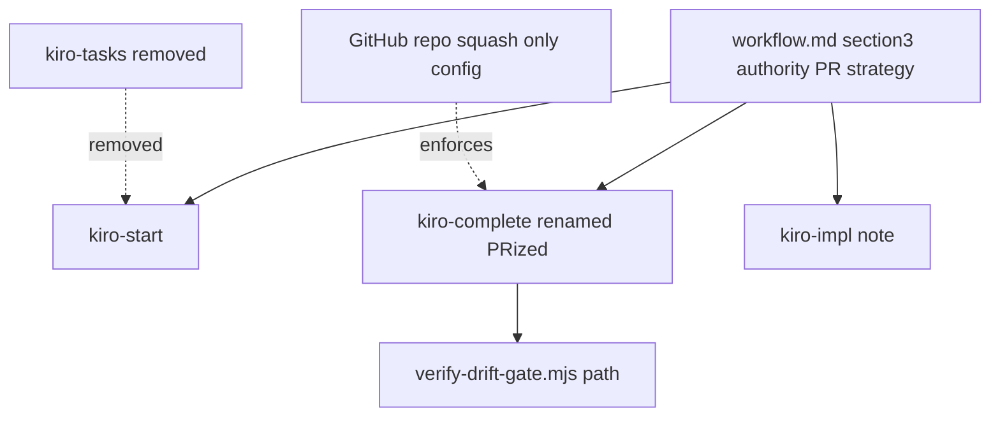
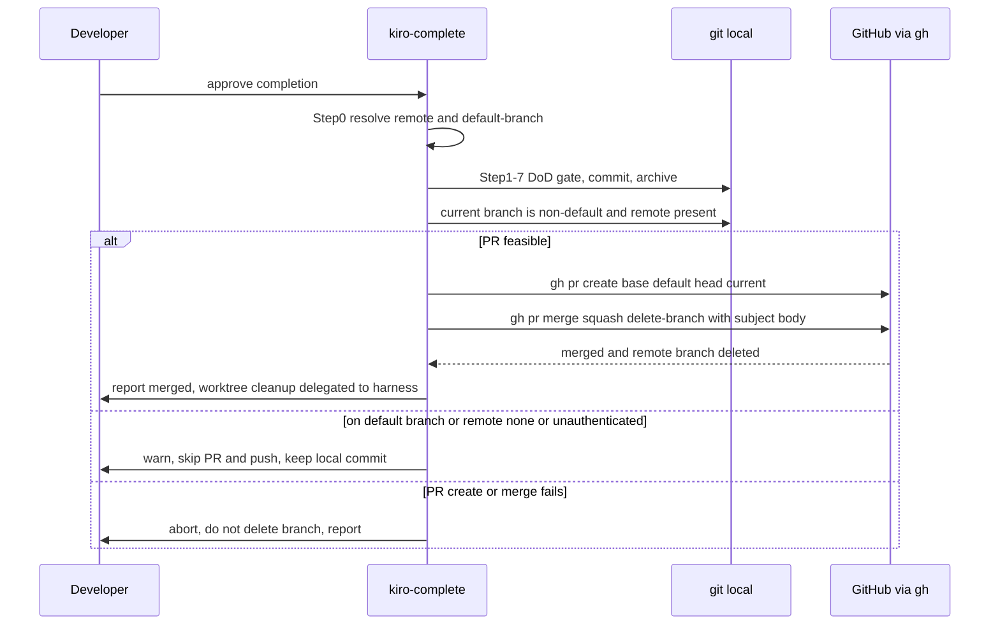
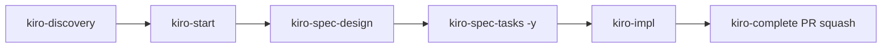
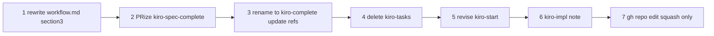

# Technical Design Document

## Overview

**Purpose**: 本仕様は、kiro ワークフローの git 統合を「手作業 squash-ff-push ＋ main 直接 push」から「ハーネスのワークツリー隔離 ＋ PR ベースの squash マージ」へ移行する。対象は権威ソース `.kiro/steering/workflow.md` §3 と、完了オーケストレーター（`kiro-spec-complete` → `kiro-complete` へリネーム）、開始オーケストレーター `kiro-start`、および撤去対象 `kiro-tasks` である。

**Users**: kiro ワークフローのメンテナおよび利用開発者が、spec ライフサイクル（`kiro-start` → `kiro-spec-design` → `kiro-spec-tasks` → `kiro-impl` → `kiro-complete`）を通じて利用する。

**Impact**: フィーチャーブランチ／ワークツリーの生成責任を Claude Code（ハーネス）へ委譲し、スキルからブランチ管理ロジックを撤去する。1 feature = 1 branch = 1 PR を実現し、`kiro-complete` の1回の PR squash マージのみで main へ反映する。本仕様はランタイムコード（Rust/Lua）を変更せず、Markdown スキル定義・ステアリング・1本の検証ツール文字列・GitHub リポジトリ設定のみを対象とする。

### Goals
- `workflow.md` §3 を PR ベースのブランチ戦略の**単一権威定義**へ全面改訂する（直接 push 注記・手作業 squash 手順の撤去）。
- `kiro-complete`（旧 `kiro-spec-complete`）の完了同期を `gh pr create` + `gh pr merge --squash` ベースへ置換し、移植性のための決定的解決を導入する。
- `kiro-tasks` スキルを撤去し、タスク生成を `/kiro-spec-tasks {feature} -y` 直接実行へ移行する。
- `kiro-start` のフィーチャーブランチ生成を撤去し、デフォルトブランチ上実行時は中断する。
- GitHub リポジトリのマージ方式を squash 限定へ強制する（一度きり設定）。

### Non-Goals
- ハーネス側のワークツリー機能そのものの実装・改変（委譲先であり対象外）。
- `release-workflow` の**内部リリース手順**（バージョンタグ公開 `git push origin main --tags`）の変更。これはリリース機構であり spec 完了の git 統合とは別物。
- `.claude/settings.json` の push 権限・PAT 管理ポリシー、`git remote` URL のトークン是正。
- PR テンプレート／CODEOWNERS／branch ruleset の本格整備（任意提示に留める）。
- 完了済み spec（`.kiro/specs/completed/**`）の履歴的記述の書き換え。

## Boundary Commitments

### This Spec Owns
- `.kiro/steering/workflow.md` §3「リモート同期（ブランチ戦略）」と関連注記の PR ベース改訂（権威定義）。
- `kiro-complete`（旧 `kiro-spec-complete`）スキルの PR 化・決定的解決導入・リネーム。
- `kiro-start` スキルのブランチ生成撤去・デフォルトブランチ中断。
- `kiro-tasks` スキルディレクトリの撤去と、その動作の非再導入。
- `kiro-impl` への単一 feature ブランチ互換注記。
- `book/tools/verify-drift-gate.mjs` のスキルパス文字列更新（リネーム追従）。
- GitHub リポジトリ `ekicyou/pasta` のマージ方式を squash 限定化する一度きり設定（タスク化）。

### Out of Boundary
- ハーネスのワークツリー生成・破棄ロジック（委譲先）。
- `release-workflow` のタグ公開手順および `.claude/settings.json` の `git push origin main` 許可エントリ（タグ push に必要なため保持）。
- 他 spec（`review-improvement-loop` 等）および `completed/**` 内の `kiro-tasks` / `kiro-spec-complete` 言及（運用上の依存がない記述的参照は対象外）。
- ランタイムコード（Rust/Lua）・DSL 文法・pasta 本体。

### Allowed Dependencies
- Claude Code（ハーネス）のワークツリー機能（非デフォルト作業ブランチの供給）。
- `gh` CLI（認証済み）と GitHub リポジトリ設定。
- 既存の決定的解決手順（`kiro-start` Step 0 の固定優先順序）を `kiro-complete` で再利用。
- `workflow.md` を権威ソースとし、各スキルはルールを複製せず参照する設計思想。

### Revalidation Triggers
- `workflow.md` §3 のブランチ戦略契約（PR ベースのフロー定義）の変更 → 参照する全スキルの再確認。
- スキル名／スラッシュコマンド名の変更（`kiro-complete` 等）→ `verify-drift-gate.mjs` のパス・各種参照の再確認。
- デフォルトブランチ／remote 解決手順の変更 → 移植性前提の再検証。
- `release-workflow` のタグ公開手順が main 直 push を続ける前提の変更 → §3 のタグ公開カーブアウトの再確認。

## Architecture

### Existing Architecture Analysis

現行は「権威ソース `workflow.md` §3 ＋ 3スキルが手順実体を保持」という二重構造で、いずれも以下の儀式を前提とする（`research.md` 参照）。

- **kiro-start**: デフォルトブランチ上で `feat/{feature}` を生成（push なし）。
- **kiro-tasks**: tasks 生成後、`merge-base` から squash ブランチを作り main を ff → push、さらに `impl/{feature}` を生成。
- **kiro-spec-complete**: `origin`/`main` をハードコードし、`squash/$branchA` 経由で `--ff-only` → `git push origin main`。決定的解決（Step 0）を持たない。

ハーネスの「ワークツリー隔離＋PR」前提と衝突し、保守コストが高い。`book/tools/verify-drift-gate.mjs` が `kiro-spec-complete/SKILL.md` のパスと workflow.md の DoD 結線を検証している（リネーム時に追従必須）。

### Authority-Source Model and Revision Order

権威ソースを最初に確定し、各スキルはそれを参照する。改訂順序を厳守する（PR 化とリネームは同一スキルを触るため順序が重要）。

**改訂順序**: ① `workflow.md` §3 → ② `kiro-spec-complete` の PR 化 → ③ `kiro-spec-complete` → `kiro-complete` リネーム＋全参照更新 → ④ `kiro-tasks` 撤去 → ⑤ `kiro-start` 改訂 → ⑥ `kiro-impl` 注記 → ⑦ GitHub 設定。

**Key Decisions**:
- **単一定義元**: 手順実体は `workflow.md` §3 に集約し、スキルは参照する（Option B + C 部分採用、`research.md`）。
- **PR 化先行→リネーム後行**: 同一スキルへの2種の変更を分離し、差分の可読性を確保する。

### Technology Stack

| Layer | Choice / Version | Role in Feature | Notes |
|-------|------------------|-----------------|-------|
| CLI / Tooling | `gh` CLI（認証済み: ekicyou） | PR 作成・squash マージ・リポジトリ設定 | `gh pr create` / `gh pr merge --squash --delete-branch` / `gh repo edit` |
| VCS | git（既存） | commit、ブランチ参照 | ブランチ生成はハーネスへ委譲 |
| Authoring | Markdown（スキル/ステアリング） | 権威定義・スキル手順 | 実体は prose |
| Verification | Node.js（`book/tools/verify-drift-gate.mjs`） | 完了ゲート結線検証 | パス文字列の追従更新 |
| Infrastructure | GitHub リポジトリ設定 | squash 限定・delete-branch-on-merge | 一度きり |

## File Structure Plan

### Modified Files
- `.kiro/steering/workflow.md` — §3「リモート同期（ブランチ戦略）」を PR ベースへ全面改訂。「直接 push」注記・手作業 squash/ff 手順・`squash/<A>` 生成手順を撤去。squash コミットメッセージ生成方針を PR squash 文脈へ移植。**release タグ公開カーブアウト**（`git push origin main --tags` は別手順として許容）を明記。DoD（§6 Manual Sync Gate 等）は不変。
- `.claude/skills/kiro-start/SKILL.md` — Step 2 から `feat/{feature}` 生成を撤去。デフォルトブランチ上実行は **STOP**。非デフォルト（ハーネス作業ブランチ）上では spec 初期化を実行し、現在ブランチへ commit（push しない）。frontmatter `description` と Constraints/Output/Safety を整合。
- `.claude/skills/kiro-impl/SKILL.md` — 「単一 feature ブランチ（ハーネス供給）上で動作し、ブランチ生成・push を行わない」旨の互換注記を追加（振る舞い不変）。
- `book/tools/verify-drift-gate.mjs` — L239 のパス要素 `'kiro-spec-complete'` を `'kiro-complete'` へ更新（リネーム追従）。
- `CLAUDE.md` — `/kiro-tasks`・`/kiro-spec-complete` の名指し参照は現状なし（grep 確認済み）。Minimal Workflow に新名・新フローの注記が必要なら最小限追記（任意）。

### Renamed + Modified
- `.claude/skills/kiro-spec-complete/SKILL.md` → `.claude/skills/kiro-complete/SKILL.md`
  - frontmatter `name: kiro-spec-complete` → `kiro-complete`。
  - **Step 0 追加**: `{remote}` / `{default-branch}` の決定的解決（`kiro-start` の固定優先順序を再利用）。`origin`/`main` ハードコードを撤去。
  - **Step 8 置換**: 手作業 squash-ff-push → `gh pr create` + `gh pr merge --squash --delete-branch`。
  - 繰り返し仕様分岐・完了チェックリスト・エラー回避節を PR ベースへ整合。

### Deleted
- `.claude/skills/kiro-tasks/`（ディレクトリ全体）。

### New (Operational Action, not a source file)
- GitHub リポジトリ `ekicyou/pasta` のマージ方式設定（`gh repo edit`、一度きり。タスク化）。コマンドは tasks.md / 本設計に記録。

## System Flows

### PR-Based Completion Flow (kiro-complete Step 8)

**Gating decisions**:
- **PR 可否判定**: 非デフォルトブランチ かつ `{remote}` あり かつ `gh` 認証あり のときのみ PR を作成・マージ。いずれか欠ける場合は警告してスキップ（main 直 push は行わない）。
- **ブランチ削除**: リモートブランチは `gh pr merge --delete-branch` が API で削除。**PR マージ成否（API 結果）とローカル後始末の警告を分離する** ── `--delete-branch` のローカル削除試行はカレントワークツリーでブロックされ警告を出すが、これは非致命でありマージ成功を覆さない（Req 2.4 の中断はマージ API 失敗時のみ）。kiro-complete は自分のワークツリー／カレントブランチを削除しない（構造的に不可）。ローカル teardown はハーネスがセッション/タスク境界で実施する。スキルはブランチ名（`feat/`・`claude/...` 等）を問わず「現在ブランチ」で動作する。
- **squash メッセージ**: `--subject` / `--body` を `merge-base..HEAD` 履歴＋ requirements/design タイトルから構築（方針は `workflow.md` §3、実行は kiro-complete）。

### Lifecycle Command Flow (after change)

`kiro-tasks` 撤去後、タスク生成は `/kiro-spec-tasks -y` を直接実行。tasks.md のコミットは後続 `kiro-impl` または `kiro-complete` が `git add -A` で取り込む（専用タスクフェーズコミットは設けない）。

## Requirements Traceability

| Requirement | Summary | Components | Key Behavior / Contract |
|-------------|---------|------------|--------------------------|
| 1.1–1.5 | workflow.md §3 PR 化・単一定義元 | workflow.md §3 | PR フロー定義、直接 push/手作業 squash 撤去、参照元化、squash メッセージ方針 |
| 2.1–2.4 | kiro-complete PR squash・失敗中断 | kiro-complete | `gh pr create`+`gh pr merge --squash --delete-branch`、直接 push 禁止、成功後削除、失敗中断 |
| 2.5 | 繰り返し仕様の PR 同期 | kiro-complete | `completed/` 移動スキップ＋PR ベース同期 |
| 2.6 | default 上／PR 不可時の警告継続 | kiro-complete | 警告＋push スキップ、main 直 push なし |
| 3.1–3.4 | kiro-tasks 撤去・非再導入 | kiro-tasks（削除） | ディレクトリ撤去、squash/impl 動作を他へ再導入しない |
| 3.5–3.6 | commit 委譲・単一ブランチ継続 | kiro-impl / kiro-complete | 専用 commit なし、後続が取り込む、単一作業ブランチ |
| 4.1–4.4 | kiro-start 委譲・default STOP | kiro-start | feat 生成撤去、push なし、default 上 STOP |
| 5.1–5.2 | kiro-impl 互換注記 | kiro-impl | commit のみ、注記追加（振る舞い不変） |
| 6.1–6.3 | GitHub squash 限定 | GitHub 設定タスク | `gh repo edit` squash-only、一度きり、任意強制提示 |
| 7.1 | 決定的解決維持・拡張 | kiro-start / kiro-complete | Step 0 を kiro-complete にも導入 |
| 7.2 | remote 不在フォールバック | 全スキル | 警告継続＋PR 操作スキップ |
| 7.3–7.4 | 破壊的操作禁止・削除タイミング | 全スキル / workflow.md | reset/revert 禁止整合、削除は PR マージ成功後 |
| 8.1–8.5 | kiro-spec-complete→kiro-complete リネーム | kiro-complete / 参照群 | ディレクトリ・frontmatter・参照・verify-drift-gate.mjs 更新、エイリアスなし、振る舞い不変 |

## Components and Interfaces

| Component | Layer | Intent | Req Coverage | Key Dependencies |
|-----------|-------|--------|--------------|------------------|
| workflow.md §3 | 権威ソース | PR ベースのブランチ戦略定義 | 1, 7.3, 7.4 | gh CLI 前提（記述） |
| kiro-complete | スキル（完了） | PR squash 完了・決定的解決 | 2, 7.1, 7.2, 8 | workflow.md（P0）, gh（P0）, harness worktree（P0） |
| kiro-start | スキル（開始） | 委譲整合・default STOP | 4, 7.2 | harness worktree（P0）, workflow.md（P1） |
| kiro-tasks | スキル（撤去） | 撤去 | 3 | — |
| kiro-impl | スキル（実装） | 互換注記 | 5, 3.5 | harness worktree（P1） |
| GitHub 設定タスク | インフラ | squash 限定強制 | 6 | gh（P0）, repo 権限（P0） |
| verify-drift-gate.mjs | 検証 | パス追従 | 8.3 | スキルパス（P0） |

### 権威ソース層

#### workflow.md §3（PR ベース・ブランチ戦略）

| Field | Detail |
|-------|--------|
| Intent | PR ベース統合フローの単一権威定義 |
| Requirements | 1.1, 1.2, 1.3, 1.4, 1.5, 7.3, 7.4 |

**Responsibilities & Constraints**
- 「commit → `gh pr create` → `gh pr merge --squash --delete-branch` → ブランチ削除」を唯一の手順実体として定義する。
- 「直接 push」注記、`merge-base` squash、`--ff-only`、`squash/<A>` 生成手順を**含まない**。
- squash コミットメッセージ生成方針（`merge-base..HEAD` 履歴＋ spec タイトルからの要約）を PR squash 文脈で定義する（1.5）。
- 破壊的 git 操作禁止（§禁止事項）と整合し、ブランチ削除は PR マージ成功後に限定する（7.3, 7.4）。
- **release タグ公開カーブアウト**: `git push origin main --tags` 等のタグ公開は §3 の禁止対象外（別途リリース手順が管轄）と明記し、`release-workflow` の「workflow.md 準拠」引用と `.claude/settings.json` の push 許可を有効に保つ。
- DoD（§6 Manual Sync Gate 含む）の意味・順序は不変。

**Contracts**: State [x]（権威ルールのテキスト契約）

**Authority Contract（必須記述要素）**
- PR 作成: base = `{default-branch}`、head = 現在の作業ブランチ。
- マージ: `--squash` 固定、`--delete-branch` 付与。
- フォールバック: `{remote}` 不在／オフライン／default 上は警告して PR 操作スキップ（直接 push しない）。

### スキル層

#### kiro-complete（旧 kiro-spec-complete）

| Field | Detail |
|-------|--------|
| Intent | DoD 検証→コミット→アーカイブ→PR squash 同期を一連で完遂 |
| Requirements | 2.1, 2.2, 2.3, 2.4, 2.5, 2.6, 7.1, 7.2, 8.1, 8.2, 8.5 |

**Responsibilities & Constraints**
- **Step 0（新規）**: `{remote}`（`origin`→単一→none）と `{default-branch}`（`symbolic-ref`→`main`→`master`→現ブランチ）を決定的解決し、`origin`/`main` ハードコードを撤去（7.1）。
- **Step 8（置換）**: PR 可否判定後、`gh pr create --base {default-branch} --head {current}` → `gh pr merge --squash --delete-branch --subject … --body …`。成功でリモートブランチ削除。ローカルブランチ／ワークツリーは削除しない（構造的に不可。ハーネス teardown 委譲）（2.1, 2.3）。
- 直接 push・手作業 squash-ff-push を行わない（2.2）。
- **マージ成否判定はマージ API の結果のみに基づく**。`--delete-branch` のローカル削除警告は非致命として継続し、Req 2.4 の中断と混同しない。
- PR 作成／マージ（API）失敗時はブランチを残し中断・報告（2.4, 7.4）。
- 繰り返し仕様（`release-workflow` 等）は `completed/` 移動をスキップしつつ PR ベース同期（2.5）。
- default ブランチ上 or PR 不可（remote none/未認証）時は警告して push スキップ、ローカルコミット保持（2.6, 7.2）。
- リネーム後も DoD ゲート・コミット・アーカイブの振る舞いは不変（8.5）。

**Contracts**: Batch [x]（完了オーケストレーションのトリガー＝開発者承認）/ State [x]

**Completion Contract**
- Trigger: 開発者の明示的「承認」。
- Precondition: 全タスク完了、非デフォルト作業ブランチ（PR 実行時）。
- Output: PR squash マージ済みの main、または（PR 不可時）ローカルコミット保持＋警告。
- Idempotency & recovery: 失敗時はブランチ非削除で復旧可能性を確保。

**Implementation Notes**
- Integration: `workflow.md` §3 を権威として参照しルールを複製しない。
- Validation: リネーム後 `node book/tools/verify-drift-gate.mjs` がパスを解決できること。
- Risks: branch ruleset で必須チェックを有効化すると `gh pr merge` の即時マージがブロックされ得る（6.3 任意機能、既定では未有効）。

#### kiro-start

| Field | Detail |
|-------|--------|
| Intent | post-discovery の spec 初期化＋requirements 生成（ブランチ生成は委譲） |
| Requirements | 4.1, 4.2, 4.3, 4.4, 7.2 |

**Responsibilities & Constraints**
- フィーチャーブランチ／ワークツリー生成をハーネスへ委譲し、`feat/{feature}` 自動生成を撤去（4.1, 4.2）。
- 非デフォルト（ハーネス作業ブランチ）上では spec 初期化を実行し、**現在ブランチへ commit**（push しない、4.3）。
- デフォルトブランチ上実行時は **STOP** し、ワークツリーでの再実行を促す（4.4）。
- `{remote}` 不在時のフォールバック（警告継続）を維持（7.2）。

**Contracts**: Batch [x]

**Implementation Notes**
- Integration: Step 0 決定的解決と Step 3 サブエージェント委譲は維持。
- Risks: 旧「default 上で feat 生成→commit」の利用者習慣との差異。Output/Safety で明示。

#### kiro-tasks（撤去）

| Field | Detail |
|-------|--------|
| Intent | スキルディレクトリの撤去 |
| Requirements | 3.1, 3.2, 3.3, 3.4 |

**Responsibilities & Constraints**
- `.claude/skills/kiro-tasks/` を削除（3.1）。
- タスク生成は `/kiro-spec-tasks {feature} -y` 直接実行へ移行（3.2）。
- `workflow.md`・関連スキルの `kiro-tasks` 参照を撤去後の運用へ整合（3.3）。`completed/**` 等の歴史的記述は対象外（Out of Boundary）。
- squash 統合（旧 Step 5）・`impl/{feature}` 生成（旧 Step 6）を他スキルへ再導入しない（3.4）。

#### kiro-impl（互換注記）

| Field | Detail |
|-------|--------|
| Intent | 単一 feature ブランチ運用の明示 |
| Requirements | 5.1, 5.2, 3.5 |

**Responsibilities & Constraints**
- 現在ブランチへの commit のみ。ブランチ生成・push を導入しない（5.1）。
- 「ハーネス供給の単一作業ブランチ上で動作」する旨の注記を追加（5.2）。
- tasks.md 未コミット時は `git add -A` で取り込む（3.5、振る舞い不変）。

### インフラ層

#### GitHub リポジトリ設定タスク

| Field | Detail |
|-------|--------|
| Intent | マージ方式を squash 限定化（一度きり） |
| Requirements | 6.1, 6.2, 6.3 |

**Responsibilities & Constraints**
- `gh repo edit ekicyou/pasta --enable-squash-merge --enable-merge-commit=false --enable-rebase-merge=false`（6.1）。
- defense-in-depth として `--delete-branch-on-merge` を有効化（DD1、2.3 と協調）。
- 一度きりの独立タスクとして分離（6.2）。
- 任意強制（squash メッセージ既定形、branch ruleset: PR 必須／linear history）は選択肢として提示し、既定では有効化しない（6.3）。

**Contracts**: Batch [x]（一度きりの設定オペレーション）

## Design Decisions

| ID | 決定事項 | 内容 | 根拠 |
|----|---------|------|------|
| DD1 (U2) | ブランチ削除手段 | 主: `gh pr merge --squash --delete-branch`（リモートを API で確実削除）。ローカルブランチ／ワークツリーは kiro-complete が**削除しない／できない**（cwd がワークツリー内・カレントブランチがチェックアウト中で git が構造的に拒否）ため、ハーネスがセッション/タスク境界で teardown する。副: repo `--delete-branch-on-merge` を多重防御で有効化 | ワークツリー隔離モデルと整合、削除漏れ二重防止、自己ワークツリー削除の構造的禁止 |
| DD2 (U3) | kiro-complete の決定的解決 | Step 0 を新規導入し `{remote}`/`{default-branch}` を解決（kiro-start の固定優先順序を再利用）。`origin`/`main` ハードコード撤去 | 移植性（7.1）、kiro-tasks 撤去により kiro-complete が主要 git-ops スキル化 |
| DD3 (1.5) | squash メッセージ供給 | `gh pr merge --squash --subject --body`。本文は `merge-base..HEAD` 履歴＋ requirements/design タイトルから要約。方針は workflow.md、実行は kiro-complete | 既存メッセージ生成方針を PR 文脈へ移植 |
| DD4 (検証) | 検証戦略 | ランタイムテスト無し。代替: ①ドキュメント整合の静的チェック（旧名が運用ドキュメントに残らない、**手動ガイダンス**）②`verify-drift-gate.mjs` は **L239 のリネーム追従のみ**（パス更新後の通過確認）③使い捨てブランチでの PR フロー dry-run を受け入れ手順として記録 | コード非変更ゆえ手動受け入れ中心 |

> **スコープ注記（設計ディスカッション #2）**: 不変条件（§3 に直接 push 記述なし・kiro-tasks 不在 等）の**退行ガード機械化は本 spec のスコープ外**（requirements.md のどの要件にも含まれない任意の将来改善）。Static Consistency Checks は手動ガイダンスとして示すに留め、`verify-drift-gate.mjs` への新規アサート追加は行わない（変更は L239 のリネーム追従のみ）。将来必要なら別 spec で機械化を検討する。
| DD5 (境界) | release タグ公開カーブアウト | §3 を「spec 完了ブランチ統合」に限定し、`git push origin main --tags` 等のタグ公開を禁止対象外と明記。release-workflow 内部手順は不変 | release-workflow の引用・settings.json 許可を有効に保つ |

> **既知リスク（DD5 補足・Out of Boundary）**: release-workflow をハーネスワークツリー（非デフォルトブランチ）上で実行すると、バージョン bump コミットは PR 経由で main へ反映される一方、`git push origin main --tags` はローカル main（bump 未反映の可能性）からタグを push するため、タグとコミットが乖離し得る。本 spec は release-workflow 内部手順を変更しない（Out of Boundary）が、PR ベース化に伴い**この相互作用は別 spec で再検証が必要**である（Revalidation Triggers 参照）。

## Error Handling

### Error Strategy
コード例外ではなく「スキル手順上の中断／フォールバック」を契約として定義する。破壊的 git 操作は禁止（workflow.md §禁止事項）し、復旧可能性を最優先する。

### Error Categories and Responses
- **PR 不可（default 上／`{remote}` none／未認証）**: 警告を出力し PR・push をスキップ、ローカルコミット保持（2.6, 7.2）。main への直接 push は行わない。
- **PR 作成／マージ失敗（コンフリクト／mergeable でない／権限不足）**: ブランチを削除せず中断し開発者へ報告（2.4, 7.4）。
- **kiro-start がデフォルトブランチ上**: STOP し、ハーネスワークツリーでの再実行を促す（4.4）。
- **ローカルブランチ削除ブロック（ワークツリーがチェックアウト中）**: 警告のみ。後始末はハーネス委譲（DD1）。

### Monitoring
- スキル実行時の警告／中断メッセージ（target language）で可観測性を確保。
- `node book/tools/verify-drift-gate.mjs` による完了ゲート結線の機械検証。

## Testing Strategy

> ランタイムコード非変更のため `cargo test --all` は対象外（Test Gate スキップ可）。検証はドキュメント整合・ツール検証・手動 dry-run で構成する。

### Static Consistency Checks
- `grep -r "kiro-tasks" .claude .kiro/steering CLAUDE.md` が運用ドキュメントにヒットしない（歴史的 `completed/**`・他 spec 記述は除外）— 3.1, 3.3。
- `grep -r "kiro-spec-complete"` が運用ドキュメント／`verify-drift-gate.mjs` に残存しない（新名 `kiro-complete` へ移行）— 8.1, 8.3。
- `workflow.md` §3 に「直接 push」「`merge-base` squash」「`--ff-only`」手順が**残っていない**こと、PR フロー定義が存在すること — 1.1, 1.2, 1.3。

### Tool Verification
- `node book/tools/verify-drift-gate.mjs` が成功する（`kiro-complete/SKILL.md` パス解決、workflow.md DoD 結線アサート）— 8.3, 8.5。

### Manual Dry-Run (Acceptance)
- 使い捨てブランチで `gh pr create` → `gh pr merge --squash --delete-branch` を実行し、squash 1 コミットで main 反映・リモートブランチ削除を確認 — 2.1, 2.3。
- `{remote}` を一時的に none とした環境で kiro-complete が警告継続・push スキップすることを確認 — 2.6, 7.2。
- GitHub 設定後、`gh repo view --json mergeCommitAllowed,squashMergeAllowed,rebaseMergeAllowed,deleteBranchOnMerge` が squash のみ true・delete-branch true を返す — 6.1。

### Integration Consistency
- `release-workflow` の `git push origin main --tags` 引用が §3 カーブアウトにより有効なまま（DD5）— Non-Goal 保護の確認。
- `.claude/settings.json` の `git push origin main` 許可が保持されている — Out of Boundary 保護の確認。

## Migration Strategy

- **ロールバック**: 各ステップは独立コミット。問題発生時は該当コミットの逆変更（`git revert` は禁止、`git show` 後に手動逆変更）。
- **検証チェックポイント**: ③直後に `verify-drift-gate.mjs`、⑦直後に `gh repo view` で設定確認。
- **PR 化（②）とリネーム（③）の分離**: 同一スキルへの2変更を別コミットにし差分可読性を確保（改訂順序参照）。
