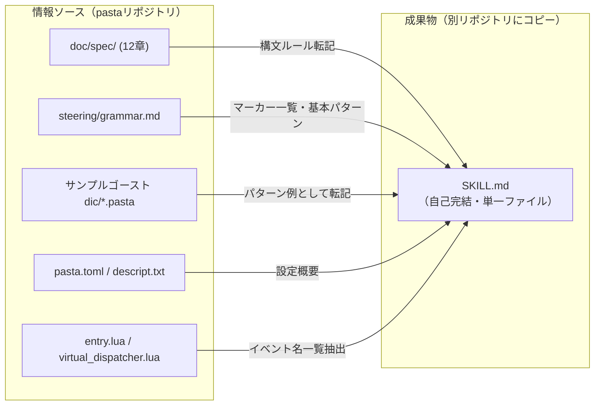

# Design Document: llm-grammar-skill

## Overview

**Purpose**: ゴースト（「伺か」デスクトップマスコット）開発者の辞書制作をサポートするVS Code Copilot Skill を提供する。開発者が自然言語で「こんなトークを作って」等と指示した際に、LLM が Pasta DSL の正確なコードを生成できるよう、文法知識・パターン集・イベントマッピングを単一の SKILL.md ファイルに集約する。

**Users**: ゴースト開発者（辞書ファイル `.pasta` の作成・編集を行う）が、VS Code + GitHub Copilot 環境で辞書制作を行う際に利用する。

**Impact**: 新規ファイル `.agents/skills/pasta-ghost-authoring/SKILL.md` を作成する。既存のコードベースへの変更はない。

### Goals
- LLM が Pasta DSL 構文を正確に生成できる文法リファレンスを提供する
- 自然言語の指示（「起動時の挨拶」「ランダムトーク」等）から適切なシーン名・構文パターンへの変換を可能にする
- 別リポジトリのゴーストディレクトリにコピーするだけで機能する自己完結型スキルを実現する
- `doc/spec/` と整合性のある正確な文法情報を転記する

### Non-Goals
- Pasta DSL パーサー・トランスパイラーの実装変更
- Lua ランタイム内部の詳細説明（ゴースト作者が直接触れない部分）
- 新規ゴーストプロジェクトのスキャフォールディング（テンプレート生成ツール）
- `steering/grammar.md` や `GRAMMAR.md` の置き換え（役割分離を維持）
- pasta_shiori の SHIORI プロトコル実装詳細

## Architecture

### Existing Architecture Analysis

本フィーチャーはドキュメント成果物であり、既存コードベースへの変更は発生しない。以下の既存ドキュメント群から情報を集約・再構成する:

| ソース | 役割 | スキルでの扱い |
|--------|------|---------------|
| `doc/spec/01-12` | 権威的仕様書 | 正確性の保証元。構文ルールを転記 |
| `steering/grammar.md` | AI向け完全参照 | マーカー一覧・基本パターンの骨格として活用 |
| `GRAMMAR.md` | 人間向け学習資料 | 役割分離のため直接参照せず |
| サンプルゴースト `dic/*.pasta` | 実証済みパターン | パターン集のソースとして転記 |
| `pasta.toml`, `descript.txt` | ゴースト設定 | プロジェクト構造セクションに概要を転記 |

### Architecture Pattern & Boundary Map



**Architecture Integration**:
- **Selected pattern**: 単一ファイル成果物（Option A）。VS Code Copilot Skill の標準パターンに合致
- **Domain boundaries**: スキルは LLM のコード生成支援に特化。パーサー実装・ランタイム詳細はスコープ外
- **Existing patterns preserved**: `steering/grammar.md` のマーカー一覧表形式を踏襲
- **New components rationale**: `.agents/skills/pasta-ghost-authoring/SKILL.md` — LLM コンテキスト注入の唯一のエントリポイント
- **Steering compliance**: `steering/grammar.md` の役割分離原則を維持。スキルは「辞書制作サポート」に特化し、「開発時の実装判断」は steering に委ねる

### Technology Stack

| Layer | Choice / Version | Role in Feature | Notes |
|-------|------------------|-----------------|-------|
| ドキュメント形式 | Markdown + YAML Frontmatter | SKILL.md のフォーマット | VS Code Copilot Skill 標準形式 |
| 配信機構 | VS Code GitHub Copilot Skill | LLMコンテキストへの自動注入 | `.agents/skills/<name>/SKILL.md` 配置規約 |
| バージョン管理 | Git | スキルファイルの変更履歴管理 | `.agents/` をgit追跡対象とする |

## Requirements Traceability

| Requirement | Summary | SKILL.md セクション | 情報ソース |
|-------------|---------|---------------------|-----------|
| 1.1 | ファイル配置 | — (配置規約) | — |
| 1.2 | YAML Frontmatter | Frontmatter | 既存スキル実例 |
| 1.3 | トリガー条件 | Frontmatter `description` | — |
| 1.4 | 目的明記 | §1 Purpose | — |
| 1.5 | 自己完結性 | 全体設計制約 | — |
| 2.1 | マーカー一覧 | §2 Quick Reference | `steering/grammar.md`, `doc/spec/02` |
| 2.2 | シーン定義 | §3 Syntax — Scenes | `doc/spec/02`, `doc/spec/03` |
| 2.3 | アクション行 | §3 Syntax — Action Lines | `doc/spec/06` |
| 2.4 | 単語定義 | §3 Syntax — Words | `doc/spec/10` |
| 2.5 | 変数 | §3 Syntax — Variables | `doc/spec/09` |
| 2.6 | Call文 | §3 Syntax — Call | `doc/spec/04` |
| 2.7 | アクター辞書 | §3 Syntax — Actor Dictionary | `doc/spec/11` |
| 2.8 | さくらスクリプト | §3 Syntax — Sakura Script | `doc/spec/07` |
| 2.9 | Luaブロック | §3 Syntax — Lua Block | `doc/spec/03` |
| 2.10 | コメント・属性 | §3 Syntax — Comments & Attributes | `doc/spec/02`, `doc/spec/08` |
| 3.1 | ファイル役割・配置 | §4 Project Structure | サンプルゴースト |
| 3.2 | pasta.toml 設定影響 | §4 Project Structure | `pasta.toml` 実例 |
| 3.3 | descript.txt 概要 | §4 Project Structure | `descript.txt` 実例 |
| 3.4 | dic/*.pasta 自動読み込み | §4 Project Structure | `pasta.toml [loader]` |
| 4.1 | アクター辞書パターン | §6 Patterns | `actors.pasta` |
| 4.2 | イベントハンドラパターン | §6 Patterns | `boot.pasta` |
| 4.3 | ランダムトークパターン | §6 Patterns | `talk.pasta` |
| 4.4 | 単語ランダム選択パターン | §6 Patterns | `talk.pasta`, `boot.pasta` |
| 4.5 | ファイル分割推奨構成 | §6 Patterns | サンプルゴースト全体 |
| 4.6 | 自然言語→シーン変換指針 | §6 Patterns | — (新規設計) |
| 5.1 | シーン関数フォールバック | §5 Event Mapping | `entry.lua`, `scene.lua` |
| 5.2 | 主要SHIORIイベント | §5 Event Mapping | `entry.lua` |
| 5.3 | 仮想イベント | §5 Event Mapping | `virtual_dispatcher.lua` |
| 6.1 | doc/spec/ 転記 | 全体制約 | — |
| 6.2 | grammar.md 一致 | 全体制約 | — |
| 6.3 | 役割分離 | §1 Purpose | — |
| 6.4 | 不一致時の修正ルール | 全体制約 | — |

## Components and Interfaces

SKILL.md は単一ファイルだが、論理的に7つのセクションで構成される。各セクションは独立した情報ドメインを持ち、要件に直接対応する。

| Section | Domain | Intent | Req Coverage | Source (P0/P1) | 推定行数 |
|---------|--------|--------|--------------|----------------|---------|
| Frontmatter | メタデータ | Copilot による自動呼び出し制御 | 1.1-1.3 | 既存スキル実例 (P0) | 10-15 |
| §1 Purpose | 導入 | スキルの目的・前提条件の宣言 | 1.4, 1.5, 6.3 | — | 10-15 |
| §2 Quick Reference | 文法 | マーカー一覧表（最高頻度参照） | 2.1 | `steering/grammar.md` (P0) | 20-30 |
| §3 DSL Syntax | 文法 | 構文ルール詳細 | 2.2-2.10 | `doc/spec/` (P0) | 80-120 |
| §4 Project Structure | 構造 | ゴーストプロジェクトの理解 | 3.1-3.4 | サンプルゴースト (P0) | 30-40 |
| §5 Event Mapping | イベント | SHIORI イベント→シーン名対応 | 5.1-5.3 | `entry.lua` (P0) | 25-35 |
| §6 Authoring Patterns | パターン | 辞書制作の実例集 | 4.1-4.6 | `dic/*.pasta` (P0) | 80-120 |

**合計推定行数**: 260-380行（目標: 400行以内）

### メタデータ層

#### Frontmatter

| Field | Detail |
|-------|--------|
| Intent | VS Code Copilot にスキルのメタデータとトリガー条件を提供する |
| Requirements | 1.1, 1.2, 1.3 |

**Responsibilities & Constraints**
- YAML Frontmatter 形式で `name`, `description`, `metadata` を定義する
- `description` フィールドに USE FOR / DO NOT USE FOR トリガーフレーズを含める
- トリガーフレーズは日英併記とする

**Contract: YAML Frontmatter**

```yaml
---
name: pasta-ghost-authoring
description: >-
  Pasta DSL文法リファレンスと辞書制作パターン集。ゴースト（「伺か」デスクトップマスコット）の
  辞書ファイル（.pasta）を作成・編集する際に、自然言語の指示からPasta DSLコードへの変換を
  サポートする。
  USE FOR: pasta, Pasta DSL, .pasta, ゴースト, 辞書, トーク作成, シーン作成,
  アクション行, 単語定義, 変数, イベントハンドラ, ランダムトーク, アクター辞書,
  さくらスクリプト, 伺か, ukagaka, ghost authoring, dictionary file,
  talk creation, scene definition, pasta script, pasta code generation.
  DO NOT USE FOR: pasta料理, cooking pasta, Pasta DSLパーサー開発,
  pasta_dsl crate, pasta_lua crate, pasta_core crate, Rustクレート実装,
  SHIORIプロトコル実装, Luaランタイム開発, pasta言語仕様の設計変更.
metadata:
  author: ekicyou
  version: "1.0.0"
---
```

**Implementation Notes**
- `description` は Copilot のスキル選択ロジックに直接影響するため、トリガーフレーズの網羅性と除外精度のバランスが重要
- `name` は配置先ディレクトリ名 `pasta-ghost-authoring` と一致させる

### 導入層

#### §1 Purpose & Prerequisites

| Field | Detail |
|-------|--------|
| Intent | スキルの目的・対象ドメイン・前提条件を宣言し、LLM の動作コンテキストを設定する |
| Requirements | 1.4, 1.5, 6.3 |

**Responsibilities & Constraints**
- スキルの主目的を「自然言語→Pasta DSL変換サポート」と明確に宣言する
- 対象ユーザーを「既存ゴーストプロジェクトを持つ開発者」と定義する
- 役割分離を明示する（本スキル vs `GRAMMAR.md` vs `steering/grammar.md`）
- 自己完結性の宣言（外部ファイル参照不要）

**セクション構成**:
1. **目的**: 1-2文で「自然言語の指示からPasta DSLコードを生成するサポート」と宣言
2. **対象**: ゴースト辞書ファイル（`.pasta`）の作成・編集
3. **前提**: ゴーストプロジェクトが既に存在する（`pasta.toml`, `descript.txt`, `dic/` が揃っている）
4. **役割分離注記**: 本スキルはコード生成特化。言語仕様の設計判断には `doc/spec/` を参照

### 文法リファレンス層

#### §2 Quick Reference（マーカー一覧表）

| Field | Detail |
|-------|--------|
| Intent | 全マーカーの用途と全角/半角対応を一覧表で即参照可能にする |
| Requirements | 2.1 |

**Responsibilities & Constraints**
- `steering/grammar.md` のマーカー一覧表を転記する
- 全角/半角両方の表記を含める
- LLM が最も頻繁に参照するため、ファイル先頭近くに配置する

**セクション構成**:
- マーカー一覧表（表形式: マーカー名 | 全角 | 半角 | 用途 | 簡潔な使用例）
- `doc/spec/02-markers.md` と一致する情報のみを転記

#### §3 DSL Syntax（構文ルール詳細）

| Field | Detail |
|-------|--------|
| Intent | Pasta DSL の各構文要素を、LLM がコード生成に使える精度で説明する |
| Requirements | 2.2, 2.3, 2.4, 2.5, 2.6, 2.7, 2.8, 2.9, 2.10 |

**Responsibilities & Constraints**
- 各構文要素を独立したサブセクションとして記述する
- 説明は宣言的・簡潔に。「Xの場合、Yと記述する」形式を優先
- 各サブセクションに最小限のコード例（2-3行）を付与する
- `doc/spec/` の対応章から正確に転記し、独自解釈を含めない

**サブセクション構成**:

| サブセクション | 要件 | 情報ソース | 内容概要 |
|---------------|------|-----------|---------|
| Scenes（シーン定義） | 2.2 | `doc/spec/02`, `doc/spec/03` | グローバル`＊`/ローカル`・`、重複シーン（ランダム選択）、前方一致検索 |
| Action Lines（アクション行） | 2.3 | `doc/spec/06` | `アクター名：発話内容` 構文、アクター省略、インライン要素 `＠ref` `＄var` |
| Words（単語定義） | 2.4 | `doc/spec/10` | `＠単語名：値1、値2` 定義、グローバル/ローカルスコープ、参照方法 |
| Variables（変数） | 2.5 | `doc/spec/09` | `＄変数名`（ローカル）、`＄＊変数名`（グローバル）、代入と参照 |
| Call Statements（Call文） | 2.6 | `doc/spec/04` | `＞シーン名` 構文、特殊Call（`＞ゴースト終了（ミリ秒）`）|
| Actor Dictionary（アクター辞書） | 2.7, 5.4 | `doc/spec/11` | `％アクター名` 定義、表情単語パターン、スコープ指定（`％名前1、名前2`）によるバルーン連動 |
| Sakura Script（さくらスクリプト） | 2.8 | `doc/spec/07` | `\s[ID]`, `\n`, `\w数字`, `\_w[数字]` の基本タグ |
| Lua Code Blocks（Luaブロック） | 2.9 | `doc/spec/03` | ` ```lua ``` ` の記述方法と基本制約のみ（3-5行で簡潔に） |
| Comments & Attributes（コメント・属性） | 2.10 | `doc/spec/02`, `doc/spec/08` | `＃` コメント、`＆属性名：値` |

**Implementation Notes**
- Lua ブロック（2.9）は最小限の説明に留める。辞書制作では Pasta DSL 構文のみで十分なケースが大半であり、Lua は高度なユースケース向けのエスケープハッチとして言及する
- アクター辞書（2.7）は §6 Patterns と重複するが、構文ルールとしての説明をここに、実例パターンを §6 に配置することで役割を分離する
- スコープ指定（Req 5.4）はアクター辞書の文法構文であるため §3 に配置する。SHIORIゴーストでは OnBoot で一度設定して固定するのが慣習だが、構文自体は汎用（ノベルゲーム用途等でシーンごとに切り替える用途もある）

### プロジェクト構造層

#### §4 Project Structure（プロジェクト構造）

| Field | Detail |
|-------|--------|
| Intent | 既存ゴーストプロジェクトの構造を LLM に理解させ、適切なファイル配置のコードを生成させる |
| Requirements | 3.1, 3.2, 3.3, 3.4 |

**Responsibilities & Constraints**
- ゴースト作者が作成・編集するファイルに限定する（`dic/*.pasta`, `pasta.toml`, `descript.txt`）
- `scripts/`, `profile/` 等のランタイム管理ディレクトリは除外する
- `pasta.toml` は DSL コード生成に影響する設定のみ説明する（`[ghost]` セクションのアクター名、`[loader]` の `pasta_patterns`）
- `descript.txt` は必須フィールドの概要のみ

**セクション構成**:
1. **ファイル構成概要**: `dic/*.pasta`（辞書）、`pasta.toml`（設定）、`descript.txt`（メタデータ）の3種の役割を簡潔に説明
2. **pasta.toml 抜粋**: `[ghost]` セクション（トーク間隔）と `[actor."名前"]`（スポット割り当て）がDSLコード生成に影響する点
3. **descript.txt 必須フィールド**: `charset`, `type`, `name`, `sakura.name`, `kero.name`, `shiori` をリスト形式で
4. **自動読み込み**: `pasta_patterns = ["dic/*.pasta"]` により `dic/` 配下の `.pasta` ファイルが自動的に読み込まれる仕組み

### イベント層

#### §5 Event Mapping（SHIORIイベントマッピング）

| Field | Detail |
|-------|--------|
| Intent | 開発者の自然言語指示（「起動時の挨拶を作って」等）から正しいSHIORIイベント名への変換を可能にする |
| Requirements | 5.1, 5.2, 5.3 |

**Responsibilities & Constraints**
- ゴースト作者視点で説明する。内部ディスパッチ機構の実装詳細は含めない
- 「シーン名 = イベント名にすれば自動的に呼ばれる」という核心ルールを冒頭に明記する
- 主要イベントを「自然言語の意図→シーン名」のマッピングテーブルとして提供する

**セクション構成**:
1. **核心ルール**: 「`＊イベント名` のシーンを定義すれば、対応するイベント発生時に自動実行される」（1-2行）
2. **主要イベントテーブル**:

| やりたいこと | シーン名 | 備考 |
|-------------|---------|------|
| 起動時の挨拶 | `＊OnBoot` | 通常起動 |
| 初回起動の挨拶 | `＊OnFirstBoot` | 初回のみ |
| 終了時の挨拶 | `＊OnClose` | `＞ゴースト終了（ミリ秒）` を末尾に付ける |
| ランダムトーク | `＊OnTalk` | 仮想イベント。同名複数定義でランダム選択 |
| 時報 | `＊OnHour` | 仮想イベント。`＄時１２` 変数が自動設定される |
| ダブルクリック反応 | `＊OnMouseDoubleClick` | 同名複数定義でランダム選択 |

3. **仮想イベント補足**: OnTalk と OnHour は内部タイマーにより自動ディスパッチされる仮想イベント。ゴースト作者は `＊OnTalk` / `＊OnHour` シーンを定義するだけでよい。`pasta.toml` の `[ghost]` セクションでトーク間隔を設定可能

### パターン層

#### §6 Authoring Patterns（辞書制作パターン集）

| Field | Detail |
|-------|--------|
| Intent | 典型的な辞書制作パターンを実例ベースで提供し、LLM のコード生成精度を向上させる |
| Requirements | 4.1, 4.2, 4.3, 4.4, 4.5, 4.6 |

**Responsibilities & Constraints**
- サンプルゴースト `dic/*.pasta` から実証済みパターンを転記する
- パターン例は必要最小限のサイズに留めるが、LLM が構造を理解できる完全な単位で提示する
- 各パターンにコメント行で意図を明示する
- Req 4.6（自然言語→シーン変換指針）は既存ソースにない新規設計項目

**サブセクション構成**:

| サブセクション | 要件 | ソース | 内容概要 |
|---------------|------|--------|---------|
| アクター辞書定義 | 4.1 | `actors.pasta` | `％名前` + `＠表情：\s[ID]` パターン |
| イベントハンドラ | 4.2 | `boot.pasta` | OnBoot, OnFirstBoot, OnClose の最小例 |
| ランダムトーク | 4.3 | `talk.pasta` | OnTalk 同名複数定義パターン |
| 単語ランダム選択 | 4.4 | `talk.pasta`, `boot.pasta` | `＠雑談：値1、値2、値3` パターン |
| ファイル分割ガイド | 4.5 | サンプルゴースト全体 | 推奨分割構成と各ファイルの責務 |
| 自然言語→シーン変換指針 | 4.6 | — (新規) | 変換ワークフロー: テーマ→シーン名決定→アクター選定→アクション行構成 |

**Implementation Notes — Req 4.6 自然言語→シーン変換指針の設計**:

4.6 は既存ソースに対応するドキュメントがないため、以下の構成で新規設計する:

1. **変換ワークフロー**: テーマ理解 → シーン名決定 → アクター選定 → アクション行構成 → 表情選択
2. **シーン名決定の指針**:
   - イベント起因なら §5 のマッピングテーブルを参照
   - 自由トークなら `＊OnTalk` として定義（同名複数でランダム）
   - テーマ別にファイルを分割するかどうかの判断基準
3. **アクション行構成の指針**:
   - 1シーン内のアクション行数は2-6行程度を推奨
   - 複数アクター参加時は `％アクター名1、アクター名2` のスコープ指定を先頭に
   - 表情は会話の感情に合わせて `＠表情名` で参照
   - `\n` で改行、長い発話は適度に分割
4. **実例**: 「天気の雑談を2パターン作って」→ 具体的な変換結果を提示

## 全体設計制約

### 自己完結性制約 (1.5, 6.1)
- SKILL.md 内のすべての情報は `doc/spec/` から転記したものであり、外部ファイルへの参照パス・リンクを含めない
- 「詳細は X を参照」形式の記述は禁止。必要な情報はすべてインラインで記述する

### 情報密度制約
- 目標行数: 400行以内
- 説明は宣言的・箇条書き・表形式を優先し、長文の散文を避ける
- コード例は最小限の完全な単位（シーン1つ分、パターン1つ分）で提示する
- **行数超過時の削減優先順位**（§3 120行・§6 120行の上限が目安）:
  1. §6 Req 4.6 の変換実例を1パターン（フル展開なし）に削減
  2. §3 各サブセクションのコード例を2行以内に削減
  3. §6 他パターンの説明を箇条書き1行に圧縮

### 整合性制約 (6.1-6.4)
- 文法記述は `doc/spec/` を権威的ソースとして転記する
- マーカー一覧は `steering/grammar.md` と一致させる
- 独自の仕様解釈を含めない
- 不一致検出時は `doc/spec/` を優先して修正する

### 文字エンコーディング
- SKILL.md は UTF-8 で記述する
- Pasta DSL のコード例は全角マーカーを使用する（半角対応の存在は §2 で言及）
