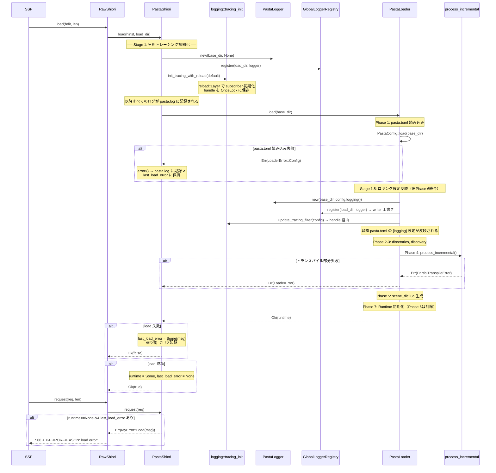
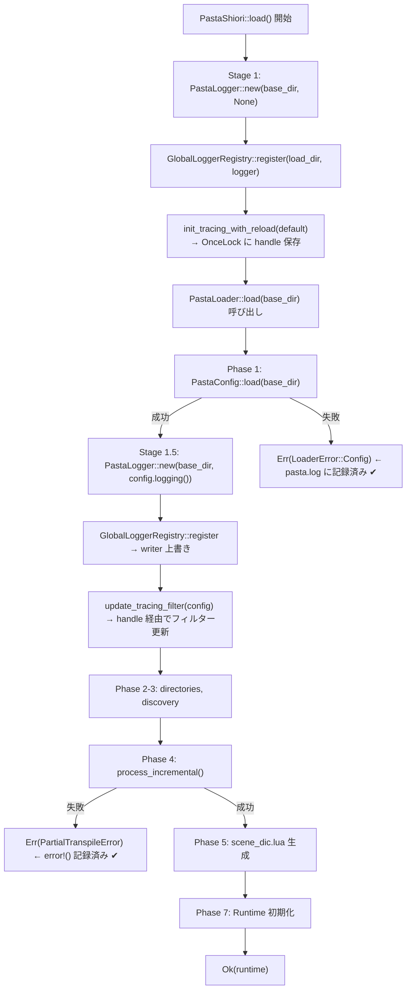
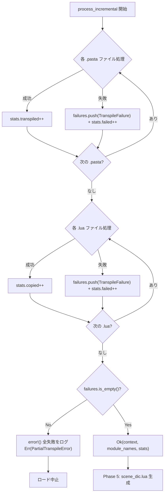

# Design Document: load-error-logging

## Overview

**Purpose**: SHIORI `load` フェーズでのエラー情報を確実に記録・伝搬し、ゴースト起動失敗時のデバッグを可能にする。

**Users**: ゴースト開発者が、SSPのSHIORI通信ログおよびファイルログから起動失敗の原因を特定するために使用する。

**Impact**: `pasta_shiori` と `pasta_lua` のエラーハンドリングとログ初期化タイミングを変更し、起動失敗時の情報ロストを解消する。

### Goals
- load 失敗時のエラーメッセージを SHIORI 応答（`X-ERROR-REASON`）に含める
- load の成否に関わらずログファイルにエラー情報を記録する
- ログファイル名を `pasta.log`（日付サフィックスなし）に簡素化する
- トランスパイル部分失敗時にロードを中止し、失敗詳細を記録する

### Non-Goals
- トランスパイル部分成功での起動継続（構造的に不可能、選択肢として排除済み）
- ログローテーション機能の実装（`Rotation::NEVER` に統一）
- `PastaLoader` の Phase 構造の大幅なリファクタリング

## Architecture

### Existing Architecture Analysis

**現行のレイヤー構造**:
```
SSP (ベースウェア)
  ↓ DLL exports (load/request/unload)
RawShiori<PastaShiori> [windows.rs]
  ↓ Shiori trait
PastaShiori [shiori.rs]
  ↓ PastaLoader::load()
PastaLoader [loader/mod.rs] — 7-Phase 起動シーケンス
  ↓ Phase 4: process_incremental()
LuaTranspiler [transpiler.rs]
  ↓ Phase 7: PastaLuaRuntime
PastaLuaRuntime [runtime/mod.rs]
```

**現行の問題点**:
1. `init_tracing_with_config()` が `PastaLoader::load()` **成功後**のみ呼ばれる（shiori.rs L141）→ load 失敗時ログなし
2. `PastaShiori` に `last_load_error` フィールドがない → `request()` で `MyError::NotInitialized`（`"not initialized error"`）しか返せない
3. `Rotation::DAILY` + `filename_prefix` → `pasta.log.2026-03-16` 形式のファイル名（logger.rs L55-60）
4. `process_incremental()` は失敗があっても `Ok(...)` を返す（loader/mod.rs L489-493）→ 部分失敗が伝搬しない
5. `.lua` ファイル読み込み失敗は `stats.failed++` のみで `failures` Vec に収集されない → `PartialTranspileError.failures` に含まれず詳細が失われる

**維持すべきパターン**:
- `LoaderError` → `MyError::Load(format!("{}", error))` のエラー変換チェーン（error.rs L47-49）
- `GlobalLoggerRegistry` + `PastaLogger` + `RoutingWriter` の多インスタンスルーティング
- `LoadDirGuard` によるスレッドローカルなログルーティング

### Architecture Pattern & Boundary Map



**Architecture Integration**:
- 選択パターン: Option A（既存コンポーネント拡張）— 変更最小、API 互換維持
- ドメイン境界: `pasta_shiori`（エラー保持・Stage 1 subscriber 初期化）と `pasta_lua`（Stage 1.5 設定反映・エラー伝搬・ファイル名簡素化・フィルター更新API）で責務分離
- 既存パターン維持: `LoaderError` → `MyError` 変換、`GlobalLoggerRegistry` ルーティング
- 責務移動: `init_tracing_with_config()` を `pasta_shiori` から `pasta_lua::logging` に移動し `init_tracing_with_reload()` に改名 — `OnceLock<FilterHandle>` と `update_tracing_filter()` を同一モジュールに集約するため
- 追加要素: `reload::Layer`（`tracing-subscriber` の `"reload"` feature 追加が必要）、`OnceLock<FilterHandle>`
- Phase 統合: 現行 Phase 6（ロガー作成）を Stage 1.5 に統合し、Phase 番号から削除

### Technology Stack

| Layer | Choice / Version | Role in Feature | Notes |
|-------|------------------|-----------------|-------|
| Backend | Rust 2024 edition | エラーハンドリング・ログ初期化ロジック | 変更なし |
| Logging | tracing 0.1 / tracing-appender 0.2 / tracing-subscriber 0.3 | ファイルログ出力 | `Rotation::NEVER` 動作を確認済み |
| Filter Reload | tracing-subscriber 0.3 `reload::Layer` | Stage 1.5 でのフィルター動的更新 | Cargo.toml に `"reload"` feature 追加が必要 |
| Error | thiserror 2 | `LoaderError`, `MyError` 定義 | 変更なし |

## System Flows

### 2段階ロガー初期化フロー



### load 失敗→request のエラー伝搬フロー

```mermaid
stateDiagram-v2
    [*] --> LoadStart: load(hinst, load_dir)
    LoadStart --> Stage1: Stage 1 早期ロガー初期化
    Stage1 --> PastaLoaderLoad: PastaLoader::load()

    PastaLoaderLoad --> LoadSuccess: Ok(runtime)
    PastaLoaderLoad --> LoadFailed: Err(LoaderError)

    LoadSuccess --> RuntimeReady: runtime = Some, last_load_error = None
    LoadFailed --> ErrorStored: last_load_error = Some(msg)
    ErrorStored --> ErrorLogged: error!() → pasta.log

    RuntimeReady --> [*]
    ErrorLogged --> [*]

    state "request() 受信時" as RequestPhase {
        RuntimeReady --> NormalRequest: runtime.is_some()
        ErrorStored --> ErrorResponse: runtime.is_none()
        ErrorResponse --> SHIORI500: MyError::Load(msg) → X-ERROR-REASON
    }
```

### process_incremental() のエラー伝搬フロー



## Requirements Traceability

| Requirement | Summary | Components | Interfaces | Flows |
|-------------|---------|------------|------------|-------|
| 1.1 | load エラーメッセージ内部保持 | PastaShiori | `last_load_error` フィールド | load 失敗フロー |
| 1.2 | request() で X-ERROR-REASON にエラー含める | PastaShiori | `request()` 分岐 | request エラー応答フロー |
| 1.3 | 根本原因を含める | LoaderError | `Display` トレイト（既存） | — |
| 1.4 | 失敗ファイル名含める | LoaderError::PartialTranspileError | `Display` + `failures` | — |
| 1.5 | 日本語メッセージ | LoaderError | 既存日本語メッセージ（対応不要） | — |
| 2.1 | load 前のログ初期化 | PastaShiori, logging::tracing_init, PastaLoader | Stage 1 + Stage 1.5 | 2段階初期化フロー |
| 2.2 | load 失敗時のログ記録 | PastaShiori | `error!()` マクロ | load 失敗フロー |
| 2.3 | 二重初期化防止 | logging::tracing_init | `try_init()` + `reload::Layer` | — |
| 3.1 | 固定ファイル名 `pasta.log` | PastaLogger | `Rotation::NEVER` | — |
| 3.2 | Rotation::NEVER 使用 | PastaLogger | `RollingFileAppender::builder()` | — |
| 4.1 | 失敗ファイルのログ記録 | process_incremental | `error!()` | process_incremental フロー |
| 4.2 | 全失敗一覧のログ記録 | process_incremental | `error!()` | process_incremental フロー |
| 4.3 | 部分失敗でロード中止 | process_incremental | `Err(PartialTranspileError)` | process_incremental フロー |

## Components and Interfaces

| Component | Domain/Layer | Intent | Req Coverage | Key Dependencies | Contracts |
|-----------|--------------|--------|--------------|------------------|-----------|
| PastaShiori | SHIORI | エラー保持と Stage 1 早期初期化 | 1.1, 1.2, 2.1, 2.2, 2.3 | PastaLoader (P0), tracing_init (P0) | State |
| logging::tracing_init | Logging | subscriber 初期化とフィルター動的更新 | 2.1, 2.3 | reload::Layer (P0), GlobalLoggerRegistry (P0) | Service |
| PastaLogger | Logging | Rotation::NEVER でファイル出力 | 3.1, 3.2 | tracing-appender (P0) | Service |
| PastaLoader (Phase変更) | Loader | Stage 1.5 統合と Phase 6 削除 | 2.1 | logging::tracing_init (P0), PastaLogger (P0) | Service |
| process_incremental | Loader | トランスパイルエラー伝搬 | 4.1, 4.2, 4.3 | LuaTranspiler (P0), CacheManager (P1) | Service |

### SHIORI Layer

#### PastaShiori

| Field | Detail |
|-------|--------|
| Intent | load エラーの保持と早期ログ初期化による確実なエラー記録 |
| Requirements | 1.1, 1.2, 2.1, 2.2, 2.3 |

**Responsibilities & Constraints**
- load 失敗時のエラーメッセージを `last_load_error` に保持する
- `PastaLoader::load()` の前に Stage 1 早期ロガー初期化を行い、load 過程のログを確実にファイルに記録する
- `request()` で load 失敗状態を検出し、保持されたエラーを `MyError::Load` として返す
- load 成功後の `runtime.logger()` → `GlobalLoggerRegistry::register()` 呼び出しは削除する（Stage 1.5 で実施済み）

**Dependencies**
- Inbound: `RawShiori` — DLL エントリポイントから呼び出し (P0)
- Outbound: `PastaLoader` — ランタイム初期化 (P0)
- Outbound: `PastaLogger` — Stage 1 早期ロガー作成 (P0)
- Outbound: `GlobalLoggerRegistry` — Stage 1 ロガー登録 (P0)
- Outbound: `logging::init_tracing_with_reload` — subscriber 初期化 (P0)

**Contracts**: State [x]

##### State Management

**現行の状態モデル** (shiori.rs L74-92):
```rust
#[derive(Default)]
pub struct PastaShiori {
    hinst: isize,
    load_dir: Option<PathBuf>,
    runtime: Option<PastaLuaRuntime>,
    load_fn: Option<Function>,
    request_fn: Option<Function>,
    unload_fn: Option<Function>,
}
```

**変更後の状態モデル**:
```rust
#[derive(Default)]
pub struct PastaShiori {
    hinst: isize,
    load_dir: Option<PathBuf>,
    runtime: Option<PastaLuaRuntime>,
    last_load_error: Option<String>,    // 【新規】load 失敗時のエラーメッセージ
    load_fn: Option<Function>,
    request_fn: Option<Function>,
    unload_fn: Option<Function>,
}
```

**状態遷移**:

| 状態 | runtime | last_load_error | request() の動作 |
|------|---------|-----------------|-----------------|
| 初期状態 | None | None | `MyError::NotInitialized` |
| load 成功 | Some | None | 正常処理 |
| load 失敗 | None | Some(msg) | `MyError::Load(msg)` |
| reload | Some/None | リセット | 前回の状態クリア後、新規 load |

**Implementation Notes**

`load()` メソッドの変更（現行: shiori.rs L110-185）:

```rust
fn load<S: AsRef<OsStr>>(&mut self, hinst: isize, load_dir: S) -> MyResult<bool> {
    let load_dir_path: PathBuf = load_dir.as_ref().into();
    if !load_dir_path.exists() {
        error!(path = %load_dir_path.display(), "Load directory not found");
        return Ok(false);
    }

    // reload 時のクリーンアップ（既存ロジック維持）
    if self.runtime.is_some() {
        info!("Releasing existing runtime for reload");
        self.clear_cached_lua_functions();
        if let Some(ref old_load_dir) = self.load_dir {
            GlobalLoggerRegistry::instance().unregister(old_load_dir);
        }
        self.runtime = None;
    }

    self.hinst = hinst;
    self.load_dir = Some(load_dir_path.clone());
    self.last_load_error = None;  // 【新規】reload 時リセット

    let _guard = LoadDirGuard::new(load_dir_path.clone());

    // ── Stage 1: 早期トレーシング初期化 ──
    // PastaLoader::load() の前に実行し、load 過程のすべてのログをキャプチャ
    if let Ok(logger) = PastaLogger::new(&load_dir_path, None) {
        let logger = std::sync::Arc::new(logger);
        GlobalLoggerRegistry::instance().register(load_dir_path.clone(), logger);
    }
    init_tracing_with_reload(&LoggingConfig::default());

    info!(load_dir = %load_dir_path.display(), hinst = hinst, "Starting PastaShiori load");

    // PastaLoader::load() 内部で Stage 1.5（設定反映）が実行される
    match PastaLoader::load(&load_dir_path) {
        Ok(runtime) => {
            // 【変更】ロガー登録は Stage 1.5 で実施済み — ここでは不要
            self.cache_lua_functions(&runtime);
            self.runtime = Some(runtime);

            if !self.call_lua_load(hinst, &load_dir_path) {
                return Ok(false);
            }
            info!(load_dir = %load_dir_path.display(), "PastaShiori load completed");
            Ok(true)
        }
        Err(e) => {
            // 【新規】エラー保持 + ログ記録（Stage 1 で初期化済みのためファイルに書かれる）
            let msg = format!("{}", e);
            error!(load_dir = %load_dir_path.display(), error = %msg, "PastaShiori load failed");
            self.last_load_error = Some(msg);
            Ok(false)
        }
    }
}
```

`request()` メソッドの変更（現行: shiori.rs L187-196）:

```rust
// 現行
let _runtime = self.runtime.as_ref().ok_or(MyError::NotInitialized)?;

// 変更後
let _runtime = self.runtime.as_ref().ok_or_else(|| {
    match &self.last_load_error {
        Some(msg) => MyError::Load(msg.clone()),
        None => MyError::NotInitialized,
    }
})?;
```

**削除される現行コード** (shiori.rs L137-153):
```rust
// 以下のブロックは Stage 1.5 に責務移動するため削除
let logging_config = runtime
    .config()
    .and_then(|c| c.logging())
    .unwrap_or_default();
init_tracing_with_config(&logging_config);

if let Some(logger) = runtime.logger() {
    GlobalLoggerRegistry::instance().register(load_dir_path.clone(), logger);
}
```

### Logging Layer

#### logging::tracing_init（新規モジュール）

| Field | Detail |
|-------|--------|
| Intent | subscriber の初期化とフィルター動的更新 API を提供する |
| Requirements | 2.1, 2.3 |

**Responsibilities & Constraints**
- `init_tracing_with_reload()` で `reload::Layer` を使い subscriber を初期化し、`OnceLock` に handle を保管する
- `update_tracing_filter()` で `OnceLock` から handle を取得し、`EnvFilter` を動的に差し替える
- `PASTA_LOG` 環境変数は常に最優先（Stage 1/1.5 両方で適用）

**Dependencies**
- External: `tracing-subscriber` 0.3 — `reload::Layer`, `EnvFilter`, `fmt::layer` (P0)
- Internal: `GlobalLoggerRegistry` — writer として使用 (P0)

**Contracts**: Service [x]

##### Service Interface

**ファイル**: `crates/pasta_lua/src/logging/tracing_init.rs`（新規作成）

```rust
use std::sync::OnceLock;
use tracing_subscriber::filter::EnvFilter;
use tracing_subscriber::reload;

// Handle の具象型はコンパイラに型推論を任せ、型エイリアスで隠蔽
type FilterHandle = reload::Handle<EnvFilter, tracing_subscriber::Registry>;

static FILTER_HANDLE: OnceLock<FilterHandle> = OnceLock::new();

/// Stage 1: subscriber を reload::Layer 付きで初期化する。
///
/// 2回目以降の呼び出しは try_init() により安全に無視される。
/// handle は OnceLock に保存され、update_tracing_filter() から利用可能。
///
/// # Filter Priority
/// 1. PASTA_LOG 環境変数（最優先）
/// 2. config.filter
/// 3. config.level
/// 4. Default: "debug"
pub fn init_tracing_with_reload(config: &LoggingConfig) { ... }

/// Stage 1.5: OnceLock の handle 経由でフィルターを動的更新する。
///
/// init_tracing_with_reload() が未呼び出しの場合は何もしない。
pub fn update_tracing_filter(config: &LoggingConfig) { ... }
```

- Preconditions: `GlobalLoggerRegistry::instance()` がアクセス可能であること
- Postconditions: `init_tracing_with_reload()` 後、`FILTER_HANDLE` が設定されている
- Invariants: `try_init()` は一度のみ成功する。`update_tracing_filter()` は何度呼んでも安全

**Implementation Notes**

`init_tracing_with_reload()` の内部構造:

```rust
pub fn init_tracing_with_reload(config: &LoggingConfig) {
    let filter = build_env_filter(config);
    let (filter_layer, handle) = reload::Layer::new(filter);

    let result = tracing_subscriber::registry()
        .with(filter_layer)
        .with(
            fmt::layer()
                .with_writer(GlobalLoggerRegistry::instance().clone())
                .with_ansi(false)
                .with_target(true)
                .with_level(true),
        )
        .try_init();

    if result.is_ok() {
        let _ = FILTER_HANDLE.set(handle);
    }
}
```

**構造変更点**: 現行の `init_tracing_with_config()` では `EnvFilter` が `fmt::layer().with_filter(filter)` として per-layer フィルターになっている。`reload::Layer` で動的更新するには、フィルターを subscriber-global レイヤーに昇格させる。これにより `fmt::layer()` は無条件に全イベントを受け取り、フィルタリングは `reload::Layer` が担う。動作上の差異はなし。

`update_tracing_filter()` の内部構造:

```rust
pub fn update_tracing_filter(config: &LoggingConfig) {
    if let Some(handle) = FILTER_HANDLE.get() {
        let filter = build_env_filter(config);
        if let Err(e) = handle.reload(filter) {
            eprintln!("Warning: Failed to update log filter: {}", e);
        }
    }
}
```

**Cargo.toml 変更**:
```toml
# 現行
tracing-subscriber = { version = "0.3", features = ["env-filter"] }

# 変更後
tracing-subscriber = { version = "0.3", features = ["env-filter", "reload"] }
```

**pub use 追加** (`crates/pasta_lua/src/logging/mod.rs`):
```rust
mod tracing_init;
pub use tracing_init::{init_tracing_with_reload, update_tracing_filter};
```

**pub use 追加** (`crates/pasta_lua/src/lib.rs`):
```rust
pub use logging::{
    GlobalLoggerRegistry, LoadDirGuard, PastaLogger,
    get_current_load_dir, set_current_load_dir,
    init_tracing_with_reload, update_tracing_filter,  // 追加
};
```

#### PastaLogger

| Field | Detail |
|-------|--------|
| Intent | Rotation::NEVER で固定ファイル名 `pasta.log` へのログ出力 |
| Requirements | 3.1, 3.2 |

**Responsibilities & Constraints**
- `RollingFileAppender` を `Rotation::NEVER` で構築し、日付サフィックスなしのファイル名を生成する
- `filename_prefix` に `log_file_name` を指定し、`Rotation::NEVER` と組み合わせて正確なファイル名 `pasta.log` を得る

**Dependencies**
- External: `tracing-appender` 0.2.4 — `RollingFileAppender`, `Rotation::NEVER` (P0)

**Contracts**: Service [x]

##### Service Interface

`PastaLogger::new()` の変更箇所:

```rust
// 現行
let appender = RollingFileAppender::builder()
    .rotation(Rotation::DAILY)
    .max_log_files(config.rotation_days)
    .filename_prefix(log_file_name)
    .build(log_dir)
    .map_err(|e| io::Error::new(io::ErrorKind::Other, e))?;

// 変更後
let appender = RollingFileAppender::builder()
    .rotation(Rotation::NEVER)
    .filename_prefix(log_file_name)
    .build(log_dir)
    .map_err(|e| io::Error::new(io::ErrorKind::Other, e))?;
```

- Preconditions: `base_dir` が存在し、`profile/pasta/logs/` ディレクトリが作成可能であること
- Postconditions: `profile/pasta/logs/pasta.log` にログが出力される（日付サフィックスなし）
- Invariants: `Rotation::NEVER` により1ファイルのみ生成

**Implementation Notes**
- `max_log_files()` 呼び出しを削除（`Rotation::NEVER` ではローテーションが発生しないため不要）
- `config.rotation_days` は `LoggingConfig` のフィールドとして互換性のため残すが、使用しない
- `tracing-appender` 0.2.4 のソースコード確認済み: `Rotation::NEVER` + `filename_prefix(name)` + suffix なし → ファイル名は `name` そのまま（[research.md](research.md) 参照）

### Loader Layer

#### PastaLoader (Phase 変更)

| Field | Detail |
|-------|--------|
| Intent | Phase 1 直後に Stage 1.5 を挿入し、従来 Phase 6 のロガー作成を統合する |
| Requirements | 2.1 |

**Responsibilities & Constraints**
- Phase 1（`PastaConfig::load()`）成功後、即座にロガーを再作成して `GlobalLoggerRegistry` に登録（writer 上書き）
- `update_tracing_filter()` を呼んで `pasta.toml` の `[logging]` 設定をフィルターに反映する
- 従来の Phase 6（`create_logger()`）を Stage 1.5 に統合し、Phase 番号から削除する
- Stage 1.5 で作成した `logger` は Phase 7 の `from_loader_with_scene_dic()` にそのまま渡す

**Dependencies**
- Internal: `PastaLogger` — ロガー作成 (P0)
- Internal: `GlobalLoggerRegistry` — writer 登録 (P0)
- Internal: `update_tracing_filter` — フィルター更新 (P0)

**Contracts**: Service [x]

##### Service Interface

`load_with_config()` の変更（現行: loader/mod.rs L61-124）:

```rust
pub fn load_with_config(
    base_dir: impl AsRef<Path>,
    runtime_config: RuntimeConfig,
) -> Result<PastaLuaRuntime, LoaderError> {
    let base_dir = base_dir.as_ref();
    // ...

    // Phase 1: Load configuration
    debug!("Phase 1: Loading configuration");
    let config = PastaConfig::load(base_dir)?;

    // ── Stage 1.5: ロギング設定反映（旧Phase 6統合）──
    debug!("Stage 1.5: Applying logging configuration");
    let logger = Self::create_and_register_logger(base_dir, &config)?;

    // Phase 2-3: directories, discovery （変更なし）
    // Phase 4: process_incremental()
    // Phase 5: scene_dic.lua （変更なし）
    // Phase 7: Runtime 初期化（Phase 6 は Stage 1.5 に統合済み）
    let runtime = PastaLuaRuntime::from_loader_with_scene_dic(
        context, loader_context, runtime_config,
        Some(config), logger, &scene_dic_path,
    )?;
    // ...
}
```

`create_and_register_logger()` 新規メソッド（既存 `create_logger()` を拡張）:

```rust
fn create_and_register_logger(
    base_dir: &Path,
    config: &PastaConfig,
) -> Result<Option<Arc<PastaLogger>>, LoaderError> {
    let logging_config = config.logging();
    match PastaLogger::new(base_dir, logging_config.as_ref()) {
        Ok(logger) => {
            let logger = Arc::new(logger);
            info!(path = %logger.log_path().display(), "Created instance logger");

            // Stage 1.5: writer 上書き
            GlobalLoggerRegistry::instance().register(base_dir.to_path_buf(), logger.clone());

            // Stage 1.5: フィルター更新
            if let Some(ref lc) = logging_config {
                update_tracing_filter(lc);
            }

            Ok(Some(logger))
        }
        Err(e) => {
            warn!(error = %e, "Failed to create instance logger, logging disabled");
            Ok(None)
        }
    }
}
```

- 既存の `create_logger()` は `create_and_register_logger()` に置き換える
- Phase 6 のデバッグログ出力は Stage 1.5 に移動

#### process_incremental

| Field | Detail |
|-------|--------|
| Intent | トランスパイル部分失敗時のエラー伝搬とロード中止 |
| Requirements | 4.1, 4.2, 4.3 |

**Responsibilities & Constraints**
- 個別ファイルのトランスパイル失敗を `error!()` でログに記録する（ロード中止に直結するため `warn!()` から昇格）
- `.lua` ファイルの読み込み/コピー失敗も `failures` Vec に収集する（現行は `stats.failed++` のみで `failures` に含まれない）
- 全ファイル処理完了後、`!failures.is_empty()` なら `Err(LoaderError::PartialTranspileError)` を返す
- 既存の `TranspileFailure` 構造体と `PartialTranspileError` バリアントを活用する

**Dependencies**
- Inbound: `PastaLoader::load()` — Phase 4 として呼び出し (P0)
- Outbound: `LuaTranspiler` — .pasta → .lua 変換 (P0)
- Outbound: `CacheManager` — キャッシュ管理 (P1)

**Contracts**: Service [x]

##### Service Interface

`process_incremental()` の変更:

**.lua ファイル処理の変更**（現行: loader/mod.rs L437-461）:

```rust
// 現行: warn!() + stats.failed++ のみ
Err(e) => {
    warn!(file = %file_path.display(), error = %e, "Failed to read .lua file, skipping");
    stats.failed += 1;
    continue;
}

// 変更後: failures に収集 + error!()
Err(e) => {
    failures.push(TranspileFailure {
        source_path: file_path.clone(),
        error: format!("Read error: {}", e),
    });
    stats.failed += 1;
    continue;
}
```

**失敗レポートの変更**（現行: loader/mod.rs L489-497）:

```rust
// 現行: 失敗があっても Ok を返す
if !failures.is_empty() {
    warn!(failed = stats.failed, "Some files failed to process");
    for failure in &failures {
        warn!(...);
    }
}
Ok((combined_context, module_names, stats))

// 変更後: 失敗があれば Err を返す
if !failures.is_empty() {
    error!(failed = stats.failed, "トランスパイル失敗によりロードを中止します");
    for failure in &failures {
        error!(
            path = %failure.source_path.display(),
            error = %failure.error,
            "トランスパイル失敗"
        );
    }
    return Err(LoaderError::PartialTranspileError {
        succeeded: stats.transpiled + stats.skipped,
        failed: stats.failed,
        failures,
    });
}
Ok((combined_context, module_names, stats))
```

- Preconditions: `pasta_files` と `lua_files` が Phase 3 で発見済み
- Postconditions: 全ファイル成功時のみ `Ok` を返す。1件以上失敗時は `Err(PartialTranspileError)` を返す
- Invariants: `stats.failed` と `failures.len()` は常に一致する

**Implementation Notes**
- 既存の `warn!()` を `error!()` に昇格（失敗はロード中止に直結するため）
- `.lua` ファイルのキャッシュ書き込み失敗（loader/mod.rs L453-459）も同様に `failures` に収集する
- `PartialTranspileError` の `Display` 実装（`"トランスパイル部分失敗: N件成功, M件失敗"`）は既存のまま使用
- `PartialTranspileError` の `failures` フィールドに各失敗の `source_path` と `error` が含まれ、上位の `MyError::Load(String)` に変換される際に `Display` で要約が伝搬される
- `.lua` ファイル失敗も `TranspileFailure` に含めるが、`TranspileFailure` は型名として汎用的なので問題ない

## Data Models

本機能でのデータモデル変更は `PastaShiori` 構造体への `last_load_error: Option<String>` フィールド追加のみ。永続化やストレージへの影響はない。

### 削除(廃止)される関数

| 関数 | 場所 | 理由 |
|------|------|------|
| `init_tracing_with_config()` | `pasta_shiori/src/shiori.rs` L15-49 | `pasta_lua::logging::init_tracing_with_reload()` に責務移動 |
| `create_logger()` | `pasta_lua/src/loader/mod.rs` L156-175 | `create_and_register_logger()` に置き換え |
