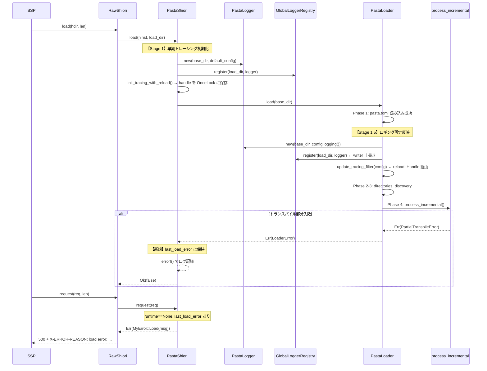
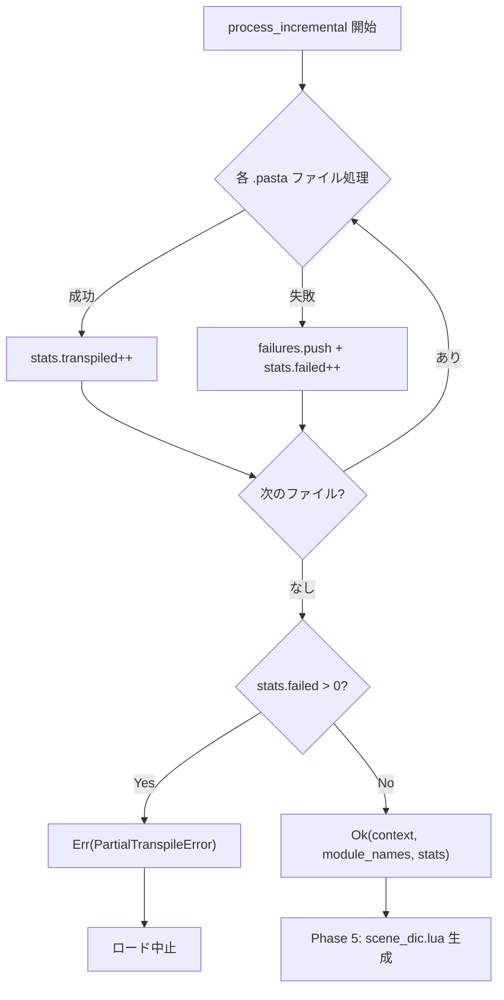

# Design Document: load-error-logging

## Overview

**Purpose**: SHIORI `load` フェーズでのエラー情報を確実に記録・伝搬し、ゴースト起動失敗時のデバッグを可能にする。

**Users**: ゴースト開発者が、SSPのSHIORI通信ログおよびファイルログから起動失敗の原因を特定するために使用する。

**Impact**: `pasta_shiori` と `pasta_lua` のエラーハンドリングとログ初期化タイミングを変更し、起動失敗時の情報ロストを解消する。

### Goals
- load 失敗時のエラーメッセージを SHIORI 応答（`X-ERROR-REASON`）に含める
- load の成否に関わらずログファイルにエラー情報を記録する
- ログファイル名を `pasta.log`（日付サフィックスなし）に簡素化する
- トランスパイル部分失敗時にロードを中止し、失敗詳細を記録する

### Non-Goals
- トランスパイル部分成功での起動継続（構造的に不可能、選択肢として排除済み）
- ログローテーション機能の実装（`Rotation::NEVER` に統一）
- `PastaLoader` の Phase 構造の大幅なリファクタリング

## Architecture

### Existing Architecture Analysis

**現行のレイヤー構造**:
```
SSP (ベースウェア)
  ↓ DLL exports (load/request/unload)
RawShiori<PastaShiori> [windows.rs]
  ↓ Shiori trait
PastaShiori [shiori.rs]
  ↓ PastaLoader::load()
PastaLoader [loader/mod.rs] — 7-Phase 起動シーケンス
  ↓ Phase 4: process_incremental()
LuaTranspiler [transpiler.rs]
  ↓ Phase 7: PastaLuaRuntime
PastaLuaRuntime [runtime/mod.rs]
```

**現行の問題点**:
1. `init_tracing_with_config()` が `PastaLoader::load()` **成功後**のみ呼ばれる → load 失敗時ログなし
2. `PastaShiori` に `last_load_error` フィールドがない → `request()` で「not initialized error」しか返せない
3. `Rotation::DAILY` + `filename_prefix` → `pasta.log.2026-03-16` 形式のファイル名
4. `process_incremental()` が失敗しても `Ok(...)` を返す → 部分失敗が伝搬しない

**維持すべきパターン**:
- `LoaderError` → `MyError::Load(String)` のエラー変換チェーン
- `GlobalLoggerRegistry` + `PastaLogger` の多インスタンスルーティング
- `try_init()` による subscriber の一度きり初期化
- `LoadDirGuard` によるスレッドローカルなログルーティング

### Architecture Pattern & Boundary Map



**Architecture Integration**:
- 選択パターン: Option A（既存コンポーネント拡張）— 変更最小、API 互換維持
- ドメイン境界: `pasta_shiori`（エラー保持・Stage 1 ログ初期化）と `pasta_lua`（Stage 1.5 設定反映・エラー伝搬・ファイル名簡素化）で責務分離
- 既存パターン維持: `LoaderError` → `MyError` 変換、`GlobalLoggerRegistry` ルーティング、`try_init()` 安全性
- 追加要素: `tracing_subscriber::reload::Layer` — `pasta_lua::logging` モジュールに `OnceLock<FilterHandle>` を追加し、Stage 1.5 でフィルター動的更新

### Technology Stack

| Layer | Choice / Version | Role in Feature | Notes |
|-------|------------------|-----------------|-------|
| Backend | Rust 2024 edition | エラーハンドリング・ログ初期化ロジック | 変更なし |
| Logging | tracing 0.1 / tracing-appender 0.2.4 / tracing-subscriber 0.3 | ファイルログ出力 | `Rotation::NEVER` 動作を確認済み |
| Filter Reload | tracing-subscriber 0.3 `reload::Layer` | Stage 1.5 でのフィルター動的更新 | `OnceLock<reload::Handle<EnvFilter, _>>` に handle 保管 |
| Error | thiserror 2 | `LoaderError`, `MyError` 定義 | 変更なし |

## System Flows

### load 失敗→request のエラー伝搬フロー

```mermaid
stateDiagram-v2
    [*] --> LoadStart: load(hinst, load_dir)
    LoadStart --> EarlyLoggerInit: 早期ロガー初期化
    EarlyLoggerInit --> PastaLoaderLoad: PastaLoader::load()
    
    PastaLoaderLoad --> LoadSuccess: Ok(runtime)
    PastaLoaderLoad --> LoadFailed: Err(LoaderError)
    
    LoadSuccess --> RuntimeReady: runtime = Some, last_load_error = None
    LoadFailed --> ErrorStored: runtime = None, last_load_error = Some(msg)
    ErrorStored --> ErrorLogged: error!() でログ記録

    RuntimeReady --> [*]
    ErrorLogged --> [*]

    state "request() 受信時" as RequestPhase {
        RuntimeReady --> NormalRequest: runtime.is_some()
        ErrorStored --> ErrorResponse: runtime.is_none()
        ErrorResponse --> X_ERROR_REASON: MyError::Load(msg)
    }
```

### process_incremental() のエラー伝搬フロー



## Requirements Traceability

| Requirement | Summary | Components | Interfaces | Flows |
|-------------|---------|------------|------------|-------|
| 1.1 | load エラーメッセージ内部保持 | PastaShiori | `last_load_error` フィールド | load 失敗フロー |
| 1.2 | request() で X-ERROR-REASON にエラー含める | PastaShiori | `request()` 分岐 | request エラー応答フロー |
| 1.3 | 根本原因を含める | LoaderError | `Display` トレイト | — |
| 1.4 | 失敗ファイル名含める | LoaderError::PartialTranspileError | `Display` 書式 | — |
| 1.5 | 日本語メッセージ | LoaderError | 既存日本語メッセージ | — |
| 2.1 | load 前のログ初期化 | PastaShiori, PastaLoader | Stage 1: `load()` 内インライン／Stage 1.5: Phase 1 後にロギング設定反映 | 早期初期化フロー |
| 2.2 | load 失敗時のログ記録 | PastaShiori | `error!()` マクロ | load 失敗フロー |
| 2.3 | 二重初期化防止 | init_tracing_with_reload | `try_init()`、`reload::Layer` | — |
| 3.1 | 固定ファイル名 `pasta.log` | PastaLogger | `Rotation::NEVER` | — |
| 3.2 | Rotation::NEVER 使用 | PastaLogger | `RollingFileAppender::builder()` | — |
| 4.1 | 失敗ファイルのログ記録 | process_incremental | `warn!()` / `error!()` | process_incremental フロー |
| 4.2 | 全失敗一覧のログ記録 | process_incremental | `error!()` | process_incremental フロー |
| 4.3 | 部分失敗でロード中止 | process_incremental | `Err(PartialTranspileError)` | process_incremental フロー |

## Components and Interfaces

| Component | Domain/Layer | Intent | Req Coverage | Key Dependencies | Contracts |
|-----------|--------------|--------|--------------|------------------|-----------|
| PastaShiori | SHIORI | エラー保持と早期ログ初期化 | 1.1, 1.2, 2.1, 2.2, 2.3 | PastaLoader (P0), PastaLogger (P0) | State |
| PastaLogger | Logging | Rotation::NEVER でファイル出力 | 3.1, 3.2 | tracing-appender (P0) | Service |
| process_incremental | Loader | トランスパイルエラー伝搬 | 4.1, 4.2, 4.3 | LuaTranspiler (P0), CacheManager (P1) | Service |

### SHIORI Layer

#### PastaShiori

| Field | Detail |
|-------|--------|
| Intent | load エラーの保持と早期ログ初期化による確実なエラー記録 |
| Requirements | 1.1, 1.2, 2.1, 2.2, 2.3 |

**Responsibilities & Constraints**
- load 失敗時のエラーメッセージを `last_load_error` に保持する
- `PastaLoader::load()` の前に早期ロガー初期化を行い、load 過程のログを確実にファイルに記録する
- `request()` でload失敗状態を検出し、保持されたエラーを `MyError::Load` として返す

**Dependencies**
- Inbound: `RawShiori` — DLL エントリポイントから呼び出し (P0)
- Outbound: `PastaLoader` — ランタイム初期化 (P0)
- Outbound: `PastaLogger` — 早期ロガー作成 (P0)
- Outbound: `GlobalLoggerRegistry` — ロガー登録 (P0)
- Outbound: `init_tracing_with_reload` — subscriber 初期化（reload::Layer 使用） (P0)

**Contracts**: State [x]

##### State Management

**現行の状態モデル**:
```
PastaShiori {
    hinst: isize,
    load_dir: Option<PathBuf>,
    runtime: Option<PastaLuaRuntime>,
    load_fn: Option<Function>,
    request_fn: Option<Function>,
    unload_fn: Option<Function>,
}
```

**変更後の状態モデル**:
```
PastaShiori {
    hinst: isize,
    load_dir: Option<PathBuf>,
    runtime: Option<PastaLuaRuntime>,
    last_load_error: Option<String>,    // 【新規】load 失敗時のエラーメッセージ
    load_fn: Option<Function>,
    request_fn: Option<Function>,
    unload_fn: Option<Function>,
}
```

**状態遷移**:

| 状態 | runtime | last_load_error | request() の動作 |
|------|---------|-----------------|-----------------|
| 初期状態 | None | None | `MyError::NotInitialized` |
| load 成功 | Some | None | 正常処理 |
| load 失敗 | None | Some(msg) | `MyError::Load(msg)` |
| reload | Some/None | リセット | 前回の状態クリア後、新規 load |

**Implementation Notes**

`load()` メソッドの変更:

1. 【Stage 1】`PastaLoader::load()` 呼び出し**前**に、早期ロガーを初期化:
   - `PastaLogger::new(base_dir, None)` でデフォルト設定のロガーを作成
   - `GlobalLoggerRegistry::instance().register(load_dir, logger)` で登録
   - `init_tracing_with_reload(&LoggingConfig::default())` で subscriber 初期化
     - 内部で `reload::Layer::new(default_filter)` を使用し、`OnceLock<FilterHandle>` に handle を保存
     - この時点から pasta.toml 読み込みエラーなど初期化エラーがファイルログに記録される
2. 【Stage 1.5】`PastaLoader::load()` 内部の Phase 1（pasta.toml 読み込み）成功後:
   - `PastaLogger::new(base_dir, Some(&config.logging()))` でカスタム設定のロガーを作成
   - `GlobalLoggerRegistry::instance().register(load_dir, logger)` で writer を上書き
   - `update_tracing_filter(&config.logging())` で `OnceLock` の handle 経由でフィルター更新
   - 以降のログは `pasta.toml` の `[logging].level/filter` 設定が反映される
3. `PastaLoader::load()` の `Err(e)` ブランチ:
   - `self.last_load_error = Some(format!("{}", e))` でエラー保持
   - `error!()` マクロでログ記録（早期初期化済みのためファイルに書かれる）
4. reload 時は `self.last_load_error = None` をリセット

`request()` メソッドの変更:

```rust
// 現行
let _runtime = self.runtime.as_ref().ok_or(MyError::NotInitialized)?;

// 変更後
let _runtime = self.runtime.as_ref().ok_or_else(|| {
    match &self.last_load_error {
        Some(msg) => MyError::Load(msg.clone()),
        None => MyError::NotInitialized,
    }
})?;
```

### Logging Layer

#### PastaLogger

| Field | Detail |
|-------|--------|
| Intent | Rotation::NEVER で固定ファイル名 `pasta.log` へのログ出力 |
| Requirements | 3.1, 3.2 |

**Responsibilities & Constraints**
- `RollingFileAppender` を `Rotation::NEVER` で構築し、日付サフィックスなしのファイル名を生成する
- `filename_prefix` に `log_file_name` を指定し、`Rotation::NEVER` と組み合わせて正確なファイル名 `pasta.log` を得る

**Dependencies**
- External: `tracing-appender` 0.2.4 — `RollingFileAppender`, `Rotation::NEVER` (P0)

**Contracts**: Service [x]

##### Service Interface

`PastaLogger::new()` の変更箇所:

```rust
// 現行
let appender = RollingFileAppender::builder()
    .rotation(Rotation::DAILY)
    .max_log_files(config.rotation_days)
    .filename_prefix(log_file_name)
    .build(log_dir)
    .map_err(|e| io::Error::new(io::ErrorKind::Other, e))?;

// 変更後
let appender = RollingFileAppender::builder()
    .rotation(Rotation::NEVER)
    .filename_prefix(log_file_name)
    .build(log_dir)
    .map_err(|e| io::Error::new(io::ErrorKind::Other, e))?;
```

- Preconditions: `base_dir` が存在し、`profile/pasta/logs/` ディレクトリが作成可能であること
- Postconditions: `profile/pasta/logs/pasta.log` にログが出力される（日付サフィックスなし）
- Invariants: `Rotation::NEVER` により1ファイルのみ生成

**Implementation Notes**
- `max_log_files()` 呼び出しを削除（`Rotation::NEVER` ではローテーションが発生しないため不要）
- `config.rotation_days` は `LoggingConfig` のフィールドとして互換性のため残すが、使用しない
- `tracing-appender` 0.2.4 のソースコード確認済み: `Rotation::NEVER` + `filename_prefix(name)` + suffix なし → ファイル名は `name` そのまま（[research.md](research.md) 参照）

### Loader Layer

#### process_incremental

| Field | Detail |
|-------|--------|
| Intent | トランスパイル部分失敗時のエラー伝搬とロード中止 |
| Requirements | 4.1, 4.2, 4.3 |

**Responsibilities & Constraints**
- 個別ファイルのトランスパイル失敗を `error!()` でログに記録する（ロード中止に直結するため `warn!()` から昇格）
- 全ファイル処理完了後、`stats.failed > 0` なら `Err(LoaderError::PartialTranspileError)` を返す
- 既存の `TranspileFailure` 構造体と `PartialTranspileError` バリアントを活用する

**Dependencies**
- Inbound: `PastaLoader::load()` — Phase 4 として呼び出し (P0)
- Outbound: `LuaTranspiler` — .pasta → .lua 変換 (P0)
- Outbound: `CacheManager` — キャッシュ管理 (P1)

**Contracts**: Service [x]

##### Service Interface

`process_incremental()` の戻り値変更:

```rust
// 現行: 失敗があっても Ok を返す
if !failures.is_empty() {
    warn!(failed = stats.failed, "Some files failed to process");
    for failure in &failures {
        warn!(...);
    }
}
Ok((combined_context, module_names, stats))

// 変更後: 失敗があれば Err を返す
if !failures.is_empty() {
    error!(failed = stats.failed, "トランスパイル失敗によりロードを中止します");
    for failure in &failures {
        error!(
            path = %failure.source_path.display(),
            error = %failure.error,
            "トランスパイル失敗"
        );
    }
    return Err(LoaderError::PartialTranspileError {
        succeeded: stats.transpiled + stats.skipped,
        failed: stats.failed,
        failures,
    });
}
Ok((combined_context, module_names, stats))
```

- Preconditions: `pasta_files` と `lua_files` が Phase 3 で発見済み
- Postconditions: 全ファイル成功時のみ `Ok` を返す。1件以上失敗時は `Err(PartialTranspileError)` を返す
- Invariants: `stats.failed` と `failures.len()` は常に一致する

**Implementation Notes**
- 既存の `warn!()` を `error!()` に昇格（失敗はロード中止に直結するため）
- `PartialTranspileError` の `Display` 実装（`"トランスパイル部分失敗: N件成功, M件失敗"`）は既存のまま使用
- `PartialTranspileError` の `failures` フィールドに各失敗の `source_path` と `error` が含まれ、上位の `MyError::Load(String)` に変換される際に `Display` で要約が伝搬される

## Data Models

本機能でのデータモデル変更は `PastaShiori` 構造体への `last_load_error: Option<String>` フィールド追加のみ。永続化やストレージへの影響はない。
