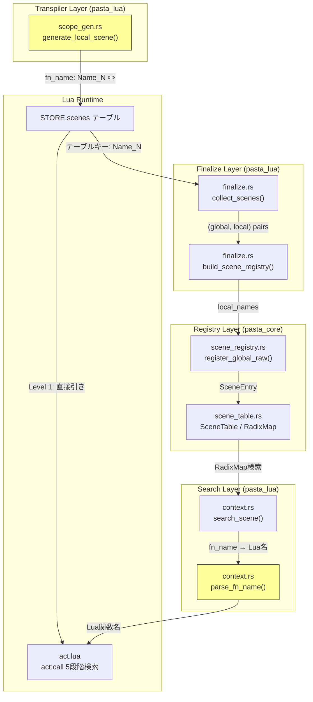
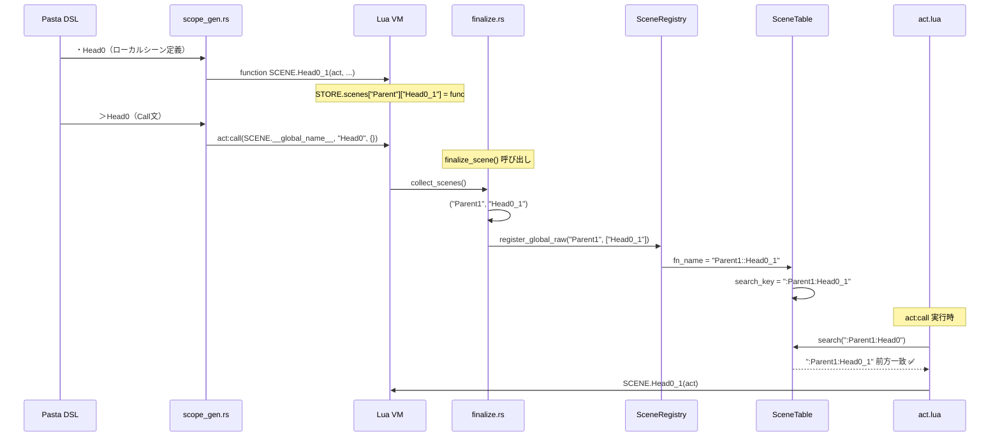

# Design Document: local-scene-act-call

## Overview

**Purpose**: トランスパイラのローカルシーン命名規約を修正し、全経路でのローカルシーン名前解決を正常化する。

**Users**: ゴースト開発者が DSL `＞` Call文・`act:call` 動的呼び出し・`SCENE.search` でローカルシーンを呼び出せるようになる。

**Impact**: `scope_gen.rs` のローカルシーン Lua 関数名生成フォーマットを `__Name_N__` → `Name_N` に変更し、`parse_fn_name` の不要な `__` 再ラッピングを除去する。

### Goals
- ローカルシーンの Lua 関数名から不要な `__` ラッピングを除去する
- finalize経路（Path B）とトランスパイル時レジストリ（Path A）のフォーマットを統一する
- DSLトランスパイル → Lua実行 → `act:call` ローカルシーン解決のE2Eテストを追加する

### Non-Goals
- `__start__` の命名規約変更（意図的な特殊名として維持）
- `act:call` 解決チェーン（act.lua）の修正（下流の変更は不要）
- `register_global_raw`・`fn_name_to_search_key`・`build_scene_registry` の修正（`__` 除去で自然に整合）
- Luaランタイムスクリプト（`scene.lua`、`act.lua`）の修正

## Architecture

### Existing Architecture Analysis

現行アーキテクチャはローカルシーン名の生成と解決に2つの経路を持つ：

- **Path A（トランスパイル時レジストリ）**: `register_local("Head0", ...)` → `fn_name = "Parent_1::Head0_1"` → `fn_name_to_search_key` → `:Parent_1:Head0_1` → ✅
- **Path B（finalize時レジストリ）**: `collect_scenes` → Luaテーブルキー `__Head0_1__` → `register_global_raw` → `fn_name = "Parent1::__Head0_1__"` → `fn_name_to_search_key` → `:Parent1:__Head0_1__` → ❌

Path Aは単体テストで使用され正常動作、Path Bはランタイムで使用されバグを発生させる。

根本原因は `scope_gen.rs` がローカルシーン名を `__Name_N__` で生成し、そのマングル名がLuaテーブルキーに焼き付けられて Path B に伝播すること。

### Architecture Pattern & Boundary Map

**修正対象**（黄色）: `scope_gen.rs` と `parse_fn_name()` の2箇所のみ。他コンポーネントは変更不要。

**Architecture Integration**:
- Selected pattern: 発生源修正（Source Fix）。マングルの生成元を修正し、下流を無変更で整合させる
- Domain/feature boundaries: Transpiler Layer 内で完結する修正。Registry Layer・Lua Runtime は変更なし
- Existing patterns preserved: `__start__` の特殊扱い、`SceneRegistry::sanitize_name()` の利用、`fn_name::local_part` フォーマット
- Steering compliance: 2パス変換設計（Pass1: シーン登録、Pass2: コード生成）に準拠

### Technology Stack

| Layer | Choice / Version | Role in Feature | Notes |
|-------|------------------|-----------------|-------|
| Backend | Rust 2024 edition | トランスパイラ修正 | `scope_gen.rs`、`context.rs` |
| Runtime | Lua 5.5 (mlua 0.11) | テーブルキー自動更新 | コード変更なし |
| Data | fast_radix_trie 1.1.0 | 前方一致検索 | コード変更なし |
| Testing | insta 1.46 | スナップショット更新 | `cargo insta review` |

## System Flows

### ローカルシーンcall解決フロー（修正後）

## Requirements Traceability

| Requirement | Summary | Components | Interfaces | Flows |
|-------------|---------|------------|------------|-------|
| 1.1 | Lua関数名 `Name_N` 形式 | ScopeGen | `generate_local_scene()` | トランスパイル |
| 1.2 | `__start__` 維持 | ScopeGen | `generate_local_scene()` | — |
| 1.3 | `parse_fn_name` 修正 | SearchContext | `parse_fn_name()` | call解決 |
| 2.1 | DSL `＞` Call文解決 | — (自動修正) | — | call解決 |
| 2.2 | `act:call` 動的呼び出し | — (自動修正) | — | call解決 |
| 2.3 | 同名重複ランダム選択 | — (既存動作) | — | — |
| 2.4 | 前方一致検索 | — (自動修正) | — | call解決 |
| 2.5 | 未発見時エラーログ | — (既存動作) | — | — |
| 3.1 | `__start__` 互換性 | ScopeGen | `generate_local_scene()` | — |
| 3.2 | グローバルシーン互換性 | — (変更なし) | — | — |
| 3.3 | Level 3-4 互換性 | — (変更なし) | — | — |
| 3.4 | 名前付きLua関数互換性 | — (変更なし) | — | — |
| 4.1 | E2E統合テスト | E2ETest | `create_runtime_with_finalize()` | E2Eフロー |
| 4.2 | finalize経路検索テスト | FinalizeTest | `register_global_raw()` | finalize |
| 4.3 | ラウンドトリップテスト | FinalizeTest | `collect_scenes()` | finalize |

## Components and Interfaces

| Component | Domain/Layer | Intent | Req Coverage | Key Dependencies | Contracts |
|-----------|-------------|--------|-------------|-----------------|-----------|
| ScopeGen | Transpiler | ローカルシーン Lua 関数名生成 | 1.1, 1.2, 3.1 | SceneRegistry (P0) | — |
| SearchContext | Search | fn_name → Lua関数名変換 | 1.3 | SceneTable (P0) | — |
| E2ETest | Test | ローカルシーンcall E2Eテスト | 4.1 | e2e_helpers (P0) | — |
| FinalizeTest | Test | finalize経路統合テスト | 4.2, 4.3 | e2e_helpers (P0) | — |
| SnapshotUpdate | Test | スナップショット更新 | 3.1-3.4 | insta (P0) | — |

### Transpiler Layer

#### ScopeGen

| Field | Detail |
|-------|--------|
| Intent | ローカルシーンの Lua 関数名から不要な `__` ラッピングを除去 |
| Requirements | 1.1, 1.2, 3.1 |

**Responsibilities & Constraints**
- `generate_local_scene()` 内の `fn_name` 生成フォーマットを変更
- `__start__` の生成ロジックには触れない（別条件分岐で保護済み）
- `SceneRegistry::sanitize_name()` の利用は継続

**Dependencies**
- Inbound: `generate_global_scene()` — ローカルシーン生成の呼び出し元 (P0)
- Outbound: `SceneRegistry::sanitize_name()` — 名前サニタイズ (P0)

**Implementation Notes**
- 変更箇所: `format!("__{}_{}__", sanitized, counter)` → `format!("{}_{}",  sanitized, counter)`
- `counter == 0` のとき `__start__` を返す既存ロジックは変更不要

### Search Layer

#### SearchContext（parse_fn_name）

| Field | Detail |
|-------|--------|
| Intent | `fn_name` の `local_part` をそのまま Lua 関数名として返す |
| Requirements | 1.3 |

**Responsibilities & Constraints**
- `parse_fn_name()` が `__start__` 以外の `local_part` に `format!("__{}__", ...)` を適用しないようにする
- `__start__` のハンドリングは変更なし

**Dependencies**
- Inbound: `search_scene()` — シーン検索結果の Lua 関数名取得 (P0)
- Outbound: なし

**Implementation Notes**
- 変更箇所: else節の `format!("__{}__", local_part)` → `local_part.to_string()`
- インラインコメント更新: `// Convert "選択肢_1" to "__選択肢_1__"` を削除または `// Return local_part as-is (already in Lua function name format)` に変更
- docstring更新（`parse_fn_name` の Returns） : `("メイン_1", "__選択肢_1__")` → `("メイン_1", "選択肢_1")`
- docstring更新（`search_scene` の Note）: `"__選択肢_1__" or "__start__"` → `"選択肢_1" or "__start__"`

### Test Layer

#### E2ETest（ローカルシーンcall統合テスト）

| Field | Detail |
|-------|--------|
| Intent | DSLトランスパイル → Lua実行 → `act:call` ローカルシーン解決・実行の一気通貫テスト |
| Requirements | 4.1 |

**Responsibilities & Constraints**
- Pasta DSL ソースからローカルシーン付きシーンをトランスパイルする
- `create_runtime_with_finalize()` で Lua VM を構築し、トランスパイル済みコードを実行する
- `finalize_scene()` を呼び出してランタイムレジストリを構築する
- `act:call` でローカルシーン名を指定し、正しいシーン関数が実行されることを検証する

**Dependencies**
- Inbound: テストランナー (P0)
- Outbound: `e2e_helpers::create_runtime_with_finalize()` (P0)、`e2e_helpers::transpile()` (P0)

**Implementation Notes**
- テストケース:
  1. 単純なローカルシーンcall（`＞SubScene` → `SubScene_1` 関数実行）
  2. 同名重複ローカルシーン（ランダム選択の動作確認）
  3. 前方一致ローカルシーン検索（`"Head"` で `Head0_1`、`Head1_1` をマッチ）
- テスト配置: `crates/pasta_lua/tests/runtime/` に追加（finalize_scene_test.rs の拡張、または新規ファイル）
- 検証方法: `act:call` の戻り値またはLuaグローバル変数への副作用で関数実行を確認

#### FinalizeTest（finalize経路統合テスト）

| Field | Detail |
|-------|--------|
| Intent | `register_global_raw` 経由の登録とRadixMap検索の整合性を検証 |
| Requirements | 4.2, 4.3 |

**Responsibilities & Constraints**
- `collect_scenes` → `build_scene_registry` → `SceneTable` のラウンドトリップを検証
- `register_global_raw` で登録されたローカルシーンの前方一致検索が正しく動作することを確認

**Dependencies**
- Inbound: テストランナー (P0)
- Outbound: `e2e_helpers::create_runtime_with_finalize()` (P0)

**Implementation Notes**
- 既存 `test_scene_collection_local_scenes` を拡張して、ローカルシーン検索まで検証
- `search_scene("ローカルシーン名", "親シーン名")` でローカルシーンが見つかることを検証

#### SnapshotUpdate

| Field | Detail |
|-------|--------|
| Intent | `__Name_N__` → `Name_N` フォーマット変更のスナップショット更新 |
| Requirements | 3.1, 3.2, 3.3, 3.4 |

**Responsibilities & Constraints**
- `cargo insta review` で一括更新
- 更新対象: `tail_call_optimization.snap`（8箇所）、`scene_with_call.snap`（1箇所）
- `__start__` と `__global_name__` は変更されないことを確認

**Implementation Notes**
- `cargo test -p pasta_lua --test transpiler` → 失敗 → `cargo insta review` → Accept
