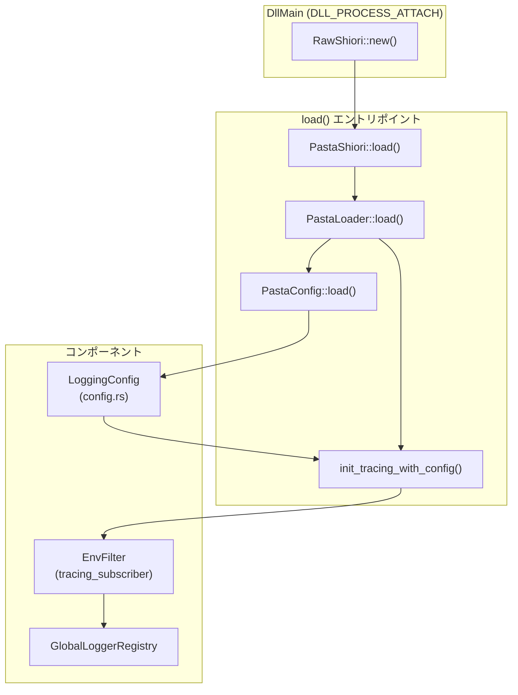
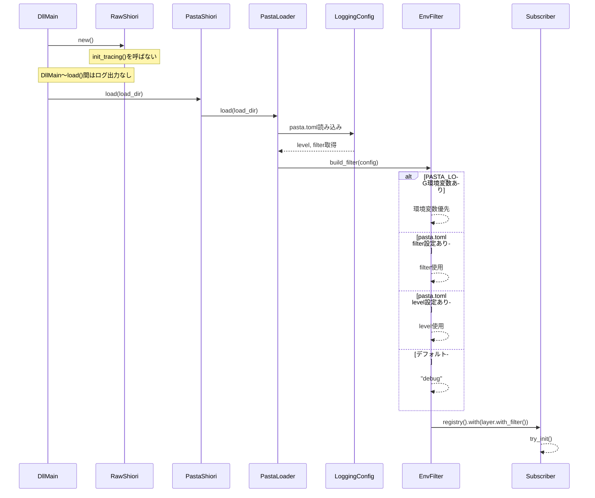

# 技術設計書: logger-configuration

## Overview

**Purpose**: この機能は、pasta.tomlの`[logging]`セクションを通じてGlobalLoggerRegistryのログ出力を宣言的に制御する手段を提供する。

**Users**: ゴースト開発者がコード変更なしにログレベルを調整し、デバッグ時に詳細なログを確認できるようになる。

**Impact**: 既存の`LoggingConfig`構造体を拡張し、`init_tracing()`のタイミングを遅延させることで、pasta.toml設定の即時反映を実現する。

### Goals

- pasta.tomlでログレベル（level）とフィルタ（filter）を設定可能にする
- `PASTA_LOG`環境変数によるデバッグ用オーバーライドを提供
- 頻出内部ログを適切なレベルに調整（TRACE/INFO/WARN）
- 200 OKレスポンス時のリクエスト/レスポンスDEBUGログを追加

### Non-Goals

- 動的なログレベル変更（reload機能）は対象外
- ログフォーマットのカスタマイズは対象外
- DllMain〜load()間のログ出力（トレードオフとして許容）

---

## Architecture

### Existing Architecture Analysis

**現行パターンと制約:**
- `LoggingConfig`は`file_path`、`rotation_days`のみをサポート
- `init_tracing()`は`DllMain`時に呼び出され、pasta.toml読み込み前に実行される
- `tracing_subscriber`のグローバルsubscriberは一度のみ設定可能
- `env-filter`機能は既にCargo.tomlで有効化済み

**アーキテクチャ決定:**
- `init_tracing()`を`PastaLoader::load()`完了後に遅延させる
- LoggingConfigからEnvFilterを構築し、pasta.toml設定を即時反映
- DllMain〜load()間のログは出力されない（トレードオフとして許容）

### Architecture Pattern & Boundary Map



**Architecture Integration:**
- **Selected pattern**: 遅延初期化（Lazy Initialization）
- **Domain boundaries**: pasta_lua（設定管理）、pasta_shiori（tracing初期化）
- **Existing patterns preserved**: serde `#[serde(default)]`パターン、`try_init()`パターン
- **New components rationale**: `init_tracing_with_config()`関数を追加し、LoggingConfigを受け取る
- **Steering compliance**: 既存のtracing/env-filter依存関係を活用

### Technology Stack

| Layer | Choice / Version | Role in Feature | Notes |
|-------|------------------|-----------------|-------|
| Logging | tracing 0.1 | 構造化ログマクロ | 既存 |
| Subscriber | tracing-subscriber 0.3 | フォーマット・フィルタリング | `env-filter`機能有効 |
| Config | toml 0.9.8, serde | TOML設定パース | 既存パターン |
| Runtime | Rust 2024 edition | 実装言語 | 既存 |

---

## System Flows

### tracing subscriber初期化フロー



---

## Requirements Traceability

| Requirement | Summary | Components | Interfaces | Flows |
|-------------|---------|------------|------------|-------|
| 1.1-1.4 | LoggingConfig拡張 | LoggingConfig | `level`, `filter`フィールド | - |
| 2.1-2.4 | EnvFilterフィルタリング | init_tracing_with_config | `build_filter()` | 初期化フロー |
| 3.1-3.3 | デフォルトログレベル調整 | shiori.rs, persistence.rs | ログマクロ変更 | - |
| 4.1-4.3 | リクエスト/レスポンスログ | call_lua_request | DEBUGログ追加 | - |
| 5.1-5.3 | 設定スキーマ | LoggingConfig | serdeデシリアライズ | - |
| 6.1-6.5 | tracing subscriber遅延初期化 | windows.rs, shiori.rs | `init_tracing_with_config()` | 初期化フロー |
| 7.1-7.3 | 後方互換性 | LoggingConfig | デフォルト値 | - |

---

## Components and Interfaces

| Component | Domain/Layer | Intent | Req Coverage | Key Dependencies | Contracts |
|-----------|--------------|--------|--------------|------------------|-----------|
| LoggingConfig | pasta_lua/loader | ログ設定の保持 | 1, 5, 7 | serde (P0) | State |
| init_tracing_with_config | pasta_shiori/shiori | tracing subscriber初期化 | 2, 6 | tracing-subscriber (P0), LoggingConfig (P0) | Service |
| call_lua_request (変更) | pasta_shiori/shiori | 200 OKログ追加 | 4 | - | Service |
| ログレベル調整 | pasta_shiori, pasta_lua | マクロ変更 | 3 | tracing (P0) | - |

### pasta_lua/loader

#### LoggingConfig

| Field | Detail |
|-------|--------|
| Intent | pasta.toml [logging]セクションの設定を保持 |
| Requirements | 1.1, 1.2, 1.3, 1.4, 5.1, 5.2, 5.3, 7.1, 7.2, 7.3 |

**Responsibilities & Constraints**
- pasta.tomlの`[logging]`セクションをデシリアライズ
- 既存フィールド（`file_path`, `rotation_days`）の後方互換性維持
- 新規フィールド（`level`, `filter`）のデフォルト値提供

**Dependencies**
- External: serde — TOMLデシリアライズ (P0)
- External: toml — 設定ファイルパース (P0)

**Contracts**: State [x]

##### State Management

```rust
/// Logging configuration from [logging] section in pasta.toml.
#[derive(Debug, Clone, Deserialize)]
pub struct LoggingConfig {
    /// Log file path relative to load_dir.
    /// Default: "profile/pasta/logs/pasta.log"
    #[serde(default = "default_log_file_path")]
    pub file_path: String,

    /// Number of days to retain log files.
    /// Default: 7
    #[serde(default = "default_rotation_days")]
    pub rotation_days: usize,

    /// Default log level.
    /// Default: "debug"
    /// Valid: "error", "warn", "info", "debug", "trace"
    #[serde(default = "default_log_level")]
    pub level: String,

    /// EnvFilter directive string.
    /// When set, takes precedence over `level`.
    /// Example: "debug,pasta_shiori=info,pasta_lua=warn"
    #[serde(default)]
    pub filter: Option<String>,
}

impl LoggingConfig {
    /// Build EnvFilter directive string.
    /// Priority: filter > level > default ("debug")
    pub fn to_filter_directive(&self) -> String {
        if let Some(ref filter) = self.filter {
            filter.clone()
        } else {
            self.level.clone()
        }
    }
}

fn default_log_level() -> String {
    "debug".to_string()
}
```

- **State model**: イミュータブル設定値
- **Persistence**: pasta.tomlからの読み込み
- **Concurrency**: 読み取り専用、スレッドセーフ

### pasta_shiori

#### init_tracing_with_config

| Field | Detail |
|-------|--------|
| Intent | LoggingConfigからEnvFilterを構築しtracing subscriberを初期化 |
| Requirements | 2.1, 2.2, 2.3, 2.4, 6.1, 6.2, 6.3, 6.4, 6.5 |

**Responsibilities & Constraints**
- `PastaLoader::load()`完了後に呼び出される
- `PASTA_LOG`環境変数がある場合は優先（デバッグ用オーバーライド）
- EnvFilter構築失敗時はデフォルト（"debug"）にフォールバック
- `try_init()`で一度のみ設定

**Dependencies**
- Inbound: PastaShiori::load — 初期化トリガー (P0)
- Inbound: LoggingConfig — フィルタ設定 (P0)
- External: tracing_subscriber::filter::EnvFilter — フィルタ構築 (P0)
- External: GlobalLoggerRegistry — ログ出力先 (P0)

**Contracts**: Service [x]

##### Service Interface

```rust
/// Initialize global tracing subscriber with LoggingConfig.
///
/// # Filter Priority
/// 1. PASTA_LOG environment variable (highest)
/// 2. pasta.toml [logging].filter
/// 3. pasta.toml [logging].level
/// 4. Default: "debug"
///
/// # Errors
/// Never fails - falls back to default filter on any error.
pub fn init_tracing_with_config(config: &LoggingConfig) {
    use tracing_subscriber::filter::EnvFilter;
    use tracing_subscriber::fmt;
    use tracing_subscriber::prelude::*;

    // Build filter with priority: PASTA_LOG > config.filter > config.level > default
    let filter = EnvFilter::try_from_env("PASTA_LOG")
        .or_else(|_| EnvFilter::try_new(config.to_filter_directive()))
        .unwrap_or_else(|e| {
            eprintln!("Warning: Failed to parse log filter, using default: {}", e);
            EnvFilter::new("debug")
        });

    let _ = tracing_subscriber::registry()
        .with(
            fmt::layer()
                .with_writer(GlobalLoggerRegistry::instance().clone())
                .with_ansi(false)
                .with_target(true)
                .with_level(true)
                .with_filter(filter),
        )
        .try_init();
}
```

- **Preconditions**: PastaLoader::load()が完了していること
- **Postconditions**: グローバルtracing subscriberが設定される
- **Invariants**: 一度のみ設定可能（2回目以降は無視）

#### call_lua_request (変更)

| Field | Detail |
|-------|--------|
| Intent | 200 OKレスポンス時のリクエスト/レスポンスDEBUGログ追加 |
| Requirements | 4.1, 4.2, 4.3 |

**Responsibilities & Constraints**
- レスポンスに`"SHIORI/3.0 200 OK"`が含まれる場合、DEBUGログを追加
- リクエスト/レスポンス文字列をフル出力（長さ制限なし）
- 既存のエラーハンドリングは変更しない

**Implementation Notes**
- 200 OK判定: `response.contains("SHIORI/3.0 200 OK")`
- DEBUGレベルなので通常運用時（INFO以上）は出力されない

```rust
// call_lua_request内、レスポンス取得後に追加
match request_fn.call::<String>(req_table) {
    Ok(response) => {
        // 200 OKの場合、リクエスト/レスポンスをDEBUGログ
        if response.contains("SHIORI/3.0 200 OK") {
            debug!(request = %request, "SHIORI request (200 OK)");
            debug!(response = %response, "SHIORI response (200 OK)");
        }
        trace!(response_len = response.len(), "SHIORI.request completed");
        Ok(response)
    }
    ...
}
```

### ログレベル調整

| 対象 | 現在 | 変更後 | ファイル:行 |
|------|------|--------|-------------|
| `SHIORI.load function cached` | DEBUG | TRACE | shiori.rs:171 |
| `SHIORI.request function cached` | DEBUG | TRACE | shiori.rs:180 |
| `SHIORI.unload function cached` | DEBUG | TRACE | shiori.rs:189 |
| `SHIORI.load returned true` | DEBUG | TRACE | shiori.rs:244 |
| `Processing SHIORI request` | DEBUG | TRACE | shiori.rs:144 |
| `SHIORI.request completed` | DEBUG | TRACE | shiori.rs:282 |
| `Persistence file not found` | DEBUG | WARN | persistence.rs:170 |
| `SHIORI.unload called successfully` | DEBUG | INFO | shiori.rs:311 |

---

## Data Models

### Domain Model

**LoggingConfig（拡張後）**

| フィールド | 型 | デフォルト | 説明 |
|-----------|-----|-----------|------|
| file_path | String | `"profile/pasta/logs/pasta.log"` | ログファイルパス（既存） |
| rotation_days | usize | 7 | ローテーション日数（既存） |
| level | String | `"debug"` | デフォルトログレベル（新規） |
| filter | Option\<String\> | None | EnvFilterディレクティブ（新規） |

**有効なlevel値**: `"error"`, `"warn"`, `"info"`, `"debug"`, `"trace"`

**filter構文**: EnvFilterディレクティブ構文
- 例: `"debug,pasta_shiori=info,pasta_lua::runtime::persistence=warn"`

---

## Error Handling

### Error Strategy

| エラー | 対応 | 根拠 |
|--------|------|------|
| EnvFilter構築失敗 | デフォルト（"debug"）にフォールバック | ログ機能は失敗してもアプリを停止させない |
| 無効なlevel値 | EnvFilter構築時に検出、フォールバック | 同上 |
| PASTA_LOG環境変数パースエラー | pasta.toml設定にフォールバック | 環境変数はオプション機能 |

### Error Categories and Responses

**User Errors**:
- 無効なfilter構文 → warningログ出力後、デフォルトフィルタ適用
- 無効なlevel値 → 同上

**System Errors**:
- なし（ログ機能はfail-safe設計）

---

## Testing Strategy

### Unit Tests
- `LoggingConfig::to_filter_directive()` - filter優先、level使用、デフォルト各ケース
- `default_log_level()` - "debug"を返すこと
- LoggingConfigのserdeデシリアライズ - 既存フィールドと新規フィールドの両方

### Integration Tests
- pasta.toml `[logging].level = "info"` 設定時、INFOログのみ出力
- pasta.toml `[logging].filter` 設定時、フィルタ適用
- `PASTA_LOG`環境変数によるオーバーライド動作
- 既存pasta.toml（levelなし）での後方互換性

### E2E Tests
- サンプルゴーストでのログ出力確認
- ログレベル変更（TRACE/INFO/WARN）の反映確認
- 200 OKレスポンス時のDEBUGログ出力確認

---

## Optional Sections

### Performance & Scalability

**影響**: 軽微
- EnvFilter構築は起動時1回のみ
- ログフィルタリングはtracing-subscriberの最適化済み実装を使用
- 200 OKログ判定は文字列検索のみ（高速）

### Migration Strategy

**後方互換性**: 完全維持
- 既存pasta.tomlは変更なしで動作
- 新規フィールド（level, filter）はオプション
- デフォルト動作（全DEBUGログ出力）は維持

---

## Supporting References

### EnvFilterディレクティブ構文

```
target[span{field=value}]=level
```

**Examples:**
- `debug` - 全体をDEBUGレベル
- `warn,pasta_shiori=debug` - デフォルトWARN、pasta_shioriはDEBUG
- `debug,pasta_shiori::cache_lua_functions=trace` - 特定関数のみTRACE

### pasta.toml設定例

```toml
[logging]
file_path = "profile/pasta/logs/pasta.log"
rotation_days = 7
level = "info"
# または詳細フィルタ
# filter = "debug,pasta_shiori=info,pasta_lua::runtime::persistence=warn"
```

詳細な調査結果は [research.md](research.md) を参照。
