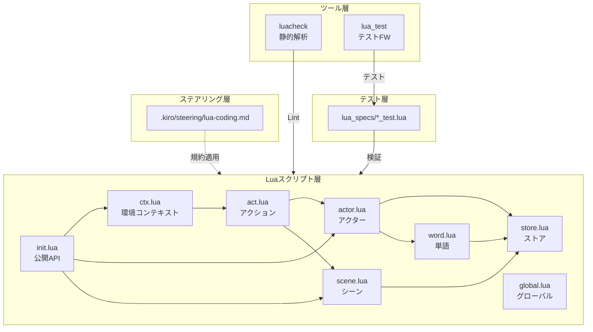
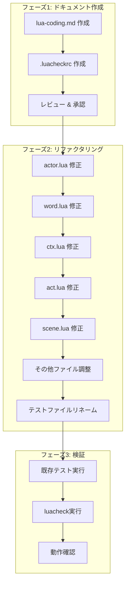

# 設計ドキュメント: Luaコーディング規約

## 概要

**目的**: `pasta_lua`クレートのLuaスクリプトに対して包括的なコーディング規約を策定し、AIエージェントが参照可能な形式でステアリングに配置する。バグ予防、コード品質向上、コードベース全体の一貫性維持を実現する。

**対象ユーザー**: AIエージェント（コード生成・修正時の規約参照）、開発者（Luaスクリプト開発時のガイドライン）

**影響**: 既存の8つのLuaファイル（`scripts/pasta/*.lua`）のリファクタリング、テストファイルの命名統一、`.kiro/steering/lua-coding.md`の新規作成

### ゴール
- `.kiro/steering/lua-coding.md`にLuaコーディング規約を配置
- 命名規約、モジュール構造、クラス設計パターンの標準化
- EmmyLua型注釈とエラーハンドリングのパターン文書化
- Pasta固有のランタイムパターン（CTX, ACT, STORE等）の文書化
- 既存コードの規約準拠リファクタリング
- luacheck設定とテスト規約の確立

### ノンゴール
- Luaランタイム自体の機能追加・変更
- テストフレームワーク（lua_test）の拡張
- 新規Luaモジュールの作成
- Rust側コードの変更

## アーキテクチャ

> 詳細な調査ログは [research.md](research.md) を参照

### 既存アーキテクチャ分析

**現状のLuaモジュール構成**:
```
crates/pasta_lua/
├── scripts/pasta/           # 本番Luaモジュール
│   ├── init.lua            # エントリーポイント
│   ├── act.lua             # アクションオブジェクト
│   ├── actor.lua           # アクターモジュール
│   ├── ctx.lua             # 環境コンテキスト
│   ├── scene.lua           # シーンレジストリ
│   ├── store.lua           # データストア（循環参照回避）
│   ├── word.lua            # 単語レジストリ
│   └── global.lua          # グローバル関数
├── scriptlibs/
│   ├── lua_test/           # テストフレームワーク
│   └── luacheck/           # 静的解析ツール（v1.2.0）
└── tests/
    └── lua_specs/          # Luaテストファイル
```

**準拠済みパターン**:
- モジュールテーブルのUPPER_CASE命名
- `require`文のファイル先頭配置
- `return MOD`のファイル末尾配置
- `@module`注釈の使用

**要修正パターン**:
- クラスメタテーブルのPascalCase（`WordBuilder`→`WORD_BUILDER_IMPL`）
- コロン構文でのメソッド定義（→ドット構文+明示的self）
- `@vararg`の非標準形式（→`@param ...`）

### アーキテクチャパターン & バウンダリマップ



**アーキテクチャ統合**:
- 選択パターン: **ドキュメントファースト** — 規約策定後にリファクタリング
- ドメイン境界: ステアリング層（規約）、スクリプト層（実装）、ツール層（検証）
- 既存パターン保持: モジュール構造、STORE循環参照回避パターン
- 新規コンポーネント: `.kiro/steering/lua-coding.md`、`.luacheckrc`
- ステアリング準拠: [workflow.md](../../../.kiro/steering/workflow.md)のDoD基準に従う

### 技術スタック

| レイヤー | 選択/バージョン | フィーチャーでの役割 | 備考 |
|----------|-----------------|---------------------|------|
| スクリプト言語 | Lua 5.x | ランタイムスクリプト実行 | mlua経由 |
| 型注釈 | EmmyLua | IDE補完・ドキュメント生成 | sumneko.lua対応 |
| 静的解析 | luacheck v1.2.0 | コード品質チェック | scriptlibs/に配置済み |
| テストFW | lua_test | BDD風テスト | describe/it/expect |
| IDE連携 | sumneko.lua | 型チェック・補完 | VS Code拡張 |

## 要件トレーサビリティ

| 要件ID | サマリー | コンポーネント | インターフェース | フロー |
|--------|---------|----------------|------------------|--------|
| 1.1-1.3 | コーディング規約ドキュメント | LuaCodingDoc | - | ドキュメント生成 |
| 2.1-2.6 | 命名規約 | LuaCodingDoc, 全Luaファイル | - | リファクタリング |
| 3.1-3.5 | モジュール構造規約 | LuaCodingDoc | - | ドキュメント生成 |
| 4.1-4.8 | クラス設計パターン | LuaCodingDoc, actor.lua, word.lua, ctx.lua | CLASS_IMPL | リファクタリング |
| 5.1-5.6 | EmmyLua型注釈規約 | LuaCodingDoc, 全Luaファイル | - | 注釈補完 |
| 6.1-6.4 | エラーハンドリング規約 | LuaCodingDoc | - | ドキュメント生成 |
| 7.1-7.5 | Pasta固有規約 | LuaCodingDoc | CTX, ACT, STORE, PROXY | ドキュメント生成 |
| 8.1-8.8 | 既存コードリファクタリング | 全Luaファイル | - | リファクタリング |
| 9.1-9.5 | テスト/Lint規約 | LuaCodingDoc, .luacheckrc | luacheck, lua_test | 設定ファイル生成 |

## コンポーネント & インターフェース

### サマリーテーブル

| コンポーネント | ドメイン/レイヤー | 目的 | 要件カバレッジ | 主要依存 | コントラクト |
|---------------|------------------|------|----------------|----------|--------------|
| LuaCodingDoc | ステアリング | コーディング規約文書 | 1-7, 9 | - | - |
| LuacheckConfig | ツール | 静的解析設定 | 9.4-9.5 | luacheck (P0) | 設定ファイル |
| ActorModule | スクリプト | アクター管理 | 2, 4, 5, 8 | STORE (P0), WORD (P1) | CLASS_IMPL |
| WordModule | スクリプト | 単語レジストリ | 2, 4, 5, 8 | STORE (P0) | CLASS_IMPL |
| CtxModule | スクリプト | 環境コンテキスト | 4, 5, 8 | ACT (P0) | CLASS_IMPL |
| ActModule | スクリプト | アクション管理 | 4, 5, 8 | ACTOR (P0), SCENE (P1) | CLASS_IMPL |
| SceneModule | スクリプト | シーンレジストリ | 5, 8 | STORE (P0) | - |
| TestFiles | テスト | テストスペック | 9.1-9.3 | lua_test (P0) | - |

### ステアリング層

#### LuaCodingDoc

| フィールド | 詳細 |
|-----------|------|
| 目的 | Luaコーディング規約をAIエージェントと開発者が参照可能な形式で提供 |
| 要件 | 1.1, 1.2, 1.3, 2.1-2.6, 3.1-3.5, 4.1-4.8, 5.1-5.6, 6.1-6.4, 7.1-7.5, 9.1-9.5 |

**責務 & 制約**
- 主責務: 命名規約、モジュール構造、クラス設計、型注釈、エラーハンドリング、Pasta固有パターンを文書化
- 制約: Markdownフォーマット、ステアリングディレクトリに配置
- 所有データ: なし（純粋なドキュメント）

**依存関係**
- 外部: なし

**実装ノート**
- 配置: `.kiro/steering/lua-coding.md`
- フォーマット: セクション構成は要件1-9に対応
- コード例: 各パターンのテンプレートを含む

#### LuacheckConfig

| フィールド | 詳細 |
|-----------|------|
| 目的 | pastaプロジェクト用のluacheck設定を提供 |
| 要件 | 9.4, 9.5 |

**責務 & 制約**
- 主責務: グローバル変数ホワイトリスト、日本語識別子許可、警告レベル設定
- 制約: `.luacheckrc`フォーマット、`crates/pasta_lua/`に配置

**依存関係**
- 外部: luacheck v1.2.0 — 静的解析実行 (P0)

**設定コントラクト**
```lua
-- .luacheckrc
globals = {
    "PASTA",     -- メインAPI
    "ACTOR",     -- アクターモジュール
    "SCENE",     -- シーンモジュール
    "WORD",      -- 単語モジュール
    "ACT",       -- アクションオブジェクト
    "CTX",       -- 環境コンテキスト
    "STORE",     -- データストア
    "GLOBAL",    -- グローバル関数
}

-- 日本語識別子を許可
std = "lua51+lua52+lua53"
allow_defined = true

-- 未使用変数警告を抑制（アンダースコアプレフィックス）
unused_args = false
unused = false

-- 行長制限
max_line_length = 120
```

**実装ノート**
- 配置: `crates/pasta_lua/.luacheckrc`
- 日本語識別子: 標準設定で許可される（UTF-8対応）

### スクリプト層

#### CLASS_IMPLインターフェース（共通パターン）

全てのクラス的モジュールが従うべきパターン:

```lua
--- @module pasta.example
local EXAMPLE = {}

--- @class Example
--- @field name string
--- @field value number
local EXAMPLE_IMPL = {}
EXAMPLE_IMPL.__index = EXAMPLE_IMPL

--- 新しいインスタンスを作成
--- @param name string
--- @param value number
--- @return Example
function EXAMPLE.new(name, value)
    local obj = {
        name = name,
        value = value,
    }
    setmetatable(obj, EXAMPLE_IMPL)
    return obj
end

--- インスタンスメソッド（明示的self、ドット構文）
--- @param self Example
--- @param delta number
--- @return number
function EXAMPLE_IMPL.add(self, delta)
    self.value = self.value + delta
    return self.value
end

return EXAMPLE
```

**パターン規則**:
1. `MODULE`（UPPER_CASE）: コンストラクタとモジュール関数を保持
2. `MODULE_IMPL`（UPPER_CASE + `_IMPL`）: クラスメタテーブル、インスタンスメソッドを保持
3. `MODULE.new(args)`: コンストラクタ関数
4. `EXAMPLE_IMPL.method(self, ...)`: ドット構文 + 明示的self
5. 呼び出し側: `instance:method(arg)` 許可（利便性）

#### ActorModule リファクタリング

| フィールド | 詳細 |
|-----------|------|
| 目的 | アクター管理とプロキシ生成 |
| 要件 | 2.3, 2.6, 4.1-4.5, 5.1-5.4, 8.1-8.7 |

**現状 → 目標**:
| 項目 | 現状 | 目標 |
|------|------|------|
| クラス名 | `WordBuilder`, `ActorWordBuilder` | `WORD_BUILDER_IMPL`, `ACTOR_WORD_BUILDER_IMPL` |
| メソッド定義 | `:method()` | `.method(self)` |
| 型注釈 | `@vararg string` | `@param ... string` |

**実装ノート**
- ファイル: `scripts/pasta/actor.lua`
- 変更規模: 中（約15箇所の修正）

#### WordModule リファクタリング

| フィールド | 詳細 |
|-----------|------|
| 目的 | 単語レジストリとビルダーパターン |
| 要件 | 2.3, 2.6, 4.1-4.5, 5.1-5.4, 8.1-8.7 |

**現状 → 目標**:
| 項目 | 現状 | 目標 |
|------|------|------|
| モジュール名 | `MOD` | `WORD` |
| クラス名 | `WordBuilder` | `WORD_BUILDER_IMPL` |
| メソッド定義 | `:method()` | `.method(self)` |

**実装ノート**
- ファイル: `scripts/pasta/word.lua`
- 変更規模: 中（約10箇所の修正）

#### CtxModule リファクタリング

| フィールド | 詳細 |
|-----------|------|
| 目的 | 環境コンテキスト管理 |
| 要件 | 4.1-4.5, 5.1-5.4, 8.1-8.7 |

**現状 → 目標**:
| 項目 | 現状 | 目標 |
|------|------|------|
| クラスパターン | `CTX.__index = CTX` | `CTX`（モジュール） / `CTX_IMPL`（クラス） |
| メソッド定義 | `:method()` | `.method(self)` |

**実装ノート**
- ファイル: `scripts/pasta/ctx.lua`
- `CTX.new()`は既に準拠、メソッド定義の構文変換が必要

#### ActModule リファクタリング

| フィールド | 詳細 |
|-----------|------|
| 目的 | アクションオブジェクト管理 |
| 要件 | 4.1-4.5, 5.1-5.4, 8.1-8.7 |

**現状 → 目標**:
| 項目 | 現状 | 目標 |
|------|------|------|
| クラスパターン | `ACT.__index = ACT` | `ACT`（モジュール） / `ACT_IMPL`（クラス） |
| `__index` | `function ACT:__index(key)` | `function ACT_IMPL.__index(self, key)` |
| メソッド定義 | `:method()` | `.method(self)` |

**実装ノート**
- ファイル: `scripts/pasta/act.lua`
- `__index`メタメソッドの変換に注意

#### SceneModule リファクタリング

| フィールド | 詳細 |
|-----------|------|
| 目的 | シーンレジストリ管理 |
| 要件 | 5.1-5.4, 8.1-8.3 |

**現状 → 目標**:
| 項目 | 現状 | 目標 |
|------|------|------|
| モジュール名 | `MOD` | `SCENE` |
| 型注釈 | 一部欠落 | 全関数に追加 |

**実装ノート**
- ファイル: `scripts/pasta/scene.lua`
- 変更規模: 小（命名変更と型注釈補完）

### テスト層

#### TestFiles リネーム

| フィールド | 詳細 |
|-----------|------|
| 目的 | テストファイル命名の統一 |
| 要件 | 9.2 |

**変更リスト**:
| 現在の名前 | 新しい名前 |
|-----------|-----------|
| `actor_word_spec.lua` | `actor_word_test.lua` |
| `transpiler_spec.lua` | `transpiler_test.lua` |

**実装ノート**
- ディレクトリ: `tests/lua_specs/`
- 理由: Rust `*_test.rs` との一貫性、AI検索確実性向上

## データモデル

このフィーチャーはドキュメント生成とリファクタリングが主であり、新規データモデルは不要。

## エラーハンドリング

### エラー戦略

リファクタリング時のエラーハンドリング規約として、以下をドキュメント化:

**nilチェックパターン**:
```lua
--- nilの可能性がある値にアクセスする前にガード
--- @param actor Actor|nil
--- @return string|nil
function EXAMPLE.get_name(actor)
    if actor == nil then
        return nil
    end
    return actor.name
end
```

**pcallパターン**:
```lua
--- 外部/リスクのある操作にpcallを使用
local ok, result = pcall(function()
    return risky_operation()
end)
if not ok then
    -- エラーハンドリング
    return nil, result
end
```

**サイレントnil禁止**:
```lua
--- BAD: 暗黙的nil返却
function bad_example()
    -- return なし（暗黙的nil）
end

--- GOOD: 明示的nil返却 + ドキュメント
--- @return string|nil 見つからない場合はnil
function good_example()
    return nil
end
```

## テスト戦略

### ユニットテスト（リファクタリング検証）

リファクタリング後、既存テストを実行して動作保証:

- `actor_word_test.lua` — アクター単語辞書テスト
- `transpiler_test.lua` — トランスパイラーテスト

**テスト実行コマンド**:
```bash
cargo test -p pasta_lua lua_unittest_runner
```

### 静的解析（luacheck）

`.luacheckrc`設定後、全Luaファイルをチェック:

```bash
lua crates/pasta_lua/scriptlibs/luacheck/bin/luacheck.lua crates/pasta_lua/scripts/
```

### テスト構造テンプレート（ドキュメント化対象）

```lua
--- @module test.example_test
local test = require("lua_test.test")
local expect = require("lua_test.expect")

test.describe("EXAMPLE", function()
    test.it("should create new instance", function()
        local ex = EXAMPLE.new("test", 10)
        expect(ex.name).to_equal("test")
        expect(ex.value).to_equal(10)
    end)

    test.it("should add value", function()
        local ex = EXAMPLE.new("test", 10)
        local result = ex:add(5)
        expect(result).to_equal(15)
    end)
end)
```

## 実装フロー



## 付録: 変更ファイルリスト

| カテゴリ | ファイル | 変更種別 | 規模 |
|----------|----------|----------|------|
| 新規 | `.kiro/steering/lua-coding.md` | 作成 | 大 |
| 新規 | `crates/pasta_lua/.luacheckrc` | 作成 | 小 |
| 修正 | `scripts/pasta/actor.lua` | リファクタ | 中 |
| 修正 | `scripts/pasta/word.lua` | リファクタ | 中 |
| 修正 | `scripts/pasta/ctx.lua` | リファクタ | 小 |
| 修正 | `scripts/pasta/act.lua` | リファクタ | 中 |
| 修正 | `scripts/pasta/scene.lua` | リファクタ | 小 |
| 修正 | `scripts/pasta/store.lua` | 軽微調整 | 小 |
| 修正 | `scripts/pasta/global.lua` | 軽微調整 | 小 |
| 修正 | `scripts/pasta/init.lua` | 軽微調整 | 小 |
| リネーム | `lua_specs/*_spec.lua` → `*_test.lua` | リネーム | 小 |
