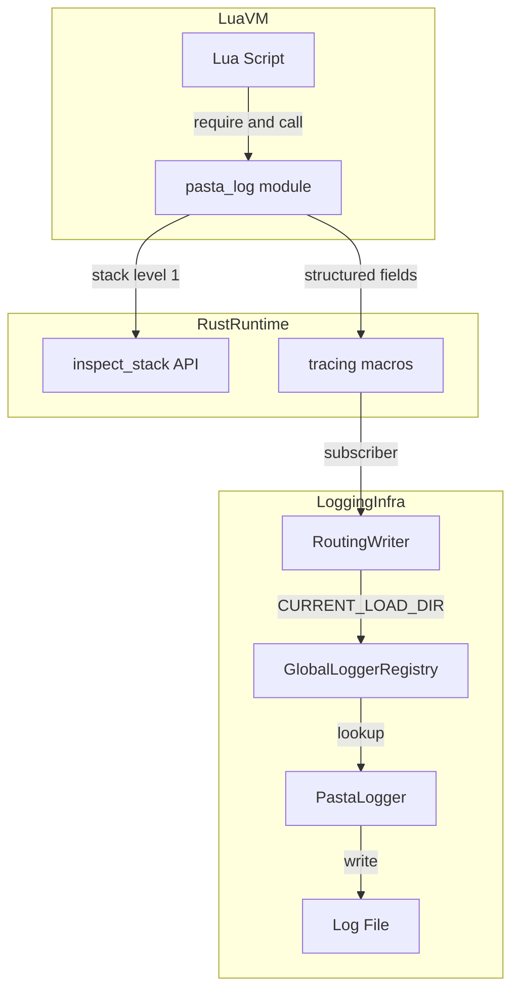
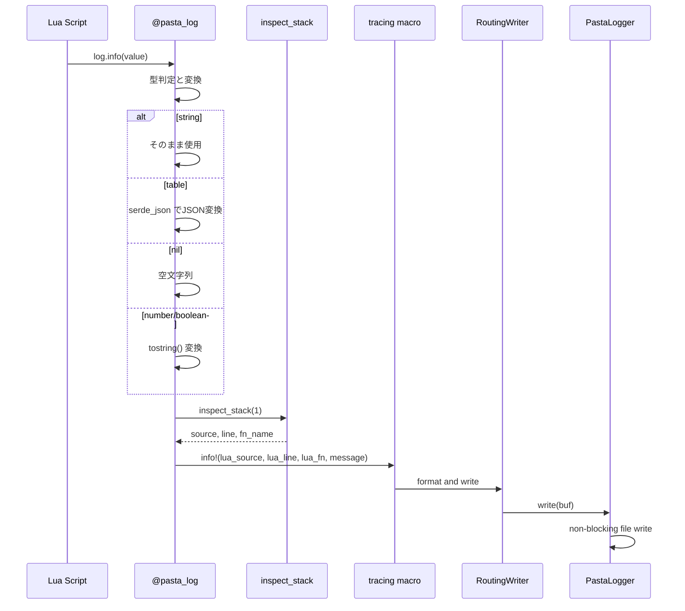

# Technical Design: lua-logging

## Overview

本機能は、Lua実行環境からRust側の `tracing` ロギングインフラへログ出力をブリッジする `@pasta_log` モジュールを提供する。既存の `@pasta_*` モジュール群と同一の登録パターンに従い、`require "@pasta_log"` で利用可能にする。

**Purpose**: Luaスクリプト開発者がデバッグ・診断のためにログ出力を行い、Rust側の `tracing` + PastaLogger ルーティング機構を通じてインスタンス固有のログファイルに自動的に記録されるようにする。

**Users**: Pasta DSL/Lua スクリプト開発者（ゴースト開発者）が、スクリプトのデバッグ・動作確認に使用する。

**Impact**: `crates/pasta_lua/src/runtime/` に新規ファイル `log.rs` を追加し、`mod.rs` の初期化シーケンスにモジュール登録を追加する。既存コードへの変更は最小限。

### Goals
- 5レベルのログ関数（trace/debug/info/warn/error）を Lua から利用可能にする
- Lua 側の呼び出し元情報（ソース、行番号、関数名）を自動付与する
- 既存の tracing + PastaLogger ルーティング機構を活用し、追加設定なしで動作させる
- テーブル等の複雑型を JSON 形式で展開表示する

### Non-Goals
- ログレベルのフィルタリング制御（tracing subscriber 側の責務）
- ログフォーマットのカスタマイズ（subscriber 側の責務）
- 多引数対応（`log.info(a, b, c)` 形式）— 単一引数のみ
- ファイルへの直接書き込み（PastaLogger への委譲のみ）

## Architecture

### Existing Architecture Analysis

現行の Lua モジュール登録アーキテクチャ:

- `PastaLuaRuntime` が `from_loader_with_scene_dic()` 内で各 `@pasta_*` モジュールを順次登録
- 各モジュールは `pub fn register(lua: &Lua, ...) -> LuaResult<Table>` パターンに従う
- 登録後、`package.loaded["@module_name"]` に格納
- ログインフラは `GlobalLoggerRegistry` + `RoutingWriter` + thread-local `CURRENT_LOAD_DIR` で構成

### Architecture Pattern & Boundary Map



**Architecture Integration**:
- **Selected pattern**: Extension — 既存 `@pasta_*` モジュール登録パターンを踏襲
- **Domain boundaries**: `runtime/log.rs` は Lua→Rust ブリッジ層に属し、`logging/` の Rust 側ロガーとは分離
- **Existing patterns preserved**: `register()` 関数パターン、`package.loaded` 登録、`_VERSION`/`_DESCRIPTION` メタデータ
- **New components rationale**: `log.rs` は単一の新規ファイル。ログ変換ロジックをカプセル化
- **Steering compliance**: tech.md のレイヤー構成（Runtime 層）に準拠、structure.md の命名規約に従う

### Technology Stack

| Layer | Choice / Version | Role in Feature | Notes |
|-------|------------------|-----------------|-------|
| Lua VM | mlua 0.11 (Lua 5.5) | ログ関数の公開、inspect_stack | 既存依存 |
| Logging | tracing 0.1 | イベント出力、structured fields | 既存依存 |
| Serialization | serde_json (workspace) | テーブル→JSON変換 | 既存依存、persistence.rs で使用実績 |
| Log Routing | GlobalLoggerRegistry | インスタンス固有ルーティング | 既存インフラ |

新規依存関係: なし

## System Flows

### ログ出力フロー



## Requirements Traceability

| Requirement | Summary | Components | Interfaces | Flows |
|-------------|---------|------------|------------|-------|
| 1.1 | 5レベルログ関数 | LogModule | trace/debug/info/warn/error | ログ出力フロー |
| 1.2 | tracing マクロ転送 | LogModule | tracing::trace!/debug!/info!/warn!/error! | ログ出力フロー |
| 1.3 | 文字列引数受付 | LogModule, ValueConverter | message: Value 引数 | ログ出力フロー |
| 1.4 | 非文字列値の変換 | ValueConverter | serde_json, tostring | ログ出力フロー |
| 1.5 | nil/引数なし処理 | ValueConverter | 空文字列フォールバック | ログ出力フロー |
| 2.1 | ソース・行番号取得 | CallerInfo | inspect_stack, DebugSource | ログ出力フロー |
| 2.2 | 関数名取得 | CallerInfo | DebugNames | ログ出力フロー |
| 2.3 | debug ライブラリ不要 | CallerInfo | Lua::inspect_stack (C API直接) | — |
| 2.4 | 情報取得失敗時フォールバック | CallerInfo | Option 型で安全処理 | ログ出力フロー |
| 3.1 | package.loaded 登録 | Registration | register_log_module() | — |
| 3.2 | 早期登録 | Registration | from_loader_with_scene_dic 内 | — |
| 3.3 | メタデータ | LogModule | _VERSION, _DESCRIPTION | — |
| 3.4 | 設定不要 | Registration | 引数なし register() | — |
| 4.1 | tracing マクロ経由転送 | LogModule | tracing::{level}! マクロ | ログ出力フロー |
| 4.2 | structured fields 埋め込み | CallerInfo, LogModule | lua_source, lua_line, lua_fn | ログ出力フロー |
| 4.3 | 既存ルーティング活用 | — (既存インフラ) | GlobalLoggerRegistry | ログ出力フロー |
| 4.4 | PastaLogger 未設定時動作 | — (既存インフラ) | RoutingWriter no-op | — |
| 5.1 | debug ライブラリ非依存 | CallerInfo | inspect_stack | — |
| 5.2 | ファイルシステム非アクセス | LogModule | tracing 経由のみ | — |
| 5.3 | RuntimeConfig.libs 独立 | Registration | Rust 側登録 | — |

## Components and Interfaces

| Component | Domain/Layer | Intent | Req Coverage | Key Dependencies | Contracts |
|-----------|--------------|--------|--------------|------------------|-----------|
| LogModule | Runtime | Lua→tracing ブリッジモジュール | 1.1-1.5, 4.1-4.2, 5.2 | mlua (P0), tracing (P0) | Service |
| ValueConverter | Runtime | Lua値→文字列変換 | 1.3-1.5 | serde_json (P1), mlua (P0) | Service |
| CallerInfo | Runtime | コールスタック情報抽出 | 2.1-2.4, 4.2, 5.1 | mlua inspect_stack (P0) | Service |
| Registration | Runtime | モジュール登録統合 | 3.1-3.4, 5.3 | PastaLuaRuntime (P0) | — |

### Runtime Layer

#### LogModule

| Field | Detail |
|-------|--------|
| Intent | `@pasta_log` Lua モジュール: 5レベルのログ関数を提供し、tracing マクロへ転送する |
| Requirements | 1.1, 1.2, 1.3, 4.1, 4.2, 5.2 |

**Responsibilities & Constraints**
- Lua テーブルとして `trace`, `debug`, `info`, `warn`, `error` の5関数を公開
- 各関数は受け取った値を文字列化し、呼び出し元情報と共に対応する tracing マクロを呼び出す
- ファイルシステムへの直接アクセスは行わない

**Dependencies**
- Outbound: tracing — ログイベント発行 (P0)
- Outbound: ValueConverter — 値の文字列変換 (P0)
- Outbound: CallerInfo — 呼び出し元情報取得 (P0)
- External: mlua — Lua 関数登録、Value 型 (P0)

**Contracts**: Service [x]

##### Service Interface
```rust
/// @pasta_log モジュールを Lua 状態に登録する。
/// 設定不要。Lua VM とオプションの target 文字列のみ受け取る。
pub fn register(lua: &Lua) -> LuaResult<Table>;
```
- Preconditions: Lua VM が初期化済み
- Postconditions: `_VERSION`, `_DESCRIPTION`, `trace`, `debug`, `info`, `warn`, `error` がテーブルに設定される
- Invariants: 関数呼び出しが Lua エラーを発生させない

**Implementation Notes**
- Integration: `register_log_module()` を `mod.rs` の `register_persistence_module()` 直後に配置
- Validation: 全ログ関数は引数の型チェックを行い、不正な値でもエラーを返さない
- Risks: `inspect_stack(1)` のレベル値が正しいことをテストで検証

#### ValueConverter

| Field | Detail |
|-------|--------|
| Intent | Lua の任意の値を人間可読な文字列に変換する |
| Requirements | 1.3, 1.4, 1.5 |

**Responsibilities & Constraints**
- 型別変換ルール:
  - `String` → そのまま使用
  - `Integer`, `Number`, `Boolean` → `tostring()` 相当の変換
  - `Table` → `serde_json` で JSON 文字列に変換（`lua.from_value::<serde_json::Value>()` 使用）
  - `Nil`, 引数なし → 空文字列 `""`
  - `Function`, `UserData`, `Thread` 等 → `tostring()` フォールバック
- JSON 変換失敗時（循環参照等）は `tostring()` にフォールバック

**Dependencies**
- External: serde_json — テーブルの JSON 変換 (P1)
- External: mlua LuaSerdeExt — Lua→serde 変換 (P0)

**Contracts**: Service [x]

##### Service Interface
```rust
/// Lua 値をログ出力用の文字列に変換する。
/// エラーを返さず、常に何らかの文字列を返す。
fn value_to_string(lua: &Lua, value: Value) -> String;
```
- Preconditions: なし
- Postconditions: 常に有効な String を返す（パニックしない）
- Invariants: nil → `""`, テーブル → JSON 文字列, 変換失敗 → フォールバック文字列

#### CallerInfo

| Field | Detail |
|-------|--------|
| Intent | Lua コールスタックから呼び出し元のソース・行番号・関数名を抽出する |
| Requirements | 2.1, 2.2, 2.3, 2.4, 5.1 |

**Responsibilities & Constraints**
- `Lua::inspect_stack(1, ...)` で呼び出し元（Lua側）の情報を取得
- debug ライブラリを必要としない（Lua C API `lua_getinfo` を直接使用）
- 情報取得失敗時は全フィールドをデフォルト値で返す

**Dependencies**
- External: mlua — `Lua::inspect_stack`, `Debug`, `DebugNames`, `DebugSource` (P0)

**Contracts**: Service [x]

##### Service Interface
```rust
/// 呼び出し元情報を保持する構造体。
struct LuaCallerInfo {
    /// ソースファイル名（例: "@main.lua", "=stdin"）
    source: String,
    /// 行番号（取得不可の場合 0）
    line: usize,
    /// 関数名（取得不可の場合 空文字列）
    fn_name: String,
}

/// Lua コールスタックから呼び出し元情報を取得する。
/// level=1 は直接の Lua 呼び出し元。
fn get_caller_info(lua: &Lua) -> LuaCallerInfo;
```
- Preconditions: Lua VM のスタック上にログ関数の呼び出しコンテキストが存在
- Postconditions: 常に `LuaCallerInfo` を返す（部分的に取得不可でもデフォルト値で補完）
- Invariants: パニックしない、Lua エラーを発生させない

#### Registration

| Field | Detail |
|-------|--------|
| Intent | `@pasta_log` を PastaLuaRuntime の初期化シーケンスに統合する |
| Requirements | 3.1, 3.2, 3.3, 3.4, 5.3 |

**Responsibilities & Constraints**
- `mod.rs` に `mod log;` 宣言を追加
- `register_log_module()` メソッドを `PastaLuaRuntime` に追加
- `from_loader_with_scene_dic()` 内の `register_persistence_module()` 直後に呼び出し
- 外部設定（pasta.toml）不要、引数なしで登録

**Dependencies**
- Inbound: PastaLuaRuntime — 初期化シーケンス (P0)
- Outbound: LogModule::register — モジュール生成 (P0)

**Implementation Notes**
- Integration: `with_config()` 内にも登録を追加し、テスト用ランタイムでも利用可能にする
- Validation: 登録成功後 `tracing::debug!("Registered @pasta_log module")` を出力

## Error Handling

### Error Strategy
`@pasta_log` モジュールは**ログ関数からエラーを返さない**方針を採用する。ログ出力はデバッグ補助であり、ログ失敗でアプリケーションが停止するのは望ましくない。

### Error Categories and Responses
- **値変換エラー**（テーブルJSON変換失敗）→ `tostring()` フォールバック
- **スタック情報取得失敗** → デフォルト値（空文字列/0）で補完
- **tracing 出力エラー** → 発生しない（tracing マクロはエラーを返さない）

## Testing Strategy

### Unit Tests (`crates/pasta_lua/tests/log_module_test.rs`)
- 各ログレベル関数の基本呼び出し
- 文字列引数の正常出力
- 非文字列値（数値、真偽値、テーブル、nil）の変換確認
- テーブルの JSON 展開確認
- 呼び出し元情報（ソース、行番号、関数名）の取得確認
- nil/引数なし時の空文字列処理

### Integration Tests
- `require "@pasta_log"` でモジュール取得可能であること
- `_VERSION` と `_DESCRIPTION` の存在確認
- 他の `@pasta_*` モジュールとの共存確認
- main.lua 内からのログ出力が正常に動作すること
