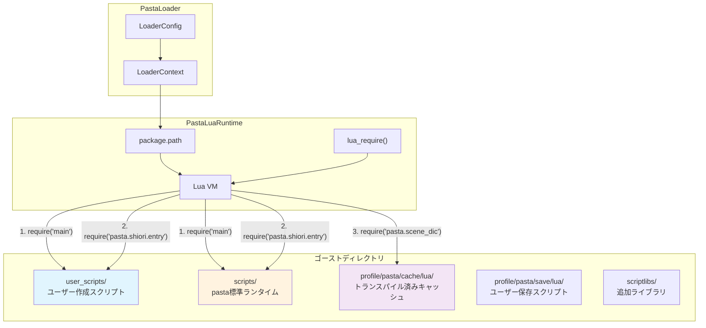
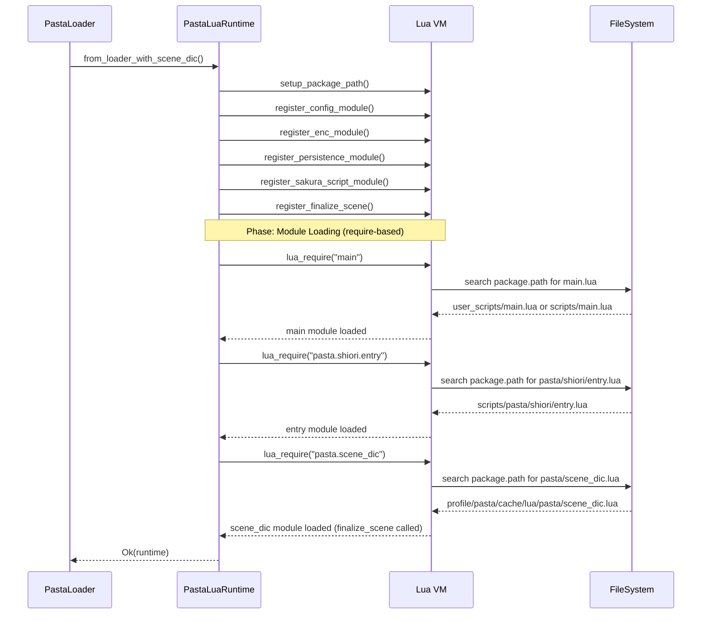
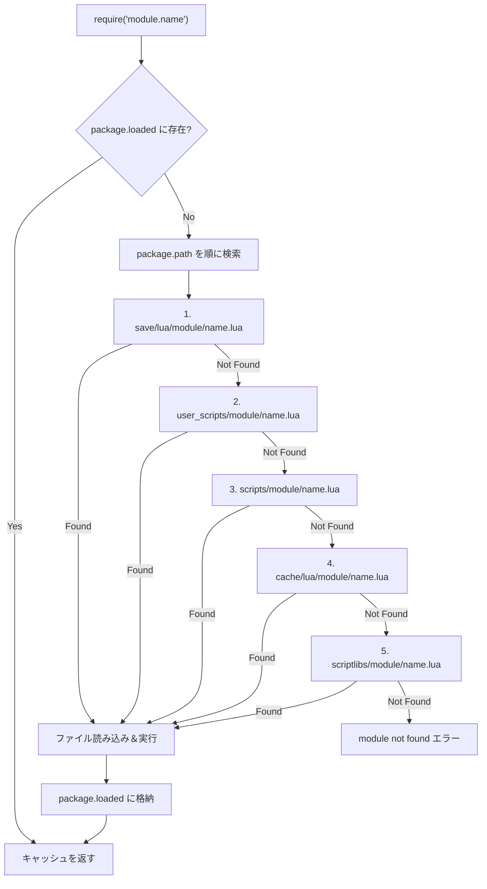

# Technical Design: lua-module-path-resolution

## Overview

### Summary
本設計は、pasta Luaランタイムにおけるモジュールパス解決機構をLua標準の`require()`ルールに完全準拠させる。ユーザースクリプトディレクトリ（`user_scripts`）の追加と、すべてのモジュール読み込みをrequireベースに統一することで、検索パス優先順位による上書き可能領域を極限まで広げる。

### Goals
- Lua標準`require()`に統一したモジュール解決
- `user_scripts`ディレクトリによるユーザーカスタマイズ領域の提供
- main.lua → entry.lua → scene_dic.luaの初期化順序による辞書登録の実現

### Non-Goals
- 既存のRust側モジュール登録方式（@pasta_config等）の変更
- pasta DSLトランスパイラーの変更
- パフォーマンス最適化（現状維持）

### Design Principle
**Lua検索パス優先順位による上書き可能領域を極限まで広げる。例外は設けない。ユーザーが上書きした場合の挙動はユーザー責任とする。**

---

## Architecture

### System Context



### Package.path 検索順序

```
1. profile/pasta/save/lua/?.lua       -- ユーザー保存スクリプト（最高優先）
2. profile/pasta/save/lua/?/init.lua
3. user_scripts/?.lua                  -- ユーザー作成スクリプト（NEW）
4. user_scripts/?/init.lua             -- (NEW)
5. scripts/?.lua                       -- pasta標準ランタイム
6. scripts/?/init.lua
7. profile/pasta/cache/lua/?.lua      -- トランスパイル済みキャッシュ
8. profile/pasta/cache/lua/?/init.lua
9. scriptlibs/?.lua                    -- 追加ライブラリ
10. scriptlibs/?/init.lua
```

---

## Components

### Component 1: LoaderConfig 検索パス拡張

**Purpose:** デフォルトLua検索パスに`user_scripts`を追加

**Location:** `crates/pasta_lua/src/loader/config.rs`

**Changes:**

```rust
// Before (L166-172)
fn default_lua_search_paths() -> Vec<String> {
    vec![
        "profile/pasta/save/lua".to_string(),
        "scripts".to_string(),
        "profile/pasta/cache/lua".to_string(),
        "scriptlibs".to_string(),
    ]
}

// After
fn default_lua_search_paths() -> Vec<String> {
    vec![
        "profile/pasta/save/lua".to_string(),
        "user_scripts".to_string(),  // NEW: ユーザー作成スクリプト
        "scripts".to_string(),
        "profile/pasta/cache/lua".to_string(),
        "scriptlibs".to_string(),
    ]
}
```

**Rationale:** 検索パス優先順位により、`user_scripts`に同名モジュールを配置するとpastaランタイムを上書きできる。

---

### Component 2: requireヘルパー関数

**Purpose:** Rust側から安全にLuaの`require()`を呼び出す

**Location:** `crates/pasta_lua/src/runtime/mod.rs`

**Interface:**

```rust
/// Lua require() を実行するヘルパー関数
/// 
/// Luaのpackage.pathに従ってモジュールを検索・読み込む。
/// 
/// # Arguments
/// * `lua` - Lua VMインスタンス
/// * `module_name` - 読み込むモジュール名（例: "main", "pasta.shiori.entry"）
/// 
/// # Returns
/// * `Ok(Value)` - require()の戻り値（通常はモジュールテーブル）
/// * `Err(LuaError)` - モジュールが見つからない、または読み込みエラー
/// 
/// # Example
/// ```rust,ignore
/// let result = lua_require(&lua, "main")?;
/// let result = lua_require(&lua, "pasta.shiori.entry")?;
/// ```
fn lua_require(lua: &Lua, module_name: &str) -> LuaResult<Value> {
    let require: Function = lua.globals().get("require")?;
    require.call(module_name)
}
```

**Design Decision:** 
- `lua.load(&format!("require('{}')"))` ではなく `globals().get("require")` 方式を採用
- 理由: より直接的でエラーハンドリングが明確、モジュール名のエスケープ不要

---

### Component 3: 初期化シーケンス再構成

**Purpose:** main.lua → entry.lua → scene_dic.lua の順序でrequireベースに統一

**Location:** `crates/pasta_lua/src/runtime/mod.rs` - `from_loader_with_scene_dic()`

**Before:**
```
from_loader_with_scene_dic()
├── Setup package.path
├── Register modules (@pasta_config, @enc, @pasta_persistence, @pasta_sakura_script)
├── Load entry.lua (直接ファイル読み込み)  ← 問題
├── Register finalize_scene
└── Load scene_dic.lua (直接ファイル読み込み)  ← 問題
```

**After:**
```
from_loader_with_scene_dic()
├── Setup package.path
├── Register modules (@pasta_config, @enc, @pasta_persistence, @pasta_sakura_script)
├── Register finalize_scene
├── require("main")           ← NEW (順序変更)
├── require("pasta.shiori.entry")  ← require化
└── require("pasta.scene_dic")     ← require化
```

**Sequence Diagram:**



---

### Component 4: scene_dic.lua生成場所の変更

**Purpose:** scene_dic.luaをrequireで解決可能な場所に生成

**Location:** `crates/pasta_lua/src/loader/cache.rs`

**Current:** `profile/pasta/cache/lua/scene_dic.lua`

**After:** `profile/pasta/cache/lua/pasta/scene_dic.lua`

**Rationale:** 
- `require("pasta.scene_dic")` は `pasta/scene_dic.lua` または `pasta/scene_dic/init.lua` を検索
- キャッシュディレクトリは検索パスに含まれているため解決可能

**Changes:**

```rust
// CacheManager::generate_scene_dic()
// Before: cache_dir/scene_dic.lua
// After:  cache_dir/pasta/scene_dic.lua

pub fn generate_scene_dic(&self, module_names: &[String]) -> Result<PathBuf, LoaderError> {
    // Create pasta subdirectory in cache
    let pasta_dir = self.cache_dir.join("pasta");
    fs::create_dir_all(&pasta_dir)?;
    
    // Clean up old scene_dic.lua location (backward compatibility)
    let old_scene_dic_path = self.cache_dir.join("scene_dic.lua");
    if old_scene_dic_path.exists() {
        if let Err(e) = fs::remove_file(&old_scene_dic_path) {
            tracing::warn!(
                path = %old_scene_dic_path.display(),
                error = %e,
                "Failed to remove old scene_dic.lua, continuing"
            );
        } else {
            tracing::debug!(path = %old_scene_dic_path.display(), "Removed old scene_dic.lua");
        }
    }
    
    let scene_dic_path = pasta_dir.join("scene_dic.lua");
    // ... generate content ...
    Ok(scene_dic_path)
}
```

**Backward Compatibility Note:** 
旧パス（`cache_dir/scene_dic.lua`）が存在する場合は削除する。削除に失敗してもエラーとせず警告ログのみ出力し、処理を継続する。これにより既存ゴーストの更新時に旧ファイルが残留することを防ぐ。

---

### Component 5: デフォルトmain.lua

**Purpose:** ユーザーがmain.luaを作成しなくても動作するフォールバック

**Location:** `crates/pasta_lua/scripts/main.lua` (新規作成)

**Content:**

```lua
--- @module main
--- pasta ゴースト メインエントリーポイント
---
--- このファイルはゴースト初期化時に最初に実行されます。
--- scene_dic のファイナライズより先に実行されるため、
--- ユーザー定義の辞書登録や初期設定をここで行えます。
---
--- カスタマイズするには、user_scripts/main.lua を作成してください。
--- user_scripts/ は scripts/ より優先されます。
---
--- 使用例:
--- ```lua
--- -- user_scripts/main.lua
--- 
--- -- ユーザー定義のアクター辞書を登録
--- local WORD = require("pasta.word")
--- WORD.register_actor_dictionary("俺", {
---     一人称 = {"俺", "おれ", "オレ"},
---     二人称 = {"お前", "君"},
--- })
---
--- -- カスタム初期化処理
--- print("ゴースト初期化完了")
--- ```

-- デフォルト実装: 何もしない
return {}
```

---

### Component 6: pasta.toml.template 更新

**Purpose:** サンプルゴーストに新しい検索パス設定を反映

**Location:** `crates/pasta_sample_ghost/templates/pasta.toml.template`

**Changes:**

```toml
[loader]
# pasta DSL ファイルパターン
pasta_patterns = ["dic/*.pasta"]
# Lua モジュール検索パス（優先順位順）
lua_search_paths = [
    "profile/pasta/save/lua",   # ユーザー保存スクリプト
    "user_scripts",              # ユーザー作成スクリプト（NEW）
    "scripts",                   # pasta 標準ランタイム
    "profile/pasta/cache/lua",   # トランスパイル済みキャッシュ
    "scriptlibs",                # 追加ライブラリ
]
```

---

## Data Design

### Module Resolution Flow



---

## Error Handling

### Error Strategy

requireヘルパー関数のエラーは、Luaの標準エラーメッセージをそのまま伝播させる。追加のラッピングは行わない。

### Error Categories and Responses

| エラー種別       | 発生条件                          | 対応                    |
| ---------------- | --------------------------------- | ----------------------- |
| Module not found | require対象が検索パスに存在しない | Luaエラーをそのまま伝播 |
| Syntax error     | Luaファイルに文法エラー           | Luaエラーをそのまま伝播 |
| Runtime error    | Luaファイル実行中のエラー         | Luaエラーをそのまま伝播 |

### Logging

```rust
// 成功時
tracing::debug!(module = %module_name, "Loaded module via require");

// 失敗時（Luaエラーとして伝播するため追加ログ不要）
```

---

## Testing Strategy

### Unit Tests

| テスト項目                                         | 場所             | 内容                         |
| -------------------------------------------------- | ---------------- | ---------------------------- |
| `default_lua_search_paths`にuser_scriptsが含まれる | `config.rs`      | 検索パス配列の検証           |
| `lua_require`正常系                                | `runtime/mod.rs` | 存在するモジュールの読み込み |
| `lua_require`異常系                                | `runtime/mod.rs` | 存在しないモジュールのエラー |
| 検索パス優先順位                                   | `context.rs`     | package.path文字列の検証     |

### Integration Tests

| テスト項目               | 場所                         | 内容                                                  |
| ------------------------ | ---------------------------- | ----------------------------------------------------- |
| user_scriptsによる上書き | `loader_integration_test.rs` | user_scripts/main.luaがscripts/main.luaより優先される |
| 初期化順序検証           | `loader_integration_test.rs` | main.lua内でscene_dic前の状態を検証                   |
| デフォルトmain.lua動作   | `loader_integration_test.rs` | user_scriptsなしでもエラーなく起動                    |
| scene_dic require化      | `finalize_scene_test.rs`     | pasta.scene_dicがrequireで解決される                  |

### E2E Tests

| テスト項目             | 場所                        | 内容                            |
| ---------------------- | --------------------------- | ------------------------------- |
| pasta_sample_ghost生成 | `pasta_sample_ghost/tests/` | setup.bat後のゴーストが正常動作 |
| 後方互換性             | 既存E2Eテスト               | 変更前のゴーストが引き続き動作  |

---

## Migration Strategy

### Phase 1: Core Changes (破壊的変更なし)

1. `default_lua_search_paths()`に`user_scripts`追加
2. `lua_require()`ヘルパー関数追加
3. `scripts/main.lua`新規作成

### Phase 2: Initialization Sequence (内部変更)

1. `from_loader_with_scene_dic()`の初期化順序変更
2. entry.luaのrequire化
3. scene_dic.luaのrequire化（生成場所変更含む）
   - 旧パス（`cache_dir/scene_dic.lua`）の削除処理を含む

### Phase 3: Sample Ghost Update

1. `pasta.toml.template`更新
2. 統合テスト更新

### Rollback Triggers

- 既存テストの失敗
- 後方互換性の破綻

### Validation Checkpoints

- [ ] 全ユニットテストがパス
- [ ] 全統合テストがパス
- [ ] pasta_sample_ghostが正常生成
- [ ] 既存ゴーストが変更なしで動作

---

## Security Considerations

### User Override Responsibility

**設計原則により、ユーザーが上書きした場合の挙動はユーザー責任とする。**

- `user_scripts/pasta/init.lua`を作成するとpastaコアモジュールを完全に置き換え可能
- `user_scripts/pasta/shiori/entry.lua`を作成するとSHIORI処理を完全に置き換え可能
- これは意図した動作であり、警告は出さない

---

## Supporting References

### Lua require() 仕様

- [Lua 5.4 Reference Manual - require](https://www.lua.org/manual/5.4/manual.html#pdf-require)
- package.pathのパターン: `?.lua` および `?/init.lua`

### 関連ファイル

| ファイル                                                                                                           | 変更種別 |
| ------------------------------------------------------------------------------------------------------------------ | -------- |
| [crates/pasta_lua/src/loader/config.rs](crates/pasta_lua/src/loader/config.rs)                                     | 修正     |
| [crates/pasta_lua/src/loader/cache.rs](crates/pasta_lua/src/loader/cache.rs)                                       | 修正     |
| [crates/pasta_lua/src/runtime/mod.rs](crates/pasta_lua/src/runtime/mod.rs)                                         | 修正     |
| [crates/pasta_lua/scripts/main.lua](crates/pasta_lua/scripts/main.lua)                                             | 新規     |
| [crates/pasta_sample_ghost/templates/pasta.toml.template](crates/pasta_sample_ghost/templates/pasta.toml.template) | 修正     |
