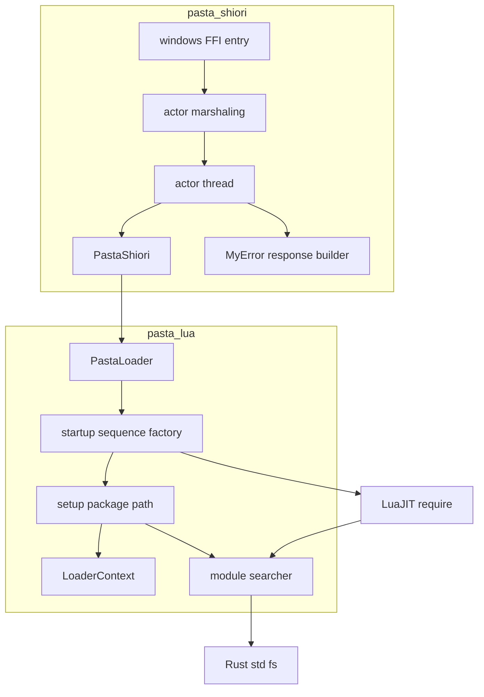
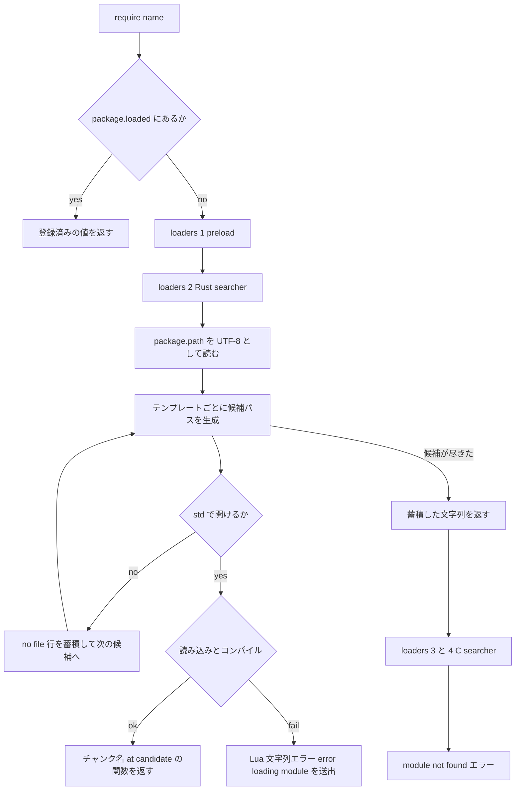

# Design Document: lua-require-robustness

## Overview

**Purpose**: 深いフォルダ（絶対パス 260 文字超）や ANSI コードページ外の文字を含むフォルダへ設置されたゴーストが「何も喋らず・何のエラーも出さない」状態になる問題を根治する。対象は独立した 2 つの欠陥である。欠陥 A は Lua のモジュール検索が narrow（ANSI）な `fopen` に依存していること、欠陥 B は起動モジュールのロード失敗が警告止まりで、さらにアクターランタイム移行後はリクエスト処理のエラーが一律 204 に読み替えられていることである。

**Users**: ゴースト利用者（設置場所を選ばずに動くこと、起動失敗が黙殺されないこと）、ゴースト作者（起動時の致命／継続の区別、切り分け手順）、保守者（長パス・非 ANSI・ロード失敗の回帰検出、x86 実行検証）。

**Impact**: (1) LuaJIT 標準の Lua ファイル searcher（`package.loaders[2]`）を、同一アルゴリズム・同一書式で Rust std（wide API）によりファイルを開く searcher へ**置換**する。(2) `package.path` を ANSI バイト列ではなく UTF-8 で設定する。(3) 起動モジュール `main` / `pasta.shiori.entry` のロード失敗を致命として伝搬する。(4) アクタースレッドがリクエスト処理エラーを reply drop（→204）ではなく 500 + `X-ERROR-REASON` 応答として返す。(5) `X-ERROR-REASON` を単一行化する。(6) 設置パスを UTF-8 で受け取る DLL 初期化入口 `loadu` を追加する。通常パス（短い・ASCII）で全モジュールが正常ロードされる場合の外部挙動はバイト不変である。

### Goals

- 設置パスの長さ・文字種に依存せず `require` が成功する（1.x / 2.x）。独自のパス長上限を設けない（1.6）。
- ASCII パスではチャンク識別子・`require` のエラー文言が変更前とバイト単位で同一（3.4）。優先順位・試行パターン・順序は不変（3.1〜3.3）。
- 起動モジュールのロード失敗、およびロード成功後のリクエスト処理エラーが、`load` 戻り値・500 + 単一行 `X-ERROR-REASON`・ログの 3 経路で可視化される（4.x / 5.x）。
- 長パス・非 ANSI パス・ロード失敗の各検証が常時実行テストとして CI（x86 / x64 の両ターゲット実行）で回る（6.x / 7.x）。

### Non-Goals

- ゴースト作者コードが直接呼ぶ `io.open` / `loadfile` / `dofile` / `package.searchpath` の長パス・非 ANSI 対応（既知の制限として `book/` に明記するのみ）。
- C モジュール searcher（`package.cpath`・`package.loaders[3]` / `[4]`）の変更。
- 自己展開先の配置変更、新しいエラー提示 UI、配布ホスト側のインストールパス短縮。
- `loadu` を呼ばないホスト（SSP 2.6.92 未満等）での非 ANSI 設置パス対応。ホストが ANSI でしかパスを渡せないため原理的に解消できない（既知の制限として `book/` に明記する）。

## Boundary Commitments

### This Spec Owns

- pasta_lua ランタイムにおける **Lua ファイルモジュールの解決**（候補パス生成・ファイル読み込み・チャンク命名・未検出／ロード失敗メッセージ）。
- `package.path` の**設定内容とエンコーディング契約**（UTF-8 文字列）。
- 起動シーケンス（`from_loader_with_scene_dic` / `from_loader`）における各モジュールの**致命／継続の分類**と、その失敗ログの構造。
- アクタースレッドの GET 処理における **「リクエスト処理が `Err` を返した場合の応答」**（500 応答文字列を reply する契約）。
- `MyError` から生成するエラー応答（500 / 400）の **`X-ERROR-REASON` 単一行保証**。
- SHIORI DLL の初期化入口 **`loadu`（UTF-8 パス）**と、「`loadu` で初期化済みなら後続の `load` を無視する」契約。
- 上記を実証するテスト基盤（長パス／非 ANSI の一時ゴースト構築ヘルパ）、CI の x86 テスト実行、`book/` の起動シーケンス・既知の制限・切り分け手順の記述。

### Out of Boundary

- `X-ERROR-REASON` のヘッダ名・500 応答の行構成・ログ初期化順序（`load-error-logging` が所有。本仕様は値の改行除去のみ行う）。
- アクターランタイムの安全網（reply drop・タイムアウト・アクター不在・panic → 204）と NOTIFY の即時 204（`pasta-actor-runtime` が所有。無変更）。
- FFI 境界（`windows.rs`）の `request` 入力デコード失敗時の 204（無変更）、および従来の `load` の ANSI デコード（無変更）。
- ソースマップ生成・ブレークポイント照合・DAP の仕様（チャンク識別子の構成規則を保つことで非干渉）。
- スクリプト自己展開（`pasta-scripts-self-deploy`）。展開済みファイルの実在を前提とする。
- `package.cpath` 由来の候補行（ホスト exe パス由来）の表記。

### Allowed Dependencies

- `mlua 0.11`（`luajit52` / `vendored`）の公開 API のみ。LuaJIT 内部や `mlua-sys` の FFI を直接呼ばない。
- Rust `std::fs` / `std::path`（長パスは std 内部の verbatim 自動付与に依存する。後述「Technology Stack」）。
- 既存の `LoaderContext::generate_package_path()`（検索パステンプレートの唯一の生成元）。
- 既存の Err 配管: `mlua::Error` → `LoaderError::Runtime` → `MyError::Load` → `PastaShiori::last_load_error`。
- 新規クレート依存は追加しない。Windows API の直接呼び出しも追加しない。
- 依存方向: `loader`（config / context）→ `runtime`（searcher / module_registry / factory）→ `pasta_shiori`（shiori → actor → windows）。`runtime::searcher` は `loader` に依存しない（入力は Lua VM 上の `package.path` のみ）。

### Revalidation Triggers

- `package.path` のエンコーディング契約（UTF-8）または `generate_package_path()` のテンプレート形式の変更 → チャンク識別子に依存する `pasta-source-map` / デバッガの再検証。
- `package.loaders[2]` の置換方針の変更（前置へ戻す等）→ エラーメッセージ書式・3.4 のバイト同一性の再検証。
- アクタースレッドの `Err` 時応答契約の変更 → `pasta-actor-runtime` の R5.x テスト群と本仕様の可視化テストの再検証。
- 起動モジュールの追加・順序変更・致命分類の変更 → `book/` の起動シーケンス表と本仕様のテストの更新。
- ホスト側の `loadu` / `load` 呼び出し規約（DLL 共通仕様）の変更 → ShioriLoadEntry の「`loadu` 済みなら `load` を無視」契約の再検証。
- mlua / LuaJIT のメジャー更新 → `package.loaders` のレイアウト（4 要素・2 番目が Lua ファイル searcher）と `require` のエラー集約書式の再実測。

## Architecture

### Existing Architecture Analysis

- **モジュール解決**: `setup_package_path`（`runtime/module_registry.rs`）が `LoaderContext::generate_package_path_bytes()`（ANSI 変換済み）を `package.path` に設定し、実際の探索とファイルオープンは LuaJIT 標準 searcher（`lib_package.c` の `searchpath` → `fopen`）が行う。narrow `fopen` は MAX_PATH=260 と ANSI コードページの両方に縛られる。ANSI 変換は変換不能文字で `InvalidInput` を返し、非 ANSI パスではロード全体が失敗する。
- **Rust 製モジュール**（`@pasta_config` 等）は `package.loaded` へ直接登録され、`require` は searcher より先に `package.loaded` を見るため、searcher の差し替えとは干渉しない。`package.loaders` / `package.searchers` / `package.preload` を触る本番コードは存在しない。
- **起動シーケンス**（`runtime/factory.rs`）: `require("main")`・`require("pasta.shiori.entry")` は warn で継続、`require("pasta.scene_dic")` のみ `?` 伝搬。旧経路 `from_loader` は `scripts/pasta/shiori/entry.lua` を直接読み、読み取り・実行の失敗を warn で継続する。
- **応答経路**: `PastaShiori::request` は load 失敗状態で `MyError::Load(msg)` を返すが、アクタースレッド（`actor/thread.rs`）は `Err` で reply を drop し、`marshaling.rs` が `Disconnected` を 204 に読み替える。`MyError::to_shiori_response()` の本番呼び出し元はゼロである。
- **チャンク識別子**: 標準 `require` が付ける `@<テンプレートの ? へモジュール名を代入した文字列>`。Windows ではテンプレート前置部が `/`、モジュール名展開部が `\` の混在形になる。ソースマップ・ブレークポイントは `canonicalize_chunk_name` で正規化してから照合する。

### 設計フェーズの実測結果（設計判断の根拠）

| # | 実測内容 | 結果 | 設計への帰結 |
|---|----------|------|--------------|
| M1 | LuaJIT 2.1（mlua 0.11.6 `luajit52`）の searcher テーブル | `package.loaders` と `package.searchers` は**同一テーブル**（`rawequal` = true）。要素数 4（preload / Lua / C / C-root）。`require` は `package.loaders` フィールドを参照する | テーブルを**インプレースで**書き換える（`package.loaders[2]` への代入）。両名称から同じ結果が見える |
| M2 | 260 超・非 verbatim パスに対する `std::fs`（longPathAware マニフェスト無しのプロセス） | `create_dir_all` / `write` / `File::open` / `remove_dir_all` すべて成功（332〜345 文字・区切り混在形 `C:/…/pasta\x.lua` でも成功）。同一プロセス・同一パスで LuaJIT 標準 `require` は失敗（欠陥 A を再現）。std は `get_long_path` により 248 文字以上の絶対パスへ `\\?\`（UNC は `\\?\UNC\`）を**内部で**自動付与する | **verbatim プレフィックスの明示付与は不要**。読み込み用パスと命名用パスを分離する必要がなく、3.7 は構造的に満たされる |
| M3 | ASCII 短パスでの標準 searcher と Rust searcher のチャンク識別子 | `debug.getinfo(1,'S').source` / `short_src`、チャンクへの引数（モジュール名 1 個）が**バイト単位で一致**（`?.lua`・`?/init.lua` の両パターン） | 同じテンプレート文字列へ同じ代入を行えば 3.4 を満たす |
| M4 | `require` のエラー集約 | searcher が返した**文字列**は順に連結され `module 'X' not found:<連結>` になる。標準を後段に残して Rust searcher を前置すると `no file` 行が**二重**に出る。置換すると標準のみの場合と**バイト単位で同一**。ロード失敗（構文エラー等）を Rust の `Err` で返すと `pcall(require, …)` が受け取る値が**文字列から userdata に変わる**。Lua 側で `error(msg, 0)` を送出する薄いシムを挟むと、未検出・構文エラー・実行時エラーの 3 種とも型・文言がバイト単位で同一 | **置換**を採用。ロード失敗は Lua 文字列エラーとして送出する |
| M5 | 長パスツリーの後始末 | 非 verbatim パスでの `std::fs::remove_dir_all` が成功（`tempfile::TempDir` の drop と同経路） | テストは `TempDir` 配下に深いネストを掘る方式でよい |
| M6 | 非 ASCII・ANSI 表現可能パス（CP932 環境の日本語フォルダ）での**現行**チャンク識別子 | ANSI バイト列（不正な UTF-8）。ソースマップ側キー（UTF-8）と**一致しない**。一方 Rust searcher（UTF-8 の `package.path`）では `@` + UTF-8 パスと一致 | 3.8 の基準は「UTF-8・ASCII と同じ構成規則」とする。現行の非 ASCII パス上の識別子は既に不整合であり、本設計で解消される |
| M7 | x86（i686）ビルドでの M1〜M6 | x64 と同一結果 | 7.1 はアーキテクチャ非依存の機構（std と LuaJIT `lib_package`）で満たされる |

詳細な実測ログと手順は `research.md`「設計フェーズの実測」を参照。

### Architecture Pattern & Boundary Map



**Architecture Integration**:

- **Selected pattern**: 標準 searcher の**同型置換**。LuaJIT の `searchpath` + `loader_lua` と同じアルゴリズム・同じ文言を Rust で再実装し、差分を「ファイルを開く API」と「パスの文字コード」の 2 点だけに限定する。設定の単一情報源は従来どおり `package.path` とし、searcher はそれを require 時に読む。
- **Domain boundaries**: 解決（searcher）／設定（module_registry）／起動分類（factory）／応答（pasta_shiori）を分離。searcher は `LoaderContext` を知らず、VM 上の `package.path` だけを入力とする。
- **Existing patterns preserved**: `package.loaded` 直接登録方式、`std::path::absolute` による base 絶対化（`canonicalize` 不使用）、`canonicalize_chunk_name` による照合、Err 配管（`LoaderError::Runtime` → `MyError::Load`）、アクターの「必ず文字列を返す」契約（500 も文字列）。
- **New components rationale**: `searcher.rs` のみ新設。パス解決＋読み込み＋命名は `module_registry.rs`（モジュール登録）とは別責務であり、FS 無しで候補生成を単体検証できる形に切り出す。
- **Steering compliance**: 新規依存なし・Windows API 直叩きなし・ファイル 600 行未満方針に整合。

### 主要な設計判断

1. **標準 Lua ファイル searcher は「前置」ではなく「置換」する**（`research.md` の申し送り「標準 searcher フォールバックの去就」への回答。設計ディスカッション #2 で確定。brief の「前置して残す」は実測 M4 により覆した）。
   - 前置＋残置は、未検出時の `no file` 行が二重になり（M4）、非 ASCII パスでは後段の標準 searcher が UTF-8 の `package.path` を ANSI として解釈して無意味な候補を出す。Rust searcher が開けないファイルを narrow `fopen` が開ける場面は存在しないため、フォールバックとしての価値が無い。
   - 置換なら未検出メッセージは変更前とバイト同一（M4）で、解決経路が 1 本に収束する。preload・C searcher は無変更で残る。
2. **`package.path` は UTF-8 で設定し、searcher は require のたびに `package.path` を読む**。
   - `generate_package_path()`（区切り `/`）の文字列をそのまま設定する。ASCII パスでは変更前とバイト同一。ANSI 変換（`generate_package_path_bytes`）は撤去し、非 ANSI パスで `setup_package_path` がロードを落とす経路を消す（2.1 の必須条件）。
   - `LoaderContext` を searcher にキャプチャする案は採らない。`package.path` を実行時に追記する Lua 標準の流儀（スクリプトライブラリや作者コード）を保てるうえ、状態を持たないため `from_loader` / `from_loader_with_scene_dic` の両経路へ同一に効く。
3. **verbatim プレフィックスを扱わない**（M2）。std が内部で付与し、外へは出さない。チャンク識別子・ログ・エラー文言に `\\?\` が現れる経路が構造的に存在しない（3.7）。
4. **ロード失敗は Lua 文字列エラーとして送出する**（M4）。`pcall(require, …)` で文字列を受け取る既存の Lua コードの前提を崩さない。
5. **起動モジュール 3 種はすべて致命**。`main` は意図的な挙動変更（5.2）。共通ヘルパ 1 個で「ログ（モジュール名・`fatal`）＋文脈付き `Err`」を行い、分類の表現を 1 箇所に集約する。
6. **旧経路 `from_loader` は撤去せず是正する**。`entry.lua` の読み取り失敗・実行失敗を `?` 伝搬へ変える。撤去すると `setup_package_path` + `@pasta_config` + `@enc` だけの軽量ランタイムを必要とする既存テスト 9 箇所に代替コンストラクタを新設することになり、差分が増えるだけである。**仮定**: `from_loader` における `entry.lua` の**不在**は従来どおりスキップ（失敗ではない）とする（Open Questions 4）。
7. **500 応答の復旧はアクタースレッドの `Err` 分岐 1 箇所**。`Reply::Value(e.to_shiori_response())` を送る。`marshaling.rs` は無変更で、drop／Timeout／try_send 失敗／panic → 204 の安全網はそのまま残る（4.10）。
8. **`loadu` を追加し、非 ANSI 設置パスを DLL 境界から通す**。従来の `load` は ANSI でパスを受けるため、ANSI 外の文字はホスト側で欠落してランタイムへ届かない。DLL 共通仕様の `loadu`（UTF-8・SSP 2.6.92 以降・`load` より優先）を `windows.rs` に追加する。既存の `ShioriString::to_utf8_str` と `lifecycle::spawn_actor` を使うだけで、`load` との差はデコード方式のみである。仕様の推奨どおり「`loadu` で初期化済みなら後続の `load` は無視して TRUE」を守る。

### Technology Stack

| Layer | Choice / Version | Role in Feature | Notes |
|-------|------------------|-----------------|-------|
| Lua VM | mlua 0.11.6（`luajit52`, `vendored`）/ LuaJIT 2.1 | `package.loaders` への searcher 設置、チャンクのコンパイルと命名 | `Lua::unsafe_new_with` で生成済みのためバイトコードチャンクも従来どおりロード可能。shebang / BOM の扱いは LuaJIT のレキサ側にあり `lua.load` でも標準と同一（実測済み） |
| File I/O | Rust std（`std::fs::File` / `read`） | 候補ファイルのオープンと読み込み | wide API。248 文字以上の絶対パスへ verbatim を内部付与（実測 M2・std `sys/path/windows.rs` `get_long_path`）。新規 Windows API 呼び出しなし |
| SHIORI 応答 | 既存 `MyError`（thiserror） | 500 / 400 応答の単一行化 | 新規依存なし |
| CI | GitHub Actions `windows-latest` | x86 / x64 の両ターゲットでテスト実行 | `cargo test --all --target ${{ matrix.target }}` |
| Docs | mdBook（`book/`） | 起動シーケンス・既知の制限・切り分け手順 | 新規 1 ページ |

## File Structure Plan

### Directory Structure

```
crates/pasta_lua/
├── src/runtime/
│   ├── searcher.rs                  # 新規: Lua ファイル searcher（候補生成・読み込み・命名・設置）
│   ├── module_registry.rs           # 変更: setup_package_path を UTF-8 設定＋searcher 設置へ
│   ├── factory.rs                   # 変更: 起動モジュールの致命化・from_loader の是正
│   └── mod.rs                       # 変更: mod searcher と install_module_searcher の再公開
├── src/loader/context.rs            # 変更: generate_package_path_bytes と関連テストを撤去
└── tests/
    ├── common/mod.rs                # 変更: 長パス／非 ANSI の一時ゴースト構築ヘルパを追加
    ├── runtime/module_searcher_test.rs   # 新規: searcher の契約テスト（標準とのバイト同一・優先順位・文言）
    ├── runtime/main.rs              # 変更: mod 登録
    ├── runtime/encoding_test.rs     # 変更: ANSI 前提の package.path テストを UTF-8 契約へ更新
    ├── runtime/runtime_api_test.rs  # 変更: from_loader の entry 失敗テストを Err 期待へ反転
    ├── loader/path_robustness_test.rs    # 新規: 長パス／非 ANSI／両方でのロード完走と 3 層解決
    ├── loader/startup_fatal_test.rs      # 新規: main / entry / scene_dic の致命化とエラー文脈
    ├── loader/main.rs               # 変更: mod 登録
    └── chunk_name_validation_test.rs     # 変更: 本番 searcher を設置して実測。非 ASCII パスのケースを追加
crates/pasta_shiori/
├── src/actor/thread.rs              # 変更: GET の Err 分岐で 500 応答を reply
├── src/error.rs                     # 変更: X-ERROR-REASON の単一行化
├── src/actor/marshaling.rs          # コメントのみ: 「VM 失敗で reply drop」の記述を新契約へ（コード無変更）
├── src/windows.rs                   # 変更: loadu 入口を追加・loadu 済みの load を無視（request / unload の既存ロジックは無変更）
└── tests/
    ├── common/mod.rs                # 変更: 長パス／非 ANSI の一時ゴースト構築ヘルパを追加（pasta_lua 側と同等）
    ├── load_failure_visibility_test.rs   # 新規: アクター境界を通した 500 + 単一行 X-ERROR-REASON
    ├── path_robustness_e2e_test.rs       # 新規: 長パス＋非 ANSI 設置での load と応答バイト一致
    └── ffi_loadu_test.rs                 # 新規: FFI の loadu → request → unload（非 ANSI 設置パス）と loadu 後の load 無視
.github/workflows/build.yml          # 変更: テストを matrix.target で実行
book/src/
├── reference/startup.md             # 新規: 検索パス・起動シーケンスと致命分類・既知の制限・切り分け手順
├── SUMMARY.md                       # 変更: リファレンス節へ追加
└── debug/troubleshooting.md         # 変更: 起動失敗の切り分けは reference/startup.md へ誘導
crates/pasta_lua/README.md           # 変更: 「Lua モジュール検索パス」節を UTF-8 契約・起動失敗の扱いに合わせて更新
```

### Modified Files（補足）

- `crates/pasta_lua/src/runtime/module_registry.rs` — `setup_package_path` は (1) `generate_package_path()` の UTF-8 文字列を `package.path` に設定、(2) `searcher::install_module_searcher` を呼ぶ。呼び出し元 2 箇所（`from_loader` / `from_loader_with_scene_dic`）は無変更。ドキュメントコメントの ANSI 記述を更新。
- `crates/pasta_lua/src/loader/context.rs` — `generate_package_path_bytes` と、それだけを検証するテスト 3 件（`test_generate_package_path_bytes_ascii` / `_not_empty` / `_japanese`）を撤去。`generate_package_path` とそのテストは無変更。`encoding::to_ansi_bytes` は公開モジュール `pasta_lua::encoding` の API であるため本仕様では残す（`generate_package_path_bytes` も公開メソッドだが、呼び出し元は `setup_package_path` のみで、残すと非 ANSI パスでロードを落とす経路の再混入口になるため撤去する）。
- `crates/pasta_lua/src/runtime/factory.rs` — 起動シーケンスのコメント（Initialization Sequence）を新分類へ更新。
- `crates/pasta_shiori/src/actor/thread.rs` — `Err` 分岐のコメント（「drop→204」）を新契約へ更新。`marshaling.rs` はコード無変更（モジュール冒頭コメントの「VM 失敗で reply drop」の記述のみ `thread.rs` 側の新契約に合わせて更新）。
- `crates/pasta_shiori/src/windows.rs` — `loadu` を追加し、`load` に「`loadu` 済みなら無視」の分岐を足す。`request` / `unload` の既存ロジックは無変更（`unload` は初期化済みフラグを下ろすのみ追加）。冒頭コメントの「VM 失敗で reply drop」も新契約へ更新する。

## System Flows

### モジュール解決フロー



- 候補の生成順は `package.path` の並び順そのもの（検索パス 5 本 × `?.lua` → `?/init.lua`）。最初に開けた候補で確定し、以降は試さない（3.1〜3.3）。
- コンパイル失敗時に後続候補へ進まないのは標準と同じ挙動である。

### ロード失敗の可視化フロー

```mermaid
sequenceDiagram
    participant Host as SHIORI host
    participant FFI as windows FFI
    participant Actor as actor thread
    participant Shiori as PastaShiori
    participant Factory as startup sequence
    Host->>FFI: loadu dir UTF-8 or load dir ANSI
    FFI->>Actor: spawn
    Actor->>Shiori: load
    Shiori->>Factory: from_loader_with_scene_dic
    Factory-->>Shiori: Err startup module failed
    Shiori->>Shiori: error log and last_load_error を保持
    Shiori-->>Actor: Ok false
    Actor-->>Host: load は false
    Host->>FFI: GET request
    FFI->>Actor: ActorMsg Get
    Actor->>Shiori: request
    Shiori-->>Actor: Err MyError Load
    Actor-->>FFI: Reply Value 500 with single line reason
    FFI-->>Host: 500 X-ERROR-REASON
    Host->>FFI: NOTIFY request
    FFI-->>Host: 204 即時
```

- ロード成功後に `SHIORI.request` が Lua エラーで終わった場合も同じ `Err` 分岐を通り、`MyError::Script` の 500 応答になる（4.4）。
- アクタースレッドの消滅・panic・タイムアウト・mailbox 不在は reply が送られないため、従来どおり `marshaling.rs` が 204 を返す（4.10）。

## Requirements Traceability

| Requirement | Summary | Components | Interfaces | Flows |
|-------------|---------|------------|------------|-------|
| 1.1 | 260 超パスで require 成功 | ModuleSearcher | `install_module_searcher` | モジュール解決 |
| 1.2 | 260 超で load が同一シーケンスを完走 | ModuleSearcher, StartupSequence | `PastaLoader::load` | 両フロー |
| 1.3 | 長パス設定が無効な環境でも成功 | ModuleSearcher（std の内部 verbatim） | — | モジュール解決 |
| 1.4 | 内蔵・利用者・シーンの 3 層とも同じ結果 | ModuleSearcher（`package.path` 全エントリを同一処理） | — | モジュール解決 |
| 1.5 | 未検出時は候補パスを含むエラー | ModuleSearcher | NotFound メッセージ契約 | モジュール解決 |
| 1.6 | 独自のパス長上限なし | ModuleSearcher（長さ判定を持たない） | — | — |
| 2.1 | 非 ANSI パスで require 成功 | PackagePathSetup, ModuleSearcher | `setup_package_path` | モジュール解決 |
| 2.2 | 長パス＋非 ANSI で成功 | 同上 | — | モジュール解決 |
| 2.3 | 失敗メッセージで非 ASCII を欠落させない | ModuleSearcher（UTF-8 のまま整形）, ErrorResponse | — | 可視化 |
| 2.4 | `loadu` で UTF-8 の設置パスを受け取りロード完了 | ShioriLoadEntry | `loadu` | 可視化 |
| 2.5 | `loadu` 済みの `load` は無視して成功 | ShioriLoadEntry | `load` | — |
| 2.6 | `loadu` を呼ばないホストでは従来どおり | ShioriLoadEntry（`load` の既存経路） | `load` | — |
| 3.1 | 検索パス優先順位の維持 | PackagePathSetup（`generate_package_path` 無変更） | — | モジュール解決 |
| 3.2 | `?.lua` → `?/init.lua` の順序維持 | 同上 | — | モジュール解決 |
| 3.3 | 優先順位の高いパスが勝つ | ModuleSearcher（先勝ち） | — | モジュール解決 |
| 3.4 | ASCII パスでチャンク識別子がバイト同一 | ModuleSearcher | チャンク命名契約 | — |
| 3.5 | 正常時の SHIORI 応答がバイト不変 | 全体（正常経路は無変更） | 既存 `byte_invariant_test` | — |
| 3.6 | デバッガ／ソースマップ無回帰 | ModuleSearcher | チャンク命名契約 | — |
| 3.7 | 拡張長プレフィックスを露出しない | ModuleSearcher（verbatim を扱わない） | — | — |
| 3.8 | 非 ASCII パスでも同じ構成規則・BP 解決可能 | ModuleSearcher, PackagePathSetup（UTF-8） | チャンク命名契約 | — |
| 4.1 | 応答モジュールのロード失敗を失敗として伝える | StartupSequence | `require_startup_module` | 可視化 |
| 4.2 | `load` 戻り値で失敗（現行維持） | 既存 `PastaShiori::load`（無変更） | — | 可視化 |
| 4.3 | 失敗状態の GET に 500 + `X-ERROR-REASON` | ActorErrorReply | `Reply::Value` | 可視化 |
| 4.4 | ロード成功後の処理エラーも 500 | ActorErrorReply | 同上 | 可視化 |
| 4.5 | 理由にモジュール名と根本原因を含む | StartupSequence（文脈付与） | エラー文脈契約 | 可視化 |
| 4.6 | `X-ERROR-REASON` は単一行 | ErrorResponse | `single_line` | 可視化 |
| 4.7 | ログには複数行を欠落なく記録 | StartupSequence, 既存 `PastaShiori::load` の error ログ | — | 可視化 |
| 4.8 | 失敗状態の GET に 204 を返さない | ActorErrorReply | — | 可視化 |
| 4.9 | 失敗原因の種類によらず同一経路 | ModuleSearcher（全原因を Lua エラー化）, StartupSequence | — | 可視化 |
| 4.10 | 204 安全網と NOTIFY 即時 204 の維持 | `marshaling.rs` 無変更 | — | 可視化 |
| 5.1 | `pasta.scene_dic` は致命（維持） | StartupSequence | — | — |
| 5.2 | `main` は致命（変更） | StartupSequence | — | — |
| 5.3 | モジュール名と致命／継続をログで判別可能 | StartupSequence | ログ構造契約 | — |
| 5.4 | マニュアルに順序と扱いを明示 | BookStartupPage | — | — |
| 5.5 | 致命失敗は 4.x と同一経路 | StartupSequence → 既存 Err 配管 | — | 可視化 |
| 5.6 | 旧経路にも同一分類・無言化を残さない | StartupSequence（`from_loader` 是正） | — | — |
| 6.1 | 長パスの自動テスト | PathRobustnessTests | — | — |
| 6.2 | 非 ANSI パスの自動テスト | PathRobustnessTests | — | — |
| 6.3 | アクター境界を通した 500 の検証 | LoadFailureVisibilityTests | — | — |
| 6.4 | `PASTA_DEBUG` 非依存 | 各新規テストファイルの `#[ctor]` ガード | — | — |
| 6.5 | `io.open` 等の制限をマニュアルに明示 | BookStartupPage | — | — |
| 6.6 | 常時実行（`#[ignore]` 不使用） | 全新規テスト | — | — |
| 6.7 | ロケール非依存の非 ANSI 文字構成 | TestPathHelpers | `NON_ANSI_DIR_NAME` | — |
| 6.8 | 切り分け手順をマニュアルに記載 | BookStartupPage | — | — |
| 6.9 | `loadu` 経由の非 ANSI 設置パスを検証 | FfiLoaduTests | — | — |
| 6.10 | `loadu` 非対応ホストの制限をマニュアルに明示 | BookStartupPage | — | — |
| 7.1 | x86 / x64 で同一結果 | ModuleSearcher（アーキ非依存）, CiWorkflow | — | — |
| 7.2 | 既存テスト全緑 | 全体 | — | — |
| 7.3 | CI が x86 テストを x86 ターゲットで実行 | CiWorkflow | — | — |

## Components and Interfaces

| Component | Domain/Layer | Intent | Req Coverage | Key Dependencies | Contracts |
|-----------|--------------|--------|--------------|------------------|-----------|
| ModuleSearcher | pasta_lua / runtime | Lua ファイルモジュールを Rust std で解決・読み込み・命名する | 1.1–1.6, 2.1–2.3, 3.3, 3.4, 3.6–3.8, 4.9, 7.1 | mlua (P0), std::fs (P0) | Service |
| PackagePathSetup | pasta_lua / runtime | `package.path` を UTF-8 で設定し searcher を設置する | 2.1, 3.1, 3.2, 3.8 | LoaderContext (P0), ModuleSearcher (P0) | Service |
| StartupSequence | pasta_lua / runtime | 起動モジュールの致命分類・失敗ログ・文脈付き Err | 4.1, 4.5, 4.7, 4.9, 5.1–5.3, 5.5, 5.6 | `lua_require` (P0) | Service |
| ActorErrorReply | pasta_shiori / actor | リクエスト処理の `Err` を 500 応答として reply する | 4.3, 4.4, 4.8, 4.10 | PastaShiori (P0), ErrorResponse (P0) | Service |
| ErrorResponse | pasta_shiori / error | `X-ERROR-REASON` を単一行で組み立てる | 2.3, 4.6 | — | Service |
| ShioriLoadEntry | pasta_shiori / windows FFI | 設置パスを UTF-8（`loadu`）または ANSI（`load`）で受け取りアクターを起動する | 2.4, 2.5, 2.6 | lifecycle (P0), ShioriString (P0) | API |
| TestPathHelpers | tests / common | 長パス・非 ANSI の一時ゴーストを構築する | 6.1, 6.2, 6.4, 6.7 | tempfile (P0) | — |
| PathRobustnessTests / LoadFailureVisibilityTests | tests | 要件の実証 | 1.x, 2.x, 3.x, 4.x, 5.x, 6.x | 上記全部 | — |
| CiWorkflow | infra | x86 / x64 の両ターゲットでテスト実行 | 7.1, 7.3, 6.6 | GitHub Actions | — |
| BookStartupPage | docs | 起動シーケンス・制限・切り分け手順 | 5.4, 6.5, 6.8 | mdBook | — |

### pasta_lua / runtime

#### ModuleSearcher

| Field | Detail |
|-------|--------|
| Intent | LuaJIT 標準の Lua ファイル searcher と同じ規則で候補を生成し、Rust std でファイルを開いてチャンクを返す |
| Requirements | 1.1, 1.2, 1.3, 1.4, 1.5, 1.6, 2.1, 2.2, 2.3, 3.3, 3.4, 3.6, 3.7, 3.8, 4.9, 7.1 |

**Responsibilities & Constraints**

- `package.loaders[2]`（= `package.searchers[2]`）を自身で**置換**する。1・3・4 番目は触らない。
- 入力は require 時点の `package.path`（UTF-8 として解釈）とモジュール名のみ。状態を持たない。
- パス長の判定・verbatim プレフィックスの付与・短縮名変換・`canonicalize` を**行わない**。
- 候補パス文字列は「テンプレートの `?` をすべて、モジュール名の `.` を OS の区切り文字（Windows は `\`）へ置換した文字列で置き換えたもの」。この文字列が**そのまま**ファイルを開くパス・チャンク識別子（`@` 前置）・エラーメッセージに使われる。

**Dependencies**

- Inbound: PackagePathSetup — 設置の呼び出し（P0）／ `chunk_name_validation_test.rs` — 本番同等の VM 構築（P1）
- External: mlua — `create_function` / `load().set_name().into_function()`（P0）、std::fs — ファイル読み込み（P0）

**Contracts**: Service [x]

##### Service Interface

```rust
// crates/pasta_lua/src/runtime/searcher.rs

/// `package.loaders[2]` を Rust 実装の Lua ファイル searcher へ置換する。
/// VM 構築時（他のどの Lua コードよりも前）に 1 回だけ呼ぶ。
/// `package.loaders` が想定レイアウト（4 要素）でなければ Err を返す。
pub fn install_module_searcher(lua: &mlua::Lua) -> mlua::Result<()>;

/// `package.path` とモジュール名から候補パスを順に生成する（純粋関数・FS 非依存）。
/// 空テンプレートはスキップする。戻り値の順序が探索順である。
fn candidate_paths(package_path: &str, module_name: &str) -> Vec<String>;

/// 探索の結果。
enum SearchOutcome {
    /// 最初に開けた候補。`candidate` は命名と読み込みに共通の文字列。
    Found { candidate: String, source: Vec<u8> },
    /// すべての候補が開けなかった。`message` は `"\n\tno file '<candidate>'"` の連結。
    NotFound { message: String },
    /// 開けたが読み込めなかった。
    Unreadable { candidate: String, cause: std::io::Error },
}

fn search(package_path: &str, module_name: &str) -> SearchOutcome;
```

- Preconditions: `package` ライブラリがロード済みで、VM 上でまだ Lua コードが実行されていないこと。`install_module_searcher` は `package.loaders` が 4 要素のテーブルであること（M1）を**設置時に検証**し、違反していれば `Err` を返す。この `Err` は `setup_package_path` から起動失敗として伝搬し、500 とログで可視化される（mlua / LuaJIT の更新でレイアウトが変わった場合に、黙って別の searcher を上書きしない）。設置後にスクリプトライブラリ（luacheck 等）が `table.insert(package.loaders, 1, …)` で searcher を前置しても、テーブルの要素として残るため動作に影響しない。`package.path` が文字列であること（そうでなければ標準と同じく `'package.path' must be a string` の Lua エラー）。
- Postconditions:
  - Found: `@<candidate>` をチャンク名としてコンパイルした関数を searcher の戻り値とする。`require` はこの関数をモジュール名 1 引数で呼ぶ（標準と同一・M3）。
  - NotFound: `message` を Lua 文字列として返す。`require` が他の searcher の文字列と連結して `module '<name>' not found:…` を送出する（M4 で標準とバイト同一を確認）。
  - コンパイル失敗／Unreadable: Lua **文字列**エラー `error loading module '<name>' from file '<candidate>':\n\t<cause>` を送出する。`<cause>` は構文エラーでは LuaJIT のメッセージ本文（mlua の `syntax error: ` 接頭辞を付けない）、読み込み失敗では `cannot read <candidate>: <io error>`。
- Invariants: 候補パス文字列・チャンク識別子・メッセージのいずれにも `\\?\` が現れない。非 ASCII 文字は UTF-8 のまま保持される。

**Implementation Notes**

- Integration: Rust 関数は `(loader)` または `(nil, message, is_load_error)` を返すだけにし、`is_load_error` のとき `error(message, 0)` を送出する数行の Lua ラッパを searcher 本体として設置する（M4: Rust の `Err` を直接返すと `pcall` が受ける値が userdata になるため）。ラッパのチャンク名は `=pasta_searcher` とする。
- Validation: `module_searcher_test.rs` で、同一 `package.path`・同一ファイル群に対する標準 searcher 版 VM と本 searcher 版 VM の結果（`source` / `short_src` / チャンク引数 / 未検出・構文エラー・実行時エラーの `pcall` 戻り値の型と文言）をバイト比較する。これが 3.4 の恒久ゲートになる。
- Risks: `package.path` に UTF-8 として不正なバイト列が含まれる場合（作者コードが ANSI バイト列を追記した等）は lossy 変換され、その候補は開けず `no file` 行に載る。挙動変更として `book/` に明記する（Open Questions 3）。

#### PackagePathSetup

| Field | Detail |
|-------|--------|
| Intent | `package.path` を UTF-8 で設定し、ModuleSearcher を設置する（既存 `setup_package_path` の改修） |
| Requirements | 2.1, 3.1, 3.2, 3.8 |

**Responsibilities & Constraints**

- `LoaderContext::generate_package_path()` の戻り値（区切り `/`・検索パスごとに `?.lua` → `?/init.lua`）を**無変換で** `package.path` に設定する。ASCII パスでは変更前とバイト同一である。
- `package.path` は従来どおり**上書き**（LuaJIT 既定値を残さない）。`package.cpath` は無変更。
- ANSI 変換に起因する失敗経路を持たない（非 ANSI パスで `Err` を返さない）。

##### Service Interface

```rust
// crates/pasta_lua/src/runtime/module_registry.rs（シグネチャ無変更）
pub(crate) fn setup_package_path(lua: &Lua, loader_context: &LoaderContext) -> LuaResult<()>;
```

- Postconditions: `package.path` が UTF-8 文字列、`package.loaders[2]` が ModuleSearcher。

#### StartupSequence

| Field | Detail |
|-------|--------|
| Intent | 起動モジュールのロード失敗を一律に致命として扱い、ログと文脈付き Err で可視化する |
| Requirements | 4.1, 4.5, 4.7, 4.9, 5.1, 5.2, 5.3, 5.5, 5.6 |

**起動モジュールの分類（本仕様後）**

| 経路 | 順 | モジュール | 失敗時 | 備考 |
|------|----|-----------|--------|------|
| `from_loader_with_scene_dic`（本番） | 1 | `main` | **致命**（変更） | 既定の `main.lua` が常に自己展開されるため不在は正常状態ではない |
| 同上 | 2 | `pasta.shiori.entry` | **致命**（変更） | SHIORI 応答関数の唯一の定義元 |
| 同上 | 3 | `pasta.scene_dic` | 致命（維持） | — |
| 同上 | 4 | シーン identity 索引の突合 | 継続（維持） | モジュールロードではない。デバッグ時のみ・best-effort |
| `from_loader`（旧経路） | — | `scripts/pasta/shiori/entry.lua`（直接読み） | 存在して読み取り／実行に失敗 → **致命**（変更）。不在 → スキップ（維持・**仮定**） | トランスパイル結果を直接ロードする経路。`main` / `scene_dic` はロードしない |

##### Service Interface

```rust
// crates/pasta_lua/src/runtime/factory.rs（非公開ヘルパ）

/// 起動モジュールを require し、失敗時は
/// (1) `tracing::error!(module, fatal = true, error = %e, …)` を記録し、
/// (2) `failed to load startup module '<module>'` の文脈を付けた Err を返す。
fn require_startup_module(lua: &Lua, module: &'static str) -> LuaResult<()>;
```

- Postconditions（失敗時）:
  - ログ: レベル error、構造化フィールド `module`（モジュール名）と `fatal`（致命なら `true`）を持つ。`error` フィールドには mlua の Display（複数行・traceback 含む）を欠落なく出す（4.7 / 5.3）。継続可能な失敗を将来追加する場合は `fatal = false`・レベル warn で同じフィールド構成にする。
  - 戻り値: `mlua::Error::WithContext`。Display は 1 行目が `failed to load startup module '<module>'`、2 行目以降が根本原因。これが `LoaderError::Runtime` → `MyError::Load` → `last_load_error` を経て `X-ERROR-REASON` に入るため、入れ子の `require` 失敗（例: `entry` が読む `virtual_dispatcher` の未検出）でも**起動モジュール名と根本原因の両方**が含まれる（4.5）。
- `from_loader` の `entry.lua` も同じログ構造（`module = "pasta.shiori.entry"`）と文脈文言を用い、`std::fs::read_to_string` の失敗は `mlua::Error::ExternalError` として伝搬する。

**Implementation Notes**

- Integration: 既存の debug ログ（`Loaded module via require`）は成功時にそのまま残す。
- Risks: `main` の致命化は意図的な挙動変更。壊れた `scripts/main.lua` を抱えたまま動いていたゴーストは、本仕様後 `load` が失敗し 500 で原因が示される。`book/` に明記する。

### pasta_shiori

#### ActorErrorReply

| Field | Detail |
|-------|--------|
| Intent | GET のリクエスト処理が `Err` を返したとき、reply を drop せず 500 応答文字列を返す |
| Requirements | 4.3, 4.4, 4.8, 4.10 |

**Responsibilities & Constraints**

- 変更点は `actor/thread.rs` の `ActorMsg::Get` における `Err(e)` 分岐のみ: `reply.send(Reply::Value(e.to_shiori_response()))`。
- ロード失敗状態（`runtime` が `None`・`last_load_error` あり）は `MyError::Load`、未ロードは `MyError::NotInitialized`、Lua 実行エラーは `MyError::Script` として同じ分岐を通る。
- 内蔵の `entry.lua` は `SHIORI.request` 内で `xpcall` し、イベント処理のエラーを Lua 側で 500（`RES.err`・理由は 1 行目のみ）へ変換済みである。したがって Rust 側の本分岐に到達するのは、(a) ロード失敗状態、(b) 利用者が `entry.lua` を上書きして保護が無い場合、(c) `SHIORI.request` が文字列以外を返した場合などである。Lua 側の 500 は無変更（3.5）。
- NOTIFY / KICK の分岐、`marshaling.rs`、`windows.rs` のコードは無変更。reply を送れない状況（スレッド消滅・panic・タイムアウト・try_send 失敗）の 204 は従来どおり。
- 観測ログ点は `seam = "actor.reply"` に `error = true` を付けて出す（`actor.drop` は「reply が送られなかった」場合に限定される）。

##### Service Interface

```rust
// 契約（actor/thread.rs の GET アーム）
// shiori.request(raw) : MyResult<String>
//   Ok(resp) => Reply::Value(resp)
//   Err(e)   => Reply::Value(e.to_shiori_response())   // 変更: 旧実装は drop
```

- Invariants: GET に対しアクタースレッドが生存している限り、reply は必ず 1 回だけ値で送られる（exactly-once は従来どおり move 意味論で担保）。

#### ErrorResponse

| Field | Detail |
|-------|--------|
| Intent | `MyError` 由来の応答の `X-ERROR-REASON` 値を単一行にする |
| Requirements | 2.3, 4.6 |

##### Service Interface

```rust
// crates/pasta_shiori/src/error.rs（非公開ヘルパ）

/// CR / LF で分割し、各行を trim、空行を捨て、半角スペース 1 個で連結する。
/// 改行を含まない入力は無変換で返す（既存応答はバイト不変）。
fn single_line(message: &str) -> String;
```

- `to_shiori_response()` と `to_shiori_400_response()` の両方が `single_line(&self.to_string())` を埋め込む。応答の行構成・ヘッダ名・`Charset` は無変更。
- 非 ASCII 文字は変換しない（応答は `Charset: UTF-8`）。長さの上限は設けない（**仮定**・Open Questions 5）。
- 例: `Load error: Failed to initialize Lua runtime: failed to load startup module 'pasta.shiori.entry' runtime error: …second_change.lua:9: module 'pasta.shiori.event.virtual_dispatcher' not found: no field package.preload[…] no file 'C:/…/virtual_dispatcher.lua' …`

#### ShioriLoadEntry

| Field | Detail |
|-------|--------|
| Intent | DLL 共通仕様の `loadu`（UTF-8 パス）を提供し、非 ANSI の設置パスを欠落なくランタイムへ渡す |
| Requirements | 2.4, 2.5, 2.6 |

**Responsibilities & Constraints**

- `loadu` は `load` と同じ所有権規約（受け取った HGLOBAL は全経路で解放）・同じ panic 封じ込め（`catch_unwind`）に従い、差はパスのデコードが `ShioriString::to_utf8_str`（既存）である点のみ。デコード後は `load` と同じ `lifecycle::spawn_actor` を呼ぶ。
- 「`loadu` で初期化済み」をプロセス全域のフラグ（`AtomicBool`）で保持する。`loadu` が `spawn_actor` まで到達したら立て、`unload` で下ろす。
- `load` はフラグが立っていれば、HGLOBAL を解放したうえで何もせず TRUE を返す（DLL 共通仕様の推奨）。フラグが無ければ従来どおり ANSI デコードでロードする。
- `loadu` のロードが失敗（`spawn_actor` が false）した場合もフラグは立てる。後続の `load` が ANSI パスで再ロードすると、`loadu` の失敗原因（`last_load_error`）が欠落したパスによる別の失敗で上書きされ、可視化される原因が変わってしまうためである。

##### API Contract

| Export | 引数 | パスの文字コード | 戻り値 |
|--------|------|------------------|--------|
| `loadu(h: HGLOBAL, len: usize) -> bool` | 設置ディレクトリ | UTF-8 | ロード成否 |
| `load(h: HGLOBAL, len: usize) -> bool` | 設置ディレクトリ | システム ANSI | `loadu` 済みなら TRUE（無視）。それ以外はロード成否 |

- エクスポートは既存の `load` と同じ `#[unsafe(no_mangle)] pub extern "C"`（`.def` ファイルは無い）。x86 / x64 とも同じ機構で公開される。

### テスト基盤・CI・ドキュメント

#### TestPathHelpers（`crates/pasta_lua/tests/common/mod.rs`、pasta_shiori 側は `tests/common/mod.rs` に同等品）

```rust
/// どの単一 ANSI コードページでも表現できない、複数文字体系混在のディレクトリ名。
pub const NON_ANSI_DIR_NAME: &str = "日本語_한글_Кириллица_ελληνικά_😀";

/// `root` 配下に 40 文字前後のセグメントを重ね、絶対パス長が `min_len` を超えるディレクトリを作って返す。
/// `canonicalize` は使わず `std::path::absolute` の形を保つ（CI の 8.3 短縮名 `%TEMP%` 対策）。
pub fn make_deep_dir(root: &Path, min_len: usize) -> PathBuf;

/// フィクスチャを `dest` へコピーして一時ゴーストを作る（既存 `copy_fixture_to_temp` の宛先指定版）。
pub fn copy_fixture_into(fixture: &str, dest: &Path);
```

- 長パスは base_dir 自体が 300 文字超となるよう構築する（モジュールファイルの絶対パスは必ず 260 を超える）。後始末は `TempDir` の drop に任せる（M5）。
- システム ACP が UTF-8（65001）の環境では「ANSI で表現不能」という条件自体が成立しないが、テストは解決成功を検証するため結果は同じである。

#### CiWorkflow

- `.github/workflows/build.yml` の `Run tests` を `cargo test --all --target ${{ matrix.target }}` へ変更する。x86 ジョブは i686 バイナリとしてテストを実行し、x64 ジョブは従来と同じ内容を明示ターゲットで実行する。
- 設計フェーズの実測（`research.md` M8）では、変更前のワークツリーで `cargo test --all --target i686-pc-windows-msvc` が全 90 テストバイナリ成功（passed 2127 / failed 0）だった。CI ランナー固有の差（ロケール・8.3 短縮名の `%TEMP%`）のみが未確認である。
- 本仕様と無関係な x86 固有の失敗が多数表面化した場合は、実装フェーズで開発者へ報告し、縮退（本仕様のテスト群に限定）を判断する（要件 7.3 の決定どおり）。

#### BookStartupPage（`book/src/reference/startup.md`）

1 ページに次の 4 節を置く。`book/AUTHORING.md` の文体規約に従う。

1. **モジュール検索パス** — 5 本の優先順位と `?.lua` / `?/init.lua`。設置パスの長さ・文字種に依存しないこと。`package.path` は UTF-8 として解釈されること。
2. **起動シーケンス** — 上記「起動モジュールの分類」表の本番経路（順序・致命／継続）（5.4）。
3. **既知の制限** — `loadu` を呼ばないホスト（SSP 2.6.92 未満等）では、設置パスが ANSI でしか渡されないため、ANSI コードページ外の文字を含む設置パスは扱えない（6.10）。また、ゴースト作者コードが直接呼ぶ `io.open` / `loadfile` / `dofile`（および `package.searchpath`）は OS の narrow API を使うため、260 文字超・ANSI 外のパスを扱えない。永続化は `@pasta_persistence` を使うこと（6.5）。
4. **ゴーストが起動しない・喋らないとき** — (a) ホストの SHIORI 通信ログで 500 応答の `X-ERROR-REASON` を確認する、(b) `profile/pasta/logs/pasta.log` の `fatal=true` の行とその下の複数行メッセージを確認する、(c) 典型原因（`scripts/main.lua` の構文エラー、上書きした `entry.lua` の誤り、モジュール未検出）の読み方（6.8）。

`book/src/debug/troubleshooting.md` の冒頭に「デバッガ接続以前にゴーストが起動しない場合は本ページへ」の誘導を 1 段落追加する。

## Error Handling

### Error Strategy

| 失敗原因 | 検出点 | Lua 側の形 | 起動中に発生した場合 | リクエスト処理中に発生した場合 |
|----------|--------|------------|----------------------|--------------------------------|
| モジュール未検出 | ModuleSearcher（全候補が開けない） | 文字列エラー `module 'X' not found:…` | `require_startup_module` → 致命 → `load` = false → 以後の GET は 500（`MyError::Load`） | `SHIORI.request` の Lua エラー → 500（`MyError::Script`） |
| 構文エラー | ModuleSearcher（コンパイル失敗） | 文字列エラー `error loading module …` | 同上 | 同上 |
| ファイル入出力エラー | ModuleSearcher（開けたが読めない） | 同上（`cannot read …`） | 同上 | 同上 |
| 実行時エラー | モジュール本体の実行 | Lua エラー（チャンク識別子付き） | 同上 | 同上 |
| reply を送れない異常（panic・スレッド消滅・タイムアウト・mailbox 不在） | `marshaling.rs` | — | — | 204（安全網・無変更） |

すべての原因が同一の Err 配管を通る（4.9）。「開けない」理由（不在・権限・パス不正）は標準と同じく区別せず `no file` として次候補へ進む。

### Monitoring

- 起動失敗: `error` レベル・`module` / `fatal` フィールド付きの 1 レコード（factory）＋ `PastaShiori load failed`（既存・`shiori.rs`）。いずれも複数行のエラー本文を欠落なく含む。
- リクエスト処理エラー: 既存の `SHIORI.request execution failed`（error）＋ `seam="actor.reply", error=true`（debug）。
- ホストとの接点: `load` の戻り値 false、および GET への 500 + `X-ERROR-REASON`。**注意**: `load` が false を返した後にホストが request を送るかはホスト実装に依存する（未実測・Open Questions 8）。

## Testing Strategy

すべて常時実行（`#[ignore]` 不使用・6.6）。新規テストファイルは `tests/common` の `#[ctor]` ガード（`PASTA_DEBUG` 中和）を取り込む。独立バイナリとなるファイル（pasta_shiori の 2 本）は `mod common;` を宣言する（6.4）。

### Unit / Contract Tests（pasta_lua）

1. `searcher.rs` 内: `candidate_paths` が `;` 区切り・空要素スキップ・`?` 全置換・`.`→区切り文字置換を、標準 `searchpath` と同じ規則で行う（3.1〜3.3 / 1.6: 長さ判定が無いこと）。
2. `module_searcher_test.rs`: 標準 searcher 版 VM と本 searcher 版 VM の**バイト比較** — `source` / `short_src` / チャンク引数（`?.lua` と `?/init.lua`）、未検出・構文エラー・実行時エラーの `pcall(require, …)` 戻り値の型と文言（3.4 / 1.5 / 4.9）。
3. `module_searcher_test.rs`: 同名モジュールが 2 つの検索パスにあるとき先頭側が勝つ（3.3）。`package.loaded` 登録済みの `@pasta_config` が searcher を経由せず解決される。`package.loaders` の要素数を変えた VM では `install_module_searcher` が `Err` を返す。
4. `error.rs` 内: `single_line` が CR / LF / CRLF / タブ字下げを単一行化し、改行無し入力をバイト不変で返す。既存 `existing_to_shiori_response_unchanged` が通る（4.6 / 3.5）。

### Integration Tests（pasta_lua）

1. `path_robustness_test.rs`: 3 種の設置パス（300 文字超 ASCII／`NON_ANSI_DIR_NAME`／両方）それぞれで `PastaLoader::load` が成功し、内蔵（`pasta.shiori.entry`）・利用者（`scripts/` 配下の追加モジュール）・シーン（`pasta.scene.*`）の 3 層が解決される（1.1〜1.4 / 2.1 / 2.2 / 6.1 / 6.2 / 6.7）。
2. 同ファイル: 上記パス上で、ロード済みモジュールのチャンク識別子が `\\?\` を含まず、`@` + `package.path` 由来の UTF-8 文字列である（3.7 / 3.8）。未検出エラーの文言が `NON_ANSI_DIR_NAME` をそのまま含む（2.3 / 1.5）。
3. `startup_fatal_test.rs`: `scripts/main.lua` が構文エラー／`scripts/pasta/shiori/entry.lua`（上書き）が実行時エラー／`entry` が存在しないモジュールを require、の各ケースで `PastaLoader::load` が `Err` を返し、Display が起動モジュール名と根本原因を含む（4.1 / 4.5 / 4.9 / 5.1 / 5.2 / 5.5）。
4. `runtime_api_test.rs`（更新）: `from_loader` は `entry.lua` の実行失敗で `Err` を返す。不在ならば成功する（5.6）。
5. `chunk_name_validation_test.rs`（更新）: VM に `install_module_searcher` を設置して既存の往復検証（トランスパイル → require → ラインフック → ソースマップ照合）を通す。`NON_ANSI_DIR_NAME` 配下のケースを追加し、フック source がソースマップのキーへ解決されることを確認する（3.6 / 3.8）。

### E2E Tests（pasta_shiori・本番リクエスト経路）

1. `load_failure_visibility_test.rs`: `lifecycle::spawn_actor` → `lifecycle::marshal_request`（アクター境界込み）で、(a) `entry` 失敗ゴースト: `load` = false、GET → 500、`X-ERROR-REASON` が 1 行で `pasta.shiori.entry` と根本原因を含み、応答全体が `\r\n\r\n` で終わる正しいヘッダ構造、NOTIFY → 204。(b) `main` 失敗ゴースト: 同様。(c) `scripts/pasta/shiori/entry.lua` を上書きし、保護なしの `SHIORI.request` が複数行メッセージで `error` するゴースト（ロードは成功）: GET → 500・単一行（4.2〜4.6 / 4.8 / 5.5 / 6.3）。`MAILBOX` がプロセス全域 static のため、ファイル内のケースは 1 本のテスト関数または共有 Mutex で直列化する（既存 `ffi_actor_lifecycle_test.rs` と同方式）。
2. `path_robustness_e2e_test.rs`: 長パス＋非 ANSI の設置先と通常の設置先で、同一リクエスト列に対する `PastaShiori` の応答がバイト一致する（1.2 / 2.2 / 3.5）。
3. `ffi_loadu_test.rs`: FFI の `loadu`（`NON_ANSI_DIR_NAME` 配下の設置パスを UTF-8 で渡す）→ `request`（GET が正常応答）→ `unload`。続けて `loadu` → `load`（ANSI では表現できないため欠落したパス）で、`load` が TRUE を返しロード済み状態が壊れない（直後の GET が正常応答）こと。`unload` 後の `load` 単独は従来どおりロードすること（2.4〜2.6 / 6.9）。プロセス全域 static を使うため独立バイナリ・1 本のテスト関数で直列化する。
4. 既存ゲート（無変更で通ること）: `byte_invariant_test.rs` / `kick_unused_byte_invariant_test.rs` / `ffi_extern_session_e2e_test.rs`（3.5）、`actor_marshaling_test.rs` / `actor_test_harness.rs` / `actor_tracing_seams_test.rs`（4.10）。

### CI

- x86 / x64 の両ジョブで `cargo test --all --target <triple>` が緑（7.1〜7.3）。

## Migration Strategy

データ移行は無い。実装順序は要件どおり B → A とし、各ステップ後に全テストが緑であること。


- 着手前に `chunk_name_validation_test.rs` と `byte_invariant_test.rs` を実行しベースラインを固定する。
- B が先に入ることで、A の実装中に起きるロード失敗も 500 とログで可視化された状態で作業できる。

## Open Questions

設計フェーズでは利用者へ確認できないため、以下は**明示した仮定**で設計を進めた。設計ディスカッションで確定する。

1. **【重要】SHIORI `load` のディレクトリパスは ANSI で渡される**。`windows.rs` の `load` は `hdir` を ANSI としてデコードするため、ホストが非 ANSI 文字を含む設置パスを正しく渡せず、本番の DLL 境界では要件 2 の条件が pasta_lua まで届かない可能性が高い。UKADOC の DLL 共通仕様には UTF-8 でパスを受け取る `loadu`（SSP 2.6.92 以降・`load` より優先）があり、pasta.dll は未実装である。**仮定**: 本設計は要件 2 の主語（pasta_lua ランタイム）に従い DLL 境界を境界外とした。`loadu` の追加（`windows.rs` に UTF-8 デコード版の入口を足し、`loadu` 済みなら `load` を無視）を本仕様へ含めるか、別仕様とするかを決める必要がある。含める場合は要件の追加が要る。
2. **標準 searcher を「置換」する判断**。brief は「前置し標準をフォールバックとして残す」としていたが、実測（M4）に基づき置換とした。残置を望む場合は、未検出メッセージの二重化と 3.4（エラー文言のバイト同一）の扱いを再決定する。
3. **`package.path` を UTF-8 として解釈する互換性**。ANSI バイト列を `package.path` へ自前で追記する作者コードは解決できなくなる（リポジトリ内に用例なし）。挙動変更として `book/` に記載する方針でよいか。
4. **`from_loader` における `entry.lua` の不在**を「スキップ（失敗ではない）」のまま残す仮定。要件 5.6 を「不在も致命」と読む場合、`/test/path` を使う既存テスト 7 箇所のフィクスチャ化または `from_loader` 撤去が必要になる。
5. **`X-ERROR-REASON` の単一行化規則**（行を trim して半角スペースで連結・長さ上限なし・mlua の traceback も含む）。区切り文字や traceback の除去、長さ上限の要否。
6. **FFI 境界の UTF-8 デコード失敗 → 204**（`windows.rs`）は「リクエスト処理がエラーで終了した場合」に含めず無変更とした。500（または 400）へ改めるか。
7. **`package.cpath` 由来の候補行**（ホスト exe のパスを ANSI で含む）は 2.3 の対象外とした。未検出メッセージから C searcher の行を消す（`package.cpath` を空にする）選択肢もあるが、C モジュールを使うゴーストへの影響が未調査である。
8. **`load` が false を返した後のホスト挙動**（SSP / areka が request を送り続けるか）は未実測。送られない場合、500 は利用者に届かずログのみが手がかりになる。
9. **非 ASCII の `.pasta` ファイル名**（例: `dic/会話.pasta` → `pasta.scene.会話`）は、現行では ANSI の `package.path` と UTF-8 のモジュール名が混在して解決に失敗していた可能性がある（未実測）。本設計では UTF-8 に統一されるため解消される見込みだが、テスト対象に加えるか。

## Supporting References

- `research.md`「設計フェーズの実測」— M1〜M8 の手順と生ログ要約、LuaJIT `lib_package.c` / Rust std `get_long_path` の該当箇所。
- UKADOC「DLL共通仕様」（`loadu` / `load`）— https://ssp.shillest.net/ukadoc/manual/spec_dll.html
