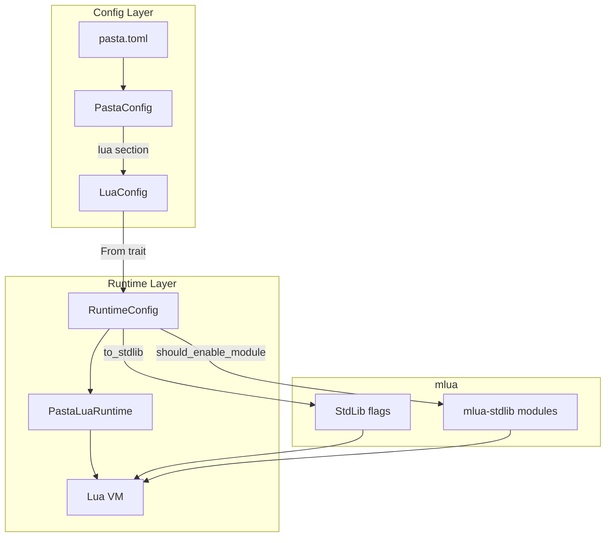
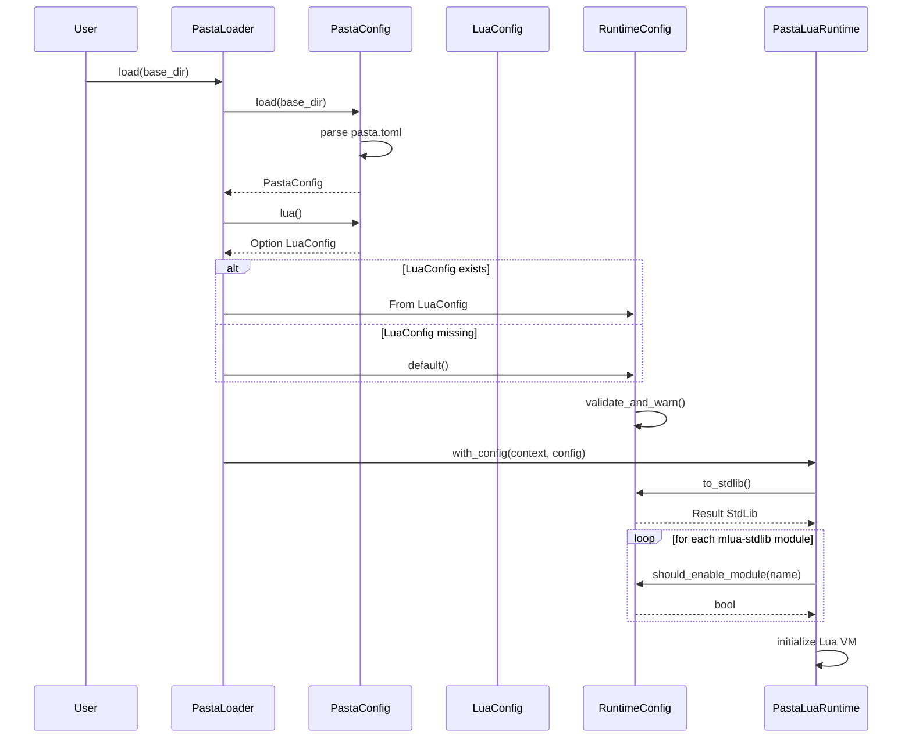
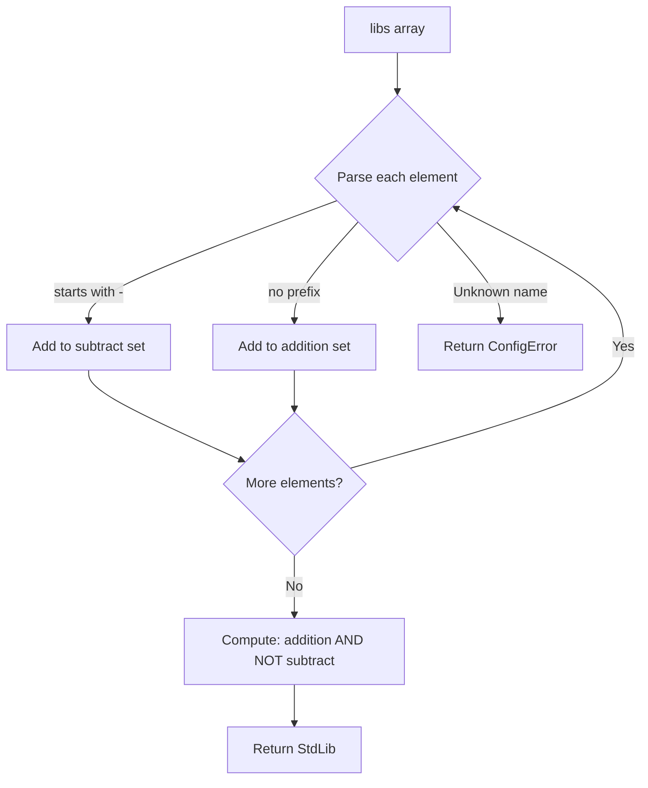

# Design Document: lua-stdlib-config

## Overview

**Purpose**: pasta_luaのTOML設定ファイル（`pasta.toml`）にて、Lua標準ライブラリおよびmlua-stdlibモジュールの有効化をCargo風配列記法で統合制御できる機能を提供する。

**Users**: ゴースト開発者が、セキュリティ要件やパフォーマンス最適化の観点から、必要なライブラリのみを選択的に有効化できる。

**Impact**: 既存の`RuntimeConfig`の個別boolフラグ（`enable_std_libs`, `enable_testing`等）を`libs`配列に完全置換し、設定の統一性と拡張性を向上させる。

### Goals
- `[lua]`セクションの`libs`配列でLua標準ライブラリとmlua-stdlibモジュールを統合制御
- Cargo.toml features風の直感的な配列記法（`["std_all", "testing", "regex"]`）
- 減算記法（`["-std_debug", "-env"]`）による柔軟な除外指定
- セキュリティリスクのあるライブラリ（`std_debug`, `env`）有効化時の警告

### Non-Goals
- Lua 5.5以外のバージョンサポート（現行lua55フィーチャーのみ）
- 実行時の動的ライブラリ変更（設定は起動時に固定）
- カスタムモジュールの設定管理（別機能として検討）

## Architecture

### Existing Architecture Analysis

**変更対象コンポーネント**:
- `runtime/mod.rs`: `RuntimeConfig`構造体 → `libs: Vec<String>`に置換
- `loader/config.rs`: `PastaConfig` → `lua()`メソッド追加
- `runtime/mod.rs`: `PastaLuaRuntime::with_config` → StdLib動的構築

**既存パターンの維持**:
- `PastaConfig::logging()`, `persistence()`と同様の`lua()`メソッドパターン
- serde Deserialize + custom_fieldsからの取得パターン
- `RuntimeConfig::new()`, `full()`, `minimal()`ファクトリパターン

**技術的制約**:
- mlua 0.11の`StdLib`ビットフラグ使用
- mlua-stdlib 0.1のモジュール登録API
- `unsafe { Lua::unsafe_new_with() }`によるVM初期化

### Architecture Pattern & Boundary Map



**Architecture Integration**:
- **Selected pattern**: Config-Runtime分離パターン + RuntimeConfig主導型変換
- **Domain boundaries**: 
  - LoaderConfig: TOML解析・デシリアライズのみ
  - RuntimeConfig: libs配列保持 + StdLib/モジュール変換ロジック
- **Existing patterns preserved**: 
  - `PastaConfig::xxx()`による設定取得
  - `RuntimeConfig::new()`デフォルトファクトリ
  - `PastaLuaRuntime::with_config()`構築パターン
- **Steering compliance**: 
  - 言語非依存層(pasta_core)への影響なし
  - pasta_lua内で完結する変更

### Technology Stack

| Layer | Choice / Version | Role in Feature | Notes |
|-------|------------------|-----------------|-------|
| Config Parser | toml 0.9.8 | TOML配列解析 | 既存依存 |
| Serialization | serde 1.x | LuaConfig構造体 | #[derive(Deserialize)] |
| Lua Binding | mlua 0.11 | StdLibフラグ、VM初期化 | lua55 feature |
| Lua Extensions | mlua-stdlib 0.1 | モジュール登録 | json, regex, yaml features |
| Logging | tracing 0.1 | 警告・デバッグログ | 既存依存 |

## Requirements Traceability

| Requirement | Summary | Components | Interfaces | Flows |
|-------------|---------|------------|------------|-------|
| 1.1-1.6 | Cargo風配列記法 | RuntimeConfig, LuaConfig | `libs: Vec<String>`, `to_stdlib()` | Config Loading |
| 2.1-2.5 | 減算記法 | RuntimeConfig | `parse_libs()` | StdLib Construction |
| 3.1-3.4 | セキュリティ警告 | RuntimeConfig | `validate_and_warn()` | Config Validation |
| 4.1-4.4 | バリデーション | RuntimeConfig, ConfigError | `parse_lib_name()` | Error Handling |
| 5.1-5.3 | 後方互換性 | RuntimeConfig, LuaConfig | `Default::default()` | Default Behavior |

## Components and Interfaces

| Component | Domain/Layer | Intent | Req Coverage | Key Dependencies | Contracts |
|-----------|--------------|--------|--------------|------------------|-----------|
| LuaConfig | Config | TOML `[lua]`セクション解析 | 1.1, 5.1 | toml, serde (P0) | State |
| RuntimeConfig | Runtime | libs配列保持・変換 | 1.1-1.6, 2.1-2.5, 4.1-4.4 | mlua (P0) | Service |
| ConfigError | Error | 設定エラー型 | 4.1-4.4 | thiserror (P1) | — |

### Config Layer

#### LuaConfig

| Field | Detail |
|-------|--------|
| Intent | TOML `[lua]`セクションのデシリアライズ |
| Requirements | 1.1, 5.1 |

**Responsibilities & Constraints**
- `[lua]`セクションからlibs配列を取得
- デフォルト値適用（セクション省略時）
- バリデーションはRuntimeConfigに委譲

**Dependencies**
- External: serde — デシリアライズ (P0)
- External: toml — TOML解析 (P0)

**Contracts**: State [x]

##### State Management

```rust
/// TOML [lua] section configuration.
#[derive(Debug, Clone, Deserialize)]
pub struct LuaConfig {
    /// Library configuration array.
    /// Examples: ["std_all"], ["std_string", "testing"], ["std_all", "-std_debug"]
    #[serde(default = "default_libs")]
    pub libs: Vec<String>,
}

fn default_libs() -> Vec<String> {
    vec![
        "std_all".into(),
        "assertions".into(),
        "testing".into(),
        "regex".into(),
        "json".into(),
        "yaml".into(),
    ]
}

impl Default for LuaConfig {
    fn default() -> Self {
        Self { libs: default_libs() }
    }
}
```

- State model: Immutable after deserialization
- Persistence: None (transient configuration)

**Implementation Notes**
- Integration: `PastaConfig::lua()`メソッドで取得
- Validation: RuntimeConfigへの変換時に実施

---

### Runtime Layer

#### RuntimeConfig

| Field | Detail |
|-------|--------|
| Intent | ライブラリ設定の保持とStdLib/モジュールフラグへの変換 |
| Requirements | 1.1-1.6, 2.1-2.5, 3.1-3.4, 4.1-4.4, 5.1-5.3 |

**Responsibilities & Constraints**
- libs配列の保持
- StdLibビットフラグへの変換（加算→減算順序）
- mlua-stdlibモジュール有効化判定
- セキュリティ警告出力
- 不明ライブラリ名のバリデーション

**Dependencies**
- Outbound: mlua::StdLib — ビットフラグ構築 (P0)
- Outbound: tracing — 警告ログ出力 (P1)

**Contracts**: Service [x]

##### Service Interface

```rust
/// Runtime configuration for Lua VM initialization.
#[derive(Debug, Clone)]
pub struct RuntimeConfig {
    /// Library configuration array.
    /// Supports both Lua standard libraries (std_* prefix) and mlua-stdlib modules.
    pub libs: Vec<String>,
}

impl RuntimeConfig {
    /// Create default configuration with safe libraries.
    /// Default: ["std_all", "assertions", "testing", "regex", "json", "yaml"]
    pub fn new() -> Self;
    
    /// Create configuration with all features including security-sensitive ones.
    /// Includes: std_all_unsafe (debug), env
    pub fn full() -> Self;
    
    /// Create minimal configuration with no libraries.
    pub fn minimal() -> Self;
    
    /// Convert libs array to mlua::StdLib flags.
    /// 
    /// Processing order: additions first, then subtractions.
    /// Example: ["std_all", "-std_debug"] → ALL_SAFE & !DEBUG = ALL_SAFE
    /// 
    /// # Errors
    /// Returns ConfigError::UnknownLibrary if an unrecognized library name is found.
    pub fn to_stdlib(&self) -> Result<StdLib, ConfigError>;
    
    /// Check if a specific mlua-stdlib module should be enabled.
    /// 
    /// # Arguments
    /// * `module` - Module name without prefix (e.g., "testing", "regex")
    /// 
    /// # Returns
    /// true if module is in libs array and not subtracted
    pub fn should_enable_module(&self, module: &str) -> bool;
    
    /// Validate configuration and emit security warnings.
    /// 
    /// Emits tracing::warn for:
    /// - std_debug or std_all_unsafe enabled
    /// - env module enabled
    /// 
    /// Emits tracing::debug for enabled libraries list.
    pub fn validate_and_warn(&self);
}

impl Default for RuntimeConfig {
    fn default() -> Self {
        Self::new()
    }
}

impl From<LuaConfig> for RuntimeConfig {
    fn from(config: LuaConfig) -> Self {
        Self { libs: config.libs }
    }
}
```

- Preconditions: libs配列は有効なライブラリ名のみ
- Postconditions: to_stdlib()はResult<StdLib, ConfigError>を返す
- Invariants: 空libsは有効（StdLib::NONE相当）

**Security Validation Contract**

```rust
/// Validate security-sensitive libraries and emit warnings.
/// 
/// # Requirements
/// - Req3.1: Warn when std_debug or std_all_unsafe is enabled
/// - Req3.2: Warn when env module is enabled
pub fn validate_and_warn(&self) {
    // Trigger: std_debug, std_all_unsafe detected in libs
    // Action: tracing::warn!("Unsafe Lua libraries enabled: {}", lib_name)
    //         with security implications explanation
    
    // Trigger: env module detected in libs
    // Action: tracing::warn!("Security-sensitive module enabled: env")
    //         with filesystem/environment access warning
}
```

- Preconditions: self.libsに有効なライブラリ名が含まれる
- Postconditions: セキュリティリスクのある設定をtracing::warnで出力
- Side Effects: 標準エラー出力への警告ログ出力

**Implementation Notes**
- Integration: `PastaLuaRuntime::with_config()`で使用
- Validation: `to_stdlib()`呼び出し時にparse_lib_name()で検証
- Security: validate_and_warn()は設定ロード時に必ず呼び出す
- Risks: std_debug/env誤設定 → validate_and_warn()で警告

---

### Error Layer

#### ConfigError

| Field | Detail |
|-------|--------|
| Intent | 設定関連エラーの表現 |
| Requirements | 4.1-4.4 |

**Contracts**: —

```rust
/// Configuration errors.
#[derive(Debug, thiserror::Error)]
pub enum ConfigError {
    /// Unknown library name in libs array.
    #[error("Unknown library: {0}. Valid libraries: std_all, std_all_unsafe, std_coroutine, std_table, std_io, std_os, std_string, std_utf8, std_math, std_package, std_debug, assertions, testing, env, regex, json, yaml")]
    UnknownLibrary(String),
}
```

---

## System Flows

### Config Loading Flow



### StdLib Construction Flow



**Key Decisions**:
- 加算を先に収集し、減算を後に適用することで順序非依存を実現
- 未知のライブラリ名は即座にエラー（厳格バリデーション）

## Data Models

### Domain Model

**Entities**:
- `RuntimeConfig`: ライブラリ設定の集約ルート
- `LuaConfig`: TOML設定の値オブジェクト

**Value Objects**:
- `libs: Vec<String>`: ライブラリ名の配列

**Business Rules**:
1. `std_`プレフィックス付きはLua標準ライブラリ
2. プレフィックスなしはmlua-stdlibモジュール
3. `-`プレフィックスは減算（除外）
4. 加算→減算の順序で処理

### Library Name Mapping

| TOML Name | mlua Constant / Module | Category |
|-----------|------------------------|----------|
| `std_all` | `StdLib::ALL_SAFE` | Lua Standard |
| `std_all_unsafe` | `StdLib::ALL` | Lua Standard (unsafe) |
| `std_coroutine` | `StdLib::COROUTINE` | Lua Standard |
| `std_table` | `StdLib::TABLE` | Lua Standard |
| `std_io` | `StdLib::IO` | Lua Standard |
| `std_os` | `StdLib::OS` | Lua Standard |
| `std_string` | `StdLib::STRING` | Lua Standard |
| `std_utf8` | `StdLib::UTF8` | Lua Standard |
| `std_math` | `StdLib::MATH` | Lua Standard |
| `std_package` | `StdLib::PACKAGE` | Lua Standard |
| `std_debug` | `StdLib::DEBUG` | Lua Standard (unsafe) |
| `assertions` | `@assertions` | mlua-stdlib |
| `testing` | `@testing` | mlua-stdlib |
| `env` | `@env` | mlua-stdlib (security) |
| `regex` | `@regex` | mlua-stdlib |
| `json` | `@json` | mlua-stdlib |
| `yaml` | `@yaml` | mlua-stdlib |

## Error Handling

### Error Strategy
- **Fail Fast**: 不明ライブラリ名は設定ロード時に即エラー
- **Graceful Degradation**: 該当なし（設定は起動時に固定）
- **User Context**: エラーメッセージに有効なライブラリ名一覧を含める

### Error Categories and Responses

**User Errors (Config)**:
- Unknown library name → `ConfigError::UnknownLibrary` with valid names list

**Security Warnings**:
- std_debug/std_all_unsafe enabled → `tracing::warn`
- env module enabled → `tracing::warn`

## Testing Strategy

### Unit Tests
- `RuntimeConfig::to_stdlib()` — 各ライブラリ名のパース
- `RuntimeConfig::to_stdlib()` — 減算記法処理
- `RuntimeConfig::should_enable_module()` — モジュール判定
- `LuaConfig` deserialization — TOML配列解析
- `ConfigError::UnknownLibrary` — エラーメッセージ

### Integration Tests
- `PastaConfig::lua()` — `[lua]`セクション取得
- `PastaLoader` with custom libs — エンドツーエンド設定ロード
- `PastaLuaRuntime` with custom libs — VM初期化確認

### E2E Tests
- pasta.toml with various libs configurations
- Security warning output verification
- Backward compatibility (no [lua] section)

## Security Considerations

**Security-Sensitive Libraries**:
- `std_debug`: Lua内部状態へのアクセス、スタック操作 → 本番環境では無効推奨
- `env`: ファイルシステム、環境変数アクセス → デフォルト無効

**Mitigation**:
- デフォルト値にstd_debug/env含めない
- 有効化時にtracing::warnで警告
- ドキュメントにセキュリティリスク明記

## Migration Strategy

### Phase 1: RuntimeConfig刷新
1. `RuntimeConfig`に`libs: Vec<String>`フィールド追加
2. `to_stdlib()`, `should_enable_module()`メソッド実装
3. 既存`enable_*`フラグを`#[deprecated]`マーク

### Phase 2: LoaderConfig統合
1. `LuaConfig`構造体追加
2. `PastaConfig::lua()`メソッド追加
3. `PastaLoader`でLuaConfig→RuntimeConfig変換

### Phase 3: 既存フラグ削除
1. テストを新libs配列ベースに移行
2. `#[deprecated]`フラグ削除
3. ドキュメント更新

**Rollback Trigger**: RuntimeConfig変更によるテスト失敗 → Phase 1でフラグ残存

## Supporting References

詳細な調査ログと代替案比較は [research.md](./research.md) を参照。
