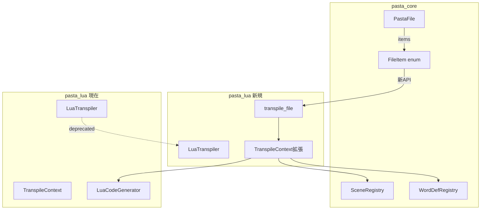
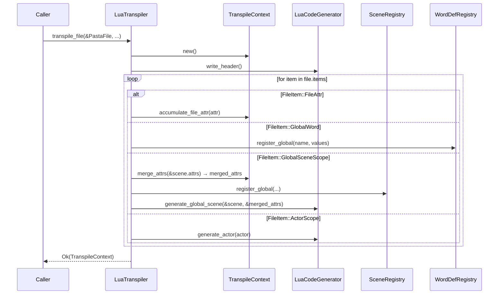
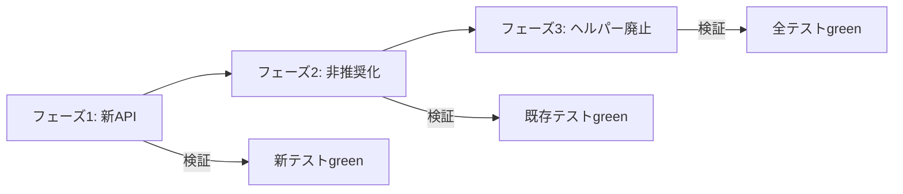

# Technical Design: lua-transpiler-pastafile-migration

## Overview

**Purpose**: pasta_luaトランスパイラーをPastaFile入力ベースの順序保持処理に移行し、pasta_runeのTranspiler2と同等のアーキテクチャを採用する。

**Users**: pasta_luaを利用するLuaスクリプト生成システム、およびpasta_coreを使用するテストコード。

**Impact**: 
- pasta_luaのAPI拡張（transpile_file()追加）
- pasta_coreからPastaFileヘルパーメソッド廃止（76マッチ影響）
- テストコードの修正（file.itemsイテレーションへの移行）

### Goals
- FileItem出現順処理の強制により、正しいトランスパイル順序を保証
- pasta_runeとの API一貫性を維持（入力形式の統一）
- ヘルパーメソッド廃止により、構造的に出現順無視の実装を防止

### Non-Goals
- LuaCodeGenerator内部ロジックの変更（シグネチャ拡張のみ実施）
- Lua出力フォーマットの変更
- パフォーマンス最適化（本移行の範囲外）
- 2パス処理の実装（Lua言語では不要）

## Architecture

### Existing Architecture Analysis

**現在のpasta_luaトランスパイラー構造**:
```
LuaTranspiler
├── transpile(&[ActorScope], &[GlobalSceneScope]) → TranspileContext
├── transpile_with_globals(..., &[KeyWords]) → TranspileContext
└── TranspileContext
    ├── scene_registry: SceneRegistry
    ├── word_registry: WordDefRegistry
    └── current_module: Option<String>
```

**問題点**:
- 入力が型別に分離されており、FileItem出現順を復元不可能
- ファイル属性（FileAttr）の累積機能なし
- PastaFileヘルパーメソッドが出現順無視の実装を誘発

**参照実装（pasta_rune Transpiler2）**:
```
Transpiler2
├── transpile_pass1(&PastaFile, &mut SceneRegistry, &mut WordDefRegistry, &mut W)
├── transpile_pass2(&SceneRegistry, &mut W)
└── TranspileContext2
    ├── file_attrs: HashMap<String, AttrValue>  ← 累積
    ├── accumulate_file_attr(&Attr)
    └── merge_attrs(&[Attr]) → HashMap<String, AttrValue>
```

### Architecture Pattern & Boundary Map



**Architecture Integration**:
- **Selected pattern**: 既存TranspileContext拡張 + 新メソッド追加（段階的移行）
- **Domain boundaries**: pasta_lua内部の変更、pasta_coreからのヘルパーメソッド廃止
- **Existing patterns preserved**: SceneRegistry/WordDefRegistry連携パターン
- **New components rationale**: TranspileContextにファイル属性累積機能を追加
- **Steering compliance**: 1パス処理（Lua言語設計に最適化）

### Technology Stack

| Layer | Choice / Version | Role in Feature | Notes |
|-------|------------------|-----------------|-------|
| Language | Rust 2024 edition | 実装言語 | 既存 |
| Parser | pasta_core::parser | PastaFile/FileItem提供 | 既存 |
| Registry | pasta_core::registry | SceneRegistry/WordDefRegistry | 既存 |
| Output | std::io::Write | Luaコード出力 | 既存 |

## System Flows

### FileItem出現順処理フロー



**Key Decisions**:
- FileAttr処理: 累積のみ（コード生成なし）
- GlobalSceneScope処理: merge_attrs()を呼び出し、結果をCodeGeneratorに渡す
- CodeGenerator受け取り: `generate_global_scene(&scene, &merged_attrs)`として受け取る（現時点では未使用でも可）
- アクター処理: ファイル属性の影響を受けない（出現順処理のみ）

## Requirements Traceability

| Requirement | Summary | Components | Interfaces | Flows |
|-------------|---------|------------|------------|-------|
| 1 | PastaFile入力IF | LuaTranspiler | transpile_file() | FileItem処理 |
| 2 | FileItem出現順処理 | LuaTranspiler | transpile_file() | FileItem処理 |
| 3 | ファイル属性処理 | TranspileContext | accumulate_file_attr(), merge_attrs() | FileItem処理 |
| 4 | グローバル単語登録 | LuaTranspiler, WordDefRegistry | register_global() | FileItem処理 |
| 5 | シーン処理順序 | LuaTranspiler | process_global_scene() | FileItem処理 |
| 6 | アクター処理順序 | LuaTranspiler | generate_actor() | FileItem処理 |
| 7 | API一貫性 | LuaTranspiler | transpile_file() | - |
| 8 | 後方互換性 | LuaTranspiler | transpile(), transpile_with_globals() | - |
| 9 | テストカバレッジ | tests/ | - | - |
| 10 | ヘルパーメソッド廃止 | PastaFile | 削除 | - |

## Components and Interfaces

### Summary Table

| Component | Domain/Layer | Intent | Req Coverage | Key Dependencies | Contracts |
|-----------|--------------|--------|--------------|------------------|-----------|
| LuaTranspiler | pasta_lua | Luaコード生成エントリーポイント | 1, 2, 4, 5, 6, 7, 8 | TranspileContext (P0), LuaCodeGenerator (P0) | Service |
| TranspileContext | pasta_lua | トランスパイル状態管理 | 3 | SceneRegistry (P0), WordDefRegistry (P0) | State |
| PastaFile | pasta_core | AST表現（ヘルパー廃止対象） | 10 | - | - |

### pasta_lua Layer

#### LuaTranspiler

| Field | Detail |
|-------|--------|
| Intent | PastaファイルをLuaコードにトランスパイル |
| Requirements | 1, 2, 4, 5, 6, 7, 8 |

**Responsibilities & Constraints**
- PastaFileを入力として受け取り、Luaコードを出力
- FileItemを出現順に処理
- 1パス処理で完結（pass2は実装しない）

**Dependencies**
- Inbound: 呼び出し元 — PastaFileを渡す (P0)
- Outbound: TranspileContext — 状態管理 (P0)
- Outbound: LuaCodeGenerator — コード生成 (P0)
- Outbound: SceneRegistry — シーン登録 (P0)
- Outbound: WordDefRegistry — 単語登録 (P0)

**Contracts**: Service [x] / State [ ]

##### Service Interface
```rust
impl LuaTranspiler {
    /// 新規: PastaFileを入力として受け取るメインAPI
    pub fn transpile_file<W: Write>(
        &self,
        file: &PastaFile,
        writer: &mut W,
    ) -> Result<TranspileContext, TranspileError>;
    
    /// 既存: 非推奨ラッパー
    #[deprecated(since = "0.X.X", note = "use `transpile_file` instead")]
    pub fn transpile<W: Write>(
        &self,
        actors: &[ActorScope],
        scenes: &[GlobalSceneScope],
        writer: &mut W,
    ) -> Result<TranspileContext, TranspileError>;
    
    /// 既存: 非推奨ラッパー
    #[deprecated(since = "0.X.X", note = "use `transpile_file` instead")]
    pub fn transpile_with_globals<W: Write>(
        &self,
        actors: &[ActorScope],
        scenes: &[GlobalSceneScope],
        global_words: &[KeyWords],
        writer: &mut W,
    ) -> Result<TranspileContext, TranspileError>;
}
```
- Preconditions: PastaFileが有効なAST
- Postconditions: Luaコードがwriterに出力される、TranspileContextにレジストリ情報が格納
- Invariants: FileItem出現順が処理順と一致

**Implementation Notes**
- Integration: pasta_runeのtranspile_pass1()パターンを参考に実装
  - FileItem出現順に処理（for item in &file.items）
  - GlobalSceneScope処理時に`merge_attrs(&scene.attrs)`を呼び出し
  - マージ結果（`HashMap<String, AttrValue>`）をLuaCodeGeneratorに渡す
- CodeGenerator Integration: `generate_global_scene()`に`file_attrs: &HashMap<String, AttrValue>`引数を追加
  - 現時点では属性値を使ったコード生成をしない（未使用パラメータ）
  - 将来の拡張性のためシグネチャには含める（pasta_runeで省略された実装を補完）
- Validation: FileItem種別の網羅性チェック（match exhaustive）
- Risks: 非推奨メソッドからのPastaFile再構築は順序情報を喪失

#### TranspileContext

| Field | Detail |
|-------|--------|
| Intent | トランスパイル中の状態（レジストリ、属性累積）を管理 |
| Requirements | 3 |

**Responsibilities & Constraints**
- ファイル属性の累積（シャドーイング対応）
- シーン/単語レジストリへの登録委譲
- シーン処理時のファイル属性とシーン属性のマージ

**Dependencies**
- Inbound: LuaTranspiler — 状態操作 (P0)
- Outbound: SceneRegistry — シーン登録 (P0)
- Outbound: WordDefRegistry — 単語登録 (P0)

**Contracts**: State [x]

##### State Management
```rust
pub struct TranspileContext {
    /// 既存
    pub scene_registry: SceneRegistry,
    pub word_registry: WordDefRegistry,
    pub current_module: Option<String>,
    
    /// 新規: ファイル属性累積
    file_attrs: HashMap<String, AttrValue>,
}

impl TranspileContext {
    /// 新規: ファイル属性の累積（シャドーイング）
    pub fn accumulate_file_attr(&mut self, attr: &Attr) {
        self.file_attrs.insert(attr.key.clone(), attr.value.clone());
    }
    
    /// 新規: ファイル属性とシーン属性のマージ
    pub fn merge_attrs(&self, scene_attrs: &[Attr]) -> HashMap<String, AttrValue> {
        let mut result = self.file_attrs.clone();
        for attr in scene_attrs {
            result.insert(attr.key.clone(), attr.value.clone());
        }
        result
    }
    
    /// 既存メソッド群は維持
    // ...
}
```
- State model: ファイル属性は`HashMap<String, AttrValue>`で累積（後勝ち）
- Persistence: なし（トランスパイル中のみ）
- Concurrency: シングルスレッド前提（既存設計を維持）

**Implementation Notes**
- Integration: pasta_rune TranspileContext2のaccumulate_file_attr()と同等
- Validation: attr.keyの重複時は上書き（シャドーイング）
- Risks: file_attrs()列挙メソッドは追加しない（害悪）

#### LuaCodeGenerator（シグネチャ拡張）

| Field | Detail |
|-------|--------|
| Intent | ファイル属性を受け取れるよう`generate_global_scene()`を拡張 |
| Requirements | 3, 5 |

**シグネチャ変更**:
```rust
impl<'a, W: Write> LuaCodeGenerator<'a, W> {
    // 既存シグネチャ
    pub fn generate_global_scene(
        &mut self,
        scene: &GlobalSceneScope,
        scene_counter: usize,
        _context: &TranspileContext,  // ← 廃止予定（現在は未使用）
    ) -> Result<(), TranspileError>;
    
    // 新規シグネチャ（フェーズ1で実装）
    pub fn generate_global_scene(
        &mut self,
        scene: &GlobalSceneScope,
        scene_counter: usize,
        file_attrs: &HashMap<String, AttrValue>,  // ← 追加
        context: &TranspileContext,
    ) -> Result<(), TranspileError>;
}
```

**Implementation Notes**
- Integration: pasta_runeのCodeGenerator参照（ただしpasta_runeは`_context`未使用でfile_attrs引数なし）
- Signature Rationale: 将来の拡張性（属性値を使ったコード生成）のため引数に含める
- Current Usage: 現時点では`file_attrs`は未使用でも可（`_file_attrs`として受け取り）
- Future Extension: シーンごとの属性値に基づいたLuaコード生成が可能になる

### pasta_core Layer

#### PastaFile（ヘルパーメソッド廃止）

| Field | Detail |
|-------|--------|
| Intent | PastaFileからヘルパーメソッドを削除 |
| Requirements | 10 |

**廃止対象メソッド**:
```rust
// 以下のメソッドを削除
impl PastaFile {
    // pub fn file_attrs(&self) -> Vec<&Attr>  ← 削除
    // pub fn words(&self) -> Vec<&KeyWords>  ← 削除
    // pub fn global_scene_scopes(&self) -> Vec<&GlobalSceneScope>  ← 削除
    // pub fn actor_scopes(&self) -> Vec<&ActorScope>  ← 削除
}
```

**代替手段**:
```rust
// 正しいパターン: file.itemsの直接イテレーション
for item in &file.items {
    match item {
        FileItem::FileAttr(attr) => { /* 属性処理 */ }
        FileItem::GlobalWord(word) => { /* 単語定義処理 */ }
        FileItem::GlobalSceneScope(scene) => { /* シーン処理 */ }
        FileItem::ActorScope(actor) => { /* アクター処理 */ }
    }
}
```

**Implementation Notes**
- Integration: 76マッチの修正が必要
- Validation: コンパイルエラーで検出可能
- Risks: テストコードの大量修正が必要（メカニカルな修正）

## Error Handling

### Error Categories and Responses

**トランスパイルエラー (TranspileError)**:
- InvalidFileItem: 不明なFileItem種別 → 実装バグ、開発時に検出
- IoError: 書き込み失敗 → 呼び出し元に伝播
- SceneRegistrationError: シーン登録失敗 → 警告ログ出力、続行

### Monitoring
- tracing::warn! でシーン登録失敗を記録
- 既存のエラーハンドリングパターンを維持

## Testing Strategy

### Unit Tests
- `accumulate_file_attr()`: 累積・シャドーイング動作確認
- `merge_attrs()`: ファイル属性とシーン属性のマージ確認
- `transpile_file()`: 各FileItem種別の処理確認

### Integration Tests
- FileItem出現順序が処理順序と一致することの検証
- ファイル属性シャドーイングの順序依存性テスト
- アクター処理がファイル属性を継承しないことの確認
- 非推奨メソッドの動作確認（後方互換性）

### Regression Tests
- 既存テストがすべてパスすること（file.items書き換え後）
- pasta_runeのテストパターンを参考に同等カバレッジを確保

## Migration Strategy

### フェーズ1: 新API実装
1. TranspileContextに`file_attrs`フィールドと関連メソッドを追加
2. `transpile_file()`メソッドを新規実装
3. 新テスト群を追加
4. **検証**: 新テストがgreen

### フェーズ2: 既存メソッド非推奨化
1. `transpile()` / `transpile_with_globals()` に `#[deprecated]` を付与
2. 内部実装を`transpile_file()`呼び出しに変更（可能な範囲で）
3. **検証**: 既存テストがgreen

### フェーズ3: ヘルパーメソッド廃止
1. PastaFile側から4メソッドを削除
2. TranspileContext2から`file_attrs()`を削除
3. テストを`file.items`イテレーションに書き換え
4. **検証**: すべてのテストがgreen


