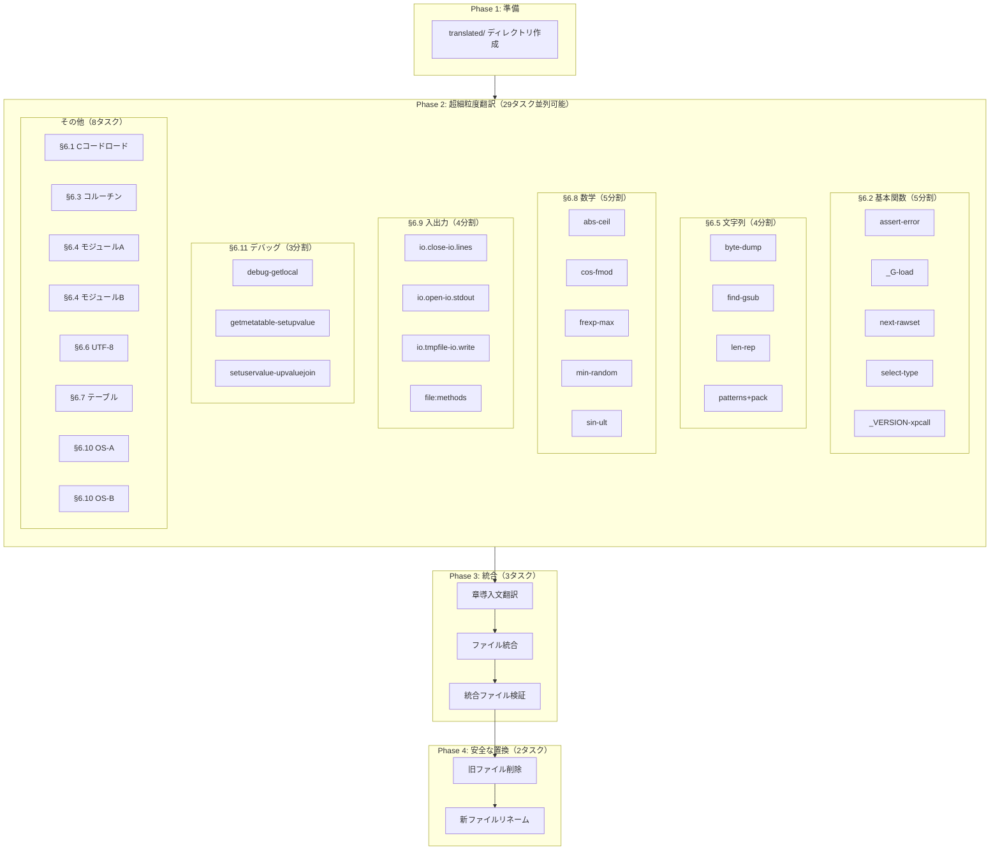

# Technical Design Document

## Overview

**Purpose**: Lua 5.5リファレンスマニュアル日本語版の第6章「標準ライブラリ」を完全版で再作成する。

**超細粒度ファイルベース翻訳アプローチ**を採用：
- 1タスク = 3-8関数程度の極小単位
- 各タスク完了時にファイル出力（成果物の永続化）
- 並列実行可能なタスク設計
- コンテキスト制限回避

### Goals
- 第6章（§6.1-§6.11）の全関数・全説明を完全翻訳
- 各タスクで中間ファイル出力（作業の永続化）
- 安全なファイル置換（別名作成→確認→リネーム）
- 並列可能な小タスクに分割

### Non-Goals
- 第6章以外の章の修正
- 原文HTMLの再取得（既存chaptersフォルダを使用）

---

## 翻訳ソース分析

### HTMLファイル規模（11ファイル）

| ファイル | 行数 | 関数数 | 分割数 |
|----------|------|--------|--------|
| 05-string-manipulation.html | 818 | 17 | 4分割 |
| 02-basic-functions.html | 614 | 25 | 5分割 |
| 08-mathematical-functions.html | 389 | 29 | 5分割 |
| 09-input-and-output-facilities.html | 434 | 18 | 4分割 |
| 11-the-debug-library.html | 388 | 16 | 3分割 |
| 04-modules.html | 396 | 9 | 2分割 |
| 10-operating-system-facilities.html | 302 | 11 | 2分割 |
| 03-coroutine-manipulation.html | 167 | 8 | 1分割 |
| 07-table-manipulation.html | 182 | 8 | 1分割 |
| 06-utf-8-support.html | 162 | 6 | 1分割 |
| 01-loading-the-libraries-in-c-code.html | 80 | 2 | 1分割 |

**合計**: 29分割 + 導入文 + 統合 + 検証 + 置換 = **約35タスク**

---

## Architecture

### 超細粒度翻訳パイプライン



---

## ディレクトリ構造

```
.kiro/specs/lua55-reference-manual-ja-chapter6-full/
├── spec.json
├── requirements.md
├── design.md
├── tasks.md
└── translated/                          # 中間翻訳ファイル出力先
    ├── 00-chapter-intro.md              # 章導入文
    │
    ├── 01-loading-libraries.md          # §6.1 全体
    │
    ├── 02-basic-A.md                    # §6.2 assert-error (5関数)
    ├── 02-basic-B.md                    # §6.2 _G-load (5関数)
    ├── 02-basic-C.md                    # §6.2 next-rawset (5関数)
    ├── 02-basic-D.md                    # §6.2 select-type (5関数)
    ├── 02-basic-E.md                    # §6.2 _VERSION-xpcall (5関数)
    │
    ├── 03-coroutine.md                  # §6.3 全体
    │
    ├── 04-modules-A.md                  # §6.4 前半
    ├── 04-modules-B.md                  # §6.4 後半
    │
    ├── 05-string-A.md                   # §6.5 byte-dump (4関数)
    ├── 05-string-B.md                   # §6.5 find-gsub (4関数)
    ├── 05-string-C.md                   # §6.5 len-rep (5関数)
    ├── 05-string-D.md                   # §6.5 patterns+pack
    │
    ├── 06-utf8.md                       # §6.6 全体
    │
    ├── 07-table.md                      # §6.7 全体
    │
    ├── 08-math-A.md                     # §6.8 abs-ceil (6関数)
    ├── 08-math-B.md                     # §6.8 cos-fmod (6関数)
    ├── 08-math-C.md                     # §6.8 frexp-max (6関数)
    ├── 08-math-D.md                     # §6.8 min-random (6関数)
    ├── 08-math-E.md                     # §6.8 sin-ult (5関数)
    │
    ├── 09-io-A.md                       # §6.9 io.close-io.lines (4関数)
    ├── 09-io-B.md                       # §6.9 io.open-io.stdout (5関数)
    ├── 09-io-C.md                       # §6.9 io.tmpfile-io.write (3関数)
    ├── 09-io-D.md                       # §6.9 file:methods (6関数)
    │
    ├── 10-os-A.md                       # §6.10 clock-execute (5関数)
    ├── 10-os-B.md                       # §6.10 exit-tmpname (6関数)
    │
    ├── 11-debug-A.md                    # §6.11 debug-getlocal (5関数)
    ├── 11-debug-B.md                    # §6.11 getmetatable-setupvalue (6関数)
    └── 11-debug-C.md                    # §6.11 setuservalue-upvaluejoin (5関数)
```

---

## 分割詳細

### §6.2 基本関数（25関数 → 5分割）

| 分割 | 関数 | 出力ファイル |
|------|------|--------------|
| A | assert, collectgarbage, dofile, error | 02-basic-A.md |
| B | _G, getmetatable, ipairs, load, loadfile | 02-basic-B.md |
| C | next, pairs, pcall, print, rawequal, rawget, rawlen, rawset | 02-basic-C.md |
| D | select, setmetatable, tonumber, tostring, type | 02-basic-D.md |
| E | _VERSION, warn, xpcall | 02-basic-E.md |

### §6.5 文字列操作（17関数 → 4分割）

| 分割 | 関数 | 出力ファイル |
|------|------|--------------|
| A | string.byte, string.char, string.dump, string.find | 05-string-A.md |
| B | string.format, string.gmatch, string.gsub, string.len | 05-string-B.md |
| C | string.lower, string.match, string.pack, string.packsize, string.rep | 05-string-C.md |
| D | string.reverse, string.sub, string.unpack, string.upper + §6.5.1 パターン + §6.5.2 Pack書式 | 05-string-D.md |

### §6.8 数学関数（29関数 → 5分割）

| 分割 | 関数 | 出力ファイル |
|------|------|--------------|
| A | math.abs, math.acos, math.asin, math.atan, math.ceil, math.cos | 08-math-A.md |
| B | math.deg, math.exp, math.floor, math.fmod, math.frexp, math.huge | 08-math-B.md |
| C | math.ldexp, math.log, math.max, math.maxinteger, math.min, math.mininteger | 08-math-C.md |
| D | math.modf, math.pi, math.rad, math.random, math.randomseed | 08-math-D.md |
| E | math.sin, math.sqrt, math.tan, math.tointeger, math.type, math.ult | 08-math-E.md |

### §6.9 入出力機能（18関数 → 4分割）

| 分割 | 関数 | 出力ファイル |
|------|------|--------------|
| A | io.close, io.flush, io.input, io.lines | 09-io-A.md |
| B | io.open, io.output, io.popen, io.read, io.stdout | 09-io-B.md |
| C | io.stderr, io.stdin, io.tmpfile, io.type, io.write | 09-io-C.md |
| D | file:close, file:flush, file:lines, file:read, file:seek, file:setvbuf, file:write | 09-io-D.md |

### §6.11 デバッグライブラリ（16関数 → 3分割）

| 分割 | 関数 | 出力ファイル |
|------|------|--------------|
| A | debug.debug, debug.gethook, debug.getinfo, debug.getlocal | 11-debug-A.md |
| B | debug.getmetatable, debug.getregistry, debug.getupvalue, debug.getuservalue, debug.sethook, debug.setlocal | 11-debug-B.md |
| C | debug.setmetatable, debug.setupvalue, debug.setuservalue, debug.traceback, debug.upvalueid, debug.upvaluejoin | 11-debug-C.md |

### §6.4 モジュール（9関数 → 2分割）

| 分割 | 関数 | 出力ファイル |
|------|------|--------------|
| A | require, package.config, package.cpath, package.loaded, package.loadlib | 04-modules-A.md |
| B | package.path, package.preload, package.searchers, package.searchpath | 04-modules-B.md |

### §6.10 OS機能（11関数 → 2分割）

| 分割 | 関数 | 出力ファイル |
|------|------|--------------|
| A | os.clock, os.date, os.difftime, os.execute, os.exit | 10-os-A.md |
| B | os.getenv, os.remove, os.rename, os.setlocale, os.time, os.tmpname | 10-os-B.md |

### 単一ファイル（分割不要）

| セクション | 関数数 | 出力ファイル |
|------------|--------|--------------|
| §6.1 Cコードロード | 2 | 01-loading-libraries.md |
| §6.3 コルーチン | 8 | 03-coroutine.md |
| §6.6 UTF-8 | 6 | 06-utf8.md |
| §6.7 テーブル | 8 | 07-table.md |

---

## 並列実行可能性

### Phase 2 の並列グループ

**完全並列可能**: 以下の29タスクは依存関係なし、同時実行可能

```
グループ1: 01, 02-A, 02-B, 02-C, 02-D, 02-E
グループ2: 03, 04-A, 04-B, 05-A, 05-B, 05-C, 05-D
グループ3: 06, 07, 08-A, 08-B, 08-C, 08-D, 08-E
グループ4: 09-A, 09-B, 09-C, 09-D, 10-A, 10-B
グループ5: 11-A, 11-B, 11-C
```

### 依存関係

```
Phase 1 (準備) → Phase 2 (翻訳29タスク並列) → Phase 3 (統合) → Phase 4 (置換)
```

---

## 安全な置換手順

1. **新ファイル作成**: `06-standard-libraries.new.md` として統合
2. **検証**: 2000行以上、§6.1-§6.11全セクション確認
3. **旧ファイル削除**: `06-standard-libraries.md` 削除
4. **リネーム**: `.new.md` → `.md`
5. **git commit**: 変更をコミット

---

## タスク完了報告テンプレート

```
✅ タスク XX 完了
- 出力: translated/XX-name.md
- 行数: XXX行
- 関数: func1, func2, func3
```

---

## 参照パス

### 英語原文（翻訳ソース）
- `.kiro/specs/completed/lua55-reference-manual-ja/chapters/en/standard-libraries/` (11ファイル)
- `.kiro/specs/completed/lua55-reference-manual-ja/chapters/en/06-standard-libraries.html` (章導入文用)

### 中間出力先
- `.kiro/specs/lua55-reference-manual-ja-chapter6-full/translated/`

### 最終出力先
- `crates/pasta_lua/doc/lua55-manual/06-standard-libraries.md`
