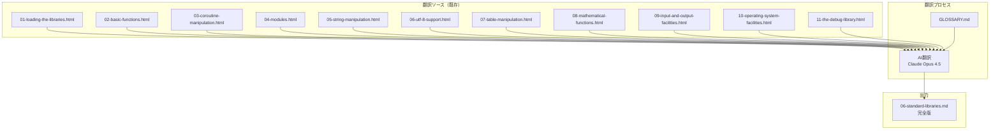
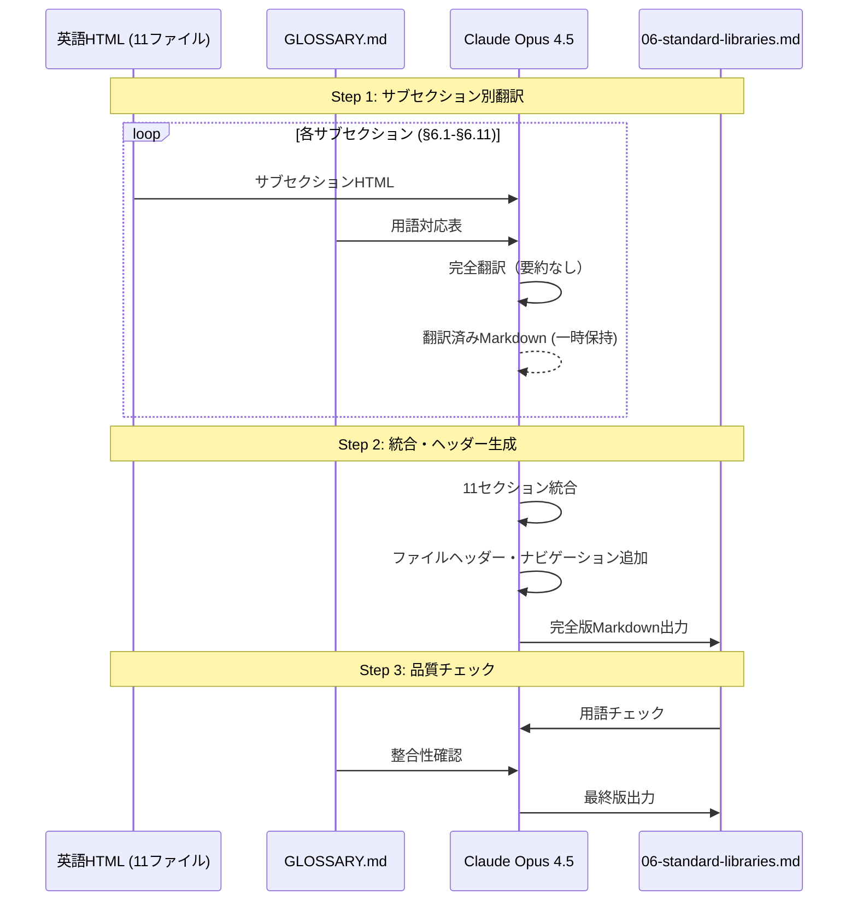

# Technical Design Document

## Overview

**Purpose**: Lua 5.5リファレンスマニュアル日本語版の第6章「標準ライブラリ」を要約版から完全版に再作成する。原文HTML（約3,900行、11サブセクション）のすべての関数・パラメータ・説明を日本語に翻訳し、既存ファイルを置換する。

**Users**: Lua言語を使用する開発者（pasta_luaユーザーに限らず、一般のLua開発者も対象）

**Impact**: 既存の`crates/pasta_lua/doc/lua55-manual/06-standard-libraries.md`を完全版で置換。他ファイルへの変更なし。

### Goals
- 第6章（§6.1-§6.11）の全関数・全説明を完全翻訳（約4,000行→2,000-3,000行Markdown）
- 各関数の完全な説明（パラメータ、戻り値、動作、例外、コード例）を含む
- パターンマッチング構文（§6.5.1）、format書式、pack書式の詳細解説
- Lua 5.5固有の変更点（§6.1新設、`collectgarbage`変更等）の明示
- 既存GLOSSARY.mdとの用語一貫性

### Non-Goals
- 第6章以外の章の修正
- ファイル分割（5,000行超えない限り単一ファイル維持）
- 新規索引ファイルの作成
- 原文HTMLの再取得（既存chapters使用）

---

## Architecture

### Architecture Pattern & Boundary Map

本仕様は既存翻訳パイプライン（親仕様: `lua55-reference-manual-ja`）の**部分再実行**であり、新規アーキテクチャは不要。



**Architecture Integration**:
- **Selected pattern**: サブセクション単位翻訳・統合方式
- **Domain boundaries**: 第6章のみがスコープ、他章に影響なし
- **Existing patterns preserved**: 親仕様の翻訳ルール・フォーマットを継承
- **Steering compliance**: GLOSSARY.md用語を一貫使用

### Technology Stack

| Layer | Choice / Version | Role in Feature | Notes |
|-------|------------------|-----------------|-------|
| 翻訳エンジン | Claude Opus 4.5 (LLM) | HTML→Markdown翻訳 | 長文技術翻訳対応 |
| 翻訳ソース | chapters/en/standard-libraries/*.html | 原文（11ファイル） | 既存 |
| 用語基準 | GLOSSARY.md | 用語一貫性 | 既存（必要に応じ更新） |
| 出力形式 | Markdown | 最終ドキュメント | 既存ファイル置換 |

---

## Requirements Traceability

| Requirement | Summary | Components | Interfaces | Flows |
|-------------|---------|------------|------------|-------|
| 1.1-1.5 | 原文からの完全翻訳 | SubsectionTranslator | AI翻訳API | 翻訳フロー |
| 2.1-2.3 | 11サブセクション網羅性 | SubsectionTranslator, ContentMerger | 章HTML入力 | 翻訳フロー |
| 3.1-3.4 | 関数リファレンス詳細度 | SubsectionTranslator | AI翻訳API | 翻訳フロー |
| 4.1-4.3 | パターンマッチング完全解説 | SubsectionTranslator（§6.5） | - | 翻訳フロー |
| 5.1-5.5 | Lua 5.5固有変更点明示 | VersionAnnotator | - | 品質チェック |
| 6.1-6.6 | フォーマット統一 | ContentMerger, HeaderGenerator | Markdownテンプレート | 統合フロー |
| 7.1-7.5 | 翻訳品質・GLOSSARY整合性 | GlossaryChecker | GLOSSARY.md | 品質チェック |
| 8.1-8.4 | ファイル構成 | ContentMerger | ファイルシステム | 出力フロー |

---

## System Flows

### 翻訳・統合フロー



---

## Components and Interfaces

| Component | Domain/Layer | Intent | Req Coverage | Key Dependencies | Contracts |
|-----------|--------------|--------|--------------|------------------|-----------|
| SubsectionTranslator | 翻訳 | サブセクションHTML→Markdown翻訳 | 1.1-1.5, 2.1-2.3, 3.1-3.4, 4.1-4.3 | 英語HTML (P0), GLOSSARY (P0) | Service |
| VersionAnnotator | 翻訳 | Lua 5.5固有変更点のマークアップ | 5.1-5.5 | 翻訳済みMarkdown (P0) | Service |
| ContentMerger | 統合 | 11サブセクションを1ファイルに統合 | 6.1-6.6, 8.1-8.4 | 翻訳済みMarkdown (P0) | Batch |
| HeaderGenerator | 統合 | ファイルヘッダー・ナビゲーション生成 | 6.4-6.5 | - | Batch |
| GlossaryChecker | 品質 | GLOSSARY用語の一貫性チェック | 7.1-7.5 | GLOSSARY.md (P0), 翻訳済みMarkdown (P0) | Service |

### 翻訳レイヤー

#### SubsectionTranslator

| Field | Detail |
|-------|--------|
| Intent | 各サブセクションHTMLを完全な日本語Markdownに翻訳（要約なし） |
| Requirements | 1.1-1.5, 2.1-2.3, 3.1-3.4, 4.1-4.3 |

**Responsibilities & Constraints**
- 英語HTML→日本語Markdown変換（完全翻訳、省略禁止）
- 各関数の全説明（パラメータ、戻り値、動作、例外、コード例）を含む
- API名・コード例は原文維持
- GLOSSARY.mdの用語に従う
- セクションアンカーを生成

**Dependencies**
- Inbound: chapters/en/standard-libraries/*.html — 翻訳ソース (P0)
- Inbound: GLOSSARY.md — 用語基準 (P0)
- Outbound: 翻訳済みMarkdown — 一時成果物 (P0)
- External: Claude Opus 4.5 — 翻訳エンジン (P0)

**Contracts**: Service [x]

##### Service Interface

```
翻訳プロンプト仕様（完全版用）:

Input:
  - サブセクションHTML（§6.x単位）
  - GLOSSARY.md
  
Output:
  - 完全翻訳済みMarkdown
  - 新規用語リスト（GLOSSARY追加分、あれば）

翻訳ルール（要件1-4対応）:
  1. 各関数の完全な説明を含む（目的、パラメータ、戻り値、動作、例外）
  2. コード例は原文のまま維持
  3. 箇条書きリスト構造を保持
  4. オプションがある関数（collectgarbage等）は全オプションを解説
  5. 「詳細は原文参照」のような省略表現は禁止
  6. パターンマッチング構文（§6.5.1）は文字クラス・マジック文字・繰り返し演算子を完全解説
  7. format書式指定子（§6.5）、pack/unpack書式（§6.5）を完全解説
  
Lua 5.5変更点マークアップ（要件5対応）:
  - 新規セクション: "> **Lua 5.5 の新規セクション**: ..."
  - 新規関数: "> **Lua 5.5 新規関数**"
  - 変更点: "> **Lua 5.5 変更点**: ..."
```

**Implementation Notes**
- §6.5（文字列操作）は最大規模（約819行HTML）、パターンマッチング詳細解説を含む
- §6.2（基本関数）の`collectgarbage`は5.5で大幅変更、全オプション解説必須

#### VersionAnnotator

| Field | Detail |
|-------|--------|
| Intent | Lua 5.5固有の変更点を明示的にマークアップ |
| Requirements | 5.1-5.5 |

**Responsibilities & Constraints**
- 新規セクション（§6.1）の明示
- 新規関数（`luaL_openselectedlibs`等）の明示
- 変更された動作（`collectgarbage`等）の明示
- セクション番号変更表の提供

**Contracts**: Service [x]

##### Service Interface

```
Lua 5.5変更点一覧（マークアップ対象）:

新規セクション:
  - §6.1: Cコードでのライブラリのロード

新規関数:
  - luaL_openselectedlibs
  - ライブラリ定数（LUA_GLIBK等）

変更された関数:
  - collectgarbage: "param"オプション新規、モードオプション簡素化

セクション番号変更:
  | Lua 5.4 | Lua 5.5 | 内容 |
  |---------|---------|------|
  | §6.1 | §6.2 | 基本関数 |
  | §6.2 | §6.3 | コルーチン操作 |
  | ... | ... | ... |
  | – | §6.1 | 新規: Cコードでのライブラリロード |
```

### 統合レイヤー

#### ContentMerger

| Field | Detail |
|-------|--------|
| Intent | 11サブセクションの翻訳結果を1ファイルに統合 |
| Requirements | 6.1-6.6, 8.1-8.4 |

**Responsibilities & Constraints**
- 11サブセクションを順序正しく結合
- 見出しレベル統一（章: H1、セクション: H2、関数: H3）
- セクション間の区切り線追加

**Dependencies**
- Inbound: 翻訳済みMarkdown（11セクション） — (P0)
- Outbound: 統合済みMarkdown — (P0)

**Contracts**: Batch [x]

##### Batch / Job Contract
- **Trigger**: 全サブセクション翻訳完了後
- **Input**: 11個の翻訳済みMarkdownセグメント
- **Output**: 単一ファイル`06-standard-libraries.md`
- **Idempotency**: 再実行で上書き

#### HeaderGenerator

| Field | Detail |
|-------|--------|
| Intent | ファイルヘッダー・ナビゲーションリンク生成 |
| Requirements | 6.4-6.5 |

**Contracts**: Batch [x]

##### ファイルヘッダーテンプレート

```markdown
# 6 – 標準ライブラリ

> **Source**: Lua 5.5 Reference Manual - Chapter 6 (Standard Libraries)
> **Translation**: AI-generated (Complete Version)
> **Glossary**: See [GLOSSARY.md](GLOSSARY.md) for terminology

[← 前章: 5 – 補助ライブラリ](05-auxiliary-library.md) | [目次](README.md) | [次章: 7 – スタンドアロンLua →](07-standalone.md)

---
```

### 品質レイヤー

#### GlossaryChecker

| Field | Detail |
|-------|--------|
| Intent | GLOSSARY.mdとの用語一貫性チェック |
| Requirements | 7.1-7.5 |

**Responsibilities & Constraints**
- 翻訳結果とGLOSSARY.mdの用語照合
- 不一致箇所の報告
- 新規用語の追加提案

**Contracts**: Service [x]

---

## Data Models

### 出力ファイル仕様

```
crates/pasta_lua/doc/lua55-manual/06-standard-libraries.md

構成:
├── ファイルヘッダー（Source, Translation, Navigation）
├── 章導入文
├── §6.1 – Cコードでのライブラリのロード
│   ├── luaL_openlibs（完全説明）
│   └── luaL_openselectedlibs（完全説明）
├── §6.2 – 基本関数
│   ├── assert（完全説明）
│   ├── collectgarbage（完全説明 + 全オプション）
│   ├── dofile（完全説明）
│   └── ... (25関数)
├── §6.3 – コルーチン操作（8関数）
├── §6.4 – モジュール（10関数/変数）
├── §6.5 – 文字列操作
│   ├── 18関数（完全説明）
│   ├── §6.5.1 パターン（完全解説）
│   ├── format書式指定子（完全解説）
│   └── pack/unpack書式（完全解説）
├── §6.6 – UTF-8サポート（6関数）
├── §6.7 – テーブル操作（7関数）
├── §6.8 – 数学関数（28関数/定数）
├── §6.9 – 入出力機能（15関数 + ファイルメソッド）
├── §6.10 – オペレーティングシステム機能（11関数）
├── §6.11 – デバッグライブラリ（16関数）
└── Lua 5.5変更点まとめ（セクション番号対応表含む）

推定行数: 2,000-3,000行（5,000行閾値内）
```

### 関数説明フォーマット

```markdown
### function_name

```lua
function_name (param1 [, param2 [, param3]])
```

[関数の目的と動作の完全な説明。複数段落可。]

**パラメータ**:
- `param1`: [説明]
- `param2`: [説明]（オプション）
- `param3`: [説明]（オプション）

**戻り値**: [説明]

**エラー**: [エラー条件と動作]（該当する場合）

**例**:
```lua
-- コード例（原文維持）
```

**備考**: [追加情報]（該当する場合）
```

---

## Implementation Constraints（実装時の制約）

### 徹底翻訳義務（CRITICAL）

> **⚠️ 実装者への重要指示**: 以下の制約は実装タスク実行時に必ず遵守すること。
> **要約・省略は絶対禁止**。各API関数を個別に完全翻訳すること。

---

### 1. タスク分割戦略（モジュール/API関数単位）

#### 小規模モジュール（1タスク = 1モジュール完結）
| モジュール | 関数数 | 1タスクで完結 |
|-----------|--------|---------------|
| §6.1 Cコードでのライブラリロード | 2 | ✓ |
| §6.6 UTF-8サポート | 6 | ✓ |
| §6.7 テーブル操作 | 7 | ✓ |
| §6.10 OS機能 | 11 | ✓ |
| §6.11 デバッグライブラリ | 16 | ✓ |
| §6.3 コルーチン操作 | 8 | ✓ |
| §6.4 モジュール | 10 | ✓ |

#### 大規模モジュール（関数グループ単位で分割）
| モジュール | 関数数 | 分割タスク |
|-----------|--------|-----------|
| §6.2 基本関数 | 25 | 5タスク（各5関数） |
| §6.5 文字列操作 | 18+詳細 | 4タスク（関数群 + パターン + format + pack） |
| §6.8 数学関数 | 28 | 3タスク（各10関数程度） |
| §6.9 入出力機能 | 15+メソッド | 3タスク（io関数 + fileメソッド + 補足） |

---

### 2. 途中停止禁止ルール

❌ **禁止される表現・行為**:
```
- 「他の関数も同様に...」
- 「残りの関数は省略」
- 「詳細は原文参照」
- 「以下同様のパターン」
- 「長すぎるので要約」
- 表形式での簡略説明（各関数に完全な説明を付けること）
- 複数関数をまとめて「〜等がある」で済ませる
```

✅ **必須の行動**:
```
- 各API関数に対して個別の完全説明を書く
- パラメータは省略せず全て列挙
- 戻り値の説明を完全に記述
- コード例は原文のまま維持
- トークン制限時は中断箇所（関数名）を明記して次タスクで継続
```

---

### 3. 各タスクの完了条件

各タスク終了時に以下を確認・記録すること：

```markdown
## タスク完了報告
- 対象: §6.x [モジュール名]
- 翻訳完了関数: [関数名リスト]
- 出力行数: XXX行
- 残作業: なし / [関数名から継続]
- GLOSSARY追加: なし / [用語リスト]
```

---

### 4. 完了判定基準

以下すべてを満たした時点で完了：
- [ ] 11モジュール（§6.1-§6.11）すべての翻訳完了
- [ ] 各モジュールの関数が原文と同数
- [ ] §6.5.1 パターンマッチング詳細解説あり
- [ ] §6.5 format書式指定子の完全解説あり
- [ ] §6.5 pack/unpack書式の完全解説あり
- [ ] ファイルヘッダーとナビゲーション設定済み
- [ ] GLOSSARY用語の一貫性確認済み

---

### 5. 想定タスク数

| カテゴリ | タスク数 |
|---------|----------|
| 小規模モジュール（7モジュール） | 7 |
| §6.2 基本関数 | 5 |
| §6.5 文字列操作 | 4 |
| §6.8 数学関数 | 3 |
| §6.9 入出力機能 | 3 |
| 統合・品質チェック | 1 |
| **合計** | **23タスク** |

---

## Error Handling

### Error Strategy
本仕様はドキュメンテーションプロジェクトであり、ランタイムエラーハンドリングは不要。

### 翻訳品質エラー対応
- **用語不一致**: GLOSSARY.mdに基づき修正
- **省略検出**: 原文行数と翻訳行数を比較、大幅減少時は再翻訳
- **リンク切れ**: セクションアンカー形式を統一
- **中断検出**: タスク終了時に翻訳範囲が完了しているか確認

---

## Testing Strategy

### 品質チェック項目

1. **完全性チェック**: 
   - 全11サブセクションが含まれていること
   - 各関数説明が完全であること（パラメータ、戻り値、動作）
   - §6.5.1パターンマッチング解説が完全であること

2. **用語一貫性チェック**:
   - GLOSSARY.mdの用語が正しく使用されていること
   - API名・関数名が原文維持されていること

3. **フォーマットチェック**:
   - 見出しレベルが統一されていること（H1/H2/H3）
   - コードブロックが正しく設定されていること
   - セクション間リンクが機能すること

4. **Lua 5.5変更点チェック**:
   - 新規セクション（§6.1）が明示されていること
   - 変更された関数に注記があること

---

## 備考

- 本設計はドキュメンテーション再作成プロジェクトであり、Rustコードの変更は発生しない
- 親仕様（`lua55-reference-manual-ja`）の翻訳ルール・フォーマットを継承
- **想定工数**: 16-24時間（翻訳・統合・品質チェック）
