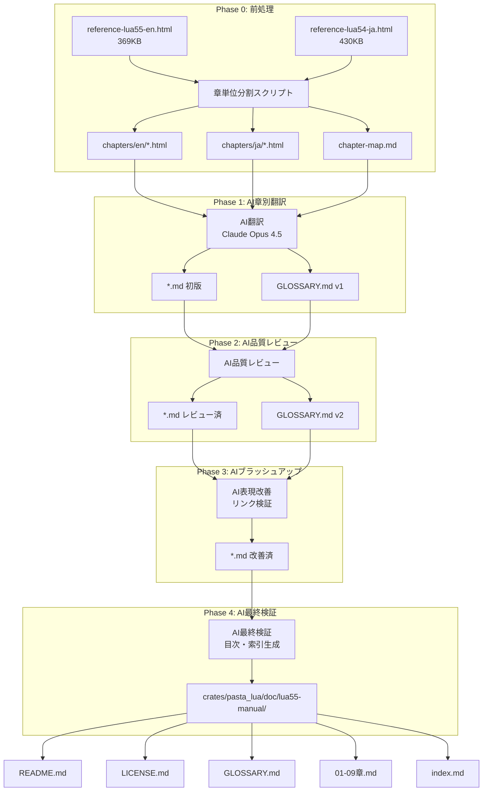
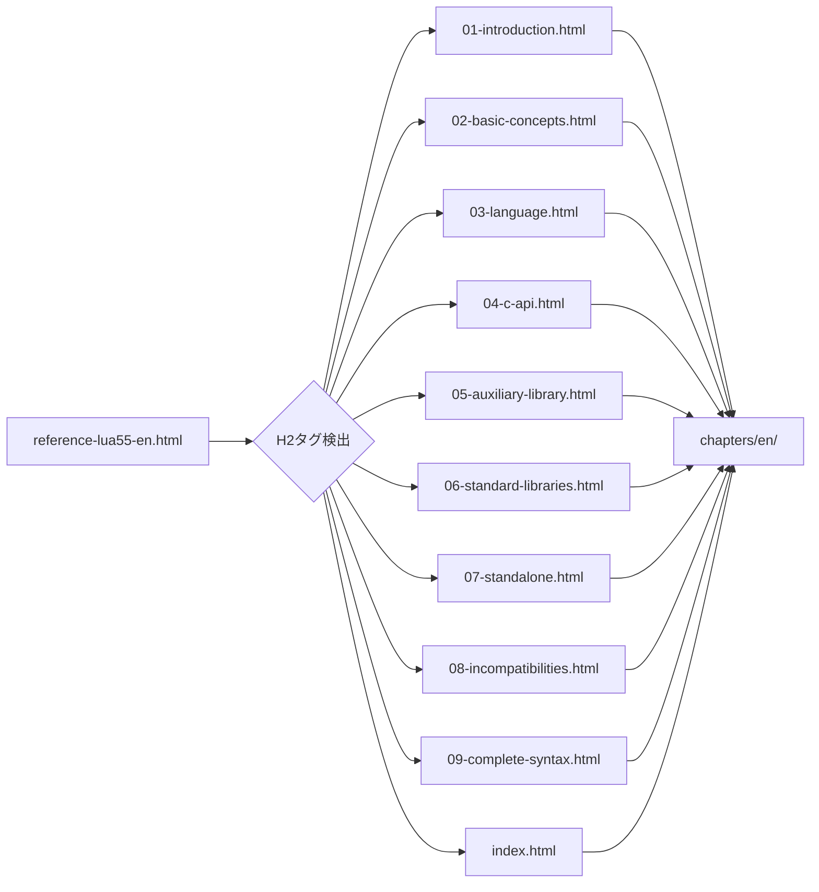
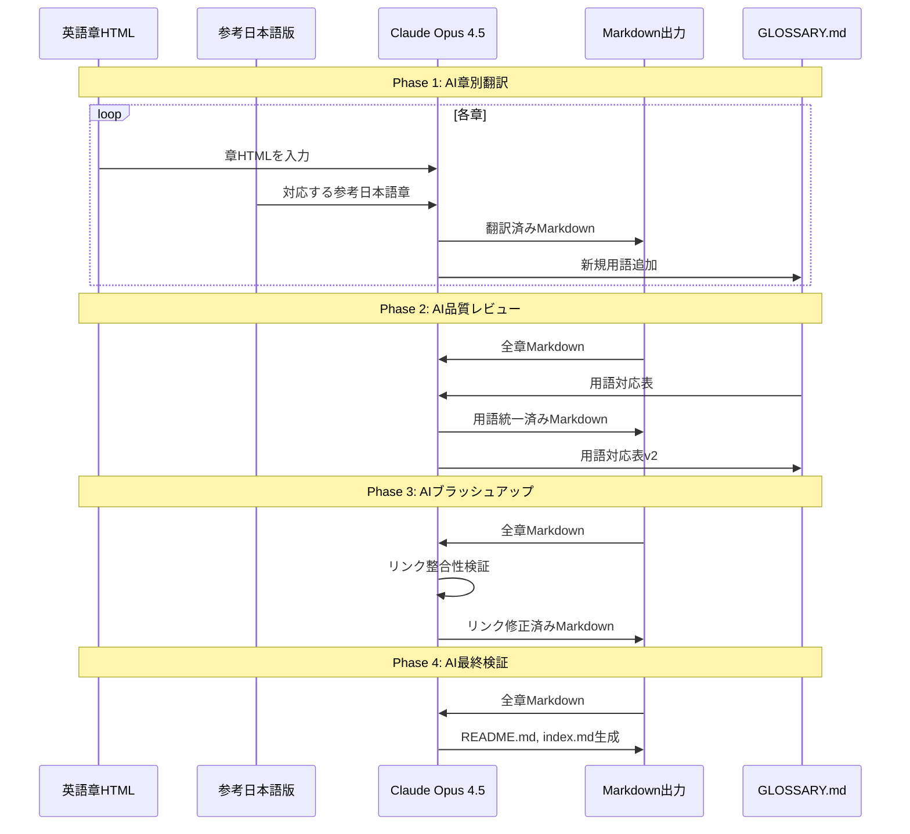

# Technical Design Document

## Overview

**Purpose**: Lua 5.5公式リファレンスマニュアル（約369KB HTML）を日本語に翻訳し、`crates/pasta_lua/doc/lua55-manual/`にMarkdown形式で配置する。Lua開発者が言語仕様を日本語で完全に参照できるようにする。

**Users**: Lua言語を使用する開発者（pasta_luaユーザーに限らず、一般のLua開発者も対象）

**Impact**: pasta_luaクレート配下に新規`doc/lua55-manual/`ディレクトリを作成。既存コードへの変更なし。

### Goals
- Lua 5.5リファレンスマニュアル全文（9章+索引）の日本語翻訳
- AI多段階品質改善による高品質翻訳（人間レビュー不要）
- 用語対応表（GLOSSARY.md）による技術用語の一貫性担保
- Markdown相対リンクによるナビゲーション実装

### Non-Goals
- HTML形式での出力
- 自動翻訳システム/CIパイプラインの構築
- 公式Luaサイトへの貢献
- Lua 5.4以前のバージョン翻訳
- pasta_lua固有の拡張・用語の追加

---

## Architecture

### Architecture Pattern & Boundary Map

本プロジェクトはドキュメンテーションプロジェクトであり、コードアーキテクチャではなく**ドキュメント処理パイプライン**を設計する。



**Architecture Integration**:
- **Selected pattern**: パイプライン処理（Phase 0-4の5段階）
- **Domain boundaries**: 各Phaseは独立した成果物を生成、次Phaseへ引き継ぎ
- **Existing patterns preserved**: pasta_luaの既存ドキュメント構造（README.md, LUA_API.md）に準拠
- **New components rationale**: `doc/lua55-manual/`は言語仕様リファレンスとして独立
- **Steering compliance**: 技術用語は原文維持、日本語技術文書の慣例に従う

### Technology Stack

| Layer | Choice / Version | Role in Feature | Notes |
|-------|------------------|-----------------|-------|
| 翻訳エンジン | Claude Opus 4.5 (LLM) | 翻訳・品質レビュー・検証 | 長文対応、技術翻訳品質 |
| 前処理 | PowerShell/正規表現 | HTML章分割 | `<h2>`タグで分割 |
| 出力形式 | Markdown | 最終ドキュメント | GitHub/VS Code互換 |
| 参考文献 | Lua 5.4日本語版 | 用語統一基準 | dokyumento.jp |
| ソース | Lua 5.5 HTML | 翻訳原文 | lua.org公式 |

---

## System Flows

### Phase 0: 前処理フロー（章単位分割）



### Phase 1-4: AI翻訳サイクル



---

## Requirements Traceability

| Requirement | Summary | Components | Interfaces | Flows |
|-------------|---------|------------|------------|-------|
| 1.1-1.6 | ドキュメント構造 | FileStructure, ChapterSplitter | Markdown出力 | Phase 0, 4 |
| 2.1-2.5 | セクション網羅性 | ChapterTranslator, ContentValidator | 章HTML入力 | Phase 1 |
| 3.1-3.7 | 翻訳品質 | TranslationEngine, GlossaryManager | AI翻訳API | Phase 1-4 |
| 4.1-4.5 | ナビゲーション | LinkGenerator, IndexBuilder | 相対リンク | Phase 3-4 |
| 5.1-5.5 | メンテナンス性 | MetadataManager | ヘッダーメタ | Phase 4 |
| 6.1-6.4 | ライセンス遵守 | LicenseGenerator | LICENSE.md | Phase 4 |

---

## Components and Interfaces

| Component | Domain/Layer | Intent | Req Coverage | Key Dependencies | Contracts |
|-----------|--------------|--------|--------------|------------------|-----------|
| ChapterSplitter | Phase 0 | HTML→章単位分割 | 1.5, 1.6 | reference-lua55-en.html (P0) | Batch |
| ChapterTranslator | Phase 1 | 章別翻訳実行 | 2.1-2.5, 3.1-3.4 | Claude API (P0), 参考日本語版 (P1) | Service |
| GlossaryManager | Phase 1-2 | 用語対応表管理 | 3.1, 3.5, 3.7 | GLOSSARY.md (P0) | State |
| QualityReviewer | Phase 2 | AI品質レビュー | 3.1, 3.6 | 翻訳済みMD (P0), GLOSSARY (P0) | Service |
| LinkValidator | Phase 3 | リンク整合性検証 | 4.4, 4.5 | 全章MD (P0) | Batch |
| IndexBuilder | Phase 4 | 目次・索引生成 | 4.1-4.3 | 全章MD (P0) | Batch |
| LicenseGenerator | Phase 4 | ライセンス文書生成 | 6.1-6.4 | MIT License (P0) | Batch |

### Phase 0: 前処理

#### ChapterSplitter

| Field | Detail |
|-------|--------|
| Intent | HTMLマニュアルを章単位に分割し、AI処理可能なサイズにする |
| Requirements | 1.5, 1.6 |

**Responsibilities & Constraints**
- **Phase 0-1: 章構成比較調査**
  - Lua 5.5英語版の章・節構成（`<h2>`, `<h3>`階層）を抽出
  - Lua 5.4日本語版の対応する章・節構成を抽出
  - 両者の構成差分を分析（章番号・節ID・見出しテキストの対応）
  - 章構成マッピング表（chapter-structure-map.md）を生成
- **Phase 0-2: 章分割実行**
  - `<h2>`タグを境界として主要章を分割
  - 40KB以上の大規模章は`<h3>`タグでサブ分割（マッピング表に基づき対応が取れる位置で分割）
  - 各章・節を`chapters/en/`および`chapters/ja/`に保存
  - 章構成マップ（chapter-map.md）を生成

**Dependencies**
- Inbound: reference-lua55-en.html（369KB）— 翻訳ソース (P0)
- Inbound: reference-lua54-ja.html（430KB）— 参考日本語版 (P0)
- Outbound: chapters/en/*.html — 分割済み章 (P0)
- Outbound: chapters/ja/*.html — 分割済み参考章 (P0)
- Outbound: chapter-structure-map.md — 章構成マッピング表（Lua 5.5 ⇔ 5.4対応関係） (P0)
- Outbound: chapter-map.md — 章構成マップ（ファイル名・タイトル対応表） (P0)

**Contracts**: Batch [x]

##### Batch / Job Contract
- **Trigger**: Phase 0開始時（手動実行）
- **Input**: reference-lua55-en.html, reference-lua54-ja.html
- **Validation**: 各ファイルが存在し、正常なHTML構造であること
- **Output**: 
  - `chapters/en/01-introduction.html` ... `chapters/en/09-complete-syntax.html`, `chapters/en/index.html`
  - `chapters/ja/01-introduction.html` ... `chapters/ja/09-complete-syntax.html`, `chapters/ja/index.html`
  - `chapter-structure-map.md`（Lua 5.5 ⇔ 5.4章構成対応表、構成差分分析結果）
  - `chapter-map.md`（章番号・タイトル・ファイル名対応表）
- **Idempotency**: 再実行で上書き

**章構成マッピング表（chapter-structure-map.md）フォーマット**:
```markdown
# Lua 5.5 ⇔ 5.4 章構成マッピング表

## 1章: Introduction
| Lua 5.5 (en) | Lua 5.4 (ja) | 対応状態 | 備考 |
|--------------|--------------|---------|------|
| 1 – Introduction | 1 – イントロダクション | ✅完全一致 | |

## 2章: Basic Concepts
| Lua 5.5 (en) | Lua 5.4 (ja) | 対応状態 | 備考 |
|--------------|--------------|---------|------|
| 2.1 – Values and Types | 2.1 – 値と型 | ✅完全一致 | |
| 2.2 – Environments and ... | 2.2 – 環境と... | ✅完全一致 | |
...

## 4章: The Application Program Interface（サブ分割対象）
| Lua 5.5 (en) | Lua 5.4 (ja) | 対応状態 | 分割判断 |
|--------------|--------------|---------|----------|
| 4.1 – The Stack | 4.1 – スタック | ✅完全一致 | → 04-c-api/01-stack.html |
| 4.2 – Stack Size | 4.2 – スタックサイズ | ✅完全一致 | → 04-c-api/01-stack.html（統合）|
| 4.3 – Valid and ... | 4.3 – 有効な... | ✅完全一致 | → 04-c-api/02-valid-indices.html |
...
```

**分割ルール**:
| 章番号 | HTMLセクション | 推定サイズ | サブ分割判断 | 出力ファイル |
|--------|---------------|-----------|-------------|-------------|
| 1 | `<h2>1 – Introduction</h2>` | 2-3KB | なし | 01-introduction.html |
| 2 | `<h2>2 – Basic Concepts</h2>` | 30-40KB | なし | 02-basic-concepts.html |
| 3 | `<h2>3 – The Language</h2>` | 40-50KB | **あり**（40KB超） | 03-language/*.html |
| 4 | `<h2>4 – The Application Program Interface</h2>` | 80-100KB | **あり**（40KB超） | 04-c-api/*.html |
| 5 | `<h2>5 – The Auxiliary Library</h2>` | 30-40KB | なし | 05-auxiliary-library.html |
| 6 | `<h2>6 – The Standard Libraries</h2>` | 80-100KB | **あり**（40KB超） | 06-standard-libraries/*.html |
| 7 | `<h2>7 – Lua Standalone</h2>` | 3-5KB | なし | 07-standalone.html |
| 8 | `<h2>8 – Incompatibilities...</h2>` | 5-10KB | なし | 08-incompatibilities.html |
| 9 | `<h2>9 – The Complete Syntax...</h2>` | 5-10KB | なし | 09-complete-syntax.html |
| Index | `<h2>Index</h2>` または末尾 | 10-15KB | なし | index.html |

**サブ分割基準**:
- **閾値**: 40KB以上の章は`<h3>`タグ単位でサブ分割検討
- **対応保証**: chapter-structure-map.mdのマッピング結果に基づき、Lua 5.4日本語版と対応が取れる位置でのみ分割
- **分割禁止**: Lua 5.5と5.4で節構成が異なる箇所は分割せず、1ファイルのまま保持

### Phase 1: AI章別翻訳

#### ChapterTranslator

| Field | Detail |
|-------|--------|
| Intent | 各章HTMLを日本語Markdownに翻訳 |
| Requirements | 2.1-2.5, 3.1-3.4 |

**Responsibilities & Constraints**
- 英語HTML→日本語Markdown変換
- API名・コード例は原文維持
- GLOSSARY.mdの用語に従う
- セクションアンカーを生成

**Dependencies**
- Inbound: chapters/en/*.html — 翻訳ソース (P0)
- Inbound: chapters/ja/*.html — 参考日本語版 (P1)
- Inbound: GLOSSARY.md v0 — 初期用語リスト (P1)
- Outbound: *.md — 翻訳済みMarkdown (P0)
- Outbound: GLOSSARY.md v1 — 更新された用語リスト (P0)
- External: Claude Opus 4.5 API — 翻訳エンジン (P0)

**Contracts**: Service [x]

##### Service Interface
```
翻訳プロンプト仕様:

Input:
  - 英語章HTML（章単位）
  - 対応する参考日本語章（Lua 5.4）
  - 現行GLOSSARY.md
  
Output:
  - 翻訳済みMarkdown
  - 新規用語リスト（GLOSSARY追加分）

翻訳ルール:
  1. API名・関数名は原文維持（例: lua_pushstring）
  2. 予約語は原文維持（例: local, function, if）
  3. コードブロックは原文維持
  4. 技術用語はGLOSSARY準拠
  5. 見出しは日本語化（アンカーは英語ベース）

参考日本語版の利用形態（トークン制限対応）:
  - 小章（<10KB）: 英語章全文 + 日本語参考章全文 + GLOSSARY
  - 中章（10-40KB）: 英語章全文 + 日本語参考章の用語抽出リスト + GLOSSARY
  - 大章（>40KB）: 節単位で分割して小章扱い（後述のサブ分割方針に従う）

トークン制限:
  - 1回のAI呼び出しあたり最大100k tokens
  - 英語HTML（UTF-8）は約1KB = 250 tokens換算
  - 日本語HTML（UTF-8）は約1KB = 200 tokens換算
  - プロンプトテンプレート固定部: 約2k tokens
```

**Implementation Notes**
- 1章あたり1回のAI呼び出し（コンテキスト制限対応）
- 大きな章（4, 6章）は節単位で分割呼び出し可能
- Phase 1タスク実装時に「トークン数見積もり」ステップを追加（各章のHTML実測サイズから算出）

#### GlossaryManager

| Field | Detail |
|-------|--------|
| Intent | 技術用語の一貫性管理 |
| Requirements | 3.1, 3.5, 3.7 |

**Responsibilities & Constraints**
- GLOSSARY.mdの読み取り・更新
- 用語の重複チェック
- 訳語の一貫性検証

**Contracts**: State [x]

##### State Management
- **State model**: GLOSSARY.md（Markdown表形式）
- **Persistence**: ファイルシステム
- **Concurrency strategy**: すべてのPhaseで直列実行（Phase内並列化なし）
- **Update policy**: Phase単位でGLOSSARY.mdを更新（Phase 1→v1, Phase 2→v2）

**GLOSSARY.mdフォーマット**:
```markdown
# 用語対応表（GLOSSARY）

> Lua 5.5 Reference Manual 日本語翻訳における技術用語の対応表

## 基本型
| English | 日本語 | 備考 |
|---------|-------|------|
| nil | nil | そのまま |
| boolean | boolean | そのまま |
| number | number | そのまま |
| integer | 整数 | numberのサブタイプ |
| float | 浮動小数点数 | numberのサブタイプ |
| string | 文字列 | |
| table | テーブル | |
| function | 関数 | |
| userdata | ユーザーデータ | |
| thread | スレッド | コルーチン用 |

## 概念
| English | 日本語 | 備考 |
|---------|-------|------|
| metatable | メタテーブル | |
| metamethod | メタメソッド | |
| garbage collection | ガベージコレクション | GCと略記しない |
| coroutine | コルーチン | |
| closure | クロージャ | |
| upvalue | アップバリュー | |
| environment | 環境 | |
| registry | レジストリ | |
| stack | スタック | |

## C API用語
| English | 日本語 | 備考 |
|---------|-------|------|
| state | ステート | lua_State |
| index | インデックス | スタック位置 |
| pseudo-index | 疑似インデックス | |
| light userdata | ライトユーザーデータ | |
| full userdata | フルユーザーデータ | |

## Lua 5.5新機能
| English | 日本語 | 備考 |
|---------|-------|------|
| global (keyword) | global | 新キーワード、原文維持 |
| type annotation | 型アノテーション | 現在は無視される |
```

**初期用語数**: 50-80語（Phase 1終了時に200-300語へ拡充）

### Phase 2: AI品質レビュー

#### QualityReviewer

| Field | Detail |
|-------|--------|
| Intent | 翻訳済みMarkdownの品質チェック・用語統一 |
| Requirements | 3.1, 3.6 |

**Responsibilities & Constraints**
- 全章の用語一貫性チェック
- API名・コード例の原文維持確認
- 曖昧な表現の修正

**Dependencies**
- Inbound: 全章Markdown v1 — レビュー対象 (P0)
- Inbound: GLOSSARY.md v1 — 用語基準 (P0)
- Outbound: 全章Markdown v2 — レビュー済み (P0)
- Outbound: GLOSSARY.md v2 — 更新済み (P0)

**Contracts**: Service [x]

##### Service Interface
```
レビュープロンプト仕様:

Input:
  - 翻訳済みMarkdown（全章）
  - GLOSSARY.md v1
  
Output:
  - 修正済みMarkdown
  - 用語変更リスト
  - レビュー報告書

レビュー観点:
  1. GLOSSARY.mdの用語が全章で統一されているか
  2. API名が原文維持されているか
  3. コードブロック内が変更されていないか
  4. 技術的に不正確な翻訳がないか
  5. 文体が一貫しているか（です・ます調）
```

### Phase 3: AIブラッシュアップ

#### LinkValidator

| Field | Detail |
|-------|--------|
| Intent | 章間リンク・セクションアンカーの整合性検証 |
| Requirements | 4.4, 4.5 |

**Responsibilities & Constraints**
- 相対リンクの存在確認
- セクションアンカーの命名規則統一
- 壊れたリンクの修正

**Dependencies**
- Inbound: 全章Markdown v2 — 検証対象 (P0)
- Outbound: 全章Markdown v3 — リンク修正済み (P0)

**Contracts**: Batch [x]

##### Batch / Job Contract
- **Trigger**: Phase 3開始時
- **Input**: 全章Markdownファイル
- **Validation**: 各リンク先が存在すること
- **Output**: リンク修正済みMarkdown、リンク検証報告書
- **Idempotency**: 再実行で上書き

**リンク形式規約**:
- ファイル間リンク: `[§2.1 値と型](./02-basic-concepts.md#21--値と型)`
- セクションアンカー: `#<section-id>`（見出しテキストのハイフン区切り小文字化）
- 外部リンク: 原文URLを維持（lua.org）

### Phase 4: AI最終検証

#### IndexBuilder

| Field | Detail |
|-------|--------|
| Intent | 目次・関数索引・README生成 |
| Requirements | 4.1-4.3 |

**Responsibilities & Constraints**
- README.md（目次・概要）生成
- index.md（関数・型索引）生成
- パンくずリストテンプレート提供

**Dependencies**
- Inbound: 全章Markdown v3 — 索引対象 (P0)
- Outbound: README.md — 目次 (P0)
- Outbound: index.md — 関数索引 (P0)

**Contracts**: Batch [x]

##### Batch / Job Contract
- **Trigger**: Phase 4開始時
- **Input**: 全章Markdownファイル
- **Output**: README.md, index.md
- **Idempotency**: 再実行で上書き

**README.mdテンプレート**:
```markdown
# Lua 5.5 リファレンスマニュアル（日本語訳）

> **原文**: [Lua 5.5 Reference Manual](https://www.lua.org/manual/5.5/)  
> **翻訳日**: YYYY-MM-DD  
> **ライセンス**: [MIT License](./LICENSE.md)  
> **注意**: これは非公式の日本語翻訳です。

## 目次

1. [イントロダクション](./01-introduction.md)
2. [基本概念](./02-basic-concepts.md)
   - [2.1 値と型](./02-basic-concepts.md#21--値と型)
   - [2.2 環境とグローバル環境](./02-basic-concepts.md#22--環境とグローバル環境)
   ...
3. [言語仕様](./03-language.md)
...
9. [完全構文](./09-complete-syntax.md)

- [用語対応表](./GLOSSARY.md)
- [索引](./index.md)
```

#### LicenseGenerator

| Field | Detail |
|-------|--------|
| Intent | ライセンス文書・著作権表示生成 |
| Requirements | 6.1-6.4 |

**Responsibilities & Constraints**
- MIT License原文の組み込み
- 非公式翻訳の明記
- 原著作権表示の保持

**Contracts**: Batch [x]

**LICENSE.mdテンプレート**:
```markdown
# License

## Lua License (MIT)

Copyright © 2020–2025 Lua.org, PUC-Rio.

Permission is hereby granted, free of charge, to any person obtaining a copy
of this software and associated documentation files (the "Software"), to deal
in the Software without restriction, including without limitation the rights
to use, copy, modify, merge, publish, distribute, sublicense, and/or sell
copies of the Software, and to permit persons to whom the Software is
furnished to do so, subject to the following conditions:
...

## 翻訳について

この日本語翻訳は非公式のものであり、Lua.orgによる公式翻訳ではありません。
翻訳の正確性については保証いたしません。

Translated by: pasta project contributors
Translation date: YYYY-MM-DD
```

---

## Data Models

### 出力ファイル構成

```
crates/pasta_lua/doc/lua55-manual/
├── README.md                    # 目次・概要
├── LICENSE.md                   # Luaライセンス
├── GLOSSARY.md                  # 用語対応表（200-300語）
├── 01-introduction.md           # 1章: イントロダクション
├── 02-basic-concepts.md         # 2章: 基本概念
├── 03-language/                 # 3章: 言語仕様（サブ分割）
│   ├── README.md                # 3章目次
│   ├── 01-lexical-conventions.md
│   ├── 02-variables.md
│   └── ...
├── 04-c-api/                    # 4章: C API（サブ分割、大規模）
│   ├── README.md                # 4章目次
│   ├── 01-stack.md
│   ├── 02-valid-indices.md
│   └── ...
├── 05-auxiliary-library.md      # 5章: 補助ライブラリ
├── 06-standard-libraries/       # 6章: 標準ライブラリ（サブ分割、大規模）
│   ├── README.md                # 6章目次
│   ├── 01-basic-functions.md
│   ├── 02-coroutine.md
│   └── ...
├── 07-standalone.md             # 7章: スタンドアロンLua
├── 08-incompatibilities.md      # 8章: 非互換性
├── 09-complete-syntax.md        # 9章: 完全構文
└── index.md                     # 索引（関数・型一覧）
```

**注記**: サブ分割は章構成マッピング表（chapter-structure-map.md）の分析結果に基づき、Lua 5.4日本語版と対応が取れる位置でのみ実施

### 作業用中間ファイル構成

```
.kiro/specs/lua55-reference-manual-ja/
├── spec.json                    # 仕様メタデータ
├── requirements.md              # 要件定義
├── gap-analysis.md              # ギャップ分析
├── design.md                    # 本設計書
├── research.md                  # 調査ログ
├── tasks.md                     # タスク定義
├── reference-lua55-en.html      # Lua 5.5英語原文（369KB）
├── reference-lua54-ja.html      # Lua 5.4日本語参考（430KB）
├── chapter-structure-map.md     # 章構成マッピング表（Lua 5.5 ⇔ 5.4対応）
├── chapter-map.md               # 章構成マップ
└── chapters/
    ├── en/                      # 分割済み英語章
    │   ├── 01-introduction.html
    │   ├── 02-basic-concepts.html
    │   ├── 03-language/
    │   │   ├── 01-lexical-conventions.html
    │   │   └── ...
    │   ├── 04-c-api/
    │   │   ├── 01-stack.html
    │   │   └── ...
    │   └── ...
    └── ja/                      # 分割済み日本語参考章（同構成）
        └── ...
```

### Markdownファイルヘッダー仕様

各章Markdownファイルの冒頭に以下のメタ情報を含める：

```markdown
<!-- 
  Source: https://www.lua.org/manual/5.5/manual.html#<section>
  Reference: https://lua.dokyumento.jp/manual/5.4/manual.html#<section>
  Translated: YYYY-MM-DD
  Reviewer: AI (Claude Opus 4.5)
-->

# <章タイトル>

[← 前章: <前章タイトル>](./<前章ファイル>.md) | [目次](./README.md) | [次章: <次章タイトル> →](./<次章ファイル>.md)

---
```

---

## 実装フェーズ別タスク概要

### Phase 0: 前処理（2-4h）
1. **章構成比較調査**: Lua 5.5英語版とLua 5.4日本語版の章・節構成を抽出・比較
2. **章構成マッピング表作成**: chapter-structure-map.md生成（対応関係・差分分析）
3. **章分割スクリプト作成**: HTMLパーサー/正規表現でマッピング表に基づく分割処理
4. reference-lua55-en.html を10+ファイルに分割（40KB超の章はサブ分割）
5. reference-lua54-ja.html を対応するファイルに分割
6. chapter-map.md 生成

### Phase 1: AI章別翻訳（6-12h）
1. GLOSSARY.md 初版作成（50-80語）
2. トークン数見積もり（各章HTML実測サイズから算出、参考日本語版利用形態決定）
3. 各章を順次翻訳（1-9章 + index）
4. 翻訳中に新規用語をGLOSSARYに追加
5. 初版Markdown 10ファイル生成

### Phase 2: AI品質レビュー（8-16h）
1. 全章の用語一貫性チェック
2. API名・コード例の原文維持確認
3. GLOSSARY.md v2 更新（200-300語）
4. レビュー済みMarkdown生成

### Phase 3: AIブラッシュアップ（8-16h）
1. 章間リンク・アンカー検証
2. 壊れたリンク修正
3. 表現の自然さ改善
4. ブラッシュアップ済みMarkdown生成

### Phase 4: AI最終検証（8-16h）
1. README.md（目次・概要）生成
2. index.md（関数索引）生成
3. LICENSE.md 生成
4. 全体整合性最終確認
5. `crates/pasta_lua/doc/lua55-manual/` に配置

---

## 備考

- 本設計は**ドキュメンテーションプロジェクト**であり、Rustコードの変更は発生しない
- 全工程でAI（Claude Opus 4.5）を使用し、人間レビューは不要
- **すべてのPhaseで直列実行**（並列化なし、章は順次処理）
- 想定総工数: 32-60時間（Phase 0-4合計）
