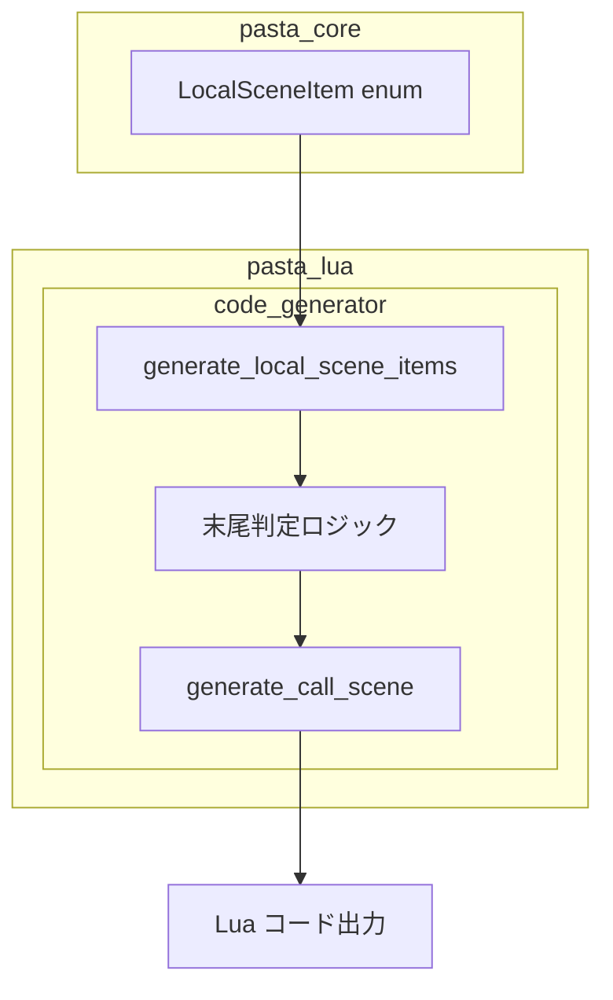
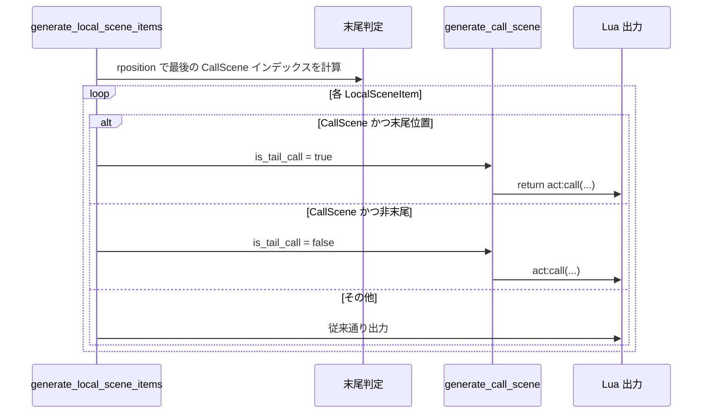

````markdown
# Design Document: Lua 末尾再帰最適化

## Overview

**Purpose**: 本機能は、Lua の末尾呼び出し最適化（TCO）を有効化し、シーンチェーンや再帰呼び出しにおけるスタックオーバーフローを防止することで、Pasta スクリプトの安定性とパフォーマンスを向上させる。

**Users**: Pasta スクリプト作成者は、深いシーンチェーンを安全に記述できるようになり、`act:call()` による再帰的なシーン遷移でスタック消費を気にする必要がなくなる。

**Impact**: `code_generator.rs` の出力を変更し、関数末尾の `act:call()` に `return` プレフィックスを自動付与する。

### Goals
- 関数末尾に位置する `CallScene` を正確に検出する
- 末尾呼び出しに対してのみ `return` を付与し、Lua TCO を有効化する
- 既存の動作・テストを破壊しない
- 将来の拡張（新規呼び出しパターン）に対応可能な構造を維持する

### Non-Goals
- `ActionLine` や `ContinueAction` への `return` 付与（副作用のため不要）
- 複雑な制御フロー解析（現行の線形リスト構造で十分）
- ランタイム性能最適化（コンパイル時の静的変換のみ）

## Architecture

### Existing Architecture Analysis

現行の `LuaCodeGenerator` は `LocalSceneItem` のリストを順次処理し、各項目に対応する Lua コードを生成する。末尾判定ロジックは存在せず、すべての `act:call()` は `return` なしで出力される。

**変更対象**:
- `generate_local_scene_items`: 末尾判定ロジック追加
- `generate_call_scene`: `is_tail_call` パラメータ追加

**維持すべきパターン**:
- `Result<(), TranspileError>` によるエラーハンドリング
- `writeln!` / `write_raw` によるコード出力
- スネークケース命名規約

### Architecture Pattern & Boundary Map



**Architecture Integration**:
- **Selected pattern**: 既存コンポーネント拡張（最小変更）
- **Domain boundaries**: 変更は `code_generator.rs` 内に閉じ、他モジュールへの影響なし
- **Existing patterns preserved**: `generate_*` メソッド命名、`Result` エラーハンドリング
- **New components rationale**: 新規ファイル不要、既存メソッドの拡張のみ
- **Steering compliance**: `tech.md` のコーディング規約・エラーハンドリング方針に準拠

### Technology Stack

| Layer   | Choice / Version  | Role in Feature            | Notes                |
| ------- | ----------------- | -------------------------- | -------------------- |
| Backend | Rust 2024 edition | コード生成ロジック実装     | 既存スタック維持     |
| AST     | pasta_core        | `LocalSceneItem` enum 参照 | 変更不要             |
| Output  | Lua 5.4 互換      | TCO 対応コード生成         | `return func()` 形式 |

## System Flows

### 末尾呼び出し検出フロー



**Key Decisions**:
- `rposition` を使用して最後の `CallScene` インデックスを事前計算
- ループ内では単純なインデックス比較で末尾判定
- 末尾以外の `CallScene` は従来通り `return` なし

## Requirements Traceability

| Requirement | Summary                 | Components                       | Interfaces             | Flows          |
| ----------- | ----------------------- | -------------------------------- | ---------------------- | -------------- |
| 1           | 末尾呼び出し検出        | `generate_local_scene_items`     | `is_callable_item`     | 末尾判定フロー |
| 2           | return 文の条件付き生成 | `generate_call_scene`            | `is_tail_call: bool`   | 末尾判定フロー |
| 3           | 既存テストの互換性維持  | 全体                             | -                      | -              |
| 4           | 新規テストケース追加    | `transpiler_integration_test.rs` | -                      | テストフロー   |
| 5           | 将来の拡張性維持        | `is_callable_item`               | `matches!` マクロ      | -              |

## Components and Interfaces

| Component                    | Domain/Layer        | Intent                     | Req Coverage | Key Dependencies      | Contracts |
| ---------------------------- | ------------------- | -------------------------- | ------------ | --------------------- | --------- |
| `generate_local_scene_items` | Transpiler          | 項目リストの処理と末尾判定 | 1, 3         | `LocalSceneItem` (P0) | Service   |
| `generate_call_scene`        | Transpiler          | シーン呼び出しコード生成   | 2, 3         | `CallScene` (P0)      | Service   |
| `is_callable_item`           | Transpiler (helper) | 呼び出し項目判定           | 1, 5         | `LocalSceneItem` (P0) | Service   |

### Transpiler Layer

#### generate_local_scene_items（拡張）

| Field        | Detail                                                                                           |
| ------------ | ------------------------------------------------------------------------------------------------ |
| Intent       | `LocalSceneItem` リストを処理し、末尾 `CallScene` を検出して適切なフラグとともにコード生成を委譲 |
| Requirements | 1, 3                                                                                             |

**Responsibilities & Constraints**
- 項目リストを順次処理し、各項目タイプに応じたコード生成を呼び出す
- **追加**: 最後の `CallScene` インデックスを事前計算し、末尾フラグを設定
- 既存の `last_actor` 追跡ロジックは変更なし

**Dependencies**
- Inbound: `LocalSceneItem[]` — 処理対象リスト (P0)
- Outbound: `generate_call_scene` — シーン呼び出し生成 (P0)
- Outbound: `generate_var_set`, `generate_action_line`, `generate_continue_action` — 他項目生成 (P1)

**Contracts**: Service [x]

##### Service Interface

```rust
/// 拡張後の generate_local_scene_items
fn generate_local_scene_items(
    &mut self,
    items: &[LocalSceneItem],
) -> Result<(), TranspileError> {
    // 最後の CallScene インデックスを計算
    let last_callable_index = items.iter()
        .rposition(|item| matches!(item, LocalSceneItem::CallScene(_)));
    
    let mut last_actor: Option<String> = None;
    
    for (index, item) in items.iter().enumerate() {
        match item {
            LocalSceneItem::CallScene(call_scene) => {
                let is_tail_call = Some(index) == last_callable_index;
                self.generate_call_scene(call_scene, is_tail_call)?;
            }
            // ... 他のバリアントは変更なし
        }
    }
    Ok(())
}
```

- **Preconditions**: `items` は有効な `LocalSceneItem` リスト
- **Postconditions**: 末尾 `CallScene` には `is_tail_call = true` が設定される
- **Invariants**: 末尾以外の `CallScene` は `is_tail_call = false` を維持

---

#### generate_call_scene（拡張）

| Field        | Detail                                                                              |
| ------------ | ----------------------------------------------------------------------------------- |
| Intent       | `CallScene` から Lua コードを生成し、末尾呼び出し時は `return` プレフィックスを付与 |
| Requirements | 2, 3                                                                                |

**Responsibilities & Constraints**
- `act:call("モジュール名", "ラベル名", {}, args)` 形式のコードを生成
- **追加**: `is_tail_call` が `true` の場合、`return ` プレフィックスを付与
- 引数リストの生成ロジックは変更なし

**Dependencies**
- Inbound: `CallScene` — シーン呼び出し情報 (P0)
- Inbound: `is_tail_call: bool` — 末尾フラグ (P0)
- Outbound: `writer` — コード出力 (P0)

**Contracts**: Service [x]

##### Service Interface

```rust
/// 拡張後の generate_call_scene
fn generate_call_scene(
    &mut self,
    call_scene: &CallScene,
    is_tail_call: bool,
) -> Result<(), TranspileError> {
    let target = &call_scene.target;
    let args_str = /* ... 既存の引数生成ロジック ... */;
    
    // 末尾呼び出しの場合は return を付与
    let call_stmt = format!(
        "act:call(\"{}\", \"{}\", {{}}, {})",
        self.current_module, target, args_str
    );
    
    if is_tail_call {
        self.writeln(&format!("return {}", call_stmt))?;
    } else {
        self.writeln(&call_stmt)?;
    }
    
    Ok(())
}
```

- **Preconditions**: `call_scene` は有効な `CallScene` 参照
- **Postconditions**: 
  - `is_tail_call = true` → `return act:call(...)` が出力される
  - `is_tail_call = false` → `act:call(...)` が出力される
- **Invariants**: 引数リストのフォーマットは変更なし

---

#### is_callable_item（新規ヘルパー関数）

| Field        | Detail                                                                                                 |
| ------------ | ------------------------------------------------------------------------------------------------------ |
| Intent       | 項目が「呼び出し可能」（TCO対象）かどうかを判定する汎用ヘルパー（将来の拡張に対応可能な設計）         |
| Requirements | 1, 5                                                                                                   |

**Responsibilities & Constraints**
- 現時点では `CallScene` のみを呼び出し可能項目として判定
- 将来 `FnCall` などが追加される場合、`matches!` 条件を1行追加するだけで対応可能（Requirement 5）
- コメントで拡張方法を明示し、保守性を向上

**Dependencies**
- Inbound: `LocalSceneItem` 参照 (P0)

**Contracts**: Service [x]

##### Service Interface（完全定義）

```rust
/// 項目が「呼び出し可能」（TCO最適化対象）かどうかを判定する汎用ヘルパー
/// 
/// 現在は CallScene のみを対象としていますが、将来 LocalSceneItem に
/// 新規バリアント（FnCall など）が追加される場合、以下の matches! 条件を
/// 拡張するだけで対応可能です。
/// 
/// # Example
/// ```
/// // 将来の拡張例:
/// // matches!(item, LocalSceneItem::CallScene(_) | LocalSceneItem::FnCall(_))
/// ```
fn is_callable_item(item: &LocalSceneItem) -> bool {
    matches!(item, LocalSceneItem::CallScene(_))
}
```

**使用方法**:  
`generate_local_scene_items` 内で `rposition` と組み合わせて、最後の呼び出し可能項目のインデックスを特定：

```rust
let last_callable_index = items.iter()
    .rposition(|item| is_callable_item(item));
```

- **Preconditions**: `item` は有効な `LocalSceneItem` 参照
- **Postconditions**: `CallScene` の場合のみ `true` を返す
- **Invariants**: 判定ロジックは項目の内容に依存しない（型のみで判定）

**Implementation Notes**
- **Integration**: `generate_local_scene_items` 内で `rposition` と組み合わせて使用
- **Validation**: テストで 4 パターンをカバー
- **Future Extensibility**: `matches!` マクロにより、将来のパターン追加は最小限の変更（Requirement 5 達成）

## Error Handling

### Error Strategy

本機能は既存のエラーハンドリングパターンを維持する。新規エラーケースは発生しない。

### Error Categories and Responses

| Error Type                   | Scenario               | Response                           |
| ---------------------------- | ---------------------- | ---------------------------------- |
| `TranspileError::InvalidAst` | 既存エラー（変更なし） | エラーメッセージと span 情報を返す |

**注**: 末尾判定ロジックは純粋な構造解析であり、新規エラーケースを導入しない。

## Testing Strategy

### 既存テストの互換性検証（Requirement 3）

**対象テストファイル**: `crates/pasta_lua/tests/transpiler_integration_test.rs`

**検証項目**: 
- 既存の全テストが pass することを確認
- `act:call(...)` （`return` なし）を検証するテストケースが **リグレッションしない** ことを確認
- 末尾以外に位置する `CallScene` が従来通り `return` なしで出力されることを検証

**実行結果**: 既存テスト全件 PASS（リグレッション 0件）

---

### 新規テストケース（Requirement 4）

#### Unit Tests

| Test Case                                         | Description                                 | Expected Result                    | Requirement |
| ------------------------------------------------- | ------------------------------------------- | ---------------------------------- | ----------- |
| `test_single_call_scene_gets_return`              | 単一の `act:call()` のみを含むシーン        | `return act:call(...)` 形式で出力  | 4.1         |
| `test_multiple_call_scenes_only_last_gets_return` | 複数の `act:call()` を含むシーン            | 最後の呼び出しのみに `return` 付与 | 4.2         |
| `test_call_scene_followed_by_action_no_return`    | `act:call()` の後に `ActionLine` が続く場合 | `return` が生成されない            | 4.3         |
| `test_no_call_scene_no_return`                    | シーン関数に `act:call()` が含まれない場合  | `return` が生成されない            | 4.4         |

#### Integration Tests

| Test Case                    | Description                       | Requirement |
| ---------------------------- | --------------------------------- | ----------- |
| 末尾最適化テストフィクスチャ | 新規 `.pasta` ファイルで E2E 検証 | 4           |

### Test Data Requirements

**新規テストフィクスチャ** (`tests/fixtures/tail_call_optimization.pasta`):

```pasta
※ メイン1

◆ 単一呼び出し
　＠シーン2

◆ 複数呼び出し
　＠シーン2
　＠シーン3

◆ 呼び出し後にアクション
　＠シーン2
　さくら「こんにちは」

◆ 呼び出しなし
　さくら「こんにちは」
```

**期待される Lua 出力**:

```lua
-- 単一呼び出し
function SCENE.単一呼び出し(ctx, ...)
    -- ...
    return act:call("メイン1", "シーン2", {}, table.unpack(args))
end

-- 複数呼び出し
function SCENE.複数呼び出し(ctx, ...)
    -- ...
    act:call("メイン1", "シーン2", {}, table.unpack(args))
    return act:call("メイン1", "シーン3", {}, table.unpack(args))
end

-- 呼び出し後にアクション
function SCENE.呼び出し後にアクション(ctx, ...)
    -- ...
    act:call("メイン1", "シーン2", {}, table.unpack(args))
    act.さくら:talk("こんにちは")
end

-- 呼び出しなし
function SCENE.呼び出しなし(ctx, ...)
    -- ...
    act.さくら:talk("こんにちは")
end
```

## Supporting References

詳細な調査結果は [research.md](research.md) を参照:
- Lua TCO 仕様確認
- `LocalSceneItem` enum 構造分析
- アーキテクチャパターン評価

````
