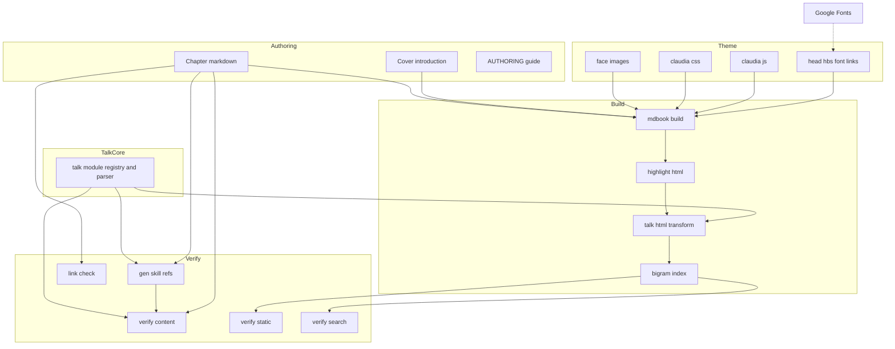
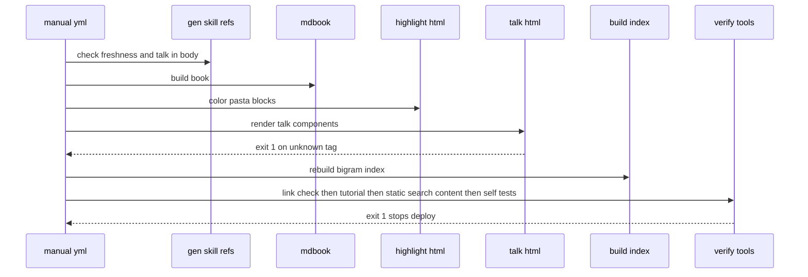
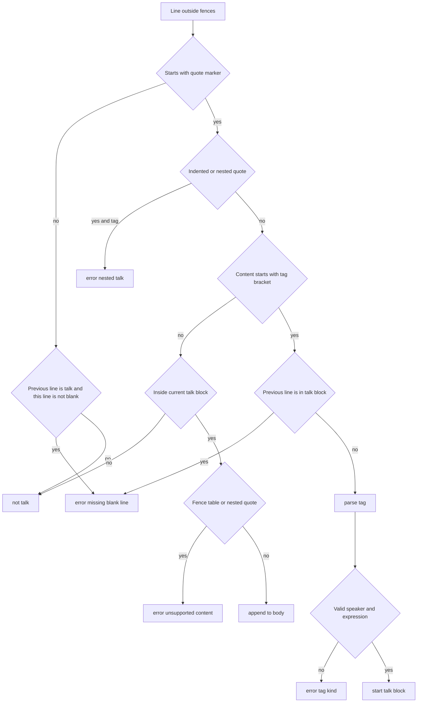
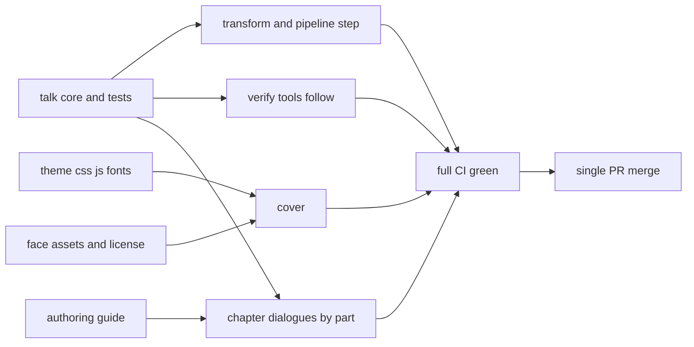

# Design Document: manual-claudia-theme

## Overview

**Purpose**: pasta 利用者マニュアル（mdBook）を、ponapalt/claudia の意匠にそろえた「Claudia のマニュアル」へ着せ替える。Claudia とアンソニーの台詞を顔アイコン付きの吹き出し（台詞部品）として Markdown から書けるようにし、全 47 章の導入・締めを二人の掛け合いへ置き換え、表紙に扉を置く。

**Users**: 読者（ゴースト作者・コントリビュータ）は全ページで新しいテーマと台詞部品を見る。執筆者（AI エージェントを含む）は台詞部品の記法と執筆規約を使い、管理者は追従した検査・生成ツールと CI で不正を公開前に止める。下流 spec `getting-started-story-guide` はこの記法でガイド全編を書く。

**Impact**: サイト生成器は mdBook 0.5.3 のまま。`book.toml` に `additional-css`・`additional-js` を足し、`head.hbs` の tokenizer マーカー外に Google Fonts の `<link>` を足す。`mdbook build` の後段に台詞部品の HTML 変換（着色と同じ build-time 加工）を 1 段追加する。章の説明本体（区切り `---` の間）とスキル生成物は変えない。

### Goals

- ライト（`light`）とダーク（`navy`）の 2 テーマで、参考サイトの配色・字体・角丸・区切り・枠をマニュアル全体（全章・`print.html`・検索結果）に適用する。
- 純 Markdown の記法（引用ブロック＋先頭の `【…】` タグ）で台詞部品を書け、build-time 変換で吹き出し HTML になる。
- 話し手と表情を 1 つの Node モジュールで定義し、変換・検査・自己テストがそこから import する。
- 全 47 章の導入・締めが二人の掛け合いであることを機械検査し、不正を CI で止める。
- 既存の検索・着色・目次・印刷・`file://`・CI の検査をすべて通したまま、完成形を 1 回で出荷する。

### Non-Goals

- 入門ガイド本文の物語化（`getting-started-story-guide`）。
- 章の説明本体の書き換え（導入・締めの記法の置き換えを除く）、既存章の説明本体への台詞部品の追加。
- 検索の索引側 tokenizer・クエリ側 tokenizer・`build-index.mjs` の変更。
- 立ち絵の取り込み、第三の話し手（emo2 など）の追加。
- `rust`・`coal`・`ayu` テーマの Claudia 配色化。
- Web フォントの同梱・サブセット化、サイト生成器の移行、`index.hbs` の上書き。

## Boundary Commitments

### This Spec Owns

- **テーマ**: `book/theme/claudia.css`（配色トークン・字体・部品の意匠・狭幅・印刷）、`book/theme/claudia.js`（テーマメニューの並べ替え）、`book/theme/head.hbs` の Web フォント読み込み部（tokenizer の `BEGIN/END` マーカー外）、`book/book.toml` の `additional-css`／`additional-js` 登録。
- **台詞部品**: 記法の文法、話し手・表情の登録簿（`book/tools/talk/talk.mjs`）、出力 HTML の構造（`book/tools/talk/talk-html.mjs`）。登録簿は話し手・表情の唯一の定義である。
- **素材**: `book/src/img/claudia/` の顔アイコン 16 枚と `LICENSE.txt`（出典・Unlicense 原文）。
- **章の導入・締め**: 全 47 章の導入・締めの掛け合いと、表紙（`introduction.md`）の扉・クレジット。
- **規約と検査の追従**: `book/AUTHORING.md` の台詞部品の節と基準ボイスサンプル、`verify-content`（T 系）・`verify-static`・`verify-search`・`gen-skill-refs`（`chapterRegions`・`talk-in-body`）の追従、各自己テスト、`manual.yml` の変換ステップ。
- **旧版の保存**: `manual.yml` の旧版生成段（着せ替え前の固定コミットを `classic/` の下に生成する。要件 11）。

### Out of Boundary

- 章の説明本体（区切り `---` の間）の文言。
- 検索の仕組み: `tokenize.mjs`・`head.hbs` の `BEGIN/END canonical bigram tokenize` ブロック・`build-index.mjs`・`searcher.js`。台詞の `【…】` タグ文字列が索引に入ることは仕組みを変えずに受け入れる。
- 着色の仕組み: `highlight-html.mjs`・`scope-map.mjs`・`neutralizer.mjs`（クラス写像は変えず、色だけを CSS で上書きする）。
- mdBook 本体のテンプレート（`index.hbs`）・`book.js` の挙動、`rust`・`coal`・`ayu` の配色。
- スキル `references/` の生成物（本 spec の後も再生成不要であることが完了条件）。
- `getting-started-story-guide` が書く `AUTHORING.md` の節と入門ガイド本文。

### Allowed Dependencies

- mdBook 0.5.3 の公開拡張点: `additional-css`・`additional-js`・`theme/head.hbs`・テーマ CSS 変数（`variables.css` の 40 変数）・テーマメニューの DOM id（`mdbook-theme-{light,rust,coal,navy,ayu}`）。
- `book/tools/link-check.mjs` の `maskFences`（フェンス判定の規則を二重化しない）。
- 依存方向（左は右を import しない）: `link-check.mjs` → `talk/talk.mjs` → `gen-skill-refs.mjs` → `verify-content.mjs`。`talk/talk-html.mjs` は `talk/talk.mjs` のみに依存する。
- Google Fonts（`fonts.googleapis.com`・`fonts.gstatic.com`）を任意の外部通信として 1 経路だけ許す。それ以外の外部通信・npm 依存は追加しない（新規ツールは Node 標準のみ）。
- 素材の出どころは ponapalt/claudia（Unlicense）の `site/img/f*.png` に限る。

### Revalidation Triggers

- **記法の文法・登録簿の形の変更**（タグの区切り、話し手名、表情名、`FACE_DIR`）: `getting-started-story-guide` と `AUTHORING.md`・全章の再検査が要る。
- **出力 HTML 構造・CSS クラス名の変更**（`.talk`・`.talk-{id}`・`.talk-face`・`.talk-bubble`）: `claudia.css` と下流の章の見た目の再確認が要る。
- **`chapterRegions`／`extractBody` の規則変更**: 生成物の鮮度（`gen-skill-refs --check`）と内部設計章の I-structure の再検査が要る。
- **mdBook の版上げ**: テーマメニューの DOM id、`additional-*` の出力パス、検索索引への引用ブロック本文の取り込み、`print.html` の画像参照の書き換えの 4 点を再確認する。
- **CI 段の順序変更**（`manual.yml`）: 変換 → 索引再生成 → 検証の順を崩すと `verify-static` の台詞出力検査が落ちる。

## Architecture

### Existing Architecture Analysis

- `book/` は mdBook 0.5.3 の静的サイト。`mdbook build` の後に Node スクリプトが出力 HTML を加工する（`highlight-html.mjs`: 決定論・冪等・失敗で exit 1）。この型を台詞部品の変換に再利用する。
- 検査は依存ゼロの Node スクリプト群（`verify-*`・`link-check`・`gen-skill-refs`）で、CI `manual.yml` が順に実行し 1 件の失敗で公開を止める。口調判定（`findVoice`）と章構造（`extractBody`）は `gen-skill-refs.mjs` に一本化されている。新記法の判定も「1 か所で定義し各ツールが import する」規律に従う。
- 実測（mdBook 0.5.4 ローカル、`research.md`「設計フェーズの調査」）: 引用ブロック本文と、HTML ブロック内の Markdown の本文は検索索引に入る。`print.html` では章内 HTML の `` が根基準へ書き換わる。`additional-css`／`additional-js` はハッシュ付きの相対パス（`theme/claudia-<hash>.css`）で全ページと `print.html` に入り、CSS は着色 CSS の後、JS は `book.js` の後に読み込まれる。`head.hbs` は mdBook の CSS より前に展開される。
- 全 47 章が「H1 → 導入（段落 1〜4 行）→ `---` → 本文 → `---` → 締め（段落 1〜3 行）」で統一されており、導入・締めに引用ブロック・HTML を含む章は 0。本文中に `【` で始まる引用ブロックは無い。

### Architecture Pattern & Boundary Map

選んだパターンは「Markdown 記法＋build-time HTML 変換＋単一登録簿」。記法は純 Markdown なので mdBook の描画（強調・リンク・インラインコード）と検索索引・`link-check`・`gen-skill-refs` がそのまま効き、見た目だけを後段の変換と CSS が担う。



**Architecture Integration**:
- 選択理由: 案 B（引用ブロック記法＋build-time 変換）は R4.1（HTML を書かない）・R3.6（本文の強調・リンク）・R8.2（索引）を同時に満たし、既存の build-time 加工と Markdown ベースの検査に無改修で噛み合う。比較は `research.md`。
- 責務の分離: 見た目は Theme（CSS・JS・フォント・画像）、記法の意味は TalkCore、HTML 化は TalkHtml、章の文言は Authoring、正しさの保証は Verify。TalkCore は他の層を import しない。
- 維持する既存パターン: build-time 加工の型（決定論・冪等・exit 1）、依存ゼロの検査、判定の一本化、`head.hbs` の逐語ミラー規律（マーカー内を触らない）、相対参照による `file://` 両立。
- 新規部品の理由: 登録簿（R4.8 の 1 か所定義）、変換（R3 の表示）、テーマ CSS/JS（R1・R2・R9）。それ以外の抽象（プラグイン機構・設定ファイル）は作らない。
- Steering 適合: マニュアルが利用者向け情報の権威（`tech.md`）、Manual Sync Gate（`workflow.md` DoD 6）で `gen-skill-refs --check` と `link-check` を通す。

### Technology Stack

| Layer | Choice / Version | Role in Feature | Notes |
|-------|------------------|-----------------|-------|
| サイト生成 | mdBook 0.5.3（CI 固定） | Markdown → HTML、テーマ変数、`additional-css/js`、検索索引 | 変更なし。ローカル検証は 0.5.4 で実施 |
| ビルド後加工 | Node 20（CI）／Node 標準ライブラリ | 台詞部品の HTML 変換 `talk-html.mjs` | 新規 npm 依存なし |
| 検査 | Node 標準ライブラリ | `verify-*`・`gen-skill-refs`・自己テストの追従 | 既存の依存ゼロ方針を維持 |
| テーマ | CSS（カスタムプロパティ・`@media`）、素の JS 1 ファイル | 配色・字体・部品・狭幅・印刷、テーマメニュー並べ替え | `:has()` 等の新しめの機能に依存しない |
| 字体 | Google Fonts CSS2 API（BIZ UDPGothic 400/700・BIZ UDPMincho 400/700・Shippori Mincho B1 600/800・Cormorant Garamond italic 500、`display=swap`） | 本文・台詞・見出し・欧文添え字 | 同梱しない。オフラインはシステム字体 |
| 素材 | PNG 112×112px（16 枚・各 20KB 以下） | 顔アイコン | ponapalt/claudia（Unlicense）から一回限りの取り込み |

## File Structure Plan

### Directory Structure

```
book/
├── book.toml                       # additional-css / additional-js を登録（変更）
├── AUTHORING.md                    # 台詞部品の節・基準ボイスサンプル・チェックリスト（変更）
├── theme/
│   ├── head.hbs                    # 先頭に Google Fonts の preconnect と stylesheet を追記（マーカー外のみ）
│   ├── claudia.css                 # 新規: テーマトークン（light/navy）・字体・部品・扉・狭幅・印刷・メニュー隠し
│   └── claudia.js                  # 新規: テーマメニューの rust/coal/ayu 項目を末尾へ移す（キーボード操作の維持）
├── src/
│   ├── introduction.md             # 扉（HTML＋台詞部品）・締めの掛け合い・クレジット（変更）
│   ├── **/*.md                     # 全 47 章の導入・締めを掛け合いへ置き換え（説明本体は不変）
│   └── img/claudia/
│       ├── f0.png … f9.png         # 新規: Claudia 10 表情
│       ├── f25.png … f28.png       # 新規: Claudia 4 表情
│       ├── f10.png, f11.png        # 新規: アンソニー 2 表情
│       └── LICENSE.txt             # 新規: 出典（リポジトリ・コミット・取り込み手順）と Unlicense 原文
└── tools/
    ├── talk/
    │   ├── talk.mjs                # 新規: 登録簿（話し手・表情・画像）・タグ解析・Markdown 走査・領域検査・--stats
    │   ├── talk-html.mjs           # 新規: 出力 HTML の台詞引用ブロックを吹き出し HTML へ変換（CLI）
    │   ├── talk-test.mjs           # 新規: 登録簿の不変条件・解析・走査・領域検査の正常系と不正系
    │   └── talk-html-test.mjs      # 新規: 変換の構造・相対パス・冪等・非対象不変・不正タグ
    └── theme-test.mjs              # 新規: claudia.css のトークンを読み、文字と背景の対比（WCAG）を検査
```

### Modified Files

- `book/book.toml` — `[output.html]` に `additional-css = ["theme/claudia.css"]`・`additional-js = ["theme/claudia.js"]` を追加。`default-theme`・`preferred-dark-theme`・リダイレクト・検索設定は不変。
- `book/theme/head.hbs` — 冒頭のハンドルバーコメントの直後、最初の `<script>` の前に `<link rel="preconnect">` 2 本と Google Fonts の `<link rel="stylesheet">` 1 本を追記。`BEGIN/END` マーカー内とスクリプトは不変。
- `book/tools/gen-skill-refs.mjs` — `chapterRegions(text, chapter)` を export（`extractBody` の区切り判定をここへ移し、`extractBody` はこれを使う）。本文に台詞部品の行があれば `GenError('talk-in-body')`。`talk/talk.mjs` の `TALK_LINE_RE` を import する。
- `book/tools/gen-skill-refs-test.mjs` — `chapterRegions` の範囲と `talk-in-body` の正常系・不正系を追加。
- `book/tools/verify-content.mjs` — T 系（`T-syntax`・`T-intro`・`T-outro`・`T-assets`・`T-authoring`）を追加。
- `book/tools/verify-scripts-test.mjs` — T 系の件数（各 47・各 1）と PASS を検査に追加。
- `book/tools/verify-static.mjs` — ビルド時に `talk-html.mjs` も実行。追加資材・台詞出力・外部参照・テーマメニュー id の検査を追加。
- `book/tools/verify-search.mjs` — 台詞の本文が索引に入る検査（R8.2・R10.5）を追加。
- `book/tools/link-check-test.mjs` — 台詞の本文中のリンク切れを検出する事例を追加（`link-check.mjs` 本体は不変）。
- `.github/workflows/manual.yml` — 着色の直後・索引再生成の前に `node book/tools/talk/talk-html.mjs book/book` を追加し、冒頭コメントのパイプライン記述を更新。
- `.kiro/steering/tech.md` — マニュアル CI のパイプライン記述に台詞部品の変換を追記（完了時の文書同期）。

## System Flows

### ビルドと検証の流れ（CI）



- 変換は着色の後・索引再生成の前に置く（R8.7 の相対順序を保つ）。索引は mdBook が Markdown から作るため、変換の有無は索引本文に影響しない。
- 記法の不正は 2 段で止まる。`talk-html.mjs` が出力 HTML 上の未知タグで exit 1（出力ファイルとタグを表示）、`verify-content` T-syntax が章パスと行番号で FAIL。生成対象章の本文に置いた台詞は先頭の `gen-skill-refs --check` が `talk-in-body` で止める。

### 台詞ブロックの判定（Markdown 側）



ブロックの終端で本文（タグの後ろと継続行）が空なら `empty-body`。

## Requirements Traceability

| Requirement | Summary | Components | Interfaces | Flows |
|-------------|---------|------------|------------|-------|
| 1.1 | 基調 8 色 | ClaudiaTheme | ThemeTokens（light） | — |
| 1.2 | 見出し・区切り・表・引用・枠・サイドバー・上部バー・ナビの意匠 | ClaudiaTheme | 部品スタイル規約 | — |
| 1.3 | 見出し・表・欧文の字体を Google Fonts から | ClaudiaTheme, FontLoader | head.hbs リンク契約 | — |
| 1.4 | 本文ゴシック・台詞明朝 | ClaudiaTheme | 字体トークン | — |
| 1.5 | コードは等幅 | ClaudiaTheme | `--mono-font` 維持 | — |
| 1.6 | Web フォント失敗時はシステム字体 | FontLoader, ClaudiaTheme | `display=swap`・フォールバック列 | — |
| 1.7 | 全章・print・検索結果に同じテーマ | ClaudiaTheme, StaticVerifier | additional-css 全ページ注入 | CI |
| 1.8 | サイドバー操作の維持 | ClaudiaTheme | レイアウト非上書き | — |
| 2.1 | メニューを light と navy に絞る | ThemeMenu | メニュー隠し契約 | — |
| 2.2 | navy で意匠を保ち読める | ClaudiaTheme, ThemeTest | ThemeTokens（navy） | — |
| 2.3 | navy で顔の縁・背景が浮かない | ClaudiaTheme, FaceAssets | talk トークン（面・環） | — |
| 2.4 | 保存済み rust/coal/ayu でも読める | ClaudiaTheme, ThemeMenu | 既定トークンのフォールバック | — |
| 2.5 | 選んだテーマを保持 | ThemeMenu | book.js 既定挙動を維持 | — |
| 2.6 | OS 暗色で preferred-dark-theme | ThemeMenu | book.toml 不変 | — |
| 3.1 | 顔＋吹き出しで地の文と区別 | TalkHtmlTransform, ClaudiaTheme | 出力 HTML 契約 | CI |
| 3.2 | 2 話し手・14＋2 表情 | TalkRegistry | `SPEAKERS` | — |
| 3.3 | 指定表情の顔を表示 | TalkRegistry, TalkHtmlTransform | `parseTalkTag`・画像パス | — |
| 3.4 | 省略時は素 | TalkRegistry | 既定表情規則 | — |
| 3.5 | 話し手ごとの文字色・顔背景 | ClaudiaTheme, ThemeTest | talk トークン | — |
| 3.6 | 本文の強調・コード・リンク | TalkHtmlTransform | 本文 HTML をそのまま移す | — |
| 3.7 | 連続する台詞は別の吹き出し | TalkMarkdownScanner, TalkHtmlTransform | 空行区切り規則 | 判定フロー |
| 3.8 | 話し手の交代が一目で分かる配置 | TalkRegistry, ClaudiaTheme | `side`（左・右） | — |
| 3.9 | 画像欠落時も本文と代替テキスト | TalkHtmlTransform, ClaudiaTheme | `alt` 契約 | — |
| 3.10 | 印刷で本文と顔 | TalkHtmlTransform, ClaudiaTheme | `` 採用・`@media print` | — |
| 3.11 | スクリーンリーダーで本文が読める | TalkHtmlTransform | `aria-hidden` 名札・短い `alt` | — |
| 4.1 | HTML を書かない記法 | TalkMarkdownScanner | 記法の文法 | 判定フロー |
| 4.2 | 日本語の名前・話し手省略は Claudia | TalkRegistry | タグ文法 | — |
| 4.3 | 導入・締めの位置に置ける | ChapterStructure, TalkMarkdownScanner | `chapterRegions` | — |
| 4.4 | 生成対象・内部設計章は導入・締め限定 | ChapterStructure | `talk-in-body` | CI |
| 4.5 | 規約に記法・一覧・使いどころ等 | AuthoringGuide, TalkMarkdownScanner | 規約の節構成・`unsupported-content` | — |
| 4.6 | チェックリスト 3 項目 | AuthoringGuide, TalkStats | `--stats` | — |
| 4.7 | 存在しない名前は CI で失敗 | TalkMarkdownScanner, ContentVerifier | `T-syntax` | CI |
| 4.8 | 1 か所で定義 | TalkRegistry | `SPEAKERS` 唯一の定義 | — |
| 5.1 | 47 章の導入・締めが掛け合い | ChapterDialogues, ContentVerifier | `T-intro`・`T-outro` | CI |
| 5.2 | 地の文・Claudia 単独が残らない | ContentVerifier | 領域純度・両話し手規則 | — |
| 5.3 | 趣旨・口調を保ち本文不変 | ChapterDialogues | 書き換え契約 | — |
| 5.4 | 生成物は再生成不要 | ChapterStructure | `gen-skill-refs --check` | CI |
| 5.5 | D-voice・G-voice・コード内口調に合格 | ContentVerifier | 既存 D/G 系 | CI |
| 5.6 | 部分出荷しない | Pipeline | 単一 PR の完成形 | 移行戦略 |
| 6.1 | 二人の顔と挨拶の掛け合いの扉 | CoverPage | 扉の構造契約 | — |
| 6.2 | 題名は扉の直上の H1、扉にパート案内 | CoverPage | H1・案内リスト | — |
| 6.3 | 既存情報と F 系の維持 | CoverPage, ContentVerifier | 本文不変・F 系 | — |
| 6.4 | 375px で縦並び | CoverPage, ClaudiaTheme | 狭幅規則 | — |
| 6.5 | 画像欠落でも題名・案内・台詞 | CoverPage | 文字は画像に依存しない | — |
| 7.1 | 16 枚を同梱 | FaceAssets, ContentVerifier | `T-assets` | — |
| 7.2 | 縮小し各 20KB 以下 | FaceAssets, ContentVerifier | `MAX_FACE_BYTES` | — |
| 7.3 | 立ち絵を取り込まない | FaceAssets, ContentVerifier | ディレクトリ内容の完全一致 | — |
| 7.4 | 表紙末尾のクレジット | CoverPage | `.claudia-credit` | — |
| 7.5 | ライセンスを素材と同じ場所 | FaceAssets | `LICENSE.txt` | — |
| 8.1 | bigram 検索と tokenizer 一致 | FontLoader, SearchVerifier | マーカー外追記 | CI |
| 8.2 | 台詞の語で章がヒット | SearchVerifier | 台詞語検査 | CI |
| 8.3 | 着色トークンが新背景で区別できる | ClaudiaTheme, ThemeTest | hljs 6 群の配色 | — |
| 8.4 | file:// と verify-static | StaticVerifier, TalkHtmlTransform | 相対パス規則 | CI |
| 8.5 | 外部通信は Google Fonts のみ | FontLoader, StaticVerifier | 外部参照検査 | CI |
| 8.6 | print.html を生成 | TalkHtmlTransform, StaticVerifier | print.html も変換 | CI |
| 8.7 | CI の順序と全段合格 | Pipeline | 変換ステップ挿入位置 | CI |
| 8.8 | 自己テスト全件合格 | 全テスト | `*-test.mjs` | CI |
| 8.9 | リダイレクト・章間リンク・前後ナビ | Pipeline, StaticVerifier | book.toml 不変・既存検査 | — |
| 9.1 | 375px でページ全体の横スクロールなし（表・コードは内側スクロール可） | ClaudiaTheme | 狭幅規則 | — |
| 9.2 | 狭幅で顔を縮小 | ClaudiaTheme | 620px 規則 | — |
| 9.3 | サイドバー折りたたみと上部バー | ClaudiaTheme | mdBook 既定を維持 | — |
| 9.4 | 拡大なしで読める字の大きさ | ClaudiaTheme | 16px・行間 1.8 | — |
| 10.1 | 生成物に記法・HTML・画像を含めない | ChapterStructure | 導入・締めの除去と `talk-in-body` | CI |
| 10.2 | 台詞部品を口調として認識・無い章を失敗 | ContentVerifier | `T-intro`・`T-outro` | CI |
| 10.3 | 不正を章パスと行番号で失敗 | TalkMarkdownScanner, ContentVerifier | `TalkError` | CI |
| 10.4 | 追加資材の実在 | StaticVerifier | 既存相対参照検査＋資材検査 | CI |
| 10.5 | 台詞本文の索引入りを検査 | SearchVerifier | 台詞語検査 | CI |
| 10.6 | 台詞中のリンクを従来規則で | LinkCheck（不変）, LinkCheckTest | 既存 `LINK_RE` | CI |
| 10.7 | 自己テストで正常系と不正系 | TalkTest, TalkHtmlTest, GenTest, LinkCheckTest | 各テスト | CI |
| 10.8 | 警告で続行せず exit 1 | 全ツール | 終了コード規約 | CI |
| 11.1 | 旧版を `classic/` に生成 | ClassicSnapshot | 旧版生成段 | CI |
| 11.2 | 固定コミット・旧版のツールで生成 | ClassicSnapshot | `CLASSIC_REF` | CI |
| 11.3 | 新版の検査の後に生成 | ClassicSnapshot | 段の位置 | CI |
| 11.4 | 失敗で公開を止める | ClassicSnapshot | `set -euo pipefail`・実在確認 | CI |
| 11.5 | 旧版の中で参照が閉じる | ClassicSnapshot | mdBook 既定の相対リンク | 目視 |

## Components and Interfaces

### 概要

| Component | Domain/Layer | Intent | Req Coverage | Key Dependencies (P0/P1) | Contracts |
|-----------|--------------|--------|--------------|--------------------------|-----------|
| TalkRegistry / TalkMarkdownScanner / TalkStats | TalkCore（`talk/talk.mjs`） | 話し手・表情の唯一の定義、タグ解析、Markdown 走査、領域検査、表情の集計 | 3.2–3.4, 3.7, 3.8, 4.1–4.3, 4.5–4.8, 10.3 | link-check `maskFences`（P0） | Service |
| TalkHtmlTransform | Build（`talk/talk-html.mjs`） | 出力 HTML の台詞引用ブロックを吹き出し HTML へ | 3.1, 3.3, 3.6, 3.9–3.11, 8.4, 8.6 | TalkRegistry（P0） | Batch |
| ChapterStructure | Verify（`gen-skill-refs.mjs`） | 章の領域分割と本文の台詞禁止 | 4.3, 4.4, 5.4, 10.1 | TalkRegistry `TALK_LINE_RE`（P0）, link-check（P0） | Service |
| ContentVerifier | Verify（`verify-content.mjs`） | 全章の台詞の文法・導入締めの掛け合い・素材・規約の追従 | 4.7, 5.1, 5.2, 5.5, 6.3, 7.1–7.3, 10.2, 10.3, 10.8 | TalkCore（P0）, ChapterStructure（P0） | Batch |
| StaticVerifier | Verify（`verify-static.mjs`） | 追加資材・台詞出力・外部参照・メニュー id の検査 | 1.7, 8.4–8.6, 8.9, 10.4 | TalkHtmlTransform（P1） | Batch |
| SearchVerifier | Verify（`verify-search.mjs`） | 台詞本文の索引入り | 8.1, 8.2, 10.5 | TalkCore（P1） | Batch |
| ClaudiaTheme | Theme（`claudia.css`） | 配色トークン・字体・部品・扉・狭幅・印刷 | 1.1–1.8, 2.2–2.4, 3.5, 3.8, 3.10, 6.4, 8.3, 9.1–9.4 | mdBook 変数（P0） | State |
| ThemeMenu | Theme（`claudia.css`＋`claudia.js`） | メニューを light・navy（と Auto）に絞る | 2.1, 2.4–2.6 | mdBook DOM id・book.js（P0） | State |
| FontLoader | Theme（`head.hbs`） | Google Fonts の読み込み | 1.3, 1.6, 8.1, 8.5 | Google Fonts（External, P1） | — |
| ThemeTest | Verify（`theme-test.mjs`） | 文字と背景の対比を機械検査 | 2.2, 3.5, 8.3 | ClaudiaTheme（P0） | Batch |
| FaceAssets | Content（`src/img/claudia/`） | 顔 16 枚と出典 | 2.3, 7.1–7.3, 7.5 | ponapalt/claudia（External, P0） | — |
| CoverPage | Content（`introduction.md`） | 扉・締め・クレジット | 6.1–6.5, 7.4 | TalkHtmlTransform（P0）, ClaudiaTheme（P0） | — |
| ChapterDialogues | Content（47 章） | 導入・締めの掛け合い | 5.1–5.3, 5.6 | AuthoringGuide（P0）, ContentVerifier（P0） | — |
| AuthoringGuide | Content（`AUTHORING.md`） | 記法・一覧・使いどころ・口調・チェックリスト | 4.5, 4.6 | TalkRegistry（P1） | — |
| Pipeline | CI（`manual.yml`） | 変換ステップの追加と順序 | 5.6, 8.7, 8.8 | 全ツール（P0） | Batch |

### TalkCore

#### TalkRegistry / TalkMarkdownScanner / TalkStats（`book/tools/talk/talk.mjs`）

| Field | Detail |
|-------|--------|
| Intent | 話し手と表情の唯一の定義と、台詞部品の記法の解析・走査・領域検査 |
| Requirements | 3.2, 3.3, 3.4, 3.7, 3.8, 4.1, 4.2, 4.3, 4.5, 4.6, 4.7, 4.8, 10.3 |

**Responsibilities & Constraints**
- `SPEAKERS` を唯一の定義とする。話し手や表情の追加はこの配列の変更と画像の追加で完結し、CSS を足さなくても既定の見た目（左側・Claudia 系の既定トークン）で表示される。色を分けたいときだけ `claudia.css` に `.talk-{id}` を足す。
- 不変条件（`talk-test.mjs` が検査）: 各話し手は表情「素」を持つ／話し手名と既定話し手の表情名は重ならない／画像ファイル名は全話し手で一意／`id` は `[a-z]+`。
- 記法の判定はフェンス外のみ（`maskFences`）。純関数・入出力なし（`--stats` CLI と `faceFilePath` のパス組み立てを除く）。

**Dependencies**
- Outbound: `link-check.mjs` の `maskFences` — フェンス判定（P0）
- Inbound: TalkHtmlTransform・ChapterStructure・ContentVerifier・SearchVerifier・各テスト（P0）

**Contracts**: Service [x] / API [ ] / Event [ ] / Batch [ ] / State [ ]

##### Service Interface

```typescript
type SpeakerId = string;            // 例: 'claudia' | 'anthony'（/^[a-z]+$/）
type FaceFile = `f${number}`;       // 参考サイトの顔アイコン番号

interface Speaker {
  readonly id: SpeakerId;
  readonly name: string;            // 記法で使う日本語名: 'クローディア' | 'アンソニー'
  readonly latin: string;           // 名札: 'Claudia' | 'Anthony'
  readonly side: 'left' | 'right';  // 吹き出しの配置（Claudia 左・アンソニー右）
  readonly faces: Readonly<Record<string, FaceFile>>; // 表情名 → 画像
}

declare const SPEAKERS: readonly Speaker[];
declare const DEFAULT_SPEAKER_ID: 'claudia';
declare const DEFAULT_FACE: '素';
declare const FACE_DIR: 'img/claudia';        // book/src と出力根からの相対
declare const MAX_FACE_BYTES: 20480;
declare const TALK_LINE_RE: RegExp;            // /^\s*>\s*【/ 台詞の開始行（入れ子・字下げも拾う）

interface TalkTag { speaker: Speaker; face: string; file: FaceFile }

type TalkErrorKind =
  | 'malformed-tag'        // 】欠落・空タグ・半角コロン・空白入り・区切り 2 つ以上
  | 'unknown-speaker'
  | 'unknown-expression'   // 話し手に無い表情を含む
  | 'empty-body'
  | 'missing-blank-line'   // 台詞同士・台詞と段落の間に空行が無い（遅延継続を含む）
  | 'nested-talk'          // 字下げ・リスト内・引用内の台詞
  | 'unsupported-content'  // 台詞内のフェンス・表・入れ子引用
  | 'prose-in-region'      // 導入・締めに台詞以外の内容
  | 'missing-speaker';     // 導入・締めに両話し手が揃わない

interface TalkError { kind: TalkErrorKind; line: number; detail: string } // line は 1 始まり

interface TalkBlock {
  line: number;            // 開始行（1 始まり）
  endLine: number;         // 終了行（含む）
  tag: TalkTag;
  body: string;            // タグの後ろと継続行の Markdown（引用記号を除去）
}

type ParseResult = { ok: true; tag: TalkTag } | { ok: false; kind: TalkErrorKind; detail: string };

declare function parseTalkTag(inner: string): ParseResult;            // 【】の内側
declare function scanTalk(markdown: string): { blocks: TalkBlock[]; errors: TalkError[] };
declare function checkRegion(
  blocks: readonly TalkBlock[],
  markdownLines: readonly string[],
  range: { start: number; end: number },   // 0 始まり・end 排他（chapterRegions の値）
  opts: { cover: boolean },
): TalkError[];
declare function faceFilePath(speaker: Speaker, face: string): string; // 'img/claudia/f5.png'
declare function faceStats(blocksByChapter: ReadonlyMap<string, readonly TalkBlock[]>): string; // --stats の表
```

- Preconditions: `markdown` は章ファイル全文（CRLF 可。内部で LF 正規化）。
- Postconditions: `scanTalk` は全エラーを列挙して返す（最初の 1 件で止めない）。`errors` が空なら `blocks` は記法どおりに解析済み。
- `checkRegion`: 範囲内の非空行がすべて台詞ブロックに属し（`cover: true` のときは HTML ブロックと扉 `<section class="claudia-hero">`〜`</section>` の内側も許す）、範囲内の台詞に各話し手（`SPEAKERS` 全員）が 1 つ以上あることを検査する。違反は `prose-in-region`・`missing-speaker`。
- CLI: `node book/tools/talk/talk.mjs --stats` は全章の表情の出現数と、章ごとの導入・締めの表情の組み合わせを表で出力し exit 0（R4.6 の人のレビューを支える情報表示。合否は出さない）。

**Implementation Notes**
- Integration: タグの文法は「データモデル / 記法の文法」を正とする。区切りは全角コロン `：` のみ。
- Validation: `talk-test.mjs` が不変条件・全表情の解析・各エラー種別の検出・行番号を検査する。
- Risks: 本文中の通常の引用ブロックを `【` で始めると台詞として解析される。`AUTHORING.md` で「`【` で始まる引用ブロックは台詞部品専用」と定める（現行の章に該当なし）。

### Build

#### TalkHtmlTransform（`book/tools/talk/talk-html.mjs`）

| Field | Detail |
|-------|--------|
| Intent | mdBook 出力 HTML の台詞引用ブロックを、顔アイコン付き吹き出し HTML に置換する |
| Requirements | 3.1, 3.3, 3.6, 3.9, 3.10, 3.11, 8.4, 8.6 |

**Responsibilities & Constraints**
- 対象は `<book-out-dir>/**/*.html`（`print.html` を含む）。`<blockquote>` 直後の最初の `<p>` が `【` で始まるものだけを置換し、他の HTML はバイト単位で不変。
- 画像の `src` は出力ファイルの位置から出力根への相対（`print.html`・`introduction.html` は `img/claudia/…`、`grammar/markers.html` は `../img/claudia/…`）。ルート絶対・絶対 URL は出さない。
- 決定論・冪等（変換後に台詞引用ブロックは残らないため 2 回目は不変）。ファイル単位で全置換が成功してから書き込む。

**Dependencies**
- Outbound: TalkRegistry — `parseTalkTag`・`faceFilePath`（P0）
- Inbound: Pipeline・StaticVerifier（ビルド時）（P0）

**Contracts**: Service [ ] / API [ ] / Event [ ] / Batch [x] / State [ ]

##### Batch / Job Contract
- Trigger: `node book/tools/talk/talk-html.mjs [book-out-dir]`（既定 `book/book`）。CI では着色の直後。
- Input / validation: タグを `parseTalkTag` で解析。失敗は出力ファイル相対パス・タグ文字列・理由を stderr に出して exit 1（書き込みなし）。入れ子の `<blockquote>` を含む台詞は exit 1。
- Output: 「データモデル / 出力 HTML 契約」の構造。本文はタグを除いた残りの HTML をそのまま移す（強調・インラインコード・リンクは mdBook の描画結果のまま）。
- Idempotency & recovery: 再実行で不変。失敗時は `mdbook build` からやり直す。標準出力に走査ファイル数と変換数を出す。

**Implementation Notes**
- Integration: `highlight-html.mjs` と同じ CLI 判定・再帰列挙（名前順ソート）・exit 規約に倣う。
- Validation: `talk-html-test.mjs`（文字列フィクスチャで構造・深さ別の相対パス・`print.html`・冪等・非台詞の引用ブロック不変・未知タグで例外・属性値のエスケープ）。
- Risks: mdBook が引用ブロックの描画形を変えると一致しなくなる。`verify-static` の「未変換の台詞が残っていない」「全章に台詞部品がある」検査で検出する。

### Verify

#### ChapterStructure（`book/tools/gen-skill-refs.mjs` の追加分）

| Field | Detail |
|-------|--------|
| Intent | 章を導入・本文・締めの領域に分け、生成対象章と内部設計章の本文に台詞を置かせない |
| Requirements | 4.3, 4.4, 5.4, 10.1 |

**Contracts**: Service [x]

```typescript
interface ChapterRegions {
  lines: readonly string[];                 // LF 正規化済みの全行
  intro: { start: number; end: number };    // 0 始まり・end 排他（H1 の次行〜最初の ---）
  body: { start: number; end: number };     // 前後の空行を除いた本文（extractBody と同じ範囲）
  outro: { start: number; end: number };    // 最後の --- の次行〜末尾
}
declare function chapterRegions(chapterText: string, chapter: string): ChapterRegions; // bad-structure を投げる
```

- `extractBody` は `chapterRegions` を使い、既存の判定（H1・区切り 2 本以上・`voice-in-body`）に加えて、本文範囲のフェンス外に `TALK_LINE_RE` に一致する行があれば `GenError('talk-in-body', chapter, { hits: [{ line }] })` を投げる。
- 生成物の内容は変わらない（導入・締めの除去規則は不変）。`extractBody` は生成対象 23 章（生成時）と内部設計 10 章（`verify-content` I-structure）に適用されるため、R4.4 の「導入・締めに限る」はこの 1 か所で両方に効く。

#### ContentVerifier（`book/tools/verify-content.mjs` の T 系）

| Field | Detail |
|-------|--------|
| Intent | 全章の台詞部品の文法・導入締めの掛け合い・素材・規約の追従を機械検査する |
| Requirements | 4.7, 5.1, 5.2, 5.5, 6.3, 7.1, 7.2, 7.3, 10.2, 10.3, 10.8 |

**Contracts**: Batch [x]

- 対象: D 系と同じ走査で得る全 47 章（`debug/` を含む。`SUMMARY.md` を除く）。
- 検査 ID:
  - `T-syntax:<rel>` — `scanTalk` のエラーが 0。失敗メッセージは `book/src/<rel>:<line> <kind> <detail>` を全件。
  - `T-intro:<rel>`・`T-outro:<rel>` — `chapterRegions` の導入・締めに `checkRegion` を適用しエラー 0（`cover` は `introduction.md` のみ true）。
  - `T-assets` — `book/src/img/claudia/` の内容が登録簿の画像 16 枚＋`LICENSE.txt` と完全一致し（余分な画像＝立ち絵の混入を失敗にする）、各画像が `MAX_FACE_BYTES` 以下。
  - `T-authoring` — `AUTHORING.md` の台詞部品の節に、登録簿の全話し手名と全表情名が載っている（規約と登録簿のずれの検出）。
- 既存の D-voice・G-voice・D-codevoice・F 系は不変（Claudia の台詞が口調マーカーを持つため D-voice は台詞で満たされる）。
- 1 件でも FAIL なら exit 1（既存規約）。

#### StaticVerifier（`book/tools/verify-static.mjs` の追加分）

| Field | Detail |
|-------|--------|
| Intent | 出力に追加資材・台詞部品が正しく出ており、外部通信が Google Fonts だけであることを検査する |
| Requirements | 1.7, 8.4, 8.5, 8.6, 8.9, 10.4 |

**Contracts**: Batch [x]

- ビルドモード（`--no-build` なし）は `mdbook build` の後に `talk-html.mjs` を実行してから検査する（`verify-search.mjs` が索引再生成を自前で走らせるのと同じ型）。
- 追加検査:
  - `theme/claudia-*.css`・`theme/claudia-*.js` が出力にあり、SUMMARY 全章と `print.html` が参照している（相対参照の実在は既存の検査が見る）。
  - SUMMARY 全章の HTML と `print.html` に `class="talk talk-claudia` と `class="talk talk-anthony` がある。
  - どの HTML にも未変換の台詞（`<blockquote>` 直後の `<p>【`）が残っていない。
  - 本文ページの `<link href>`・`<script src>`・`` の絶対 URL は、オリジンが `https://fonts.googleapis.com` か `https://fonts.gstatic.com` のものだけ（`<a href>` は対象外）。
  - テーマメニューに `mdbook-theme-light`・`mdbook-theme-navy`・`mdbook-theme-rust`・`mdbook-theme-coal`・`mdbook-theme-ayu` の id がすべてある（mdBook の版上げで id が変わると隠し規則が黙って効かなくなるため、隠す側の id も検出する）。
- 既存の相対参照実在・ルート絶対参照なし・全章生成・目次網羅・前後ナビ・着色資材・woff2 同梱の検査は不変。画像 `.png`・`.txt` は既に許可拡張子。

#### SearchVerifier（`book/tools/verify-search.mjs` の追加分）

| Field | Detail |
|-------|--------|
| Intent | 台詞部品の本文が検索索引に入り、検索で該当章が返ることを検査する |
| Requirements | 8.1, 8.2, 10.5 |

**Contracts**: Batch [x]

- `book/src` の各章を `scanTalk` で走査し、各章の最初の台詞の本文からインライン記法（強調・コード・リンク記法）を除いた先頭の連続 4 文字以上の日本語片をクエリにする。索引の検索結果に、その章の HTML（アンカー違いを含む）が含まれることを全章で検査する。
- tokenizer の逐語一致検査は不変（`head.hbs` の追記はマーカー外）。

#### ThemeTest（`book/tools/theme-test.mjs`）

| Field | Detail |
|-------|--------|
| Intent | `claudia.css` の light・navy のトークンから、文字と背景の対比を WCAG の式で検査する |
| Requirements | 2.2, 3.5, 8.3 |

**Contracts**: Batch [x]

- `claudia.css` の `.light, html:not(.js)` ブロックと `.navy` ブロックから `--name: #rrggbb;` を読み、「データモデル / テーマトークン契約」の対の対比が 4.5 以上であることを検査する。対象トークンが欠けている、または 16 進色でない場合も失敗。Node 標準のみ・ビルド不要。

#### LinkCheck（不変）と自己テストの追加（LinkCheckTest・GenTest）

- `link-check.mjs` は Markdown 全文の `LINK_RE` で検査するため、台詞の本文中のリンクも従来規則で検査される（R10.6）。`link-check-test.mjs` に「台詞の引用ブロック内の壊れた相対リンクを検出する」事例を加える。
- `gen-skill-refs-test.mjs` に `chapterRegions` の範囲と `talk-in-body`（生成対象章の本文の台詞 → 失敗、導入・締めの台詞 → 生成物不変）を加える。

### Theme

#### ClaudiaTheme（`book/theme/claudia.css`）

| Field | Detail |
|-------|--------|
| Intent | Claudia 配色トークン・字体・部品の意匠・扉・狭幅・印刷を 1 ファイルで定義する |
| Requirements | 1.1–1.8, 2.2, 2.3, 2.4, 3.5, 3.8, 3.10, 6.4, 8.3, 9.1–9.4 |

**Contracts**: State [x]

##### State Management
- 構成（ファイル内の順序が上書き順）:
  1. `:root` — 字体トークンと、部品トークンの既定値（mdBook 変数への参照。`rust`・`coal`・`ayu` で部品が読める状態を作る。R2.4）。
  2. `.light, html:not(.js)` — mdBook のテーマ変数（40 変数）と Claudia トークンを light 値で再定義。
  3. `.navy` — 同じく navy 値。
  4. 部品のスタイル（トークンのみを参照し、色を直書きしない）: 本文・見出し・`hr`・表・通常の引用・コードの枠・インラインコード・サイドバー・上部バー・前後ナビ・検索結果・台詞部品・扉・クレジット・テーマメニュー隠し。
  5. hljs の色の上書き（`.light .hljs-*`・`.navy .hljs-*`、mdBook の 6 色群に対応）。
  6. `@media (max-width: 620px)`・`@media (max-width: 420px)`（mdBook の既定ブレークポイントに合わせる）。
  7. `@media print` — 全テーマのトークンを light 値へ置き換え（白い紙で読めるように）、台詞・扉の分割を避ける。
- 字体（R1.3–1.6）: 本文 `"BIZ UDPGothic", "Hiragino Sans", "Hiragino Kaku Gothic ProN", "Yu Gothic UI", Meiryo, system-ui, sans-serif`／台詞 `"BIZ UDPMincho", "Yu Mincho", "Hiragino Mincho ProN", serif`／見出し・上部バーの題名 `"Shippori Mincho B1", "Yu Mincho", "Hiragino Mincho ProN", serif`／欧文添え字 `"Cormorant Garamond", Georgia, serif` 斜体。コードは mdBook の `--mono-font`（同梱 Source Code Pro）を維持。本文 16px（`1.6rem`）、段落・リストの行間 1.8（R9.4）。
- 意匠（R1.2）: 角丸は紙 14px（扉）・カード 10px（コード・台詞・案内カード）・部品 4px（インラインコード・ボタン）、影は墨色の淡い 2 段、`hr` は CSS だけで金の菱形付きの罫に描く、h1 は金の下罫、h2 は差し色の左罫、表は縁色の罫と紙（濃）の見出し、通常の引用は金の左罫と紙（濃）の面（「将来変更あり」の注意書きを含む）。
- サイドバー・上部バー（R1.8・R9.3）: 色と字体だけを変え、幅・開閉・折りたたみ・ブレークポイントの規則は上書きしない。
- 台詞部品（R3.1・3.5・3.8・3.9）: `.talk` は顔 56px の円（話し手ごとの面と環）と吹き出し（泡色・縁色・10px 角丸・尾）。`.talk-right` は左右反転（アンソニー）。名札は欧文添え字の字体。画像欠落時は円の中に代替テキストが出て本文は影響を受けない。
- 狭幅（R9.1・9.2・6.4）: 620px 以下で顔 40px・吹き出しの最大幅 100%・扉の余白縮小と顔 64px、420px 以下で扉の案内を 1 列。ページ全体の横スクロールは出さない。表とコードブロックは mdBook の内側スクロール（`.table-wrapper`・`pre`）に任せる（R9.1、設計ディスカッションで要件の字面を合わせた）。
- ダークで顔が浮かない（R2.3）: 顔の円は navy の面色（Claudia `#3A3040`・アンソニー `#242F4A`）と環で縁取る。顔アイコンは透過 PNG を前提とする（参考サイトも顔の背景色を CSS で与えている）。

**Implementation Notes**
- Validation: `theme-test.mjs`（対比）、`verify-static`（全ページ参照）、目視確認（light・navy・print・375px・オフライン）は「Testing Strategy」の手動確認項目。
- Risks: mdBook の既定 CSS に詳細度で負ける箇所は、セレクタの詳細度を上げて対処し `!important` は最小にする。

#### ThemeMenu（`claudia.css` の隠し規則＋`book/theme/claudia.js`）

| Field | Detail |
|-------|--------|
| Intent | テーマメニューに light と navy（と OS 追従の Auto）だけを出し、キーボード操作を保つ |
| Requirements | 2.1, 2.4, 2.5, 2.6 |

**Contracts**: State [x]

- CSS: `#mdbook-theme-rust, #mdbook-theme-coal, #mdbook-theme-ayu { display: none; }`（ボタンを隠すと空の `li` は高さ 0 になる）。
- JS（`additional-js`、`book.js` の後に実行）: 上記 3 ボタンの親 `li` を `#mdbook-theme-list` の末尾へ移す。存在しなければ何もしない。外部通信・保存値の変更・他の DOM 操作をしない。理由: `book.js` の矢印キー操作は隣の `li` のボタンへ `focus()` するため、隠れた項目が間にあると Light から Navy へ進めない。末尾へ寄せれば Auto・Light・Navy の間を矢印で移動できる。
- 保存値（R2.4）: `book.js` はメニュー生成時の id 一覧で保存値を判定するため、`rust` 等の保存値はそのまま適用され mdBook の既定配色で読める（隠すだけで壊さない）。部品は `:root` の既定トークンで読める。
- 保持と初回表示（R2.5・2.6）: `book.toml` の `default-theme`・`preferred-dark-theme` と `book.js` の保存の仕組みは不変。
- Auto 項目（`mdbook-theme-default_theme`）は残す。OS の設定に従って light か navy を選ぶだけで、第三のテーマではない。メニューは Auto・Light・Navy の 3 項目になり、配色は 2 種類のまま（設計ディスカッション議題 1 で確定。R2.1 の「2 つに絞る」は配色の数を指す）。

#### FontLoader（`book/theme/head.hbs` の追記）

- 追記位置: 冒頭のハンドルバーコメントの直後、最初の `<script>` の前。`BEGIN/END canonical bigram tokenize`・`hljs neutralizer` のブロックとその前後のスクリプトには触れない。
- 内容: `<link rel="preconnect" href="https://fonts.googleapis.com">`、`<link rel="preconnect" href="https://fonts.gstatic.com" crossorigin>`、`<link rel="stylesheet" href="https://fonts.googleapis.com/css2?family=BIZ+UDPGothic:wght@400;700&family=BIZ+UDPMincho:wght@400;700&family=Cormorant+Garamond:ital,wght@1,500&family=Shippori+Mincho+B1:wght@600;800&display=swap">`。
- `@import` を採らない理由: `additional-css` を読んでから字体 CSS を取りに行く直列になり描画の待ちが長い。`head.hbs` は mdBook の CSS より前に展開されるため、`<link>` なら並行に取得が始まる。
- 失敗時（R1.6）: `display=swap` とフォールバック列により、字体の取得失敗・オフラインでもシステム字体で文章が欠けずに表示される。

### Content

#### FaceAssets（`book/src/img/claudia/`）

- 取り込み元: ponapalt/claudia の `site/img/` から `f0`〜`f9`・`f25`〜`f28`（Claudia 14）、`f10`・`f11`（アンソニー 2）の 16 枚だけ。`s*.png`・`surface*.png` は取り込まない（R7.3、`T-assets` が余分な画像を失敗にする）。
- 加工: 112×112px（表示 56px の 2 倍。扉の 84px にも足りる）へ縮小した透過 PNG。1 枚 20KB を超える場合は減色（パレット化）で収める。取り込みは一回限りの手作業とし、リポジトリに取り込みスクリプトは置かない。
- `LICENSE.txt`: 出典（リポジトリ URL・取り込んだコミット・元ファイル名・縮小手順の要旨）と Unlicense の原文（R7.5）。出力にも `.txt` として同梱される（許可拡張子）。

#### CoverPage（`book/src/introduction.md`）

- 構造（上から）: H1「pasta マニュアル」（先頭行を `# はじめに` から改める。題名は扉の外・直上に 1 回だけ出す。設計ディスカッション議題 3 で確定。目次の表記「はじめに」は `SUMMARY.md` 側なので不変） → 扉 `<section class="claudia-hero" aria-label="扉">`（角飾り 4 つ・欧文添え字（扉の中に題名は置かない）・二人の顔 84px（装飾として `alt=""`）・台詞部品の挨拶の掛け合い（Claudia とアンソニーが各 1 つ以上）・パート案内 `<nav class="hero-toc">` 内の Markdown リスト 6 項目） → `---` → 既存の本文（不変） → `---` → 締めの掛け合い → クレジット `<p class="claudia-credit">`（ponapalt/claudia・Unlicense・参考サイト URL）。
- パート案内のリンク先: `getting-started/index.md`・`grammar/index.md`・`lua/index.md`・`debug/index.md`・`reference/startup.md`・`internals/index.md`。Markdown リンクなので mdBook が `.html` に書き換え、`link-check` が検査する。
- HTML ブロックの内側に空行を挟んで Markdown（台詞の引用ブロック・リスト）を置く（mdBook で描画されることを実測済み）。扉の台詞も検索索引に入る。
- 画像が欠けても題名・案内・台詞は文字で残る（R6.5）。375px では顔・台詞・案内が縦に並ぶ（R6.4）。
- 既存の関連リンク・対象バージョンの表・Lua 方言・将来変更あり・歩き方・権威の宣言は本文にそのまま残り、F 系検査に合格し続ける（R6.3）。

#### ChapterDialogues（全 47 章）

- 書き換え契約（R5.1–5.3）:
  - 導入・締めの各領域を、空行で区切った台詞ブロックだけで構成し、各領域に Claudia とアンソニーの台詞を 1 つ以上置く。
  - 既存の Claudia の台詞の趣旨（その章で学ぶこと・読み終えてできること）と口調マーカーを Claudia の台詞に残す。
  - アンソニーは執事の丁寧語（「〜でございます」「お嬢様」）で、章の内容に即した相槌・補足・手綱引きを話す。技術的な事実は説明本体にあるものだけを指し、台詞にしか無い技術情報を増やさない（「未解決事項」6）。
  - 表情は `AUTHORING.md` の目安から台詞の感情に合わせて選ぶ。
  - 説明本体（最初と最後の `---` の間）はバイト単位で変えない。
- 進め方: パート単位（入門・文法・Lua・デバッグ・リファレンス・内部設計・表紙）で独立に書き換えられる（ファイルが重ならない）。各パートの完了条件は T 系・D/G 系・`gen-skill-refs --check`・`link-check` の合格。

#### AuthoringGuide（`book/AUTHORING.md`）

- 第 1 節に「アンソニー（執事）の人物像と口調」を追加。第 2 節の表の導入・締めの行を「台詞部品による二人の掛け合い」に改める。
- 新しい節「台詞部品（Claudia とアンソニー）」: 記法（文法と例）、話し手と表情の一覧と各表情の使いどころ（例文付きの目安。文言→表情の対応表にしない）、掛け合いの書き方（交互・手綱引き・長さの目安）、置ける場所（生成対象章・内部設計章は導入・締めのみ、非生成章は説明本体にも可）、書けない内容（コードブロック・表・構文定義・`【` で始まる通常の引用ブロック）、検査（`verify-content` T 系・`talk-in-body`）と表情の集計（`--stats`）、ローカルでの確認手順（`mdbook build` → `talk-html.mjs`。`mdbook serve` の画面では素の引用ブロックに見えること）。
- 第 3 節の基準ボイスサンプル A・B を台詞部品の掛け合いに置き換える（サンプルはコードフェンス内にあるため検査対象外）。
- 第 4 節の生成失敗の種類に `talk-in-body` を追加。
- 第 5 節のチェックリストに R4.6 の 3 項目を追加し、既存の「導入・締めが Claudia のキャラ口調」を「導入・締めが台詞部品の記法による二人の掛け合い」へ改める。
- `getting-started-story-guide` が触る節とは別の節に書く（後から入る側が rebase で合わせる）。

### CI

#### Pipeline（`.github/workflows/manual.yml`）

- 追加ステップ `Render talk components`: `node book/tools/talk/talk-html.mjs book/book`。位置は `Highlight pasta code blocks` の直後、`Rebuild bigram search index` の前。
- 自己テストの段は `find book/tools -name '*-test.mjs'` のため、新しいテスト（`talk/*-test.mjs`・`theme-test.mjs`）は追加設定なしで実行される。
- 出荷（R5.6）: テーマ・台詞部品・47 章・表紙・素材・ツール追従を 1 つの PR で main に入れる。タスクはブランチ上の複数コミットに分けてよい。

#### ClassicSnapshot（`manual.yml` の旧版生成段。要件 11。2026-10-08 追加）

- 位置: 自己テストの段の後、`Setup Pages` の前。PR でも実行し、旧版を生成できることを PR の段階で確かめる（公開は従来どおり main push 時のみ）。
- 固定コミット: ワークフローの環境変数 `CLASSIC_REF: 6d4e868d799abb619f7db67611511f3196cd1ace` の 1 か所で定義する。このコミットの `book/` は着せ替え前の最後の公開物を作った版で、本 spec の分岐点 `2cbaf510` と `book/` の内容が同じである。
- 手順（`bash`・`set -euo pipefail`。どの手順の失敗も exit 1 で公開を止める。R11.4）:
  1. `git fetch --no-tags --depth=1 origin "$CLASSIC_REF"` と `git worktree add --detach "$RUNNER_TEMP/classic" "$CLASSIC_REF"`。
  2. 旧版の `book/` で `npm ci`（旧版の着色ツールは旧版の lockfile の依存で動かす）。
  3. `mdbook build "$RUNNER_TEMP/classic/book" -d "$GITHUB_WORKSPACE/book/book/classic"`。
  4. 旧版の `highlight/highlight-html.mjs` と `bigram-index/build-index.mjs` を、旧版の場所から `book/book/classic` に対して実行する。新版のツールは使わない（R11.2）。
  5. `book/book/classic/index.html`・`print.html`・検索索引（`searchindex*.js`）の実在を確かめる。欠けていれば exit 1。
- 新版の検査は、すべてこの段より前に終わる。このため旧版は新版の検査の対象に入らない（R11.3）。手元の通し検証（タスク 6.1）でも、この段を最後に流す。
- 旧版の中の参照は mdBook 既定の相対リンクのため、`classic/` の下で閉じる。`file://` でも閲覧できる（R11.5）。旧版の `book.toml` の `site-url = "/pasta/"` は 404 ページの資材参照にだけ効き、旧版の本文には影響しない。旧版には手を加えないので、この挙動もそのまま残す。
- 新版から旧版へのリンクは置かない（依頼の範囲外）。旧版の URL は公開の案内で伝える。


## Data Models

### 記法の文法

```text
talk-block      = first-line , { cont-line } ;            (* 前後は空行か領域の端 *)
first-line      = ">" , [ " " ] , "【" , tag-inner , "】" , [ text ] ;
cont-line       = ">" , [ " " , text ] ;                  (* 空の ">" で段落を分けてよい *)
tag-inner       = expression                              (* 既定の話し手 Claudia の表情 *)
                | speaker                                 (* その話し手の「素」 *)
                | speaker , "：" , expression ;           (* 全角コロンのみ *)
speaker         = "クローディア" | "アンソニー" ;          (* SPEAKERS[].name。カタカナのみ・別名なし（設計ディスカッション議題 2） *)
expression      = 登録簿の表情名 ;
```

- 例: `> 【高笑い】さあ、熱く参りましょう！`／`> 【アンソニー】執事のアンソニーでございます。`／`> 【アンソニー：刮目】おや。`／`> 【クローディア：照れ】……別に。`
- 制約: 行頭（字下げなし）の引用ブロックのみ。台詞と台詞・段落の間は空行。本文（タグの後ろと継続行）は空にしない。台詞内にフェンス・表・入れ子の引用を書かない。`【` で始まる引用ブロックは台詞部品専用。

### 登録簿（初期値）

| 話し手 id | 名前 | 名札 | 配置 | 表情 → 画像 |
| --------- | ---- | ---- | ---- | ----------- |
| `claudia` | クローディア | Claudia | 左 | 素 f0・照れ f1・驚き f2・不安 f3・落胆 f4・高笑い f5・目閉じ f6・不機嫌 f7・冷笑 f8・照れ怒り f9・にっこり f25・したり顔 f26・考え中 f27・お辞儀 f28 |
| `anthony` | アンソニー | Anthony | 右 | 素 f10・刮目 f11 |

### 出力 HTML 契約

```html
<div class="talk talk-claudia talk-left">

<div class="talk-bubble">
<span class="talk-name" aria-hidden="true">Claudia</span>
<p>さあ、<strong>熱く</strong>参りましょう！</p>
</div>
</div>
```

- クラス: `talk`・`talk-{id}`・`talk-{side}`、子要素 `talk-face`・`talk-bubble`・`talk-name`。属性値は HTML エスケープする。
- 読み上げ順（R3.11）: 代替テキスト（話し手と表情）→ 本文。名札は `aria-hidden` で二重読みを避ける。`loading="lazy"` は付けない（印刷時の取りこぼしを避ける）。

### テーマトークン契約

| トークン | light | navy | 用途 |
| -------- | ----- | ---- | ---- |
| `--bg`／`--claudia-paper` | `#FAF5EA` | `#1A1E2B` | 紙（ページ背景） |
| `--fg`／`--claudia-ink` | `#3A2419` | `#E9E1D1` | 墨（本文） |
| `--claudia-ink2` | `#6B4E3D` | `#B8AE9C` | 墨（弱） |
| `--claudia-paper2`（`--quote-bg`・`--table-header-bg`・`--sidebar-bg`） | `#F0E4CE` | `#232838`（サイドバーは `#141827`） | 紙（濃） |
| `--claudia-edge`（`--table-border-color` 等） | `#E3D2B3` | `#3A4157` | 縁 |
| `--claudia-accent` | `#B4532F` | `#E0866A` | 差し色（罫・装飾） |
| `--links`・`--sidebar-active` | `#9C4426` | `#E0866A` | 文字の差し色（対比確保のため light は濃い差し色） |
| `--claudia-gold`（`--quote-border`） | `#B98D4A` | `#C9A467` | 罫（金） |
| `--claudia-wax`（`--inline-code-color`） | `#6D1F2C` | `#E99AA8` | 封蝋 |
| `--claudia-code-bg` | `#F3EAD6` | `#141827` | コードの面 |
| `--talk-bubble` | `#FFFDF6` | `#242A3B` | 吹き出しの面 |
| `--talk-claudia-ink`／`-face`／`-ring`／`-name` | `#6A2A26`／`#F0E4CE`／`#B98D4A`／`#7F5F2A` | `#F0B1A2`／`#3A3040`／`#C9A467`／`#C9A467` | Claudia の文字・顔の面・環・名札 |
| `--talk-anthony-ink`／`-face`／`-ring`／`-name` | `#2C3E66`／`#EEF2FA`／`#8FA3C8`／`#4A6290` | `#AFC3F2`／`#242F4A`／`#6F86B8`／`#8FA6D8` | アンソニーの文字・顔の面・環・名札 |
| hljs 6 群（comment／variable 系／number 系／string 系／title 系／keyword 系） | `#6B4E3D`／`#5A4FA0`／`#8A5A12`／`#2F6B4F`／`#6D1F2C`／`#8A3B1E` | `#B8AE9C`／`#BDB3F5`／`#E8C27A`／`#9FD6B3`／`#E99AA8`／`#F0A080` | コードの着色 |

- 上表以外の mdBook 変数（検索バー・検索結果・ポップアップ・オーバーレイ等）も同系統の値で light・navy の両方に定義する（変数一覧は `research.md`）。
- `theme-test.mjs` が対比 4.5 以上を検査する対（light・navy の両方）: `--fg`/`--bg`、`--fg`/`--claudia-paper2`、`--sidebar-fg`/`--sidebar-bg`、`--sidebar-active`/`--sidebar-bg`、`--links`/`--bg`、`--links`/`--claudia-paper2`、`--claudia-ink2`/`--bg`、各話し手の `-ink` と `-name` と `--talk-bubble`、hljs 6 群と `--claudia-code-bg`、`--fg`/`--claudia-code-bg`、`--inline-code-color`/`--claudia-code-bg`。設計時の試算ではすべて 4.9 以上（参考: mdBook 既定の着色色は新しいコード面で赤 4.48・緑 4.19 となり 4.5 を割るため、上書きが必要）。

## Error Handling

### Error Strategy

すべてのツールは問題を全件列挙してから exit 1 で止め、警告して続行しない（R10.8）。メッセージは章パス（または出力ファイル）・行番号・種類・直し方の手がかりを含む。

### Error Categories and Responses

| 発生元 | 種類 | 表示 | 終了 |
| ------ | ---- | ---- | ---- |
| `verify-content` T-syntax | `malformed-tag`・`unknown-speaker`・`unknown-expression`・`empty-body`・`missing-blank-line`・`nested-talk`・`unsupported-content` | `book/src/<rel>:<line> <kind> <detail>`（未知の名前は候補一覧を添える） | exit 1 |
| `verify-content` T-intro/T-outro | `prose-in-region`・`missing-speaker` | 章パス・行番号・欠けた話し手 | exit 1 |
| `verify-content` T-assets/T-authoring | 画像の欠落・余分・容量超過・規約の欠落名 | ファイル名と容量／欠けた名前 | exit 1 |
| `gen-skill-refs` | `talk-in-body`（新）＋既存の種類 | `talk-in-body: <chapter>: L<n>` | exit 1 |
| `talk-html.mjs` | 未知タグ・入れ子の台詞・入力ディレクトリなし | 出力ファイル相対パス・タグ文字列 | exit 1（書き込みなし） |
| `verify-static`／`verify-search`／`theme-test` | 各検査の FAIL | 既存の PASS/FAIL 形式 | exit 1 |
| ブラウザ | Web フォント・顔画像の取得失敗 | システム字体・代替テキストで表示継続 | — |

### Monitoring

CI のログが唯一の観測点。`talk-html.mjs` は走査ファイル数と変換数を出力し、変換数 0 のときは `verify-static` の「全章に台詞部品」検査で落ちる。

## Testing Strategy

### Unit Tests

- `talk-test.mjs`: 登録簿の不変条件（素の存在・名前の非衝突・画像の一意）／全 16 表情と話し手省略・表情省略の解析／9 種のエラー種別がそれぞれ正しい行番号で出る（半角コロン・`】` 欠落・未知の話し手・アンソニーに無い表情・本文なし・空行なしの連続・リスト内・台詞内のフェンスと表・導入に段落・アンソニー不在）／フェンス内の `> 【…】` は無視／CRLF 入力。
- `talk-html-test.mjs`: 出力構造（クラス・`alt`・名札・本文の強調・コード・リンクの保持）／深さ 0・1・2 と `print.html` の相対パス／2 回目の実行で不変／通常の引用ブロック（「将来変更あり」）はバイト不変／未知タグ・入れ子で例外／属性値のエスケープ。
- `gen-skill-refs-test.mjs`: `chapterRegions` の範囲が `extractBody` と一致／生成対象章の本文の台詞で `talk-in-body`／導入・締めの台詞は生成物に現れない。
- `theme-test.mjs`: 上記トークン対の対比 4.5 以上（light・navy）、必須トークンの存在。

### Integration Tests

- `verify-content`（実 `book/src`）: 47 章の T-syntax・T-intro・T-outro、T-assets、T-authoring、既存の D/G/F/I 系。`verify-scripts-test.mjs` が T 系の件数（各 47・各 1）と FAIL 0 を検査する。
- `verify-static --no-build`（CI のビルド・着色・変換・索引の後）: 追加資材の参照、全章と `print.html` の台詞部品、未変換なし、外部参照は Google Fonts のみ、メニュー id。
- `verify-search --no-build`: 全章の最初の台詞の語で該当章がヒット、tokenizer の逐語一致。
- `gen-skill-refs --check`: 置き換え後も再生成なしで合格（R5.4）。`link-check`: 台詞内のリンクを含め合格。
- 説明本体の不変（R5.3）: 生成対象 23 章は `gen-skill-refs --check` が守るが、残り 24 章には常設の検査が無い。そこで各パートの書き換えコミットごとに、書き換え前のコミット（このブランチの分岐点）と比べて全 47 章の `chapterRegions` の本文範囲がバイト単位で同一であることを確かめる（一時的な確認。リポジトリに常設ツールは置かず、実装タスクの完了条件とレビュー手順に含める）。表紙は扉の追加位置が導入領域なので同じ確認に含められる。

### E2E / 手動確認（目視。自動化しにくい見た目）

- light と navy の切り替え（メニューに Auto・Light・Navy だけ、矢印キーで 3 項目を移動、ページ遷移後も保持）、localStorage に `rust` を入れた状態で文章・コード・台詞が読める。
- 代表章（文法・内部設計・デバッグ）と表紙を 375px 幅で表示し、ページの横スクロールが無く、台詞・扉が縦に収まる。
- `print.html` の印刷プレビュー（navy 選択中を含む）で台詞の本文と顔が読める。
- ネットワークを切った `file://` 閲覧で、システム字体で全ページ・目次・テーマ切り替え・台詞部品・表紙が表示される。
- スクリーンリーダー（Windows ナレーター）で台詞が「話し手（表情）→本文」の順に読まれ、名札が二重に読まれない。

### Performance

- 顔画像は 16 枚・各 20KB 以下（T-assets）で、全章で同じファイルを共有しキャッシュが効く。
- 索引サイズは既存の 10MB 閾値検査のまま（台詞の追加は数十 KB 程度の見込み）。

## Security Considerations

- 外部通信は Google Fonts の CSS と字体ファイルだけ（R8.5、`verify-static` が `<link>`・`<script>`・`` の絶対 URL を検査）。Google Fonts の CSS は内容が動的なため SRI は付けない。閲覧者の IP が Google へ送られることは要件で受け入れ済みの任意通信である。
- 変換が出力する属性値は登録簿の固定値だけで、エスケープして埋め込む。本文はリポジトリの Markdown を mdBook が描画したものをそのまま移す（信頼境界の内側）。
- `claudia.js` は DOM の並べ替えだけを行い、ネットワーク・保存値に触れない。

## Migration Strategy



- 先に TalkCore と検査を入れると、章の書き換えのたびに T 系で掛け合いの欠けを機械確認できる。ただし T-intro・T-outro は全章の書き換えが終わるまで FAIL するため、ブランチ上では書き換え完了までの中間コミットで CI が赤になることを許容し、main へは全段合格の完成形だけを入れる（R5.6）。
- ロールバックは PR の revert 1 回で元のテーマ・章・ツールに戻る（スキル生成物は不変なので巻き戻し不要）。

## 未解決事項（設計ディスカッションで確認する）

各項目は暫定の想定で設計を書いている。

1. ~~**表のスマートフォン幅での扱い**~~ → 解決（自明修正）: R9.1 を「ページ全体の横スクロールなし、表・コードは内側スクロール可」に合わせた。
2. ~~**テーマメニューの Auto 項目**~~ → 確定（議題 1）: 残す。メニューは Auto・Light・Navy の 3 項目。
3. ~~**メニューの絞り方**~~ → 確定（議題 1 に付随）: CSS で隠し、`claudia.js` で末尾へ寄せる（`index.hbs` を上書きしない。CSS だけでは矢印キーで Navy へ進めない）。
4. ~~**記法の字面**~~ → 確定（議題 2）: `> 【表情】`／`> 【話し手：表情】`、全角の `【】` と `：`、話し手名は「クローディア」「アンソニー」のカタカナだけ（参考サイトのシェルの表情表と同じ）。「Claudia」などの別名は受け付けず、`unknown-speaker` で候補名を添えて失敗する。
5. ~~**索引に入るタグ文字列**~~ → 解決（自明修正）: 仕組みを変えずに受け入れる。検索の仕組みの変更は要件で対象外（Out of Boundary にも明記済み）。
6. ~~**R5.3 の読み方**~~ → 解決（自明修正）: 要件の字面どおり、台詞には説明本体に無い技術情報を新しく書かない（ChapterDialogues の書き換え契約に記載済み）。
7. ~~**画像の形式と大きさ**~~ → 解決（自明修正）: 112px の透過 PNG（減色で 20KB 以下）。WebP は道具と確認が増えるだけで要件上の利点が無い。
8. ~~**表紙の H1 と扉の題名の重複**~~ → 確定（議題 3）: H1 を「pasta マニュアル」に改めて題名とし、扉の中の題名は省く。見出しは 1 つ、章構造の規則も維持。`:has()` には頼らない。

すべての未解決事項は確定済み。
