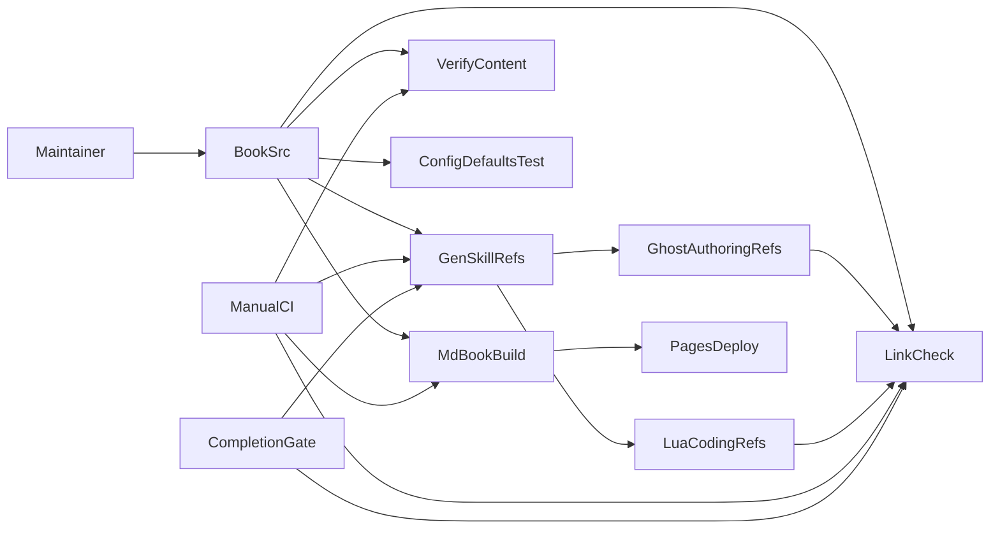
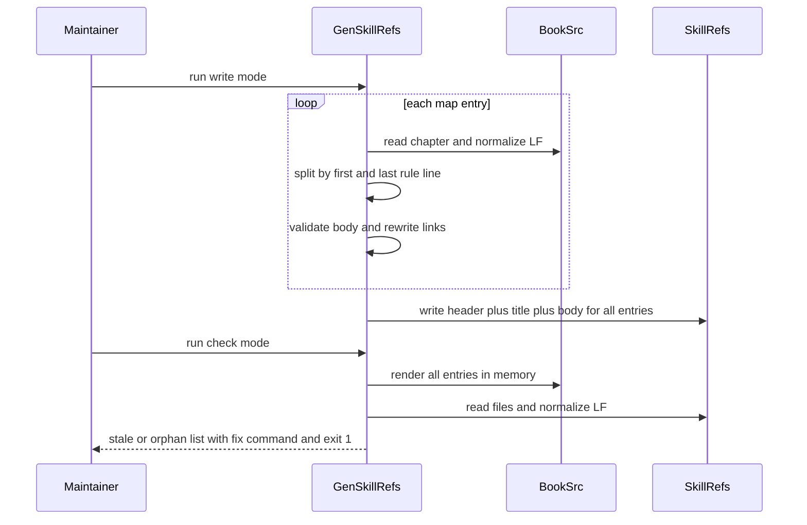
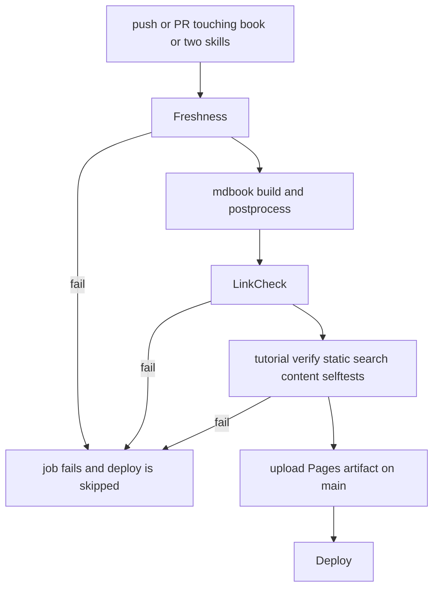
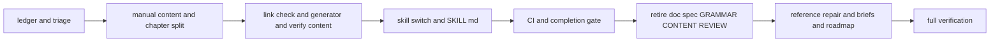

# 設計書: manual-ssot-authority

## Overview

**Purpose**: 本仕様は、pasta の利用者向け情報（Pasta DSL 文法・公開 Lua API・`pasta.toml`・起動シーケンス）の権威を mdBook マニュアル（`book/src/`）の 1 箇所へ集約し、スキル `references/` の利用者向け規範ファイルをマニュアルから機械生成する。旧権威（`doc/spec/`・`GRAMMAR.md` 本文・drift-check 機構）は撤去する。

**Users**: ゴースト作者は公開マニュアルだけで規範情報へ到達できる。スキル利用者（AI エージェント／他リポジトリのゴースト開発者）は、マニュアルと同一内容の自己完結したスキルを持ち出せる。メンテナは「マニュアルを直して 1 コマンドで再生成する」だけで両者を同期でき、乖離は CI が検出する。

**Impact**: 文書の権威の向きを「doc/spec → book（drift-check で追従）／スキル手書き → book（起草元）」から「book → スキル（生成）」へ反転する。ランタイムの挙動・文法・API・設定解釈は一切変更しない（10.5）。

### Goals

- 利用者向け規範記述がマニュアルにのみ手書きで存在する（1.1–1.8, 3.1–3.4, 4.1–4.2, 10.2）。
- スキルの規範ファイルがマニュアルから決定論的に生成され、鮮度が CI と完了ゲートで保証される（5.1–5.9, 7.1–7.8）。
- 旧権威とその参照が現行文書から消え、リンク切れ検出は存続する（2.1–2.4, 8.1–8.5, 9.1–9.8）。
- 上記をすべて 1 ブランチ・1 PR で同時に統合する（10.1）。

### Non-Goals

- ランタイム内部設計の解説、`internal-modules` の権威移動（`pasta-runtime-internals-doc`）。
- 文法・API・設定の挙動変更、マニュアルのデザイン・シンタックスハイライト変更。
- `.kiro/specs/completed/` の書き換え、既に持ち出されたスキルのコピーの更新、`pasta-check` スキル。
- 生成機構の汎用化（任意スキル・任意章を設定ファイルで宣言する仕組み等）。対応表は本仕様の 21 章に限定した定数とする。
- book 内リンクのアンカー検証（検証するのは 2 スキル内のアンカーのみ）。

## Boundary Commitments

### This Spec Owns

- **マニュアル内容**: `book/src/grammar/*`・`book/src/lua/modules/*`（旧 `lua/modules.md` をモジュール別章へ分割）・新章 `book/src/lua/shiori-events.md`・新章 `book/src/reference/pasta-toml.md`・`book/src/reference/startup.md`・`book/src/introduction.md`・`book/src/reference/external-links.md`・`book/src/SUMMARY.md` の規範的記述（移し替えと拡充）。加えて、`book/src/**` 全章に対する「実装と食い違う記述の訂正」と「章の移動に伴うリンク張り替え」（`lua/index.md`・`lua/patterns.md` 等の生成対象外章を含む）。
- **生成機構**: マニュアル章 → スキル `references/` の対応表・抽出規則・リンク書き換え規則・生成物ヘッダ・鮮度判定（`book/tools/gen-skill-refs.mjs`）。
- **リンク検証**: book 内リンク切れ検出とスキル自己完結検査（`book/tools/link-check.mjs`）。
- **スキル構成**: `pasta-ghost-authoring`・`pasta-lua-coding` の `references/` のファイル構成、`SKILL.md` の生成／手書き区分表示、手書きファイルからの規範的事実の除去、`SKILL.md`・手書きファイルに残る食い違い記述の訂正。
- **撤去**: `doc/spec/`、`GRAMMAR.md` 本文、`book/manual-sources.toml`、`book/CONTENT-REVIEW.md`、`book/tools/drift-check.mjs`・`drift-check-test.mjs`・`verify-drift-gate.mjs`。
- **CI・ゲート**: `.github/workflows/manual.yml` の起動条件と検証ステップ、`workflow.md` DoD の Manual Sync Gate とスキルドキュメント更新手順、`kiro-complete` スキルの同ゲート記述。
- **参照修正**: steering・`README.md`・`SOUL.md`・`OPTIMIZATION.md`・`book/AUTHORING.md`・進行中 spec・ソースコメント。
- **将来仕様の行き先**: `doc/spec/` ch08・ch12 の未実装項目の brief 起票とロードマップ記載。
- **既定値整合テストの読み先**: `crates/pasta_lua/tests/loader/config_defaults_test.rs` の参照パス。

### Out of Boundary

- ランタイム（`crates/**/src`）の挙動。本仕様が変更してよい crates 配下は、テストの読み先パス・コメント・`crates/pasta_lua/README.md` のリンクのみ。
- スキル手書きファイル `internal-modules.md`・`coding-conventions.md`・`testing-lint.md` の構成と主題。触るのは「スキル外参照の除去」「旧名ファイルへのリンク張り替え」「実装と食い違う記述の訂正」の 3 種に限る。
- マニュアルのデバッグ章・入門章の構成と主題。触るのは「実装と食い違う記述の訂正」「リンク張り替え」に限る。`getting-started/first-ghost.md` の ```` ```pasta ```` 成果物ブロックは `tutorial-check.mjs` が hello-pasta と逐語照合しているため変更しない。
- `pasta-check` スキル、`.kiro/specs/completed/`、他リポジトリへ持ち出し済みのスキル。
- 新しい公開パイプライン（Pages 公開・bigram 索引・構文ハイライトの各ステップは不変）。`book/package.json` は変更しない。`book/book.toml` の変更は旧 URL のリダイレクト 1 行のみ（#13）。

### Allowed Dependencies

- Node.js 20（CI と同一）の標準モジュール（`node:fs`・`node:path`・`node:url`）のみ。新規 npm 依存は追加しない（5.8）。
- `book/tools/` 内の import は次の向きに限る。逆方向の import は禁止。
  - `gen-skill-refs.mjs` → `link-check.mjs`（リンク正規表現 `LINK_RE`・`maskFences`）
  - `verify-content.mjs` → `gen-skill-refs.mjs`（`GENERATION_MAP`・`VOICE_MARKERS` の読み取りのみ）
- mdBook 0.5.3 の既存ビルド・公開パイプライン。
- 生成物ヘッダが案内する公開 URL `https://ekicyou.github.io/pasta/`（`book.toml` の `site-url = "/pasta/"` と整合）。

### Revalidation Triggers

- **対応表の変更**（生成対象章の追加・削除・改名・移動。出力ファイル名は章名から導出されるため、章の改名はスキルファイルの改名になる）: 両 `SKILL.md` のリンクと区分表、手書きファイルからのリンク、`verify-content.mjs` の SUMMARY 到達検査、`pasta-runtime-internals-doc` の生成方式の再確認が必要。
- **章構造規約の変更**（導入／締めの区切りを `---` 以外にする等）: 生成器の抽出規則、`book/AUTHORING.md`、全章の再生成。
- **`VOICE_MARKERS` の変更**: 生成器の `voice-in-body` 判定と `verify-content.mjs` の D（ボイス）検査の両方に効く。
- **生成対象章の見出し変更**: スキル内のアンカー付きリンク（`SKILL.md`・手書きファイル・他の生成ファイルから）が切れる。LinkCheck の `skill-anchor` が検出する。
- **公開 URL の変更**（`book.toml` の `site-url`・Pages の公開先）: 生成物ヘッダと章外リンク書き換えの基底 URL。
- **`pasta.toml` リファレンス章の表形式変更**: `config_defaults_test.rs` の行一致規則。
- **スキルのディレクトリ名・配置変更**: 生成器の出力先、`manual.yml` の `paths`、Manual Sync Gate の発火条件。
- 下流 `pasta-runtime-internals-doc` が `internal-modules` を生成化するときは、本仕様の対応表へ行を追加する形で再利用する（生成器の構造変更は不要）。

## Architecture

### Existing Architecture Analysis

- マニュアルの全 27 章（`SUMMARY.md` を除く）は「先頭行 H1 → キャラ口調の導入 → `---` → 規範的本文 → `---` → キャラ口調の締め」という構造を持ち、コードフェンス外の最初と最後の `---` 行が導入・締めの境界になっている。`lua/modules.md` だけは本文内にも `---` を持つ（計 9 本）が、最初と最後の位置規約は保たれている。文法章は締めの後に `> **権威的仕様**: … doc/spec/…` 引用を持つ。
- 現行の生成対象章（文法 10・`lua/modules.md`・`reference/startup.md`）の本文（最初と最後の `---` の間）には、コードフェンス・表の行・インラインコードを除いた散文に `VOICE_MARKERS` の語が 1 つも無い。口調の全面禁止規約は既存章の書き換えを要しない。
- 文法章は 4 連バッククォートのフェンス（```` ````pasta ````）の中に 3 連バッククォート行（Pasta の Lua ブロック）を入れている（`grammar/block-structure.md`・`call-jump.md`・`actor-dictionary.md`）。フェンスの開閉を単純に交互に数えると、内側の Lua コードが散文扱いになる。
- 文法章は「将来変更あり」節として未実装の機能も紹介している（`call-jump.md` フィルター、`words.md` 動的単語参照、`block-structure.md` 属性、`actor-dictionary.md` アクタースコープ内コードブロック、`grammar/index.md` の属性注記）。1.3 と整合させる必要がある。
- `book/tools/` は依存なしの `.mjs` スクリプト＋同居 `*-test.mjs` の自己テストという規約を持ち、CI は `*-test.mjs` を `find` で一括実行する。改行の LF 正規化（`/\r\n?/g`）は `drift-check.mjs`・`tutorial-check.mjs` に既存実装がある。
- `drift-check.mjs` はドリフト検出（doc/spec ハッシュ）とリンク切れ検出（book 内相対 `.md`・自リポ GitHub URL）を同居させている。リンク抽出 `extractLinks` はコードフェンスを区別しない正規表現である。
- `verify-content.mjs` は import 時に検査本体を実行するスクリプトで、B（Lua 網羅）と D（ボイス）は固定のディレクトリ一覧を非再帰で読む。公開モジュール 6 個のうち 5 個は `lua/modules.md` にしか登場しないため、章を `lua/modules/` へ移すと B が失敗し、D はモジュール章を検査しなくなる。
- 現行スキルには、見出しではなく `<a id="s6-6"></a>` 形式の明示アンカーを指すリンク（`SKILL.md` → `authoring-patterns.md#s6-N`）と、既に切れているアンカー（`pasta-toml.md` の `#package予約注記`。見出し `## [package] 予約注記` の slug は `package-予約注記`）がある。
- スキルを読むコードは `config_defaults_test.rs` の 1 箇所のみ（`pasta-toml.md` の「キー名と `` `値` `` が同一行にある」ことを行単位で検査）。
- `manual.yml` は `book/**` と自身の変更時のみ起動し、build ジョブが失敗すると deploy ジョブは走らない（`needs: build`）。`config_defaults_test` は `build.yml`（全 push／PR・`cargo test --all`）で走る。

### Architecture Pattern & Boundary Map

採用パターン: **単一ソース＋静的生成（Generate & Verify）**。マニュアル章を唯一の入力とし、生成器が純関数として出力を決め、同じ関数を「書き出し」と「照合（`--check`）」の 2 モードで使う。照合はローカル・CI・完了ゲートで同一コマンドを使う。



**Architecture Integration**:
- 選定理由: 生成物をリポジトリにコミットする方式は、スキルを「ディレクトリごとコピーするだけ」で持ち出せる要件（5.3）と両立する唯一の形である。照合モードを同じ生成関数で行うため、生成と検査の規則が二重化しない。
- 境界: 生成器は「章 → 生成ファイル」の写像だけを所有し、手書きファイル・`SKILL.md` には書き込まない。自己完結性の検査はリンク検証器が所有し、生成器は所有しない。
- 既存パターンの維持: 依存なし `.mjs`＋同居テスト、LF 正規化、`REPO_ROOT` 自己解決、CI の自己テスト一括実行、mdBook の章文体構造。
- 新規コンポーネントの理由: `gen-skill-refs.mjs` は生成と鮮度判定（5.x, 7.x）に必須。`link-check.mjs` は `drift-check.mjs` からリンク検証部だけを残した縮小版であり、新規ではなく改名・縮小である（8.4）。
- Steering 適合: 静的サイト維持・追加エコシステム依存なし（tech.md）、LF 正規化、`book/tools/` 配置（structure.md）。

### Dependency Direction

`book/src`（入力データ） → `link-check.mjs`（純関数ライブラリ＋CLI） → `gen-skill-refs.mjs`（対応表＋`VOICE_MARKERS`＋生成＋照合） → `verify-content.mjs`（対応表と `VOICE_MARKERS` を読むだけ） → CI／完了ゲート（コマンド実行のみ）。各ファイルは左側のみを import する。スキル側ファイルはどのツールからも import されない（読み書きされるデータである）。

### Technology Stack

| Layer | Choice / Version | Role in Feature | Notes |
|-------|------------------|-----------------|-------|
| CLI / ツール | Node.js 20（素の ESM `.mjs`） | 生成・照合・リンク検証・コンテンツ検証 | 新規 npm 依存なし。`book/package.json` は変更しない |
| ドキュメント | mdBook 0.5.3 | マニュアルのビルド・公開 | 変更なし。`lua/modules/index.md` は `lua/modules/index.html` として出力される |
| CI | GitHub Actions `manual.yml`（ubuntu） | 鮮度チェック・リンク検証の実行、公開の阻止 | 起動 `paths` に 2 スキルを追加 |
| テスト | Rust `cargo test`（`build.yml`・Windows） | `pasta.toml` 既定値整合 | 読み先パスのみ変更 |

## File Structure Plan

### Directory Structure

```
book/
├── AUTHORING.md                  # [改] 権威＝マニュアル、生成対象章の執筆規約、再生成手順（ReferenceRepair 参照）
├── CONTENT-REVIEW.md             # [削除] 廃止前提（doc/spec・manual-sources）の過去レビュー記録。履歴は git と completed spec が保持
├── manual-sources.toml           # [削除]
├── src/
│   ├── SUMMARY.md                # [改] lua/modules.md の行を lua/modules/index.md＋子 7 章へ置換、lua/shiori-events.md・reference/pasta-toml.md を追加
│   ├── introduction.md           # [改] 「doc/spec が権威」記述を「本マニュアルが権威」へ。「将来変更あり」の定義を現行挙動の注記に限定
│   ├── grammar/*.md (10 章)      # [改] doc/spec・GRAMMAR.md・スキル手書きの規範的内容を吸収。章末「権威的仕様」引用を削除。未実装機能の「将来変更あり」節を削除
│   ├── lua/index.md              # [改] 生成対象外。modules.md へのリンクを modules/index.md へ張り替え、shiori-events を章一覧へ追加
│   ├── lua/modules.md            # [削除] 内容は lua/modules/ 配下へ分割して移す
│   ├── lua/modules/              # [新] 旧スキル runtime-api 相当をモジュール別章へ拡充
│   │   ├── index.md              #   モジュール一覧・require 名・共通事項（→ modules-index.md）
│   │   ├── pasta-search.md       #   @pasta_search（セレクタ含む）
│   │   ├── pasta-persistence.md  #   @pasta_persistence
│   │   ├── pasta-config.md       #   @pasta_config
│   │   ├── pasta-sakura-script.md #  @pasta_sakura_script
│   │   ├── enc.md                #   @enc
│   │   ├── pasta-log.md          #   @pasta_log
│   │   └── mlua-stdlib.md        #   mlua-stdlib 統合モジュール
│   ├── lua/shiori-events.md      # [新] SHIORI イベントとハンドラ（REG/RES/イベント一覧/フォールバック/仮想ディスパッチャ）
│   ├── lua/patterns.md           # [改] 生成対象外。REG ハンドラ署名・RES の誤記を実装に合わせて訂正し、詳細は shiori-events へ誘導
│   ├── reference/pasta-toml.md   # [新] pasta.toml リファレンス（分類表・テンプレート・予約注記・各セクション詳細）
│   ├── reference/startup.md      # [改] ../lua/modules.md へのリンクを ../lua/modules/pasta-persistence.md へ張り替えるのみ（本文に口調なし・構造変更不要）
│   ├── reference/external-links.md # [改] doc/spec へのリンク群を削除
│   └── （その他の章）             # [改・該当時のみ] 食い違い grep で見つかった誤記の訂正のみ
└── tools/
    ├── gen-skill-refs.mjs        # [新] 対応表・VOICE_MARKERS・抽出・リンク書き換え・ヘッダ付与・書き出し／--check 照合
    ├── gen-skill-refs-test.mjs   # [新] 生成器の自己テスト（CI の *-test.mjs 一括実行で走る）
    ├── link-check.mjs            # [改名] drift-check.mjs からリンク検証部のみ残し、スキル自己完結検査を追加
    ├── link-check-test.mjs       # [改名] drift-check-test.mjs からリンク検証ケースを残し、スキル検査ケースを追加
    ├── drift-check.mjs / drift-check-test.mjs  # [消滅] 上の改名による
    ├── verify-drift-gate.mjs     # [削除]
    ├── verify-content.mjs        # [改] A 節の旧権威前提を撤去し新検査を追加、B・D の走査に lua/modules を追加、VOICE_MARKERS を import
    ├── verify-scripts-test.mjs   # [改] verify-drift-gate ブロックを削除
    └── tutorial-check.mjs / tutorial-check-test.mjs  # [改] drift-check へのコメント言及のみ修正

.claude/skills/
├── pasta-ghost-authoring/
│   ├── SKILL.md                  # [改] references 区分表・生成ファイル優先の明示・要約の非規範注記・リンク更新・誤記訂正
│   └── references/
│       ├── grammar-index.md      # [生成・新] ← grammar/index.md
│       ├── markers.md            # [生成・新] ← grammar/markers.md
│       ├── block-structure.md    # [生成・新] ← grammar/block-structure.md
│       ├── call-jump.md          # [生成・新] ← grammar/call-jump.md
│       ├── literals.md           # [生成・新] ← grammar/literals.md
│       ├── action-line.md        # [生成・上書き] ← grammar/action-line.md
│       ├── sakura-script.md      # [生成・上書き] ← grammar/sakura-script.md
│       ├── variables.md          # [生成・上書き] ← grammar/variables.md
│       ├── words.md              # [生成・上書き] ← grammar/words.md
│       ├── actor-dictionary.md   # [生成・上書き] ← grammar/actor-dictionary.md
│       ├── pasta-toml.md         # [生成・上書き] ← reference/pasta-toml.md
│       ├── grammar-model.md / call-spec.md  # [削除] 旧名の手書きファイル
│       └── authoring-patterns.md # [手書き・改] 規範的事実を削り、生成ファイルへの参照に置換。`<a id="s6-N">` アンカーは維持
└── pasta-lua-coding/
    ├── SKILL.md                  # [改] 区分表・internal-modules 暫定注記・book/ への相対リンク除去・リンク更新・誤記訂正
    └── references/
        ├── modules-index.md      # [生成・新] ← lua/modules/index.md
        ├── pasta-search.md       # [生成・新] ← lua/modules/pasta-search.md
        ├── pasta-persistence.md  # [生成・新] ← lua/modules/pasta-persistence.md
        ├── pasta-config.md       # [生成・新] ← lua/modules/pasta-config.md
        ├── pasta-sakura-script.md # [生成・新] ← lua/modules/pasta-sakura-script.md
        ├── enc.md                # [生成・新] ← lua/modules/enc.md
        ├── pasta-log.md          # [生成・新] ← lua/modules/pasta-log.md
        ├── mlua-stdlib.md        # [生成・新] ← lua/modules/mlua-stdlib.md
        ├── shiori-events.md      # [生成・新] ← lua/shiori-events.md
        ├── startup.md            # [生成・新] ← reference/startup.md
        ├── runtime-api.md / shiori-handlers.md  # [削除] 旧名の手書きファイル
        ├── internal-modules.md   # [手書き・暫定・改] 旧名リンクの張り替え・誤記訂正のみ
        ├── coding-conventions.md # [手書き・改] スキル外参照・誤記があれば直すのみ
        └── testing-lint.md       # [手書き・改] 旧名リンクの張り替え、`crates/…` パス記述の除去、誤記訂正のみ

.kiro/specs/
├── manual-ssot-authority/absorption-ledger.md # [新] 吸収台帳（吸収元見出し → 収録先 or 除外理由、付録「未記載の実装事実」）
├── scene-attribute-semantics/brief.md         # [新] 属性セマンティクス・ファイルレベル属性・属性フィルター
└── dynamic-word-reference/brief.md            # [新] 動的単語参照 ＠＄
```

### Modified Files

- `book/book.toml` — `[output.html.redirect]` を新設し `"/lua/modules.html" = "modules/index.html"` を 1 行追加（#13）。他の設定は変更しない。
- `.github/workflows/manual.yml` — `paths`（push・pull_request の両方）に `.claude/skills/pasta-ghost-authoring/**`・`.claude/skills/pasta-lua-coding/**` を追加。Setup Node 直後に「Skill references freshness」（`node book/tools/gen-skill-refs.mjs --check`）を追加。「Drift / broken-link check」を「Link check」（`node book/tools/link-check.mjs`）へ置換。「Verify drift gate」ステップを削除。ヘッダコメントのパイプライン説明を更新。
- `crates/pasta_lua/tests/loader/config_defaults_test.rs` — `config_reference_doc_matches_ssot` の読み先を `book/src/reference/pasta-toml.md` へ変更し、doc コメントの「pasta-toml.md」記述を更新。照合規則（キー名と `` `値` `` の同一行）と失敗メッセージ（キー名を含む）は維持。
- `crates/pasta_lua/tests/runtime/syntax_test.rs` — `GRAMMAR.md` を指すコメント（L397）をマニュアル章へ付け替え。
- `crates/pasta_lua/README.md` — スキルの `pasta-toml.md` へのリンク（L144）をマニュアル章 `../../book/src/reference/pasta-toml.md` へ付け替え（権威の向きの統一・9.3）。`startup.md` へのリンク（L274）は維持。
- `GRAMMAR.md` — 本文を全削除し、移設の告知と公開マニュアル URL（`https://ekicyou.github.io/pasta/grammar/index.html`）のみを置く（2.2, 2.3）。
- `doc/spec/` — ディレクトリごと削除（2.1）。
- `.kiro/steering/grammar.md` — 非規範要約へ縮小（後述 ReferenceRepair）。
- `.kiro/steering/workflow.md` — DoD「6. Manual Sync Gate」を再定義。「2. スキルドキュメント更新検討」の手順を「生成ファイルはマニュアル章を直して再生成、`SKILL.md` と手書きファイルは直接更新」へ書き換え。最終タスクのドキュメント整合チェックリスト・更新チェックリスト・保守責任・保守ルールから `doc/spec/`・`GRAMMAR.md` を除き「マニュアル章＋スキル再生成」を追加。`.agents/skills` を `.claude/skills` へ修正。
- `.kiro/steering/tech.md`・`structure.md`・`product.md`・`roadmap.md` — drift-check／doc/spec／GRAMMAR.md 記述を生成方式とマニュアル権威へ置換（`tech.md` L274 の `.agents/skills` も修正）。`roadmap.md` に将来仕様とバグ候補のキー情報を追記。
- `.claude/skills/kiro-complete/SKILL.md` — ステップ 4 と完了チェックリストの Manual Sync Gate 記述を新ゲートへ置換（判定本体は workflow.md を正とする構造は維持）。
- `README.md`・`SOUL.md`・`OPTIMIZATION.md` — doc/spec・GRAMMAR.md の行を削除またはマニュアルへ付け替え。`SOUL.md` の衝突ルールを「マニュアル（`book/src/`）を優先し、README・steering・スキル手書きを修正する」へ変更。`.agents/skills` を `.claude/skills` へ修正。
- `.kiro/specs/review-improvement-loop/{brief,matrix,tasks,design,requirements,research}.md` — 今後の実行指示として読まれる箇所（文書整合タスクの確認対象、ツールのテストコマンド表、未完了セル・未完了タスクの記述）のみ参照修正する。完了済みセル・完了済みタスクの結果記録と `reports/` は当時の事実として残す。ReferenceRepair の網羅 grep では、残存行が「完了記録」「reports/」のいずれかであることを確認する。
- `.kiro/specs/pasta-runtime-internals-doc/brief.md` — 変更しない（L49 の `doc/spec` 言及は「廃止の流れ」の説明であり、網羅 grep の許容理由「廃止済みであることの説明」に当たる）。

## System Flows

### 生成と照合



- 構造違反（区切り不足・本文への口調混入・解決不能リンク）は書き出しモードでも照合モードでも同じ例外で失敗し、ファイルを 1 つも書き換えない（全エントリをメモリ上で生成し終えてから書き出す）。

### CI と公開



- deploy ジョブは `needs: build` のため、鮮度チェック失敗時は公開されない（7.6）。

## Requirements Traceability

| Requirement | Summary | Components | Interfaces | Flows |
|-------------|---------|------------|------------|-------|
| 1.1 | doc/spec 実装済み章の規範を文法章へ欠落なく収録 | ContentMigration, AbsorptionLedger | 吸収台帳 | — |
| 1.2 | GRAMMAR.md・スキル手書き固有の挙動事実を収録 | ContentMigration, AbsorptionLedger | 吸収先対応表 | — |
| 1.3 | 現行挙動のみ収録・属性は現行挙動のみ | ContentMigration, FutureSpecRouting | ch08/ch12 仕分け表・「将来変更あり」節の整理規則 | — |
| 1.4 | 将来仕様を brief／ロードマップへ | FutureSpecRouting | 仕分け表 | — |
| 1.5 | マニュアル外を権威として案内しない | ContentMigration, VerifyContent | `A-nospec` 検査 | — |
| 1.6 | 実装と矛盾しない | ContentMigration, AbsorptionLedger | 台帳の実装照合列 | — |
| 1.7 | 章構成規約の維持 | ContentMigration, VerifyContent, GenSkillRefs | 章構造契約・`voice-in-body`・D 検査 | — |
| 1.8 | 吸収元に無い実装構文もバグ候補以外は収録 | ContentMigration, AbsorptionLedger | 台帳付録「未記載の実装事実」・バグ候補判定基準 | — |
| 2.1 | doc/spec 削除（スタブなし） | Retirement | — | — |
| 2.2 | GRAMMAR.md は案内のみ | Retirement | — | — |
| 2.3 | 行き先 URL を示す | Retirement | — | — |
| 2.4 | doc/spec・GRAMMAR.md 依存の検証なし | Retirement, VerifyContent, LinkCheck | — | — |
| 3.1 | runtime-api 相当を減らさず収録 | ContentMigration, AbsorptionLedger | `lua/modules/*` | — |
| 3.2 | shiori-handlers 相当を減らさず収録 | ContentMigration, AbsorptionLedger | `lua/shiori-events.md` | — |
| 3.3 | 食い違い時は実装に一致 | ContentMigration, AbsorptionLedger | 台帳の実装照合列 | — |
| 3.4 | internal-modules は収録しない | SkillLayout | 区分表 | — |
| 4.1 | pasta.toml 章で全内容を収録 | ContentMigration | `reference/pasta-toml.md` | — |
| 4.2 | 目次から到達可能 | ContentMigration, VerifyContent | `A-summary` 検査 | — |
| 4.3 | 既定値整合テストがマニュアルを検証 | ConfigDefaultsTest | 読み先パス | — |
| 4.4 | 食い違い時に失敗しキー報告 | ConfigDefaultsTest | 既存失敗メッセージ | — |
| 4.5 | スキルを読み先にしない | ConfigDefaultsTest | 読み先パス | — |
| 5.1 | 4 系統のみ生成 | GenSkillRefs | `GENERATION_MAP` | 生成と照合 |
| 5.2 | 導入・締めを含めない | GenSkillRefs | `extractBody` | 生成と照合 |
| 5.3 | スキル外参照を含まない | GenSkillRefs, LinkCheck | `rewriteLinks`, `checkSkillSelfContained` | 生成と照合 |
| 5.4 | 章間参照を解決可能にする | GenSkillRefs | `rewriteLinks` | 生成と照合 |
| 5.5 | 環境非依存の同一出力 | GenSkillRefs | `renderEntry` | 生成と照合 |
| 5.6 | 生成物ヘッダ | GenSkillRefs | `renderHeader` | 生成と照合 |
| 5.7 | 1 操作で全再生成 | GenSkillRefs | CLI 書き出しモード | 生成と照合 |
| 5.8 | 既存ツールチェーン内 | GenSkillRefs | Node 標準のみ | — |
| 5.9 | 章欠落・構造違反で失敗し報告 | GenSkillRefs | `GenError` | 生成と照合 |
| 6.1 | ファイル単位の区分明示 | SkillLayout, LinkCheck | 区分表・`skill-unlisted` | — |
| 6.2 | 手書きは作例・手順・規約のみ | SkillLayout, AbsorptionLedger | 手書きファイル規約 | — |
| 6.3 | internal-modules 暫定明示 | SkillLayout | 区分表 | — |
| 6.4 | SKILL.md リンクが実在ファイルのみ | SkillLayout, LinkCheck | `checkSkillSelfContained` | CI と公開 |
| 6.5 | スキル全体が自己完結 | SkillLayout, LinkCheck | `checkSkillSelfContained` | CI と公開 |
| 6.6 | 生成ファイルを正とする明示 | SkillLayout | 区分表の前文 | — |
| 6.7 | 早見表は非規範の要約 | SkillLayout | 要約注記 | — |
| 7.1 | 未再生成で失敗 | GenSkillRefs, ManualCI | `--check` | CI と公開 |
| 7.2 | 生成物手編集で失敗 | GenSkillRefs, ManualCI | `--check` | CI と公開 |
| 7.3 | 不一致ファイルと解消手順を報告 | GenSkillRefs | `CheckReport` | 生成と照合 |
| 7.4 | 改行差を不一致にしない | GenSkillRefs | LF 正規化 | 生成と照合 |
| 7.5 | 3 種の変更で CI 実行 | ManualCI | `paths` | CI と公開 |
| 7.6 | 失敗中は公開しない | ManualCI | `needs: build` | CI と公開 |
| 7.7 | ローカル再現 | GenSkillRefs | 同一 CLI | 生成と照合 |
| 7.8 | 完了ゲートに含める | CompletionGate | Manual Sync Gate | — |
| 8.1 | ハッシュ表・ドリフト検出の撤去 | Retirement, LinkCheck | — | — |
| 8.2 | 公開がドリフト検出に非依存 | ManualCI | ステップ構成 | CI と公開 |
| 8.3 | 権威リンク・ハッシュ登録を要求しない | VerifyContent | A 節 | — |
| 8.4 | リンク切れ検出の存続 | LinkCheck | `detectBrokenLinks` | CI と公開 |
| 8.5 | 完了ゲートがドリフト検出を記述しない | CompletionGate | — | — |
| 9.1 | doc/spec を現存として参照しない | ReferenceRepair | 網羅 grep | — |
| 9.2 | GRAMMAR.md を参照先として案内しない | ReferenceRepair | 網羅 grep | — |
| 9.3 | 権威＝マニュアル・衝突時マニュアル優先 | ReferenceRepair | SOUL.md 衝突ルール | — |
| 9.4 | AUTHORING.md の権威反転 | ReferenceRepair | AUTHORING.md 第 4 節 | — |
| 9.5 | 保守手順にマニュアル＋再生成 | ReferenceRepair, CompletionGate | workflow.md チェックリスト・スキル更新手順 | — |
| 9.6 | completed を書き換えない | ReferenceRepair | 対象除外 | — |
| 9.7 | マニュアル内の doc/spec リンク除去 | ContentMigration, VerifyContent | `A-nospec` 検査 | — |
| 9.8 | steering/grammar.md の縮小 | ReferenceRepair | 残す節の一覧 | — |
| 10.1 | 一括統合 | Migration Strategy | 単一 PR | — |
| 10.2 | 手書きの写しを持たない | Retirement, SkillLayout, LinkCheck | 旧名ファイル削除・`skill-unlisted` | — |
| 10.3 | 既存テスト全成功 | Testing Strategy | — | — |
| 10.4 | 静的サイトのビルド・公開 | ManualCI | — | CI と公開 |
| 10.5 | ランタイム挙動不変 | Boundary Commitments | crates 変更はテストパス・コメント・README リンクのみ | — |
| 10.6 | 収録不能内容の扱いを決定 | AbsorptionLedger | 除外理由列 | — |

## Components and Interfaces

| Component | Domain/Layer | Intent | Req Coverage | Key Dependencies (P0/P1) | Contracts |
|-----------|--------------|--------|--------------|--------------------------|-----------|
| GenSkillRefs | ツール | 章→スキル生成と鮮度照合 | 1.7, 5.1–5.9, 7.1–7.4, 7.7 | link-check `LINK_RE`・`maskFences` (P1) | Service, Batch |
| LinkCheck | ツール | book 内リンク切れ検出＋スキル自己完結検査 | 2.4, 5.3, 6.1, 6.4, 6.5, 8.1, 8.4, 10.2 | — | Service, Batch |
| VerifyContent | ツール | コンテンツ受入検査の更新 | 1.5, 1.7, 2.4, 4.2, 8.3, 9.7 | `GENERATION_MAP`・`VOICE_MARKERS` (P1) | Batch |
| ManualCI | CI | 鮮度・リンク検証の実行と公開阻止 | 7.1, 7.2, 7.5, 7.6, 8.2, 10.4 | GenSkillRefs (P0), LinkCheck (P0) | Batch |
| CompletionGate | プロセス文書 | 完了ゲートの再定義 | 7.8, 8.5, 9.5 | GenSkillRefs (P0), LinkCheck (P0) | — |
| ConfigDefaultsTest | テスト | pasta.toml 既定値整合の読み先付け替え | 4.3–4.5 | reference/pasta-toml.md (P0) | — |
| ContentMigration | 文書 | 規範内容のマニュアルへの移し替え | 1.1–1.3, 1.5–1.8, 3.1–3.3, 4.1, 4.2, 9.7 | AbsorptionLedger (P0) | — |
| AbsorptionLedger | 文書 | 吸収元見出しの収録先・除外理由の台帳 | 1.1, 1.2, 1.6, 1.8, 3.1–3.3, 6.2, 10.6 | — | State |
| FutureSpecRouting | 文書 | ch08/ch12 未実装項目の brief・ロードマップ化 | 1.3, 1.4 | — | — |
| SkillLayout | スキル | 区分表示と手書きファイル整理 | 3.4, 6.1–6.7, 10.2 | GenSkillRefs (P0) | — |
| Retirement | 文書／ツール | 旧権威の撤去 | 2.1–2.4, 8.1, 10.2 | — | — |
| ReferenceRepair | 文書 | 現行文書の参照修正 | 9.1–9.6, 9.8 | — | — |

10.1 は Migration Strategy、10.3 は Testing Strategy、10.5 は Boundary Commitments が担う（コンポーネントではなく運用上の決定）。

### ツール層

#### GenSkillRefs（`book/tools/gen-skill-refs.mjs`）

| Field | Detail |
|-------|--------|
| Intent | マニュアル章から規範本文を抽出してスキル `references/` を生成し、既存ファイルとの一致を照合する |
| Requirements | 1.7, 5.1–5.9, 7.1–7.4, 7.7 |

**Responsibilities & Constraints**
- 対応表 `GENERATION_MAP`（モジュール内定数・順序固定）だけを入力の定義とする。設定ファイルは設けない。
- 生成ファイルのみを書き込む。手書きファイル・`SKILL.md` は読みも書きもしない（孤立生成物の検出時のみ、2 スキルの `references/*.md` の先頭行を読む）。
- 全エントリをメモリ上で生成し終えてから書き出す（途中失敗で一部だけ更新された状態を作らない）。
- 出力は LF・末尾改行 1 つ・UTF-8（BOM なし）。時刻・環境値を出力に含めない（5.5）。
- `VOICE_MARKERS`（口調マーカーの広い集合）を定義して export する。現行 `verify-content.mjs` の定義を移し、普通文体と衝突する 3 語（`くてよ`・`ですの`・`ますの`）だけ否定先読みの正規表現に置き換える。判定関数 `findVoice` も export する。

**Dependencies**
- Outbound: `link-check.mjs` の `LINK_RE`（インラインリンクの正規表現）と `maskFences`（コードフェンス判定）（P1。規則の二重化を避けるため import して再利用する）
- External: Node.js 標準 `node:fs`・`node:path`・`node:url`（P0）

**Contracts**: Service [x] / Batch [x]

##### Service Interface

```typescript
type SkillName = 'pasta-ghost-authoring' | 'pasta-lua-coding';

interface MapEntry {
  readonly chapter: string;   // book/src からの相対パス（例: 'grammar/markers.md'）
  readonly skill: SkillName;
}

// references/ 内の出力ファイル名は章パスから導出する（対応表に持たない）。
// 章のファイル名そのまま。ただし index.md は `{直近の親ディレクトリ名}-index.md`
// （grammar/index.md → grammar-index.md、lua/modules/index.md → modules-index.md）。
function outName(chapter: string): string;

type GenError =
  | { kind: 'missing-chapter'; chapter: string }
  | { kind: 'bad-structure'; chapter: string; detail: string }                    // 区切り行 2 本未満・先頭行が H1 でない
  | { kind: 'voice-in-body'; chapter: string; hits: { line: number; marker: string }[] } // 本文散文に口調マーカー（章内の行番号つき）
  | { kind: 'unresolvable-link'; chapter: string; target: string };               // 画像・非 .md の相対リンク、book/src 外へ出る相対リンク

interface CheckReport {
  readonly stale: string[];    // 期待内容と不一致・欠落の生成ファイル（リポジトリ相対）
  readonly orphans: string[];  // 生成ヘッダを持つが対応表に無いファイル
  readonly fixCommand: 'node book/tools/gen-skill-refs.mjs';
}

declare const GENERATION_MAP: readonly MapEntry[];
declare const VOICE_MARKERS: readonly (string | RegExp)[];
function findVoice(text: string): string[];   // 一致したマーカーの表記。空なら口調なし
declare const MANUAL_BASE_URL: 'https://ekicyou.github.io/pasta/';

function extractBody(chapterText: string, chapter: string): { title: string; body: string }; // throws GenError
function rewriteLinks(body: string, entry: MapEntry): string;                                // throws GenError
function renderEntry(entry: MapEntry, repoRoot: string): string;                             // throws GenError
function generateAll(repoRoot: string): Map<string, string>;   // 出力のリポジトリ相対パス → 内容
function checkAll(repoRoot: string): CheckReport;
```

- **対応表（確定値・21 エントリ）**:

| chapter | skill | 出力名（`outName` の結果） |
|---------|-------|-----|
| grammar/index.md | pasta-ghost-authoring | grammar-index.md |
| grammar/markers.md | pasta-ghost-authoring | markers.md |
| grammar/block-structure.md | pasta-ghost-authoring | block-structure.md |
| grammar/call-jump.md | pasta-ghost-authoring | call-jump.md |
| grammar/literals.md | pasta-ghost-authoring | literals.md |
| grammar/action-line.md | pasta-ghost-authoring | action-line.md |
| grammar/sakura-script.md | pasta-ghost-authoring | sakura-script.md |
| grammar/variables.md | pasta-ghost-authoring | variables.md |
| grammar/words.md | pasta-ghost-authoring | words.md |
| grammar/actor-dictionary.md | pasta-ghost-authoring | actor-dictionary.md |
| reference/pasta-toml.md | pasta-ghost-authoring | pasta-toml.md |
| lua/modules/index.md | pasta-lua-coding | modules-index.md |
| lua/modules/pasta-search.md | pasta-lua-coding | pasta-search.md |
| lua/modules/pasta-persistence.md | pasta-lua-coding | pasta-persistence.md |
| lua/modules/pasta-config.md | pasta-lua-coding | pasta-config.md |
| lua/modules/pasta-sakura-script.md | pasta-lua-coding | pasta-sakura-script.md |
| lua/modules/enc.md | pasta-lua-coding | enc.md |
| lua/modules/pasta-log.md | pasta-lua-coding | pasta-log.md |
| lua/modules/mlua-stdlib.md | pasta-lua-coding | mlua-stdlib.md |
| lua/shiori-events.md | pasta-lua-coding | shiori-events.md |
| reference/startup.md | pasta-lua-coding | startup.md |

  命名規則: 全生成ファイルを章名に揃える（マニュアル章とスキルファイルの対応を名前だけで辿れるようにし、整理負債を残さない）。出力名は `outName` で章パスから機械的に導出し、対応表に別名を持たせない。上表の出力名は同一スキル内で重複せず、手書きファイル名（`authoring-patterns.md`／`internal-modules.md`・`coding-conventions.md`・`testing-lint.md`）とも重ならない。`(skill, outName(chapter))` の一意性は、自己テストが実物の `GENERATION_MAP` に対して検査する（定数表の誤りなので実行時のエラー種別は設けない）。旧名ファイル（`grammar-model.md`・`call-spec.md`・`runtime-api.md`・`shiori-handlers.md`）は生成ヘッダを持たない手書きファイルのため孤立検出に掛からない。切替（Migration P4）で明示的に削除し、残存は LinkCheck の `skill-unlisted` が検出する。デバッグ・入門・`lua/basics`・`lua/patterns`・`lua/dsl-vs-lua`・`lua/index`・`introduction`・`reference/external-links` は生成しない（5.1）。

- **抽出規則（`extractBody`）**:
  1. 入力を LF 正規化する。
  2. コードフェンスは `maskFences` で判定する。フェンスは CommonMark と同じく「3 個以上の `` ` `` または `~` で開き、同じ文字で開始以上の個数・情報文字列なしの行でのみ閉じる」。4 連バッククォートのフェンス内にある 3 連バッククォート行はフェンス内のコードとして扱う。
  3. フェンス外で「行全体が `---`」の行を区切り行とみなす。区切り行が 2 本未満、または先頭行が `# ` で始まる H1 でなければ `bad-structure`。
  4. H1 行をタイトルとし、最初の区切り行の次行から最後の区切り行の前行までを本文とする（本文内の `---` は保持）。本文の前後の空行は除去する。最後の区切り行以降（締め）はすべて捨てる。
  5. 本文の散文部（フェンス・表の行（trim 後に `|` で始まる行）・インラインコード `` `…` `` を除いた残り。見出し・引用ブロックは散文に含む）に `VOICE_MARKERS` のいずれかが現れたら `voice-in-body`（章内の行番号と語を報告する）。
- **口調の規約**: 生成対象章の本文では口調を全面禁止し、コラム・励ましは導入か締めへ置く。作例の台詞に口調を含めたい場合はコードフェンス内に置く。`VOICE_MARKERS` は部分一致のため、普通文体の語と衝突するものがある（確認済みの実例: `くてよ` は「書かなくてよい」に一致する。吸収元 `pasta-toml.md` L21。`ですの`・`ますの` は「ですので」「ますので」に一致する）。このため衝突が確認された 3 語だけを否定先読みつきの正規表現にする（整合性パスのディスカッション #12）: `くてよ(?!い)`・`ですの(?!で)`・`ますの(?!で)`。他の語は現行の文字列のまま。判定は `findVoice(text): string[]`（一致したマーカーの表記を返す）に一本化して export し、生成器の `voice-in-body` と `verify-content.mjs` の `hasVoice`（D 検査）の両方がこれを使う。新たな衝突語が見つかった場合も、言い換えを強いず同じ方法（否定先読み）で集合側を直す。エラーは行番号と語を示す。
- **リンク書き換え規則（`rewriteLinks`）**: フェンス外かつインラインコード外のインラインリンク `[text](target)` のみを対象とする（`LINK_RE` で検出）。参照形式リンク（`[text][ref]`）と HTML タグのリンクは扱わない（対象章に実例なし。`AUTHORING.md` で使用しない規約とする）。
  1. `http(s)://`・`mailto:` 等の絶対 URL、および `#anchor` のみのリンク → そのまま。
  2. 相対 `.md` リンク（アンカー付き可・`./` や `../` を含む）→ 章のディレクトリ基準で `book/src` 内パスへ解決する。解決先が `GENERATION_MAP` にあり同一スキル宛てなら `{outName(解決先)}{#anchor}`（同じ `references/` 内の兄弟ファイル）。それ以外（非生成章・別スキル宛て）は `{MANUAL_BASE_URL}{解決先パスの .md を .html に置換}{#anchor}`。スキルは片方だけ持ち出されうるため、別スキル宛ても相対パスにしない。公開 URL のアンカーはそのまま渡し、検証しない。
  3. 上記以外の相対リンク（画像・非 `.md`）および `book/src` 外へ出る相対リンク → `unresolvable-link`。
  
  例: `lua/modules/pasta-search.md` 内の `index.md` → `modules-index.md`、`../shiori-events.md` → `shiori-events.md`、`../patterns.md` → `https://ekicyou.github.io/pasta/lua/patterns.html`。`reference/startup.md` 内の `../lua/modules/pasta-persistence.md` → `pasta-persistence.md`、`../debug/troubleshooting.md` → 公開 URL。`grammar/variables.md` 内の `../lua/patterns.md` → 公開 URL。
- **ヘッダ（`renderHeader`）**: 生成ファイルの 1〜2 行目に固定する。リポジトリ内パスは含めない（5.3）。

```markdown
<!-- GENERATED FROM PASTA MANUAL - DO NOT EDIT -->
<!-- このファイルは pasta 利用者マニュアル「{H1 タイトル}」（{MANUAL_BASE_URL}{chapter を .html にしたもの}）から自動生成されたものです。手で編集しないでください。修正はマニュアルの該当章で行い、pasta リポジトリで再生成してください。 -->

# {H1 タイトル}

{本文}
```

  1 行目の固定文字列 `<!-- GENERATED FROM PASTA MANUAL - DO NOT EDIT -->` を生成物の機械判定（孤立検出）に使う。
- Preconditions: `GENERATION_MAP` の各 `chapter` が `book/src` に存在する。
- Postconditions: 書き出しモード成功後、`checkAll` は `stale`・`orphans` ともに空を返す。
- Invariants: 同一入力に対し `generateAll` の結果はバイト単位で同一（入力の改行コードに依存しない）。

##### Batch / Job Contract

- Trigger: メンテナの手動実行（`node book/tools/gen-skill-refs.mjs`）、CI（`--check`）、完了ゲート（`--check`）。
- Input / validation: `book/src` の対応章。検証失敗は `GenError` を `chapter` 付きで標準エラーへ出し exit 1（5.9）。
- Output / destination: 書き出しモード → 各スキルの `references/{outName(chapter)}`（既存ファイルが LF 正規化後に同一なら書き換えない。同名の既存ファイルはヘッダの有無にかかわらず上書きする）。照合モード → 不一致時に `STALE {path}`／`ORPHAN {path}` の一覧と「再生成: `node book/tools/gen-skill-refs.mjs` を実行してコミット」「孤立ファイルは削除するか対応表へ追加」を出して exit 1、一致時 exit 0（7.3）。照合時は既存ファイルも LF 正規化して比較する（7.4）。
- Idempotency & recovery: 書き出しは冪等。失敗時は何も書かないため再実行で回復する。

**Implementation Notes**
- Integration: CLI 判定は既存ツールと同じ `import.meta.url` と `process.argv[1]` の比較で行い、関数は export してテストと `verify-content.mjs` から使う（import しただけでは何も実行しない）。
- Validation: `gen-skill-refs-test.mjs` が抽出・書き換え・ヘッダ・決定性・照合をサンドボックスで検証する（Testing Strategy 参照）。
- Risks: 章執筆者が本文に口調コラムを入れると生成が失敗する。これは意図した失敗であり、`AUTHORING.md` に規約として明記する。

#### LinkCheck（`book/tools/link-check.mjs`）

| Field | Detail |
|-------|--------|
| Intent | book 内のリンク切れと、スキルのディレクトリ外参照・区分漏れを検出する |
| Requirements | 2.4, 5.3, 6.1, 6.4, 6.5, 8.1, 8.4, 10.2 |

**Responsibilities & Constraints**
- `drift-check.mjs` を改名し、`detectBrokenLinks`・`extractLinks`・`githubUrlToRepoPath`・`isWithinRoot`・`listMarkdownFiles` を現行の挙動のまま残す（`extractLinks` の正規表現を `LINK_RE` として export するだけの変更）。`parseManualSources`・`detectDrift`・`detectUnmapped`・`sha256File`・`UNMAPPED_EXCLUDE`・`DRIFT_STRICT`・`node:crypto` の import は削除する。
- スキル自己完結検査を追加する。対象は `.claude/skills/pasta-ghost-authoring/**/*.md` と `.claude/skills/pasta-lua-coding/**/*.md`（手書き・生成の両方）。
- `maskFences` を定義して export する（生成器と共用）。

**Contracts**: Service [x] / Batch [x]

##### Service Interface

```typescript
interface BrokenLink {
  file: string;   // リポジトリ相対
  target: string;
  kind:
    | 'internal-md' | 'github-repo-path'                       // 既存（book/src 対象）
    | 'skill-escape' | 'skill-missing' | 'skill-anchor'
    | 'skill-forbidden-ref' | 'skill-unlisted';                // 新規（2 スキル対象）
  detail: string;
}

declare const LINK_RE: RegExp;                                        // 既存 extractLinks の正規表現
declare const CHECKED_SKILLS: readonly ['pasta-ghost-authoring', 'pasta-lua-coding'];
declare const FORBIDDEN_SKILL_TOKENS: readonly ['doc/spec', 'GRAMMAR.md', 'book/src', 'crates/'];

function maskFences(markdown: string): string;                        // 新規。フェンス内の行を空行に置換（行数は保つ）
function detectBrokenLinks(repoRoot: string): BrokenLink[];           // 既存（book/src 対象・挙動不変）
function checkSkillSelfContained(repoRoot: string): BrokenLink[];     // 新規
function headingSlug(heading: string): string;                        // 新規（GitHub 方式）
function runLinkCheck(repoRoot: string): { broken: BrokenLink[]; failed: boolean };
```

- `checkSkillSelfContained` の規則（リンクの抽出はフェンス外のみ）:
  - (a) 相対リンクはスキルディレクトリ内に解決され（違反は `skill-escape`）、かつ実在する（違反は `skill-missing`）。絶対 URL は検査しない。
  - (b) `*.md#anchor`（同一ファイル内の `#anchor` を含む）は、リンク先ファイルのアンカー集合に含まれる（違反は `skill-anchor`）。アンカー集合は「フェンス外の見出し（`#`〜`######`）を `headingSlug` で変換したもの」と「`<a id="…">`／`<a name="…">` の明示アンカー」の和集合とする（現行 `authoring-patterns.md` の `s6-N` が後者）。
  - (c) ファイル全文（HTML コメントを含む）に `FORBIDDEN_SKILL_TOKENS` のいずれも含まれない（違反は `skill-forbidden-ref`。旧 `<!-- source: doc/spec/... -->` と、リポジトリ内パス `crates/…` の記述を捕捉する。現行の該当: 文法 7 ファイルの source コメント、`pasta-toml.md` L29、`testing-lint.md` L247、`pasta-lua-coding/SKILL.md` L40）。
  - (d) 各スキルの `references/*.md` は、同じスキルの `SKILL.md` から 1 回以上リンクされている（違反は `skill-unlisted`。区分表への記載漏れ（6.1）と、削除し忘れた旧名ファイル（10.2）を検出する）。
- `headingSlug`（GitHub 方式）: 見出し記号と前後空白を除いたテキストについて、(1) インラインコードのバッククォートを外し、リンクは表示テキストに置き換える、(2) 小文字化、(3) Unicode の文字・結合文字・数字（`\p{L}\p{M}\p{N}`）と `_`・`-`・空白以外を除去、(4) 空白 1 文字を `-` 1 文字へ（連続空白は畳まない）、(5) 同一ファイル内で重複する slug には出現順に `-1`・`-2` を付ける。例: `## [package] 予約注記` → `package-予約注記`、`### 予約グローバル変数（pasta_ で始まる名前）` → `予約グローバル変数pasta_-で始まる名前`、`### set_scene_selector(...) / set_word_selector(...)` → `set_scene_selector--set_word_selector`。章内の `#anchor` リンク（mdBook の id に合わせて書かれている。例: `grammar/variables.md` L116–118）は生成ファイルにそのまま残るため、この規則で検証される。mdBook の id と結果が食い違う見出しがあれば `skill-anchor` が失敗するので、その見出しを両方式で同じ slug になる形へ直す。
- 対象は 2 スキル内のリンクに限り、book 内のアンカーは検証しない。
- Batch: `node book/tools/link-check.mjs`。違反があれば分類表示して exit 1、無ければ exit 0。予期しない例外は exit 2。

**Implementation Notes**
- Integration: `gen-skill-refs.mjs` は `LINK_RE` と `maskFences` をここから import する（逆方向の import はしない）。
- Validation: `link-check-test.mjs` は旧 `drift-check-test.mjs` のリンク検証系ケース（相対 `.md`・GitHub URL・トラバーサル・決定性）を残し、スキル検査のケースを追加する。ドリフト・未マップ・TOML パーサのケースは削除する。

#### VerifyContent（`book/tools/verify-content.mjs` の改修）

- **Intent**: コンテンツ受入検査から旧権威前提を除き、新しい不変条件を加える。Requirements: 1.5, 1.7, 2.4, 4.2, 8.3, 9.7。
- 削除: `A-link:*`（doc/spec 権威リンク必須）と `GH_BLOB`、`A-toml`・`A-toml-src`（manual-sources 整合）、ローカル定義の `VOICE_MARKERS`。
- 追加:
  - `A-nospec`: `book/src/**/*.md` に文字列 `doc/spec`・`GRAMMAR.md` が無い（1.5, 9.7）。
  - `A-summary:*`: `GENERATION_MAP` の全 `chapter` が `book/src/SUMMARY.md` からリンクされている（4.2）。
  - `GENERATION_MAP`・`VOICE_MARKERS` を `gen-skill-refs.mjs` から import する。
- 変更: B（Lua 網羅）と D（ボイス）のディレクトリ一覧に `lua/modules` を加える（非再帰の走査を維持したまま一覧へ 1 件足す）。これにより B は分割後のモジュール章から公開モジュール名を拾い、D は新章 `lua/modules/*`・`lua/shiori-events.md`・`reference/pasta-toml.md` にも導入・締めの口調の存在を要求する（1.7）。
- 維持: `A-exist`・`A-body`・C・E・F・G、D のコードフェンス内検査（狭い `NARRATION_MARKERS` は `verify-content.mjs` に残す）。
- ヘッダコメントの検証範囲説明を更新する。`verify-scripts-test.mjs` の件数閾値（>= 50）は改修後も満たす（A の削除で 12 件減、`A-nospec`・`A-summary` で 22 件増、D の対象章が 9 章増）。

### CI・プロセス層

#### ManualCI（`.github/workflows/manual.yml`）

- **Intent**: 鮮度・リンク検証を公開前ゲートとして実行する。Requirements: 7.1, 7.2, 7.5, 7.6, 8.2, 10.4。
- 起動 `paths`（push・pull_request 共通）: `book/**`・`.github/workflows/manual.yml`・`.claude/skills/pasta-ghost-authoring/**`・`.claude/skills/pasta-lua-coding/**`。生成器は `book/tools/` にあるため「生成機構のみの変更」も `book/**` で捕捉される（7.5）。
- ステップ: Setup Node の直後（`npm ci` より前）に `node book/tools/gen-skill-refs.mjs --check` を置き、依存インストールやビルドの前に速く失敗させる（生成器は npm 依存を持たない）。旧「Drift / broken-link check」位置に `node book/tools/link-check.mjs`。「Verify drift gate」削除。自己テスト一括実行は不変（新テストは `find` で自動的に拾われる）。
- 公開阻止: すべて `build` ジョブ内のステップであり、失敗時は `deploy`（`needs: build`）が走らない（7.6）。
- 不採用: 専用ワークフローは公開阻止のために `manual.yml` 側にも判定が要り二重化する。`build.yml`（Windows・cargo、2 アーキの行列）への Node ステップ追加は、全 PR で走る利点に比べセットアップ重複のコストが大きい。スキル手編集は `paths` 追加で捕捉できる。

#### CompletionGate（`workflow.md` DoD・`kiro-complete/SKILL.md`）

- **Intent**: 完了ゲートを鮮度チェック＋リンク検証へ置き換える。Requirements: 7.8, 8.5, 9.5。
- ゲート名は「Manual Sync Gate（条件付き）」を維持し、意味を「マニュアルとスキル生成物の同期」に再定義する。
- 発火条件: 当該 spec の変更が `book/`・`.claude/skills/pasta-ghost-authoring/`・`.claude/skills/pasta-lua-coding/` のいずれかに触れる場合。
- 判定: `node book/tools/gen-skill-refs.mjs --check` と `node book/tools/link-check.mjs` がともに exit 0。非ゼロなら完了を中断する。
- 解消フロー: マニュアル章を正として修正 → `node book/tools/gen-skill-refs.mjs` で再生成 → コミット → ゲート再実行。
- スキップ: いずれにも触れない spec。`doc/spec`・ハッシュ・ドリフトの語は記述から除く（8.5）。
- 判定本体は `workflow.md` を正とし、`kiro-complete/SKILL.md` は発火とコマンドのみを持つ既存構造を維持する。
- `workflow.md`「2. スキルドキュメント更新検討」の手順を次へ書き換える: 生成ファイル（区分表で「生成」）の乖離はマニュアル章を直して再生成する。`SKILL.md` と手書きファイルは従来どおり直接更新する。コミット例のパスは `.claude/skills/` とする。`kiro-complete` のステップ 6-2 は `workflow.md` を参照する既存構造のため変更不要。

#### ConfigDefaultsTest（`config_defaults_test.rs`）

- **Intent**: `pasta.toml` 既定値の SSOT 照合の読み先をマニュアル章へ移す。Requirements: 4.3–4.5。
- 変更は `repo_root().join(".claude/skills/pasta-ghost-authoring/references/pasta-toml.md")` を `repo_root().join("book/src/reference/pasta-toml.md")` へ置き換えることと doc コメントの更新のみ。照合規則・失敗メッセージ（キー名と期待値を含む）は不変であり、4.4 を既存のまま満たす。
- 契約（マニュアル側の制約）: `reference/pasta-toml.md` は、検査対象の各キー（`talk_interval_min`・`talk_interval_max`・`hour_margin`・`spot_newlines`）について「キー名と `` `既定値` `` が同じ行に並ぶ」表行を持つ。`AUTHORING.md` にこの制約を明記する。テストは章全体の行を走査するため、導入・本文の別は問わない。

### 文書層

#### ContentMigration と AbsorptionLedger

- **Intent**: 規範内容をマニュアルへ欠落なく移し、その網羅を台帳で証明する。Requirements: 1.1–1.3, 1.5–1.8, 3.1–3.3, 4.1, 4.2, 6.2, 9.7, 10.6。
- **吸収台帳**（`.kiro/specs/manual-ssot-authority/absorption-ledger.md`・spec 成果物）: 各吸収元の見出し（`doc/spec` ch01–07・09–11 の節、`GRAMMAR.md` の節、スキル手書き文法 7 ファイル・`runtime-api.md`・`shiori-handlers.md`・`pasta-toml.md` の節、`authoring-patterns.md` の挙動事実）を 1 行ずつ列挙し、列「収録先（章#節）／既存収録済み／除外（理由）」「実装照合（照合したソース位置 or 不要）」を持つ。全行が埋まることを完了条件とする（10.6）。食い違いは実装を正として記述し、照合位置を記録する（1.6, 3.3）。
- **章ごとの収録先（確定）**:

| 吸収元 | 収録先 |
|--------|--------|
| doc/spec ch01 文法モデル | grammar/index.md |
| doc/spec ch02 マーカー（全角半角正規化・`＠＠`/`@@` 非正規化の例外を含む） | grammar/markers.md |
| doc/spec ch03 ブロック構造、ch08 の属性行構文・配置ルール（「構文は受理されるが処理に反映されない」現行挙動として）、コメント・空行・エンコーディング（ch12 §12.14・§12.17・§12.19）、Lua ブロック規則（ch02 §2.6） | grammar/block-structure.md |
| doc/spec ch04 Call 仕様（ターゲット形式・スコープ例・候補選択の現行挙動 §12.11） | grammar/call-jump.md |
| doc/spec ch05 リテラル、単語値・引数値・属性値の型解釈（ch12 §12.6・§12.10・§12.12） | grammar/literals.md |
| doc/spec ch06 アクション行、行継続（ch12 §12.13・`：` 必須） | grammar/action-line.md |
| doc/spec ch07 さくらスクリプト、括弧内エスケープ（ch12 §12.16）、主要タグ早見（スキル sakura-script） | grammar/sakura-script.md |
| doc/spec ch09 変数、Lua 予約語の制約（ch12 §12.15）、日時変数（authoring-patterns §6.4）、`＄＊` の保存先・DSL→Lua 対応表（スキル variables） | grammar/variables.md |
| doc/spec ch10 単語、シャッフル＆順次消費（authoring-patterns §6.6）、複数キー（§6.10） | grammar/words.md |
| doc/spec ch11 アクター辞書、3 段フォールバック・バルーン連携（スキル actor-dictionary） | grammar/actor-dictionary.md |
| キューコマンド行（doc/spec ch02 §2.11・`GRAMMAR.md`）、選択肢行（ch02 §2.12・`GRAMMAR.md`・authoring-patterns §6.11 の構文部） | grammar/block-structure.md（行の種類として節を新設） |
| チェイントーク `＞チェイントーク`/`＞yield`（ch12 §12.2 を置換・`GRAMMAR.md`・authoring-patterns §6.7）、`＞ゴースト終了（ms）`（§6.2）、`＞` に任意式を置く呼び出しと nil ガード（スキル call-spec） | grammar/call-jump.md（「特殊な呼び出し」節を新設） |
| スキル runtime-api.md 全節（6 モジュール＋mlua-stdlib）、旧 `lua/modules.md` の各節 | lua/modules/ 配下のモジュール別章（1 モジュール 1 章の 7 章。章名は require 名の `@` を除き `_` を `-` にしたもの。一覧と共通事項は lua/modules/index.md） |
| スキル shiori-handlers.md 全節（REG・RES・イベント一覧・シーン関数フォールバック・仮想ディスパッチャ）、時報の 4 段フォールバック（authoring-patterns §6.4）、選択肢の `OnChoiceSelectEx` ルーティング（§6.11 の挙動部） | lua/shiori-events.md（新章） |
| スキル pasta-toml.md 全節、`pasta_patterns` の自動読み込み（authoring-patterns §6.8） | reference/pasta-toml.md（新章） |

- 規則: 現行実装で確認できない記述は規範として収録せず、FutureSpecRouting へ回す（1.3）。
- **マニュアル既存の「将来変更あり」節の整理（1.3）**: 未実装の機能を紹介している節は削除し、内容は FutureSpecRouting の行き先へ移す（`call-jump.md`「フィルター」、`words.md`「動的単語参照」）。構文が受理されるが処理に反映されないもの（`block-structure.md`「属性」、`grammar/index.md` の属性注記、`actor-dictionary.md`「コードブロック」。後者は `grammar.pest` の `actor_scope_item` が `code_scope` を受理する）は、現行挙動のみを記述した節へ書き換える。**前提 A3**: `introduction.md` の「将来変更あり」表記の定義は「現行挙動だが将来変わり得る箇所の注記」として残し（`verify-content.mjs` の `F-future` 検査も維持）、未実装機能の予告には使わない。
- **既知の食い違い（実装が正）**: 設計時調査で、吸収元（doc/spec・book・スキル）の記述が実装と食い違う箇所が見つかった。移し替えは食い違いを訂正したうえで行う（1.6, 3.3）。これは文書の訂正であり、挙動の変更ではない（10.5）。台帳には照合したソース位置を記録する。

| 領域 | 文書の記述 | 実装（正） |
|------|-----------|-----------|
| 行継続 | インデントだけで継続 | 継続行は `：` 始まり（`grammar.pest` `continue_action_line`）。先行アクターなしはトランスパイルエラー |
| 継続内の空行 | 1 改行になる | 何も出力しない（糖衣構文は未実装） |
| ローカル／グローバル候補 | 統合して選択 | ローカル優先。ローカル候補が 1 つでもあればローカルのみ、無ければグローバル（統合しない） |
| Call 検索 | 4 段 | 5 段（シーン完全一致→ローカル前方一致→act メソッド→GLOBAL 完全一致→グローバル前方一致） |
| Call フィルター `＞シーン＆k＝v` | 予約・無視 | 構文として受理されない（将来仕様へ） |
| 引数 | 名前付きのみ・空白区切り・未実装 | 読点／カンマ区切り、位置引数可、Lua へ渡される |
| 文字列エスケープ | `\n` `\\` `\"` | エスケープ規則なし。囲みの多重化（`「「…」」` 等）で引用符を含める。空文字列可 |
| 単語値 | 空白区切り | 読点／カンマ区切り。空白は値に含まれ、末尾カンマ可 |
| 属性行の配置 | ローカルシーン直後にも可 | 行としてはグローバルシーン初期部のみ。ローカルシーンは宣言行への付記のみ。ファイルレベル属性は解析・統合されるが利用されない |
| Lua ブロックのフェンス | ```` ``` ```` / ```` ```lua ```` のみ | 3 個以上のバッククォート＋任意識別子 |
| キューコマンド | Lua 生成時は常にスキップ | `!select` は `act:choice_timeout` を生成。他はスキップ |
| 単語定義とさくらスクリプト | 単語定義行で使えない | 単語値にさくらスクリプトを書ける（アクター辞書が依存） |
| REG ハンドラ | `function(req)` | `function(act)`。リクエストは `act.req.*` |
| RES | `RES.ok_with(headers)` | 存在しない。`RES.ok(value, dic)` ほか `no_content`・`not_enough`・`advice`・`bad_request`・`err`・`warn`・`build`・`env` |
| シーン関数フォールバック | 204 を返す・pcall で保護 | `SCENE.co_exec` で実行し `RES.ok(script)`（200）。保護は `entry.lua` の xpcall |
| OnSecondChange・コールバック | ハンドラ上書き例・`CALLBACK.resume_pending` | 既定ハンドラが `CALLBACK.sweep` と仮想ディスパッチャを駆動（上書きで OnTalk/OnHour が止まる注意）。`resume_pending` は存在しない |
| さくらスクリプト変換のウェイト | `actor.talk` サブテーブル、既定 50/100/75、加算 | アクター表直下の `script_wait_normal/period/comma/strong/leader`、既定 50/1000/500/500/200、挿入値は `値 - 50`、連続句読点は最大値 |
| pasta.toml の既定値の出典 | `crates/pasta_lua/src/loader/config.rs` | 実体は `loader/config/mod.rs`・`sections.rs`。マニュアルにはリポジトリ内パスを書かず「実装の既定値（SSOT）」とだけ記す（生成物にリポジトリ内パスを入れない・5.3） |

- **訂正範囲**: 生成対象章に限らない。食い違い表の各項目について `book/src/**/*.md`（`lua/patterns.md` 等の生成対象外章・入門章・デバッグ章を含む）と両 `SKILL.md`・スキル手書きファイルを grep し、見つかった誤記をすべて同時に訂正する（既知: `lua/patterns.md` L94・L99 の `function(req)` と L124 の `RES.ok_with`、`pasta-lua-coding/SKILL.md` L84 の `function(req)`）。grep の結果と訂正箇所は台帳に記録する。実装照合で上表と異なる結果が出た場合は実装を正とし、台帳に記録する。
- **吸収元に無い実装事実（1.8）**: 吸収元のどこにも書かれていない実装上の構文（例: 単独 `＊` 行による直前グローバルシーンの継続、`％a＝0、b` の番号付け、`＄０` のシーン引数参照、末尾 `#` コメント）も、バグ候補でない限りマニュアルへ現行挙動として収録する（「マニュアルが唯一の権威」である以上、動く構文を未記載のまま残さない）。台帳作成（P1）中に `grammar.pest`・トランスパイラ・ランタイムを読んで洗い出し、台帳の付録「未記載の実装事実」に 1 行ずつ「収録先（章#節）」または「バグ候補（根拠）」を記録する。
  - バグ候補の判定基準: (a) 実行時エラー・パニック・不正なさくらスクリプトを生む、(b) 吸収元や他の規範記述と矛盾する結果を生む、(c) ソースコメント・テストで意図外と明示されている、のいずれか。どれにも当たらず意図が不明なだけのものはバグ扱いせず収録する。
  - バグ候補はマニュアルに書かず、挙動も直さない（10.5）。`roadmap.md` の「将来仕様（doc/spec 廃止時の申し送り）」小節に「未記載構文のバグ候補」として 1 項目 1 行のキー情報（名称 — 要旨 — `manual-ssot-authority` の吸収台帳を参照）で申し送る。
- **文体**: 各章の導入・締めは Claudia 口調、本文・表・コード・構文定義は普通文体（1.7・`AUTHORING.md` 準拠）。生成対象章は本文に口調コラムを置かない。新章 10 個（`lua/modules/` 8 章・`lua/shiori-events.md`・`reference/pasta-toml.md`）はそれぞれ導入と締めを書き下ろす。
- **リンクとアンカー**:
  - 章の移動に伴い、book 内の `lua/modules.md` へのリンク 3 箇所（`SUMMARY.md` L28・`lua/index.md` L43・`reference/startup.md` L114）と、分割後の章から `lua/patterns.md` への相対リンク（`../patterns.md` になる）を張り替える。`detectBrokenLinks` が確認する。
  - book 内の他章からアンカーで参照されている見出しは維持する（`grammar/variables.md` の「日時変数」「リクエスト変数（Reference）」「エンジンが値を入れる変数」。参照元は `getting-started/first-ghost.md` L272・L322、`lua/patterns.md` L117）。book 内アンカーは機械検証しないため、見出しを変える場合は参照元も直す。
  - マニュアル章からスキル手書きファイル（`internal-modules.md`・`testing-lint.md` 等）へはリンクできない（マニュアルに存在しない）。吸収元にある当該リンク（`runtime-api.md`・`shiori-handlers.md` 末尾の「関連リファレンス」、`runtime-api.md` L114）は台帳で「除外（スキル内ナビゲーション。`SKILL.md` と手書き→生成のリンクが担う）」とする。
  - 吸収元の切れたアンカー（`pasta-toml.md` の `#package予約注記`）は、移設時に見出しの slug に合う形へ直す。
- 章末の `> **権威的仕様**` 引用、`grammar/index.md` の doc/spec 案内、`introduction.md` の権威記述、`external-links.md` の doc/spec リンク群を削除する（1.5, 9.7）。
- `SUMMARY.md`（4.2）: 「Lua API / コーディング」配下の `[公開モジュール API](lua/modules.md)` を `[公開モジュール API](lua/modules/index.md)` に置換し、その子として 7 つのモジュール章を並べる。同じ階層に `[SHIORI イベントとハンドラ](lua/shiori-events.md)` を追加する。「リファレンス」配下に `[pasta.toml リファレンス](reference/pasta-toml.md)` を追加する。

#### FutureSpecRouting

- **Intent**: ch08・ch12 の未実装・将来項目を具体度で仕分ける。Requirements: 1.3, 1.4。
- 仕分け規則: (M) 現行実装で確認できる事実 → マニュアルへ収録（上表）。(B) 構文が既に定義され範囲が明確な未実装機能 → brief 起票＋ロードマップにキー情報。(R) 方針未定・DSL 範囲外の留保 → ロードマップにキー情報のみ。仕分けは優先度でなく具体度で行う。
- 仕分け結果（実装照合で (M) が成立しない項目は (R) へ倒す）:

| 項目 | 区分 | 行き先 |
|------|------|--------|
| ch08 属性のセマンティクス、§8.3＋§12.18 ファイルレベル属性の継承（解析・統合は実装済みで未利用）、§12.5 Call 属性フィルター（構文未受理。マニュアル `call-jump.md` の現行「フィルター」節の内容を含む） | B | `.kiro/specs/scene-attribute-semantics/brief.md`＋roadmap キー情報 1 行（現行挙動＝受理されるが処理に反映されない、はマニュアルへ） |
| §12.7 動的単語参照 `＠＄`（文法定義はあるがパーサ未実装。マニュアル `words.md` の現行「動的単語参照」節の内容を含む） | B | `.kiro/specs/dynamic-word-reference/brief.md`＋roadmap キー情報 1 行 |
| §12.4 シーンのパラメータ | R | roadmap（対応予定なし・変数で代替） |
| ch11 §11.5 アクタースコープ内のコードブロックの用途（構文は受理される） | R | roadmap（現行挙動は actor-dictionary.md へ） |
| §12.8 Call の戻り値と変数代入 | R | roadmap（DSL 非定義・ランタイム設計の領域） |
| §12.9 ローカル変数のスコープ詳細（`ctx.local`／`ctx.global`） | 除外 | 実装で `var`／`save` に置換済み。現行挙動は variables.md。台帳に除外理由を記録 |
| §12.2 チェイントーク DSL 非採用 | M（置換） | `＞チェイントーク` による現行の実現方法を call-jump.md へ |
| §12.11 前方一致時の候補選択 | M | call-jump.md（ローカル優先・シャッフル消費） |
| §12.6・§12.10・§12.12 値の型解釈 | M | literals.md |
| §12.15 識別子と Lua 予約語 | M | variables.md |
| §12.13・§12.14・§12.16・§12.17・§12.19・§12.20 | M | 上の収録先表 |

- ロードマップ記載形式: `roadmap.md` の Phase 2（DSL 統合）配下に「将来仕様（doc/spec 廃止時の申し送り）」小節を設け、1 項目 1 行で「名称 — 要旨 — brief 参照 or（brief なし）」のみを書く（1.4）。バグ候補のキー行も同じ小節に置く。

#### SkillLayout

- **Intent**: スキルの生成／手書き区分を明示し、手書きを作例・手順・規約に限定する。Requirements: 3.4, 6.1–6.7, 10.2。
- 各 `SKILL.md` に「references 一覧」表を置く。列: ファイル（リンク）／区分（`生成（マニュアルから）` or `手書き（スキルが権威）`／`手書き（暫定）`）／生成元マニュアル章（公開 URL）／用途。`references/` の全ファイルを 1 行ずつ載せる（6.1。LinkCheck の `skill-unlisted` が漏れを検出する）。表の前文に次を明記する（6.6, 6.7）:
  - 生成ファイルは編集しない。生成ファイルと手書きファイルが同じ事実を扱う場合は生成ファイルの記述を正とする。
  - `SKILL.md` 本文の要約・早見表は参照先を選ぶための非規範の要約であり、食い違う場合は生成ファイルが正である。
  - 持ち出し先を更新するときは `references/` を丸ごと置き換える（旧名ファイルを残さない）。
- `pasta-lua-coding/SKILL.md`: `internal-modules.md` を「手書き（暫定）— 将来 `pasta-runtime-internals-doc` でマニュアル権威＋生成へ移行予定」と明記（3.4, 6.3）。L40 の `../../../book/src/reference/startup.md` へのリンクを `references/startup.md` へ置換（6.5）。`runtime-api.md` へのリンク 2 件を `modules-index.md`（必要なら該当モジュール章）へ、`shiori-handlers.md` へのリンク 2 件を `shiori-events.md` へ張り替える。`pasta.*` 早見表（L84）の `function(req)` を実装どおり `function(act)` に訂正する。
- `pasta-ghost-authoring/SKILL.md`: マーカー表等の早見表は手書きで保持する。旧 `grammar-model.md` への 11 件のリンクは内容の移動先（`grammar-index.md`・`markers.md`・`block-structure.md`・`literals.md`）へ、旧 `call-spec.md` への 2 件は `call-jump.md` へ張り替える。アンカー付きリンクは生成ファイルの見出しに合わせる（6.4）。食い違い表に当たる記述があれば訂正する。
- 手書き `authoring-patterns.md`: 時報変数・シャッフル消費・チェイントーク等の挙動説明を削り、作例と「詳細は `variables.md` 等を参照」の参照に置き換える（6.2）。残すのは作例・ファイル分割指針・自然言語→シーン変換指針等の手順のみ。`SKILL.md` から参照されている `<a id="s6-N">` アンカーは維持する。
- 手書き Lua 3 ファイル: 変更は「スキル外参照の除去」「旧名リンクの張り替え」「食い違い記述の訂正」に限る。
  - `testing-lint.md` の `runtime-api.md#set_scene_selector--set_word_selector`（L176・L307）は `pasta-search.md#set_scene_selector--set_word_selector` とし、`lua/modules/pasta-search.md` へ移すセレクタ節の見出しを同じアンカーになる形（`### set_scene_selector(...) / set_word_selector(...)`）で保つ。L247 の `crates/pasta_lua/scriptlibs/lua_test/mocks.lua` はリポジトリ内パスを外した表記（モジュール名 `lua_test.mocks`）にする。
  - `internal-modules.md` 末尾の旧名リンク（L793・L794）は `modules-index.md`・`shiori-events.md` へ張り替える。
- 両 `SKILL.md` の `metadata.version` をバンプする（`workflow.md` のスキル更新手順に従う）。
- 自己完結・リンク・アンカー・区分漏れは LinkCheck が機械検証する（6.1, 6.4, 6.5）。

#### Retirement と ReferenceRepair

- 撤去（2.1–2.4, 8.1）: `doc/spec/`、`book/manual-sources.toml`、`book/tools/verify-drift-gate.mjs`、`drift-check*.mjs`（改名で消滅）、`GRAMMAR.md` 本文、`book/CONTENT-REVIEW.md`。
- `GRAMMAR.md` の最終形（全文）は「Pasta DSL 文法リファレンスは利用者マニュアルへ移りました」の告知 1 文と `https://ekicyou.github.io/pasta/grammar/index.html` へのリンクのみ（2.2, 2.3）。
- `book/AUTHORING.md`（9.4）:
  - 題名・冒頭コメント・第 4 節「流用／リンク方針」を「権威と生成」へ書き換える。内容: マニュアルが利用者向け情報の唯一の権威、スキル規範ファイルは生成物で編集元はマニュアル、生成対象章の一覧は `gen-skill-refs.mjs` の対応表が正、再生成コマンド。外部 Lua リファレンスのリンク方針は維持する。
  - 生成対象章の規約: 導入と締めの間の本文に口調・コラムを置かない（第 2 節の表「章の繋ぎ・コラム・励まし」行に「生成対象章では導入・締めに限る」を追記）、区切りは最初と最後の `---`、口調マーカーと衝突する普通文体の語の言い換え例、章外への相対リンクは公開 URL に書き換わる、画像・非 `.md` 相対リンク・参照形式リンクの禁止、リポジトリ内パスを書かない、`pasta-toml.md` の同一行表形式。
  - サンプル A の「権威的仕様」引用と直後の要点 1 行、第 5 節の doc/spec チェック 2 項目を削除し、「生成対象章を変更したら再生成してコミット」を追加。流用元一覧表から doc/spec・GRAMMAR.md・スキル（起草元）の行を削除。
- `.kiro/steering/grammar.md`（9.8）: 残す節＝「このドキュメントの役割」（非規範の要約であり権威はマニュアル `book/src/grammar/`、食い違い時はマニュアルが正、と書き換え）・「マーカー一覧」（早見表）・「よくある間違いパターン」・「IR 出力（ScriptEvent）」（開発者向け）。削る節＝「権威的仕様書」・「ドメイン概念」全小節・「基本パターン」・「Lua ブロック」・「さくらスクリプト」（いずれも規範的事実でありマニュアルが持つ）。残す節も食い違い表に照らして訂正する。
- `workflow.md`（9.5）: 更新チェックリストの「DSL 文法変更」「Lua API 変更」「公開 API 変更」行と最終タスクのドキュメント整合チェックリストを「`book/src/` の該当章を更新し `node book/tools/gen-skill-refs.mjs` で再生成」へ。保守責任表から `GRAMMAR.md`・`doc/spec/` を削除し `book/src/`（利用者向け仕様・権威）を追加。保守ルール 1・3 をマニュアル起点へ。
- 参照修正の網羅確認: 完了前に `git grep -n -E "doc/spec|GRAMMAR\.md|drift-check|verify-drift-gate|manual-sources|CONTENT-REVIEW|\.agents/skills|grammar-model\.md|call-spec\.md|runtime-api\.md|shiori-handlers\.md" -- ':!.kiro/specs/completed' ':!.kiro/specs/manual-ssot-authority'` を実行し、残る行がすべて「廃止済みであることの説明」「歴史的記録として除外したファイル（`review-improvement-loop` の完了記録・`reports/`）」「スキル探索順の定義（`kiro-start`・`kiro-design` の `.agents/skills`）」のいずれかであることを確認する（9.1, 9.2, 9.6）。

## Data Models

### Domain Model

- **章（Chapter）**: `book/src` 相対パスで識別。構造不変条件＝先頭行が H1・フェンス外の区切り行 2 本以上・本文散文に口調マーカーなし（生成対象章のみ）。
- **対応表エントリ（MapEntry）**: `chapter` と `(skill, outName(chapter))` は 1 対 1。`(skill, outName(chapter))` は全体で一意で、手書きファイル名と重ならない。
- **生成ファイル（GeneratedRef）**: 1 行目の固定ヘッダで識別。内容は `renderEntry(entry)` の値と LF 正規化後に一致しなければならない。
- **手書きファイル（HandwrittenRef）**: 固定ヘッダを持たない。生成器の書き込み対象外。

## Error Handling

### Error Strategy

- 生成器は Fail Fast。最初の `GenError` で終了し、`chapter` と理由を 1 行で出す。部分書き出しはしない。
- 照合の不一致は全件を列挙してから exit 1（修正を 1 回で済ませるため）。
- リンク検証は全件を分類表示してから exit 1。
- 予期しない例外（読み取り不能等）は exit 2 とスタックを出す（既存 `drift-check.mjs` の慣行を踏襲）。

### Error Categories and Responses

| 状況 | 検出 | 出力 | 解消 |
|------|------|------|------|
| 対応章が無い | GenSkillRefs `missing-chapter` | 章パス | 章を作るか対応表を直す |
| 区切り不足・H1 なし | GenSkillRefs `bad-structure` | 章パス＋理由 | 章構造を規約に合わせる |
| 本文に口調語 | GenSkillRefs `voice-in-body` | 章パス＋行番号＋語 | コラムを導入／締めへ移す。普通文体との衝突なら言い換える |
| 解決不能リンク | GenSkillRefs `unresolvable-link` | 章パス＋リンク | `.md` 章リンクか絶対 URL に直す |
| 生成物が古い・手編集 | `--check` `STALE` | ファイル＋再生成コマンド | 再生成してコミット |
| 孤立生成物 | `--check` `ORPHAN` | ファイル | 削除するか対応表へ追加 |
| book 内リンク切れ | LinkCheck `internal-md`/`github-repo-path` | ファイル＋リンク | リンクを直す |
| スキル外参照・切れたリンク／アンカー | LinkCheck `skill-escape`/`skill-missing`/`skill-anchor`/`skill-forbidden-ref` | ファイル＋リンク／語 | スキル内参照か絶対 URL に直す。見出しを変えたならリンク元を直す |
| 区分表に無い references ファイル | LinkCheck `skill-unlisted` | ファイル | `SKILL.md` の区分表へ載せるか、不要なら削除する |
| pasta.toml 既定値不一致 | `config_defaults_test` | キー名＋期待値 | マニュアル表を実装に合わせる |

## Testing Strategy

### Unit Tests（`gen-skill-refs-test.mjs`・`link-check-test.mjs`）

- `extractBody`: 導入・締め・締め後の引用が出力に含まれず、本文内の `---` は保持される（5.2）。区切り 1 本・H1 なしで `bad-structure`、本文散文に `わたくし` や文末 `ですわ` で `voice-in-body`（行番号つき）、コードフェンス内・表の行・インラインコード内の `ですわ` や `---` は無視される。4 連バッククォートのフェンス内にある 3 連バッククォート行とその内側の `ですわ`・`---` も無視される（5.2, 5.9, 1.7）。
- `rewriteLinks`: 同一スキル宛て → 兄弟ファイル名＋アンカー、非生成章・別スキル宛て → 公開 URL（`.html`＋アンカー）、1 階層深い章（`lua/modules/x.md`）からの `index.md`・`../shiori-events.md`・`../patterns.md` の解決、絶対 URL・`#anchor` は不変、画像相対リンクで `unresolvable-link`、コードフェンス内・インラインコード内は不変（5.3, 5.4）。
- `outName`: `grammar/markers.md` → `markers.md`、`grammar/index.md` → `grammar-index.md`、`lua/modules/index.md` → `modules-index.md`。実物の `GENERATION_MAP` が 21 エントリで `(skill, outName)` に重複が無い（5.1）。
- 決定性: 同一章の LF 版と CRLF 版から生成した結果がバイト一致し、ヘッダの 2 行が固定文字列である（5.5, 5.6）。
- `checkAll`（tmp サンドボックス）: 章だけ変更 → `stale`、生成物だけ手編集 → `stale`、生成物を CRLF 化しただけ → 一致、ヘッダ付きの対応表外ファイル → `orphans`（7.1, 7.2, 7.4）。
- `checkSkillSelfContained`: `../` で脱出するリンク、実在しない `references/x.md`、存在しない見出しへの `x.md#anchor`、`doc/spec`・`crates/` を含む HTML コメントや本文、`SKILL.md` からリンクされていない `references/y.md` を検出する。`https://` リンク、実在見出しへのアンカー、`<a id="s6-6">` への `#s6-6` は許可する（5.3, 6.1, 6.4, 6.5, 10.2）。
- `headingSlug`: 英字見出し・日本語見出し・全角括弧入り見出し・記号入り見出し（`set_scene_selector(...) / set_word_selector(...)` → `set_scene_selector--set_word_selector`、`[package] 予約注記` → `package-予約注記`）・バッククォート入り見出し・同名見出しの付番。
- 旧リンク切れケース（相対 `.md`・GitHub URL・トラバーサル・決定性）は非回帰（8.4）。

### Integration Tests（実リポジトリ）

- `node book/tools/gen-skill-refs.mjs --check` が exit 0（全 21 生成ファイルが最新・孤立なし）。
- `node book/tools/link-check.mjs` が exit 0（book 内リンク切れなし・2 スキルが自己完結・旧名ファイルなし）。
- `node book/tools/verify-content.mjs` が exit 0（`A-nospec`・`A-summary:*`・分割後の B・D を含む）と `verify-scripts-test.mjs` の非回帰（8.3, 9.7, 4.2, 1.7）。
- `cargo test -p pasta_lua --test loader`（`config_defaults_test` を含むターゲット）がマニュアル章を読んで成功し、表の値を 1 つ変えると該当キー名付きで失敗することを実装時に一度確認する（4.3, 4.4）。テストソースに `.claude/skills` のパスが残っていない（4.5）。
- `cargo test --all` 全成功（10.3）。

### E2E（CI パイプライン）

- `manual.yml` の PR 実行で、鮮度チェック→ビルド→リンク検証→既存検証→自己テストがすべて緑（10.4, 8.2）。
- スキル配下だけを変更したコミットで `manual.yml` が起動する（`paths` の確認・7.5）。
- `mdbook build book` の成果物に新章 10 個（`lua/modules/` 8 章・`lua/shiori-events`・`reference/pasta-toml`）が含まれ、目次から到達できる（4.2・`verify-static.mjs` の SUMMARY リンク健全性）。

### 内容の網羅確認（人手＋台帳）

- 吸収台帳の全行が「収録先」または「除外理由」で埋まり、実装照合列が空でない（1.1, 1.2, 1.6, 3.1–3.3, 4.1, 10.6）。
- 台帳付録「未記載の実装事実」の全行が「収録先」または「バグ候補（根拠 a〜c）」で埋まり、バグ候補の行数と `roadmap.md` のキー行数が一致する（1.8）。
- 食い違い表の各項目の grep 結果と訂正箇所が台帳に記録されている（1.6, 3.3）。
- 仕分け表の B・R の全項目が brief または `roadmap.md` のキー行に存在し、マニュアルに未実装機能の節が残っていない（1.3, 1.4）。
- 両 `SKILL.md` の区分表が全 `references/` ファイルを区分つきで載せ、前文 3 点（生成優先・要約は非規範・丸ごと置換）と `internal-modules.md` の暫定注記がある（3.4, 6.1, 6.3, 6.6, 6.7）。`authoring-patterns.md` に挙動の規範的説明が残っていない（6.2）。
- `doc/spec/` が存在せず、`GRAMMAR.md` が告知と URL のみである（2.1–2.3）。
- 参照修正の網羅 grep（ReferenceRepair 参照）の残存行がすべて許容理由付き（2.4, 8.1, 8.5, 9.1–9.6, 9.8）。

## Migration Strategy

同一ブランチ上で以下の順に進め、最後に単一 PR で統合する（10.1）。途中の状態は main に出さない。各フェーズの終わりに、そのフェーズまでに存在する検証コマンドが緑であることを確認する。



- **P1 台帳**: 吸収元を読み、台帳本体・付録「未記載の実装事実」（バグ候補の仕分け）・食い違い grep の結果を作る。ファイル変更は台帳のみ。P6 で吸収元を削除する前に網羅が確定する。
- **P2 マニュアル内容**: 文法章の拡充と訂正、`lua/modules.md` の 8 章分割、新章 2 つ、`SUMMARY.md`、book 内リンクの張り替え、生成対象外章の誤記訂正、「将来変更あり」節の整理。同じフェーズで `verify-content.mjs` の B・D へ `lua/modules` を追加し、`config_defaults_test.rs` の読み先を付け替える。章末の「権威的仕様」引用はまだ残す（現行 `A-link` が要求するため）。終了条件: 既存の `drift-check.mjs`・`verify-content.mjs`・`mdbook build`・`cargo test -p pasta_lua --test loader` が緑。
- **P3 ツール**: `drift-check.mjs` → `link-check.mjs`（縮小・スキル検査追加）、`gen-skill-refs.mjs` と両テスト、`verify-content.mjs` の A 改修と import 化、`verify-drift-gate.mjs`・`manual-sources.toml` の削除、`verify-scripts-test.mjs` の更新、章末「権威的仕様」引用と book 内の doc/spec リンクの削除。`link-check.mjs` は生成器が import するため先に作る。終了条件: 全 `*-test.mjs` と `verify-content.mjs` が緑。実リポジトリに対する `link-check.mjs` のスキル検査と `--check` は P4 完了まで赤でよい。
- **P4 スキル切替**: 書き出しモードで 21 ファイルを生成（同名の旧手書き 6 ファイルは上書き）、旧名 4 ファイル（`grammar-model.md`・`call-spec.md`・`runtime-api.md`・`shiori-handlers.md`）を `git rm`、両 `SKILL.md` と手書きファイルを更新。旧ファイルにしか無い内容は P1 の台帳で移設済みであることを前提とする。終了条件: `gen-skill-refs.mjs --check` と `link-check.mjs` が緑。
- **P5 CI・ゲート**: `manual.yml`、`workflow.md` DoD とスキル更新手順、`kiro-complete/SKILL.md`。
- **P6 撤去**: `doc/spec/`、`GRAMMAR.md` 本文、`book/CONTENT-REVIEW.md`。
- **P7 参照修正**: steering・README 類・`AUTHORING.md`・`review-improvement-loop`・ソースコメント、brief 2 件、`roadmap.md`。
- **P8 全体検証**: Testing Strategy の全項目。
- ロールバック: 全変更が 1 PR のため、マージ前なら PR を閉じる、マージ後なら squash コミットを revert する。

## Open Questions / Risks

### リスク

- 移設時の規範内容の欠落 → 吸収台帳の全行充足を完了条件にする。
- 単一 PR が大きくレビュー負荷が高い → Migration の P1〜P8 単位でコミットを分け、PR 説明に台帳へのリンクを置く。
- マニュアルの見出し変更でスキル内アンカーリンクが黙って切れる → LinkCheck の `skill-anchor` で検出する。book 内アンカーと公開 URL 側のアンカーは検証対象外であり、見出し変更時に人手で参照元を確認する。
- 既知の食い違い（約 20 件）の訂正で作業量が増え、「移し替えのみ」の印象と衝突する → 訂正は「実装に合わせた記述修正」であり挙動不変（10.5）であることを台帳の実装照合列で示す。
- 生成対象章の本文に口調コラムを置けなくなる（現行 `AUTHORING.md` はコラムを許容） → 生成器が `voice-in-body` で検出し、規約を `AUTHORING.md` へ明記する。現行の生成対象章の本文に該当は無い。
- ゲート文面（`workflow.md`・`kiro-complete`）の自己検査は `verify-drift-gate.mjs` の削除で無くなる → 機械検証はコマンド（`--check`・`link-check`）に一本化し、文面は P8 の人手確認で見る。

### 前提（要確認）

設計の入力から一意に導けず、最小の案を前提として置いたもの。開発者の判断で変更しうる。

- **旧公開 URL のリダイレクト（確定・#13）**: 章の分割で無くなる `lua/modules.html` は、`book/book.toml` に `[output.html.redirect]` を新設し `"/lua/modules.html" = "modules/index.html"`（相対指定。`site-url` に依存させない）の 1 行で `lua/modules/index.html` へ転送する。mdBook 標準機能で依存追加なし。Migration P2（章分割と同時）で入れ、`mdbook build` 後に `book/book/lua/modules.html` が生成され転送先が実在することを一度確認する。本仕様で消える公開ページは他に無い（文法章・`reference/startup.md` はパス不変）。
- **A3 「将来変更あり」表記**: 未実装機能の節は削除し、表記は「受理されるが処理に反映されない」現行挙動の注記にのみ残す。代案は、表記と `F-future` 検査ごと廃止すること。

### 設計ディスカッションの決定記録（2026-10-01・全 11 件）

| # | 論点 | 決定 |
|---|------|------|
| 1 | 生成対象章の本文の口調 | 全面禁止。検出は広い `VOICE_MARKERS` を、コードフェンス・表の行・インラインコードを除いた散文に適用する。`VOICE_MARKERS` は `gen-skill-refs.mjs` へ移し、`verify-content.mjs` が import する。#12 で精密化: 普通文体と衝突する 3 語は否定先読みの正規表現（`くてよ(?!い)`・`ですの(?!で)`・`ますの(?!で)`）とし、言い換えは強いない |
| 2 | スキル内アンカーの検証 | 2 スキル内のアンカー付きリンクを `skill-anchor`（GitHub 方式の `headingSlug`）で検証する。book 内のアンカーは検証しない |
| 3 | 生成ファイルの命名 | 全生成ファイルを章名に揃え、`outName(chapter)` で導出する（`index.md` は `{dir}-index.md`）。旧名 `grammar-model.md`・`call-spec.md`・`runtime-api.md`・`shiori-handlers.md` は削除する。`SKILL.md` に「コピーを更新するときは `references/` を丸ごと置き換える」と明記する |
| 4 | 生成対象外・別スキル宛ての章間リンク | 公開マニュアル URL へ書き換える |
| 5 | Lua API 章の構成 | モジュールごとに章を分ける（`lua/modules/` 配下 8 章、生成も 8 ファイル、`index.md` → `modules-index.md`）。対応表は計 21 エントリ。SHIORI は `lua/shiori-events.md` の 1 章 |
| 6 | 食い違いの訂正範囲 | マニュアル全章・両 `SKILL.md`・スキル手書きファイルを対象とし、生成対象外も同時に訂正する |
| 7 | 吸収元に無い実装構文 | バグ候補（判定基準 a〜c）以外は現行挙動としてマニュアルへ収録する。バグ候補は台帳付録と roadmap のキー行へ。要件 1.8 を追加した |
| 8 | 動的単語参照 `＠＄` | brief 起票＋roadmap キー行。仕分けは優先度でなく具体度で行う |
| 9 | 鮮度チェックの CI 配置 | `manual.yml` の `paths` 拡張＋Setup Node 直後のステップ。`build.yml`・専用ワークフローには置かない |
| 10 | `book/CONTENT-REVIEW.md` | 削除する |
| 11 | `review-improvement-loop` の修正範囲 | 今後の指示として読まれる箇所のみ修正する。完了記録と `reports/` は残す |
| 12 | 口調マーカーと普通文体の衝突 | 衝突する 3 語だけ否定先読みの正規表現にし、判定を `findVoice` に一本化する。書き手に言い換えを強いない |
| 13 | 分割で消える公開 URL | `book.toml` の `[output.html.redirect]` で `lua/modules.html` を `lua/modules/index.html` へ転送する |
