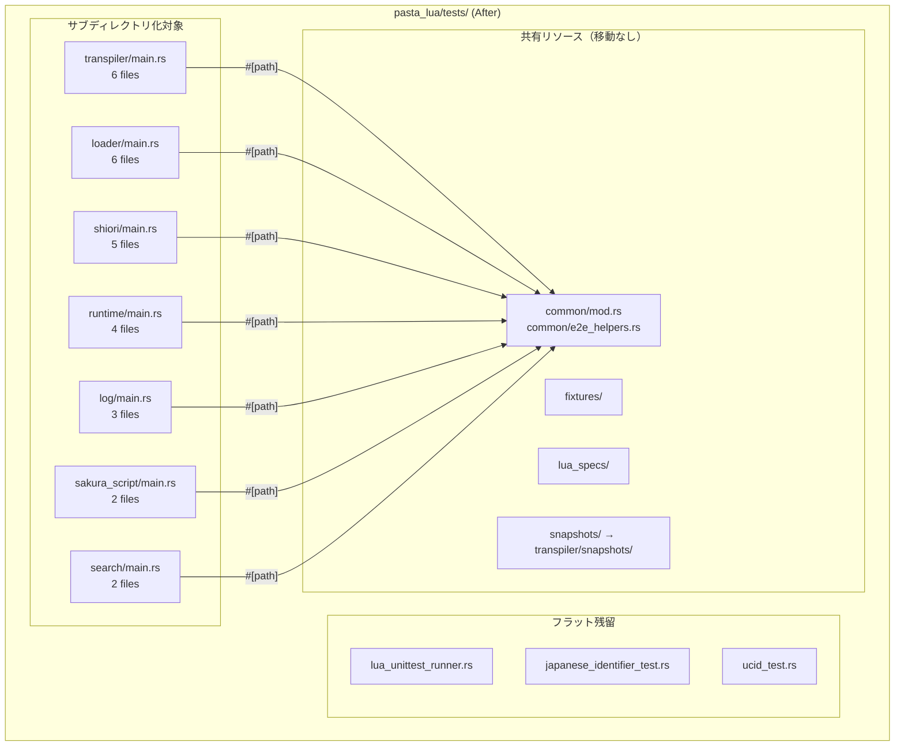
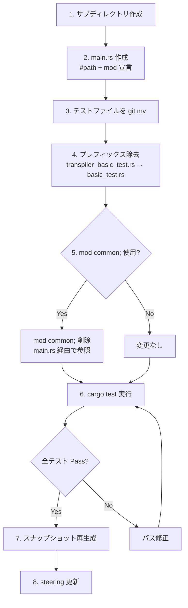
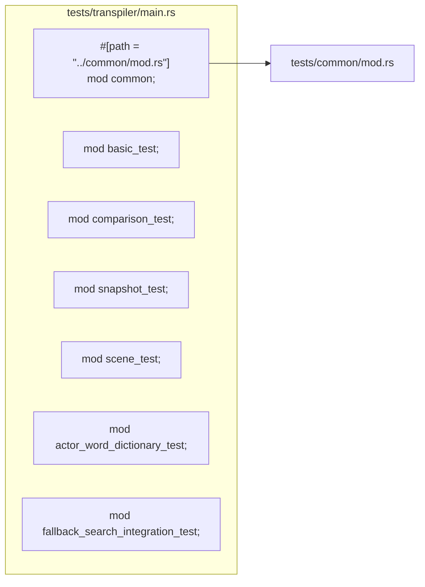
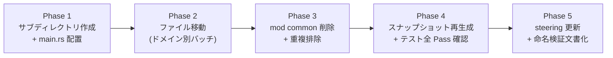

# Design Document: namespace-refactoring

## Overview

**Purpose**: pasta ワークスペース全体のテスト・ソースモジュールの名前空間を整理し、一貫性と可読性を向上させる。特に 36 本のテストファイルがフラットに配置された `pasta_lua` クレートを重点対象として、機能ドメイン別サブディレクトリ構造を導入する。

**Users**: pasta 開発者が、テスト追加時の配置先を迷わず判断でき、関連テストを素早く発見できるようになる。

**Impact**: `pasta_lua/tests/` のディレクトリ構造を再編成し、`steering/structure.md` を実体に同期させる。機能的な変更はなく、全テストの実行結果は維持される。

### Goals
- pasta_lua の 36 テストファイルを機能ドメイン別サブディレクトリに整理する
- `tests/<category>/main.rs` パターンによるサブモジュール化方針を確立する
- `#[cfg(test)] #[path]` パターンを src 内テストの正式方針として文書化する
- テストファイル命名規則の遵守を検証し、例外を文書化する
- `steering/structure.md` を実体と同期させる

### Non-Goals
- pasta_lsp のテスト再編成（テスト 10 本、現時点でスコープ外）
- `pasta_lua/src/` のモジュール移動（レビュー結果「現状維持」）
- テストの機能的な変更やテストケースの追加
- `common/` のクレート化（オーバーエンジニアリング）

## Architecture

### Existing Architecture Analysis

現在の `pasta_lua/tests/` は全 36 `.rs` ファイルがフラットに配置されている。`common/mod.rs` (209 行) と `common/e2e_helpers.rs` (210 行) が共有ヘルパーを提供し、16/36 ファイル (44%) が `mod common;` で参照している。

**現状の問題**:
- 36 ファイルの一覧性が低く、関連テストの発見に時間がかかる
- `common/` の重複定義が 3〜5 ファイルに存在（`copy_dir_recursive`, `create_empty_context` 等）
- プレフィックスベースの暗黙的グルーピング（`transpiler_*`, `loader_*`）に依存

**維持すべきパターン**:
- `cargo test --all` による全テスト検出
- `tests/common/` による共有ヘルパー提供
- `tests/fixtures/`, `tests/lua_specs/`, `tests/snapshots/` の既存配置
- `#[cfg(test)] #[path]` パターン（pasta_core, pasta_shiori で使用中）

### Architecture Pattern & Boundary Map



**Architecture Integration**:
- **Selected pattern**: `tests/<category>/main.rs` + `#[path = "../common/mod.rs"] mod common;`（Cargo 公式対応パターン）
- **Domain boundaries**: 各サブディレクトリは機能ドメインで分離。3 ファイル以上のドメインをサブディレクトリ化
- **Existing patterns preserved**: `common/` 共有ヘルパー、`fixtures/` の `CARGO_MANIFEST_DIR` ベースパス解決、`#[path]` パターン
- **New components rationale**: 各 `main.rs` は既存テストファイルのエントリーポイントとして新規作成。テスト自体の変更は最小限
- **Steering compliance**: `steering/structure.md` のファイル命名規則、`steering/tech.md` のテスト設計原則を維持

## System Flows

### テストファイル移動フロー



### `main.rs` テンプレート構造



## Requirements Traceability

| Requirement | Summary | Components | Interfaces | Flows |
|-------------|---------|------------|------------|-------|
| 1.1 | 10 ファイル超クレートにサブディレクトリ | C1: サブディレクトリ設計 | テストファイルマッピング表 | 移動フロー |
| 1.2 | `main.rs` パターン採用 | C2: main.rs テンプレート | `#[path]` 共有パターン | — |
| 1.3 | 全テスト Pass 保証 | — | — | cargo test 検証 |
| 2.1 | 機能ドメインサブディレクトリ作成 | C1: サブディレクトリ設計 | — | — |
| 2.2 | テストファイル移動 | C3: ファイル移動計画 | — | 移動フロー |
| 2.3 | common/fixtures 位置維持 | C2: main.rs テンプレート | `#[path]` 共有パターン | — |
| 2.4 | lua_specs/snapshots 位置維持 | C4: スナップショット対応 | — | — |
| 2.5 | Rust 統合テスト慣例準拠 | C2: main.rs テンプレート | — | — |
| 3.1 | `#[path]` パターン正式化 | C5: 方針文書化 | — | — |
| 3.2 | 公開 API テストは tests/ 維持 | C5: 方針文書化 | — | — |
| 3.3 | steering に方針明記 | C6: steering 更新 | — | — |
| 4.1 | src/ モジュールレビュー | C7: src レビュー結果 | — | — |
| 4.2 | 不適切なモジュール移動 | — | — | — |
| 4.3 | ユーティリティファイル検証 | C7: src レビュー結果 | — | — |
| 5.1 | 命名規則準拠検証 | C8: 命名検証 | — | — |
| 5.2 | lua_unittest_runner 例外文書化 | C6: steering 更新 | — | — |
| 6.1 | structure.md 同期 | C6: steering 更新 | — | — |
| 6.2 | サブモジュール化方針明記 | C6: steering 更新 | — | — |
| 6.3 | src 内テスト方針明記 | C6: steering 更新 | — | — |

## Components and Interfaces

| Component | Domain/Layer | Intent | Req Coverage | Key Dependencies | Contracts |
|-----------|-------------|--------|--------------|-----------------|-----------|
| C1: サブディレクトリ設計 | Test Structure | 機能ドメイン別サブディレクトリ定義 | 1.1, 2.1 | — | — |
| C2: main.rs テンプレート | Test Structure | 各サブディレクトリの統一エントリーポイント | 1.2, 2.3, 2.5 | common/mod.rs (P0) | — |
| C3: ファイル移動計画 | Test Structure | 全 36 ファイルの移動先マッピング | 2.2 | C1, C2 | — |
| C4: スナップショット対応 | Test Structure | insta スナップショットの移動・再生成 | 2.4 | C3 | — |
| C5: 方針文書化 | Documentation | src 内テスト配置方針の正式化 | 3.1, 3.2, 3.3 | — | — |
| C6: steering 更新 | Documentation | structure.md の実体同期 | 5.2, 6.1, 6.2, 6.3 | C1, C3 | — |
| C7: src レビュー結果 | Source Structure | pasta_lua/src/ モジュール配置検証結果 | 4.1, 4.2, 4.3 | — | — |
| C8: 命名検証 | Source Structure | テストファイル命名規則の準拠検証 | 5.1 | — | — |

### Test Structure

#### C1: サブディレクトリ設計

| Field | Detail |
|-------|--------|
| Intent | pasta_lua の 36 テストファイルを機能ドメイン別に 7 サブディレクトリ + フラット残留に分類する |
| Requirements | 1.1, 2.1 |

**テストファイルマッピング**

以下の 7 サブディレクトリを作成し、33 ファイルを移動する。3 ファイルはフラット残留。

**`tests/transpiler/`** (6 files)

| 移動元 | 移動先（`_test` サフィックスはディレクトリ名で文脈が明確なため維持） |
|--------|------|
| transpiler_basic_test.rs | transpiler/basic_test.rs |
| transpiler_comparison_test.rs | transpiler/comparison_test.rs |
| transpiler_scene_test.rs | transpiler/scene_test.rs |
| transpiler_snapshot_test.rs | transpiler/snapshot_test.rs |
| actor_word_dictionary_test.rs | transpiler/actor_word_dictionary_test.rs |
| fallback_search_integration_test.rs | transpiler/fallback_search_integration_test.rs |

**`tests/loader/`** (6 files)

| 移動元 | 移動先 |
|--------|------|
| loader_cache_test.rs | loader/cache_test.rs |
| loader_config_test.rs | loader/config_test.rs |
| loader_lifecycle_test.rs | loader/lifecycle_test.rs |
| loader_startup_test.rs | loader/startup_test.rs |
| config_actors_initialization_test.rs | loader/config_actors_initialization_test.rs |
| lua_passthrough_test.rs | loader/lua_passthrough_test.rs |

**`tests/shiori/`** (5 files)

| 移動元 | 移動先 |
|--------|------|
| shiori_event_dispatch_test.rs | shiori/event_dispatch_test.rs |
| shiori_event_handler_test.rs | shiori/event_handler_test.rs |
| shiori_res_test.rs | shiori/res_test.rs |
| virtual_event_config_test.rs | shiori/virtual_event_config_test.rs |
| virtual_event_dispatch_test.rs | shiori/virtual_event_dispatch_test.rs |

**`tests/runtime/`** (4 files)

| 移動元 | 移動先 |
|--------|------|
| finalize_scene_test.rs | runtime/finalize_scene_test.rs |
| runtime_scene_test.rs | runtime/scene_test.rs |
| runtime_syntax_test.rs | runtime/syntax_test.rs |
| runtime_test.rs | runtime/unit_test.rs |

> `runtime_test.rs` → `unit_test.rs`: 他の runtime E2E テストと区別するため。Runtime API 単体テスト。

**`tests/log/`** (3 files)

| 移動元 | 移動先 |
|--------|------|
| log_integration_test.rs | log/integration_test.rs |
| log_module_test.rs | log/module_test.rs |
| log_stack_level_test.rs | log/stack_level_test.rs |

**`tests/sakura_script/`** (2 files)

| 移動元 | 移動先 |
|--------|------|
| sakura_script_basic_test.rs | sakura_script/basic_test.rs |
| sakura_script_output_test.rs | sakura_script/output_test.rs |

**`tests/search/`** (2 files)

| 移動元 | 移動先 |
|--------|------|
| scene_search_test.rs | search/scene_search_test.rs |
| search_module_test.rs | search/module_test.rs |

**フラット残留** (3 files)

| ファイル | 残留理由 |
|---------|---------|
| lua_unittest_runner.rs | テストランナー。Lua 単体テストの一括実行基盤。命名例外承認済み |
| japanese_identifier_test.rs | Lua 基盤テスト。mlua のみに依存する独立テスト。サブディレクトリ化の利益が薄い |
| ucid_test.rs | Lua 基盤テスト。同上 |

**統合判断**

| 旧ドメイン | 統合先 | 理由 |
|-----------|--------|------|
| CodeGen (1 file) | — | `code_generator_test.rs` は後述の補足参照 |
| Runtime E2E (3 files) + Runtime (1 file) | runtime/ | 同一モジュール群のテスト |
| Persistence (1 file) | — | 後述の補足参照 |
| Encoding (1 file) | — | 後述の補足参照 |
| Stdlib (2 files) | — | 後述の補足参照 |

> **補足: 小規模ドメインの取り扱い**
>
> 以下の単独〜2 ファイルドメインについて、最終的な配置は実装フェーズで確定する:
> - `code_generator_test.rs` → transpiler/ に統合（コード生成はトランスパイラの一部）
> - `persistence_integration_test.rs` → runtime/ に統合（永続化はランタイムの責務）
> - `pasta_lua_encoding_test.rs` → runtime/ に統合（エンコーディングはランタイムの責務）
> - `stdlib_modules_test.rs`, `stdlib_regex_test.rs` → runtime/ に統合、または独立 stdlib/ サブディレクトリ
>
> これにより transpiler/ は 7 files、runtime/ は 6〜8 files となる可能性がある。

#### C2: main.rs テンプレート

| Field | Detail |
|-------|--------|
| Intent | 各サブディレクトリの統一エントリーポイントを定義する |
| Requirements | 1.2, 2.3, 2.5 |

**テンプレート**

各 `tests/<category>/main.rs` は以下の構造に従う:

```rust
// tests/<category>/main.rs
//
// <category> 関連の統合テストをグルーピングするエントリーポイント。
// common ヘルパーは #[path] で tests/common/ を参照する。

#[path = "../common/mod.rs"]
mod common;

mod basic_test;
mod comparison_test;
// ... 各テストモジュール
```

**ルール**:
1. `#[path = "../common/mod.rs"] mod common;` は `common/` を使用するテストがある場合にのみ記述する
2. 各 `mod <name>;` の `<name>` は移動先ファイル名（`.rs` を除く）と一致する
3. `main.rs` にテスト関数自体は配置しない（エントリーポイントとモジュール宣言のみ）
4. `common` を使用しないテストモジュール内では `use super::common;` または `use crate::common;` で参照可能

**テストモジュール側の変更**:
- `mod common;` 宣言を削除（`main.rs` 経由で提供されるため）
- `common::` への参照はそのまま維持（モジュールパスは変わらない）
- ファイルスコープのインポートはそのまま維持

#### C3: ファイル移動計画

| Field | Detail |
|-------|--------|
| Intent | 全 36 ファイルの移動手順を定義する |
| Requirements | 2.2 |

**移動手順**:
1. サブディレクトリを作成（`mkdir -p tests/{transpiler,loader,shiori,runtime,log,sakura_script,search}`）
2. `git mv` でファイルを移動（リネーム検出維持のため）
3. プレフィックス除去が必要なファイルは `git mv old_name.rs new_name.rs`
4. 各サブディレクトリに `main.rs` を作成
5. 移動したテストファイルから `mod common;` 宣言を削除
6. 重複ヘルパー（`copy_dir_recursive` 等）を自前定義から `common::` 参照に切り替え

**ヘルパー重複排除対象**:

| ファイル | 重複ヘルパー | 対応 |
|---------|------------|------|
| config_actors_initialization_test.rs | `copy_dir_recursive` | `common::copy_dir_recursive` に置換 |
| lua_passthrough_test.rs | `copy_dir_recursive` | 同上 |
| shiori_res_test.rs | `create_empty_context`, `get_scripts_dir` | `common::` に置換 |
| stdlib_modules_test.rs | `create_empty_context` | `common::` に置換 |
| stdlib_regex_test.rs | `create_empty_context`, `value_to_string` | `common::` に置換（`value_to_string` → `common::value_as_str`） |

#### C4: スナップショット対応

| Field | Detail |
|-------|--------|
| Intent | insta スナップショットの移動・再生成を管理する |
| Requirements | 2.4 |

**影響を受けるファイル**: `transpiler_snapshot_test.rs` のみ

**対応手順**:
1. `transpiler_snapshot_test.rs` を `tests/transpiler/snapshot_test.rs` に移動
2. 旧スナップショット `tests/snapshots/transpiler_snapshot_test__*.snap` は残しておく
3. `cargo insta test --review` を実行し、新パス `tests/transpiler/snapshots/snapshot_test__*.snap` にスナップショットを再生成
4. 旧スナップショットディレクトリ `tests/snapshots/` が空になれば削除、残存ファイルがあれば維持

**`tests/lua_specs/`**: `lua_unittest_runner.rs` はフラット残留のため影響なし。位置維持。

### Documentation

#### C5: src 内テスト方針文書化

| Field | Detail |
|-------|--------|
| Intent | `#[cfg(test)] #[path]` パターンを正式方針として定義する |
| Requirements | 3.1, 3.2, 3.3 |

**方針定義**:

```
src/ 内テストファイルの配置方針:

1. private フィールドへの直接アクセスが構造的に必要なテストは、
   `#[cfg(test)] #[path = "<name>_tests.rs"] mod tests;` パターンで src/ 内に配置する。
   
2. 公開 API のみをテストする統合テストは、従来通り `tests/` に外部化する。

3. 判断基準: テスト対象の構造体が `pub(crate)` 以下のフィールドを持ち、
   それらに直接アクセスしなければテストが成立しない場合に限り src/ 内に配置する。

既存の適用例:
- pasta_core/src/registry/scene_table_tests.rs（SceneTable の labels, prefix_index への直接アクセス）
- pasta_shiori/src/shiori_tests.rs（ShioriService の cache への直接アクセス）
```

#### C6: steering/structure.md 更新

| Field | Detail |
|-------|--------|
| Intent | リファクタリング後のディレクトリ構造と方針を steering に反映する |
| Requirements | 5.2, 6.1, 6.2, 6.3 |

**更新内容**:

1. **ディレクトリツリー**: `pasta_lua/tests/` セクションを実際の構造に更新
   ```
   tests/
   ├── transpiler/          # トランスパイラ関連テスト
   │   ├── main.rs          # エントリーポイント
   │   ├── basic_test.rs
   │   └── ...
   ├── loader/              # ローダー関連テスト
   ├── shiori/              # SHIORI関連テスト
   ├── runtime/             # ランタイム関連テスト
   ├── log/                 # ログ関連テスト
   ├── sakura_script/       # SakuraScript関連テスト
   ├── search/              # 検索関連テスト
   ├── common/              # テスト共通ユーティリティ
   ├── fixtures/            # テスト用Pastaスクリプト
   ├── lua_specs/           # Lua単体テスト仕様
   ├── lua_unittest_runner.rs  # Lua単体テストランナー（命名例外）
   ├── japanese_identifier_test.rs  # Lua基盤テスト
   └── ucid_test.rs         # Lua基盤テスト
   ```

2. **テストサブモジュール化方針**: 新セクション追加
   - 10 ファイル超のクレートは機能ドメイン別サブディレクトリ化を推奨
   - `tests/<category>/main.rs` + `#[path = "../common/mod.rs"] mod common;` パターン
   - 3 ファイル未満のドメインは類似ドメインに統合またはフラット残留

3. **src 内テスト方針**: 新セクション追加（C5 の内容を要約）

4. **命名例外**: `lua_unittest_runner.rs` の例外理由を明記

### Source Structure

#### C7: src レビュー結果

| Field | Detail |
|-------|--------|
| Intent | pasta_lua/src/ モジュール配置の妥当性を検証し結果を記録する |
| Requirements | 4.1, 4.2, 4.3 |

**レビュー結果**:

| モジュール | 現在位置 | 判定 | 備考 |
|-----------|---------|------|------|
| transpiler.rs | src/ 直下 | **適切** | クレートの中核公開 API |
| context.rs | src/ 直下 | **適切** | transpiler, code_gen, runtime が参照するクロスカッティング型 |
| config.rs | src/ 直下 | **適切** | クレート全体で使用される設定型 |
| error.rs | src/ 直下 | **適切** | クレート共通エラー型 |
| string_literalizer.rs | src/ 直下 | **許容** | code_gen の補助だが単独完結。移動の利益 < コスト |
| normalize.rs | src/ 直下 | **許容** | トランスパイル出力の後処理。同上 |
| code_gen/ | src/code_gen/ | **適切** | Lua コード生成の責務が明確 |
| runtime/ | src/runtime/ | **適切** | ランタイム関連の責務が明確 |
| loader/ | src/loader/ | **適切** | ローダー関連の責務が明確 |
| encoding/ | src/encoding/ | **適切** | エンコーディング変換の責務が明確 |
| logging/ | src/logging/ | **適切** | ログ出力の責務が明確 |
| sakura_script/ | src/sakura_script/ | **適切** | SakuraScript 生成の責務が明確 |
| search/ | src/search/ | **適切** | 検索機能の責務が明確 |

**結論**: 全モジュールの名前空間は責務に対して適切。`string_literalizer.rs` と `normalize.rs` は将来のリファクタリング候補として記録するが、本フィーチャーでの移動は行わない。

#### C8: 命名検証

| Field | Detail |
|-------|--------|
| Intent | 全テストファイルの `<feature>_test.rs` パターン準拠を検証する |
| Requirements | 5.1 |

**検証結果**: 全 36 ファイル中、`<feature>_test.rs` パターンに準拠しないのは `lua_unittest_runner.rs` のみ。

**例外承認理由**: テストランナーはテストとは役割が異なる。`_runner.rs` サフィックスでランナーとしての役割を明示しており、`_test.rs` にリネームすると意味的に不正確になる。

## Testing Strategy

### 検証方針

本フィーチャーは構造変更のみであり、機能テストの追加は不要。以下の検証で正しさを保証する:

- **全テスト Pass 確認**: `cargo test -p pasta_lua --all-targets` で全テストが Pass することを各移動バッチ後に確認
- **スナップショット再生成**: `cargo insta test -p pasta_lua --review` でスナップショットを再生成し、内容が同一であることを確認
- **ビルド確認**: `cargo build --workspace` でワークスペース全体のビルドが成功することを確認
- **clippy**: `cargo clippy -p pasta_lua --all-targets` で警告がないことを確認
- **git blame 検証**: 移動ファイルの `git log --follow` でリネーム検出が機能していることをスポットチェック

## Optional Sections

### Migration Strategy



**Phase 2 のバッチ順序（推奨）**:
1. transpiler/ — 最大ドメイン、スナップショット含む。最初に完了させることで `#[path]` パターンの実証
2. loader/ — 重複ヘルパー排除を含む
3. shiori/ — 重複ヘルパー排除を含む
4. runtime/ — E2E + 単体の統合
5. log/, sakura_script/, search/ — 小規模ドメイン、一括処理

**ロールバック**: 各バッチは `git mv` で移動するため、`git checkout` で即座にロールバック可能。
