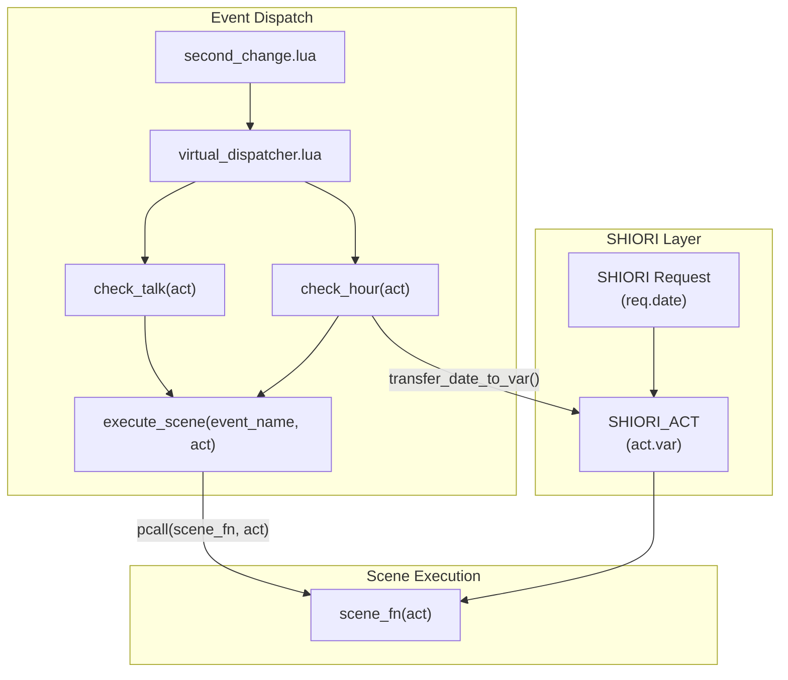
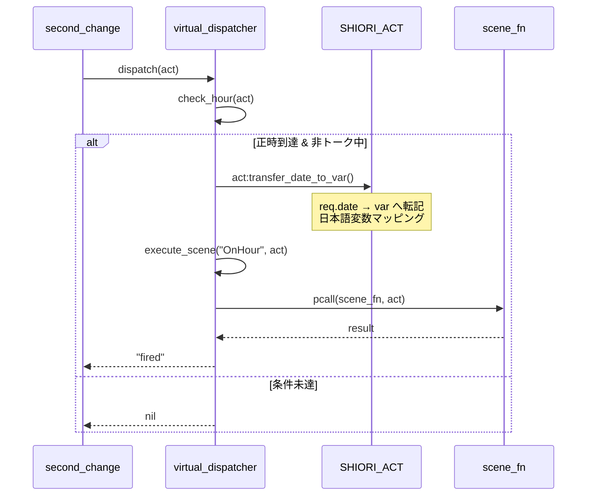

# Design Document: onhour-date-var-transfer

## Overview

**Purpose**: OnHour仮想イベント発火時に、SHIORIリクエストの日時情報（`req.date`）をアクションローカル変数（`act.var`）へ自動転記する機能を提供する。これにより、シーン関数から日時情報に容易にアクセス可能となり、時報などのシーン開発が簡素化される。

**Users**: ゴースト開発者がシーン関数内で `act.var.時` や `act.var.曜日` などの変数を直接使用できる。

**Impact**: 既存の virtual_dispatcher.lua と shiori/act.lua を拡張し、execute_scene の実装ミスも修正する。

### Goals
- OnHour 発火時に日時情報を `act.var` へ自動転記
- 日本語変数名（単位付き文字列）と英語フィールド名（数値型）の両方でアクセス可能
- execute_scene への act 引き渡し修正（既存実装ミスの修正）
- 将来的な再利用のため SHIORI_ACT メソッドとして実装

### Non-Goals
- OnTalk への日時転記（将来的な拡張として検討）
- トランスパイラー層での変数名マッピング（Lua ランタイム層で完結）
- Unix timestamp, ナノ秒, 年内通算日の転記

## Architecture

### Existing Architecture Analysis

**現在の仮想イベントディスパッチフロー**:
```
OnSecondChange → second_change.lua → dispatcher.dispatch(act)
                                         ↓
                                   check_hour(act) / check_talk(act)
                                         ↓
                                   execute_scene(event_name)  ← act が渡されていない（実装ミス）
                                         ↓
                                   SCENE.search() → scene_fn
                                         ↓
                                   pcall(scene_fn)  ← act なしで呼び出し
```

**現在の変数管理**:
- `act.var` = アクションローカル変数（シーン実行中のみ有効）
- `act.req` = SHIORI リクエスト情報（読み取り専用）
- `act.req.date` = 日時情報テーブル

### Architecture Pattern & Boundary Map



**Architecture Integration**:
- Selected pattern: メソッドチェーン拡張パターン
- Domain/feature boundaries: SHIORI_ACT が日時転記の責務を持つ
- Existing patterns preserved: MODULE/MODULE_IMPL 分離パターン、pcall によるエラーハンドリング
- New components rationale: `transfer_date_to_var()` メソッドを SHIORI_ACT に追加（再利用性のため）
- Steering compliance: lua-coding.md のクラス設計パターンに準拠

### Technology Stack

| Layer | Choice / Version | Role in Feature | Notes |
|-------|------------------|-----------------|-------|
| Backend / Services | Lua 5.4 (mlua) | ランタイム実行 | 既存スタック |
| Data / Storage | act.var テーブル | 転記先ストレージ | アクションローカル変数 |

## System Flows

### OnHour 日時転記フロー



## Requirements Traceability

| Requirement | Summary | Components | Interfaces | Flows |
|-------------|---------|------------|------------|-------|
| 1.1 | transfer_date_to_var() メソッド提供 | SHIORI_ACT | SHIORI_ACT_IMPL | - |
| 1.2 | 日時フィールド転記 + 日本語変数マッピング | SHIORI_ACT | transfer_date_to_var() | - |
| 1.3 | req/req.date 不在時の安全終了 | SHIORI_ACT | transfer_date_to_var() | - |
| 1.4 | 英語/日本語両方でアクセス可能 | SHIORI_ACT | act.var | - |
| 2.1 | OnHour 発火時に自動呼び出し | virtual_dispatcher | check_hour() | OnHour Flow |
| 2.2 | シーン関数から日時変数アクセス | SHIORI_ACT, scene_fn | act.var | OnHour Flow |
| 3.1 | pcall(scene_fn, act) で act を渡す | virtual_dispatcher | execute_scene() | OnHour Flow |
| 3.2 | scene_executor にも act を渡す | virtual_dispatcher | _set_scene_executor() | - |
| 3.3 | check_hour/check_talk から act を渡す | virtual_dispatcher | check_hour(), check_talk() | OnHour Flow |
| 4.1 | OnHour 以外では転記しない | virtual_dispatcher | check_talk() | - |
| 4.2 | 転記失敗時もシーン実行継続 | SHIORI_ACT | transfer_date_to_var() | - |
| 4.3 | 既存 OnHour 判定ロジック維持 | virtual_dispatcher | check_hour() | - |

## Components and Interfaces

| Component | Domain/Layer | Intent | Req Coverage | Key Dependencies | Contracts |
|-----------|--------------|--------|--------------|------------------|-----------|
| SHIORI_ACT | SHIORI | 日時転記メソッド提供 | 1.1-1.4 | ACT (P0) | Service |
| virtual_dispatcher | Event | 転記呼び出し + act 引き渡し | 2.1-2.2, 3.1-3.3, 4.1-4.3 | SHIORI_ACT (P0), SCENE (P1) | Service |

### SHIORI Layer

#### SHIORI_ACT

| Field | Detail |
|-------|--------|
| Intent | 日時情報を req.date から var へ転記し、日本語変数マッピングを提供 |
| Requirements | 1.1, 1.2, 1.3, 1.4 |

**Responsibilities & Constraints**
- 日時転記メソッド `transfer_date_to_var()` の提供
- 英語フィールド名（数値型）と日本語変数名（文字列型）の両方を設定
- req または req.date が存在しない場合は何もせず正常終了

**Dependencies**
- Inbound: virtual_dispatcher — check_hour() から呼び出し (P0)
- Inbound: ACT — 継承元クラス (P0)

**Contracts**: Service [x]

##### Service Interface

```lua
--- @class ShioriAct
--- @field var table アクションローカル変数テーブル
--- @field req ShioriRequest|nil SHIORIリクエストオブジェクト

--- 日時フィールドを req.date から var へ転記
--- @param self ShioriAct
--- @return ShioriAct self メソッドチェーン用
function SHIORI_ACT_IMPL.transfer_date_to_var(self)
    -- Preconditions: なし（req/req.date 不在時は何もしない）
    -- Postconditions:
    --   - self.var に英語フィールド（数値型）が設定される
    --   - self.var に日本語変数（文字列型）が設定される
    -- Invariants: self.req は変更されない
end
```

**日本語変数マッピング仕様**

| Source | English Field | Type | Japanese Field | Type | Format |
|--------|---------------|------|----------------|------|--------|
| req.date.year | var.year | number | var.年 | string | "{year}年" |
| req.date.month | var.month | number | var.月 | string | "{month}月" |
| req.date.day | var.day | number | var.日 | string | "{day}日" |
| req.date.hour | var.hour | number | var.時 | string | "{hour}時" |
| req.date.min | var.min | number | var.分 | string | "{min}分" |
| req.date.sec | var.sec | number | var.秒 | string | "{sec}秒" |
| req.date.wday | var.wday | number | var.曜日 | string | 曜日文言 |
| req.date.wday | - | - | var.week | string | 英語曜日名 |
| req.date.hour | - | - | var.時１２ | string | 午前/午後付き |

**曜日変換テーブル**

| wday | var.曜日 | var.week |
|------|---------|---------|
| 0 | "日曜日" | "Sunday" |
| 1 | "月曜日" | "Monday" |
| 2 | "火曜日" | "Tuesday" |
| 3 | "水曜日" | "Wednesday" |
| 4 | "木曜日" | "Thursday" |
| 5 | "金曜日" | "Friday" |
| 6 | "土曜日" | "Saturday" |

**12時間制変換ルール**

| hour | var.時１２ |
|------|-----------|
| 0 | "午前0時" |
| 1-11 | "午前{hour}時" |
| 12 | "正午" |
| 13-23 | "午後{hour-12}時" |

**Implementation Notes**
- 転記対象外: `unix`, `ns`, `yday`, `ordinal`, `num_days_from_sunday`
- エラー時は何もせず正常終了（シーン実行に影響を与えない）

### Event Layer

#### virtual_dispatcher

| Field | Detail |
|-------|--------|
| Intent | OnHour 発火時に日時転記を呼び出し、execute_scene に act を渡す |
| Requirements | 2.1, 2.2, 3.1, 3.2, 3.3, 4.1, 4.2, 4.3 |

**Responsibilities & Constraints**
- check_hour() 内で OnHour 発火確定後に `act:transfer_date_to_var()` を呼び出す
- execute_scene() のシグネチャを `(event_name, act)` に変更
- `pcall(scene_fn, act)` で act を渡す
- 既存の OnHour 判定ロジック（正時検出、優先度制御）は変更しない

**Dependencies**
- Inbound: second_change.lua — dispatch(act) 呼び出し (P0)
- Outbound: SHIORI_ACT — transfer_date_to_var() 呼び出し (P0)
- Outbound: SCENE — search() によるシーン検索 (P1)

**Contracts**: Service [x]

##### Service Interface

```lua
--- シーン関数を実行
--- @param event_name string イベント名 ("OnTalk" or "OnHour")
--- @param act ShioriAct actオブジェクト
--- @return string|nil 実行結果（エラー時は nil）
local function execute_scene(event_name, act)
    -- Preconditions: event_name は非空文字列
    -- Postconditions: scene_fn に act が渡される
end

--- OnHour 判定・発行
--- @param act ShioriAct actオブジェクト
--- @return string|nil "fired" (発行成功), nil (発行なし)
function M.check_hour(act)
    -- Preconditions: act.req.date が存在
    -- Postconditions: 
    --   - OnHour 発火時は act:transfer_date_to_var() が呼び出される
    --   - execute_scene("OnHour", act) で act が渡される
end

--- OnTalk 判定・発行
--- @param act ShioriAct actオブジェクト
--- @return string|nil "fired" (発行成功), nil (発行なし)
function M.check_talk(act)
    -- Preconditions: act.req.date が存在
    -- Postconditions: 
    --   - transfer_date_to_var() は呼び出されない（OnHour のみ）
    --   - execute_scene("OnTalk", act) で act が渡される
end

--- テスト用: シーン実行関数をモックで差し替え
--- @param executor function|nil シーン実行関数 (event_name, act) -> result
function M._set_scene_executor(executor)
    -- Postconditions: scene_executor(event_name, act) 形式で呼び出される
end
```

**Implementation Notes**
- check_talk() では `transfer_date_to_var()` を呼び出さない（要件 4.1）
- 転記処理の失敗はログ出力のみ、シーン実行は継続（要件 4.2）

## Error Handling

### Error Strategy
- **Fail Safe**: 転記処理の失敗はシーン実行に影響を与えない
- **Logging**: エラー発生時は print() でログ出力（既存パターン準拠）

### Error Categories and Responses

| Error Type | Condition | Response |
|------------|-----------|----------|
| req 不在 | act.req が nil | 何もせず正常終了 |
| req.date 不在 | act.req.date が nil | 何もせず正常終了 |
| 転記処理失敗 | pcall 内でエラー | ログ出力、シーン実行継続 |

## Testing Strategy

### Unit Tests
1. `transfer_date_to_var()` - 正常系: 全フィールド転記確認
2. `transfer_date_to_var()` - req 不在時の安全終了
3. `transfer_date_to_var()` - req.date 不在時の安全終了
4. `transfer_date_to_var()` - 日本語変数マッピング確認
5. `transfer_date_to_var()` - 曜日変換確認（wday 0-6）
6. `transfer_date_to_var()` - 12時間制変換確認（hour 0-23）

### Integration Tests
1. `check_hour()` - OnHour 発火時の転記確認
2. `execute_scene()` - act がシーン関数に渡されることを確認
3. `check_talk()` - OnTalk では転記されないことを確認
4. `_set_scene_executor()` - テスト用モックに act が渡されることを確認

### E2E Tests
1. OnSecondChange → OnHour → シーン関数での日時変数アクセス

## Optional Sections

### Performance & Scalability

**パフォーマンス影響は軽微**:
- 転記処理はシンプルなテーブルコピー（O(1)）
- OnHour は1時間に1回のみ発火
- 追加オーバーヘッドは無視できるレベル
