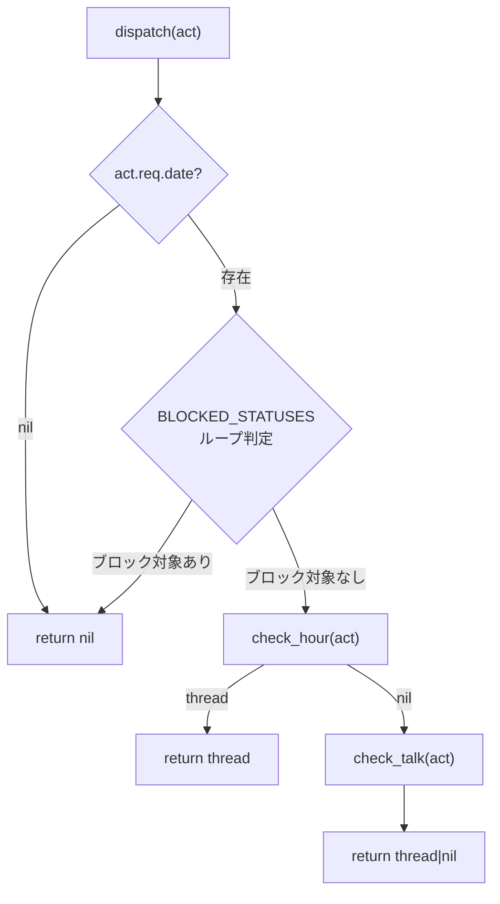
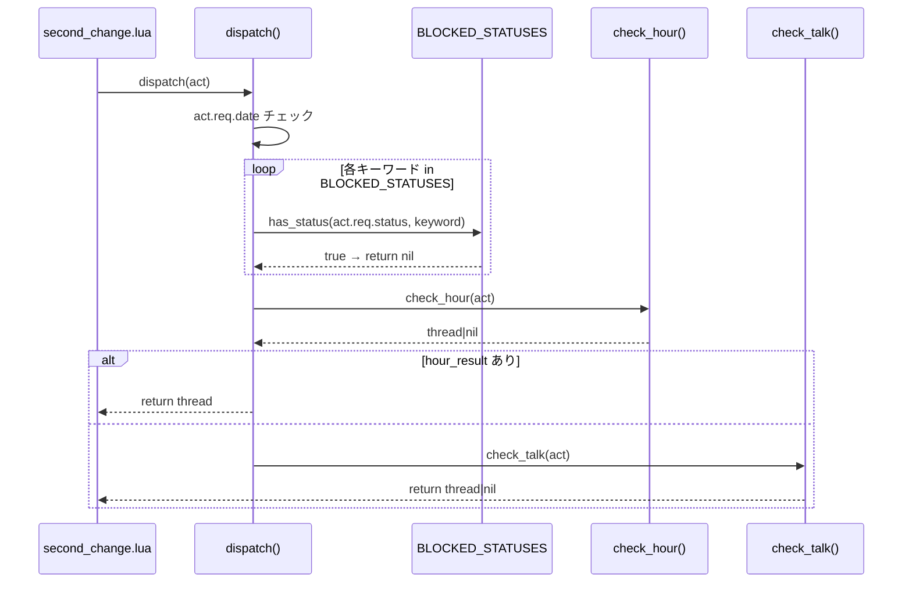

# Technical Design: ontalk-block-condition

## Overview

**Purpose**: OnSecondChange経由で発行されるOnTalk/OnHour仮想イベントの発火条件を強化し、SSP Statusヘッダに基づくブロックガードを`dispatch()`入口に一元化する。

**Users**: ゴースト開発者が、OnUpdateComplete等の他イベントトーク出力中にOnTalk/OnHourが誤って上書きしない安定動作を得る。

**Impact**: `virtual_dispatcher.lua` のブロック判定アーキテクチャを、check_*関数内の個別チェックから dispatch()入口の集約ガードに変更。

### Goals
- SSP拡張Status値9キーワードを網羅するブロックガードの実装
- ブロック条件の一元管理（1箇所修正で完結）
- 全ブロック条件のテストカバレッジ確保

### Non-Goals
- ゴースト作者向けブロックリストのカスタマイズAPI（不要と確定）
- `has_status()` のワード境界マッチ強化（現行語彙では不要）
- `check_hour()`/`check_talk()` の直接呼び出し保護（ドキュメントで対応）

## Architecture

### Existing Architecture Analysis

現行の `virtual_dispatcher.lua` は以下の構造を持つ:

```
dispatch(act)
  ├── act.req.date 存在チェック → nil
  ├── check_hour(act)
  │   ├── 初回初期化 → nil
  │   ├── 正時未到達 → nil
  │   ├── talking チェック → nil     ← 個別ブロック
  │   ├── choosing チェック → nil    ← 個別ブロック
  │   └── シーン解決 → thread|nil
  └── check_talk(act)
      ├── talking チェック → nil     ← 個別ブロック（重複）
      ├── choosing チェック → nil    ← 個別ブロック（重複）
      ├── 初回初期化 → nil
      ├── 時刻未到達 → nil
      ├── 時報マージン → nil
      └── シーン解決 → thread|nil
```

**問題点**:
- ブロック条件が `check_hour` と `check_talk` に分散・重複（talking, choosing の2箇所×2関数 = 4判定）
- `dispatch()` 入口にブロック判定がなく、Status追加時に複数箇所を修正する必要がある
- SSP Status 9キーワード中 2キーワードのみ対応

### Architecture Pattern & Boundary Map



**Architecture Integration**:
- **Selected pattern**: dispatch入口集約ガード（Option A）— 変更量最小で Req 1, 2 を同時達成
- **Existing patterns preserved**: `has_status()` プレーンfind、モジュールテーブル `M` 公開パターン、テスト用 `_reset()`/`_set_scene_executor()`
- **New components**: `local BLOCKED_STATUSES` テーブル（モジュールローカル定数）
- **Steering compliance**: 単一Luaモジュール変更、既存テストフレームワーク活用、宣言的フロー維持

### Technology Stack

| Layer | Choice / Version | Role in Feature | Notes |
|-------|------------------|-----------------|-------|
| Runtime | Lua 5.5 (mlua 0.11) | ブロック判定ロジック実行 | 変更なし |
| Testing | lua_test (BDD) | ブロック条件の網羅テスト | 既存フレームワーク |
| Documentation | shiori-handlers.md | ブロック条件の仕様記述 | 更新対象 |

## System Flows

### ブロック判定フロー（変更後）



## Requirements Traceability

| Requirement | Summary | Components | Interfaces | Flows |
|-------------|---------|------------|------------|-------|
| 1.1 | dispatch入口の集約ブロックガード（9キーワード） | BLOCKED_STATUSES, dispatch() | has_status() | ブロック判定フロー |
| 2.1 | check_hour/check_talk 個別チェック廃止 | check_hour(), check_talk() | — | — |
| 2.2 | BLOCKED_STATUSES 一元管理テーブル | BLOCKED_STATUSES | — | — |
| 3.1 | 全9キーワードのブロックテスト | テスト追加 | create_mock_act() | — |
| 3.2 | 複合Status（カンマ区切り）テスト | テスト追加 | create_mock_act() | — |
| 3.3 | nil/空文字列の非ブロックテスト | テスト追加 | create_mock_act() | — |
| 4.1 | shiori-handlers.md Status一覧更新 | shiori-handlers.md | — | — |
| 4.2 | dispatch() ブロックガード記述追記 | shiori-handlers.md | — | — |

## Components and Interfaces

| Component | Domain/Layer | Intent | Req Coverage | Key Dependencies | Contracts |
|-----------|--------------|--------|--------------|------------------|-----------|
| BLOCKED_STATUSES | Runtime/Data | ブロック対象Statusキーワードの定義 | 1.1, 2.2 | — | — |
| dispatch() | Runtime/Entry | 集約ブロックガード実行 | 1.1, 2.1 | BLOCKED_STATUSES (P0), has_status() (P0) | — |
| check_hour() | Runtime/Logic | 個別ブロック判定の削除 | 2.1 | — | — |
| check_talk() | Runtime/Logic | 個別ブロック判定の削除 | 2.1 | — | — |
| テストスイート | Testing | 全ブロック条件の検証 | 3.1, 3.2, 3.3 | dispatcher (P0), lua_test (P0) | — |
| shiori-handlers.md | Docs | 仕様記述更新 | 4.1, 4.2 | — | — |

### Runtime Layer

#### BLOCKED_STATUSES

| Field | Detail |
|-------|--------|
| Intent | ブロック対象SSP Statusキーワードの一元定義 |
| Requirements | 1.1, 2.2 |

**Responsibilities & Constraints**
- モジュールローカル定数テーブルとして宣言
- 全9キーワードを配列形式で保持
- `dispatch()` のブロック判定ループで参照される唯一のソース

**定義**:
```lua
local BLOCKED_STATUSES = {
    "talking",
    "choosing",
    "online",
    "opening",
    "passive",
    "induction",
    "timecritical",
    "nouserbreak",
    "minimizing",
}
```

**Implementation Notes**
- 配列形式（`ipairs` でループ）を採用。9要素のためハッシュテーブル化不要
- キーワード順序は意味を持たない（全要素を走査）

#### dispatch() — ブロックガード追加

| Field | Detail |
|-------|--------|
| Intent | dispatch入口でSSP Statusブロック判定を一括実行 |
| Requirements | 1.1, 2.1 |

**変更内容**:
- `act.req.date` チェック直後に `BLOCKED_STATUSES` ループ判定を挿入
- `has_status(act.req.status, keyword)` が `true` を返したら即 `return nil`

**変更後の制御フロー**:
```
dispatch(act):
  1. act.req.date 存在チェック → nil
  2. BLOCKED_STATUSES ループ: has_status() → nil  ← NEW
  3. check_hour(act) → thread|nil
  4. check_talk(act) → thread|nil
```

#### check_hour() — 個別チェック削除

| Field | Detail |
|-------|--------|
| Intent | talking/choosing の個別ブロック判定を削除 |
| Requirements | 2.1 |

**変更内容**:
- 以下の4行を削除:
  ```lua
  if has_status(act.req.status, "talking") then return nil end
  if has_status(act.req.status, "choosing") then return nil end
  ```
- 残りのロジック（初回初期化、正時判定、フォールバックチェーン）は変更なし

#### check_talk() — 個別チェック削除

| Field | Detail |
|-------|--------|
| Intent | talking/choosing の個別ブロック判定を削除 |
| Requirements | 2.1 |

**変更内容**:
- 以下の4行を削除（check_hour と同様）:
  ```lua
  if has_status(act.req.status, "talking") then return nil end
  if has_status(act.req.status, "choosing") then return nil end
  ```
- 残りのロジック（初回初期化、interval判定、時報マージン、チェイントーク）は変更なし

### Testing Layer

#### ブロック条件テストスイート

| Field | Detail |
|-------|--------|
| Intent | 全9キーワード + 複合Status + nil/空の網羅テスト |
| Requirements | 3.1, 3.2, 3.3 |

**テスト対象ファイル**: `crates/pasta_lua/tests/lua_specs/virtual_dispatcher_spec.lua`

**テストケース設計**:

| テストケース | Status値 | 期待結果 | Req |
|-------------|---------|---------|-----|
| talking でブロック | `"talking"` | nil | 3.1 |
| choosing でブロック | `"choosing"` | nil | 3.1 |
| online でブロック | `"online"` | nil | 3.1 |
| opening でブロック | `"opening(communicate)"` | nil | 3.1 |
| passive でブロック | `"passive"` | nil | 3.1 |
| induction でブロック | `"induction"` | nil | 3.1 |
| timecritical でブロック | `"timecritical"` | nil | 3.1 |
| nouserbreak でブロック | `"nouserbreak"` | nil | 3.1 |
| minimizing でブロック | `"minimizing"` | nil | 3.1 |
| 複合Statusでブロック | `"choosing,balloon(0=0)"` | nil | 3.2 |
| 複合Status内にブロック対象 | `"online,balloon(1=2)"` | nil | 3.2 |
| status=nil で非ブロック | `nil` | 非nil（通常発行） | 3.3 |
| status="" で非ブロック | `""` | 非nil（通常発行） | 3.3 |
| status="idle" で非ブロック | `"idle"` | 非nil（通常発行） | 3.3 |
| balloon のみは非ブロック | `"balloon(0=0)"` | 非nil（通常発行） | 3.3 |

**Implementation Notes**
- `dispatch()` 経由でテスト（入口ガードの動作確認）
- 既存の `create_mock_act()` ヘルパーと `_set_scene_executor()` モックを活用
- 既存の talking/choosing テスト（check_hour/check_talk 直接呼び出し）は削除または dispatch() 経由に移行

### Documentation Layer

#### shiori-handlers.md 更新

| Field | Detail |
|-------|--------|
| Intent | ブロック対象Status一覧とdispatch()ガード仕様の記述 |
| Requirements | 4.1, 4.2 |

**変更内容**:
1. `dispatch(act)` セクション: 「Statusブロックガードは `dispatch()` 入口で一括判定される」旨を追記
2. ブロック対象Status一覧（9キーワード）を表形式で追記
3. `act.req.status == "talking"` の既存記述をブロックガード記述に置換
