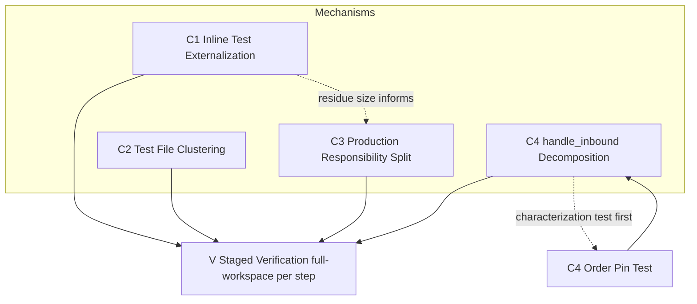
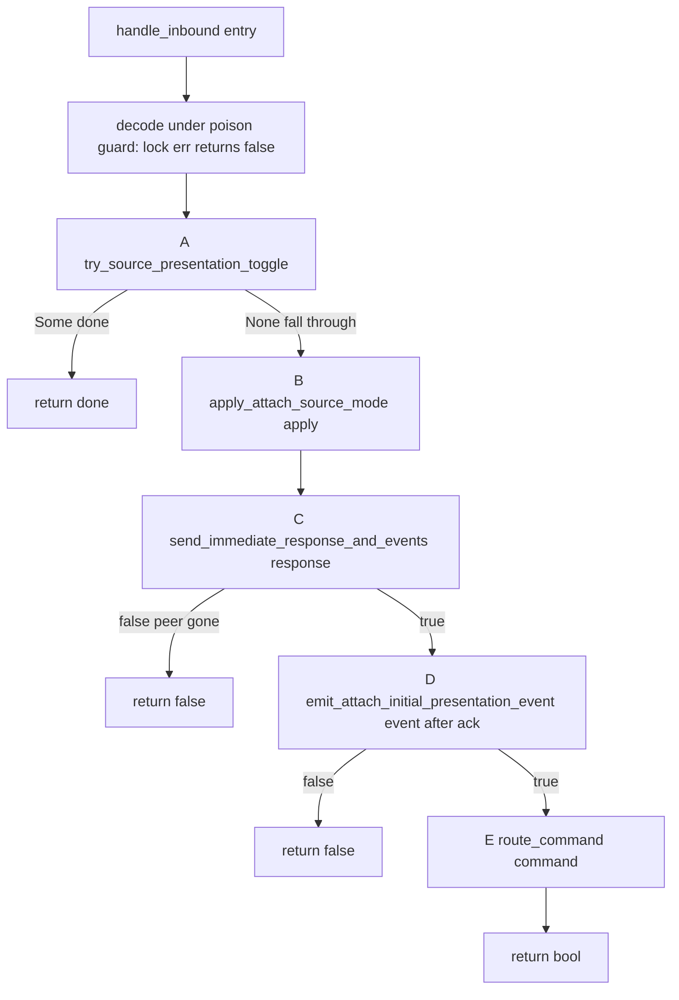

# Technical Design: oversized-file-decomposition

## Overview

**Purpose**: 本仕様は pasta ワークスペースの巨大 Rust ファイルを、AI・人間の双方が「全体を俯瞰できる」サイズへ是正する**純粋リファクタリング**（振る舞い不変）の技術設計である。観測可能な振る舞い・公開 API・可視性を一切変更せず、既存テストが green を維持することを絶対条件とする。

**Users**: pasta のコントリビュータ（および支援 AI）。巨大ファイルの「狙い撃ち読解」を強いられる状況を解消し、編集・レビュー・差分理解のコストを下げる。

**Impact**: 4 カテゴリの機械的反復操作で既存コードを再配置する。新規機能・新規依存・新規型はゼロ。唯一の内部可視性変更は `loader::ProcessStats` の `private → pub(super)` 1 箇所（never re-export・外部影響なし）。

### Goals
- `src/` 本番ファイルからインライン `#[cfg(test)]` テストモジュールを規約準拠の兄弟ファイルへ全て外出しする（主基準・バイナリ判定）
- 純粋肥大本番ファイルを責務単位サブモジュールへ分割し、公開 API・可視性を不変に保つ
- `debug/wiring.rs` の `handle_inbound` を順序保証付きヘルパーへ解体し、`setBreakpoints` 原子性を保持する
- 各ステップで `cargo build --workspace` / `cargo test --workspace` が green を維持する（段階的検証）
- 是正後の各 Rust ファイルを 600 行未満に収めることを努力目標とする

### Non-Goals
- 機能追加・バグ修正・最適化・あらゆる振る舞いの変更
- 公開 API シグネチャ・可視性の変更（C3 の `ProcessStats` 内部広げを除く）
- `setBreakpoints` 分岐の内部分解／`run_socket_bridge` のループ多重化コア書き換え
- TypeScript（vscode 拡張）テストの分割
- 新規テストケースの追加（C4 の順序固定特性化テスト 1 本のみ安全網として例外許可）

## Boundary Commitments

### This Spec Owns
- `research.md §2.1` の確定インベントリ＋着手時再スキャンで検出される該当ファイル（和集合）の物理的再配置
- C1: インライン `#[cfg(test)] mod` の兄弟 `#[path]` ファイルへの移動
- C2: 既外出し済み巨大テストファイルの論理クラスタ分割
- C3: 純粋肥大本番ファイルの責務単位サブモジュール分割（split-`impl` 方式）
- C4: `handle_inbound` のヘルパー抽出＋順序保証文書化＋順序固定特性化テスト 1 本
- 段階的検証手順（全ワークスペース毎ステップ）

### Out of Boundary
- 任意の振る舞い変更・最適化・バグ修正
- `setBreakpoints` 分岐の内部分解（原子保持）
- `run_socket_bridge` のループ多重化コア書き換え
- 公開 API シグネチャ・可視性の変更（`tests/` への可視性変更を伴う外部化は不採用）
- TypeScript テスト分割
- 新規テストケース追加（C4 特性化テスト 1 本を除く）

### Allowed Dependencies
- 上流規約 `.kiro/steering/structure.md`（`#[cfg(test)] #[path]` 規約・命名規則・テストサブモジュール化方針）— 変更せず適用のみ
- 前例 `pasta_core/src/registry/scene_table.rs:417`・`pasta_shiori/src/shiori.rs:330` の `#[path]` パターン
- Rust ネイティブのモジュールシステム（split-`impl`・子モジュールの祖先 private 参照・`#[path]`）
- 既存ビルド/テストツールチェーン（`cargo`・`NoDefaultCurrentDirectoryInExePath` 無効化前提）

### Revalidation Triggers
本仕様は振る舞い不変が前提のため、下流の再検証は原則不要。ただし以下が発生した場合は逸脱とみなし停止・是正する:
- 公開 API シグネチャ・可視性の変更が必要になった場合（設計の前提崩壊）
- `cargo test --workspace` のテスト集合（名前・件数・結果）が移動以外で変化した場合
- `handle_inbound` 解体後に `apply→response→event→command` 順序・`setBreakpoints` 原子性が変化した場合
- `run_socket_bridge` の I/O 多重化コアに変更が及んだ場合

## Architecture

### Existing Architecture Analysis
- pasta は Pure Virtual Workspace（`crates/*/src/`）。レイヤー分離（`pasta_dsl → pasta_core → pasta_lua → pasta_shiori` / `pasta_lsp`）。本仕様はレイヤー構造・依存方向を**一切変えない**。
- 巨大ファイルの主因は本番ロジックの設計崩壊ではなく `#[cfg(test)]` テスト同居。`structure.md` は既に `#[cfg(test)] #[path = "<name>_tests.rs"] mod tests;` 規約と前例を持つが、`debug/` 等が規約から取り残されている。
- 技術的負債として「俯瞰不能サイズ」を解消し、規約準拠状態へ収束させる。

### Architecture Pattern & Boundary Map

本仕様は 4 つの独立した**機械的反復操作**（カテゴリ C1–C4）と、それらを貫く**段階的検証**（V）から成る。各カテゴリは単一の反復メカニズムを持ち、ファイル単位で独立に適用・検証・revert 可能。



**Architecture Integration**:
- 選択パターン: カテゴリ別**反復変換**＋全ステップ全ワークスペース検証。リスク逓減順 C1→C2→C3→C4、C4 は隔離タスク。
- 責務分離: 各カテゴリは異なる「変換メカニズム」を持ち、互いに干渉しない。C1 完了で C3 対象（`dap.rs`/`debug/mod.rs`）の本番残余サイズが確定し、C3 の分割判断が正確になる自然な依存のみ存在。
- 既存パターン保持: レイヤー分離・依存方向・公開 API・`#[path]` テスト規約・ディレクトリモジュール流儀（`code_gen/`・`loader/`・`runtime/`）。
- 新規コンポーネント根拠: 新規型・新規依存なし。新設するのは「既存項目の再配置先ファイル」と「C4 のヘルパー free fn 群（同一モジュール内・private）」のみ。
- Steering 準拠: `structure.md` の `src/` 内テスト配置方針・命名規則・テストサブモジュール化方針へ全面準拠。

### Technology Stack

| Layer | Choice / Version | Role in Feature | Notes |
|-------|------------------|-----------------|-------|
| Backend / Services | Rust 2024 edition | 対象コード全般 | 新規依存ゼロ |
| Infrastructure / Runtime | cargo（workspace） | 段階的検証（build/test） | `NoDefaultCurrentDirectoryInExePath` 無効化が前提（LuaJIT ビルド） |
| Module system | Rust `mod` / `#[path]` / split-`impl` | 再配置メカニズム | 子モジュールは祖先 private を参照可（可視性変更不要） |

## File Structure Plan

> 確定インベントリ（`research.md §2.1`）＋着手時再スキャンの和集合が対象。以下は確定分の物理配置。各兄弟テストファイルは先頭に `use super::*;` を持ち、本番側は `#[cfg(test)] #[path = "<sibling>.rs"] mod <name>;` を宣言する。

### C1 — インラインテスト外出し（既定: 1 mod → 1 兄弟ファイル）

```
crates/pasta_lua/src/debug/
├── session.rs        # 本番残（テスト外出し後）
├── session_tests.rs            # [新] 単一移動後も ~2260行 → 下記クラスタ分割へ
│   ├── session_injection_tests.rs        # [新] source-map injection
│   ├── session_step_controller_tests.rs  # [新] step over/in/out
│   ├── session_pasta_step_tests.rs       # [新] .pasta 粒度ステップ
│   ├── session_anchor_tests.rs           # [新] line-break anchor 状態機械
│   ├── session_hook_integration_tests.rs # [新] hook 統合
│   └── session_stop_loop_tests.rs        # [新] stop-loop inspect routing
├── transport_tests.rs          # [新] 単一（~740行）
├── dap_tests.rs → 4分割         # [新] dap_protocol/source_presentation/pasta_resolver/edge _tests.rs
├── inspect_tests.rs            # [新] 単一（~1023行・任意で更分割可）
├── source_map_tests.rs → 3分割  # [新] resolve/builder/sidecar _tests.rs
├── debug_mod_tests.rs          # [新] debug/mod.rs のテスト（名前衝突回避で _mod_ 明示）
└── hook_tests.rs               # [新] 単一
crates/pasta_lua/src/code_gen/
├── element_gen_tests.rs        # [新] 単一
└── scope_gen_tests.rs          # [新] 単一
crates/pasta_lua/src/loader/
├── config_tests.rs             # [新] 単一
├── discovery_tests.rs          # [新] 単一
└── extract_tests.rs            # [新] 単一
crates/pasta_lua/src/transpiler_tests.rs   # [新] 単一
crates/pasta_shiori/src/windows_tests.rs   # [新] 単一
```

> 分割判定ルール: **単一兄弟を既定**。単一移動後も 600 行超かつ自然なクラスタを持つファイル（`session`/`dap`/`source_map`）のみ `#[path]` 多重宣言で複数兄弟へ分割する。インライン `#[cfg(test)]` マーカーが複数でも、トップレベル `mod tests` は各 1 個（残りはテスト専用ヘルパー/メソッドで本番内に残置）。

### C2 — 巨大テストファイルのクラスタ分割

```
crates/pasta_lua/tests/runtime/
├── main.rs   # [変更] 新規 mod 宣言を追加
├── runtime_toggle_bp_e2e_test.rs / _mode_resolution_ / _step_granularity_ / _no_regression_  # [新] runtime_toggle_e2e_test.rs を4分割
├── runtime_toggle_e2e_common.rs    # [新] 共有 DapClient/is_event/is_response（#[path] 共有）
└── debug_zero_cost_sandbox_regression_test.rs  # [新] debug_integration_test.rs から内側 mod を抽出
crates/pasta_lua/tests/loader/main.rs     # [変更] config_test.rs を機能別8ファイルへ（既存同名と区別）
crates/pasta_lua/tests/transpiler/main.rs # [変更] record_wiring_test.rs を element/scope 2分割
crates/pasta_lua/tests/shiori/main.rs     # [変更] virtual_event_config_test.rs を6分割
crates/pasta_dsl/tests/    # cue_cmd_test.rs を5ファイルへ（flat・各々が test binary）
crates/pasta_shiori/tests/ # async_callback_integration_test.rs 3分割・lua_request_test.rs を内側mod単位で7分割（flat）
crates/pasta_shiori/src/shiori_tests.rs    # [変更] #[path] 単一 → 4サブファイル＋多重 #[path] 宣言
crates/pasta_core/src/registry/scene_table_tests.rs  # [変更] #[path] 単一 → 5サブファイル＋多重 #[path] 宣言
```

> `tests/<category>/` 配下は新規ファイルを作成し当該 `main.rs` に `mod <name>;` を登録。flat な `tests/*.rs`（pasta_dsl・pasta_shiori）は各ファイルが独立テストバイナリ。`#[path]` src テストは親サイトの単一 `#[path] mod tests;` を複数 `#[cfg(test)] #[path=...] mod NAME;` へ置換し、各サブファイルに `use super::*;`。

### C3 — 純粋本番の責務分割（split-`impl`・型と pub API は親に残置）

```
crates/pasta_lsp/src/analysis/
├── mod.rs       # [変更] mod visitors; を mod visit_scope/visit_expr/visit_action; へ。pub use 変更なし
├── visit_scope.rs   # [新] impl AnalysisEngine: file-items/scene/actor/marker visitor（~320行）
├── visit_expr.rs    # [新] impl AnalysisEngine: VarSet/式トークン化（~380行）
└── visit_action.rs  # [新] impl AnalysisEngine: action/cue visitor＋span→token 共有ヘルパー（~290行）
crates/pasta_lua/src/loader/
├── mod.rs            # [変更] PastaLoader 型＋load/load_with_config＋re-export ハブ残置。mod process/source_map_build; 追加
├── process.rs        # [新] impl PastaLoader: discover_all_files/process_incremental＋ProcessStats(pub(super)へ)＋module_key（~270行）
└── source_map_build.rs  # [新] impl PastaLoader: build_source_map（pub）＋build_source_map_inner（~175行）
crates/pasta_lua/src/runtime/
├── mod.rs        # [変更] PastaLuaRuntime 型定義（private fields）＋new/with_config/with_config_and_source_map＋re-export ハブ。mod factory/exec/lifecycle; 追加
├── factory.rs    # [新] impl PastaLuaRuntime: from_loader(_with_scene_dic)/load_scene_dic（~230行）
├── exec.rs       # [新] impl PastaLuaRuntime: exec/exec_named/exec_file/register_module＋accessors（~130行）
└── lifecycle.rs  # [新] impl PastaLuaRuntime: save_persistence_data＋impl Drop（~55行）
```

> split-`impl` 方式: 型定義・公開 API・`pub use` re-export は親 `mod.rs` に残置。メソッド本体のみ子モジュールの `impl Type {}` へ分配。子モジュールは祖先 `mod.rs` の private フィールド・private 自由関数を参照可（**可視性変更不要**）。例外は `loader::ProcessStats` の `private→pub(super)` 1 箇所のみ。

### C4 — handle_inbound 解体（同一モジュール内 private free fn）

```
crates/pasta_lua/src/debug/wiring.rs   # [変更] handle_inbound を5ヘルパーへ抽出。helpers は同一ファイル内 private free fn
crates/pasta_lua/src/debug/wiring.rs（bridge_lifecycle_tests）  # [変更] 順序固定特性化テスト1本を追加（安全網・新規テスト禁止の明示例外）
```

### Modified Files（再配置に伴う宣言変更）
- 各 C1 本番ファイル — 末尾のインライン `mod tests {...}` を削除し `#[cfg(test)] #[path] mod tests;` 宣言へ置換
- C2 各 `tests/<category>/main.rs` — `mod` 宣言追加
- C3 各親 `mod.rs` — `mod <sibling>;` 追加（`pub use` は原則不変・`loader` は `TranspileResult` を別ファイル化する場合のみ `pub use result::TranspileResult;` 追加）
- C4 `wiring.rs` — `handle_inbound` 本体を helper 呼び出し列へ、helper 群を追加

## System Flows

### C4: handle_inbound 解体後の順序保証フロー



**Key Decisions**:
- ヘルパーは `handle_inbound` 内で固定列 A→B→C→D→E に呼ばれ、`apply → response → event → command` の順序不変条件を doc comment で列挙・保証する。
- `setBreakpoints` 原子分岐は E（`route_command`）内の単一 `match` arm として保持し、内部分解・session 転送を行わない（R4.1）。
- poison/ピア切断時の `return false`（bridge は panic せず停止）を全ヘルパーが byte 単位で保持。
- 抽出は `handle_inbound` 内部に閉じ、`run_socket_bridge` のシグネチャ・I/O 多重化コアは不変（R4.4）。

## Requirements Traceability

| Requirement | Summary | Components | Interfaces / Mechanism | Flows |
|-------------|---------|------------|------------------------|-------|
| 1.1–1.5 | インラインテスト兄弟外出し | C1 | `#[cfg(test)] #[path] mod` + `use super::*;`・1 mod→1 兄弟 | — |
| 1.6 | 外出し完了のバイナリ判定 | C1, V | `src/` 本番にインライン `mod tests` 残存0 確認 | — |
| 1.7 | 対象集合の和集合確定 | C1 | 確定インベントリ＋再スキャン | — |
| 2.1–2.3 | 巨大テストのクラスタ分割 | C2 | `tests/<cat>/main.rs` mod 登録 / `#[path]` 多重宣言 | — |
| 3.1–3.3 | 純粋本番の責務分割 | C3 | split-`impl`・型/pub API/re-export は親残置 | — |
| 4.1 | setBreakpoints 原子保持 | C4 | `route_command` 内単一 match arm | C4 flow |
| 4.2 | 順序保持＋文書化 | C4 | 固定列 A→B→C→D→E＋doc comment | C4 flow |
| 4.3 | 抽出後 振る舞い不変 | C4, V | 特性化テスト＋全 WS test | C4 flow |
| 4.4 | run_socket_bridge 不変 | C4 | handle_inbound 内部に閉じる | C4 flow |
| 4.5 | 特性化テスト先行 | C4 | setBreakpoints 非転送 pin テスト | — |
| 4.6 | 小さく可逆なステップ | C4, V | 1抽出=1検証=1コミット | — |
| 5.1 | 全 WS 毎ステップ検証 | V | `cargo build/test --workspace` | — |
| 5.2 | 失敗時 同ステップ内是正 | V | green 回復まで進まない | — |
| 5.3 | 観測振る舞い不変 | V | テスト集合/公開 API/挙動不変 | — |
| 5.4 | env 無効化 | V | `NoDefaultCurrentDirectoryInExePath` 無効化 | — |
| 5.5 | 600 行数値目標 | C1–C4 | 努力目標（凝集優先で超過時は理由記録） | — |
| 6.1–6.3 | 規約準拠 | C1–C4 | `structure.md` 規約・前例パターン整合 | — |

## Components and Interfaces

| Component | Domain/Layer | Intent | Req Coverage | Key Dependencies | Contracts |
|-----------|--------------|--------|--------------|------------------|-----------|
| C1 Inline Test Externalization | 全クレート src | インラインテストを兄弟ファイルへ | 1.1–1.7, 6.1–6.3 | structure.md 規約, `#[path]` 前例 (P0) | — |
| C2 Test File Clustering | 全クレート tests / `#[path]` src | 巨大テストを論理分割 | 2.1–2.3, 6.1 | テストサブモジュール化方針 (P0) | — |
| C3 Production Responsibility Split | pasta_lsp/pasta_lua src | 純粋本番を split-`impl` 分割 | 3.1–3.3, 6.1 | Rust split-impl/子モジュール private 参照 (P0) | State |
| C4 handle_inbound Decomposition | pasta_lua debug | 制御フロー解体・順序保証 | 4.1–4.6 | wiring.rs 既存 helper (P0) | Service |
| V Staged Verification | workspace | 全ステップ全 WS 検証 | 5.1–5.5 | cargo, env 前提 (P0) | Batch |

### Refactoring Mechanisms

#### C1 — Inline Test Externalization

| Field | Detail |
|-------|--------|
| Intent | `src/` 本番のインライン `#[cfg(test)] mod` を規約準拠の兄弟ファイルへ移動 |
| Requirements | 1.1, 1.2, 1.3, 1.4, 1.5, 1.6, 1.7, 6.1, 6.2, 6.3 |

**Responsibilities & Constraints**
- 各本番ファイルのトップレベル `#[cfg(test)] mod tests {...}` を `<filestem>_tests.rs`（単一クラスタ）または `<filestem>_<topic>_tests.rs`（複数クラスタ）へ移動。
- 本番側は `#[cfg(test)] #[path = "<sibling>.rs"] mod tests;`、兄弟側は先頭 `use super::*;`。同一モジュールパス維持で private/`pub(crate)` 到達性を保持（可視性変更なし）。
- テスト集合（名前・件数・アサーション）は移動のみ。新規追加・削除なし（1.5）。
- 完了基準: 当該クレートの `src/` 本番に `#[cfg(test)] mod` テストが残存しない（1.6・バイナリ）。

**Dependencies**
- External: `structure.md` `#[path]` 規約・前例 `scene_table.rs:417`/`shiori.rs:330` — 適用パターン (P0)

**Implementation Notes**
- Integration: debug src テストは `#[ctor]`/env 操作を持たず OS 割当ポート0 bind で env 非依存 → 移動は純機械的（保全すべきガード無し）。
- Validation: 各ファイル移動後 V を実行。
- Risks: マクロ生成テスト（`macro_rules!`/`rstest`/`paste`）はスコープ内に不在で抽出は機械的。テスト専用ヘルパーメソッドは本番内に残置（トップレベル `mod tests` のみ移動）。

#### C2 — Test File Clustering

| Field | Detail |
|-------|--------|
| Intent | 既外出し済み巨大テストファイルを論理クラスタ別に複数ファイルへ再分割 |
| Requirements | 2.1, 2.2, 2.3, 6.1 |

**Responsibilities & Constraints**
- `tests/<category>/` 配下: 新規ファイル作成＋当該 `main.rs` に `mod <name>;` 登録。共有ヘルパー（`DapClient`・`mod common`）は `#[path]` 共有 or `common/` で到達性維持。
- flat `tests/*.rs`（pasta_dsl/pasta_shiori）: 各ファイルが独立テストバイナリ。
- `#[path]` src テスト（`shiori_tests.rs`・`scene_table_tests.rs`）: 単一 `#[path]` を複数サブファイル＋多重 `#[cfg(test)] #[path=...] mod NAME;` へ。各サブに `use super::*;`。
- テストの集合・検証内容を不変に保つ（2.3）。

**Dependencies**
- External: `structure.md` テストサブモジュール化方針（`tests/<category>/main.rs`+`mod`） (P0)

**Implementation Notes**
- Integration: 固定ポート中和 `#[ctor]` は runtime テストハーネス側に存在。`runtime_toggle_e2e_test.rs`/`debug_integration_test.rs` 分割時は当該 `#[ctor]` がテストバイナリにリンクされ続けることのみ確認。
- Risks: `tests/loader/` には既存 `config_test.rs`/`config_defaults_test.rs` 等があるため新規ファイル名は区別（`config_<section>_test.rs`）。

#### C3 — Production Responsibility Split

| Field | Detail |
|-------|--------|
| Intent | 純粋肥大本番ファイルを split-`impl` で責務単位サブモジュールへ分割 |
| Requirements | 3.1, 3.2, 3.3, 6.1 |

**Responsibilities & Constraints**
- 型定義・公開 API シグネチャ・可視性・`pub use` re-export は親 `mod.rs` に残置（3.2・不変）。メソッド本体のみ子モジュール `impl Type {}` へ分配。
- 子モジュールは祖先 `mod.rs` の private フィールド・private 自由関数・private メソッドを参照可（Rust 規則）→ **可視性広げ不要**。
- 実行時振る舞いを不変に保つ（3.3・純粋リファクタリング）。

**Contracts**: State [x]

##### State Management
- `PastaLuaRuntime` の private fields（`lua`/`logger`/`config`/`base_dir`/`debug_handle`/`source_map`）は `mod.rs` の型定義に残置。子モジュール `factory.rs`/`exec.rs`/`lifecycle.rs` は `self.<field>` を直接参照（祖先 private 参照規則で合法・可視性変更しない）。
- `impl Drop for PastaLuaRuntime` は `lifecycle.rs` へ移動可（クレート内 coherence で合法）。`save_persistence_data` は唯一の呼び出し元 `Drop` と co-locate。

**Dependencies**
- External: Rust split-`impl`・子モジュール private 参照・trait coherence (P0)

**Implementation Notes**
- Integration: 各 private 自由関数（`module_key`/`build_source_map_inner`）は唯一の呼び出し元と同一サブファイルへ同梱し、跨ぎ `use` を回避。
- Validation: C1 完了後に着手（`dap.rs`/`debug/mod.rs` の本番残余サイズ確定後に責務分割判断）。`cargo check -p <crate>` で private 参照のコンパイルを早期確認。
- Risks: 唯一の可視性変更 `loader::ProcessStats` `private→pub(super)`（`load_with_config` が `process.rs` の戻り値フィールドを読むため。never re-export・外部影響なし）。`visitors.rs` は unit struct・状態なしで最低リスク、`runtime/mod.rs` は private フィールド跨ぎ参照が多く最高リスク（要 `cargo check` 確認）。

#### C4 — handle_inbound Decomposition

| Field | Detail |
|-------|--------|
| Intent | `handle_inbound` を順序保証付き 5 ヘルパーへ解体し `setBreakpoints` 原子性を保持 |
| Requirements | 4.1, 4.2, 4.3, 4.4, 4.5, 4.6 |

**Responsibilities & Constraints**
- 5 ヘルパー（同一モジュール内 private free fn）を固定列 A→B→C→D→E で呼び、`apply→response→event→command` 順序を doc comment で保証。
- `setBreakpoints` は E 内の単一 `match` arm として原子保持・session 非転送（4.1）。
- poison/ピア切断 → `return false`（bridge 非 panic）を全ヘルパーで保持。
- `run_socket_bridge` のシグネチャ・I/O 多重化コアは不変（4.4）。
- 解体は 1 抽出=1 検証=1 コミットの revert 可能な小ステップ（4.6）。

**Contracts**: Service [x]

##### Service Interface
```rust
// A: 自己完結トグル交換。Some(bool)=処理済み(handle_inbound の戻り値)、None=フォールスルー
fn try_source_presentation_toggle(
    transport: &Transport, adapter: &SharedAdapter, cmd_tx: &Sender<SessionCommand>,
    req: &Value, source_map: &SourceMapWiring, command: &str, decoded: &Decoded,
) -> Option<bool>;
// B: 明示 attach mode 適用（set + resolver 再実行）。送信せず・失敗せず
fn apply_attach_source_mode(adapter: &SharedAdapter, source_map: &SourceMapWiring, decoded: &Decoded);
// C: 即時 response + handshake events 送信。false=ピア切断
fn send_immediate_response_and_events(transport: &Transport, decoded: &Decoded) -> bool;
// D: attach 完了時の初期 presentation event を ack の後に emit。false=ピア切断
fn emit_attach_initial_presentation_event(
    transport: &Transport, adapter: &SharedAdapter, source_map: &SourceMapWiring, command: &str,
) -> bool;
// E: コマンド routing。setBreakpoints は原子 apply+encode+send・非転送を内部保持。false=切断
fn route_command(
    transport: &Transport, adapter: &SharedAdapter, breakpoints: &BreakpointSet,
    cmd_tx: &Sender<SessionCommand>, source_map: &SourceMapWiring, decoded: Decoded,
) -> bool;
```
- Preconditions: `handle_inbound` は decode/poison guard（lock err→false）を保持したまま A→B→C→D→E を呼ぶ。
- Postconditions: 同一入力に対し抽出前と同一の出力・副作用（送信フレーム順・cmd_tx 転送）。
- Invariants: apply は response/event より前；ack は event より前；`setBreakpoints` は非転送；戻り値 false の伝播（ピア/session 切断→bridge 停止）。

**Dependencies**
- Inbound: `run_socket_bridge` — 毎フレーム `handle_inbound` 呼び出し（不変）(P0)
- Outbound: 既存 `attach_pasta_resolver`/`translate_pasta_breakpoints`/`encode_event` — 流用 (P0)

**Implementation Notes**
- Integration: ヘルパーは `attach_pasta_resolver`/`translate_pasta_breakpoints` と同じ module-level free fn スタイル。
- Validation（特性化テスト先行・4.5）: 既存テストが順序をほぼ全カバー（`source_presentation_toggle_tests` が apply→response→event→command を、attach 系が ack-before-event を、poison/unknown を網羅）。**唯一の不足は「`setBreakpoints` 非転送」の直接 pin**。`bridge_lifecycle_tests` に特性化テスト 1 本を**解体前**に追加: setBreakpoints 要求が (1) `true` を返し (2) 単一 `setBreakpoints` response フレームを出し (3) `cmd_rx.try_recv().is_err()`（非転送）、対照として stop-context コマンドは 1 件転送する。
- Risks: 順序逆転・原子性崩壊が最大リスク → 特性化テストが解体中の回帰を即検出。

#### V — Staged Verification

| Field | Detail |
|-------|--------|
| Intent | 各ステップ後に全ワークスペースの build/test green を確認 |
| Requirements | 5.1, 5.2, 5.3, 5.4, 5.5 |

**Contracts**: Batch [x]

##### Batch / Job Contract
- Trigger: 各ファイル/クレート単位の分割完了直後（毎回）。
- Input / validation: `cargo build --workspace` ＋ `cargo test --workspace`（クレート単位への簡略化禁止・5.1）。
- Output / destination: 両者 green を確認してから次ステップ。失敗時は同ステップ内で原因是正・green 回復まで進まない（5.2）。
- Idempotency & recovery: 各ステップは独立 green・revert 可能（1 ファイル=1 検証=1 コミット）。
- 前提: `cargo` 実行前に `NoDefaultCurrentDirectoryInExePath` 環境変数を無効化（5.4・LuaJIT ビルド）。

## Error Handling

### Error Strategy
本仕様は純粋リファクタリングのため「エラー」＝コンパイル失敗 or テスト失敗 or 振る舞い差分。検出と回復は段階的検証（V）に集約。

### Error Categories and Responses
- **コンパイル失敗（C1–C4）**: `cargo build --workspace` 赤 → 当該ステップ内で是正（多くは `use super::*;` 漏れ・`mod` 宣言漏れ・private 参照の可視性）。次へ進まない。
- **テスト失敗（振る舞い差分）**: `cargo test --workspace` 赤 → 移動/抽出の誤りを是正し green 回復。C4 では特性化テストが順序/原子性回帰を直接示す。
- **可視性エラー（C3）**: 子モジュール private 参照が想定外に通らない場合 → `pub(super)` 最小広げ（`ProcessStats` のみ既知）。公開 API/外部可視性は変えない。

### Monitoring
- 各ステップのコミットメッセージに対象ファイルと検証結果を記録。revert 可能性を担保。

## Testing Strategy

### Unit / Module Tests（既存テストの保全が主目的）
- C1: 各本番ファイルの兄弟外出し後、当該テストモジュールの**テスト名・件数が移動前と一致**することを `cargo test --workspace` の集計で確認（例: `session_*_tests`・`dap_*_tests`・`transpiler_tests`）。
- C3: `cargo check -p pasta_lua` / `-p pasta_lsp` で split-`impl` の private 参照がコンパイルを通ることを早期確認。

### Integration Tests
- C2: 分割した `tests/<category>/` が `main.rs` の `mod` 登録経由で全テストを実行し、件数不変を確認（`runtime_toggle_*`・`config_*`・`record_wiring_*`・`virtual_event_*`）。
- C2: `#[path]` src テスト分割（`shiori_*_tests`・`scene_table_*_tests`）が多重 `#[path]` 宣言で全テストを実行することを確認。

### Characterization Test（C4・安全網・新規 1 本）
- `bridge_lifecycle_tests` に「`setBreakpoints` 非転送＋単一 response＋対照の stop-context 転送」を pin するテストを**解体前**に追加（4.5）。これにより E（`route_command`）抽出の振る舞い不変が証明可能。

### Full-Workspace Regression（V・全ステップ）
- 各ステップ後 `cargo build --workspace` ＋ `cargo test --workspace`（env 無効化前提）が green。クレート横断（公開 API 経由）の回帰を全 WS 実行で捕捉。

## Security Considerations
該当なし（コード再配置のみ・新規入力経路・権限・外部通信なし）。debug transport は既存の loopback 固定・opt-in を一切変更しない。
