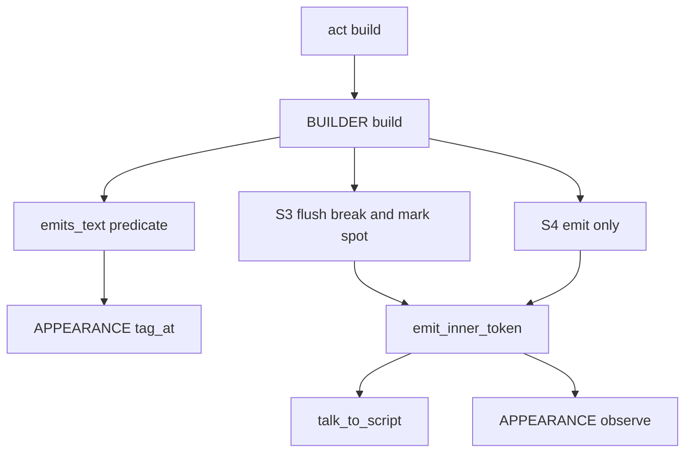
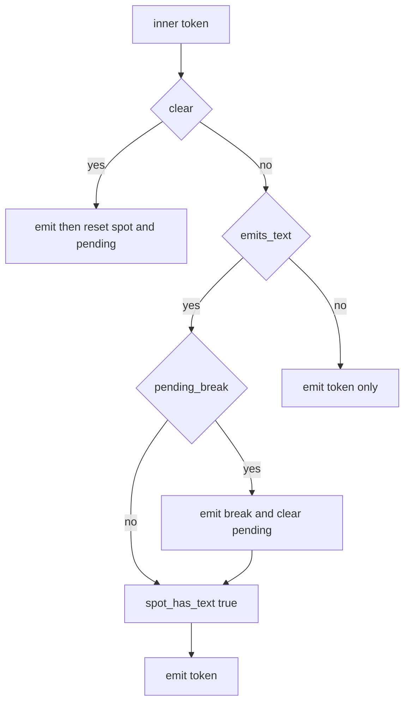

# Design Document: paragraph-break-tag-only-talk

## Overview

**Purpose**: 段落区切りの改行（`\n[spot_newlines×100]`）の判定で、タグを除くと字が残らない `talk` を「字なし」として扱う。表情や着せ替えのタグだけを返す単語（`＠通常` の値が `\s[1000]` だけ、など）で、バルーンに余分な空きができないようにする。

**Users**: 表情を単語で返すゴーストの作者と利用者（emo2 ほか。areka・SSP の両方で再現）。

**Impact**: `sakura_builder.lua` の内側トークンの振り分け（S3/S4）の条件を「空でない `talk`」から「字を出すトークン」に改める。判定に使うタグの読み取りは `appearance.lua` の既存の `tag_at` を共有する。段落区切りの規則そのもの（完全遅延・切替時の再評価・`\c` でのリセット・終端での破棄・改行幅）と、字のある `talk` だけのトークの出力は変えない。

### Goals
- 字の無い `talk` は保留中の改行を出さず、スポットを字を出したスポットにしない（2.1, 2.2）。
- 申し送りの (a)・(b) の並びで余分な `\n[150]` が出ない（4.1, 4.2）。
- 字のある `talk` だけのトークの出力がバイト単位で変わらない（3.2）。
- 内部設計と利用者向けのマニュアルが新しい判定で一致し、スキル `references/` が最新である（5.1〜5.4）。

### Non-Goals
- 段落区切りの規則（`sakura-script-newline` の完全遅延方式）の変更。
- タグの区切り方（`NAME_PATTERN`・`ARG_PATTERN`）の変更。既知の制約（後述）も直さない。
- 単語の値の種別判定（タグだけの値を `talk` 以外のトークンにする）、`act.lua` のトークン化・グループ化。
- `talk` の中のスコープ切替タグの後ろの字を別スポットの字として数えること。
- 外見の観測・復旧の挙動の変更、BudouX の改行、バルーンの描画（areka）。

## Boundary Commitments

### This Spec Owns
- 段落区切りの判定で「トークンが字を出すか」を決める述語（`talk` の字の定義と、文字を表示するタグの `sakura_script`）。
- `BUILDER.build` の S3（改行のフラッシュ＋字ありの設定）と S4（出力のみ）の振り分け条件。
- 文字を表示するタグの一覧（`_u`・`_m`・`&`）。
- 上記を固定するテストと、マニュアル 2 章（`internals/talk-output.md`・`reference/pasta-toml.md` の `spot_newlines`）の記述、および生成スキル `pasta-ghost-authoring/references/pasta-toml.md`。

### Out of Boundary
- `act.lua`（`call-execution-correctness` が Wave 3 で持つ）、`element_gen.rs`、Rust の `sakura_script/`（`SAKURA_TAG_PATTERN`・`talk_to_script`）。
- `appearance.lua` の観測・復旧の挙動。本仕様は既存の局所関数 `tag_at` を公開するだけで、その中身も呼び出し方も変えない。
- タグの区切り方の既知の制約の解消（`\nHello` の読み方など）。
- areka 側の `areka-P0-budoux-reveal-reflow`。

### Allowed Dependencies
- `sakura_builder.lua` → `appearance.lua`（`APPEARANCE.tag_at`、既存の `APPEARANCE.new`・`observe`・`restore`）。依存の向きは既存と同じ（ビルダーが外見を呼ぶ）。`appearance.lua` からビルダーへの依存は作らない。
- `sakura-script-newline`（完了）の状態機械（`spot_has_text`・`pending_break`）をそのまま使う。
- `act-token-grouping-fix`（完了）のグループ化・`merge_consecutive_talks` の結果を、入力としてそのまま受け取る。

### Revalidation Triggers
- `appearance.lua` の `tag_at`・`NAME_PATTERN`・`ARG_PATTERN` の変更（字の判定も一緒に変わる）。
- `merge_consecutive_talks` の結合規則の変更（字の無い `talk` と字のある `talk` が 1 つに結合されるかが変わり、改行の位置が変わる）。
- DSL の `sakura_script` が 1 トークン＝タグ 1 つでなくなる文法変更。
- `talk_to_script` に渡す前のテキストの形の変更（判定は変換前のテキストで行う）。

## Architecture

### Existing Architecture Analysis
- `BUILDER.build` は内側のトークンを 3 つに振り分ける。S4b（`clear`）、S3（`talk` かつ非空: 保留の改行をフラッシュ → `spot_has_text[last_spot] = true` → 出力）、S4（それ以外: 出力と外見の観測だけ、状態は不変）。
- 字の無い `talk` を S4 に流せば、保留の維持（2.1）、字ありにしない（2.2）、出力と観測は従来どおり（2.3）、改行は後続の字のある `talk` の直前（2.4）、離脱・終端での破棄（2.5）が、既存の状態機械からそのまま得られる。新しい状態は要らない。
- `BUILDER.build` は循環的複雑度 22 を `luacheck: ignore 561` で許容している。条件は局所関数に外出しして複雑度を増やさない。

### Architecture Pattern & Boundary Map



**Architecture Integration**:
- Selected pattern: 既存の振り分けの条件の差し替え（Option A。比較は `research.md`）。
- Domain/feature boundaries: 「字」の規則はビルダー（段落区切りの判定の持ち主）に置き、タグの区切り方は `appearance` の既存の部品を共有する。
- Existing patterns preserved: S3/S4 の状態機械、`emit_inner_token` による出力と観測、`appearance` の局所関数構成。
- New components rationale: 述語 `emits_text` は S3 の条件を 1 か所にまとめるために要る（複雑度を増やさない）。
- Steering compliance: 新しい依存・設定キー・モジュールを足さない。マニュアルが正（挙動と同じ変更でマニュアルを直す）。

### Technology Stack

| Layer | Choice / Version | Role in Feature | Notes |
|-------|------------------|-----------------|-------|
| Runtime | LuaJIT 2.1（mlua 0.11） | `sakura_builder.lua`・`appearance.lua` の実行 | 新しい依存なし。Lua パターンだけを使う |
| Test | `lua_test`（scriptlibs）、`lua_unittest_runner.rs` | `sakura_builder_test.lua`・`shiori_act_test.lua` の実行 | 既存の仕組み |
| Docs | mdBook、`book/tools/gen-skill-refs.mjs` | マニュアルとスキル `references/` の再生成 | 既存の仕組み |

## File Structure Plan

### Modified Files
- `crates/pasta_lua/pasta_scripts/pasta/shiori/sakura_builder.lua` — 文字を表示するタグの表 `CHAR_TAGS`、局所関数 `has_text(s)`・`emits_text(inner)` を足し、S3 の条件を `emits_text(inner)` に置き換える。S3/S4 のコメントと `spot_has_text` の説明を「字を出すトークン」に改める。
- `crates/pasta_lua/pasta_scripts/pasta/shiori/appearance.lua` — 既存の局所関数 `tag_at` を `APPEARANCE.tag_at` として公開する（関数本体は変えない）。モジュールの冒頭の説明に「タグの読み取りを段落区切りの判定と共有する」旨を 1 行足す。
- `crates/pasta_lua/tests/lua_specs/sakura_builder_test.lua` — 新しい `describe` ブロック（申し送り (a)・(b)、字の境界、保留の扱い）を末尾に足す。既存のテストは変えない。
- `crates/pasta_lua/tests/lua_specs/shiori_act_test.lua` — `act:talk` にタグだけの文字列を渡したときの出力を確かめるテストを 1 つ末尾に足す（4.4。`ACT_IMPL.talk` からビルダーまでの経路）。
- `book/src/internals/talk-output.md` — 状態表（`spot_has_text`・`pending_break`）、内側のトークンの本文、字の定義の小節、モジュール表と境界表の `APPEARANCE.tag_at`、既知の制約。
- `book/src/reference/pasta-toml.md` — `#### spot_newlines` にタグだけの出力は台詞に数えない旨の 1 項目。
- `.claude/skills/pasta-ghost-authoring/references/pasta-toml.md` — `gen-skill-refs.mjs` で再生成（手で編集しない）。

新しいファイルは作らない。

## System Flows



- 変わるのは菱形 `emits_text` の条件だけである（旧: `talk` かつテキストが非空）。
- 判定は `talk_to_script` に渡す前の `inner.text` に対して行う（1.8）。ウェイトや BudouX の改行は判定に影響しない。

## Requirements Traceability

| Requirement | Summary | Components | Interfaces | Flows |
|-------------|---------|------------|------------|-------|
| 1.1 | タグを除いて残れば字あり | TextPredicate | `has_text` | emits_text |
| 1.2 | タグだけなら字なし | TextPredicate | `has_text`、`APPEARANCE.tag_at` | emits_text |
| 1.3 | `\\` は字 | TextPredicate | `tag_at` が `nil` を返す位置を字とする | emits_text |
| 1.4 | `\_u`・`\_m`・`\&` は字 | TextPredicate | `CHAR_TAGS` | emits_text |
| 1.5 | 空白は字 | TextPredicate | `\` 以外の文字はすべて字（特別扱いなし） | emits_text |
| 1.6 | `\q[…]` など他のタグは字でない | TextPredicate | `CHAR_TAGS` 以外のタグは読み飛ばす | emits_text |
| 1.7 | `\` ＋ タグ名に使えない文字は字 | TextPredicate | `tag_at` が `nil` | emits_text |
| 1.8 | 変換前のテキストで判定 | BuilderDispatch | `emits_text(inner)` を `inner.text` に適用 | emits_text |
| 1.9 | 文字を表示するタグの `sakura_script` は字 | TextPredicate、BuilderDispatch | `emits_text` の `sakura_script` 分岐 | emits_text → S3 |
| 2.1 | 字なしは保留を出さず解除しない | BuilderDispatch | S4 | S4 |
| 2.2 | 字なしはスポットを字ありにしない | BuilderDispatch | S4 | S4 |
| 2.3 | 字なしの出力と観測は従来どおり | BuilderDispatch | `emit_inner_token` | S4 |
| 2.4 | 改行は字のある `talk` の直前に 1 つ | BuilderDispatch | S3 のフラッシュ | S4 → S3 |
| 2.5 | 字なしだけで離脱・終端なら破棄 | BuilderDispatch | 既存の S1・S7 | S4 |
| 3.1 | 字のある `talk` は従来どおり | BuilderDispatch | S3 | S3 |
| 3.2 | 字のある `talk` だけのトークはバイト不変 | BuilderDispatch | 新旧の条件はこの入力で一致 | S3 |
| 3.3 | 段落区切りの規則は不変 | BuilderDispatch | S1・S4b・S5・S7 に手を入れない | — |
| 3.4 | `talk` 以外は不変（1.9 を除く） | TextPredicate | `emits_text` は `talk`・`sakura_script` 以外で偽 | S4 |
| 4.1 | 申し送り (a) | BuilderDispatch | — | Testing (a) |
| 4.2 | 申し送り (b) | BuilderDispatch | — | Testing (b) |
| 4.3 | 字のあるスポットへ戻れば 1 つ | BuilderDispatch | S1 の再評価＋S3 | S3 |
| 4.4 | DSL の単語参照の経路 | BuilderDispatch | `ACT_IMPL.talk` が作る `talk` トークンをそのまま判定 | Testing 4.4 |
| 5.1 | 利用者向けマニュアル | Docs | `reference/pasta-toml.md` | — |
| 5.2 | 内部設計のマニュアル | Docs | `internals/talk-output.md` | — |
| 5.3 | スキル再生成と鮮度照合 | Docs | `gen-skill-refs.mjs`・`--check` | — |
| 5.4 | 2 章が矛盾しない | Docs | 同じ用語「字」「台詞」 | — |
| 6.1 | (a)・(b) のバイト検証 | Tests | `sakura_builder_test.lua` | — |
| 6.2 | 字の境界のケース | Tests | `sakura_builder_test.lua` | — |
| 6.3 | 保留の扱い | Tests | `sakura_builder_test.lua` | — |
| 6.4 | 既存テストを期待値を変えずに通す | Tests | 全体のテスト | — |

## Components and Interfaces

| Component | Domain/Layer | Intent | Req Coverage | Key Dependencies (P0/P1) | Contracts |
|-----------|--------------|--------|--------------|--------------------------|-----------|
| TagReader（`APPEARANCE.tag_at`） | pasta.shiori.appearance | 既存のタグ読み取りを公開する | 1.2, 1.3, 1.7 | なし | Service |
| TextPredicate（`has_text`・`emits_text`・`CHAR_TAGS`） | pasta.shiori.sakura_builder（局所） | トークンが字を出すかを決める | 1.1〜1.7, 1.9, 3.4 | TagReader (P0) | Service |
| BuilderDispatch（`BUILDER.build` の S3/S4） | pasta.shiori.sakura_builder | 述語で S3/S4 を振り分ける | 1.8, 2.1〜2.5, 3.1〜3.3, 4.1〜4.4 | TextPredicate (P0) | State |
| Docs | book | 新しい判定をマニュアルに書く | 5.1〜5.4 | gen-skill-refs.mjs (P1) | — |
| Tests | crates/pasta_lua/tests/lua_specs | 挙動を固定する | 6.1〜6.4 | lua_unittest_runner (P0) | — |

### pasta.shiori.appearance

#### TagReader（`APPEARANCE.tag_at`）

| Field | Detail |
|-------|--------|
| Intent | 既存の局所関数 `tag_at` を、段落区切りの判定から使えるように公開する |
| Requirements | 1.2, 1.3, 1.7 |

**Responsibilities & Constraints**
- 関数本体・`NAME_PATTERN`・`ARG_PATTERN` は変えない。`appearance.lua` 内の既存の呼び出し（`next_tag`・`scan_leading_text`）もそのまま局所関数を使う。
- 状態を持たず、文字列を読むだけで変えない（モジュールの既存の不変条件）。

**Contracts**: Service [x]

##### Service Interface
```lua
--- 位置 i の `\` から始まるタグを読む（既存の局所関数をそのまま公開）
--- @param s string
--- @param i integer  s:sub(i, i) == "\\" であること（呼び出し側の責任）
--- @return string|nil name  タグ名（`\` を除く）。タグでなければ nil（`\\`・`\` ＋ タグ名に使えない文字・文字列末尾の `\`）
--- @return string|nil arg   角括弧の中身（最初の `]` まで）。無ければ nil
--- @return integer|nil next_pos  タグ直後の位置
function APPEARANCE.tag_at(s, i) end
```
- Preconditions: `i` の位置が `\`。
- Postconditions: 戻り値は変更前の局所関数と同じ。

### pasta.shiori.sakura_builder

#### TextPredicate

| Field | Detail |
|-------|--------|
| Intent | トークンが段落区切りの判定で「字を出す」かを返す |
| Requirements | 1.1, 1.2, 1.3, 1.4, 1.5, 1.6, 1.7, 1.9, 3.4 |

**Responsibilities & Constraints**
- 「字」の規則の唯一の置き場所。タグの区切り方は TagReader に委ねる。
- 純粋関数。トークンもテキストも変更しない。

**Dependencies**
- Outbound: TagReader — タグの区切り方（P0）

**Contracts**: Service [x]

##### Service Interface
```lua
--- 文字を表示するタグの名前（1.4）
local CHAR_TAGS = { _u = true, _m = true, ["&"] = true }

--- テキストに字が 1 文字以上あるか（1.1〜1.7）
--- 左から走査し、`\` 以外の文字があれば真。`\` の位置では APPEARANCE.tag_at で読み、
--- nil（`\\`・`\` ＋ タグ名に使えない文字）または CHAR_TAGS の名前なら真、それ以外のタグは読み飛ばす。
--- @param s string
--- @return boolean
local function has_text(s) end

--- 内側トークンが字を出すか（S3 の条件）
--- talk: テキストが nil でなく has_text(text) が真（1.1〜1.8）
--- sakura_script: テキストの先頭が `\` で、先頭のタグの名前が CHAR_TAGS にある（1.9）
--- それ以外の型: 偽（3.4）
--- @param inner table 内側トークン
--- @return boolean
local function emits_text(inner) end
```
- Preconditions: なし（`text` が `nil` の `talk` は偽）。
- Postconditions: 空文字列の `talk` は偽（旧条件と一致）。字のある `talk` は真（旧条件と一致）。新旧の条件が食い違うのは「字の無い非空の `talk`」（新: 偽）と「文字を表示するタグの `sakura_script`」（新: 真）だけ。
- Invariants: 判定は `talk_to_script` の前のテキストに対して行う（1.8）。

**Implementation Notes**
- Integration: `has_text` は `appearance.lua` の `scan_leading_text` と同じ形の走査（`pos` を `next_pos` へ進める）。`\` ＋ タグ名に使えない文字の位置は、そこで真を返して終わるため、読み飛ばしの幅は問題にならない。
- Validation: 字の境界の表（Testing Strategy）で網羅する。
- Risks: 共有するタグの区切り方の既知の制約（`\nHello` は名前 `nHello` のタグと読まれ字なし、`\_?…\_?` の中もタグとして読む、`\q[a\]b,…]` のようにエスケープした `]` を含む引数は最初の `]` で切れて残りが字になる）。要件の範囲外として、内部設計のマニュアルに制約として書く。

#### BuilderDispatch（`BUILDER.build` の S3/S4）

| Field | Detail |
|-------|--------|
| Intent | 内側トークンを TextPredicate で S3/S4 に振り分ける |
| Requirements | 1.8, 2.1, 2.2, 2.3, 2.4, 2.5, 3.1, 3.2, 3.3, 4.1, 4.2, 4.3, 4.4 |

**Responsibilities & Constraints**
- S3 の条件を `inner.type == "talk" and inner.text ~= nil and inner.text ~= ""` から `emits_text(inner)` に置き換える。S3 の中身（改行 → `spot_has_text` 設定 → 出力の順）、S4b・S4・S1・S5・S6・S7 は変えない。
- 字の無い `talk` と、文字を表示するタグ以外の `sakura_script` は S4 に流れる。

**Contracts**: State [x]

##### State Management
- State model: 既存の `spot_has_text: table<integer, boolean>`・`pending_break: boolean`（ビルドローカル）。意味を「空でない `talk` を出したか」から「字を出すトークンを出したか」に改める。
- Persistence & consistency: ビルドごとに作り直す（変更なし）。
- Concurrency strategy: なし（単一の VM スレッド内の同期処理）。

**Implementation Notes**
- Integration: 条件の外出しで `BUILDER.build` の論理演算子が減る。`luacheck` の `561` の無視指定はそのまま残す。
- Validation: 4.4 は `ACT_IMPL.talk` が単語の値を `tostring` して `talk` トークンにすることを前提にする（`act.lua` は変えない）。`＠通常` の行に同じアクターの字のある行が続くと `merge_consecutive_talks` で 1 つの `talk` になり、字のある `talk` として改行はその先頭に出る（3.1。申し送りの原文 `\p[0]\n[150]\s[1000]…つまり、、` と同じ形）。
- Risks: 既存のテストで字の無い非空の `talk` や文字を表示するタグの `sakura_script` を含む並びがあれば期待値が変わる。静的な検索では見つかっていない。実装時に全体のテストで確認する（6.4）。

### book

#### Docs（summary）
- `internals/talk-output.md`:
  - 状態表の `spot_has_text` を「字を出すトークン（字のある `talk`、文字を表示するタグの `sakura_script`）を出力したか」に、`pending_break` を「次の字を出すトークンの前」に改める。
  - 156 行付近の本文の「空でない `talk`」を同じ語に置き換え、「それ以外のトークン（空の `talk`・字の無い `talk`・文字を表示するタグ以外の `sakura_script` を含む）は判定の状態を変えない」とする。
  - 字の定義の小節を足す（タグとして除くもの、字として数えるタグ `\\`・`\_u`・`\_m`・`\&`、`\` ＋ タグ名に使えない文字、空白を特別扱いしないこと、判定は変換前のテキストで行うこと、`sakura_script` は先頭のタグで判定すること、既知の制約）。
  - モジュール表（61 行）と境界表（219 行）に `APPEARANCE.tag_at` を追記する。
- `reference/pasta-toml.md` の `#### spot_newlines`: 箇条に「表情や着せ替えのタグだけの出力（タグだけを返す単語など）は台詞に数えない。そのような出力だけをしたスポットへ戻っても改行を出さない」を足す。字の細かな定義は内部設計の章を正とし、利用者向けには書きすぎない（マニュアルに回避レシピを書かない方針）。
- 再生成: `node book/tools/gen-skill-refs.mjs` の後に `--check` が通ること。

## Error Handling

### Error Strategy
- 新しいエラー経路は無い。`emits_text` は `text` が `nil` の `talk` と未知の型で偽を返し、例外を出さない。
- `tag_at` の前提（位置が `\`）は `has_text` の走査と `emits_text` の先頭の確認で満たす。

### Monitoring
- ログは足さない（判定は決定的で、出力の差は既存のテストで観測できる）。

## Testing Strategy

いずれも `crates/pasta_lua/tests/lua_specs/` の Lua テスト（`lua_unittest_runner.rs` が実行）。既存のヘルパー（`setup`・`group`・`talk`・`script`）を使い、テキストは句読点を含めずウェイトが入らない決定的な形にする。スポットは さくら=0・うにゅう=1 を `actor_spots` で明示する。

### 申し送りの最小例（`sakura_builder_test.lua`、6.1）
1. (a)（4.1）: `うにゅう[talk "\s[10]\1\![move,-353,,,0,base,base]"]` → `さくら[talk "A1"]` → `うにゅう[talk "\s[11]B1"]`。期待値は `\p[1]\s[10]\1\![move,-353,,,0,base,base]\p[0]A1\p[1]\s[11]B1\e`（変更前は `\p[1]\n[150]\s[11]B1`）。
2. (b)（4.2）: `さくら[talk "A1"]` → `うにゅう[talk "B1"]` → `さくら[talk "\s[1000]\![bind,腕,組み,1]"]` → `うにゅう[talk "B2"]` → `さくら[talk "A2"]`。期待値は `\p[0]A1\p[1]B1\p[0]\s[1000]\![bind,腕,組み,1]\p[1]\n[150]B2\p[0]\n[150]A2\e`（変更前は 3 番目の手番にも `\n[150]` が付く）。
- 期待値の検証は、変更前のコードでテストが落ち、差が当該の `\n[150]` だけであることを確かめてから固定する（復旧タグが出ないことの確認を兼ねる）。

### 字の境界（`sakura_builder_test.lua`、6.2）
共通の並び: `さくら[talk "A1"]` → `うにゅう[X]` → `さくら[talk "A2"]` → `うにゅう[talk "B2"]`。X が字を出すなら `\p[1]\n[150]B2` が出て、出さないなら `\p[1]B2` になる。

| X | 期待 | 要件 |
|---|------|------|
| talk `\s[1000]`・`\s[1000]\![bind,腕,組み,1]`・`\_w[500]`・`\n`・`\n[150]`・`\1\![move,-353,,,0,base,base]` | 字なし | 1.2 |
| talk `\\` | 字あり | 1.3 |
| talk `\_u[0x3042]`・`\_m[0x41]`・`\&[amp]` | 字あり | 1.4 |
| talk `\s[0]`＋半角空白・全角空白・タブ | 字あり | 1.5 |
| talk `\q[はい,OnYes]` | 字なし | 1.6 |
| talk `\あ` | 字あり | 1.7 |
| sakura_script `\_u[0x3042]`・`\&[amp]` | 字あり | 1.9 |
| sakura_script `\s[5]` | 字なし（既存どおり） | 1.9, 3.4 |

改行の位置（1.9）: `さくら[talk "A1"]` → `うにゅう[talk "B1"]` → `さくら[sakura_script "\_u[0x3042]"]` で、`\p[0]\n[150]\_u[0x3042]` の並び（保留中の改行は当該トークンの直前に出る）。

### 保留中の改行（`sakura_builder_test.lua`、6.3）
1. 2.4: `さくら[talk "A1"]` → `うにゅう[talk "B1"]` → `さくら[talk "\s[5]", wait 100, talk "A2"]`。期待は `\p[0]\s[5]\_w[100]\n[150]A2` の並び（改行は字のある `talk` の直前に 1 つ）。`wait` を挟まない隣り合う 2 つの `talk` トークンでも同じく `\s[5]\n[150]A2`。
2. 2.5: `さくら[talk "A1"]` → `うにゅう[talk "B1"]` → `さくら[talk "\s[5]"]` で終端。`\n[150]` は出ない。続けて `うにゅう[talk "B2"]` → `さくら[talk "A2"]` を足した並びでは、`A2` の前に 1 つだけ出る（2.2: 字なしの手番の後もスポットは字ありのまま）。

### DSL の経路（`shiori_act_test.lua`、4.4）
- `act:set_spot` でスポットを決め、`act:talk(sakura, "A1")`・`act:talk(kero, "B1")`・`act:talk(sakura, "\s[1000]")`・`act:talk(kero, "B2")` を積んで `act:build()`。`\p[0]\s[1000]` の直後に `\n[150]` が無く、`\p[1]\n[150]B2` があること。単語参照は `ACT_IMPL.talk` が値を `tostring` した `talk` トークンになるため、この経路で 4.4 を代表させる。DSL から `act:actor_proxy(…):talk(…:word(…))` を生成する部分は本仕様で変えないため、DSL の `＠通常` から通す e2e（`pasta_shiori`）は足さない。

### 回帰（6.4・3.2・3.3）
- `cargo test -p pasta_lua`（lua_specs 全体）と `cargo test -p pasta_shiori`（`byte_invariant_test.rs`・`codegen_runtime_safety_e2e_test.rs`・`kick_unused_byte_invariant_test.rs` ほか）を、既存の期待値を変えずに通す。実行前に `NoDefaultCurrentDirectoryInExePath` を外す。`sample.generated.lua` の改行だけの差分は戻す。
- `luacheck` で `sakura_builder.lua`・`appearance.lua` に新しい警告が無いこと。
- `node book/tools/gen-skill-refs.mjs --check` が通ること（5.3）。

## Open Questions / Risks

1. **`sakura_script` を先頭のタグだけで判定すること**（仮定）: DSL 由来の `sakura_script` は常にタグ 1 つなので要件 1.9 を満たす。Lua から `act:sakura_script` に複数のタグや字を混ぜて渡した場合は先頭のタグだけで決まる（例: `\s[1]\_u[0x3042]` は字なし）。テキスト全体を走査する案は、DSL の `"…"` 引数に `]` を含む書き方で引数の残りを字と誤認し、3.4 を破るため採らなかった。
2. **4.4 のテストの置き場所**（確定）: 4.4 の経路（`act:talk` → `act:build`）は `shiori_act_test.lua` に 1 件足す。並走する `call-execution-correctness` の仕様（brief・要件・設計）はこのファイルに触れないことを確認済みで、Wave 3 の並走条件（`act.lua`・`element_gen.rs` に触れない）の趣旨を守る。
3. **既知の制約の扱い**（確定）: `\nHello` を字なしと判定するなど、共有するタグの区切り方の制約はウェイトの挿入・外見の観測と同じで、本仕様では直さない（要件の Out of scope「タグの区切り方そのものの変更」）。内部設計のマニュアルに制約として明記する。
