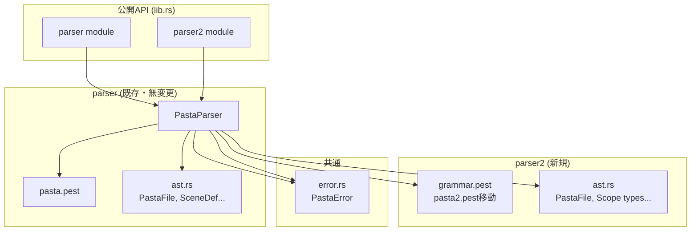
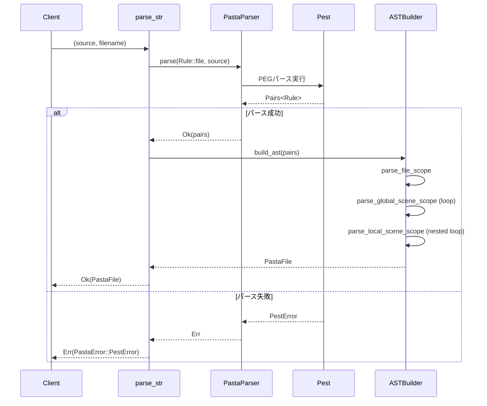
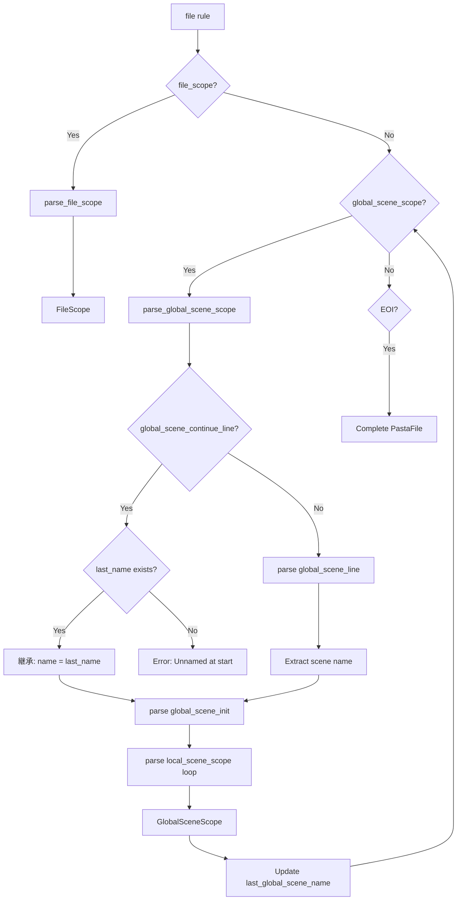
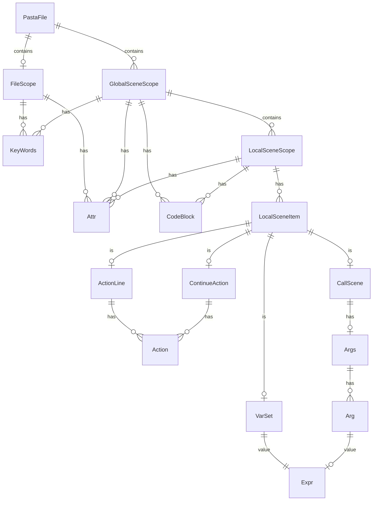

# Design Document - parser2-pest-migration

---
**Purpose**: pasta2.pestを権威的文法として、既存parserと並存する新パーサーモジュール（parser2）を設計する。

**Approach**:
- pasta2.pest文法は検証済み・不変（一切の変更禁止）
- 完全独立モジュールとして実装（Option B）
- 3層スコープ階層を正確にAST表現
- レガシーparserとのAPI互換性を維持
---

## Overview

**Purpose**: parser2モジュールは、検証済みのpasta2.pest文法に基づき、Pasta DSLソースコードを構造化されたAST（抽象構文木）に変換する。pasta2.pestは「憲法」として一切の変更を認めず、その約60の文法規則すべてを忠実に実装する。

**Users**: 
- transpiler2開発者：parser2 ASTを入力としてRuneコードを生成
- テスト作成者：文法規則の動作検証
- 将来のパーサー保守者：文法とAST対応の理解

**Impact**: 既存のparserモジュールには一切影響しない。lib.rsに`pub mod parser2`を追加し、新しいインポートパス`pasta::parser2::*`を提供する。

### Goals
- pasta2.pestの全140規則を完全実装（normal 39規則 + atomic 26規則 + silent 75規則）（MVP禁止）
  - **詳細**: [grammar-mapping.md](grammar-mapping.md)に規則→AST型の完全マッピング表を記載
- 3層スコープ階層（FileScope ⊃ GlobalSceneScope ⊃ LocalSceneScope）の正確なAST表現
- レガシーparser APIと同一シグネチャ（`parse_file`, `parse_str`）
- 全文法規則のテストカバレッジ（特にnormal規則39個は必須）

### Non-Goals
- transpiler2の実装（将来仕様）
- 既存parserの修正・削除
- pasta2.pest文法の変更
- パフォーマンス最適化（正確性優先）

---

## Requirements Traceability

| Requirement | Summary | Components | Interfaces | Flows |
|-------------|---------|------------|------------|-------|
| 1 | Grammar File保全 | grammar.pest | git mv | - |
| 2 | parser2モジュール作成 | mod.rs | parse_file, parse_str | Main Parse Flow |
| 3 | AST型定義 | ast.rs | PastaFile, Scope types | - |
| 4 | Pest parser統合 | mod.rs | PastaParser, Rule | - |
| 5 | レガシー共存 | lib.rs | pub mod parser2 | - |
| 6 | Module Structure | mod.rs, ast.rs, grammar.pest | - | - |
| 7 | エラーハンドリング | mod.rs | PastaError::PestError | Error Flow |
| 8 | テストカバレッジ | tests/ | - | - |
| 9 | Documentation | mod.rs (doc comments) | - | - |

---

## Architecture

### Existing Architecture Analysis

現在のアーキテクチャ（tech.md準拠）:
```
Engine (上位API) → Cache/Loader
    ↓
Transpiler (2pass) ← Parser (Pest)
    ↓
Runtime (Rune VM) → IR Output (ScriptEvent)
```

parser2は既存Parserレイヤーと並存し、将来的にTranspiler2と連携する。

### Architecture Pattern & Boundary Map



**Architecture Integration**:
- **選択パターン**: レイヤードアーキテクチャ（既存踏襲）
- **ドメイン境界**: parser2はparserと完全独立、AST型も共有しない
- **既存パターン維持**: `#[derive(Parser)]` + `#[grammar = "..."]`パターン
- **新規コンポーネント理由**: pasta2.pest文法がpasta.pestと構造的に異なるため
- **Steering準拠**: tech.mdのレイヤー構成、workflow.mdのMVP禁止

### Technology Stack

| Layer | Choice / Version | Role in Feature | Notes |
|-------|------------------|-----------------|-------|
| Parser Generator | Pest 2.8 | PEG文法からパーサー生成 | PUSH/POPスタック使用 |
| 派生マクロ | pest_derive 2.8 | コンパイル時パーサー生成 | `#[derive(Parser)]` |
| エラー型 | thiserror 2 | PastaError定義 | 既存error.rs再利用 |
| テスト | Rust標準 + tempfile 3 | ユニット・統合テスト | fixtureファイル使用 |

---

## System Flows

### Main Parse Flow



### Scope Hierarchy Parse Flow



---

## Components and Interfaces

### Summary Table

| Component | Domain/Layer | Intent | Req Coverage | Key Dependencies | Contracts |
|-----------|--------------|--------|--------------|------------------|-----------|
| mod.rs | Parser2 | エントリーポイント、公開API | 2, 4, 5, 7 | grammar.pest (P0), error.rs (P0) | Service |
| ast.rs | Parser2 | AST型定義 | 3 | - | - |
| grammar.pest | Parser2 | 権威的文法定義 | 1 | - | - |
| tests/ | Test | 全規則テスト | 8 | parser2 (P0) | - |

---

### Parser2 Layer

#### mod.rs

| Field | Detail |
|-------|--------|
| Intent | pasta2.pest文法に基づくパース処理の実装と公開API提供 |
| Requirements | 2.1-2.6, 4.1-4.3, 5.1-5.4, 7.1-7.4 |

**Responsibilities & Constraints**
- pasta2.pest（grammar.pest）からRust parserを生成
- ソースコードを3層スコープ構造のASTに変換
- 未名グローバルシーンの名前継承処理
- すべてのエラーをPastaError::PestErrorでラップ

**Dependencies**
- Inbound: lib.rs — 公開API再エクスポート (P0)
- Outbound: ast.rs — AST型定義 (P0)
- Outbound: error.rs — PastaError型 (P0)
- External: pest/pest_derive 2.8 — パーサー生成 (P0)

**Contracts**: Service [x] / API [ ] / Event [ ] / Batch [ ] / State [ ]

##### Service Interface

```rust
//! Parser2 module for Pasta DSL using pasta2.pest grammar.
//!
//! This module provides parsing functionality based on the authoritative
//! pasta2.pest grammar specification. The grammar file is immutable and
//! represents the canonical definition of Pasta DSL syntax.

use pest_derive::Parser;

#[derive(Parser)]
#[grammar = "parser2/grammar.pest"]
pub struct PastaParser;

/// Parse a Pasta script file using pasta2.pest grammar.
///
/// # Arguments
/// * `path` - Path to the .pasta file
///
/// # Returns
/// * `Ok(PastaFile2)` - Successfully parsed AST
/// * `Err(PastaError)` - Parse or IO error
///
/// # Example
/// ```no_run
/// use pasta::parser2::parse_file;
/// use std::path::Path;
///
/// let ast = parse_file(Path::new("script.pasta"))?;
/// ```
pub fn parse_file(path: &Path) -> Result<PastaFile2, PastaError>;

/// Parse a Pasta script from a string using pasta2.pest grammar.
///
/// # Arguments
/// * `source` - Pasta DSL source code
/// * `filename` - Filename for error reporting
///
/// # Returns
/// * `Ok(PastaFile)` - Successfully parsed AST
/// * `Err(PastaError)` - Parse error
///
/// # Example
/// ```
/// use pasta::parser2::parse_str;
///
/// let source = "＊挨拶\n  Alice：こんにちは\n";
/// let ast = parse_str(source, "test.pasta")?;
/// ```
pub fn parse_str(source: &str, filename: &str) -> Result<PastaFile, PastaError>;
```

- Preconditions: source/fileは有効なUTF-8
- Postconditions: 成功時、全スコープ構造がAST化される
- Invariants: grammar.pestは不変、一切の変更禁止

**Implementation Notes**
- Integration: `#[grammar = "parser2/grammar.pest"]`でsrc/からの相対パス指定
- Validation: 未名グローバルシーンが先頭で出現した場合はPastaError::ParseErrorを返す
- Number Parsing: 全角数字（'０'..'９'）を半角に正規化してからi64/f64へパース
  - 小数点なし → `Integer(i64)`
  - 小数点あり → `Float(f64)`
  - 全角記号変換: '－' → '-', '．' → '.'
  - 詳細はresearch.md調査7を参照
- Risks: スコープ解析のバグ→ユニットテストで軽減

---

#### ast.rs

| Field | Detail |
|-------|--------|
| Intent | pasta2.pest文法規則に対応するAST型の完全定義 |
| Requirements | 3.1-3.5 |

**Responsibilities & Constraints**
- pasta2.pestの全規則に対応するRust構造体/列挙型を定義
- 3層スコープ階層を型で表現
- 継続行（ContinueAction）を独立型として定義
- ソース位置（Span）を全ノードに付与

**Dependencies**
- Inbound: mod.rs — パース結果のAST構築 (P0)

**Contracts**: State [x] (型定義のみ)

##### Data Model (Core AST Types)

```rust
/// 完全なPastaファイルのAST表現
#[derive(Debug, Clone)]
pub struct PastaFile {
    /// ソースファイルのパス
    pub path: PathBuf,
    /// ファイルレベルのスコープ（属性・単語定義）
    pub file_scope: FileScope,
    /// グローバルシーンのリスト
    pub global_scenes: Vec<GlobalSceneScope>,
    /// ソース位置
    pub span: Span,
}

/// ファイルレベルスコープ（file_scope規則）
#[derive(Debug, Clone, Default)]
pub struct FileScope {
    /// ファイルレベル属性
    pub attrs: Vec<Attr>,
    /// ファイルレベル単語定義
    pub words: Vec<KeyWords>,
}

/// グローバルシーンスコープ（global_scene_scope規則）
#[derive(Debug, Clone)]
pub struct GlobalSceneScope {
    /// シーン名（継承の場合は直前のシーン名）
    pub name: String,
    /// 継承フラグ（global_scene_continue_lineの場合true）
    pub is_continuation: bool,
    /// シーン属性
    pub attrs: Vec<Attr>,
    /// シーンレベル単語定義
    pub words: Vec<KeyWords>,
    /// コードブロック（グローバルレベル）
    pub code_blocks: Vec<CodeBlock>,
    /// ローカルシーンのリスト
    pub local_scenes: Vec<LocalSceneScope>,
    /// ソース位置
    pub span: Span,
}

/// ローカルシーンスコープ（local_scene_scope / local_start_scene_scope規則）
#[derive(Debug, Clone)]
pub struct LocalSceneScope {
    /// シーン名（local_start_scene_scopeの場合None）
    pub name: Option<String>,
    /// シーン属性
    pub attrs: Vec<Attr>,
    /// ローカルシーンアイテム
    pub items: Vec<LocalSceneItem>,
    /// コードブロック（ローカルレベル）
    pub code_blocks: Vec<CodeBlock>,
    /// ソース位置
    pub span: Span,
}

/// ローカルシーン内のアイテム（local_scene_item規則）
#[derive(Debug, Clone)]
pub enum LocalSceneItem {
    /// 変数代入（var_set_line）
    VarSet(VarSet),
    /// シーン呼び出し（call_scene_line）
    CallScene(CallScene),
    /// アクション行（action_line）
    ActionLine(ActionLine),
    /// 継続行（continue_action_line）
    ContinueAction(ContinueAction),
}

/// アクション行（action_line規則）
#[derive(Debug, Clone)]
pub struct ActionLine {
    /// 話者名
    pub speaker: String,
    /// アクション内容
    pub actions: Vec<Action>,
    /// ソース位置
    pub span: Span,
}

/// 継続行（continue_action_line規則）
/// 
/// pasta2.pestでは継続行は`：`または`:`で始まる。
/// これはpasta.pestとの仕様変更である。
#[derive(Debug, Clone)]
pub struct ContinueAction {
    /// アクション内容
    pub actions: Vec<Action>,
    /// ソース位置
    pub span: Span,
}

/// アクション（actions規則内の各要素）
#[derive(Debug, Clone)]
pub enum Action {
    /// プレーンテキスト（talk）
    Talk(String),
    /// 単語参照（word_ref）
    WordRef(String),
    /// 変数参照（var_ref_local / var_ref_global）
    VarRef { name: String, scope: VarScope },
    /// 関数呼び出し（fn_call_local / fn_call_global）
    FnCall { name: String, args: Args, scope: FnScope },
    /// さくらスクリプト（sakura_script）
    SakuraScript(String),
    /// エスケープシーケンス（at_escape / dollar_escape / sakura_escape）
    /// 
    /// pasta2.pestではアトミック規則として定義されており、
    /// マッチしたテキストがそのまま取得できる（例：「＠＠」「@@」「＄＄」「$$」「\\\\」）
    Escape(String),
}

/// コードブロック（code_block規則）
#[derive(Debug, Clone)]
pub struct CodeBlock {
    /// 言語識別子（```rune, ```rust等）
    pub language: Option<String>,
    /// コード内容
    pub content: String,
    /// ソース位置
    pub span: Span,
}

/// 変数代入（var_set規則）
#[derive(Debug, Clone)]
pub struct VarSet {
    /// 変数名
    pub name: String,
    /// スコープ（local / global）
    pub scope: VarScope,
    /// 値（式）
    pub value: Expr,
    /// ソース位置
    pub span: Span,
}

/// シーン呼び出し（call_scene規則）
#[derive(Debug, Clone)]
pub struct CallScene {
    /// ターゲットシーン名
    pub target: String,
    /// 引数
    pub args: Option<Args>,
    /// ソース位置
    pub span: Span,
}

/// 属性（attr規則）
#[derive(Debug, Clone)]
pub struct Attr {
    /// キー
    pub key: String,
    /// 値
    pub value: AttrValue,
    /// ソース位置
    pub span: Span,
}

/// 属性値
#[derive(Debug, Clone)]
pub enum AttrValue {
    /// 整数リテラル（小数点なし）
    Integer(i64),
    /// 浮動小数点リテラル（小数点あり）
    Float(f64),
    /// 文字列リテラル
    String(String),
    /// 属性文字列（クォートなし）
    AttrString(String),
}

/// 単語定義（key_words規則）
#[derive(Debug, Clone)]
pub struct KeyWords {
    /// 単語名
    pub name: String,
    /// 単語値のリスト
    pub words: Vec<String>,
    /// ソース位置
    pub span: Span,
}

/// 引数リスト（args規則）
#[derive(Debug, Clone)]
pub struct Args {
    /// 引数のリスト
    pub items: Vec<Arg>,
    /// ソース位置
    pub span: Span,
}

/// 引数（arg規則）
#[derive(Debug, Clone)]
pub enum Arg {
    /// 位置引数（positional_arg）
    Positional(Expr),
    /// キーワード引数（key_arg）
    Keyword { key: String, value: Expr },
}

/// 式（expr規則）
#[derive(Debug, Clone)]
pub enum Expr {
    /// 整数リテラル（小数点なし）
    Integer(i64),
    /// 浮動小数点リテラル（小数点あり）
    Float(f64),
    /// 文字列リテラル
    String(String),
    /// 空文字列リテラル（""または「」）
    BlankString,
    /// 変数参照
    VarRef { name: String, scope: VarScope },
    /// 関数呼び出し
    FnCall { name: String, args: Args, scope: FnScope },
    /// 括弧式
    Paren(Box<Expr>),
    /// 二項演算
    Binary { op: BinOp, lhs: Box<Expr>, rhs: Box<Expr> },
}

/// 変数スコープ
#[derive(Debug, Clone, Copy, PartialEq, Eq)]
pub enum VarScope {
    /// ローカル変数（$var）
    Local,
    /// グローバル変数（$*var）
    Global,
}

/// 関数スコープ
#[derive(Debug, Clone, Copy, PartialEq, Eq)]
pub enum FnScope {
    /// ローカル優先検索（@func）
    Local,
    /// グローバル限定（@*func）
    Global,
}

/// 二項演算子
#[derive(Debug, Clone, Copy, PartialEq, Eq)]
pub enum BinOp {
    Add,  // +
    Sub,  // -
    Mul,  // *
    Div,  // /
    Mod,  // %
}

/// ソース位置
#[derive(Debug, Clone, Copy, PartialEq, Eq)]
pub struct Span {
    pub start_line: usize,
    pub start_col: usize,
    pub end_line: usize,
    pub end_col: usize,
}

impl Span {
    pub fn new(start_line: usize, start_col: usize, end_line: usize, end_col: usize) -> Self {
        Self { start_line, start_col, end_line, end_col }
    }
    
    pub fn from_pest(start: (usize, usize), end: (usize, usize)) -> Self {
        Self::new(start.0, start.1, end.0, end.1)
    }
}
```

---

#### grammar.pest

| Field | Detail |
|-------|--------|
| Intent | 権威的文法定義（pasta2.pestから移動） |
| Requirements | 1.1-1.7 |

**Responsibilities & Constraints**
- pasta2.pestの内容をバイト単位で保全
- 一切の変更を禁止（憲法）
- git履歴を保全するため`git mv`で移動

**Dependencies**
- Inbound: mod.rs — Pest派生マクロが参照 (P0)

**Implementation Notes**
- Integration: `git mv src/parser/pasta2.pest src/parser2/grammar.pest`
- Validation: `git diff`またはチェックサムで同一性を検証
- Risks: 手動編集による破損→CIでチェックサム検証を推奨

---

## Data Models

### Domain Model



### Entity Relationships

| Entity | Cardinality | Description |
|--------|-------------|-------------|
| PastaFile → FileScope | 1:1 | 常に存在（空でも） |
| PastaFile → GlobalSceneScope | 1:N | 0個以上 |
| GlobalSceneScope → LocalSceneScope | 1:N | 1個以上（local_start_scene_scope必須） |
| LocalSceneScope → LocalSceneItem | 1:N | 1個以上 |

---

## Error Handling

### Error Strategy

| エラー種別 | 発生条件 | 対応 |
|-----------|---------|------|
| **PestError** | 文法不一致 | `PastaError::PestError(String)`でラップ |
| **ParseError** | 未名シーンが先頭 | `PastaError::ParseError`（詳細情報付き） |
| **IoError** | ファイル読み込み失敗 | `PastaError::IoError`（From変換） |

### Error Format

```rust
// Pestエラーのラップパターン（レガシーparserと同一）
PastaParser::parse(Rule::file, source)
    .map_err(|e| PastaError::PestError(
        format!("Parse error in {}: {}", filename, e)
    ))?;

// セマンティックエラー（未名シーン）
PastaError::ParseError {
    file: filename.to_string(),
    line: start.0,
    column: start.1,
    message: "Unnamed global scene at start of file. \
              A named global scene must appear before any unnamed scenes.".to_string(),
}
```

---

## Testing Strategy

### Unit Tests (ast.rs)
1. Span::from_pest - 座標変換の正確性
2. Default trait実装 - FileScope::default()
3. Clone/Debug trait - すべてのAST型

### Integration Tests (mod.rs)
1. 単純なグローバルシーン - 最小パース成功
2. 3層スコープ - file_scope + global + local
3. 継続行 - continue_action_lineの処理
4. 未名シーン継承 - global_scene_continue_line
5. 未名シーンエラー - 先頭での出現
6. コードブロック - 言語識別子の抽出
7. 4階層文字列リテラル - PUSH/POPスタック

### Grammar Coverage Tests

**カバレッジ測定方針**:
- **測定対象**: 65規則（Normal 39規則 + Atomic 26規則）
  - Normal規則: 必須（AST型生成、transpiler層で使用）
  - Atomic規則: エッジケース（テキスト抽出、数値リテラル正規化など）
  - Silent規則: 測定対象外（75規則、パーサー内部処理のみ）
- **測定方法**: テストファイル内のコメントで規則名を明記（例: `// Tests: file_scope, global_scene_scope`）
- **CI統合**: 手動レビュー（自動化は将来の改善として検討）
- **参照**: [grammar-mapping.md](grammar-mapping.md) の規則分類表

**テストケース**:
1. **全65規則のカバレッジ** - Normal/Atomic規則に対応するテストケース
2. **14種類Unicode空白** - space_charsの全パターン
3. **reserved ID拒否** - `__name__`パターンの検証
4. **4階層括弧** - `「」`, `「「」」`, `「「「」」」`, `「「「「」」」」`
5. **数値リテラル変換** - 全角/半角数字・記号の正規化
   - 全角数字: `１２３` → `Integer(123)`
   - 全角マイナス: `－４５６` → `Integer(-456)`
   - 全角小数点（`．`）: `３．１４` → `Float(3.14)`
   - 半角小数点（`.`）: `3.14` → `Float(3.14)`
   - 混在パターン: `３.１４`, `3．14`
   - 境界値: `i64::MAX`, `i64::MIN`
   - ゼロ: `０` → `Integer(0)`, `0.0` → `Float(0.0)`
   - 詳細はresearch.md調査7参照

### Test Fixtures
- `tests/fixtures/parser2/` - parser2専用fixtureディレクトリ
- 各規則に対応するfixture（例: `scope_hierarchy.pasta`, `code_block.pasta`）

---

## Module Structure

### File Layout

```
src/parser2/
├── mod.rs          # エントリーポイント、PastaParser、parse_file/parse_str
├── ast.rs          # AST型定義（23種類以上）
└── grammar.pest    # 権威的文法（pasta2.pestから移動）

tests/
├── pasta_parser2_*.rs   # parser2統合テスト
└── fixtures/
    └── parser2/         # parser2専用fixture
        ├── scope_hierarchy.pasta
        ├── code_block.pasta
        └── ...
```

### lib.rs Integration

```rust
// parser2モジュールを公開（将来的にparserを置き換える）
pub mod parser2;

// 注意: エイリアス不要
// - parser2モジュールとして使用: `pasta::parser2::parse_file()`
// - 移行完了後はparser2がparserに置き換わる
// - 現時点では既存parserと並存
```

**移行計画**:
1. **Phase 0 (現在)**: `parser`のみ存在
2. **Phase 1 (本仕様)**: `parser`と`parser2`が並存
   - 既存コード: `pasta::parser::*` を継続使用
   - 新規コード: `pasta::parser2::*` を使用可能
3. **Phase 2 (将来)**: `parser2`を`parser`にリネーム、旧`parser`削除
   - `git mv src/parser src/parser_legacy`
   - `git mv src/parser2 src/parser`
   - lib.rsで`pub mod parser;`のみ

---

## Implementation Checklist

### Phase 1: ファイル準備
- [ ] `src/parser2/` ディレクトリ作成
- [ ] `git mv src/parser/pasta2.pest src/parser2/grammar.pest`
- [ ] `git diff`でバイト同一性を検証
- [ ] コミット: `refactor(parser2): Move pasta2.pest to parser2/grammar.pest (no content changes)`

### Phase 2: AST型定義
- [ ] `src/parser2/ast.rs` 作成
- [ ] 23種類のAST型定義
- [ ] ユニットテスト追加

### Phase 3: パーサー実装
- [ ] `src/parser2/mod.rs` 作成
- [ ] `PastaParser` 構造体定義
- [ ] `parse_str` 実装
- [ ] `parse_file` 実装
- [ ] 未名シーン継承ロジック実装（詳細は後述）
- [ ] 全角数字正規化関数実装

#### 未名シーン継承ロジック詳細

**目的**: グローバルシーン名が省略されたローカルシーンに、直前のグローバルシーン名を自動的に割り当てる

**アルゴリズム**:
```rust
// Phase 1: file_scopeパース時の初期化
let mut last_global_scene_name: Option<String> = None;

// Phase 2: scene_scopeパース時の更新・継承
for scene in scenes {
    if let Some(global_label) = scene.global_label {
        // グローバルシーンの場合: 名前を更新
        last_global_scene_name = Some(global_label.name.clone());
        scene.parent = None; // グローバルシーンにparentはない
    } else {
        // 未名シーン（ローカルシーン）の場合: 直前のグローバルシーン名を継承
        match last_global_scene_name {
            Some(ref parent_name) => {
                scene.parent = Some(parent_name.clone());
            }
            None => {
                // ファイル先頭で未名シーンが登場した場合はエラー
                return Err(ParseError::UnnamedSceneWithoutParent { line: scene.line });
            }
        }
    }
}
```

**ライフサイクル**:
- **初期化**: `None` でファイルパース開始
- **更新**: グローバルシーン登場時に `Some(name.clone())` で上書き
- **継承**: 未名シーン登場時に `last_global_scene_name` を `parent` に設定
- **クリア**: なし（ファイル単位で直前のグローバルシーン名を上書きし続ける）

**エッジケース**:
- ファイル先頭が未名シーン → エラー（`last_global_scene_name = None` のため）
- 連続する未名シーン → すべて同じ `parent` を継承
- グローバルシーン名の切り替え → 以降の未名シーンは新しい `parent` を継承

### Phase 4: 統合・テスト
- [ ] `lib.rs` に `pub mod parser2;` 追加（エイリアス不要）
- [ ] 全60規則のテスト作成
- [ ] 数値リテラルテスト（14ケース）作成
- [ ] fixtureファイル作成
- [ ] `cargo test --all` 成功確認

### Phase 5: ドキュメント
- [ ] `mod.rs` docコメント追加
- [ ] `ast.rs` 型docコメント追加
- [ ] README.md更新（並行パーサーアーキテクチャ説明）
