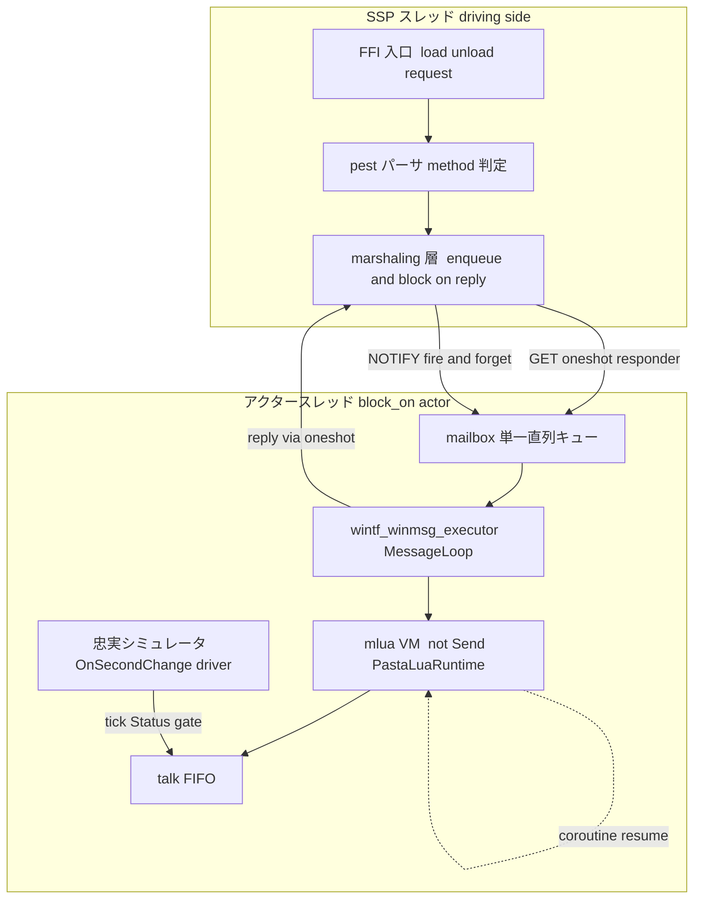
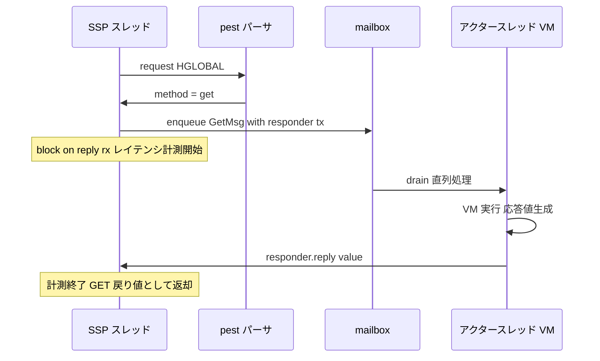
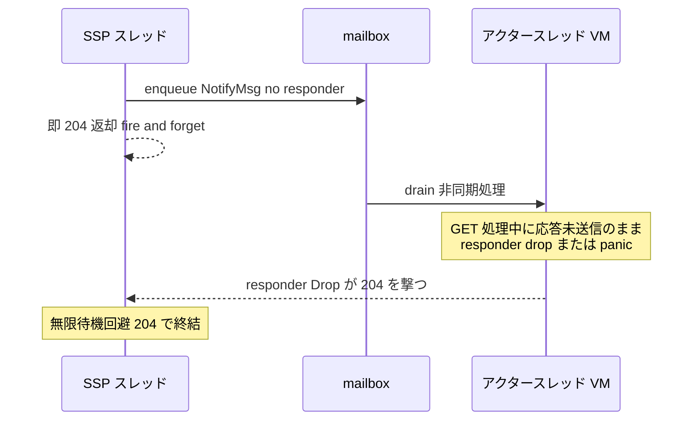

# 技術設計書: pasta-actor-feasibility

## Overview

本設計は、pasta エンジンを SHIORI スレッド束縛から解放し「自前スレッドのアクター化」する本番実装（`pasta-actor-runtime`）に踏み込む前に、構造的未知の**可否（GO/no-go）を実装着手前に確定する使い捨て検証ハーネス（PoC）**のアーキテクチャを定義する。本 PoC は `wintf_winmsg_executor`（公開済み `winmsg-executor` フォーク）上で `!Send` な `mlua` VM を専用アクタースレッドにホストし、SHIORI スレッド↔アクタースレッド間を mailbox ＋ block-on-reply で marshaling し、6 つのチャレンジ項目（R1〜R6）を試行して**段階的 go/no-go 判定文書**を出力する。

**Users**: pasta 開発者が、後続実装仕様 `pasta-actor-runtime` の着手可否と到達水準（NO-GO／条件付き GO／GO／GO+）を根拠付きで判断するために本ハーネスを実行する。成功とは「方式が使える」ことではなく「使えるか否かの**確定した結論と根拠**が得られる」ことである。

**Impact**: 本 PoC は既存出荷コードを改変しない。default 無効の cargo feature `actor-poc` で完全にガードされ、無効時はリリースビルド成果物が**バイト不変**である（撤去済み `lua-debug-poc` 前例と同ライフサイクル）。本仕様は判定文書を成果物とし、本番実装は持たない。

### Goals
- `wintf_winmsg_executor` 上で `!Send` Lua VM をホストし、reload（unload→再ロード）で clean teardown できるかを実証（R1：本丸）
- SHIORI スレッド→アクタースレッドの block-on-reply marshaling が SHIORI/3.0 同期契約を守ることを実証（R2）
- drop→204 ガードで「応答未送信のまま drop」デッドロック経路の原理的消滅を実証（R3）
- ホスト tick 駆動→executor 駆動への移行後も既存 coroutine/callback が生存することを実証（R4）
- talk FIFO ＋ OnSecondChange drain ＋ `Status: talking` gate ＋即時 preempt による ≤1 秒キック配信を、忠実シミュレータ上で実測（R5）
- GET block-on-reply レイテンシを実測し、GET タイムアウト→204 フォールバックの要否を判断（R6）
- 全項目を成否にかかわらず試行し、段階的 go/no-go 判定として文書化（R7・R8）

### Non-Goals
- 本番化（`pasta-actor-runtime`）、キック機能の作り込み（`pasta-scene-kick`）
- presentation event stream 契約の確定（PoC では最小限の仮契約で可）
- 挙動保存（バイト不変）の網羅検証、`pasta_novel` アダプタ・`*.pasta` ウィンドウ・SSTP 出力
- 実機 SSP の絶対性能保証（R5.6 により忠実シミュレータで代替。実機 attach 計測は任意、絶対保証は `pasta-actor-runtime` へ申し送り）
- 本体への恒久統合（使い捨て前提・後続本番移行完了時に除去）

## Boundary Commitments

### This Spec Owns
- `actor-poc` feature でガードされた**使い捨て検証ハーネス**一式（`pasta_lua` ／ `pasta_shiori` 両クレートに最小新設）
- アクタースレッド型（`std::thread::spawn` → `block_on(actor future)`）と VM pin／teardown の**検証ロジック**
- block-on-reply marshaling の**検証用契約**（GET=oneshot 応答待ち／NOTIFY=即 204 fire-and-forget）と responder drop→204 ガード型
- 忠実シミュレータ（OnSecondChange 周期＋`Status: talking` 遷移を再現する自前ドライバ）
- GET レイテンシ計測器と段階的 go/no-go 判定文書の生成
- `[features]` セクションの新設（両クレートに現存しないため）と `wintf_winmsg_executor` の feature-gated 依存追加

### Out of Boundary
- 出荷コード（`SHIORI::request` 同期実行経路・`PastaLuaRuntime` 本体・debug backend）の**振る舞い改変**。PoC は既存型を**読み取り・再利用**するのみで、既存経路を置換しない
- 本番アクターランタイムの API 設計・presentation event stream 契約・実機性能保証（`pasta-actor-runtime` の責務）
- debug backend（`pasta_lua/src/debug/`）への機能追加。**idiom（thread＋channel＋shutdown flag＋Drop teardown＋socket2 エフェメラル＋`#[ctor]` ガード）の写経のみ**で、debug コードは改変しない
- LuaJIT ビルドや mlua 本体の改変

### Allowed Dependencies
- **Upstream（読み取り・再利用）**: `PastaLuaRuntime`（`crates/pasta_lua/src/runtime/mod.rs`、`!Send` VM ホスト）／実コルーチンスクリプト（`pasta_scripts/pasta/store.lua`・`shiori/event/init.lua`・`callback.lua`・`second_change.lua`）／`pasta_shiori` の pest プロトコルパーサ（`lua_request.rs`、GET/NOTIFY 判定）
- **写経対象（idiom 参照のみ）**: `pasta_lua/src/debug/`（`enable.rs`・`handle.rs`・`transport/mod.rs`）の thread／channel／teardown／socket2 前例、`tests/common/mod.rs` の `#[ctor]` env ガード
- **新規外部依存（feature-gated）**: `wintf_winmsg_executor`（公開フォーク）。`actor-poc` 有効時のみリンク
- **制約**: `mlua` の `!Send` 制約を遵守し、VM はアクタースレッドを越えない。`actor-poc` 無効時は何もコンパイルしない（バイト不変）

### Revalidation Triggers
- block-on-reply marshaling 契約（GET 応答型／NOTIFY 即 204／drop→204 ガード）の形が変わったとき → `pasta-actor-runtime` は契約結論を再確認
- アクタースレッド型（`std::thread`＋`block_on`）または VM pin／teardown 方針が変わったとき
- GET レイテンシ実測値・フォールバック閾値候補が変わったとき → 後続のタイムアウト方針へ波及
- 忠実シミュレータの「実 SSP 相当」定義（OnSecondChange 周期・`Status: talking` 遷移）が変わったとき
- feature 衛生（default 無効・バイト不変・テスト非汚染）が破れたとき → 隔離前提の再検証

## Architecture

### Existing Architecture Analysis

現状の pasta は **SHIORI DLL（`pasta_shiori`）がホスト（SSP）スレッド上で `pasta_lua` の `!Send` Lua VM を同期駆動する反応専用エンジン**である。

- VM は `PastaLuaRuntime{lua: mlua::Lua}` が保持し、`pasta_shiori` 側で `Arc<Mutex<Option<PastaShiori>>>` ＋ `unsafe impl Send` により SHIORI スレッドへ束縛（`windows.rs:148` `RawShiori`、`shiori.rs:145` `request()`）。
- FFI 入口（`windows.rs:63/93/115` の `load`/`unload`/`request`）は SSP スレッド上で VM を**同期実行**する。SHIORI メソッド（GET/NOTIFY）は VM 投入**前**に pest パーサ（`lua_request.rs:86-87`）が `req.method` として確定済み——marshaling 分岐の判断点として利用可能（Research Needed #2 解決）。
- トーク継続（`STORE.co_scene`）も非同期 callback（`CALLBACK.pending`）も Lua コルーチンで VM 内に保持され、ホストの SHIORI リクエスト周期が唯一の駆動軸。`second_change.lua` の `OnSecondChange` が drain／sweep 契機。
- **debug backend（`pasta_lua/src/debug/`）が既に「外部スレッド＋mpsc チャネル＋socket2 エフェメラルポート＋shutdown AtomicBool＋Drop teardown」を実証済み**。ただし debug は VM を**ホストスレッドに残し**補助 I/O スレッドのみ spawn する。本 PoC は **VM 自体を専用アクタースレッドへ移す**点で debug 前例から構造的に逸脱する（最大の未知＝R1）。

### Architecture Pattern & Boundary Map

選択パターン: **アクターモデル（単一 mailbox 直列処理）＋ Hexagonal 風の宿主非依存コア**。SHIORI アダプタ（駆動側）とアクタースレッド（VM 所有側）を mailbox チャネルで分離し、VM 操作をアクタースレッドに閉じる。



**Architecture Integration**:
- **選択パターン**: アクターモデル。単一 mailbox の直列処理により、リエントランシー順序が**構造的に確定**（要件ディスカッション#2の不変条件）。キックは FIFO 投入→OnSecondChange 排出点でのみ消費、即時再生は `talking` 無視で常時さくらスクリプト上書き（preempt＝破棄）。独立した順序試験は立てず、R1＋R4＋R5 の複合シナリオで暗黙にカバー。
- **ドメイン境界**: SSP スレッド側（marshaling／responder）と アクタースレッド側（VM／FIFO／シミュレータ）を mailbox で分離。VM 操作はアクタースレッドに閉じ `!Send` 制約を遵守。
- **既存パターン保存**: debug backend の thread＋channel＋shutdown flag＋Drop teardown＋socket2 エフェメラル＋`#[ctor]` ガードを写経。実 `PastaLuaRuntime`・実コルーチンスクリプトをそのまま駆動。
- **新規コンポーネント根拠**: アクタースレッド型は debug 前例（VM＝ホストスレッド）からの逸脱のため新規検証が必要。marshaling 反転（同期 request→enqueue＋block-on-reply）と drop→204 responder も新規。
- **採用アプローチ**: Option C（ハイブリッド・default 無効 `actor-poc` feature）。実経路忠実（R2/R4/R5 が信頼可）＋バイト不変。

### Technology Stack

| Layer | Choice / Version | Role in Feature | Notes |
|-------|------------------|-----------------|-------|
| Runtime / Executor | `wintf-winmsg-executor` 0.0.3（crates.io・プロジェクト用フォーク・MIT OR Apache-2.0） | アクタースレッド上の `block_on`／`spawn_local`／`MessageLoop`／`JoinHandle`／`FilterResult`。`!Send` future を per-thread でホスト | **新規依存・feature-gated**。crates.io 最新版で固定（設計ディスカッション#1で確定） |
| VM / Scripting | `mlua` 0.11（LuaJIT 2.1、`!Send + !Sync`） | 実 Lua VM。`PastaLuaRuntime` 経由で再利用 | 既存。VM はアクタースレッドを越えない |
| Messaging / Marshaling | `std::sync::mpsc`（mailbox）＋ oneshot 相当（GET 応答） | SSP↔アクター marshaling。GET=block-on-reply／NOTIFY=即 204 | debug の mpsc 前例を写経。oneshot は `std::sync::mpsc` 1 回受信 or 軽量 oneshot |
| Isolation / Test | `socket2`（待受時のみ）＋ `ctor` | エフェメラル／再利用ポート、`#[ctor]` env ガード | 既存依存。R5 で待受を用いる場合のみ |
| Build gating | cargo `[features]`（新設）＋ `actor-poc`（default off） | バイト不変・使い捨て隔離 | 両クレートに `[features]` 現存せず新設 |

## File Structure Plan

### Directory Structure
```
crates/pasta_lua/
├── Cargo.toml                          # [features] 新設・actor-poc・wintf_winmsg_executor を optional 追加
└── src/
    └── actor_poc/                      # actor-poc feature でガードした使い捨てモジュール（mod 宣言も #[cfg(feature)]）
        ├── mod.rs                      # モジュール公開・段階判定オーケストレータ（R8 判定統合）
        ├── actor_thread.rs             # std::thread spawn → block_on(actor)・VM pin・JoinHandle 保持（R1）
        ├── teardown.rs                 # reload=unload+load サイクルの clean teardown 検証・反復リーク検査（R1.2/1.3）
        ├── mailbox.rs                  # 単一直列 mailbox・enqueue／drain（R2.3 スレッド分離）
        ├── responder.rs                # GET oneshot responder ＋ Drop で未送信時 204 ガード（R3）
        ├── coroutine_probe.rs          # executor 駆動下で実コルーチン resume／callback 生存検証（R4）
        ├── kick_harness.rs             # talk FIFO ＋ Status gate ＋即時 preempt（R5）
        ├── sim_driver.rs               # 忠実シミュレータ：OnSecondChange 周期＋Status: talking 遷移（R5.6）
        ├── latency.rs                  # GET block-on-reply レイテンシ計測器・代表値集計（R6）
        └── verdict.rs                  # 段階的 go/no-go 判定（NO-GO／条件付き GO／GO／GO+）の組立（R8）
crates/pasta_shiori/
├── Cargo.toml                          # [features] 新設・actor-poc（pasta_lua/actor-poc を伝播）
└── src/
    └── actor_poc/                      # actor-poc feature でガード
        ├── mod.rs                      # FFI 反転ハーネスの公開
        └── ffi_marshal.rs             # SSP スレッド側 marshaling：pest method 判定→GET block-on-reply／NOTIFY 即 204（R2）
tests/  (各クレート tests/ 配下、actor-poc feature 有効時のみコンパイル)
└── actor_poc_*.rs                      # #[ctor] env ガード踏襲・R1〜R6 を判定可能な形で実行（R7.3/R8.2）
```

### Modified Files
- `crates/pasta_lua/Cargo.toml` — `[features]` セクション新設、`actor-poc = ["dep:wintf-winmsg-executor"]`、`wintf-winmsg-executor = { version = "0.0.3", optional = true }` 依存追加（crates.io 最新）。default に含めない（R7.1/7.2）。
- `crates/pasta_shiori/Cargo.toml` — `[features]` 新設、`actor-poc = ["pasta_lua/actor-poc"]` で feature 伝播。
- `crates/pasta_lua/src/lib.rs` — `#[cfg(feature = "actor-poc")] pub mod actor_poc;` の 1 行追加（無効時は不在＝バイト不変）。
- `crates/pasta_shiori/src/lib.rs`（または相当の crate root）— 同様に `#[cfg(feature = "actor-poc")] mod actor_poc;` を追加。

> 既存出荷ファイル（`runtime/mod.rs`・`windows.rs`・`shiori.rs`・`debug/*`・`*.lua`）は**振る舞いを改変しない**。読み取り・再利用のみ。`lib.rs` への `#[cfg]` ガード付き mod 宣言追加は無効時バイト不変（コンパイル単位に現れない）。

## System Flows

### GET block-on-reply marshaling（R2.1 / R6）



### NOTIFY fire-and-forget と drop→204 ガード（R2.2 / R3）



drain は OnSecondChange 契機でのみ FIFO を排出し、`Status: talking` 中は gate（抑止）。即時 preempt は `talking` を無視し常時上書き（破棄）。順序は単一 mailbox で直列確定。

## Requirements Traceability

| Requirement | Summary | Components | Interfaces | Flows |
|-------------|---------|------------|------------|-------|
| 1.1 | executor 上 `!Send` VM ホスト・スレッド pin | `actor_thread.rs` | `ActorThread::spawn` | アーキ図 |
| 1.2 | reload clean teardown | `teardown.rs` | `ReloadProbe::run_cycle` | — |
| 1.3 | 反復 reload リークなし | `teardown.rs` | `ReloadProbe::assert_no_leak` | — |
| 1.4 | ホスト不成立時のブロッカー記録（NO-GO 根拠） | `actor_thread.rs`・`verdict.rs` | `Verdict::record_blocker` | — |
| 2.1 | GET block-on-reply 往復 | `ffi_marshal.rs`・`mailbox.rs` | `Marshal::get` | GET 図 |
| 2.2 | NOTIFY 即 204 | `ffi_marshal.rs` | `Marshal::notify` | NOTIFY 図 |
| 2.3 | I/O スレッドと VM スレッドの分離 | `mailbox.rs`・`actor_thread.rs` | `Mailbox::enqueue` | アーキ図 |
| 2.4 | marshaling 不成立のブロッカー記録 | `ffi_marshal.rs`・`verdict.rs` | `Verdict::record_blocker` | — |
| 3.1 | 未送信 drop→204 フォールバック | `responder.rs` | `Responder::drop` | NOTIFY 図 |
| 3.2 | panic 巻き戻し→204 | `responder.rs` | `Responder::drop` | NOTIFY 図 |
| 3.3 | drop→204 でデッドロック原理消滅を実証 | `responder.rs`・`kick_harness.rs` | `Responder` 契約 | NOTIFY 図 |
| 3.4 | ガード不全経路の記録 | `responder.rs`・`verdict.rs` | `Verdict::record_blocker` | — |
| 4.1 | executor 駆動下のシーンコルーチン継続 | `coroutine_probe.rs` | `CoroutineProbe::resume_scene` | — |
| 4.2 | callback 解決・継続 | `coroutine_probe.rs` | `CoroutineProbe::resolve_callback` | — |
| 4.3 | 実シーンモデルの忠実再現 | `coroutine_probe.rs` | （実 `*.lua` 駆動） | — |
| 4.4 | 継続喪失条件の記録 | `coroutine_probe.rs`・`verdict.rs` | `Verdict::record_blocker` | — |
| 5.1 | FIFO 投入→OnSecondChange drain で再生 | `kick_harness.rs`・`sim_driver.rs` | `Kick::enqueue`・`Sim::tick` | NOTIFY 図 |
| 5.2 | `talking` 中 drain gate | `kick_harness.rs`・`sim_driver.rs` | `Sim::set_talking` | — |
| 5.3 | 即時 preempt 優先配信 | `kick_harness.rs` | `Kick::preempt` | — |
| 5.4 | キック→配信 ≤1 秒実測 | `kick_harness.rs`・`latency.rs` | `Kick::measure` | — |
| 5.5 | 未達条件・実測値の記録 | `kick_harness.rs`・`verdict.rs` | `Verdict::record_blocker` | — |
| 5.6 | 「実 SSP 相当」＝忠実シミュレータ定義 | `sim_driver.rs` | `Sim` 契約 | — |
| 6.1 | GET レイテンシ反復実測・代表値 | `latency.rs` | `Latency::sample` | GET 図 |
| 6.2 | フォールバック要否判断・閾値候補文書化 | `latency.rs`・`verdict.rs` | `Verdict::latency_section` | — |
| 6.3 | 超過経路・推奨方針の申し送り | `latency.rs`・`verdict.rs` | `Verdict::handoff` | — |
| 7.1 | default 無効 feature-gate | `Cargo.toml`・`lib.rs` | `[features] actor-poc` | — |
| 7.2 | 無効時バイト不変 | `Cargo.toml`・`lib.rs` | （cfg ガード） | — |
| 7.3 | 有効時 R1〜6 を判定可能出力 | `mod.rs`・`tests/actor_poc_*` | `run_all` | — |
| 7.4 | テスト非汚染（エフェメラル・ctor ガード） | `tests/actor_poc_*`・`sim_driver.rs` | `#[ctor]` ガード | — |
| 7.5 | 使い捨て・恒久統合を残さない | 全 `actor_poc/` モジュール | （撤去手順） | — |
| 8.1 | 段階判定（NO-GO／条件付き GO／GO／GO+） | `verdict.rs` | `Verdict::stage` | — |
| 8.2 | 全項目試行・個別記録 | `mod.rs`・`verdict.rs` | `Verdict::record_item` | — |
| 8.3 | 隔離条件の妥当性前提確認 | `verdict.rs` | `Verdict::assert_isolation` | — |
| 8.4 | 最低ライン未達時の NO-GO 文書 | `verdict.rs` | `Verdict::no_go_doc` | — |
| 8.5 | 条件付き GO 以上の結論明記 | `verdict.rs` | `Verdict::conclusions` | — |

## Components and Interfaces

| Component | Domain/Layer | Intent | Req Coverage | Key Dependencies (P0/P1) | Contracts |
|-----------|--------------|--------|--------------|--------------------------|-----------|
| `ActorThread` | Actor runtime | 専用スレッドで `block_on(actor)`・VM pin・teardown 待ち | 1.1, 2.3 | `wintf_winmsg_executor`(P0), `PastaLuaRuntime`(P0) | Service, State |
| `ReloadProbe` | Actor runtime | reload サイクルの clean teardown・反復リーク検査 | 1.2, 1.3, 1.4 | `ActorThread`(P0) | Service |
| `Mailbox` | Marshaling | 単一直列キュー・enqueue／drain・スレッド分離 | 2.3 | `std::sync::mpsc`(P0) | Service, State |
| `Marshal` | Marshaling (SSP 側) | pest method 判定→GET block-on-reply／NOTIFY 即 204 | 2.1, 2.2, 2.4 | `Mailbox`(P0), pest parser(P0), `Responder`(P0) | Service |
| `Responder` | Marshaling | GET oneshot 応答＋Drop で未送信時 204 ガード | 3.1, 3.2, 3.3, 3.4 | `Mailbox`(P1) | Service, State |
| `CoroutineProbe` | VM 駆動 | executor 駆動下の実コルーチン resume／callback 生存 | 4.1, 4.2, 4.3, 4.4 | `ActorThread`(P0), 実 `*.lua`(P0) | Service |
| `KickHarness` | キック配信 | talk FIFO・OnSecondChange drain・`talking` gate・即時 preempt | 5.1, 5.2, 5.3, 5.4, 5.5 | `SimDriver`(P0), `Mailbox`(P1) | Service, State |
| `SimDriver` | キック配信 | 忠実シミュレータ（OnSecondChange 周期＋`Status: talking`） | 5.6, 5.1, 5.2 | （自前ドライバ） | Service, State |
| `Latency` | 計測 | GET block-on-reply レイテンシ実測・代表値集計 | 6.1, 6.2, 6.3 | `Marshal`(P1) | Service |
| `Verdict` | 判定文書 | 段階的 go/no-go・項目別記録・結論／申し送り | 8.1〜8.5, 7.3, 各 R の `.4`/`.5` | 全 probe(P1) | Service, State |

### Actor runtime

#### ActorThread

| Field | Detail |
|-------|--------|
| Intent | 専用 `std::thread` で `block_on(actor future)` を回し `!Send` VM を所有・pin し、teardown を待つ |
| Requirements | 1.1, 2.3 |

**Responsibilities & Constraints**
- `std::thread::spawn` 内で `wintf_winmsg_executor::block_on` を呼び、その future が `PastaLuaRuntime`（`!Send` VM）を**生成・所有**する。VM はこのスレッドを越えない（R2.3 スレッド分離・`!Send` 制約遵守）。
- `block_on` は呼び出しスレッドのメッセージループを回す前提（Research Needed #1）。VM 操作タスクは `spawn_local` でサブタスク化しうる。
- `JoinHandle` を保持し、teardown 時にアクタースレッドの終了を待てるようにする。debug の `Arc<AtomicBool>` shutdown フラグ idiom を写経。

**Dependencies**
- Outbound: `Mailbox` — VM へ投入するメッセージを drain（P0）
- External: `wintf_winmsg_executor` — `block_on`／`spawn_local`／`MessageLoop`／`JoinHandle`（P0、新規・feature-gated）
- External: `PastaLuaRuntime` — 実 `!Send` VM の生成・保持（P0、再利用）

**Contracts**: Service [x] / State [x]

##### Service Interface
```text
ActorThread::spawn(init: VmInit) -> ActorHandle
  // init: VM 構築に必要なコンテキスト（TranspileContext 相当）
  // 戻り: mailbox sender ＋ JoinHandle を内包するハンドル
ActorHandle::shutdown(self) -> TeardownReport
  // shutdown フラグを立て、JoinHandle を join し teardown 結果を返す
```
- Preconditions: アクタースレッド未起動。`actor-poc` feature 有効。
- Postconditions: VM はアクタースレッド上に pin され、mailbox 経由でのみ操作可能。
- Invariants: VM（`mlua::Lua`）は生成スレッドを越えない。

**Implementation Notes**
- Integration: `block_on` のメッセージループ回転前提を実機確認（OPEN QUESTION Q2）。`spawn_local` でサブタスク化、`JoinHandle` で teardown 待ち。
- Validation: VM がスレッド境界を越えず executor スレッド内で実行完了したことを assert（R1.1）。
- Risks: winmsg_executor×mlua×reload の三重未知（本丸・High）。不成立時は `Verdict::record_blocker` で NO-GO 根拠化。

#### ReloadProbe

| Field | Detail |
|-------|--------|
| Intent | unload→再ロードの reload サイクルを反復し、VM・メッセージ専用ウィンドウ・スレッド・チャネルの clean teardown とリーク不在を検証 |
| Requirements | 1.2, 1.3, 1.4 |

**Responsibilities & Constraints**
- reload＝`ActorHandle::shutdown` → 再 `ActorThread::spawn` のサイクルを N 回反復。各サイクルで漏れなく解放（メッセージ専用ウィンドウの Drop 時解放含む）を確認。
- 過去観測の teardown 系不具合（ソケット/ポート枯渇・ハンドル枯渇・リーク）が再発しないことを確認。待受を用いる場合はエフェメラル／再利用ポート（socket2 `set_reuse_address`＋port 0、`transport/mod.rs:172/176` 写経）。

**Dependencies**: Inbound: `ActorThread`（P0）

**Contracts**: Service [x]

##### Service Interface
```text
ReloadProbe::run_cycles(n: usize) -> ReloadReport
  // n 回 reload を反復し、各サイクルの teardown 結果と累積リーク指標を返す
```
- Postconditions: 全サイクルで clean teardown、リーク指標が閾値内。
- Invariants: ポート/ハンドルがサイクル間で枯渇しない。

**Implementation Notes**
- Integration: debug `DebugHandle::Drop`（shutdown フラグ→socket-bridge join→encoder detached）idiom を写経。
- Risks: メッセージ専用ウィンドウの Drop 解放挙動が未知（実機確認、OPEN QUESTION Q2）。

### Marshaling

#### Marshal（SSP スレッド側 FFI 反転ハーネス）

| Field | Detail |
|-------|--------|
| Intent | pest が確定した `method` で分岐し、GET は mailbox へ enqueue して block-on-reply、NOTIFY は即 204 fire-and-forget |
| Requirements | 2.1, 2.2, 2.4 |

**Responsibilities & Constraints**
- GET/NOTIFY 判定は VM 投入**前**に pest（`lua_request.rs:86-87`）が `req.method` で確定済みの値を利用（marshaling 分岐点・Research Needed #2 解決）。
- GET: `Responder` を内包する `GetMsg` を enqueue し、応答受信までブロックし応答値を GET の戻り値とする（SHIORI/3.0 同期契約）。
- NOTIFY: `NotifyMsg`（responder なし）を enqueue し、executor 完了を待たず即 204 を返す。

**Dependencies**
- Outbound: `Mailbox`（P0）、`Responder`（P0）
- External: pest プロトコルパーサ（P0、再利用・改変なし）

**Contracts**: Service [x]

##### Service Interface
```text
Marshal::dispatch(method: ShioriMethod, req: RequestTable) -> ShioriResponse
  // method == Get   → enqueue(GetMsg{responder}) ; block on responder.recv() ; 応答 or 204
  // method == Notify→ enqueue(NotifyMsg) ; return 204 即時
```
- Preconditions: `method` は pest 解決済み。アクタースレッド稼働中。
- Postconditions: GET は応答値 or drop→204、NOTIFY は常に 204。
- Error envelope: 応答経路 drop / panic → 204（`Responder` ガードに委譲）。

**Implementation Notes**
- Integration: 既存 `shiori.rs:request()` 同期経路は**置換しない**。PoC は別ハーネスとして pest 解決値を消費する（出荷経路バイト不変）。
- Risks: 同期契約×スレッド分離×デッドロック回避（High）。不成立は `Verdict::record_blocker`。

#### Responder

| Field | Detail |
|-------|--------|
| Intent | GET 応答用 oneshot を包み、応答未送信のまま Drop（panic／忘れ）されたら自動的に 204 を撃つ |
| Requirements | 3.1, 3.2, 3.3, 3.4 |

**Responsibilities & Constraints**
- GET 処理側が応答を送信せず responder を drop（panic 巻き戻し含む）した場合、SSP スレッドが無限待機に陥らず 204 フォールバックを受け取る（R3.1/3.2）。
- 「応答未送信のまま drop」デッドロック経路の**原理的消滅**を再現シナリオで実証（R3.3）。

**Contracts**: Service [x] / State [x]

##### Service Interface
```text
Responder::reply(self, value: ShioriResponse)   // 正常応答（self 消費）
impl Drop for Responder                          // 未 reply 時 204 を送信
```
- Invariants: responder は「reply 1 回」または「drop→204」のいずれかで必ず終結する（取りこぼしなし）。

**Implementation Notes**
- Integration: oneshot は `std::sync::mpsc`（1 回受信）または軽量 oneshot。Drop guard は debug 近傍の定型（Low リスク）。
- Validation: panic 注入シナリオで 204 終結を確認（R3.2）。

#### Mailbox

| Field | Detail |
|-------|--------|
| Intent | SSP スレッド→アクタースレッドの単一直列キュー。enqueue（SSP 側）／drain（アクター側）でスレッドを分離 |
| Requirements | 2.3 |

**Responsibilities & Constraints**
- 単一 mailbox の**直列処理**により処理順序を構造的に確定（順序＝直列 mailbox 保証、要件ディスカッション#2）。VM 操作は drain 側（アクタースレッド）に閉じる。
- メッセージ型は `GetMsg{responder}` / `NotifyMsg` / `KickMsg` 等の判別共用体。

**Contracts**: Service [x] / State [x]
- State: FIFO 順序保証。drain は OnSecondChange 契機（キック消費は排出点のみ）。

**Implementation Notes**: debug の mpsc channel seam を写経。

### VM 駆動

#### CoroutineProbe

| Field | Detail |
|-------|--------|
| Intent | 駆動主体をホスト tick→executor へ移しても、実コルーチン（`STORE.co_scene`）と callback（`CALLBACK.pending`）が生存・継続することを実シーンモデルで検証 |
| Requirements | 4.1, 4.2, 4.3, 4.4 |

**Responsibilities & Constraints**
- 実 `*.lua`（`store.lua` の `STORE.co_scene`、`event/init.lua` の `set_co_scene`／`resume_until_valid`、`callback.lua` の `CALLBACK.pending`／`consume_staged`／`sweep`、`second_change.lua` の `OnSecondChange`）をそのまま駆動。
- シーンコルーチンを中断地点から正しく resume（R4.1）、非同期 callback を後続駆動契機で解決し継続（R4.2）、シーン継続＋callback 待機を含む実モデルに忠実再現（R4.3）。
- コルーチンは VM 内に存在し VM 移設で保持される（低リスク）。要点は resume の**駆動主体**をホスト tick→executor へ移すこと。

**Dependencies**: Inbound: `ActorThread`（P0）。Outbound: 実 `*.lua` スクリプト（P0、再利用）

**Contracts**: Service [x]

##### Service Interface
```text
CoroutineProbe::resume_scene() -> ProbeResult     // co_scene を executor 駆動で resume・継続確認
CoroutineProbe::resolve_callback() -> ProbeResult // CALLBACK.pending を後続契機で resume・解決確認
```
- Postconditions: 中断地点から継続、状態喪失なし。
- Risks: 継続契機の消失（Medium）。喪失条件を切り分け `Verdict::record_blocker`。

### キック配信

#### KickHarness

| Field | Detail |
|-------|--------|
| Intent | talk FIFO・OnSecondChange drain・`Status: talking` gate・即時 preempt によるキック配信を検証し、配信レイテンシ ≤1 秒を実測 |
| Requirements | 5.1, 5.2, 5.3, 5.4, 5.5 |

**Responsibilities & Constraints**
- 1 シーンのキックを talk FIFO に投入→`SimDriver` の OnSecondChange drain 契機で排出・再生（R5.1）。
- `Status: talking` 中は drain を gate（抑止）し再生中トークへの割り込みを防ぐ（R5.2）。
- 即時 preempt は先行トークを `coroutine.close()`（`set_co_scene` 素地）で閉じ、`talking` 無視で常時さくらスクリプト上書き＝破棄（R5.3、要件ディスカッション#2 不変条件）。
- キック指示→配信の所要時間を実測し ≤1 秒を確認・記録（R5.4）。

**Dependencies**: Inbound: `SimDriver`（P0）、`Mailbox`（P1）

**Contracts**: Service [x] / State [x]
- State: talk FIFO（投入＝enqueue、消費＝OnSecondChange 排出点のみ）。即時フラグは常時上書き（保全分岐なし）。

##### Service Interface
```text
KickHarness::enqueue(scene: SceneId)            // FIFO 投入
KickHarness::preempt(scene: SceneId)            // 先行トーク close → 優先配信
KickHarness::measure() -> KickLatencyReport     // キック→配信レイテンシ実測（≤1 秒判定）
```

**Implementation Notes**
- Risks: 実 SSP/忠実ドライバ依存・配信タイミング（High）。未達条件と実測値を `Verdict::record_blocker`。

#### SimDriver（忠実シミュレータ）

| Field | Detail |
|-------|--------|
| Intent | 「実 SSP 相当」を、OnSecondChange の周期と `Status: talking` 遷移を忠実に再現する自前ドライバとして定義（R5.6） |
| Requirements | 5.6, 5.1, 5.2 |

**Responsibilities & Constraints**
- OnSecondChange 周期で tick を発行し FIFO drain 契機を駆動。`Status: talking` 遷移を制御し gate 検証の前提を作る。
- 実機 SSP attach 計測は**任意**（補助スモーク）。実機絶対性能保証は `pasta-actor-runtime` へ申し送り。
- 再生中に SSP が tick を送り続けるか（gate 検証前提）は ukadoc／任意実機スモークで補助確認（Research Needed #3）。

**Contracts**: Service [x] / State [x]

##### Service Interface
```text
SimDriver::tick()                  // OnSecondChange 1 周期を発火
SimDriver::set_talking(bool)       // Status: talking 遷移を制御
```

### 計測・判定

#### Latency

| Field | Detail |
|-------|--------|
| Intent | GET block-on-reply の実レイテンシを反復実測し代表値（最大・分布）を集計、フォールバック要否と閾値候補を文書化 |
| Requirements | 6.1, 6.2, 6.3 |

**Responsibilities & Constraints**
- 忠実シミュレータ（R5.6 定義、実機 attach 任意）の呼び出しパターンで GET を反復実行し各往復のレイテンシを実測（R6.1）。
- 実測値から GET タイムアウト→204 フォールバックの要否と閾値候補を判断・文書化（R6.2）。
- 許容応答時間を超過しうる経路は条件・推奨方針を `pasta-actor-runtime` へ申し送り（R6.3）。

**Contracts**: Service [x]

##### Service Interface
```text
Latency::sample(n: usize) -> LatencyStats   // n 回 GET の代表値（max/分布）
Latency::recommend() -> FallbackDecision     // フォールバック要否＋閾値候補
```

#### Verdict（段階判定オーケストレータ）

| Field | Detail |
|-------|--------|
| Intent | 各 probe の結果を集約し、段階的 go/no-go（NO-GO／条件付き GO／GO／GO+）と項目別記録・結論・申し送りを生成 |
| Requirements | 8.1〜8.5, 7.3, 1.4, 2.4, 3.4, 4.4, 5.5, 6.3 |

**Responsibilities & Constraints**
- 判定段階を構成: **NO-GO**（R1 不成立）／**条件付き GO**（R1＋R2＋R3）／**GO**（＋R4）／**GO+**（＋R5＋R6）（R8.1）。
- 全項目（R1〜R6）を成否にかかわらず試行し項目別に成否・採用方式・制約を記録（R8.2）。
- 隔離条件（default 無効・バイト不変・テスト非汚染・使い捨て）の成立を判定妥当性前提として確認（R8.3）。
- 最低ライン未達時は NO-GO とブロッカー・回避候補を文書化（R8.4）。条件付き GO 以上では到達段階と後続前提結論（採用 executor 統合方式・VM pin/teardown 方針・marshaling 契約・drop→204 ガード方針・coroutine 生存条件・GET レイテンシとフォールバック要否）を明記（R8.5）。

**Contracts**: Service [x] / State [x]

##### Service Interface
```text
Verdict::record_item(req: ReqId, outcome: ItemOutcome)
Verdict::record_blocker(req: ReqId, blocker: Blocker)
Verdict::assert_isolation() -> IsolationStatus
Verdict::stage() -> GoNoGoStage                // 段階確定
Verdict::render() -> VerdictDocument           // 判定文書（成果物）
```

**Implementation Notes**
- Integration: 文書のみ（Low リスク）。`mod.rs`／`tests/actor_poc_*` から `run_all` で全項目を判定可能な形で実行（R7.3）。

## Error Handling

### Error Strategy
PoC の「エラー」は二種類に分かれる: (a) **検証対象の失敗**（VM ホスト不成立・marshaling デッドロック・coroutine 喪失・配信遅延）は**ブロッカーとして記録し NO-GO/制約付き判定の根拠**とする（フェイルファストではなく観測・記録）。(b) **ハーネス自体のエラー**（feature 誤設定・スレッド panic）は debug の `catch_unwind` 境界 idiom と Drop guard で安全に終結させる。

### Error Categories and Responses
- **検証失敗（記録系）**: 各 probe の `.4`/`.5` 受入基準に従い `Verdict::record_blocker` で条件・実測値を残す。判定を二値化せず段階に反映。
- **応答経路 drop/panic（GET）**: `Responder::Drop` が 204 を撃ち SSP スレッドを解放（R3）。デッドロック経路を原理的に消す。
- **teardown 失敗**: reload リーク・ポート枯渇は `ReloadProbe` が検出し NO-GO 根拠化。

### Monitoring
- `tracing` で各 probe の開始/完了/ブロッカーを記録（debug backend 同様の log idiom）。レイテンシは `Latency` が代表値を集計。最終 `VerdictDocument` が一次成果物。

## Testing Strategy

### Unit Tests
- `Responder` Drop ガード: 未 reply drop で 204 が届くこと（R3.1）。panic 注入で 204 終結（R3.2）。
- `Mailbox` 直列順序: enqueue 順に drain されること、VM 操作が drain 側スレッドに閉じること（R2.3）。
- `Marshal` 分岐: pest `method=get`→block-on-reply、`method=notify`→即 204（R2.1/2.2）。
- `Verdict` 段階確定: R1〜R6 の成否組合せに対し NO-GO／条件付き GO／GO／GO+ が正しく決まること（R8.1）。

### Integration Tests
- `ActorThread` × `ReloadProbe`: 反復 reload で clean teardown・ポート/ハンドル枯渇なし（R1.2/1.3）。`#[ctor]` env ガード踏襲（R7.4）。
- `CoroutineProbe`: 実 `*.lua` を executor 駆動で resume し `STORE.co_scene` 継続・`CALLBACK.pending` 解決（R4.1/4.2/4.3）。
- `KickHarness` × `SimDriver`: FIFO 投入→OnSecondChange drain→再生、`talking` gate、即時 preempt 優先（R5.1/5.2/5.3）。
- バイト不変検証: `actor-poc` 無効ビルド成果物が導入前と diff ゼロ（R7.2）。

### Performance/Load
- `KickHarness::measure`: キック→配信 ≤1 秒の実測（R5.4）。
- `Latency::sample`: GET block-on-reply の代表値（最大・分布）実測とフォールバック閾値候補導出（R6.1/6.2）。
- 反復 reload 下のリソース安定性（ハンドル/ポート枯渇なし、R1.3）。

## Optional Sections

### Performance & Scalability
- **目標**: キック→配信 ≤1 秒（R5.4、忠実シミュレータ上）。GET レイテンシは絶対閾値を設けず代表値実測（R6.1）→フォールバック要否判断（R6.2）。
- **計測方式**: `SimDriver` の OnSecondChange 周期を実 SSP 相当として用いる。実機 attach は任意スモーク。絶対性能保証は `pasta-actor-runtime` へ申し送り（R5.6/R6.3）。

### Migration Strategy
本 PoC は**使い捨て**であり本番移行を持たない（R7.5）。撤去手順: `actor-poc` feature・`actor_poc/` モジュール・`lib.rs` の cfg-mod 宣言・`Cargo.toml` の feature/依存を削除し、撤去済み `lua-debug-poc` と同様に痕跡を残さない。後続 `pasta-actor-runtime` は本 PoC の `VerdictDocument` 結論（R8.5）を着手前提として参照する。

## Open Questions / Risks

設計ディスカッションフェーズで解決する未決事項（本設計は best-effort 仮置きで進行）:

- ~~**Q1（依存解決）**~~ **【設計ディスカッション#1で解決】**: crate 名 `wintf-winmsg-executor`（crates.io・プロジェクト用フォーク・MIT OR Apache-2.0）、**最新版 0.0.3 で固定**（`wintf-winmsg-executor = { version = "0.0.3", optional = true }`）。公開 API `block_on`／`spawn_local`／`MessageLoop`／`JoinHandle`／`FilterResult` を crates.io 公開版として確認済み。cargo-deny supply-chain 監査も crates.io 版で素直に通る。
- **Q2（executor 統合形）**: `block_on` が呼び出しスレッドのメッセージループを回す前提、`spawn_local`（サブタスク）・`JoinHandle`（teardown 待ち）・メッセージ専用ウィンドウの Drop 時解放挙動は**実機確認**が必要（Research Needed #1）。R1 検証そのものでもあるため、設計は std::thread＋block_on のアクタースレッド型を仮置きし、確証は R1 実装で得る。
- **Q3（marshaling 反転の出荷経路非干渉）**: PoC の `Marshal` は既存 `shiori.rs:request()` 同期経路を置換せず別ハーネスで pest 解決値を消費する前提だが、pest 解決結果を出荷経路を改変せず PoC ハーネスへ供給する取り回し（再パース or 共有）の具体形が未確定。**仮定**: PoC ハーネスは独自に request 文字列を pest で再解決し method を得る（出荷経路バイト不変を優先）。
- **Q4（gate 検証の実機補助）**: 再生中（`Status: talking`）に SSP が OnSecondChange tick を送り続けるかは忠実シミュレータの設計前提（R5.2 gate）であり、ukadoc 確認＋任意実機スモークの要否・範囲が未確定（Research Needed #3）。**仮定**: シミュレータは「talking 中も tick 継続・drain のみ gate」を再現し、実機差異は任意スモークで補助確認。
- **Q5（responder oneshot 実装選択）**: GET 応答の oneshot を `std::sync::mpsc`（1 回受信）で済ませるか軽量 oneshot crate を導入するかが未確定。**仮定**: 追加依存を避け `std::sync::mpsc` ＋ Drop ガードで実装（バイト不変・最小依存を優先）。
