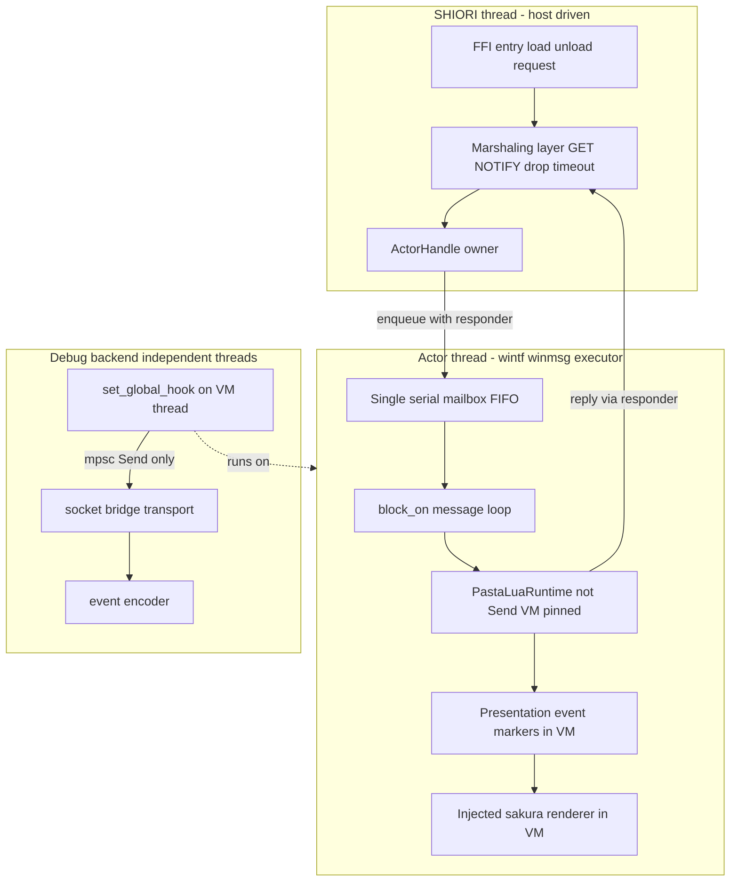

# 技術設計書: pasta-actor-runtime

## Overview

本仕様は pasta エンジンの内部アーキテクチャを「SHIORI スレッド束縛の反応専用エンジン」から「自前のアクタースレッドを所有するアクターモデルエンジン」へ転換する、**外部 SHIORI 挙動バイト不変の純内部リファクタ**である。先行 PoC 仕様 `pasta-actor-feasibility`（判定 GO+）が実証した方式（executor 上 `!Send` VM ホスト・GET=block-on-reply／NOTIFY=即 204／drop→204 ガード・clean teardown・executor 駆動下のコルーチン生存）を、`actor_poc/`（feature-gated・default off）の参照実装から出荷経路へ昇格する。

**Users**: ゴースト作者（`.pasta`/`.lua` を書く人）と SSP ホスト（SSP/カードゲートウェイ）。両者から観測される SHIORI 応答はリファクタ前後でバイト単位同一でなければならない。同時に、pasta 開発者自身が新規並行機構（アクタースレッド・marshaling・VM pin・teardown）を実装中にデバッグできる環境を整える。

**Impact**: 現状 `pasta_shiori` は `unsafe impl Send/Sync`（`shiori.rs:51-52`）＋ `OnceLock<RawShiori>` ＋ `Arc<Mutex<Option<PastaShiori>>>`（`windows.rs:148`）で `!Send` な Lua VM を SHIORI スレッドへ束縛している。本仕様はこの束縛を「VM をアクタースレッドへ pin し、SHIORI スレッドはチャネル marshaling 経由でのみ VM へアクセスする」構造へ置換し、`unsafe impl Send/Sync` を撤去する。さくらスクリプト描画は VM 内に維持したまま、登録経路をアダプタ起点へ論理デカップリングする。

### Goals
- 外部 SHIORI 応答のバイト不変（全既存テスト回帰不変、FFI 入口応答バイト列同一）。
- `!Send` Lua VM をアクタースレッドへ pin し、`unsafe impl Send/Sync` ハックを構造的に撤去する。
- 宿主非依存 presentation event（マーカー）契約を VM 内に確立し、さくらスクリプトレンダラをアダプタ注入に論理デカップリングする（最小マーカー集合・拡張可能型体系）。
- GET/NOTIFY/drop→204 marshaling と GET timeout→204 安全網（初期閾値 6.68ms）を本番化する。
- reload teardown（shutdown→wake→join）を本番化し、リーク／枯渇を不在にする。
- デバッグ容易性を保全する: (A) 作者の `.pasta`/`.lua` DAP デバッグを劣化させない、(B) 並行機構を観測可能なログ点＋決定論テストハーネスでデバッグ可能にする。
- `actor_poc/` のデバッグ資産を本番テスト基盤へ昇格し、使い捨て足場を最終タスクで撤去する。

### Non-Goals
- talk FIFO・`Status: talking` gate・即時 preempt・キック transport（後続仕様 `pasta-scene-kick`）。
- さくらスクリプト描画コード（Lua・Rust）の物理的クレート移動（Lua 集約死守・デッドコード除去前提）。
- VM 外（post-VM）レンダリング方式（デバッグ容易性を劣化させるため不採用）。
- debug backend のアクタークライアント化（後続仕様。本仕様は既存デバッグの動作保全のみ負う）。
- 新しいユーザー可視挙動全般・トーク／応答セマンティクスの変更。
- リリース `panic=abort` ビルドプロファイルの変更（横断ビルド変更はスコープ外）。
- 実機 SSP に対する絶対性能保証（PoC 申し送り閾値を初期値採用に留める）。

## Boundary Commitments

### This Spec Owns
- **アクタースレッドの所有と VM pin**: `pasta_shiori` 内で `wintf_winmsg_executor::block_on` を用いてアクタースレッドを起動し、`PastaLuaRuntime`（`!Send`）をそのスレッド上で生成・常駐させる本番ランタイム（`actor_poc/actor_thread.rs` の昇格形）。
- **CH marshaling 層**: SHIORI スレッド↔アクタースレッド間の単一直列キュー（mailbox）と GET=block-on-reply／NOTIFY=即 204／drop→204／GET timeout→204 のメッセージ契約（`actor_poc/{mailbox,responder}.rs` の昇格形）。
- **FFI 入口の所有モデル再設計**: `OnceLock<RawShiori<PastaShiori>>` ＋ `Arc<Mutex<Option<PastaShiori>>>` ＋ `unsafe impl Send/Sync` を、アクターハンドル保持型へ置換する（`DllMain` attach/detach ライフサイクル整合）。
- **presentation event（マーカー）契約**: コア（`pasta_lua`）が出力する宿主非依存マーカーの型体系（最小集合: talk ライン／アクター切替／wait／choice。拡張可能）と、その VM 内デバッガ観測経路。
- **さくらスクリプトレンダラのアダプタ起点登録**: `@pasta_sakura_script` の登録を「コア無条件起点」から「アダプタ注入」へ論理デカップリング（VM 内レンダリング維持・物理移動なし）。
- **reload teardown 本番化**: アクタースレッド・VM・メッセージ専用ウィンドウ・チャネルの clean teardown。
- **本番テスト基盤**: `actor_poc/` のデバッグ資産（`sim_driver`／`mailbox`／`responder`／`coroutine_probe` 検証）を本番テストへ昇格。FFI 入口応答バイト列の特性化（ゴールデン）テスト。
- **使い捨て足場の撤去**: `verdict.rs`・PoC scaffold・`actor-poc` feature gate の最終撤去と出荷 `pasta.dll` バイト不変検証（正規化 sha）。

### Out of Boundary
- talk FIFO／`Status: talking` gate／preempt／キック transport（`pasta-scene-kick`）。
- さくらスクリプト Lua/Rust の物理クレート移動・`pasta_novel` アダプタ。
- VM 外レンダリング。debug backend のアクタークライアント化。
- Lua コルーチン／callback の意味論変更（`STORE.co_scene`・`resume_until_valid`・`CALLBACK` は無改変維持）。
- リリースビルドプロファイル（`panic=abort`）の変更。

### Allowed Dependencies
- 上流 `pasta-actor-feasibility`（GO+）の確定方式・PoC 参照実装（`crates/pasta_lua/src/actor_poc/`）。
- 外部依存 `wintf-winmsg-executor` 0.0.3（現状 `pasta_lua` の `actor-poc` feature 下・optional）。本仕様で出荷経路（`pasta_shiori` 側のアクタースレッド所有）へ昇格する。
- 新規外部依存 `async-channel` 2.5（MIT/Apache・runtime 非依存・cancel-safe・Sender `Send+Sync+Clone`）を mailbox に追加する。flume は cancel-safety 未解決（Issue #104/#135・0.12 未修正）のため不採用。reply/done は `std::sync::mpsc`（追加依存なし）。crossbeam-channel は不要。
- 既存 debug backend（`pasta_lua/src/debug/`）— VM スレッド上で `set_global_hook` を発火させる既存スレッドモデル。本仕様は「VM スレッド＝アクタースレッド」へ移しても発火が成立することのみ保証。
- 既存 teardown idiom（`Arc<AtomicBool>` shutdown ＋ `take()` 二重 join 回避 ＋ socket2 SO_REUSEADDR）。
- 依存方向 `pasta_dsl → pasta_core → pasta_lua → pasta_shiori` は不変。executor 所有は `pasta_shiori` に閉じ込め、コアの純度を損なわない。

### Revalidation Triggers
- presentation event マーカー型体系の契約形（enum 形・データ表現）変更 → 下流 `pasta-scene-kick`・将来宿主アダプタが再検証。
- mailbox メッセージ契約（GET/NOTIFY/Kick 等の variant・応答経路）変更 → marshaling 消費者が再検証。
- アクターハンドルの所有モデル（`DllMain` attach/detach との結線）変更 → FFI 入口・teardown 順序が再検証。
- GET timeout 閾値の意味（通常経路非発火の前提）変更 → R1 バイト不変が再検証。
- さくらスクリプトレンダラ注入 IF（登録経路・`TalkConfig` 受け渡し）変更 → コア↔アダプタ境界が再検証。

## Architecture

### Existing Architecture Analysis

現状のスレッド／所有モデル（`windows.rs`／`shiori.rs`／`lua_request.rs` の調査結果）:

- **FFI 入口**: `extern "C" load/unload/request` は `RawShiori<PastaShiori>` へ委譲。各 dispatch は `catch_unwind(AssertUnwindSafe(..))` で panic を `MyError`→SHIORI エラー応答へ変換（リリース `panic=abort` で catch 到達不能・dev/test 向け保険）。
- **所有**: `static SHIORI: OnceLock<RawShiori<PastaShiori>>`。`RawShiori(isize, Arc<Mutex<Option<PastaShiori>>>)`。`PastaShiori` は `runtime: Option<PastaLuaRuntime>`（`!Send`）と `SHIORI.load/request/unload` の `Function` キャッシュを保持。
- **unsafe ハック**: `unsafe impl Send for PastaShiori`／`unsafe impl Sync for PastaShiori`（`shiori.rs:51-52`）。健全性は「`OnceLock` 単一インスタンス＋`Mutex` 直列化＋SHIORI ホストはメインスレッドからのみ呼ぶ」という運用仮定に依存（構造的保証ではない）。
- **method 判定**: `lua_request::parse_request` の pest 解析で `req.method = "get"|"notify"` を VM 投入**前**に確定（`Rule::get|Rule::notify`、`lua_request.rs:86-87`）。これが marshaling 分岐点として再利用可能。
- **描画縫い目**: コア↔アダプタの唯一の描画接点は Lua `SAKURA.talk_to_script(actor, text)`。`@pasta_sakura_script` を `module_registry.rs:128-137` の `register_sakura_script_module` がコア初期化時（`factory.rs:172`）に `package.loaded` へ無条件登録。`sakura_builder.lua` の `BUILDER.build(grouped_tokens, config, actor_spots)` が grouped token を走査し、`emit_inner_token` で `talk/surface/wait/newline/clear/choice` を処理して `talk_to_script` を呼ぶ。
- **debug backend**: `set_global_hook(EVERY_LINE)` は **VM を実行するスレッド上で同期発火**（`debug/hook.rs`）。socket bridge／event encoder／transport listener の各スレッドは VM スレッドから `std::sync::mpsc`（`Send` ペイロードのみ）で分離。`mlua::Lua` はスレッドを越えない。`DebugHandle::Drop` は shutdown フラグ→socket_handle join→port 解放を同期完了（`take()` で二重 join 回避）。
- **PoC 参照**: `actor_poc/actor_thread.rs` が `wintf_winmsg_executor::block_on` で `!Send` VM をアクタースレッドへ pin 済み。`mailbox.rs`（`ActorMsg{Get,Notify,Kick}`・FIFO・`MailboxReceiver: !Sync`）、`responder.rs`（`reply()` XOR `drop()→204` の exactly-once）、`teardown.rs`（reload サイクルのハンドル／USER オブジェクトリーク計測）が出荷テンプレート。

### Architecture Pattern & Boundary Map

選択パターン: **アクターモデル（単一スレッド VM 所有 ＋ 直列メッセージキュー）**。実装戦略は research.md の **Option C（特性化テスト先行のハイブリッド段階移行）**。



**Architecture Integration**:
- **Selected pattern**: アクタースレッド所有 + 単一直列 mailbox。`!Send` VM を構造的にスレッド pin し、全アクセスをメッセージ送信に限定する（`unsafe` 不要）。
- **Domain/feature boundaries**: コア（`pasta_lua`）= 宿主非依存マーカー出力＋VM 内レンダリング。アダプタ（`pasta_shiori`）= アクタースレッド所有・executor 選択・marshaling・FFI・レンダラ注入。
- **Existing patterns preserved**: Lua コルーチン意味論（`co_scene`/`resume_until_valid`/`CALLBACK`）無改変、debug backend の VM スレッド同期フックモデル、teardown idiom、`catch_unwind` 姿勢。
- **New components rationale**: アクタースレッド所有型は VM pin と unsafe 撤去の唯一の構造的手段。marshaling 層は FFI 同期契約をスレッド分離後も保つために必須。マーカー契約は宿主非依存性の契約点。
- **Steering compliance**: 依存方向不変、ファイル < 600 行目安、`Result<T, PastaError>` エラー型、設計哲学「UI 独立性: Wait/Sync はマーカーのみ」を出力全体へ適用。

### Technology Stack

| Layer | Choice / Version | Role in Feature | Notes |
|-------|------------------|-----------------|-------|
| Backend / Runtime | Rust 2024 / mlua 0.11 (LuaJIT 2.1) | `!Send` VM のアクタースレッド pin | LuaJIT はプリエンプション不可（timeout は SHIORI 待機打ち切りのみ） |
| Messaging（mailbox: SHIORI→アクター） | `async-channel` 2.5（unbounded） | 単一直列 mailbox。アクターが `recv().await`（executor と native 統合・手動 wake 不要）。Sender が `Send+Sync+Clone` ゆえ `static` へ lock-free 共有可（Mutex 不要） | **cancel-safe**（flume #104/#135 の cancel 欠陥を回避）・runtime 非依存・MIT/Apache |
| Messaging（reply/done: アクター→SHIORI） | `std::sync::mpsc`（`recv_timeout`） | GET 応答／teardown done ack。SHIORI スレッド（非 async）が同期ブロックで待つ。Sender はメッセージに同梱して move（共有しないので `!Sync` 無問題） | 追加依存ゼロ。GET timeout→204 を `recv_timeout(6.68ms)` で実現 |
| Infrastructure / Runtime | `wintf-winmsg-executor` 0.0.3 | アクタースレッドの `block_on` メッセージループ | 現状 `pasta_lua` の `actor-poc` 下。本仕様で `pasta_shiori` 側の出荷経路へ昇格 |
| Infrastructure / Runtime | `socket2` 0.5 / `windows-sys` 0.61 | reload 再バインド堅牢化・FFI | 既存 idiom 流用 |
| Observability | `tracing` 0.1 / `@pasta_log` | marshaling/teardown シームの観測ログ点 | 無効時ゼロコスト |

> 詳細な API シグネチャ・所有モデルの調査ログは `research.md` 参照。design.md 上の決定で自己完結する。

## File Structure Plan

### Directory Structure
```
crates/pasta_shiori/src/
├── windows.rs              # 変更: FFI 入口を static MAILBOX 所有モデルへ再配線（OnceLock<RawShiori>/Arc<Mutex>/unsafe 撤去）
├── shiori.rs               # 変更: PastaShiori から unsafe impl Send/Sync 撤去。VM 直接保持を廃し marshaling 経由へ
├── lua_request.rs          # 不変（参照）: req.method 判定を marshaling 分岐入力として再利用
├── actor/                  # 新規: アクターランタイム本番モジュール（actor_poc 昇格先・channel は async-channel/std mpsc へ）
│   ├── mod.rs              # 公開 API: static MAILBOX・自由関数（spawn_actor/marshal_get/marshal_notify/teardown_actor）。ActorHandle 構造体なし
│   ├── thread.rs           # アクタースレッド起動（wintf block_on）・VM 所有・recv().await ループ
│   ├── mailbox.rs          # 単一直列 mailbox（async-channel unbounded・ActorMsg{Get/Notify/Stop}・単一 consumer）
│   └── teardown.rs         # Stop{done} 制御メッセージ→drain→cleanup→done ack（join/AtomicBool/take 不要・detach）
crates/pasta_lua/src/
├── presentation/           # 新規: 宿主非依存マーカー契約（コア出力）
│   ├── mod.rs              # PresentationEvent 型体系・拡張可能境界 API
│   └── marker.rs           # 最小マーカー集合（Talk/ActorSwitch/Wait/Choice）の型表現
├── runtime/module_registry.rs   # 変更: register_sakura_script_module をアダプタ注入可能な形へ（コア無条件起点を緩和）
├── runtime/factory.rs           # 変更: レンダラ注入フックの受け口（注入なし時は既存どおり）
└── sakura_script/               # 不変（物理維持）: 描画コードは pasta_lua 内に残す。登録起点のみ論理デカップリング
```

> `actor/` は `actor_poc/` の `actor_thread.rs`/`mailbox.rs`/`teardown.rs` を本番品質へ昇格した先（channel は async-channel/std mpsc へ差し替え。PoC の独自 `responder.rs` exactly-once は std mpsc の move/drop 意味論へ単純化し専用ファイル不要）。`coroutine_probe`/`sim_driver` 等のデバッグ資産はテスト基盤（下記）へ昇格する。

### Modified Files
- `crates/pasta_shiori/src/windows.rs` — `OnceLock<RawShiori<PastaShiori>>`＋`Arc<Mutex<Option<...>>>` を、`static MAILBOX`（async-channel `Sender`）所有モデルへ置換。`load`=`spawn_actor` / `unload`・`DllMain detach`=`teardown_actor`（Stop{done} ack）へ結線。`catch_unwind` 姿勢は維持。
- `crates/pasta_shiori/src/shiori.rs` — `unsafe impl Send/Sync`（51-52 行）撤去。`PastaShiori` から VM 直接保持を廃し、marshaling で GET/NOTIFY を mailbox へ送る。`Function` キャッシュはアクタースレッド内（VM 同居）へ移動。
- `crates/pasta_lua/src/runtime/module_registry.rs` — `register_sakura_script_module` を、レンダラ注入（アダプタ起点）を受け入れられる形へ。注入が無ければ既存どおり登録しバイト不変。
- `crates/pasta_lua/src/runtime/factory.rs` — VM 初期化時のレンダラ注入フック受け口を追加（既定挙動はバイト不変）。

### Test Infrastructure（昇格先）
- `crates/pasta_lua/tests/actor/` — `sim_driver`/`mailbox`/`responder`/`coroutine_probe` 検証を本番決定論テストハーネスへ昇格（ホスト非依存・R10-AC5）。
- `crates/pasta_shiori/tests/byte_invariant_test.rs` — FFI 入口応答バイト列のゴールデン特性化テスト（OnBoot/OnSecondChange/GET property/コルーチン継続）。

### 撤去（最終タスク）
- `crates/pasta_lua/src/actor_poc/verdict.rs`・PoC scaffold・`actor-poc` feature gate（`pasta_lua` と `pasta_shiori` 双方の Cargo.toml）。撤去後の出荷 `pasta.dll` 正規化 sha 一致を検証。

## System Flows

### GET marshaling（block-on-reply ＋ timeout→204）

```mermaid
sequenceDiagram
    participant Host as SSP host
    participant SHIORI as SHIORI thread request
    participant MB as Mailbox FIFO
    participant Actor as Actor thread VM
    Host->>SHIORI: request GET
    SHIORI->>SHIORI: parse method get
    SHIORI->>MB: try_send Get with std mpsc reply tx
    SHIORI->>SHIORI: reply_rx recv_timeout 6.68ms
    MB->>Actor: recv await serial
    Actor->>Actor: run scene coroutine build markers render
    alt reply in time
        Actor->>SHIORI: reply tx send value
        SHIORI->>Host: SHIORI response bytes
    else timeout or reply tx dropped
        SHIORI->>Host: 204 No Content
        Note over Actor: coroutine state preserved next OnSecondChange resumes
    end
```

通常運転では timeout は発火しない閾値（6.68ms 候補）に設定し通常経路バイト不変を担保。timeout/drop は SHIORI スレッドの待機打ち切りのみ（LuaJIT プリエンプション不可ゆえアクタースレッドの Lua は止めない）。デバッガ停止中も timeout を抑止せず、停止中の 204 は次 tick の `resume_until_valid` で回復。

### NOTIFY marshaling

```mermaid
sequenceDiagram
    participant SHIORI as SHIORI thread
    participant MB as Mailbox
    participant Actor as Actor thread
    SHIORI->>SHIORI: parse method notify
    SHIORI->>MB: try_send Notify no reply
    SHIORI-->>SHIORI: return 204 immediately
    MB->>Actor: recv await and process
```

### reload teardown（Stop ＋ done ack）

```mermaid
sequenceDiagram
    participant DllMain as DllMain detach or unload
    participant Boundary as SHIORI thread teardown_actor
    participant MB as Mailbox FIFO
    participant Actor as Actor thread
    DllMain->>Boundary: teardown_actor
    Boundary->>MB: send Stop with done tx
    MB->>Actor: drain prior messages then Stop
    Actor->>Actor: drop VM teardown debug backend destroy window
    Actor->>Boundary: done ack send
    Boundary->>Boundary: done_rx recv completes thread detached
    Note over Boundary: re load spawns fresh actor thread and channel
```

teardown はアクター側で debug backend（socket bridge・port 解放）を VM 破棄前後の適切な順序で完了させ、done ack 送信時には全資源が解放済みであることを保証（port 残留なし）。`JoinHandle`／二重 join 回避は不要（done ack で完了確認・スレッド detach）。

## Requirements Traceability

| Requirement | Summary | Components | Interfaces | Flows |
|-------------|---------|------------|------------|-------|
| 1.1, 1.2, 1.3, 1.4 | 外部 SHIORI 挙動バイト不変 | ByteInvariant 特性化テスト・全コンポーネント横断 | FFI 入口応答バイト列ゴールデン | 全フロー横断不変条件 |
| 2.1, 2.2, 2.3, 2.4 | presentation event 契約 | PresentationMarker・SakuraRenderer | `PresentationEvent` 型・`render(events)→String` | GET marshaling 内のシーン実行 |
| 2.5, 2.6, 2.7, 2.8 | UI 独立・拡張可能・最小集合・VM 内観測 | PresentationMarker | 拡張可能 enum 境界 API | VM 内デバッグ観測経路 |
| 3.1, 3.2, 3.3, 3.4, 3.5, 3.6 | さくらスクリプト論理デカップリング | SakuraRenderer 注入・module_registry | レンダラ注入 IF・`@pasta_sakura_script` アダプタ起点登録 | VM 内レンダリング維持 |
| 4.1, 4.2, 4.3, 4.4, 4.5 | アクタースレッド＋VM pin | ActorThread・ActorLifecycle | `spawn_actor()`・VM pin・スレッド ID 一致 | reload teardown・GET/NOTIFY |
| 5.1, 5.2, 5.3, 5.4, 5.5 | GET/NOTIFY marshaling | MarshalingLayer・Reply・Mailbox | `marshal_get`/`marshal_notify`・std mpsc reply XOR `Disconnected→204` | GET/NOTIFY フロー |
| 5.6, 5.7, 5.8, 5.9 | drop→204・timeout→204・閾値・停止中発火 | MarshalingLayer・Reply | std mpsc `recv_timeout`（6.68ms）・lock-free `try_send` | GET フロー alt 分岐 |
| 5.10, 5.11 | 正常経路 panic-free・abort 下ガード割り切り | ActorThread・MarshalingLayer・Teardown | `Result` ベース fallible 操作 | 全アクターフロー |
| 6.1, 6.2, 6.3, 6.4 | 単一直列キュー順序保存 | Mailbox | async-channel unbounded FIFO・単一 consumer `recv().await` | mailbox 消費 |
| 7.1, 7.2, 7.3, 7.4, 7.5 | reload teardown 本番化 | Teardown・ActorLifecycle | `Stop{done}`→drain→cleanup→done ack（join 不要・detach） | reload teardown フロー |
| 8.1, 8.2, 8.3, 8.4 | unsafe impl Send/Sync 解消 | ActorLifecycle（`static MAILBOX`）・PastaShiori 再設計 | async-channel `Sender`（Send+Sync）lock-free・Mutex/unsafe なし | 所有モデル再設計 |
| 9.1, 9.2, 9.3, 9.4 | コルーチン/callback 意味論維持 | Lua スクリプト無改変・ActorThread | `co_scene`/`resume_until_valid`/`CALLBACK` 不変 | executor 駆動下 resume |
| 10.1, 10.2, 10.3 | 作者デバッグ保全 | DebugBackend 統合 | `set_global_hook` をアクタースレッド発火 | debug hook フロー |
| 10.4, 10.5, 10.6, 10.7, 10.8 | 開発デバッグ環境・テスト昇格・足場撤去 | ログ点・ActorTestHarness・足場撤去 | `tracing` シーム・決定論ハーネス・正規化 sha | 全シーム観測 |

## Components and Interfaces

| Component | Domain/Layer | Intent | Req Coverage | Key Dependencies (P0/P1) | Contracts |
|-----------|--------------|--------|--------------|--------------------------|-----------|
| ActorLifecycle | pasta_shiori / Runtime | アクタースレッド spawn/teardown・`static MAILBOX` 所有（**構造体でなく自由関数＋static**） | 4, 7, 8 | wintf-winmsg-executor (P0), Mailbox (P0) | Service, State |
| ActorThread | pasta_shiori / Runtime | VM pin・executor 駆動・`recv().await` ループ | 4, 9, 10 | PastaLuaRuntime (P0), wintf (P0) | Service, State |
| Mailbox | pasta_shiori / Messaging | 単一直列 FIFO キュー（async-channel unbounded） | 6 | async-channel (P0) | Event, State |
| MarshalingLayer | pasta_shiori / Runtime | GET/NOTIFY/drop/timeout 分岐（lock-free 送信） | 5, 1 | lua_request method (P0), Reply (P0) | Service |
| Reply | pasta_shiori / Messaging | GET 応答 exactly-once（reply XOR 204・std mpsc） | 5 | std::sync::mpsc (P0) | Event |
| Teardown | pasta_shiori / Runtime | clean teardown・リーク不在 | 7 | ActorThread (P0), DebugHandle (P1) | Service |
| PresentationMarker | pasta_lua / Core | 宿主非依存マーカー型体系 | 2 | — | State, Event |
| SakuraRenderer | pasta_lua / Core | アダプタ注入レンダラ（VM 内） | 3 | sakura_script (P0), module_registry (P0) | Service |
| ByteInvariantSuite | テスト基盤 | FFI 入口バイト列固定 | 1 | 全コンポーネント (P0) | Batch |
| ActorTestHarness | テスト基盤 | 決定論並行デバッグ（PoC 昇格） | 10 | Mailbox/Responder/SimDriver (P0) | Batch |

### pasta_shiori / Runtime

#### ActorLifecycle（`static MAILBOX` ＋ 自由関数）

| Field | Detail |
|-------|--------|
| Intent | アクタースレッドの spawn/teardown と SHIORI スレッドへの送信口を提供する。**`ActorHandle` 構造体は設けず、住所＝async-channel の `Sender` そのもの**とする |
| Requirements | 4.1, 4.2, 4.3, 4.4, 7.1, 7.2, 8.1, 8.2, 8.3 |

**Responsibilities & Constraints**
- アクタースレッドを spawn し、`wintf_winmsg_executor::block_on` 上で `PastaLuaRuntime` をそのスレッドに pin する。
- SHIORI スレッドは **`static MAILBOX` に置いた async-channel `Sender` を lock-free に読み**、`try_send` で VM へメッセージを送る。`Sender` は `Send+Sync+Clone` ゆえ **Mutex 不要・`ActorHandle` 構造体不要**。
- 旧 `OnceLock<RawShiori>`＋`Arc<Mutex<Option<PastaShiori>>>`＋`unsafe impl Send/Sync` を置換。所有は **`static MAILBOX`（async-channel `Sender` を保持）**。`Sender` が真に `Send+Sync` ゆえ unsafe は完全に不要（R8 構造的達成）。
- teardown は **`ActorMsg::Stop { done }` 制御メッセージ**を送り、アクターが VM 破棄・debug teardown・ウィンドウ破棄を終えた後に `done` ack を返す。SHIORI 側は ack を待って完了（join 相当をチャンネルで実現・`JoinHandle`／二重 join 回避の小細工が不要）。スレッドは detach。

**Dependencies**
- Outbound: Mailbox — GET/NOTIFY/Stop メッセージ送信（P0）
- Outbound: ActorThread — スレッド／VM ライフサイクル（P0）
- External: wintf-winmsg-executor 0.0.3 — `block_on` メッセージループ（P0）
- External: async-channel 2.5 — mailbox（P0）

**Contracts**: Service [x] / API [ ] / Event [ ] / Batch [ ] / State [x]

##### Service Interface
```rust
use async_channel::{Sender, Receiver};
use std::sync::mpsc as reply;            // GET 応答／done ack（同期 recv_timeout）

// 住所＝チャンネル送信端のみ。Sender は Send+Sync+Clone ゆえ static 共有 lock-free・Mutex 不要。
// ※スロット型は reload ライフサイクル（RN6）次第: persistent なら OnceLock<Sender>、
//   respawn なら差し替え可能・lock-free な ArcSwapOption<Sender> 等（いずれも送信パスに Mutex を置かない）。
static MAILBOX: OnceLock<Sender<ActorMsg>> = OnceLock::new();

enum ActorMsg {
    Get    { req: LuaRequestTable, reply: reply::Sender<Reply> }, // 応答必須
    Notify { req: LuaRequestTable },                              // 即 204
    Stop   { done: reply::Sender<()> },                          // teardown 完了 ack
}

fn spawn_actor(load_dir: PathBuf, debug: DebugConfig) -> Result<(), ActorError>; // MAILBOX 初期化＋スレッド起動
fn marshal_get(req: LuaRequestTable) -> String;     // try_send → reply_rx.recv_timeout(6.68ms) → 値 or 204
fn marshal_notify(req: LuaRequestTable);            // try_send → 即 204
fn teardown_actor() -> TeardownReport;              // Stop{done} 送信 → done ack 待ち → detach
```
- Preconditions: `spawn_actor` はアクタースレッド未起動時。`marshal_*` は MAILBOX 初期化済み（未初期化なら 204）。
- Postconditions: `marshal_get` は応答文字列か 204 を必ず返す（無限待機なし）。`teardown_actor` は done ack を受けて完了。
- Invariants: `!Send` VM はアクタースレッドを越えない。送信は lock-free（Mutex なし）。unsafe 不使用。

**Implementation Notes**
- Integration: `windows.rs` の `request` で `req.method` により `marshal_get`/`marshal_notify` を分岐。`load`=`spawn_actor`、`unload`/`DllMain detach`=`teardown_actor`。
- Validation: VM 実行スレッド ID＝アクタースレッド ID をテストで確認。
- 所有モデル（**ディスカッション #1/#2 解決**）: `ActorHandle` 構造体を**廃止**し、住所＝async-channel `Sender` に収斂。Mutex は**送信パスから完全排除**（`Sender` が `Sync` ゆえ lock-free 共有）。teardown は `Stop{done}` ack でチャンネル化し `JoinHandle`／二重 join 回避を不要化。スロットの最終型（`OnceLock` persistent / `ArcSwapOption` respawn）は reload ライフサイクル（RN6）で確定するが、**いずれも送信パスに Mutex を置かない**。

#### ActorThread

| Field | Detail |
|-------|--------|
| Intent | アクタースレッド上で `!Send` VM を所有し executor 駆動下でメッセージを直列処理する |
| Requirements | 4.1, 4.2, 4.5, 9.1, 9.2, 9.3, 10.2 |

**Responsibilities & Constraints**
- `block_on` に渡す future 内で `PastaLuaRuntime::new(...)` を生成し VM を pin。**`while let Ok(msg) = rx.recv().await`** で mailbox を消費し `SHIORI.request` Function を呼ぶ。`recv().await` は async-channel の **cancel-safe** な future で、wintf executor の Waker と native 統合する（**手動 wake / `try_recv` ポーリング不要**）。
- Lua コルーチン意味論（`co_scene`/`resume_until_valid`/`CALLBACK`）は無改変。Rust 化は marshaling の殻のみ。
- debug backend の `set_global_hook` はこのアクタースレッド上で発火する（VM 同居）。`enable()` はアクタースレッド内で呼ぶ。

**Dependencies**
- Inbound: Mailbox — メッセージ受信（P0）
- Outbound: PastaLuaRuntime — VM 実行（P0）
- Outbound: SakuraRenderer 注入（VM 内）— 描画（P1）
- External: DebugBackend `enable()` — フック発火（P1）

**Contracts**: Service [x] / State [x]

**Implementation Notes**
- Integration: `actor_poc/actor_thread.rs` の `actor_future` 昇格。Function キャッシュ（`SHIORI.load/request/unload`）はここで保持（VM 同居）。
- Validation: `coroutine_probe` 相当の決定論テストで executor 駆動下の resume を検証。
- Risks: `wintf` 0.0.3 の `block_on` 本番統合形（メッセージ専用ウィンドウの Drop 解放・spawn_local 不要の確認）= **OPEN QUESTION 2**（RN1）。

#### MarshalingLayer

| Field | Detail |
|-------|--------|
| Intent | SHIORI 同期契約（GET 応答／NOTIFY 即 204／drop→204／timeout→204）をスレッド分離後も保持 |
| Requirements | 5.1, 5.2, 5.3, 5.4, 5.5, 5.6, 5.7, 5.8, 5.9, 5.10, 5.11, 1.1 |

**Responsibilities & Constraints**
- `lua_request` の `req.method`（get/notify）で分岐（VM 投入前確定）。Lua 意味論は不変。
- GET: 応答 tx（`Responder`）付きで enqueue、`reply_rx.recv_timeout(THRESHOLD)` でブロック。`Ok`→応答値、`Timeout`/`Disconnected`→204。
- NOTIFY: 義務なしで enqueue、即 204。
- timeout 閾値 `THRESHOLD` 初期値 6.68ms（PoC 申し送り）。通常運転で発火しない安全網。デバッガ停止中も抑止しない。

**Contracts**: Service [x]

##### Service Interface
```rust
use std::sync::mpsc as reply;
const GET_TIMEOUT: Duration = Duration::from_micros(6_680); // 初期値 6.68ms RN4 で実機調整

fn marshal_get(req: LuaRequestTable) -> String {
    let (reply_tx, reply_rx) = reply::channel();             // std mpsc（同期 recv_timeout）
    let Some(tx) = MAILBOX.get() else { return default_204() };  // lock-free 読み・Mutex なし
    if tx.try_send(ActorMsg::Get { req, reply: reply_tx }).is_err() {
        return default_204();                                // アクタースレッド異常／満杯 5.6
    }
    // wake は async-channel の Waker が executor を起こす（手動不要）
    match reply_rx.recv_timeout(GET_TIMEOUT) {
        Ok(Reply::Value(s)) => s,
        Err(_) => default_204(),                             // drop(Disconnected) / timeout 5.3 5.7
    }
}
```
- Preconditions: `req.method` 確定済み・MAILBOX 初期化済み（未初期化なら 204）。
- Postconditions: 必ず文字列応答（無限待機なし・デッドロックなし）。通常経路は応答バイト不変。
- Invariants: timeout は SHIORI 待機のみ打ち切り、アクタースレッド Lua は継続（コルーチン状態保存）。正常経路は `unwrap`/`expect` 不使用（`Result` ベース）。

**Implementation Notes**
- Integration: `shiori.rs:call_lua_request` の同期呼び出しを `marshal_get`/`marshal_notify` へ置換。
- Validation: ByteInvariantSuite が通常経路の 6.68ms 非発火（応答バイト不変）を保証。
- Risks: 閾値の実機チューニング（RN4）= OPEN QUESTION 3。

#### Mailbox / Reply / Teardown

| Field | Detail |
|-------|--------|
| Intent | Mailbox=単一直列 FIFO（async-channel）・Reply=GET 応答 exactly-once（std mpsc）・Teardown=Stop ack による clean shutdown |
| Requirements | 6.1, 6.2, 6.3, 6.4, 5.3, 5.6, 7.1, 7.2, 7.3, 7.4, 7.5 |

**Responsibilities & Constraints**
- Mailbox: `async-channel`（unbounded）で FIFO 順序保存。consumer は単一（アクター）で `recv().await`＝直列処理（データ競合排除）。`Sender` は `Send+Sync+Clone`（lock-free static 共有）。
- Reply: GET 応答は `std::sync::mpsc` の `Sender` を `ActorMsg::Get` に同梱して move。アクターが `send()` すれば値、`send` せず drop すれば受信側 `recv_timeout` が `Disconnected`→204。**exactly-once は std mpsc の move/drop 意味論が自然に与える**（独自 `Responder`／`take()` 不要）。
- Teardown: **`ActorMsg::Stop { done }` を mailbox へ送信** → アクターが残メッセージを drain 後、VM 破棄・debug teardown・ウィンドウ破棄を実施し、最後に `done.send(())` で ack。SHIORI 側は `done_rx.recv()` で完了を確認。**`Arc<AtomicBool>` shutdown フラグ・`JoinHandle`・二重 join 回避 `take()` は不要**（チャンネルで完結・スレッドは detach）。debug backend teardown はアクター側で VM 破棄前後の適切な順序で実施し port 残留を防ぐ。

**Contracts**: Event [x] / State [x]

##### Event Contract（Mailbox）
- Published: `ActorMsg::Get { req, reply }` / `ActorMsg::Notify { req }` / `ActorMsg::Stop { done }`（将来 `Kick` を破壊的変更なしに追加できる `#[non_exhaustive]` ＋境界 API）。
- Ordering: 送信順に逐次処理（直列）。`Stop` も同一 FIFO を通り、先行メッセージを drain 後に処理（clean drain）。同時並行 VM アクセスなし。
- Delivery: GET は応答必須経路（reply tx 同梱）、NOTIFY は fire-and-forget、Stop は done ack 必須。

**Implementation Notes**
- Integration: `actor_poc/{mailbox,responder,teardown}.rs` を昇格するが、**channel 実装は std mpsc から async-channel（mailbox）＋ std mpsc（reply/done）へ差し替える**。PoC 専用 `Kick{scene}`/`payload` は整理、`Responder` の独自 exactly-once は std mpsc move/drop へ単純化。
- Validation: `teardown.rs` の reload サイクルリーク計測（`GetProcessHandleCount`/`GetGuiResources`）を本番テストへ昇格。Stop ack 後にリーク不在を確認。
- Risks: `panic=abort` 下で drop→204 は発火しない（unwind 限定）。正常経路を構造的 panic-free 化して補う（5.10/5.11）。async-channel の Waker が wintf executor を正しく起こすことは RN1 で実証。

### pasta_lua / Core

#### PresentationMarker

| Field | Detail |
|-------|--------|
| Intent | コアが出力する宿主非依存マーカーの型体系（最小集合・拡張可能・VM 内観測） |
| Requirements | 2.1, 2.2, 2.3, 2.5, 2.6, 2.7, 2.8 |

**Responsibilities & Constraints**
- 最小マーカー集合のみ実装: **Talk ライン**（actor + text）／**ActorSwitch**（actor 切替）／**Wait**（待機 ms）／**Choice**（選択肢）。最小集合外は実装しない（構造的余地のみ確保）。
- 既存 Lua トークン（`{type="talk", actor, text}`・`surface`/`wait`/`newline`/`clear`/`choice` 等）と既存さくらスクリプト出力からバイト不変で逆算する（現状の `sakura_builder.lua` の `emit_inner_token` 分類が出発点）。
- マーカー列は VM 内に保持し、`.pasta`/`.lua` source-map されたデバッグ可能フロー内に留める（VM 外レンダリング不可）。
- 拡張可能性: 将来宿主（ノベルゲーム push/常駐）のマーカーを**既存コア・既存アダプタ・既存テストの破壊的変更なしに**追加できる境界 API（単なる `#[non_exhaustive]` を超え、レンダラ IF が未知マーカーを受容できる契約）。

**Contracts**: State [x] / Event [x]

##### State Management
- State model: マーカー列（VM 内 Lua テーブル／Rust 側 enum の両表現の整合）。具体スキーマ確定は **OPEN QUESTION 4**（RN2）。
- 拡張境界: マーカー追加時にレンダラ未対応マーカーをエラーでなく既定動作（無視/パススルー）で扱えること。

**Implementation Notes**
- Integration: 本仕様では Lua トークン→さくらスクリプトのバイト不変を維持。マーカー契約は「現状トークンを宿主非依存名で表現する薄い層」として導入し、出力バイト列は不変。
- Validation: ByteInvariantSuite で talk/actor 切替/wait/choice の出力バイト不変を固定。
- Risks: マーカー型を Rust 側へ厚く持つとバイト不変逆算が崩れる懸念。最小・薄い導入に留める（simplification）。

#### SakuraRenderer（アダプタ注入）

| Field | Detail |
|-------|--------|
| Intent | さくらスクリプト描画を VM 内に維持しつつ登録をアダプタ起点へ論理デカップリング |
| Requirements | 3.1, 3.2, 3.3, 3.4, 3.5, 3.6 |

**Responsibilities & Constraints**
- 描画コード（`sakura_script/` の Rust・`sakura_builder.lua` の Lua）は `pasta_lua` に物理維持（Lua 集約死守）。
- `@pasta_sakura_script` の登録を「コア無条件起点」から「アダプタが注入するレンダラ」へ。SHIORI 宿主時はアダプタがさくらスクリプトレンダラを注入し、コアのトーク構築フローがそれを呼ぶ。
- レンダリング結果（最終さくらスクリプト文字列）はデカップリング前とバイト不変。
- `TalkConfig`（`config.talk()`）の受け渡しは現行 `register(lua, config)` 形を維持。注入経路のみ変更。

**Contracts**: Service [x]

##### Service Interface
```rust
// 既存: register_sakura_script_module が factory.rs:172 で無条件呼出し
// 変更後: レンダラ注入を受け入れる。注入なし（既定）時は既存どおり登録しバイト不変。
fn register_sakura_script_module(
    lua: &Lua,
    config: &Option<PastaConfig>,
    renderer: RendererInjection, // 既定 = SHIORI さくらレンダラ（既存挙動）
) -> LuaResult<()>;
```
- Preconditions: VM 初期化時。
- Postconditions: `@pasta_sakura_script` が `package.loaded` に登録され `SAKURA.talk_to_script` がバイト不変動作。
- Invariants: 物理コードは `pasta_lua` 内。宿主非依存は「注入の差し替え可能性」で達成（クレート配置を責務境界としない）。

**Implementation Notes**
- Integration: `module_registry.rs:128-137` / `factory.rs:172`。注入経路はアダプタ（`pasta_shiori`）が `spawn` 時に渡す。具体 IF 形＝**OPEN QUESTION 5**（RN3: 注入を Rust 関数ポインタ/trait object とするか、登録フラグとするか）。
- Validation: sakura_script 既存テスト＋ByteInvariantSuite で出力バイト不変。
- Risks: 注入 IF を過度に抽象化すると単一実装の不要な間接化（simplification 違反）。最小の差し替え点に留める。

### テスト基盤

#### ByteInvariantSuite / ActorTestHarness

| Field | Detail |
|-------|--------|
| Intent | FFI 入口バイト列固定（特性化）＋並行機構の決定論デバッグ（PoC 昇格） |
| Requirements | 1.1, 1.2, 1.4, 10.4, 10.5, 10.6, 10.8 |

**Responsibilities & Constraints**
- ByteInvariantSuite: 代表 SHIORI イベント列（OnBoot/OnSecondChange/GET property/コルーチン継続）の応答バイト列ゴールデンを**最初に**敷設し全段階で緑維持。
- ActorTestHarness: `sim_driver`（GET/NOTIFY tick 生成）・`mailbox`/`responder`/`coroutine_probe` 検証をホスト非依存の決定論テストへ昇格。
- 観測ログ点: try_send/recv/reply/drop・spawn/stop/done を `tracing`/`@pasta_log` で観測（無効時ゼロコスト）。

**Contracts**: Batch [x]

**Implementation Notes**
- Integration: 段階移行（特性化→event stream+renderer→actor+marshaling→teardown→unsafe 撤去→足場撤去）の各段で 1 抽出=1 検証=1 コミット。
- Validation: 最終タスクで `verdict.rs`/scaffold/`actor-poc` gate 撤去後、出荷 `pasta.dll` の正規化 sha 一致を検証。
- Risks: 特性化テスト品質が R1 担保の要。代表イベント列の網羅性に依存。

## Error Handling

### Error Strategy
- **正常経路 panic-free（5.10）**: アクター/marshaling/teardown の fallible 操作は `Result<T, ActorError>` で扱い、`unwrap`/`expect`/境界外索引を正常系に持ち込まない（`panic=abort` でのプロセス abort を構造的に誘発しない）。
- **異常時 204 フォールバック（5.3/5.6/5.7）**: enqueue 失敗・アクタースレッド異常・timeout・応答 drop は全て 204 No Content で終結し SHIORI スレッドを無限待機させない。
- **catch_unwind 維持**: `windows.rs` の FFI dispatch は既存 `catch_unwind` 姿勢を維持（リリース到達不能・dev/test 保険）。
- **teardown 異常（7.5）**: join 失敗・解放漏れは記録し、ホスト（SSP）プロセスを巻き込んで落とさない。

### Error Categories and Responses
- **GET timeout / responder drop / アクタースレッド異常** → 204 No Content（SSP 凍結回避）。コルーチン状態保存し次 `OnSecondChange` で回復。
- **enqueue 失敗（チャネル閉鎖）** → 204。teardown 進行中の競合を安全に終結。
- **VM 初期化失敗（spawn 失敗）** → `load` が false（既存 `last_load_error` 経路維持）。

### Monitoring
- `tracing` シーム: `actor.try_send`/`actor.recv`/`actor.reply`/`actor.drop`/`actor.timeout`/`actor.spawn`/`actor.stop`/`actor.done`。無効時ゼロコスト（`@pasta_log` 既存方針）。

## Testing Strategy

### Unit Tests
- Mailbox FIFO 順序保存: 近接 enqueue 複数メッセージの逐次処理順序一意性（6.2/6.4）。
- Reply exactly-once: アクターが `reply_tx.send(value)` すれば値、未 send で drop すれば受信側 `recv_timeout` が `Disconnected`→204（std mpsc の move/drop 意味論）（5.3）。
- MarshalingLayer timeout: 6.68ms 超過で 204、応答到達時は値返却（5.7）。`recv_timeout` の Timeout/Disconnected 分岐。
- 正常経路 panic-free: marshaling/teardown コードに `unwrap`/`expect` が無いことの静的確認（5.10）。

### Integration Tests
- ByteInvariant ゴールデン: OnBoot/OnSecondChange/GET property/コルーチン継続の FFI 入口応答バイト列がリファクタ前後で同一（1.1/1.2）。
- アクタースレッド VM pin: VM 実行スレッド ID = アクタースレッド ID（SHIORI スレッドと別）（4.2/4.5）。
- コルーチン resume: executor 駆動下で `co_scene` が中断地点から resume、`CALLBACK` が `OnSecondChange` で解決（9.1/9.2）。
- さくらスクリプトレンダラ注入: 注入経路でも `talk_to_script` 出力バイト不変（3.3）。

### Reload / Teardown Tests
- reload サイクル（unload→load 反復）でハンドル／USER オブジェクト／port のリーク・枯渇不在（7.3）。`teardown.rs` 昇格。done ack 後に計測。
- teardown 冪等性: `Stop{done}` 完了後の再 `teardown_actor` が安全に no-op（done ack 不在でも 204 相当でハングしない）（7.4）。
- debug backend teardown がアクター側で VM 破棄前後の適切な順序で完了・port 解放（done ack 時に解放済み）（10.1 整合）。

### Debug Preservation Tests
- VM がアクタースレッドへ pin 後も `set_global_hook` がアクタースレッドで発火・行ブレークポイント停止・変数 inspect・VSCode attach 成立（10.1/10.2）。

### Final Cleanup Verification
- `actor_poc/verdict.rs`・scaffold・`actor-poc` gate 撤去後、出荷 `pasta.dll` 正規化 sha 一致（10.8）。

## Performance & Scalability
- **GET timeout 閾値**: 初期 6.68ms（PoC 申し送り）。通常運転（デバッガ非停止・アクタースレッド正常進行）で発火しない値に設定し通常経路バイト不変（5.8/1.1）。実機実測チューニングは RN4（OPEN QUESTION 3）。
- **GET ブロック時間最小化（5.4）**: エンジンはブロック待機でなく yield で他処理を進める（Lua コルーチンモデル維持）。
- **直列キュー（6）**: 単一直列処理により VM 状態へのデータ競合ゼロ。スループットより順序保存・正当性を優先（プロジェクト方針「検証は速度より優先」）。

## Open Questions / Risks
1. **所有モデル／チャンネル（RN6）— ✅ 解決（ディスカッション #1→#2 で更新）**: `ActorHandle` 構造体を**廃止**し、住所＝**async-channel `Sender`** に収斂。`Sender` が `Send+Sync+Clone` ゆえ `static MAILBOX` に lock-free 共有でき、**送信パスから Mutex を完全排除**（議題1の `Mutex<Option<ActorHandle>>` 案は撤回）。unsafe 不要で R8 構造的達成。teardown は `Stop{done}` ack でチャンネル化（`JoinHandle`／二重 join 回避不要・detach）。残課題は **スロットの最終型**＝reload を「persistent thread＋内部メッセージ（`OnceLock<Sender>`）」とするか「respawn（`ArcSwapOption<Sender>` 等の lock-free 差し替え）」とするか。**いずれも送信パスに Mutex を置かない**。`DllMain` attach/detach と `load`/`unload` の結線（loader lock 回避＝thread spawn は load 起点）は実装時に確定。
2. **executor 本番統合形（RN1）**: `wintf_winmsg_executor` 0.0.3 の `block_on` メッセージループ上で **async-channel の `recv().await` を駆動する Waker 統合**（メッセージ専用ウィンドウへの wake post）が成立すること、メッセージ専用ウィンドウの Drop 解放挙動の本番確認。executor 依存は `pasta_shiori`（アクタースレッド所有者）へ。async-channel の Waker が wintf を確実に起こすことを PoC 流の薄い実証で確認してから本接合。
3. **チャンネル選定（RN7・新規）— ✅ 解決（ディスカッション #2）**: mailbox＝`async-channel`（cancel-safe・runtime 非依存・`Sender: Send+Sync+Clone`・`try_send`・unbounded・MIT/Apache）、reply/done＝`std::sync::mpsc`（同期 `recv_timeout`・追加依存ゼロ）。flume は cancel-safety 未解決（#104/#135）ゆえ不採用、crossbeam は不要。
3. **GET timeout 閾値チューニング（RN4）**: 6.68ms 初期値の実機実測調整方針。通常経路非発火の実証手段。
4. **マーカースキーマ（RN2）**: presentation event マーカーの具体データ表現（Rust enum 形・Lua テーブル表現・両者整合）。現状トークンからのバイト不変逆算の最小集合確定。
5. **レンダラ注入 IF 形（RN3）**: 注入を trait object／関数ポインタ／登録フラグのいずれとするか。`TalkConfig` 受け渡しと `@pasta_sakura_script` 登録のアダプタ起点化の最小実装。過度な抽象化（単一実装の不要間接化）回避との両立。
