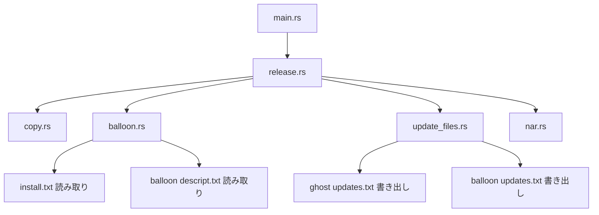
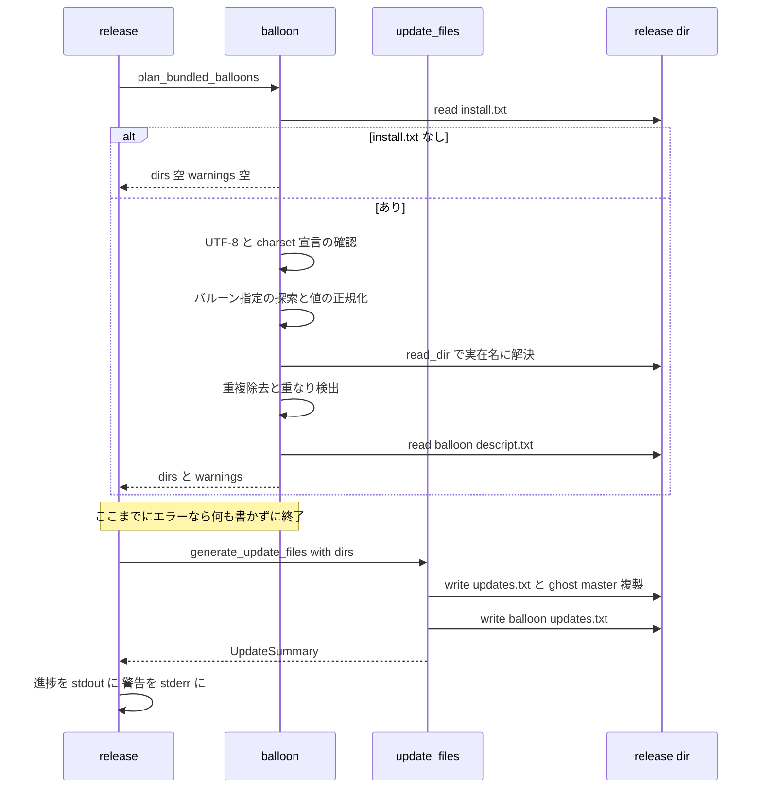
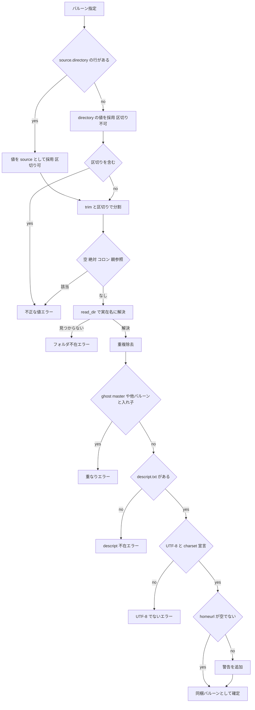

# 設計書: pasta-check-bundled-balloon

## Overview

**目的**: `pasta_check release` が、配布フォルダ直下の `install.txt` から同梱バルーンのフォルダを判定し、そのフォルダ配下をゴースト用 `updates.txt` から外し、同梱バルーンのフォルダ直下にバルーン用 `updates.txt` を生成して nar に入れる。判定の根拠をベースウェアがインストール時に使う `install.txt` と同じにして、配布物の振り分けとネットワーク更新の対象を一致させる。

**利用者**: バルーンを同梱して配るゴーストの作者（emo2 など）が `pasta_check release` で配布物を作る。同梱バルーンを持たないゴースト（hello-pasta・pasta-in-windows）は、`install.txt` に `charset,UTF-8` の宣言がある限り従来どおりの出力を得る。

**影響**: 段 4（更新ファイル生成）の前半に「同梱バルーンの判定（読み取りと検証のみ・書き込みなし）」を挟み、段 4 の書き出しに「相対パス一致の除外」と「バルーン用 `updates.txt` の書き出し」を加える。`install.txt` の UTF-8 宣言が必須になる（利用者に見える変更）。nar 作成（段 5）は変更しない。

### Goals
- 同梱バルーン配下のファイルがゴースト用 `updates.txt`（ルート・`ghost/master`）に 1 行も載らない
- 同梱バルーンのフォルダ直下に、そのフォルダ基準の相対パスで書いたバルーン用 `updates.txt` が生成され、nar に入る
- 壊れた配布物（UTF-8 でない `install.txt`／`descript.txt`、不正な値、実体の無い指定、重なり、`descript.txt` 不在）はエラーで止まり、nar を作らず、配布フォルダに書きかけの `updates.txt` を残さない
- `homeurl` 欠落だけは警告にとどめ、生成物と終了コード 0 は警告なしと同じ
- 同梱バルーンが無いゴーストの出力は `date=` を除きバイト単位で不変

### Non-Goals
- バルーン以外の同梱物（シェル・プラグイン）、`install.txt` の他のキー
- `delete.txt` の生成、nar の構造・既存の除外規則の変更、`updates.txt` の形式変更
- SSP の生成機能が外すファイル（`desktop.ini` など）や `developer_options.txt` の解釈の追加
- 文字コード変換（Shift_JIS 等の `install.txt`・`descript.txt` は扱わない）
- 失敗時に `--nar` の位置に残る前回の nar の削除（既存の挙動のまま。OPEN QUESTION 2）

## Boundary Commitments

### This Spec Owns
- 配布フォルダ直下の `install.txt` の読み取り（UTF-8 宣言の確認、キーの照合、バルーン指定の探索）と、同梱バルーンのフォルダの決定（値の正規化・検証・実在のフォルダ名への解決・重複除去・重なり検出）
- 同梱バルーンの `descript.txt` の UTF-8 確認と `homeurl` の有無の判定（警告の文言を含む）
- ゴースト用 `updates.txt` の収集から、同梱バルーンのフォルダを相対パス一致で外すこと
- 同梱バルーンのフォルダ直下へのバルーン用 `updates.txt` の書き出し
- 段 4 の進捗表示（バルーンごとの件数）と警告の表示（stderr・`Warning:` 接頭辞）
- hello-pasta の `install.txt` への `charset,UTF-8` の追加と、リポジトリ内 `release/hello-pasta` の写しの同期
- スキル `pasta-check`（`SKILL.md`・`references/updates-txt-spec.md`・`references/nar-spec.md`）と `crates/pasta_check/README.md` の記述
- steering `structure.md` の `pasta_check/src/` 一覧への `balloon.rs` の追記（steering を現行に保つための 1 行）

### Out of Boundary
- nar の作成規則（`nar.rs`）。バルーン用 `updates.txt` は配布フォルダ内の通常ファイルとして既存の規則で封入される
- `updates.txt` の 1 行の形式・md5・日時の計算（既存の `generate_updates_txt`・`calculate_md5`・`format_datetime` をそのまま使う）
- 段 1〜3（準備・target コピー・`--copy` 上書き）とパストラバーサル防御（`copy.rs`・`nar.rs`）
- ベースウェアのネットワーク更新の挙動、ghost_dev 側の `release/emo2` の再生成とスキルの写しの同期、crates.io への公開
- マニュアル（`book/`）

### Allowed Dependencies
- Rust 標準ライブラリ（`std::fs`・`std::io`・`std::path`）
- 既存の依存 `md5`・`zip`・`lexopt`（新しい依存は追加しない。`encoding_rs` 等の文字コード変換クレートは使わない）
- 依存の向き: `main.rs` → `release.rs` → { `balloon.rs`, `update_files.rs`, `nar.rs`, `copy.rs` }。`balloon.rs` と `update_files.rs` は互いに依存しない（受け渡しは `release.rs` が `Vec<String>` で行う）

### Revalidation Triggers
- `generate_update_files` の引数・戻り値の形を変えたとき（`release.rs` とテスト）
- 同梱バルーンの判定規則（キー・探索順・正規化・重なりの定義）を変えたとき（スキル文書・README・ghost_dev 側の作者への周知）
- 既存の除外規則（`EXCLUDED_DIRS`・`EXCLUDED_FILES`）を変えたとき（ゴースト用とバルーン用の両方に効く）
- 段の順序（`--copy` 後に判定する前提）を変えたとき
- UTF-8 宣言の必須化の扱いを変えたとき（下流: emo2・pasta-in-windows の `install.txt`）

## Architecture

### Existing Architecture Analysis
- `release.rs` が 5 段を順に呼ぶオーケストレーター。各段は `io::Result` を返し、`main.rs` がエラーを `Error: {e}` で stderr に出して exit 1。進捗は stdout の `println!`。
- `update_files.rs` の収集（`collect_files`）と書き出し（`generate_updates_txt`）は「基準フォルダからの相対パス」で動く。除外は名前一致のみ（`EXCLUDED_DIRS = ["profile", "var"]`、`EXCLUDED_FILES = ["updates2.dau", "updates.txt", "developer_options.txt"]`）。0 件なら書かない。
- `nar.rs` は配布フォルダ全体を固める（`profile` だけ外す）。段 4 → 段 5 の順で書かれたファイルはそのまま入る。
- パスの比較は `\` を `/` に置き換えた相対パス文字列で行い、`fs::canonicalize` は使わない（CI の 8.3 短縮名対策の既存方針）。

### Architecture Pattern & Boundary Map

既存の「段ごとの関数を `release.rs` が順に呼ぶ」形をそのまま使い、段 4 を「判定（読み取り専用）→ 書き出し」の 2 手に分ける。判定は新しいモジュール `balloon.rs`、書き出しは既存の `update_files.rs` が担う。



**Architecture Integration**:
- 選んだ形: 既存のオーケストレーター＋段関数。新しい層や trait は作らない。
- 責務の分離: `balloon.rs` は配布フォルダを**読むだけ**で、同梱バルーンのフォルダ一覧と警告を返す。`update_files.rs` は `install.txt` を知らず、「外す相対フォルダ」と「バルーン用を書くフォルダ」を同じ `&[String]` で受け取る。
- 既存の規則の保持: 名前一致の除外・ソート・形式・0 件で書かない・`ghost/master` への複製は変えない。
- 新しいモジュールの理由: `install.txt`／`descript.txt` の解析と値の検証は単体テストの数が多く（エラー種別ごと）、`update_files.rs`（現在 534 行）に混ぜると責務が「更新ファイル生成」から外れる。モジュールの分け方は OPEN QUESTION 1。
- steering 準拠: 依存追加なし、UTF-8 限定、作成ツールは問題があれば止める。

### Technology Stack

| Layer | Choice / Version | Role in Feature | Notes |
|-------|------------------|-----------------|-------|
| CLI | Rust 2024 edition・`pasta_check`（ワークスペース版） | 判定・生成・表示 | 既存クレートの拡張 |
| Data / Storage | `std::fs`（標準） | `install.txt`・`descript.txt` の読み取り、`updates.txt` の書き出し | 新しい依存なし |
| ハッシュ・アーカイブ | `md5 0.8`・`zip 8.6`（既存） | 既存の md5 計算・nar 作成をそのまま使う | 変更なし |

## File Structure Plan

### Directory Structure
```
crates/pasta_check/
├── src/
│   ├── balloon.rs        # 新規: 同梱バルーンの判定（install.txt・descript.txt の読み取り、値の検証、実在名への解決、警告の組み立て）
│   ├── update_files.rs   # 変更: 相対パス一致の除外・バルーン用 updates.txt の書き出し・戻り値を UpdateSummary に
│   ├── release.rs        # 変更: 段 4 で判定→生成を呼び、件数と警告を表示
│   ├── main.rs           # 変更: `mod balloon;` の追加のみ
│   ├── nar.rs            # 変更なし
│   └── copy.rs           # 変更なし
├── tests/cli_test.rs     # 変更: 既存フィクスチャの install.txt に charset 行を追加、警告・エラーの E2E を追加
└── README.md             # 変更: 仕様メモ（同梱バルーン・UTF-8 必須）とソース構成
```

### Modified Files
- `crates/pasta_check/src/update_files.rs` — `generate_update_files(root, balloon_dirs)` に変更し、`collect_files` に除外する相対フォルダを渡す。バルーンごとに `collect_files(root.join(dir), &[])` → `generate_updates_txt` を呼ぶ。特性化テストと新しい単体テストを追加。
- `crates/pasta_check/src/release.rs` — 段 4 を「`plan_bundled_balloons` → `generate_update_files` → 進捗表示 → 警告表示」に変更。既存テストの `install.txt` フィクスチャに `charset,UTF-8` を追加し、同梱バルーンのパイプラインテストを追加。
- `crates/pasta_check/src/main.rs` — `mod balloon;` を追加。
- `crates/pasta_check/tests/cli_test.rs` — 既存 E2E の `install.txt` を UTF-8 宣言付きに変更。`Warning:` の E2E とエラー（exit 1・nar なし）の E2E を追加。
- `crates/pasta_sample_ghost/ghosts/hello-pasta/install.txt` — 1 行目に `charset,UTF-8`（CRLF）を追加。
- `crates/pasta_sample_ghost/tests/integration_test.rs` — `test_ukadoc_files` に「`install.txt` の 1 行目が `charset,UTF-8`」の確認を追加（Req 8.7 の固定）。
- `release/hello-pasta/`（`install.txt`・`updates.txt`・`ghost/master/updates.txt`）と `release/hello-pasta.nar` — 新しい `pasta_check release`（`release.ps1 -SkipSetup` と同じ段 4 のみ）で再生成して同期する（OPEN QUESTION 3）。
- `.claude/skills/pasta-check/SKILL.md`・`references/updates-txt-spec.md`・`references/nar-spec.md` — Req 9.1〜9.3・9.5。
- `crates/pasta_check/README.md` — Req 9.4 と「ソース構成」への `balloon.rs` の追記。
- `.kiro/steering/structure.md` — `pasta_check/src/` の一覧に `balloon.rs` を 1 行追記（steering を現行に保つ）。

## System Flows

### 段 4 の流れ（判定 → 書き出し）



**流れの決定事項**
- **書く前に検証を確定させる**: `plan_bundled_balloons` はファイルを一切書かない。判定に関わるエラー（Req 1.10・2.1・2.3・2.5・7.2・7.5）はすべてここで出るので、エラー時の配布フォルダには `updates.txt` が新しく書かれない（`--target`/`--copy` 由来の古い `updates.txt` はコピーされたまま残るが、nar は作られない）。
- **警告の表示時点**: 段 4 の進捗表示の直後、段 5 の前に stderr へ出す。警告があっても段 5 へ進む（Req 7.3）。

### バルーン指定 1 件の判定



重複除去と重なり検出は全指定の解決後にまとめて行う（図は 1 件の視点で描いている）。

## Requirements Traceability

| Requirement | Summary | Components | Interfaces | Flows |
|-------------|---------|------------|------------|-------|
| 1.1 | `source.directory` を採用 | balloon | `find_balloon_specs` | 1 件の判定 |
| 1.2 | 無ければ `directory` | balloon | `find_balloon_specs` | 1 件の判定 |
| 1.3 | `install.txt` 無し・指定無しは従来どおり | balloon, update_files | `plan_bundled_balloons` が空を返す | 段 4 |
| 1.4 | 番号付き指定を 番号なし→0→1… で探索・欠番で打ち切り | balloon | `find_balloon_specs` | 1 件の判定 |
| 1.5 | 同じフォルダは 1 回 | balloon | 解決後の実在名で重複除去 | 1 件の判定 |
| 1.6 | 直下の `install.txt` のみ | balloon | `release_dir.join("install.txt")` だけを読む | 段 4 |
| 1.7 | `--copy` 後の `install.txt` | release | 段 4 で呼ぶ | 段 4 |
| 1.8 | キーの大文字小文字無視・値の trim | balloon | `read_utf8_kv` | 段 4 |
| 1.9 | 1 行目の `charset,UTF-8` 確認（BOM 可） | balloon | `read_utf8_kv` | 段 4 |
| 1.10 | 宣言無し・UTF-8 以外・不正バイトはエラー | balloon, main | `io::Error(InvalidData)` → `Error:` exit 1 | 段 4 |
| 1.11 | 文字コード変換なし | balloon | `String::from_utf8` のみ・依存追加なし | — |
| 2.1 | 空・絶対・`..`・`directory` 代用時の区切りはエラー | balloon | `normalize_value` | 1 件の判定 |
| 2.2 | `source.directory` の階層付き相対パス | balloon | `normalize_value` | 1 件の判定 |
| 2.3 | `ghost/master`・他バルーンとの入れ子はエラー | balloon | `check_overlaps` | 1 件の判定 |
| 2.4 | 配布フォルダの外を触らない | balloon, update_files | 検証済み要素＋実在名だけで結合 | 1 件の判定 |
| 2.5 | フォルダ不在（同名ファイル含む）はエラー | balloon | `resolve_existing_dir` | 1 件の判定 |
| 2.6 | 大文字小文字違いを一貫して扱う | balloon, update_files | 実在名に解決し以降は完全一致 | 1 件の判定 |
| 3.1 | 同梱バルーン配下をルート `updates.txt` に載せない | update_files | `collect_files(root, excluded)` | 段 4 |
| 3.2 | `ghost/master/updates.txt` は同内容 | update_files | 既存の `fs::copy` | 段 4 |
| 3.3 | それ以外は従来どおり載せる | update_files | 除外は相対パス完全一致のみ | 段 4 |
| 3.4 | 同名の別位置フォルダは外さない | update_files | 相対パス完全一致（名前一致ではない） | 段 4 |
| 4.1 | バルーン直下に 1 つずつ生成 | update_files | `generate_updates_txt(root.join(dir), …)` | 段 4 |
| 4.2 | バルーン基準の相対パス | update_files | `collect_files` の基準をバルーンのフォルダに | 段 4 |
| 4.3 | 同じ形式 | update_files | 既存 `generate_updates_txt` を共有 | 段 4 |
| 4.4 | 自分自身を載せない | update_files | 既存 `EXCLUDED_FILES` の `updates.txt` | 段 4 |
| 4.5 | 同じ除外規則 | update_files | 既存 `EXCLUDED_DIRS`・`EXCLUDED_FILES` | 段 4 |
| 4.6 | 既存の `updates.txt` を置き換え | update_files | `File::create` の上書き | 段 4 |
| 4.7 | 0 件なら生成しない | update_files | 既存の早期 return と同じ分岐 | 段 4 |
| 4.8 | バルーン直下以外へ書かない | update_files | バルーンには `ghost/master` 複製をしない | 段 4 |
| 4.9 | フォルダと件数を表示 | release | `UpdateSummary.balloon_entries` | 段 4 |
| 5.1 | md5・size は実バイトから | update_files | 既存 `calculate_md5`・`metadata.len()` | 段 4 |
| 5.2 | 他ファイルを変更しない | balloon, update_files | `balloon.rs` は読むだけ・書くのは `updates.txt` のみ | 段 4 |
| 5.3 | nar 内のバイトと一致 | nar（変更なし） | 既存 `create_nar` | 段 5 |
| 6.1 | nar に `<バルーン>/updates.txt` | nar（変更なし） | 段 4 → 段 5 の順序 | 段 5 |
| 6.2 | nar のパス体系・除外規則を保つ | nar（変更なし） | — | 段 5 |
| 7.1 | `homeurl` 無し・空は警告 | balloon | `BalloonPlan.warnings` | 1 件の判定 |
| 7.2 | `descript.txt` 不在はエラー | balloon | `io::Error(NotFound 系)` | 1 件の判定 |
| 7.3 | 警告では止めない | release | 警告表示後に段 5 へ | 段 4 |
| 7.4 | 警告の接頭辞 | release | `eprintln!("Warning: {w}")` | 段 4 |
| 7.5 | `descript.txt` にも UTF-8 規則・キー照合 | balloon | `read_utf8_kv` を共有 | 1 件の判定 |
| 8.1 | バルーン無しは `date=` 以外不変 | update_files | `excluded` が空なら従来と同じ収集 | 段 4 |
| 8.2 | nar の集合・名前も不変 | nar（変更なし） | — | 段 5 |
| 8.3 | バルーン無しで警告なし | balloon | 指定が無ければ `descript.txt` を読まない | 段 4 |
| 8.4 | 後方互換の回帰テスト | update_files, release | 特性化テスト | — |
| 8.5 | 同梱ありのテスト | update_files, release, cli_test | パイプラインテスト | — |
| 8.6 | バルーン無しでも UTF-8 宣言は必須 | balloon | 指定の有無より先に宣言を確認 | 段 4 |
| 8.7 | hello-pasta に宣言追加・写しを同期 | sample ghost | `install.txt`・`integration_test.rs`・`release/hello-pasta` | — |
| 9.1 | `updates-txt-spec.md` | skill docs | — | — |
| 9.2 | `nar-spec.md` | skill docs | — | — |
| 9.3 | `SKILL.md` | skill docs | — | — |
| 9.4 | README | README | — | — |
| 9.5 | 既存の食い違いの修正 | skill docs | — | — |

## Components and Interfaces

| Component | Domain/Layer | Intent | Req Coverage | Key Dependencies | Contracts |
|-----------|--------------|--------|--------------|------------------|-----------|
| BalloonPlanner（`balloon.rs`） | 判定 | `install.txt` から同梱バルーンのフォルダを決め、警告を集める（読み取り専用） | 1.1–1.11, 2.1–2.6, 5.2, 7.1, 7.2, 7.5, 8.3, 8.6 | std::fs (P0) | Service |
| UpdateFilesGenerator（`update_files.rs`） | 生成 | ゴースト用・バルーン用 `updates.txt` を書く | 3.1–3.4, 4.1–4.8, 5.1, 5.2, 8.1, 8.4, 8.5 | md5 (P0) | Service |
| ReleaseOrchestrator（`release.rs`） | オーケストレーション | 段 4 で判定→生成→表示 | 1.7, 4.9, 7.3, 7.4, 8.5 | BalloonPlanner (P0), UpdateFilesGenerator (P0) | Batch |
| NarBuilder（`nar.rs`） | 封入 | 変更なし。段 4 の成果物をそのまま封入 | 5.3, 6.1, 6.2, 8.2 | zip (P0) | — |
| 文書・サンプル | 文書 | スキル・README・hello-pasta の更新 | 8.7, 9.1–9.5 | — | — |

### 判定

#### BalloonPlanner（`crates/pasta_check/src/balloon.rs`）

| Field | Detail |
|-------|--------|
| Intent | 配布フォルダを読むだけで、同梱バルーンのフォルダ一覧と警告を返す |
| Requirements | 1.1–1.11, 2.1–2.6, 5.2, 7.1, 7.2, 7.5, 8.3, 8.6 |

**Responsibilities & Constraints**
- 読むファイルは `<release>/install.txt` と `<release>/<バルーン>/descript.txt` だけ。ファイルを書かない、作らない、消さない（5.2・2.4）。
- サブフォルダの `install.txt` は読まない（1.6）。
- 返すフォルダ名は「配布フォルダからの相対パス・`/` 区切り・各要素がディスク上の実在名」に統一する（2.6）。下流はこの文字列を完全一致で使う。

**Dependencies**
- Inbound: ReleaseOrchestrator — 段 4 の判定（P0）
- External: `std::fs::read`・`std::fs::read_dir`（P0）

**Contracts**: Service [x]

##### Service Interface
```rust
/// 同梱バルーンの判定結果。ファイルは一切書かない。
pub(crate) struct BalloonPlan {
    /// 同梱バルーンのフォルダ（配布フォルダからの相対パス、`/` 区切り、実在のフォルダ名）。
    /// 探索順（番号なし → 0 → 1 …）で並び、重複は除去済み。
    pub dirs: Vec<String>,
    /// 警告文（接頭辞なし。表示は呼び出し側が `Warning: ` を付ける）。
    pub warnings: Vec<String>,
}

/// 配布フォルダ直下の install.txt から同梱バルーンを判定する。
/// - install.txt が無い: Ok(空の BalloonPlan)
/// - 判定に関わる問題: Err(io::Error)（kind は InvalidData。メッセージにファイル・キー・値を含める）
pub(crate) fn plan_bundled_balloons(release_dir: &Path) -> io::Result<BalloonPlan>;
```

内部関数（モジュール外へは出さない）:
```rust
/// UTF-8 の `key,value` ファイルを読む。BOM を除き、1 行目が charset,UTF-8 であることを確かめ、
/// 2 行目以降を (小文字化したキー, trim した値) の列で返す。カンマの無い行は無視する。
fn read_utf8_kv(path: &Path, label: &str) -> io::Result<Vec<(String, String)>>;

/// バルーン指定 1 件。key は採用した行のキー（エラー表示用）。
struct BalloonSpec { key: String, value: String, hierarchical_allowed: bool }

/// 番号なし → balloon0 → balloon1 … の順に探す。
fn find_balloon_specs(kv: &[(String, String)]) -> Vec<BalloonSpec>;

/// 値を要素列に正規化し検証する（不正なら 2.1 のエラー）。
fn normalize_value(spec: &BalloonSpec) -> io::Result<Vec<String>>;

/// 要素ごとに read_dir で実在のフォルダ名へ解決する（無ければ 2.5 のエラー）。
fn resolve_existing_dir(root: &Path, comps: &[String], key: &str) -> io::Result<String>;

/// ghost/master・他バルーンとの入れ子を検出する（2.3 のエラー）。
fn check_overlaps(dirs: &[(String, String)]) -> io::Result<()>;
```

- 前提: 段 1〜3 が完了している（1.7）。
- 事後条件: `Ok` のとき、`dirs` の各要素について `release_dir.join(dir)` は実在のフォルダで、直下に UTF-8 宣言付きの `descript.txt` があり、どの 2 つも入れ子でなく、`ghost/master` とも入れ子でない。
- 不変条件: 戻り値の有無にかかわらず配布フォルダの内容は変わらない。

**判定規則（設計で確定）**

1. **`install.txt` の読み取り**（1.8–1.11, 8.6）
   - `fs::read` が `NotFound` → 同梱バルーン無し（1.3）。それ以外の読み取りエラーはそのまま返す。
   - 先頭の UTF-8 BOM（`EF BB BF`）を除き、`String::from_utf8` に失敗したらエラー（1.10）。
   - 行は `\n` で分け、末尾の `\r` と前後の空白を除く。
   - 1 行目を最初の `,` で分け、キーと値を trim して、どちらも ASCII 大文字小文字無視で `charset`・`UTF-8` に一致しなければエラー（1.9・1.10）。この確認は同梱バルーンの有無より先に行う（8.6）。
   - 2 行目以降は最初の `,` で分け、キーは trim して ASCII 小文字化、値は trim。カンマの無い行は無視。同じキーが複数あるときは**最初の行を採る**（前提。OPEN QUESTION 4）。
2. **バルーン指定の探索**（1.1, 1.2, 1.4）
   - 接頭辞 `balloon` を調べ、続いて `balloon0`, `balloon1`, … を調べる。各接頭辞 `P` について `P.source.directory` か `P.directory` のどちらかの行があれば指定が 1 件あるとみなす。
   - `P.source.directory` の行があれば（値が空でも）それを採る（`hierarchical_allowed = true`）。無ければ `P.directory` を採る（`hierarchical_allowed = false`）。
   - 番号付きは、どちらの行も無い最初の番号で探索を打ち切る。番号なしの指定の有無は番号付きの探索に影響しない（両者は併存しうる。前提。OPEN QUESTION 5）。
3. **値の正規化と検証**（2.1, 2.2）— 次の順で行い、最初に該当したものでエラー:
   1. trim 後に空 → 不正（空）
   2. `hierarchical_allowed = false` で `/` か `\` を含む → 不正（`directory` に区切り）
   3. 先頭が `/` か `\`（ルート・UNC） → 不正（絶対パス）
   4. `:` を含む（ドライブ名・ドライブ相対・代替ストリーム） → 不正（絶対パス）
   5. `/` と `\` で分割し、空要素と `.` を捨てる。残りに `..` があれば → 不正（親参照）
   6. 残りが空（例 `.`・`./`） → 不正（空）
4. **実在のフォルダ名への解決**（2.5, 2.6, 2.4）— 要素ごとに親フォルダを `read_dir` し、
   - 名前が完全に一致するフォルダ（シンボリックリンクでないもの）があればそれを採る。
   - 無ければ、`親.join(要素).is_dir()` が真（＝ファイルシステムが同じフォルダとみなす）の場合に限り、小文字化して一致するフォルダの実在名を採る。
   - どちらも無ければ不在エラー（同名のファイルがある場合・シンボリックリンクの場合を含む）。
   - 結果は実在名を `/` で結んだ文字列。結合に使うのは検証済みの要素と `read_dir` が返した実在名だけなので、配布フォルダの外を指しえない（2.4）。
5. **重複除去**（1.5）— 解決後の文字列が同じ指定は最初の 1 件だけ残す。
6. **重なり検出**（2.3）— 要素単位の前方一致で判定する。`ghost/master` と同じ・その上位（`ghost`）・その配下 → エラー。別の同梱バルーンの上位・配下 → エラー。同梱バルーンどうしの比較は解決後の実在名で完全一致。`ghost/master` との比較だけは要素ごとに ASCII の大文字小文字を無視する（既存コードの `root.join("ghost/master")` は大文字小文字を区別しないファイルシステムでは `Ghost/Master` も指すため、それに合わせる）。
7. **`descript.txt`**（7.1, 7.2, 7.5）— 各フォルダの `descript.txt` が `is_file()` でなければエラー（7.2）。`read_utf8_kv` で読み（UTF-8 規則違反はエラー）、キー `homeurl` の値が無いか空なら警告を 1 件加える（7.1）。

**エラー・警告の文言**（既存の CLI 出力に合わせて英語。`main.rs` が `Error: ` を付ける）

| 種別 | Req | 文言の形 |
|------|-----|----------|
| UTF-8 でない | 1.10, 7.5 | `install.txt is not UTF-8: the first line must be "charset,UTF-8" (pasta_check supports UTF-8 only)` ／ 不正バイト時は `... contains invalid UTF-8 byte sequence` |
| 不正な値 | 2.1 | `install.txt: invalid value for balloon0.source.directory: "../x" (parent directory reference)` ／ 理由は `empty`・`absolute path`・`path separator is not allowed in directory`・`parent directory reference` |
| フォルダ不在 | 2.5 | `install.txt: bundled balloon folder "emo2-kakukaku" (balloon.source.directory) does not exist in the release folder` |
| 重なり | 2.3 | `install.txt: bundled balloon folder "ghost" (balloon.directory) overlaps with ghost/master` ／ `... overlaps with bundled balloon folder "a" (balloon0.source.directory)` |
| `descript.txt` 不在 | 7.2 | `bundled balloon "emo2-kakukaku": descript.txt not found` |
| `homeurl` 警告 | 7.1 | `bundled balloon "emo2-kakukaku": descript.txt has no homeurl; the balloon cannot be network-updated` |

`descript.txt` の UTF-8 エラーでは `install.txt` の部分を `emo2-kakukaku/descript.txt` に置き換える（`read_utf8_kv` の `label` 引数）。

**Implementation Notes**
- Integration: `main.rs` に `mod balloon;` を足す。`release.rs` からだけ呼ぶ。
- Validation: 大文字小文字の解決（規則 4 の後半）は大文字小文字を区別しないファイルシステムでしか成り立たないため、そのテストは `#[cfg(windows)]` にする（CI は Windows ランナー）。
- Risks: 規則 4 で 8.3 短縮名（`EMO2-K~1`）の値は `is_dir()` が真でも実在名に一致しないため不在エラーになる。正式名を書くべき値なので許容する。

### 生成

#### UpdateFilesGenerator（`crates/pasta_check/src/update_files.rs`）

| Field | Detail |
|-------|--------|
| Intent | ゴースト用 `updates.txt`（ルート＋`ghost/master` 複製）とバルーン用 `updates.txt` を書く |
| Requirements | 3.1–3.4, 4.1–4.8, 5.1, 5.2, 8.1, 8.4, 8.5 |

**Responsibilities & Constraints**
- `install.txt` を読まない。受け取った `balloon_dirs` を検証済みとして扱う。
- 書くファイルは `<root>/updates.txt`・`<root>/ghost/master/updates.txt`（既存）・`<root>/<dir>/updates.txt`（新規）だけ（4.8・5.2）。
- `balloon_dirs` が空のとき、収集・書き出しは現行と同じ処理経路を通り、出力は `date=` を除きバイト単位で同一（8.1）。

**Dependencies**
- Inbound: ReleaseOrchestrator（P0）
- External: `md5`（既存、P0）

**Contracts**: Service [x]

##### Service Interface
```rust
/// 段 4 の生成結果
pub(crate) struct UpdateSummary {
    /// ゴースト用 updates.txt の登録件数（0 なら生成していない。従来の戻り値と同じ意味）
    pub ghost_entries: usize,
    /// 生成したバルーン用 updates.txt の (フォルダ, 登録件数)。0 件で生成しなかったものは含めない
    pub balloon_entries: Vec<(String, usize)>,
}

/// balloon_dirs: 配布フォルダからの相対パス（`/` 区切り・実在名・検証済み）
pub(crate) fn generate_update_files(root_dir: &Path, balloon_dirs: &[String]) -> io::Result<UpdateSummary>;

/// excluded_dirs: 基準フォルダからの相対パスが完全一致したフォルダを丸ごと外す（名前一致の既存除外に追加）
fn collect_files(root_dir: &Path, excluded_dirs: &[String]) -> io::Result<Vec<FileEntry>>;
```

- 処理順: (1) `collect_files(root, balloon_dirs)` → 既存どおりルートへ書き `ghost/master` へ複製、(2) `balloon_dirs` の順に `collect_files(root.join(dir), &[])` → 0 件なら飛ばし、そうでなければ `generate_updates_txt(root.join(dir), …)`。バルーンには `ghost/master` への複製を行わない（4.8）。
- 除外の判定: `collect_files_recursive` でフォルダに入る前に、既存の名前一致（`EXCLUDED_DIRS`）に加え、そのフォルダの相対パス（`strip_prefix` → `\` を `/` に置換。ファイルと同じ作り方）が `excluded_dirs` に含まれていれば入らない（3.1・3.4）。相対パスは `read_dir` が返す実在名から作られるため、`balloon.rs` が返す実在名と完全一致で比べられる（2.6）。
- 既存テストの `collect_files(path)` 呼び出しは `collect_files(path, &[])` に置き換える。

**Implementation Notes**
- Integration: 除外の仕組みを足す前に、バルーン無しの固定フィクスチャについて `updates.txt` の全バイトを（`date=` の値を伏せて）期待値と比較する特性化テストを先に置く（8.1・8.4、リファクタリングは安全かつ可逆に）。
- Validation: 同名フォルダが別位置（例 `ghost/master/emo2-kakukaku/`）にあっても外れないことを単体テストで固定する（3.4）。
- Risks: 書き出し中の IO エラーは既存どおり途中の状態を残しうる（判定エラーとは別。既存の挙動）。

### オーケストレーション

#### ReleaseOrchestrator（`crates/pasta_check/src/release.rs`）

| Field | Detail |
|-------|--------|
| Intent | 段 4 で判定 → 生成 → 進捗表示 → 警告表示を行う |
| Requirements | 1.7, 4.9, 7.3, 7.4, 8.5 |

**Contracts**: Batch [x]

##### Batch / Job Contract（段 4）
- Trigger: 段 3（`--copy` 上書き）の完了後（1.7）。
- 処理:
  ```
  [4/5] Generating update files...
    Generated updates.txt (N entries)
    Generated emo2-kakukaku/updates.txt (20 entries)     ← 生成したバルーンごとに 1 行（stdout）
  Warning: bundled balloon "emo2-kakukaku": descript.txt has no homeurl; ...   ← stderr
  [5/5] Creating NAR archive...
  ```
- エラー: `plan_bundled_balloons`・`generate_update_files` の `Err` を `?` でそのまま返す。`main.rs` が `Error: {e}` を stderr に出して exit 1。段 5 に進まないので nar は作られない（1.10・2.1・2.3・2.5・7.2）。
- 警告: `plan.warnings` を段 4 の進捗表示の後に `eprintln!("Warning: {w}")` で出し、段 5 へ進む（7.3・7.4）。終了コードは 0。
- 冪等性: 段 1 で配布フォルダを作り直すため、再実行で同じ結果（`date=` を除く）になる。

## Data Models

### Domain Model
- **バルーン指定**（`BalloonSpec`）: 採用したキー（`balloon.source.directory` 等）・値・階層付きを許すか。`install.txt` 1 回の読み取りで 0 件以上。
- **同梱バルーン**（`BalloonPlan.dirs` の 1 要素）: 実在名で書いた配布フォルダからの相対パス。不変条件: 実在のフォルダ、直下に UTF-8 の `descript.txt`、他の同梱バルーン・`ghost/master` と入れ子でない、重複なし。
- **警告**（`BalloonPlan.warnings` の 1 要素）: 生成物に影響しない注意。現状は `homeurl` 欠落だけ。

### Data Contracts & Integration
- 生成するバルーン用 `updates.txt` の形式はゴースト用と同一（`charset,UTF-8\r\n` ＋ `file,<相対パス>\x01<md5>\x01size=<n>\x01date=<UTC>\x01\r\n` をパスの辞書順）。パスの基準だけが同梱バルーンのフォルダになる。

## Error Handling

### Error Strategy
- **Fail fast・書く前に止める**: 配布物の誤りはすべて `plan_bundled_balloons` の中で `io::Error`（`ErrorKind::InvalidData`）として返し、何も書かずに終了する。既存の `Error:` ＋ exit 1 の経路をそのまま使い、新しいエラー型は作らない。
- **警告は 1 種類**: `homeurl` 欠落だけ（valid だが更新できない状態）。生成物と終了コードに影響しない。
- **前回の nar**: エラー時に `--nar` の位置に前回の nar が残るのは既存の IO エラーと同じ挙動で、本仕様では変えない（OPEN QUESTION 2）。

### Error Categories and Responses
| 分類 | 条件 | 応答 |
|------|------|------|
| 文字コード | `install.txt`／バルーンの `descript.txt` の 1 行目が `charset,UTF-8` でない・不正バイト | エラー・exit 1・nar なし |
| 不正な値 | 空・絶対・`:`・`..`・`directory` 代用時の区切り | エラー（キーと値を表示） |
| 実体の不在 | 指定フォルダが無い・ファイル・シンボリックリンク | エラー（キーとフォルダを表示） |
| 重なり | `ghost/master` や他バルーンと入れ子 | エラー（両方のフォルダを表示） |
| バルーン不成立 | `descript.txt` が無い | エラー（フォルダを表示） |
| 更新不可 | `homeurl` が無い・空 | 警告（stderr・`Warning:`）、処理継続・exit 0 |

## Testing Strategy

### Unit Tests（`balloon.rs`）
- `read_utf8_kv`: `Charset,UTF-8`（大文字）・BOM 付き・前後空白を受け入れ、宣言無し・`charset,Shift_JIS`・不正バイト（`0x82 0xA0`）をエラーにする（1.8–1.10）。
- `find_balloon_specs`: `source.directory` 優先・`directory` 代用・番号なし＋`balloon0`＋`balloon1` の 3 件・`balloon1` 欠番で `balloon2` を拾わない・キーの大文字小文字無視（1.1, 1.2, 1.4, 1.8）。
- `normalize_value`: `extra\bal1`・`extra/bal1/` を受け入れ、空・`/abs`・`\\server\x`・`C:\x`・`C:x`・`a/../b`・`.`・`directory` 代用時の `a/b` を各理由でエラーにする（2.1, 2.2）。
- 解決と重なり: 不在・同名ファイル → 不在エラー、`ghost`・`ghost/master`・`ghost/master/x`・バルーン同士の入れ子 → 重なりエラー、同じフォルダを指す 2 件 → 1 件（1.5, 2.3, 2.5）。`#[cfg(windows)]` で `EMO2-KAKUKAKU` → 実在名 `emo2-kakukaku` に解決（2.6）。
- `descript.txt`: 不在 → エラー、Shift_JIS 宣言 → エラー、`homeurl` 無し・空 → 警告 1 件、`HomeURL,https://…` → 警告なし（7.1, 7.2, 7.5）。`install.txt` 無し・指定無し → 空・警告なし（1.3, 8.3）。

### Unit Tests（`update_files.rs`）
- 特性化: バルーン無しの固定フィクスチャで、ルートと `ghost/master` の `updates.txt` 全バイトが（`date=` を伏せて）期待値と一致（8.1, 8.4）。**除外の変更より先に追加する。**
- 除外: `balloon_dirs = ["bal"]` でルートの一覧に `bal/` の行が無く、`ghost/master/bal/` の同名フォルダは残る（3.1, 3.3, 3.4）。
- バルーン用: `bal/updates.txt` の各行が `file,arrow0.png…` のようにバルーン基準で、自分自身・`profile/`・`var/`・`updates2.dau`・`developer_options.txt` を含まず、md5・size が実ファイルと一致する。既存の `bal/updates.txt` は置き換わる（4.1–4.6, 5.1）。`bal/ghost/master/` があっても複製しない（4.8）。

### Integration Tests（`release.rs`）
- 同梱バルーン付きパイプライン: nar に `bal/updates.txt` があり、nar 内の各ファイルのバイト列の md5・size がバルーン用 `updates.txt` の記載と一致し、ルート・`ghost/master` の `updates.txt` に `bal/` の行が無い（3.2, 5.3, 6.1, 8.5）。
- 判定エラー時: nar が作られず、配布フォルダのルートに `updates.txt` が新しく書かれない（validate-before-write、1.10, 2.5）。
- 既存テストの `install.txt` フィクスチャを `charset,UTF-8\r\n…` に更新し、バルーン無しの nar のエントリ集合が従来と同じであることを確認（8.2, 8.6）。

### E2E Tests（`tests/cli_test.rs`）
- `homeurl` 無しの同梱バルーン: exit 0、stderr に `Warning:` とフォルダ名、stdout に `Generated bal/updates.txt (N entries)`（4.9, 7.3, 7.4）。
- 宣言の無い `install.txt`: exit 1、stderr に `Error:` と `UTF-8`、nar が無い（1.10, 8.6）。
- バルーン無し: stderr に `Warning:` が出ない（8.3）。
- サンプル: `crates/pasta_sample_ghost/tests/integration_test.rs` で hello-pasta の `install.txt` の 1 行目が `charset,UTF-8` であることを確認（8.7）。

## Security Considerations
- `install.txt` は作者が書く入力で、値で任意のパスを指しうる。値は「区切りで分割 → `..`・`:`・先頭区切りを拒否 → `read_dir` の実在名だけで結合」の順で扱い、配布フォルダの外を読み書きしない（2.4）。シンボリックリンクのフォルダは同梱バルーンとして採らない（既存の収集・nar がリンクを辿らない方針と一致）。

## Migration Strategy
- 利用者に見える変更は「`install.txt` に `charset,UTF-8` の宣言が必須」の 1 点。README とスキルに明記する（9.4）。
- リポジトリ内: hello-pasta の `install.txt` に宣言を足し、`release/hello-pasta` を新しい `pasta_check release` で再生成する。
- 下流: emo2（`Charset,UTF-8` 済み）は追加作業なし。pasta-in-windows の `install.txt` に宣言があるかは本リポジトリから確認できない（リスク。OPEN QUESTION 6）。

## Open Questions（設計ディスカッションで決める）

1. **モジュールの分け方**（Architecture・File Structure Plan）— 案 A: すべて `update_files.rs` に入れる（ファイルが増えない）／案 B: `balloon.rs` を新設（本書の前提）／案 C: 行解析と値の検証だけを新設。前提: 案 B。
2. **失敗時に残る前回の nar**（Error Handling）— 案: 既存どおり残す（本書の前提）／段 1 で `--nar` の既存ファイルを消す。作成ツールは問題があれば止める方針から、誤って古い nar を配る危険をどう見るか。
3. **`release/hello-pasta` の写しの同期方法**（File Structure Plan）— 案: `pasta_check release` で再生成（`updates.txt` の全行の `date=` と nar が変わる。本書の前提）／`install.txt` だけ手で直す（写しの `updates.txt` の `install.txt` 行の md5・size が実ファイルと食い違う）。
4. **同じキーが複数あるとき**（BalloonPlanner 判定規則 1）— 案: 最初の行を採る（本書の前提）／最後の行を採る／エラーで止める。SSP の挙動は未確認。
5. **番号なしの指定が無いときの番号付きの探索**（BalloonPlanner 判定規則 2）— 案: 番号なしの有無に関係なく `balloon0` から探す（本書の前提）／番号なしが無ければ探索しない。ukadoc の「番号なし → 0 → 1 …、欠番で打ち切り」の「欠番」に番号なしを含むかの解釈。
6. **pasta-in-windows の `install.txt` の UTF-8 宣言**（Migration Strategy）— 宣言が無ければ新しい `pasta_check` で release が止まる（Req 8.6 どおり）。リリース告知・README の記載で足りるか、pasta-in-windows 側の対応を本件の完了条件に含めるか。
7. **`profile`・`var` の配下を指すバルーン指定**（BalloonPlanner 判定規則 3）— `profile/` は nar に入らないため、その配下の同梱バルーンはインストールできない配布物になる。案: 要件どおり受け入れる（本書の前提）／不正な値としてエラーにする。
