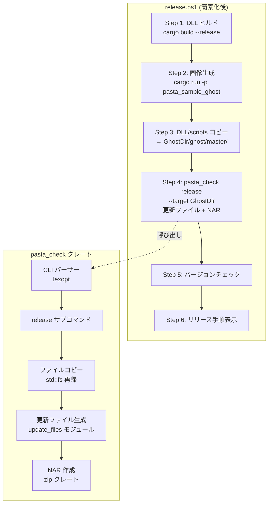
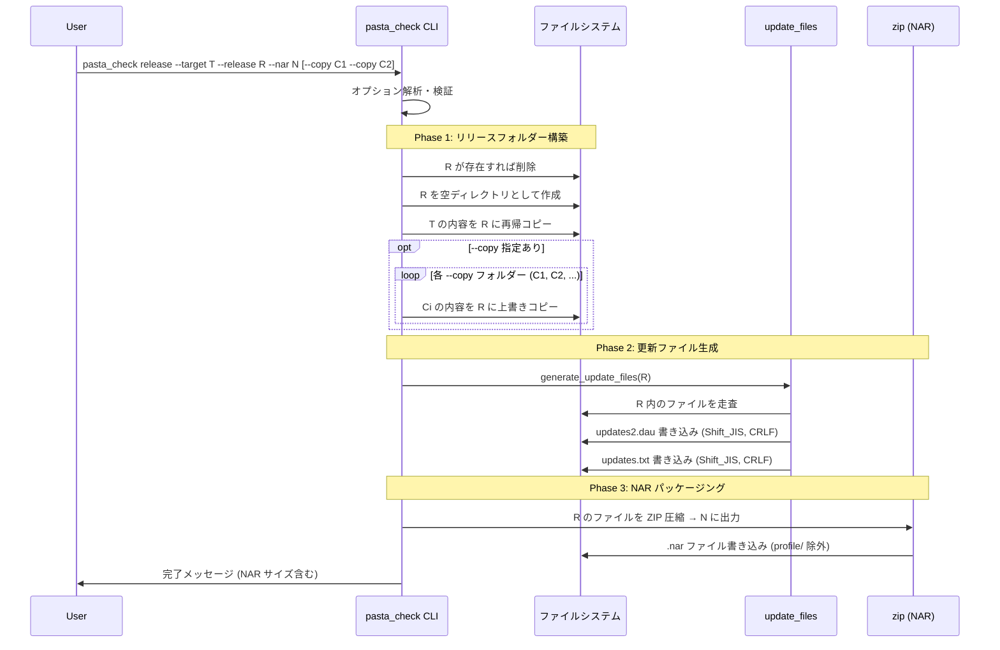
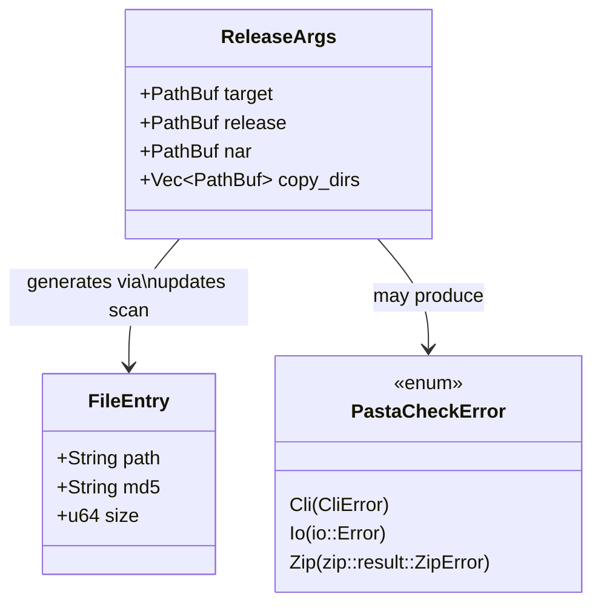

# Design Document: pasta-check

## Overview

**Purpose**: `pasta_check` は、ゴーストのリリースパッケージ作成に必要な処理（リリースフォルダー構築・更新ファイル生成・NAR パッケージング）を単一の CLI コマンドで実行する Rust 製ツールである。

**Users**: pasta エンジンを利用するゴースト開発者が、`release` サブコマンドでリリース成果物を一括生成する。

**Impact**: 現在 `pasta_sample_ghost` と `release.ps1` に分散しているリリース処理を `pasta_check` クレートに統合し、`release.ps1` の簡素化と将来的な廃止への道筋を確立する。

### Goals
- リリースフォルダー構築・更新ファイル生成・NAR 作成の一括実行
- `pasta_sample_ghost` からリリース関連処理の完全分離
- crates.io 公開による外部開発者への提供
- `release.ps1` の簡素化（ファイルコピー・finalize・NAR 作成の委譲）

### Non-Goals
- Lua コードの単体試験実行（将来の `test` サブコマンドで対応予定）
- `release.ps1` の完全廃止（本フィーチャーのスコープ外）
- ゴースト画像生成（`pasta_sample_ghost` の責務として維持）
- リリース成果物のバリデーション（`pasta_check` の正常終了で保証）

## Architecture

### Existing Architecture Analysis

現在のリリース処理は以下のように分散している：

| 処理 | 現在の実装 | 移行先 |
|------|-----------|--------|
| 更新ファイル生成 | `pasta_sample_ghost/src/update_files.rs` (Rust) | `pasta_check` |
| NAR パッケージング | `release.ps1` Step 8 (PowerShell) | `pasta_check` |
| リリースフォルダー構築 | `release.ps1` Step 4 (robocopy → GhostDir) | `pasta_check` (`--release` フォルダーへコピー) |
| dist-src robocopy | `release.ps1` Step 2 (robocopy) | **廃止**（辞書を `ghosts/hello-pasta` に直接配置） |
| DLL ビルド | `release.ps1` Step 1 (cargo build) | `release.ps1` (維持) |
| DLL/scripts コピー | `release.ps1` Step 4 (copy → GhostDir) | `release.ps1` (維持、Step 3 に繰り上げ) |
| 画像生成 | `release.ps1` Step 3 (cargo run) | `release.ps1` (維持、Step 2 に繰り上げ) |
| バージョンチェック | `release.ps1` Step 6 | `release.ps1` (維持、Step 5 に繰り上げ) |

`pasta_check` は新規独立クレートとして追加され、既存クレートの依存グラフに影響を与えない。

### Architecture Pattern & Boundary Map



**Architecture Integration**:
- **Selected pattern**: CLI バイナリクレート（単一サブコマンド・パイプライン実行）
- **Domain boundaries**: `pasta_check` はリリース処理のみ。画像生成は `pasta_sample_ghost`。DLL ビルド・DLL/scripts の開発フォルダーへのコピーは `release.ps1`
- **Existing patterns preserved**: ワークスペースレイヤー構成、`version.workspace = true` パターン、`publish = true` 公開パターン
- **New components rationale**: CLI 層（`lexopt`）と NAR 生成層（`zip`）は新規外部依存だが、いずれも最小構成で採用
- **Steering compliance**: `tech.md` のワークスペース構成原則に準拠。新クレートは独立レイヤーとして追加

### Technology Stack

| Layer | Choice / Version | Role in Feature | Notes |
|-------|------------------|-----------------|-------|
| CLI | `lexopt` 0.3.2 | コマンドライン解析 | 依存ゼロ、MIT、`research.md` 参照 |
| 更新ファイル生成 | `md5` 0.8 / `encoding_rs` 0.8 | MD5 ハッシュ、Shift_JIS エンコード | 既存実装の移植 |
| NAR 作成 | `zip` 8.4 (deflate only) | ZIP アーカイブ生成 | `default-features = false` |
| エラー処理 | `thiserror` workspace | 型付きエラー定義 | ワークスペース共通 |
| ファイル操作 | `std::fs` | 再帰コピー・ディレクトリ操作 | 外部依存なし |
| 将来拡張 | `pasta_lua` (依存のみ) | Lua 単体試験サポート基盤 | 現時点では未使用 |

## System Flows

### release サブコマンド実行フロー



## Requirements Traceability

| Requirement | Summary | Components | Interfaces | Flows |
|-------------|---------|------------|------------|-------|
| 1.1–1.7 | クレート構成・ワークスペース統合 | CrateSetup | Cargo.toml | — |
| 2.1–2.6 | CLI インターフェース | CliParser | main(), Args struct | release フロー入口 |
| 3.1–3.8 | release 実行フロー | ReleaseCommand | release_command() | release フロー全体 |
| 4.1–4.6 | 更新ファイル生成 | UpdateFiles | generate_update_files() | Phase 2 |
| 5.1–5.5 | NAR ファイル作成 | NarBuilder | create_nar() | Phase 3 |
| 6.1–6.5 | pasta_sample_ghost 分離 | (削除対象) | — | — |
| 7.1–7.4 | release.ps1 簡素化 | (スクリプト変更) | — | — |
| 8.1–8.4 | release.bat 移動 | (ファイル移動) | — | — |
| 9.1–9.4 | crates.io 公開設定 | CrateSetup | Cargo.toml | — |

## Components and Interfaces

| Component | Domain/Layer | Intent | Req Coverage | Key Dependencies | Contracts |
|-----------|-------------|--------|-------------|------------------|-----------|
| CrateSetup | Build | クレート構成・メタデータ定義 | 1.1–1.7, 9.1–9.4 | workspace Cargo.toml (P0) | — |
| CliParser | CLI | コマンドライン解析・バリデーション | 2.1–2.6 | lexopt (P0) | Service |
| ReleaseCommand | Command | release サブコマンドの実行制御 | 3.1–3.8 | CliParser (P0), UpdateFiles (P0), NarBuilder (P0) | Service |
| FileCopier | IO | 再帰ファイルコピー・上書きコピー | 3.1–3.3, 3.8 | std::fs (P0) | Service |
| UpdateFiles | IO | SSP 更新ファイル生成 | 4.1–4.6 | md5 (P0), encoding_rs (P0) | Service |
| NarBuilder | IO | NAR (ZIP) ファイル作成 | 5.1–5.5 | zip (P0) | Service |

### CLI Layer

#### CliParser

| Field | Detail |
|-------|--------|
| Intent | コマンドライン引数を解析し、構造化された `Args` に変換する |
| Requirements | 2.1, 2.2, 2.3, 2.4, 2.5, 2.6 |

**Responsibilities & Constraints**
- `release` サブコマンドの認識
- `--target`, `--release`, `--nar` の必須検証
- `--copy` の複数回指定蓄積
- `--help` / `--version` 対応
- 不明オプション時のエラー報告

**Dependencies**
- External: `lexopt` 0.3.2 — CLI レキサー (P0)

**Contracts**: Service [x]

##### Service Interface

```rust
/// 解析済みコマンドライン引数
struct Args {
    command: Command,
}

/// サブコマンド
enum Command {
    Release(ReleaseArgs),
    Help,
    Version,
}

/// release サブコマンドの引数
struct ReleaseArgs {
    /// ゴースト開発フォルダーパス (--target)
    target: PathBuf,
    /// リリース出力先フォルダーパス (--release)
    release: PathBuf,
    /// NAR 出力ファイルパス (--nar)
    nar: PathBuf,
    /// 上書きコピー元フォルダーパス (--copy, 0回以上)
    copy_dirs: Vec<PathBuf>,
}

/// コマンドライン解析
fn parse_args() -> Result<Args, CliError>;
```

- Preconditions: なし（プロセス引数から解析）
- Postconditions: `ReleaseArgs` の `target`, `release`, `nar` は非空パス。`copy_dirs` は指定順序を保持
- Invariants: 必須オプション未指定時は `CliError` で `usage` メッセージを含む

**Implementation Notes**
- `lexopt::Parser::from_env()` + `while let Some(arg) = parser.next()` パターン
- `--copy` は `Short('c') | Long("copy")` マッチで `copy_dirs.push(parser.value()?.into())`

---

### Command Layer

#### ReleaseCommand

| Field | Detail |
|-------|--------|
| Intent | release サブコマンドの全ステップをシーケンシャルに実行する |
| Requirements | 3.1, 3.2, 3.3, 3.4, 3.5, 3.6, 3.7, 3.8 |

**Responsibilities & Constraints**
- `--release` フォルダーの削除→再作成
- `--target` → `--release` の再帰コピー
- `--copy` → `--release` の上書きコピー（指定順序で）
- 更新ファイル生成の呼び出し
- NAR 作成の呼び出し
- 各ステップの進捗メッセージ出力
- いずれかのステップで IO エラー時、エラー報告 + 非ゼロ終了

**Dependencies**
- Inbound: CliParser — 解析済み `ReleaseArgs` (P0)
- Outbound: FileCopier — ファイルコピー (P0)
- Outbound: UpdateFiles — 更新ファイル生成 (P0)
- Outbound: NarBuilder — NAR 作成 (P0)

**Contracts**: Service [x]

##### Service Interface

```rust
/// release サブコマンドを実行
fn execute_release(args: &ReleaseArgs) -> Result<(), PastaCheckError>;
```

- Preconditions: `args` の各パスが有効（存在チェックは実行時）
- Postconditions: `args.release` にリリースフォルダー完成。`args.nar` に NAR ファイル作成済み。`args.target` は未変更
- Invariants: ステップは順序通り実行（フォルダー構築 → 更新ファイル → NAR）

**Implementation Notes**
- 各ステップを `println!` で進捗表示（`[1/5] Preparing release folder...` 形式）
- IO エラーは `?` で早期伝播。`main()` で `process::exit(1)`

---

### IO Layer

#### FileCopier

| Field | Detail |
|-------|--------|
| Intent | ディレクトリの再帰コピーと上書きコピーを提供する |
| Requirements | 3.1, 3.2, 3.3, 3.8 |

**Responsibilities & Constraints**
- ディレクトリの再帰的な全ファイルコピー
- 上書きモード: 既存ファイルを上書き、新規ファイルを追加（ディレクトリ構造を維持）
- `--target` フォルダーの内容は読み取り専用（変更なし）

**Dependencies**
- External: `std::fs` — ファイルシステム操作 (P0)

**Contracts**: Service [x]

##### Service Interface

```rust
/// src の内容を dst に再帰コピー
/// dst が存在しない場合は作成する
fn copy_dir_recursive(src: &Path, dst: &Path) -> io::Result<u64>;

/// release フォルダーを削除して空ディレクトリとして再作成
fn prepare_release_dir(release_dir: &Path) -> io::Result<()>;
```

- Preconditions: `src` が存在するディレクトリであること
- Postconditions: `dst` に `src` の全ファイル・ディレクトリが再帰的にコピーされる。戻り値はコピーしたファイル数
- Invariants: シンボリックリンクは通常ファイルとしてコピー

#### UpdateFiles

| Field | Detail |
|-------|--------|
| Intent | SSP ネットワーク更新ファイル (`updates2.dau`, `updates.txt`) を生成する |
| Requirements | 4.1, 4.2, 4.3, 4.4, 4.5, 4.6 |

**Responsibilities & Constraints**
- `updates2.dau`: Shift_JIS、CRLF、SOH 区切りフォーマット
- `updates.txt`: Shift_JIS、CRLF、カンマ区切りフォーマット
- MD5 ハッシュ + ファイルサイズをエントリに含む
- `profile/`, `var/` ディレクトリ、`updates2.dau`, `updates.txt`, `developer_options.txt` を除外
- パスのアルファベット順ソート
- Shift_JIS 変換不可時は UTF-8 フォールバック

**Dependencies**
- External: `md5` 0.8 — ハッシュ計算 (P0)
- External: `encoding_rs` 0.8 — Shift_JIS エンコーディング (P0)

**Contracts**: Service [x]

##### Service Interface

```rust
/// 更新ファイルを生成
/// root_dir: リリースフォルダーのパス
/// 戻り値: 登録したファイルエントリ数
fn generate_update_files(root_dir: &Path) -> io::Result<usize>;
```

- Preconditions: `root_dir` が存在し、配布ファイルが配置されていること
- Postconditions: `root_dir/updates2.dau` と `root_dir/updates.txt` が SSP 仕様準拠で生成される
- Invariants: 既存実装（`pasta_sample_ghost/src/update_files.rs`）と同一の出力を保証

**Implementation Notes**
- 既存 `update_files.rs` のコードコピーによる直接移植（`research.md`「既存コードの移植性分析」参照）
- `FileEntry` 構造体、`collect_files()`、`generate_updates2_dau()`、`generate_updates_txt()`、`calculate_md5()` をそのまま移植
- テスト 3 件も同時に移植

#### NarBuilder

| Field | Detail |
|-------|--------|
| Intent | リリースフォルダーから NAR (ZIP) ファイルを作成する |
| Requirements | 5.1, 5.2, 5.3, 5.4, 5.5 |

**Responsibilities & Constraints**
- リリースフォルダーの全ファイルを ZIP deflate 圧縮
- `profile/` ディレクトリを除外
- NAR ファイルの親ディレクトリを必要に応じて再帰作成
- 既存 NAR ファイルの上書き
- 完了時に NAR ファイルサイズを報告

**Dependencies**
- External: `zip` 8.4 (deflate only) — ZIP アーカイブ作成 (P0)

**Contracts**: Service [x]

##### Service Interface

```rust
/// NAR ファイルを作成
/// release_dir: リリースフォルダーのパス
/// nar_path: 出力 NAR ファイルのパス
/// 戻り値: NAR ファイルのサイズ（バイト）
fn create_nar(release_dir: &Path, nar_path: &Path) -> io::Result<u64>;
```

- Preconditions: `release_dir` が存在し、配布ファイルが配置されていること
- Postconditions: `nar_path` に ZIP (deflate) 形式の NAR ファイルが作成される。`profile/` 配下のファイルは含まない
- Invariants: ZIP 内のファイルパスは `release_dir` からの相対パス（スラッシュ区切り）

**Implementation Notes**
- `ZipWriter::new(File::create(nar_path)?)` で ZIP ファイルを作成
- `collect_files_recursive` パターン（`update_files` と共通のファイル走査ロジック）を再利用
- 圧縮メソッド: `zip::CompressionMethod::Deflated`（デフォルト設定）

---

### Build Configuration

#### CrateSetup

| Field | Detail |
|-------|--------|
| Intent | `pasta_check` の Cargo.toml 定義とワークスペース統合 |
| Requirements | 1.1, 1.2, 1.3, 1.4, 1.5, 1.6, 1.7, 9.1, 9.2, 9.3, 9.4 |

**Cargo.toml 構成**

```toml
[package]
name = "pasta_check"
workspace = "../.."
version.workspace = true
description = "CLI tool for ghost release packaging - generates update files and NAR archives"
edition.workspace = true
authors.workspace = true
license.workspace = true
publish = true
repository.workspace = true
homepage.workspace = true
documentation.workspace = true

[[bin]]
name = "pasta_check"
path = "src/main.rs"

[dependencies]
# CLI パーサー
lexopt = "0.3"

# 更新ファイル生成
md5 = "0.8"
encoding_rs = "0.8"

# NAR (ZIP) 作成
zip = { version = "8.4", default-features = false, features = ["deflate"] }

# エラー処理
thiserror.workspace = true

# 将来拡張（Lua 単体試験サポート基盤）
pasta_lua = { path = "../pasta_lua", version = "0.1" }

[dev-dependencies]
tempfile.workspace = true
```

**ソースファイル構成**

```
crates/pasta_check/
├── Cargo.toml
├── README.md
└── src/
    ├── main.rs          # エントリポイント、CLI 解析
    ├── release.rs       # release サブコマンド実行ロジック
    ├── update_files.rs  # SSP 更新ファイル生成（移植）
    ├── nar.rs           # NAR (ZIP) ファイル作成
    └── copy.rs          # 再帰ファイルコピー
```

---

### Integration: pasta_sample_ghost 分離 (6.1–6.5)

**削除対象**:
- `crates/pasta_sample_ghost/src/update_files.rs` — モジュール全体
- `crates/pasta_sample_ghost/src/lib.rs` — `pub mod update_files` 宣言、`finalize_ghost()` 関数
- `crates/pasta_sample_ghost/src/main.rs` — `--finalize` オプション分岐、`run_finalize_mode()` 関数
- `crates/pasta_sample_ghost/Cargo.toml` — `md5` 依存、`encoding_rs` 依存
- `crates/pasta_sample_ghost/hello-pasta.nar` — 既存 NAR ファイル
- `crates/pasta_sample_ghost/dist-src/` — 廃止。内容は `crates/pasta_sample_ghost/ghosts/hello-pasta/` に統合

**再配置（dist-src 廃止）**:
- `dist-src/ghost/` → `ghosts/hello-pasta/ghost/`（辞書・設定テキストを直接 git 管理）
- `dist-src/shell/` → `ghosts/hello-pasta/shell/`（シェル設定テキストを直接 git 管理）
- `dist-src/install.txt` → `ghosts/hello-pasta/install.txt`

**影響なし**:
- `integration_test.rs` — 10 テストはすべて画像生成系。finalize/update_files を参照しない
- 画像生成機能（`image_generator.rs`, `config_templates.rs`, `scripts.rs`）— 変更なし

---

### Integration: release.ps1 簡素化 (7.1–7.5)

**変更前（概念）**:
```
Step 1: DLL ビルド
Step 2: dist-src robocopy → GhostDir
Step 3: 画像生成 (cargo run -p pasta_sample_ghost)
Step 4: DLL/scripts コピー → GhostDir
Step 5: finalize (cargo run -p pasta_sample_ghost -- --finalize)
Step 6: バージョンチェック
Step 7: バリデーション
Step 8: NAR 作成 (Compress-Archive)
Step 9: リリース手順表示
```

**変更後（概念）**:
```
Step 1: DLL ビルド
Step 2: 画像生成 (cargo run -p pasta_sample_ghost → GhostDir/shell/master/)
Step 3: DLL/scripts コピー (→ GhostDir/ghost/master/)
Step 4: pasta_check release --target GhostDir --release ReleaseDir --nar NarPath
Step 5: バージョンチェック
Step 6: リリース手順表示
```

**主な変更点**:
- 旧 Step 2 (dist-src robocopy) → **廃止**。辞書・設定テキストは `ghosts/hello-pasta/` に直接配置されるため不要
- 旧 Step 4 (DLL/scripts コピー) → Step 3 として維持（`GhostDir` への直接コピー）
- 旧 Step 5 (finalize) → `pasta_check release` 内で自動実行
- 旧 Step 7 (バリデーション) → 廃止（`pasta_check` の正常終了で保証）
- 旧 Step 8 (NAR 作成) → `pasta_check release` 内で自動実行
- ステップ数: 9 段階 → 6 段階に簡素化。`--copy` は使用しない
- パス変数: `$GhostDir = ghosts/hello-pasta`（`--target`）、新規 `$ReleaseDir`（例: `release/hello-pasta`、`--release`）、`$NarFilePath`（例: `release/hello-pasta.nar`、`--nar`）
- **Existing Architecture Analysis** 更新: `dist-src/ robocopy` は「廃止」となる

---

### Integration: release.bat 移動 (8.1–8.4)

**変更内容**:
- `crates/pasta_sample_ghost/release.bat` → `release.bat`（リポジトリルート）に移動
- パス解決: `%~dp0crates\pasta_sample_ghost\release.ps1` を呼び出すように変更
- オプション `-SkipSetup`, `-SkipDllBuild` をパススルー

## Data Models

### Domain Model



- **ReleaseArgs**: CLI から受け取るリリースパラメータ。`release` サブコマンドのトランザクション境界を定義
- **FileEntry**: 更新ファイル内の 1 エントリ。パス・MD5・サイズの値オブジェクト（既存 `update_files.rs` からの移植）
- **PastaCheckError**: CLI エラー、IO エラー、ZIP エラーの統合エラー型
