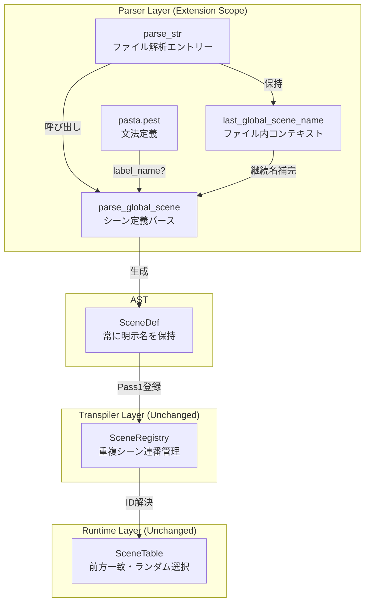
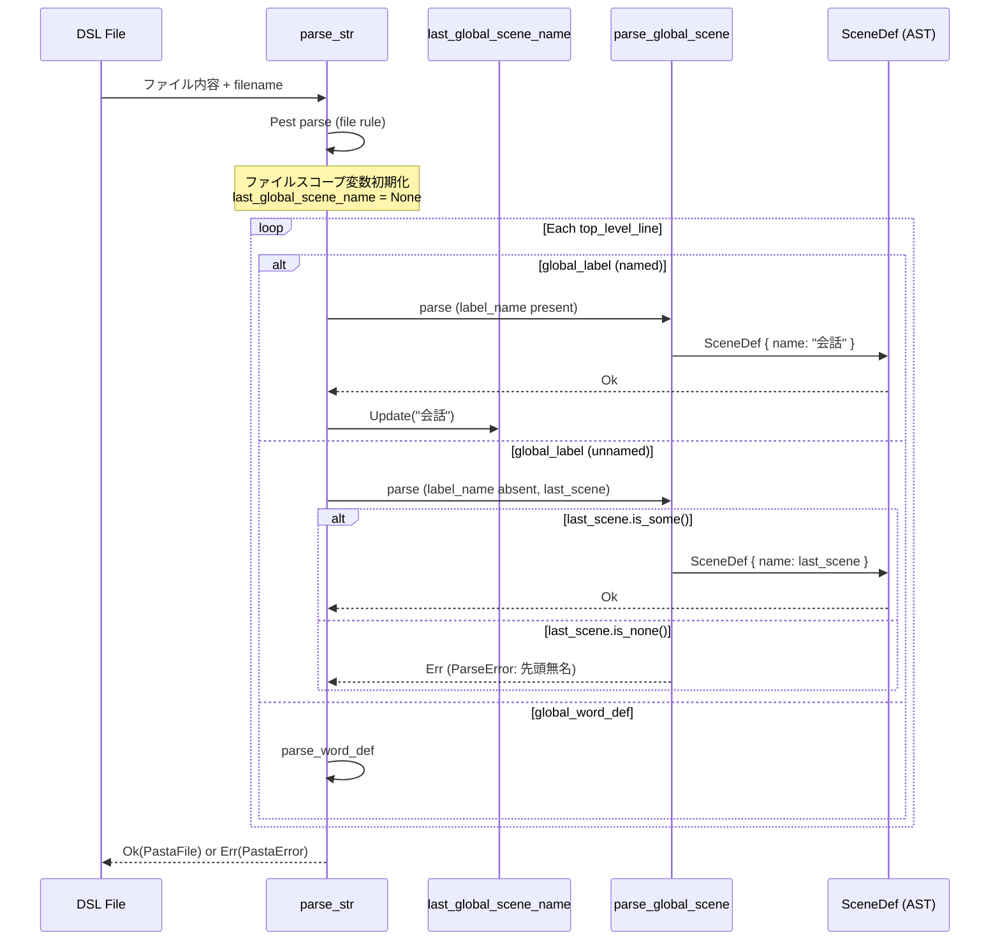

# Design Document

## Overview
本機能は、pasta DSLにおいてグローバルシーン定義（「＊」行）でシーン名を省略可能にする構文糖衣を提供する。同一DSLファイル内で最後に指定されたグローバルシーン名を継続利用することで、重複シーン定義（ランダム選択候補）の記述を簡潔化し、スクリプト作成者の生産性を向上させる。

**Purpose**: 重複シーン定義時のシーン名記述を省略可能にし、DSL記述の冗長性を削減する。  
**Users**: pasta DSLスクリプト作成者（ゴースト会話、シナリオゲーム記述者）  
**Impact**: パーサー層のみの変更であり、トランスパイラ・ランタイム層は既存の重複シーン管理機構をそのまま利用する。

### Goals
- 無名「＊」行で直近のグローバルシーン名を継続利用可能にする
- ファイル先頭の無名「＊」を明確なエラーとして検出する
- パーサー層で正規化し、後段レイヤーへの影響を排除する
- 後方互換性を維持する（既存DSLスクリプトはそのまま動作）

### Non-Goals
- トランスパイラ・ランタイム層の変更（既存のSceneRegistry/SceneTableを再利用）
- ローカルシーン「・」での無名継続（グローバルシーンのみが対象）
- ファイル間でのシーン名継続（各DSLファイルは独立）
- 動的なシーン名解決（パース時に静的に決定）

## Architecture

### Existing Architecture Analysis
pasta DSLのパーサーは、Pest 2.8 PEGパーサー生成器を用いて`pasta.pest`文法定義からソースコードを解析し、AST（`PastaFile`）を生成する。

**Current Architecture Patterns**:
- **Parser Layer**: `parse_str` → `parse_global_scene` → `SceneDef` (AST)
- **Transpiler Layer**: SceneRegistry（Pass1: シーン登録、Pass2: Runeコード生成）
- **Runtime Layer**: SceneTable（前方一致検索、ランダム選択）

**Constraints to Respect**:
- AST構造体（`SceneDef`）は変更しない（常に明示的なシーン名を持つ）
- トランスパイラの重複シーン処理ロジック（連番付与）を再利用
- パーサーAPIシグネチャ（`parse_file`, `parse_str`）を維持

**Integration Points**:
- `parse_str`関数内でファイルスコープの状態を管理
- `parse_global_scene`関数にコンテキスト（直近シーン名）を渡す
- Pest文法の`global_label`ルールでシーン名をオプション化

### Architecture Pattern & Boundary Map



**Architecture Integration**:
- **Selected pattern**: Parser-Only Normalization（構文糖衣をパーサー層で正規化）
- **Domain boundaries**: パーサー（構文解析・コンテキスト管理）↔ トランスパイラ（コード生成）
- **Existing patterns preserved**: 重複シーン連番登録、前方一致検索、ランダム選択
- **New components rationale**: ファイル内コンテキスト（`last_global_scene_name`）を追加するのみ
- **Steering compliance**: レイヤー分離原則（Parser → Transpiler → Runtime）を維持

### Technology Stack

| Layer | Choice / Version | Role in Feature | Notes |
|-------|------------------|-----------------|-------|
| Parser | Pest 2.8 | 文法拡張（label_name?）、コンテキストトラッキング | 既存バージョン維持 |
| Parser (Rust) | Rust 2024 edition | parse_str内でファイルスコープ変数管理 | 既存エディション準拠 |
| AST | ast.rs (SceneDef) | 無変更（常に明示名） | 既存構造体再利用 |
| Error Handling | thiserror 2.0 | PastaError::ParseError拡張 | 既存エラー型再利用 |

## System Flows

### Unnamed Scene Parsing Flow



**Flow Decisions**:
- **Context Update**: 名前付き「＊」パース後、即座に`last_global_scene_name`を更新
- **Error Gating**: 無名「＊」パース時に`last_global_scene_name.is_none()`を検証
- **No Rollback**: パースエラー時は即座に失敗、部分的なASTは破棄

## Requirements Traceability

| Requirement | Summary | Components | Interfaces | Flows |
|-------------|---------|------------|------------|-------|
| 1.1 | 無名「＊」で直近シーン名を継続 | parse_str, parse_global_scene | last_global_scene_name context | Unnamed Scene Parsing Flow |
| 1.2 | 連続する無名「＊」で同名を保持 | parse_str (loop処理) | last_global_scene_name persistence | Unnamed Scene Parsing Flow |
| 1.3 | 無名「＊」後のローカルシーン関連付け | parse_global_scene (SceneDef生成) | SceneDef.name補完 | Unnamed Scene Parsing Flow |
| 1.4 | 無名「＊」後の属性・アクション関連付け | parse_global_scene (SceneDef生成) | SceneDef.name補完 | Unnamed Scene Parsing Flow |
| 2.1 | 明示名でコンテキスト更新 | parse_str (loop処理) | last_global_scene_name update | Unnamed Scene Parsing Flow |
| 2.2 | 非シーン行でコンテキスト保持 | parse_str (loop処理) | last_global_scene_name preservation | Unnamed Scene Parsing Flow |
| 2.3 | 新ファイルでコンテキストリセット | parse_str (初期化) | last_global_scene_name = None | Unnamed Scene Parsing Flow |
| 3.1 | 先頭無名「＊」をエラー検出 | parse_global_scene (validation) | PastaError::ParseError | Unnamed Scene Parsing Flow (error path) |
| 3.2 | 名前付きシーン未出現時エラー | parse_global_scene (validation) | PastaError::ParseError | Unnamed Scene Parsing Flow (error path) |
| 3.3 | エラーに行番号とメッセージ | parse_global_scene (error creation) | PastaError::ParseError fields | Unnamed Scene Parsing Flow (error path) |
| 4.1 | 無名「＊」行にコメント不可 | pasta.pest (grammar) | global_label rule | Grammar validation |
| 4.2 | 行頭コメントのみ有効 | pasta.pest (grammar) | comment_line rule | Grammar validation |

## Components and Interfaces

| Component | Domain/Layer | Intent | Req Coverage | Key Dependencies | Contracts |
|-----------|--------------|--------|--------------|------------------|-----------|
| parse_str | Parser | ファイル全体をパースしASTを生成 | 1.1, 1.2, 2.1, 2.2, 2.3 | parse_global_scene (P0) | Service |
| parse_global_scene | Parser | グローバルシーン定義をパースしSceneDefを生成 | 1.1, 1.3, 1.4, 3.1, 3.2, 3.3 | PastaError (P0) | Service |
| pasta.pest | Parser | DSL文法定義 | 4.1, 4.2 | Pest 2.8 (P0) | Grammar |
| SceneDef (AST) | Parser | グローバルシーンAST表現 | 1.1, 1.3, 1.4 | — | State |

### Parser Layer

#### parse_str

| Field | Detail |
|-------|--------|
| Intent | DSLファイル全体をパースし、ASTを生成する |
| Requirements | 1.1, 1.2, 2.1, 2.2, 2.3 |

**Responsibilities & Constraints**
- Pestパーサーでファイル全体を解析し、トップレベル要素を順次処理
- ファイルスコープの`last_global_scene_name: Option<String>`を保持・更新
- 各グローバルシーン定義を`parse_global_scene`に委譲し、`SceneDef`を収集
- 単語定義は`parse_word_def`に委譲
- コメント行・空行は無視

**Dependencies**
- Outbound: `parse_global_scene` — グローバルシーン定義パース (P0)
- Outbound: `parse_word_def` — 単語定義パース (P0)
- External: Pest 2.8 — PEG文法パース (P0)

**Contracts**: [x] Service

##### Service Interface
```rust
/// DSLファイル全体をパースしてASTを生成
pub fn parse_str(source: &str, filename: &str) -> Result<PastaFile, PastaError>;
```
- **Preconditions**: 
  - `source`は有効なUTF-8文字列
  - `filename`はエラー報告用（実ファイルでなくても可）
- **Postconditions**: 
  - 成功時: `PastaFile`を返す（ASTノード、全SceneDefは明示的なシーン名を持つ）
  - 失敗時: `PastaError::ParseError`または`PastaError::PestError`を返す
- **Invariants**: 
  - ファイル内のグローバルシーン順序を保持
  - 無名「＊」は内部で補完され、ASTには明示名のみ

**Implementation Notes**
- **Integration**: ファイルスコープ変数`last_global_scene_name`をloop内で管理、名前付き「＊」パース後に更新
- **Validation**: 無名「＊」は`parse_global_scene`に`last_global_scene_name.clone()`を渡して委譲
- **Risks**: ファイル処理順序が変わると状態管理が破綻する可能性（現在のPest文法は行単位・トップダウンなのでリスク低）

#### parse_global_scene

| Field | Detail |
|-------|--------|
| Intent | グローバルシーン定義をパースし、SceneDefを生成する |
| Requirements | 1.1, 1.3, 1.4, 3.1, 3.2, 3.3 |

**Responsibilities & Constraints**
- Pest `global_label`ルールから`SceneDef`を生成
- `label_name`が存在する場合は使用、存在しない場合は`last_scene_name`を使用
- `last_scene_name`が`None`の場合はエラーを返す
- 予約パターン（`__*__`）の検証を継続

**Dependencies**
- Inbound: `parse_str` — グローバルシーン定義Pairとコンテキストを渡す (P0)
- Outbound: `PastaError::ParseError` — エラー生成 (P0)

**Contracts**: [x] Service

##### Service Interface
```rust
/// グローバルシーン定義をパースしてSceneDefを生成
/// 
/// # Arguments
/// * `pair` - Pest `global_label` Pair
/// * `last_scene_name` - 直近のグローバルシーン名（無名時に使用）
/// 
/// # Returns
/// * `Ok(SceneDef)` - 成功時、常に明示的なシーン名を持つ
/// * `Err(PastaError::ParseError)` - 無名かつlast_scene_name=Noneの場合
fn parse_global_scene(
    pair: Pair<Rule>, 
    last_scene_name: Option<String>
) -> Result<SceneDef, PastaError>;
```
- **Preconditions**: 
  - `pair.as_rule() == Rule::global_label`
  - `last_scene_name`は無名「＊」の場合に必須
- **Postconditions**: 
  - `SceneDef.name`は常に非空文字列
  - エラー時は行番号と明確なメッセージを含む
- **Invariants**: 
  - 予約パターン（`__*__`）は引き続き拒否
  - ローカルシーン・属性・ステートメントは既存ロジックで処理

**Implementation Notes**
- **Integration**: `label_name`ルールの有無を判定、無い場合は`last_scene_name.ok_or_else(|| ...)`でエラー生成
- **Validation**: Spanから行番号を取得し、`PastaError::ParseError { file, line, column, message }`を構築
- **Risks**: Pest文法変更時に`label_name?`の扱いが変わる可能性（文法テストで保護）

#### pasta.pest (Grammar Extension)

| Field | Detail |
|-------|--------|
| Intent | DSL文法定義を拡張し、無名「＊」を許容する |
| Requirements | 4.1, 4.2 |

**Responsibilities & Constraints**
- `global_label`ルールで`label_name`をオプション化（`label_name?`）
- `comment_line`ルールは既存のまま（行頭コメントのみ）
- 無名「＊」行に他の要素（コメント等）が混在しないよう文法で制約

**Dependencies**
- External: Pest 2.8 — PEG parser generator (P0)

**Contracts**: [x] Grammar

##### Grammar Contract
```pest
global_label = ${
    global_label_marker ~ label_name? ~ NEWLINE ~
    (label_body_line | indent_only_line | empty_line)*
}
```
- **Grammar Change**: `label_name`を必須から`label_name?`に変更
- **Backward Compatibility**: 既存の名前付き「＊」は引き続き有効
- **Format Constraint**: `label_name`が無い場合、`global_label_marker`の後ろはNEWLINEのみ（Pestの暗黙的WHITESPACE挿入により行末空白は許容）

**Implementation Notes**
- **Integration**: 既存のPest文法と統合、他のルールへの影響なし
- **Validation**: Pestパーサーが文法を検証、コンパイル時エラーで文法ミスを検出
- **Risks**: Pest 2.8の後方互換性が将来的に変わる可能性（依存バージョン固定で軽減）

#### SceneDef (AST)

| Field | Detail |
|-------|--------|
| Intent | グローバルシーンのAST表現を保持する |
| Requirements | 1.1, 1.3, 1.4 |

**Responsibilities & Constraints**
- `name: String`は常に明示的なシーン名を持つ
- 無名「＊」由来のSceneDefも、パーサーで補完された名前を格納
- 構造体の変更は不要

**Dependencies**
- Inbound: `parse_global_scene` — SceneDefを生成 (P0)

**Contracts**: [x] State

##### State Management
- **State model**: 
  ```rust
  pub struct SceneDef {
      pub name: String,       // 常に明示的なシーン名
      pub scope: SceneScope,
      pub params: Vec<String>,
      pub attributes: Vec<Attribute>,
      pub local_words: Vec<WordDef>,
      pub local_scenes: Vec<SceneDef>,
      pub statements: Vec<Statement>,
      pub span: Span,
  }
  ```
- **Persistence & consistency**: ASTは一時的なメモリ構造、Transpilerに渡された後は破棄
- **Concurrency strategy**: 不要（単一スレッドパース）

**Implementation Notes**
- **Integration**: 既存のAST構造体を無変更で利用
- **Validation**: `name`が空文字列でないことは`parse_global_scene`で保証
- **Risks**: なし（既存構造体の再利用）

## Data Models

### Domain Model
本機能はパーサー層のみの変更であり、新しいドメインエンティティは導入しない。既存のAST構造体（`PastaFile`, `SceneDef`）を再利用する。

**Invariants**:
- `SceneDef.name`は常に非空文字列
- ファイル内のグローバルシーン順序はパース順序と一致
- 無名「＊」由来のSceneDefは、明示名SceneDefと区別不可（正規化済み）

### Logical Data Model

**Structure Definition**:
- `PastaFile.scenes: Vec<SceneDef>` — グローバルシーンのリスト
- 各`SceneDef`は`name`, `attributes`, `local_scenes`, `statements`を持つ
- 無名「＊」は内部で補完され、後段レイヤーから見て通常のSceneDefと同じ

**Consistency & Integrity**:
- パーサーがファイルスコープで`last_global_scene_name`を管理
- 無名「＊」パース時にコンテキストが`None`の場合はエラー
- トランスパイラは同名シーンを連番で登録（既存の整合性メカニズム）

## Error Handling

### Error Strategy
パーサー層で早期検出し、明確なエラーメッセージを提供する。ファイル先頭の無名「＊」や、名前付きシーン未出現時の無名「＊」は`PastaError::ParseError`として報告する。

### Error Categories and Responses
**User Errors (Parse Errors)**:
- **先頭無名「＊」**: 最初のグローバルシーンでシーン名が省略されている
  - Example message: `"Unnamed global scene at the start of file. The first scene definition must have an explicit name. Consider adding a scene name after the '＊' marker."`
  - Location: Line number and column included in `PastaError::ParseError`
- **名前付きシーン未出現時の無名「＊」**: ファイル内で名前付きシーンがまだパースされていない
  - Example message: `"Unnamed global scene with no prior named scene for continuation. A named global scene must appear before using unnamed '＊' markers."`
  - Location: Line number and column included in `PastaError::ParseError`
- **無名「＊」行にコメント**: 文法レベルで拒否 → Pestエラー「unexpected token」

**System Errors**:
- **Pest Parser Error**: 文法違反全般 → `PastaError::PestError`で報告（既存メカニズム）

**Business Logic Errors**:
- 該当なし（パーサーはビジネスロジックを持たない）

### Monitoring
- エラー発生時はファイル名、行番号、列番号、メッセージを含む`PastaError::ParseError`を返す
- テストケースでエラーパスを網羅し、メッセージ品質を検証
- 将来的にtracingでデバッグログを追加可能（現時点では不要）

## Testing Strategy

### Unit Tests
- **parse_str with unnamed scenes**:
  - 名前付き「＊」→無名「＊」の順でパース、ASTの両SceneDefが正しいシーン名を持つことを検証
  - 連続する無名「＊」で同名が継続されることを検証
  - ファイル先頭の無名「＊」でエラーが返されることを検証
- **parse_global_scene with context**:
  - `last_scene_name = Some("会話")`で無名「＊」をパース、`SceneDef.name == "会話"`を検証
  - `last_scene_name = None`で無名「＊」をパース、`Err(PastaError::ParseError)`を検証
- **Grammar validation**:
  - `global_label`ルールで`label_name?`が正しく機能することを検証
  - 無名「＊」行にコメントが混在した場合にPestエラーが発生することを検証

### Integration Tests
- **E2E parsing**:
  - 実際のDSLファイル（`tests/fixtures/unnamed_scene.pasta`）をパースし、複数の無名「＊」が正しく補完されることを検証
  - トランスパイラがパース結果を受け取り、重複シーン登録が正常に動作することを確認
- **Backward Compatibility Validation**:
  - 既存のDSLファイル（`tests/fixtures/`内の全ファイル）が引き続き正常にパース可能であることを検証
  - 既存テストスイート（`cargo test --all`）が全て通過することを確認
  - 名前付き「＊」のみを使用したDSLスクリプトが、パーサー拡張後も同一のASTを生成することを検証
- **Error messaging**:
  - 先頭無名「＊」のDSLファイルをパースし、エラーメッセージが行番号と明確な指示を含むことを検証

### E2E/UI Tests
- 該当なし（パーサー層のみの変更、UI変更なし）

### Performance/Load
- 該当なし（ファイルスコープ変数追加による性能影響は無視できる）

## Migration Strategy
本機能は後方互換性を維持し、既存DSLスクリプトは変更なしで動作する。新機能（無名「＊」）は追加のみで、破壊的変更はない。

**Deployment Steps**:
1. パーサー層の変更をマージ
2. 既存テストが全て通過することを確認
3. 新規テストケース（無名「＊」、エラーケース）を追加して実行
4. リリース後、ドキュメント（GRAMMAR.md）を更新して新機能を周知

**Rollback Triggers**:
- 既存DSLスクリプトがパースエラーになった場合（後方互換性破綻）
- 新機能のエラーメッセージが不明瞭で、ユーザーが混乱した場合

**Validation Checkpoints**:
- `cargo test --all` 全通過
- `tests/fixtures/`内の既存DSLファイルが引き続きパース可能
- 新規fixtureファイル（無名「＊」を含む）が正常にパース可能
