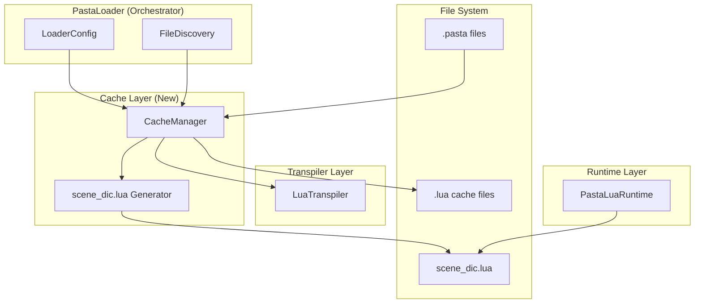
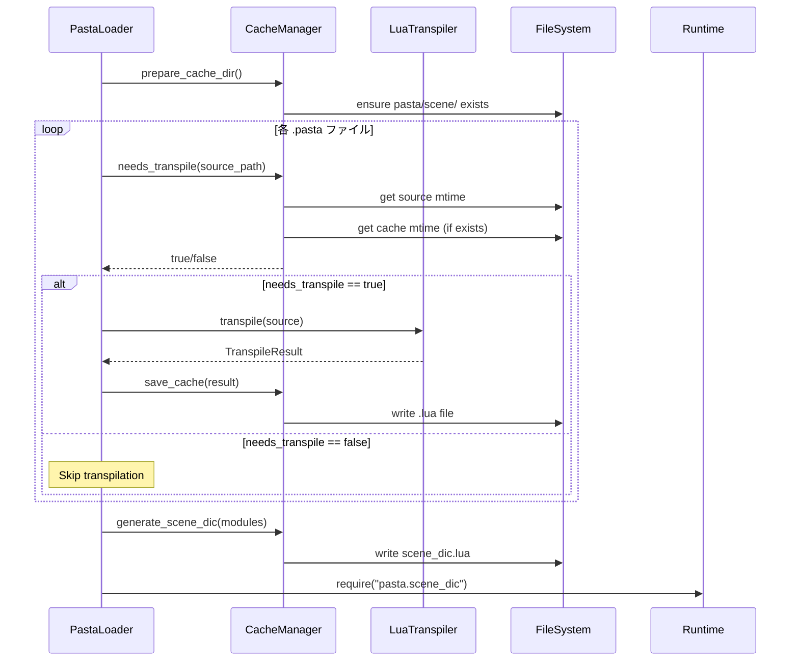

# Technical Design: pasta-lua-cache-transpiler

## Overview

**Purpose**: pasta_lua クレートにおいて、Pasta DSL から Lua へのトランスパイル結果をファイルシステムにキャッシュし、ファイル変更時のみ再トランスパイルを実行することで起動時間を大幅に短縮する。

**Users**: pasta_lua を利用する SHIORI 開発者が、開発・テスト時の反復的な起動サイクルを高速化するために利用する。

**Impact**: 現在の「毎回全ファイルトランスパイル」から「変更ファイルのみトランスパイル」へと動作が変更され、2回目以降の起動時間が短縮される。

### Goals
- ファイルタイムスタンプ比較による増分トランスパイル実現
- 全シーンモジュールを一括ロードする `scene_dic.lua` の自動生成
- Lua 標準のモジュール解決規則に準拠したディレクトリ構造

### Non-Goals
- `finalize_scene()` 関数の実体実装（呼び出しのみ）
- キャッシュの自動削除・ガベージコレクション
- リモートキャッシュ共有

---

## Architecture

### Existing Architecture Analysis

**現在のPastaLoader起動シーケンス**:
```
1. Phase 1: 設定ロード (PastaConfig::load)
2. Phase 2: ディレクトリ準備 - cache/lua を完全削除して再作成 ⚠️
3. Phase 3: ファイル検出 (discovery::discover_files)
4. Phase 4: 全ファイルトランスパイル (transpile_all) ⚠️
5. Phase 5: キャッシュ保存 (save_cache_files) - debug_mode時のみ
6. Phase 6: ランタイム初期化
```

**制約**:
- Phase 2 でキャッシュが毎回削除される → 増分トランスパイル不可
- Phase 4 で全ファイルが無条件にトランスパイルされる
- キャッシュ保存は debug_mode 依存

### Architecture Pattern & Boundary Map



**Architecture Integration**:
- **Selected pattern**: Repository パターン - CacheManager がキャッシュの読み書きを抽象化
- **Domain boundaries**: CacheManager は Loader と Transpiler の間に位置し、キャッシュライフサイクルを管理
- **Existing patterns preserved**: Result 型エラー伝播、tracing ログ、LoaderConfig 設定管理
- **New components rationale**: CacheManager は単一責任原則に基づき、キャッシュ管理ロジックを分離
- **Steering compliance**: レイヤー分離原則（loader → cache → transpiler → runtime）を維持

### Technology Stack

| Layer          | Choice / Version   | Role in Feature         | Notes        |
| -------------- | ------------------ | ----------------------- | ------------ |
| Backend        | Rust 2024 edition  | CacheManager 実装       | 既存スタック |
| Data / Storage | std::fs (Rust標準) | ファイルメタデータ、I/O | 追加依存なし |
| Runtime        | mlua (Lua VM)      | scene_dic.lua ロード    | 既存依存     |

---

## System Flows

### 増分トランスパイルフロー



**Key Decisions**:
- タイムスタンプ比較で変更検出（ハッシュ比較より高速）
- スキップ時は既存キャッシュを信頼（再検証なし）
- scene_dic.lua は毎回再生成（モジュールリスト変更検出の複雑さ回避）

---

## Requirements Traceability

| Requirement | Summary            | Components                | Interfaces                | Flows                    |
| ----------- | ------------------ | ------------------------- | ------------------------- | ------------------------ |
| 1           | ファイル変更検出   | CacheManager              | `needs_transpile()`       | 増分トランスパイルフロー |
| 2           | キャッシュ出力     | CacheManager              | `save_cache()`            | 増分トランスパイルフロー |
| 3           | scene_dic.lua生成  | CacheManager              | `generate_scene_dic()`    | 増分トランスパイルフロー |
| 4           | モジュール命名     | CacheManager              | `source_to_module_name()` | パス変換                 |
| 5           | ローダー統合       | PastaLuaRuntime           | `load_scene_dic()`        | ランタイム初期化         |
| 6           | エラーハンドリング | CacheManager, LoaderError | Error variants            | 全フロー                 |
| 7           | パス解決           | CacheManager              | `LoaderConfig` 参照       | 設定読み込み             |

---

## Components and Interfaces

| Component       | Domain/Layer | Intent                       | Req Coverage | Key Dependencies                      | Contracts |
| --------------- | ------------ | ---------------------------- | ------------ | ------------------------------------- | --------- |
| CacheManager    | loader/cache | キャッシュライフサイクル管理 | 1,2,3,4,6,7  | LoaderConfig (P0), std::fs (P0)       | Service   |
| PastaLoader     | loader       | 起動シーケンス統合           | 5,6          | CacheManager (P0), LuaTranspiler (P0) | -         |
| PastaLuaRuntime | runtime      | scene_dic.lua ロード         | 5            | mlua (P0)                             | Service   |
| LoaderError     | loader       | エラー型拡張                 | 6            | thiserror (P0)                        | -         |

### Cache Layer

#### CacheManager

| Field        | Detail                                                                         |
| ------------ | ------------------------------------------------------------------------------ |
| Intent       | キャッシュファイルのライフサイクル管理、タイムスタンプ比較、scene_dic.lua 生成 |
| Requirements | 1, 2, 3, 4, 6, 7                                                               |

**Responsibilities & Constraints**
- ファイルタイムスタンプ比較によるトランスパイル要否判定
- キャッシュファイルの保存（ディレクトリ階層再現）
- scene_dic.lua の自動生成
- 既存キャッシュの保持（削除しない）

**Dependencies**
- Inbound: PastaLoader — キャッシュ操作の呼び出し元 (P0)
- Outbound: std::fs — ファイルシステム操作 (P0)
- Outbound: LoaderConfig — 出力ディレクトリパス取得 (P0)

**Contracts**: Service [x] / API [ ] / Event [ ] / Batch [ ] / State [ ]

##### Service Interface

```rust
/// キャッシュ管理サービス
pub struct CacheManager {
    base_dir: PathBuf,
    cache_dir: PathBuf,
}

impl CacheManager {
    /// CacheManager を初期化
    /// 
    /// # Arguments
    /// * `base_dir` - プロジェクトルートディレクトリ
    /// * `output_dir` - キャッシュ出力ディレクトリ（LoaderConfig.transpiled_output_dir）
    pub fn new(base_dir: PathBuf, output_dir: &str) -> Self;

    /// キャッシュディレクトリを準備（既存ファイルは保持）
    /// 
    /// # Returns
    /// * `Ok(())` - ディレクトリ準備完了
    /// * `Err(LoaderError::CacheDirectoryError)` - ディレクトリ作成失敗
    pub fn prepare_cache_dir(&self) -> Result<(), LoaderError>;

    /// ソースファイルがトランスパイル必要か判定
    /// 
    /// # Arguments
    /// * `source_path` - Pasta ソースファイルパス
    /// 
    /// # Returns
    /// * `Ok(true)` - トランスパイル必要（ソースが新しい or キャッシュなし）
    /// * `Ok(false)` - トランスパイル不要（キャッシュが新しい）
    /// * `Err(LoaderError::MetadataError)` - メタデータ取得失敗
    pub fn needs_transpile(&self, source_path: &Path) -> Result<bool, LoaderError>;

    /// トランスパイル結果をキャッシュに保存
    /// 
    /// # Arguments
    /// * `source_path` - 元のソースファイルパス
    /// * `lua_code` - トランスパイル済み Lua コード
    /// 
    /// # Returns
    /// * `Ok(module_name)` - 保存成功、モジュール名を返す
    /// * `Err(LoaderError::CacheWriteError)` - 書き込み失敗
    pub fn save_cache(
        &self, 
        source_path: &Path, 
        lua_code: &str
    ) -> Result<String, LoaderError>;

    /// scene_dic.lua を生成
    /// 
    /// # Arguments
    /// * `module_names` - 全モジュール名のリスト
    /// 
    /// # Returns
    /// * `Ok(path)` - 生成成功、ファイルパスを返す
    /// * `Err(LoaderError::SceneDicGenerationError)` - 生成失敗
    pub fn generate_scene_dic(
        &self, 
        module_names: &[String]
    ) -> Result<PathBuf, LoaderError>;

    /// ソースパスからモジュール名を導出
    /// 
    /// # Example
    /// `dic/baseware/system.pasta` → `pasta.scene.baseware.system`
    pub fn source_to_module_name(&self, source_path: &Path) -> String;

    /// ソースパスからキャッシュパスを導出
    /// 
    /// # Example
    /// `dic/baseware/system.pasta` → `{cache_dir}/pasta/scene/baseware/system.lua`
    pub fn source_to_cache_path(&self, source_path: &Path) -> PathBuf;
}
```

- Preconditions: `base_dir` が存在すること
- Postconditions: キャッシュファイルが正しいパスに保存されること
- Invariants: モジュール名は常に `pasta.scene.` プレフィックスを持つ

**Implementation Notes**
- Integration: PastaLoader::load_with_config から呼び出し、Phase 2/4/5 で利用
- Validation: ソースファイル存在確認、書き込み権限確認
- Risks: ファイルシステム権限エラー → LoaderError で伝播

---

### Runtime Layer

#### PastaLuaRuntime (修正)

| Field        | Detail                             |
| ------------ | ---------------------------------- |
| Intent       | scene_dic.lua の自動ロード機能追加 |
| Requirements | 5                                  |

**Responsibilities & Constraints**
- 初期化時に scene_dic.lua を require
- ロード失敗時の適切なエラー報告

**Dependencies**
- Inbound: PastaLoader — ランタイム初期化 (P0)
- Outbound: mlua — Lua VM (P0)
- Outbound: CacheManager — scene_dic.lua パス取得 (P1)

**Contracts**: Service [x] / API [ ] / Event [ ] / Batch [ ] / State [ ]

##### Service Interface (追加メソッド)

```rust
impl PastaLuaRuntime {
    /// scene_dic.lua をロードしてシーンを初期化
    /// 
    /// # Arguments
    /// * `scene_dic_path` - scene_dic.lua のパス
    /// 
    /// # Returns
    /// * `Ok(())` - 全シーンロード成功
    /// * `Err(RuntimeError::SceneLoadError)` - シーンロード失敗
    pub fn load_scene_dic(&self, scene_dic_path: &Path) -> Result<(), RuntimeError>;
}
```

**Implementation Notes**
- Integration: PastaLoader Phase 6 でランタイム初期化後に呼び出し
- Validation: scene_dic.lua の存在確認、Lua 構文検証
- Risks: finalize_scene() 未実装時のエラー → 明確なエラーメッセージ

---

### Error Types

#### LoaderError (拡張)

```rust
#[derive(Debug, thiserror::Error)]
pub enum LoaderError {
    // 既存バリアント...

    /// キャッシュディレクトリ操作エラー
    #[error("Failed to prepare cache directory: {path}")]
    CacheDirectoryError {
        path: PathBuf,
        #[source]
        source: std::io::Error,
    },

    /// ファイルメタデータ取得エラー
    #[error("Failed to get file metadata: {path}")]
    MetadataError {
        path: PathBuf,
        #[source]
        source: std::io::Error,
    },

    /// キャッシュ書き込みエラー
    #[error("Failed to write cache file: {path}")]
    CacheWriteError {
        path: PathBuf,
        #[source]
        source: std::io::Error,
    },

    /// scene_dic.lua 生成エラー
    #[error("Failed to generate scene_dic.lua: {reason}")]
    SceneDicGenerationError {
        reason: String,
        #[source]
        source: Option<std::io::Error>,
    },

    /// 部分的トランスパイル失敗
    #[error("Partial transpilation failure: {succeeded} succeeded, {failed} failed")]
    PartialTranspileError {
        succeeded: usize,
        failed: usize,
        failures: Vec<TranspileFailure>,
    },
}

#[derive(Debug)]
pub struct TranspileFailure {
    pub source_path: PathBuf,
    pub error: String,
}
```

---

## Data Models

### Domain Model

**CacheEntry（概念モデル）**:
- ソースパス: Pasta ファイルの絶対パス
- キャッシュパス: Lua キャッシュファイルの絶対パス
- モジュール名: Lua require 用の識別子（例: `pasta.scene.baseware.system`）
- 状態: Fresh / Stale / Missing

**scene_dic.lua（生成物）**:
- ヘッダーコメント（自動生成マーカー）
- require 文リスト（アルファベット順）
- finalize_scene() 呼び出し

### Logical Data Model

**パス変換規則**:
```
ソースパス: {base_dir}/dic/{subdir}.../{name}.pasta
    ↓ CacheManager::source_to_cache_path
キャッシュパス: {cache_dir}/pasta/scene/{subdir}.../{name}.lua
    ↓ CacheManager::source_to_module_name  
モジュール名: pasta.scene.{subdir}.....{name}
```

**例**:
| ソースパス                        | キャッシュパス                          | モジュール名                        |
| --------------------------------- | --------------------------------------- | ----------------------------------- |
| `dic/system.pasta`                | `pasta/scene/system.lua`                | `pasta.scene.system`                |
| `dic/baseware/greet.pasta`        | `pasta/scene/baseware/greet.lua`        | `pasta.scene.baseware.greet`        |
| `dic/dialog/npc/shopkeeper.pasta` | `pasta/scene/dialog/npc/shopkeeper.lua` | `pasta.scene.dialog.npc.shopkeeper` |

### Data Contracts & Integration

**scene_dic.lua 生成フォーマット**:
```lua
-- Auto-generated by pasta_lua CacheManager
-- Do not edit manually
-- Generated at: 2026-01-22T12:00:00Z

require("pasta.scene.baseware.greet")
require("pasta.scene.baseware.system")
require("pasta.scene.dialog.main")
-- ... 全モジュールをアルファベット順に列挙

require("pasta").finalize_scene()
```

---

## Error Handling

### Error Strategy

| エラー種別               | 対応戦略                               | リカバリー                 |
| ------------------------ | -------------------------------------- | -------------------------- |
| メタデータ取得失敗       | 当該ファイルをトランスパイル対象とする | 次回起動時に再試行         |
| キャッシュ書き込み失敗   | エラーログ出力、処理継続               | サマリーで報告             |
| scene_dic.lua 生成失敗   | 致命的エラーとして停止                 | 手動で原因調査             |
| 部分的トランスパイル失敗 | 成功分のみロード、失敗リスト報告       | 問題ファイル修正後に再起動 |

### Error Categories and Responses

**System Errors**:
- I/O エラー → `LoaderError::CacheWriteError` で伝播
- 権限エラー → ログに詳細出力、処理継続

**Business Logic Errors**:
- トランスパイル失敗 → `PartialTranspileError` で失敗リスト付きサマリー

### Monitoring

- `tracing::info!` - トランスパイル統計（スキップ数、成功数、失敗数）
- `tracing::warn!` - 孤立キャッシュファイル検出時
- `tracing::error!` - 致命的エラー発生時

---

## Testing Strategy

### Unit Tests
- `CacheManager::needs_transpile` - ソースがキャッシュより新しい場合 → true
- `CacheManager::needs_transpile` - キャッシュがソースより新しい場合 → false
- `CacheManager::needs_transpile` - キャッシュが存在しない場合 → true
- `CacheManager::source_to_module_name` - 各種パスパターンの変換確認
- `CacheManager::generate_scene_dic` - 出力フォーマット検証

### Integration Tests
- 増分トランスパイル動作: ファイル変更 → 該当ファイルのみ再トランスパイル
- scene_dic.lua ロード: ランタイム初期化後に全シーンが利用可能
- 部分失敗シナリオ: 1ファイル失敗時も他ファイルは正常ロード

#### Loader テスト修正（破壊的変更対応）

**影響を受けるテスト**: `loader_integration_test.rs::test_cache_cleared_on_load`

**現在の動作**: 
- `prepare_directories` が毎回 `remove_dir_all` でキャッシュディレクトリをクリア
- テストが「古いキャッシュファイルが削除される」ことを検証

**新動作（本仕様適用後）**:
- `prepare_directories` は削除を行わず、ディレクトリ存在確認のみ
- キャッシュファイルは増分更新で保持

**修正方針**:
1. **テストケース名変更**: `test_cache_cleared_on_load` → `test_cache_incremental_update`
2. **テスト内容書き換え**:
   ```rust
   // Before: 古いキャッシュが削除されることを検証
   assert!(!base_dir.join("profile/pasta/cache/lua/old_cache.lua").exists());
   
   // After: 古いキャッシュが保持されることを検証
   assert!(base_dir.join("profile/pasta/cache/lua/old_cache.lua").exists());
   ```
3. **setup での明示的クリア**: 各テストケースで clean state が必要な場合、テスト冒頭で手動削除
   ```rust
   let cache_dir = base_dir.join("profile/pasta/cache/lua");
   if cache_dir.exists() {
       std::fs::remove_dir_all(&cache_dir).unwrap();
   }
   ```

**影響範囲**: `loader_integration_test.rs` の 1 テストケースのみ

### E2E Tests
- 完全な起動シーケンス: 設定 → キャッシュ → トランスパイル → ランタイム
- 2回目起動の高速化確認: 変更なし → トランスパイルスキップ

---

## Performance & Scalability

### Target Metrics

| 指標                             | 目標値                 | 測定方法                   |
| -------------------------------- | ---------------------- | -------------------------- |
| 初回起動時間                     | 現行同等               | ベンチマーク               |
| 2回目以降起動時間                | 現行の50%以下          | ベンチマーク（変更なし時） |
| タイムスタンプ比較オーバーヘッド | 1ファイルあたり1ms以下 | プロファイリング           |

### Optimization Techniques
- ファイルメタデータのみ取得（ファイル内容読み込み回避）
- ディレクトリ作成は初回のみ（`create_dir_all` の冪等性活用）
- scene_dic.lua はメモリ上で構築後に一括書き込み
