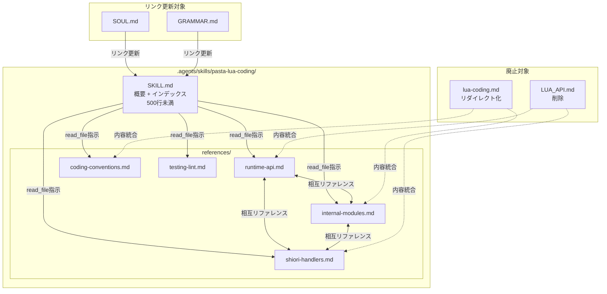
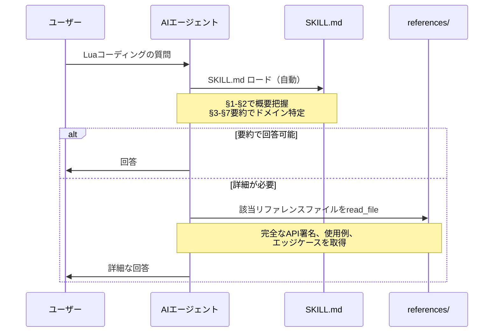

# Design Document: pasta-lua-skill-restructure

## Overview

**Purpose**: pasta-lua-codingスキルのSKILL.md（588行）を500行未満にコンパクト化し、詳細APIリファレンスを`references/`サブディレクトリに分離する。references/を唯一の権威的Lua APIリファレンスとし、従来の権威ドキュメント（LUA_API.md、steering/lua-coding.md）を統合・廃止する。

**Users**: AIエージェント（GitHub Copilot等）およびゴースト開発者が、pasta_luaランタイムのLuaスクリプト開発時に利用する。

**Impact**: 既存のSKILL.md単体構成から、SKILL.md（概要・インデックス）+ references/（詳細リファレンス）の2層構成に変更。LUA_API.mdを削除し、steering/lua-coding.mdをリダイレクトに置換する。

### Goals
- SKILL.mdを500行未満に圧縮し、AIエージェントのコンテキスト効率を向上
- references/に権威的かつ自己完結的なリファレンスを配置
- 情報の二重管理を解消し、ドキュメント更新の同期コストを排除

### Non-Goals
- Pasta DSL文法に関するスキル（pasta-ghost-authoring）の変更
- Rustクレート（pasta_lua, pasta_core等）のコード変更
- SKILL.mdのYAMLフロントマター（`name`, `description`フィールド）の変更
- references/以外のスキル拡張パターン（例: examples/, templates/）の導入

## Architecture

> 詳細な調査結果は`research.md`を参照。

### Existing Architecture Analysis

現行構成は以下の3層に分散:

```
.agents/skills/pasta-lua-coding/SKILL.md  (588行, 要約版)
crates/pasta_lua/LUA_API.md               (1160行, 権威APIリファレンス)
.kiro/steering/lua-coding.md              (695行, コーディング規約)
```

**課題**:
- SKILL.md（588行）が500行制約を超過
- LUA_API.mdとlua-coding.mdが権威ドキュメントだが、SKILL.mdはその部分的要約であり同期コストが発生
- steeringファイル（lua-coding.md）は全タスクで常時ロードされ、Lua非関連タスクのコンテキストを浪費

### Architecture Pattern & Boundary Map



**Architecture Integration**:
- **Selected pattern**: 2層スキル構成（SKILL.md = ハブ、references/ = リーフ）
- **Domain boundaries**: 5つのリファレンスファイルがそれぞれ独立したドメインを担当。ファイル間はクロスリファレンスリンクで接続
- **Existing patterns preserved**: YAML frontmatterの形式、SKILL.md本文の§1/§2構成
- **New components rationale**: references/は情報密度の最適化とコンテキスト効率のために導入。単体スキルフォルダを別リポジトリにコピーして使う運用と整合
- **Steering compliance**: SKILL.md自己完結性を維持（references/含む）。steeringからの移行で常時ロードコストを排除

### Technology Stack

| Layer | Choice / Version | Role in Feature | Notes |
|-------|------------------|-----------------|-------|
| ドキュメント形式 | Markdown (GFM) | 全ファイルの記述言語 | GitHub Flavored Markdown準拠 |
| フロントマター | YAML | SKILL.mdのメタデータ | VS Code Copilot Skills自動検出 |
| リンク形式 | 相対パスMarkdownリンク | ファイル間クロスリファレンス | GFMアンカー（日本語見出し対応） |

## System Flows



## Requirements Traceability

| Requirement | Summary | Components | Flows |
|-------------|---------|------------|-------|
| 1.1 | SKILL.md 500行未満 | SKILL.md | — |
| 1.2 | YAML frontmatter維持 | SKILL.md | — |
| 2.1 | references/ディレクトリ配置 | references/ | — |
| 2.2 | ドメイン別Markdownファイル | 5リファレンスファイル | — |
| 2.3 | Referencesインデックスセクション | SKILL.md §References | ロードフロー |
| 2.4 | リファレンスの自己完結性 | 5リファレンスファイル | — |
| 3.1 | Runtime APIファイル | runtime-api.md | — |
| 3.2 | Internal Modulesファイル | internal-modules.md | — |
| 3.3 | SHIORI Handlersファイル | shiori-handlers.md | — |
| 3.4 | Coding Conventionsファイル | coding-conventions.md | — |
| 3.5 | Testing & Lintファイル | testing-lint.md | — |
| 4.1 | 完全なAPIシグネチャ | 5リファレンスファイル | — |
| 4.2 | 実用例の充実 | 5リファレンスファイル | — |
| 4.3 | 相互リファレンスリンク | 5リファレンスファイル | — |
| 4.4 | エッジケース・注意事項 | 5リファレンスファイル | — |
| 5.1 | §1 Purpose維持 | SKILL.md §1 | — |
| 5.2 | §2 Quick Reference維持 | SKILL.md §2 | — |
| 5.3 | §3-§7要約 + リファレンスリンク | SKILL.md §3-§7 | ロードフロー |
| 5.4 | Referencesセクション | SKILL.md §References | ロードフロー |
| 6.1 | LUA_API.md削除 | LUA_API.md | — |
| 6.2 | lua-coding.mdリダイレクト化 | lua-coding.md | — |
| 6.3 | SOUL.mdリンク更新 | SOUL.md | — |
| 6.4 | GRAMMAR.mdリンク更新 | GRAMMAR.md | — |

## Components and Interfaces

| Component | Domain | Intent | Req Coverage | Key Dependencies | Contracts |
|-----------|--------|--------|--------------|------------------|-----------|
| SKILL.md | Hub | 概要・インデックスとしてエージェントに全体像を提供 | 1.1, 1.2, 2.3, 5.1-5.4 | references/ (P1) | — |
| runtime-api.md | Runtime | Rust組み込みモジュールの完全APIリファレンス | 2.2, 2.4, 3.1, 4.1-4.4 | internal-modules.md (P2), shiori-handlers.md (P2) | — |
| internal-modules.md | Internal | pasta.*名前空間モジュールの完全リファレンス | 2.2, 2.4, 3.2, 4.1-4.4 | runtime-api.md (P2), shiori-handlers.md (P2) | — |
| shiori-handlers.md | SHIORI | イベントハンドラ・ディスパッチの完全リファレンス | 2.2, 2.4, 3.3, 4.1-4.4 | internal-modules.md (P2), runtime-api.md (P2) | — |
| coding-conventions.md | Conventions | Luaコーディング規約の完全リファレンス | 2.2, 2.4, 3.4, 4.1-4.4 | — | — |
| testing-lint.md | Quality | テスト・静的解析の完全リファレンス | 2.2, 2.4, 3.5, 4.1-4.4 | runtime-api.md (P2) | — |
| LUA_API.md (削除) | Legacy | 旧権威APIリファレンスの廃止 | 6.1 | — | — |
| lua-coding.md (リダイレクト) | Legacy | 旧コーディング規約のリダイレクト化 | 6.2 | — | — |
| SOUL.md (リンク更新) | CrossRef | LUA_API.mdリンクの更新 | 6.3 | — | — |
| GRAMMAR.md (リンク更新) | CrossRef | LUA_API.mdリンクの更新 | 6.4 | — | — |

### Hub Layer

#### SKILL.md

| Field | Detail |
|-------|--------|
| Intent | スキルのエントリーポイントとして概要とリファレンスへのナビゲーションを提供 |
| Requirements | 1.1, 1.2, 2.3, 5.1, 5.2, 5.3, 5.4 |

**Responsibilities & Constraints**
- YAML frontmatter（`name`, `description`, `metadata`）を現行のまま維持
- §1 Purpose & Prerequisites: 現行内容をそのまま維持（~30行）
- §2 Quick Reference: 現行内容をそのまま維持（~50行）
- §3-§7: 各セクション3-5行の要約に圧縮し、対応するリファレンスファイルへのリンクを付与
- §References: リファレンスインデックスセクションを新設
- 合計行数: 500行未満

**SKILL.md構成設計**:

```
---
(YAML frontmatter — 現行維持)
---

# Pasta Lua Coding Skill

## §1 Purpose & Prerequisites    ← 現行維持（~30行）
## §2 Quick Reference            ← 現行維持（~50行）

## §3 Coding Conventions         ← 要約（3-5行）+ リンク
## §4 Runtime API                ← 要約（3-5行）+ リンク
## §5 Internal Modules           ← 要約（3-5行）+ リンク
## §6 SHIORI Handlers            ← 要約（3-5行）+ リンク
## §7 Testing & Lint             ← 要約（3-5行）+ リンク

## References                    ← 新設インデックス（~15行）
```

**§3-§7 要約セクションのテンプレート**:

各セクションは以下の形式に統一する:

```markdown
## §N セクション名

（3-5行の概要。主要なキーワード・API名・モジュール名を含め、エージェントが
このセクションの詳細を必要とするかどうかを判断できるようにする）

> 📖 詳細: [references/ファイル名.md](references/ファイル名.md)
```

**Referencesインデックスセクション**:

```markdown
## References

本スキルの詳細リファレンス。必要に応じて `read_file` でロードすること。

| ファイル | 概要 |
|---------|------|
| [references/runtime-api.md](references/runtime-api.md) | Rust組み込みモジュール（@pasta_search, @pasta_persistence等）の完全API |
| [references/internal-modules.md](references/internal-modules.md) | pasta.*名前空間（STORE, ACT, SCENE, WORD等）の完全リファレンス |
| [references/shiori-handlers.md](references/shiori-handlers.md) | SHIORIイベントハンドラ（REG, RES, イベント一覧, 仮想ディスパッチャ） |
| [references/coding-conventions.md](references/coding-conventions.md) | 命名規約、モジュール構造、クラス設計、型注釈、エラーハンドリング |
| [references/testing-lint.md](references/testing-lint.md) | lua_test, テストファイル規約, 決定論的テスト, luacheck |
```

**想定行数**: ~20 (frontmatter) + ~30 (§1) + ~50 (§2) + ~50 (§3-§7 要約×5) + ~20 (References) = **~170-200行**

**Implementation Notes**
- §1/§2は既存SKILL.mdからそのままコピー
- §3-§7は既存の詳細内容を3-5行に圧縮。主要キーワードを残してエージェントの判断を支援
- Referencesセクションのテーブルに`read_file`ロード指示を含める
- 現行の「（情報ソース: ...）」フッターは不要になるため削除

### References Layer

5つのリファレンスファイルに共通する設計規約:

**共通構造**:

```markdown
# タイトル

（導入: このファイルの対象ドメインと前提知識）

## セクション1
### サブセクション
...

## 関連リファレンス
- [リンク先](ファイル名.md#アンカー) — 参照理由の一行説明
```

**共通規約**:
- 各ファイルは自己完結的: SKILL.mdのコンテキストなしで独立して読める
- ファイル冒頭に1-2行の導入（対象ドメインと前提知識の説明）
- ファイル末尾に「関連リファレンス」セクションで他ファイルへのクロスリファレンスを配置
- APIシグネチャは完全な形式（全パラメータ、戻り値型、エラー条件）
- 使用例は実践的なコード（最小限のスケルトンではなく、実際のユースケース）
- エッジケース・注意事項は該当APIの直後に記載

#### runtime-api.md

| Field | Detail |
|-------|--------|
| Intent | Rust組み込みモジュール（`@pasta_search`, `@pasta_persistence`, `@pasta_config`, `@pasta_sakura_script`, `@enc`）とmlua-stdlibモジュールの完全APIリファレンス |
| Requirements | 3.1, 4.1, 4.2, 4.3, 4.4 |

**Responsibilities & Constraints**
- 現行SKILL.md §4の内容を詳細版に展開
- LUA_API.md §2-§6, §8の内容を統合・リッチ化
- 各モジュールの完全なAPIシグネチャ（パラメータ型、戻り値型、エラー条件）
- require方法の違い（直接 vs pcall保護）の明示
- pasta.toml設定との対応関係

**内容構成**:

```
# Runtime API リファレンス
## @pasta_search
  ### API
  ### 使用例
  ### フォールバック戦略
  ### テスト用セレクター
## @pasta_persistence
  ### API
  ### pasta.toml設定
  ### 使用例
  ### エッジケース
## @pasta_config
  ### API
  ### pcall保護の理由
  ### 使用例
## @pasta_sakura_script
  ### API
  ### actor.talkテーブル設定
  ### 使用例
## @enc
  ### API
  ### プラットフォーム依存性
  ### 使用例
## mlua-stdlib モジュール
  ### @json / @yaml / @regex
  ### @assertions / @testing
  ### @env（無効モジュール）
## 関連リファレンス
```

**Dependencies**
- Outbound: internal-modules.md — ACTオブジェクトからの`act:word()`が@pasta_searchを利用 (P2)
- Outbound: shiori-handlers.md — SHIORIハンドラ内でのAPI利用例 (P2)

**想定行数**: 300-400行

#### internal-modules.md

| Field | Detail |
|-------|--------|
| Intent | pasta.*名前空間のLuaモジュール（STORE, ACT, SCENE, WORD, GLOBAL, SAVE, finalize_scene）の完全リファレンス |
| Requirements | 3.2, 4.1, 4.2, 4.3, 4.4 |

**Responsibilities & Constraints**
- 現行SKILL.md §5の内容を詳細版に展開
- lua-coding.md §6の内容を統合・リッチ化
- LUA_API.md §7（finalize_scene）の内容を統合
- ACTオブジェクトのメソッド一覧を完全なシグネチャで記述
- STORE, SCENE, WORD, GLOBALの公開APIを網羅

**内容構成**:

```
# Internal Modules リファレンス
## STORE パターン
  ### フィールド一覧
  ### reset()
  ### 循環参照回避の原則
## ACT オブジェクト
  ### init_scene
  ### トーク系メソッド（talk, raw_script）
  ### 表示制御メソッド（surface, wait, newline, clear）
  ### スポット操作（set_spot, clear_spot）
  ### 検索・呼び出し（word, call）
  ### yield
  ### フィールド一覧
## SCENE モジュール
  ### create_scene
  ### search
  ### co_exec
  ### DSL→Luaブリッジ
## WORD モジュール
  ### ファクトリ関数
  ### ビルダーパターン
  ### 大量投入の使用例
## GLOBAL モジュール
## SAVE モジュール
## finalize_scene
## 関連リファレンス
```

**Dependencies**
- Inbound: runtime-api.md — @pasta_searchの内部利用 (P2)
- Outbound: shiori-handlers.md — ACTオブジェクトのreqフィールド (P2)

**想定行数**: 250-350行

#### shiori-handlers.md

| Field | Detail |
|-------|--------|
| Intent | SHIORIイベントハンドラシステム（REG, RES, イベント一覧, フォールバック, 仮想ディスパッチャ）の完全リファレンス |
| Requirements | 3.3, 4.1, 4.2, 4.3, 4.4 |

**Responsibilities & Constraints**
- 現行SKILL.md §6の内容を詳細版に展開
- LUA_API.md §9の内容を統合・リッチ化
- 主要SHIORIイベントの完全な一覧（reference[N]の意味を含む）
- フォールバックチェーン（REG → SCENE.search → 204 No Content）の詳細説明
- 仮想ディスパッチャ（OnTalk/OnHour自動発行）の設定と動作

**内容構成**:

```
# SHIORI Handlers リファレンス
## REG テーブル登録
  ### req パラメータ
  ### 登録パターン
## RES レスポンス生成
  ### API一覧
  ### 使用例
## 主要SHIORIイベント一覧
  ### 起動・終了系
  ### マウス操作系
  ### 時間系
  ### ゴースト操作系
  ### その他
## シーン関数フォールバック
  ### フォールバックチェーン
  ### DSLシーンとの連携
## 仮想ディスパッチャ
  ### OnTalk自動発行
  ### OnHour時報
  ### pasta.toml設定
## 関連リファレンス
```

**Dependencies**
- Inbound: internal-modules.md — ACTオブジェクト、SCENE.search (P2)
- Inbound: runtime-api.md — RES応答生成 (P2)

**想定行数**: 250-350行

#### coding-conventions.md

| Field | Detail |
|-------|--------|
| Intent | pasta_luaにおけるLuaスクリプトの命名規約、モジュール構造、クラス設計パターン、型注釈、エラーハンドリングの完全リファレンス |
| Requirements | 3.4, 4.1, 4.2, 4.3, 4.4 |

**Responsibilities & Constraints**
- 現行SKILL.md §3の内容を詳細版に展開
- lua-coding.md §1-§5の内容を統合・リッチ化
- 命名規約の禁止パターン・許可パターンを網羅
- MODULE/MODULE_IMPL分離パターンの詳細解説
- EmmyLua型注釈の実践例

**内容構成**:

```
# Coding Conventions リファレンス
## 命名規約
  ### 基本命名規則
  ### 禁止パターン
  ### 日本語識別子
## モジュール構造
  ### 標準モジュール構造
  ### モジュール命名
  ### 循環参照回避（STOREパターン）
## クラス設計パターン
  ### MODULE/MODULE_IMPL分離
  ### コンストラクタ
  ### シングルトン
  ### 継承
  ### 禁止パターン
## EmmyLua型注釈
  ### @module / @class / @field
  ### @param / @return
  ### 禁止（@vararg）
## エラーハンドリング
  ### ガードクローズ
  ### pcall
  ### nilチェック
  ### 禁止パターン
## 関連リファレンス
```

**Dependencies**
- なし（他ファイルから独立した規約ドキュメント）

**想定行数**: 300-400行

#### testing-lint.md

| Field | Detail |
|-------|--------|
| Intent | lua_testフレームワーク、テストファイル規約、決定論的テスト手法、luacheck設定の完全リファレンス |
| Requirements | 3.5, 4.1, 4.2, 4.3, 4.4 |

**Responsibilities & Constraints**
- 現行SKILL.md §7の内容を詳細版に展開
- lua-coding.md §7の内容を統合・リッチ化
- lua_testのAPI（describe, test, expect, マッチャー一覧）
- テストファイルの初期化パターン（init.luaでの登録・pcall実行）
- 決定論的テストの設定・リセット手順
- luacheckの設定例と実行方法

**内容構成**:

```
# Testing & Lint リファレンス
## lua_test フレームワーク
  ### API（describe, test, expect）
  ### マッチャー一覧
  ### 使用例
## テストファイル規約
  ### 命名規則
  ### init.luaでの登録
  ### pcall実行パターン
## 決定論的テスト
  ### set_scene_selector / set_word_selector
  ### テスト後のリセット
  ### 使用例
## luacheck 設定
  ### .luacheckrc設定例
  ### globals設定
  ### 実行コマンド
## 関連リファレンス
```

**Dependencies**
- Outbound: runtime-api.md — @pasta_searchのset_*_selector (P2)

**想定行数**: 120-180行

### Legacy Layer

#### LUA_API.md (削除)

| Field | Detail |
|-------|--------|
| Intent | references/への内容統合完了後に削除 |
| Requirements | 6.1 |

**Responsibilities & Constraints**
- references/の全5ファイルが完成した後に削除を実行
- 削除前にreferences/内の各ファイルがLUA_API.mdの全セクション内容をカバーしていることを検証

#### lua-coding.md (リダイレクト化)

| Field | Detail |
|-------|--------|
| Intent | steeringファイルをスキルへのリダイレクトに置換 |
| Requirements | 6.2 |

**Responsibilities & Constraints**
- ファイル内容を以下のリダイレクト文に置換:

```markdown
# Luaコーディング規約

> Luaコーディング時は **pasta-lua-coding** スキルを参照してください。
> 詳細リファレンス: `.agents/skills/pasta-lua-coding/references/`
```

- ファイル自体は削除しない（steeringとして存在し続けるため、コンテキストロード時に他の場所を探す手間を排除）

### CrossRef Layer

#### SOUL.md (リンク更新)

| Field | Detail |
|-------|--------|
| Intent | LUA_API.mdへのリンクをスキルリファレンスへ変更 |
| Requirements | 6.3 |

**Responsibilities & Constraints**
- Line 24の変更:
  - **Before**: `- [pasta_lua/LUA_API.md](crates/pasta_lua/LUA_API.md) - Lua APIリファレンス`
  - **After**: `- [pasta-lua-coding skill](.agents/skills/pasta-lua-coding/SKILL.md) - Lua APIリファレンス（references/に詳細）`

#### GRAMMAR.md (リンク更新)

| Field | Detail |
|-------|--------|
| Intent | LUA_API.mdへのリンクをスキルリファレンスへ変更 |
| Requirements | 6.4 |

**Responsibilities & Constraints**
- Line 753の変更:
  - **Before**: `- [pasta_lua/LUA_API.md](crates/pasta_lua/LUA_API.md) - Lua APIリファレンス`
  - **After**: `- [pasta-lua-coding skill](.agents/skills/pasta-lua-coding/SKILL.md) - Lua APIリファレンス（references/に詳細）`
