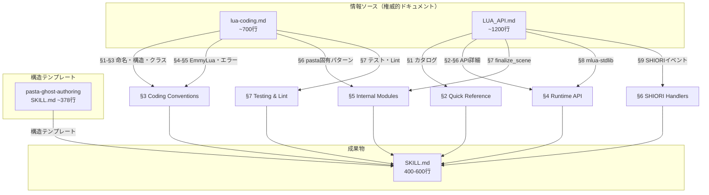

# Design Document

## Overview

**Purpose**: pasta.dll用Luaコード実装を支援するVS Code Copilot Skill（SKILL.md）を作成する。LLMがpasta_luaランタイム固有のAPI・コーディング規約・パターンに準拠したLuaコードを正確に生成するための知識基盤を提供する。

**Users**: ゴースト開発者がLLMコーディングエージェント（GitHub Copilot等）を通じて、大量の単語辞書投入・カスタムイベントハンドラ作成・永続化データ操作等のLuaコード生成を依頼するシナリオで利用される。

**Impact**: 新規ファイル1つ（`.agents/skills/pasta-lua-coding/SKILL.md`）の追加のみ。既存コードへの変更なし。

### Goals
- pasta_luaランタイム固有APIの知識をLLMに提供し、正確なLuaコード生成を実現する
- 姉妹スキル `pasta-ghost-authoring`（DSL層）との明確な役割分離を確立する
- 別リポジトリへのコピーで単体動作する自己完結型スキルファイルを作成する

### Non-Goals
- 汎用Luaプログラミングの知識提供（LLMの既存知識で十分）
- Pasta DSL文法の再掲（姉妹スキルの担当範囲）
- pasta_dsl / pasta_core / pasta_shiori クレートの実装知識
- スキルファイル分割（Option B は不採用）

## Architecture

> 詳細な調査経緯は `research.md` を参照。

### Architecture Pattern & Boundary Map

本フィーチャーの成果物は単一のMarkdownドキュメントであり、ソフトウェアアーキテクチャは存在しない。以下では**ドキュメントアーキテクチャ**（セクション構成・情報フロー・圧縮方針）を定義する。



**役割境界**: 姉妹スキル `pasta-ghost-authoring` がPasta DSL文法（`.pasta`ファイルの記述）を担当し、本スキルがLuaランタイム層（DSL内Luaブロック・`scripts/`配下の独自Luaスクリプト）を担当する。

### Technology Stack

| Layer | Choice | Role in Feature | Notes |
|-------|--------|-----------------|-------|
| ドキュメント形式 | Markdown + YAML Frontmatter | SKILL.md ファイルフォーマット | VS Code Copilot Skill 標準形式 |
| 配布方式 | ファイルコピー | 別リポジトリへの展開 | `.agents/skills/pasta-lua-coding/` ディレクトリごとコピー |
| コンテキスト注入 | VS Code Copilot Skill 機構 | LLMへの自動コンテキスト提供 | YAML `description` の USE FOR フレーズでトリガー |

## Requirements Traceability

| Requirement | Summary | SKILL.md Section | 備考 |
|-------------|---------|------------------|------|
| Req 1 AC1 | ファイル配置 | — | ファイルパス自体で充足 |
| Req 1 AC2 | YAML Frontmatter | YAML Frontmatter | |
| Req 1 AC3 | トリガーフレーズ | YAML `description` | USE FOR / DO NOT USE FOR |
| Req 1 AC4 | 目的の明記 | §1 Purpose | |
| Req 1 AC5 | 自己完結性 | 全体設計原則 | 外部参照禁止 |
| Req 1 AC6 | 姉妹スキル分離 | §1 Purpose | |
| Req 1 AC7 | DSL vs Lua 判断基準 | §1 Purpose | |
| Req 1 AC8 | scripts/ 配置先 | §1 Purpose | |
| Req 2 AC1-7 | コーディング規約 | §3 Coding Conventions | |
| Req 2 AC8 | lua-coding.md整合性 | §3 注記 | 情報ソース明記 |
| Req 3 AC1-6 | ランタイムAPI | §4 Runtime API | |
| Req 3 AC7 | require使い分け | §4 Runtime API | |
| Req 3 AC8 | LUA_API.md整合性 | §4 注記 | 情報ソース明記 |
| Req 4 AC1-7 | 内部Luaモジュール | §5 Internal Modules | |
| Req 4 AC8 | DSL→Luaブリッジ | §5 Internal Modules | |
| Req 5 AC1-5 | SHIORIハンドラ | §6 SHIORI Handlers | |
| Req 6 AC1-4 | テスト・Lint | §7 Testing & Lint | |

## Components and Interfaces

成果物は単一ファイル（SKILL.md）のため、「コンポーネント」はドキュメント内のセクションを指す。

| Section | Layer | Intent | Req Coverage | 情報ソース | 目標行数 |
|---------|-------|--------|--------------|-----------|---------|
| YAML Frontmatter | メタデータ | スキルトリガー・識別 | 1.2, 1.3 | 姉妹スキル準拠 | ~15行 |
| §1 Purpose | 導入 | 目的・前提・役割分離・判断基準 | 1.4, 1.6, 1.7, 1.8 | requirements.md | ~30行 |
| §2 Quick Reference | 一覧 | API/モジュール凝縮一覧表 + ブリッジ基本形 | 3.1-3.7 (概要) | LUA_API.md §1 | ~40行 |
| §3 Coding Conventions | 規約 | 命名・構造・パターン・型注釈 | 2.1-2.8 | lua-coding.md §1-§5 | ~120行 |
| §4 Runtime API | API詳細 | Rust組み込みモジュールAPI | 3.1-3.8 | LUA_API.md §2-§6,§8 | ~120行 |
| §5 Internal Modules | 内部構造 | pasta.*名前空間モジュール群 | 4.1-4.8 | lua-coding.md §6 + ソース | ~105行 |
| §6 SHIORI Handlers | イベント | REG/RES/仮想ディスパッチャ | 5.1-5.5 | LUA_API.md §9 | ~80行 |
| §7 Testing & Lint | 品質 | lua_test/luacheck | 6.1-6.4 | lua-coding.md §7 | ~50行 |
| **合計** | | | | | **~555行** |

---

### YAML Frontmatter（~15行）

```yaml
---
name: pasta-lua-coding
description: >-
  pasta.dll Luaランタイム APIリファレンスとコーディング規約。
  ゴーストの scripts/ 配下のカスタムLuaスクリプトや、
  Pasta DSL内のLuaブロック実装を支援する。
  USE FOR: pasta lua, pasta_lua, Lua API, Luaスクリプト, scripts/,
  単語辞書一括投入, WORD.create, イベントハンドラ, REG, RES,
  永続化, @pasta_persistence, save, @pasta_search,
  @pasta_config, @pasta_sakura_script, @enc,
  ACT, SCENE, STORE, GLOBAL, SAVE, lua_test, luacheck,
  pasta lua coding, pasta runtime API.
  DO NOT USE FOR: Pasta DSL文法, .pastaファイル編集,
  pasta_dsl crate, pasta_core crate, Rustクレート実装,
  汎用Luaプログラミング, SHIORIプロトコル実装.
metadata:
  author: ekicyou
  version: "1.0.0"
---
```

**設計判断**:
- `USE FOR` は姉妹スキルと**重複しない**フレーズを選定
- `DO NOT USE FOR` に「Pasta DSL文法」「.pastaファイル編集」を明記し、姉妹スキルへの振り分けを誘導
- `DO NOT USE FOR` に「汎用Luaプログラミング」を明記し、スコープ境界を明確化

---

### §1 Purpose & Prerequisites（~30行）

**Content**:
1. 目的文（自然言語→pasta_lua準拠Luaコード変換サポート）
2. 対象ドメイン（scripts/配下のカスタムLuaスクリプト、DSL内Luaブロック）
3. 前提条件（ゴーストプロジェクト存在、pasta.toml・dic/・scripts/ が揃っている）
4. 姉妹スキルとの役割分離（DSL層 vs Lua層）
5. DSL vs Lua 判断基準（Req 1 AC7）: DSLでは冗長/不可能なケース一覧
6. scripts/ フォルダの説明（Req 1 AC8）: 配置先・main.luaエントリーポイント
7. 情報ソース明記（lua-coding.md, LUA_API.md が権威的ドキュメント）
8. 自己完結性宣言

**DSL vs Lua 判断基準の定義**:

| ケース | 推奨 | 理由 |
|--------|------|------|
| 数個の単語定義 | DSL (`＠単語：値1、値2`) | 宣言的で簡潔 |
| 数十〜数百件の単語一括投入 | Lua (`WORD.create_*`) | ループ/外部データ読み込みが必要 |
| 基本的なシーン定義 | DSL (`＊シーン名`) | 可読性が高い |
| 条件分岐を含む複雑なロジック | Lua (シーン関数) | DSLの制御構文は限定的 |
| カスタムSHIORIイベント処理 | Lua (REGテーブル) | DSLではイベントハンドラを直接定義不可 |
| 外部データ（JSON/YAML）の読み込み| Lua (`@json`/`@yaml`) | DSLには外部ファイル操作機能なし |

---

### §2 Quick Reference（~40行）

**Content**: モジュールカタログ表（LUA_API.md §1 を転記・圧縮）+ DSL→Luaブリッジ基本形

3つのテーブルで構成:

1. **Rust組み込みモジュール**（`@pasta_*` + `@enc`）: モジュール名・用途・requireパターン（直接/pcall）
2. **内部Luaモジュール**（`pasta.*`）: モジュール名・用途・主要API
3. **mlua-stdlib統合モジュール**（`@json`, `@yaml`, `@regex`, `@assertions`, `@testing`）: モジュール名・用途・有効/無効

**§2 末尾に「DSL→Luaブリッジ基本形」コード例（~6行）を追加**（Validation Issue 1 対応）:

```lua
-- DSL内 ```lua ブロックから呼ばれるシーン関数の定型
function SCENE.func_name(act)
    local save, var = act:init_scene(SCENE)  -- 必須: save/var を取得
    act:talk(act.さくら.actor, "セリフ")    -- アクター名でトーク
    act:yield()                               -- トークンをyield
end
```

このコード例により、LLMが §5 詳細に進む前にブリッジパターンの基本形を取得できる。

**設計判断**: 姉妹スキルの §2 Quick Reference（マーカー一覧表）に対応。LLMが「どのモジュールを使えばよいか」を即座に判断できる凝縮表。DSL→Luaブリッジ基本形を §2 末尾に配置することで早期提示を実現。行数予算を ~30 → ~40 に増加（合計 ~545 → ~555行）。

---

### §3 Coding Conventions（~120行）

**Content**: lua-coding.md §1-§5 の必須ルールを転記・体系化

**サブセクション構成**:

#### 3.1 命名規約（~20行）
- lua-coding.md §1.1 の命名テーブルをそのまま転記
- §1.2 禁止パターン（PascalCase禁止）
- §1.3 日本語識別子（許可範囲）

#### 3.2 モジュール構造（~30行）
- §2.1 標準モジュール構造テンプレート（require→テーブル→関数→return）
- §2.2 モジュール命名（ファイル名対応）
- §2.3 循環参照回避（STOREパターン）

#### 3.3 クラス設計パターン（~40行）
- §3.1 MODULE/MODULE_IMPL分離パターン — 最小コード例付き
- §3.2 ドット構文定義/コロン構文呼び出し — テーブルのみ
- §3.3 コンストラクタパターン — 最小コード例
- §3.4 シングルトンパターン — テーブルのみ（requireキャッシング）
- §3.5 継承パターン — 要約説明のみ（`setmetatable` + `__index` チェーン）
- §3.6 禁止パターン — 箇条書き2項目

#### 3.4 型注釈・エラーハンドリング（~30行）
- EmmyLuaルール: `@module` ファイル先頭、公開関数に `@param`/`@return`、`@param ...` 必須（`@vararg` 禁止）
- エラーハンドリング: ガードクローズ、pcall、nilチェックの3パターンを箇条書きで列挙
- 禁止: サイレントnil返却

**設計判断**:
- §3.1-§3.2 はコード生成品質に直結するため、コード例付きで詳細に記載
- §3.3 のMODULE/MODULE_IMPL分離はpasta_lua固有の重要パターンなのでコード例付き
- §3.4 のEmmyLua/エラーハンドリングはLLMの既存知識で補完可能なため、ルール列挙のみ

**整合性注記**: セクション末尾に `（情報ソース: steering/lua-coding.md）` を付記

---

### §4 Runtime API（~120行）

**Content**: LUA_API.md §2-§6, §8 のAPI詳細を圧縮転記

**サブセクション構成**:

#### 4.1 @pasta_search（~30行）
- `search_scene(name, global?)` → `global_name, local_name | nil`
- `search_word(name, global?)` → `string | nil`
- `set_scene_selector(...)` / `set_word_selector(...)` — テスト用
- フォールバック検索戦略（ローカル→グローバル）の簡潔な説明
- 最小使用例（3行）

#### 4.2 @pasta_persistence（~20行）
- `persistence.load()` → `table`
- `persistence.save(data)` → `true, nil | nil, error_message`
- pasta.toml `[persistence]` 設定（obfuscate, file_path）
- 最小使用例（4行）

#### 4.3 @pasta_config（~15行）
- 読み取り専用テーブル。TOML構造保持
- `[loader]` セクション除外
- アクセス例（2行）

#### 4.4 @pasta_sakura_script（~25行）
- `talk_to_script(actor, talk)` → `string`
- actor.talk テーブルのフィールド一覧表（圧縮版）
- 最小使用例（3行）

#### 4.5 @enc（~15行）
- `enc.to_ansi(utf8_str)` → `ansi_string, nil | nil, error_message`
- `enc.to_utf8(ansi_str)` → `utf8_string, nil | nil, error_message`
- 用途: Windows環境のファイルパス処理
- 最小使用例（3行）

#### 4.6 mlua-stdlib モジュール（~15行）
- `@json` — `json.encode(t)` / `json.decode(s)`
- `@yaml` — `yaml.encode(t)` / `yaml.decode(s)`
- `@regex` — `regex.new(pattern):find_all(s)`
- `@assertions` / `@testing` — テスト用（§7で詳述）
- `@env` — デフォルト無効（セキュリティ上）

**設計判断**:
- 各APIモジュールは「シグネチャ + パラメータ表 + 最小使用例（3〜5行）」の統一フォーマット
- LUA_API.md の詳細な説明・エッジケース・処理フロー図は除外
- `require` 直接 vs `pcall(require, ...)` の使い分けルールを §4 冒頭に記載（Req 3 AC7）:
  - 常に利用可能: `@pasta_search`, `@pasta_persistence`, `@pasta_sakura_script`, `@enc` → `require` 直接
  - オプショナル: `@pasta_config` → `pcall(require, ...)` で保護

**整合性注記**: セクション末尾に `（情報ソース: crates/pasta_lua/LUA_API.md）` を付記

---

### §5 Internal Modules（~100行）

**Content**: pasta.*名前空間の内部Luaモジュール群の構造・用途・API

**サブセクション構成**:

#### 5.1 STORE パターン（~15行）
- `pasta.store` — 一元データ管理、循環参照回避
- 主要フィールド一覧テーブル（actors, scenes, global_words, local_words, actor_words, co_scene 等）
- `STORE.reset()` — テスト・再初期化用

#### 5.2 ACT オブジェクト（~30行）
- シーン関数の引数 `function scene(act)`
- **`act:init_scene(SCENE)` の必須定型を特出し**（Validation Issue 2 対応）:
  - シーン関数は必ずこの呼び出しで始まる。`save`（永続変数）と `var`（アクション内一時変数）を取得
  - コード例 2〜3行で示す
- 主要メソッド一覧テーブル: `talk`, `raw_script`, `surface`, `wait`, `newline`, `clear`, `word`, `call`, `yield`, `build`
- ACTフィールド: `actors`, `save`, `app_ctx`, `var`, `token`, `current_scene`, `req`

#### 5.3 SCENE モジュール（~15行）
- `pasta.scene` — シーン登録・検索
- `SCENE.create_scene(name)` — グローバルシーン作成
- `SCENE.search(name)` — シーン検索
- `co_exec` — コルーチン実行
- DSL→Luaブリッジ: `function SCENE.func(act) ... end` パターン（Req 4 AC8）

#### 5.4 WORD モジュール（~20行）
- `pasta.word` — ビルダーパターンAPI
- `WORD.create_global(key)` → WordBuilder
- `WORD.create_local(scene_name, key)` → WordBuilder（シーン名 + 単語キーの2引数）
- `WORD.create_actor(actor_name, key)` → WordBuilder（アクター名 + 単語キーの2引数）
- `PASTA.create_word(key)` — `WORD.create_global` のエイリアス（`pasta/init.lua` 経由）
- `builder:entry(...)` メソッドチェーン
- 大量投入の使用例（ループパターン、5行）

#### 5.5 GLOBAL モジュール（~10行）
- `pasta.global` — ユーザー定義グローバル関数テーブル
- 登録パターン: `GLOBAL.関数名 = function(act) ... end`
- DSLから `＠関数名()` で呼び出し

#### 5.6 SAVE モジュール（~10行）
- `pasta.save` — `@pasta_persistence` 経由の永続化データ
- ACT経由のアクセスパターン: `local save, var = act:init_scene(SCENE)`
- 直接require: `local save = require("pasta.save")`

#### 5.7 finalize_scene（~5行）
- `require("pasta").finalize_scene()` — scene_dic.lua 末尾で自動呼び出し
- シーン/単語レジストリから `@pasta_search` モジュールを構築

**設計判断**:
- lua-coding.md §6 のPASTA固有ランタイム規約を主要ソースとし、LUA_API.md §7 の finalize_scene 情報で補完
- ACTオブジェクトはメソッド一覧テーブルで凝縮（シグネチャ + 1行説明）
- WORDモジュールは大量投入ユースケースの使用例を含む（本スキルの主要ユースケース）
- **PROXYパターン（ActorProxy / `act.アクター名:method()` 記法）はスコープ対象外**: トランスパイル出力を読むLua開発者はこの記法を自然に把握できる前提とし、手動Luaコードでは `act:talk(actor, text)` 直接スタイルで代替可能なため説明不要と判断

---

### §6 SHIORI Handlers（~80行）

**Content**: LUA_API.md §9 のSHIORIイベントハンドリング機構

**サブセクション構成**:

#### 6.1 REG テーブル登録（~15行）
- `local REG = require("pasta.shiori.event.register")`
- 登録パターン: `REG.EventName = function(req) ... end`
- 最小使用例（OnBoot登録、3行）

#### 6.2 RES レスポンス生成（~15行）
- `local RES = require("pasta.shiori.res")`
- 関数一覧テーブル: `ok(value)`, `ok_with(headers)`, `no_content()`, `err(message)`
- 各関数のステータスコード対応

#### 6.3 主要SHIORIイベント（~30行）
- イベントテーブル: OnBoot, OnFirstBoot, OnClose, OnGhostChanged, OnMouseDoubleClick, OnSecondChange, OnMinuteChange
- 各イベントの `req.reference` パラメータ表（イベント名 × reference[N] × 説明）
- 1つの統合使用例（OnFirstBoot, 5行）

#### 6.4 シーン関数フォールバック（~10行）
- REG未登録時 → `SCENE.search` でグローバルシーン検索
- DSLの `＊OnBoot` 等がこの機構で自動的に呼び出される旨の説明

#### 6.5 仮想ディスパッチャ（~10行）
- OnTalk / OnHour の自動発行メカニズム
- pasta.toml `[ghost]` セクション: `talk_interval_min`, `talk_interval_max`
- OnSecondChange をトリガーとして内部的にディスパッチ

**設計判断**:
- フロー図（Mermaid）は除外 — テキスト説明で十分
- req.reference テーブルを統合表にまとめ、イベント横断で参照しやすくする
- 仮想ディスパッチャの内部実装詳細（テスト用関数等）は除外 — ゴースト開発者が直接操作するケースは稀

---

### §7 Testing & Lint（~50行）

**Content**: lua-coding.md §7 のテスト・Lint規約

**サブセクション構成**:

#### 7.1 lua_test フレームワーク（~20行）
- `describe`, `test`, `expect` の基本パターン
- テスト構造テンプレート（8行）
- expectマッチャー: `toBe`, `not_:toBe` 等

#### 7.2 テストファイル規約（~10行）
- 命名: `*_test.lua` / `*_spec.lua`
- 配置: ゴーストプロジェクト内のテストディレクトリ
- init.lua での specs テーブル登録パターン

#### 7.3 決定論的テスト（~10行）
- `set_scene_selector(...)` / `set_word_selector(...)` によるランダム選択の固定
- 使用例（4行）

#### 7.4 luacheck（~10行）
- 基本設定（`.luacheckrc`）: globals ホワイトリスト、UTF-8許可
- 実行コマンド

---

## Implementation Notes

### 情報圧縮の統一ルール

1. **APIモジュール**: シグネチャ（Luaコード1行） + パラメータ表 + 最小使用例（3〜5行）
2. **パターン**: パターン名 + ルール箇条書き + 最小コード例（3〜8行）
3. **一覧**: テーブル形式（Markdownテーブル）を優先
4. **説明文**: 1〜2文で完結。詳細な背景説明・設計意図は除外
5. **コード例**: コメント付き。日本語の識別子・文字列を使用（ターゲットユーザーが日本語話者）

### 行数管理

- 各セクションの目標行数を上記テーブルに記載
- 合計目標: 545行（±10%で490〜600行）
- 600行超過時は §3, §4 を優先的に圧縮（EmmyLua/エラーハンドリングの例をさらに削減）

### 整合性管理

- 各セクション末尾に情報ソースを `（情報ソース: ファイルパス）` 形式で明記
- API変更時の追従手がかりとして機能
