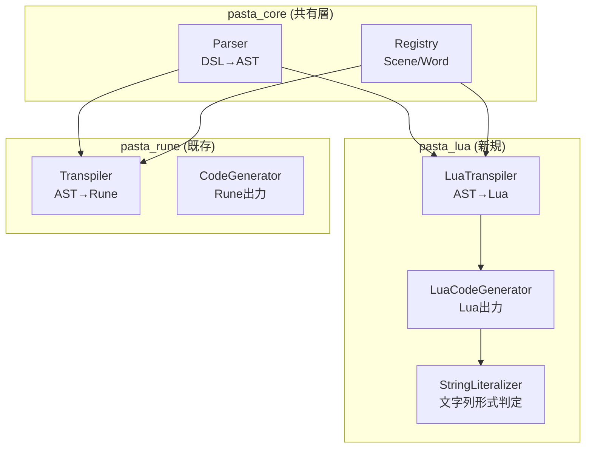
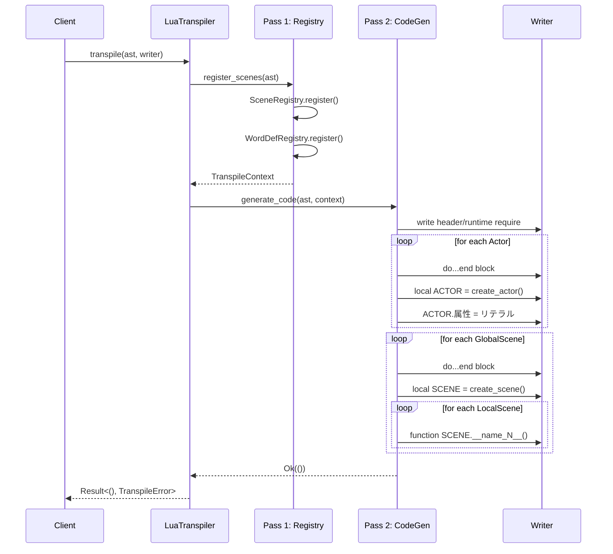
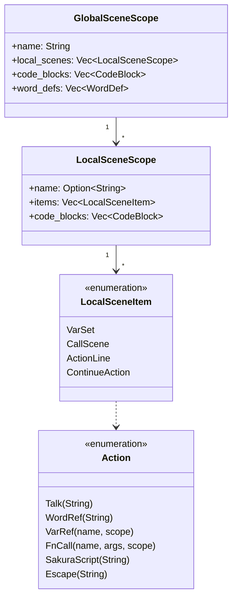

# 技術設計書: Pasta DSL → Lua トランスパイラー

## 概要

**目的**: Pasta DSL の AST から Lua コードを生成するトランスパイラー層を実装し、Rune VM への依存を排除した軽量な実行環境を提供する。

**ユーザー**: Pasta スクリプト開発者、デスクトップマスコット（伺か）のゴースト作成者、シナリオ型ゲームエンジン利用者。

**影響**: 既存 pasta_rune クレートと並列に pasta_lua クレートを追加。pasta_core のパーサー・レジストリ層を共有し、出力バックエンドのみを Lua に変更。

### ゴール
- Pasta AST から有効な Lua コードを生成する
- Lua 5.3+ の Unicode 識別子サポートを活用し、日本語シーン名・変数名を直接出力
- 既存 pasta_rune の CodeGenerator パターンを踏襲し、保守性を維持
- sample.pasta → sample.lua の自動変換によるインテグレーションテストを確立

### 非ゴール
- Lua ランタイム層の実装（coroutine 管理、word/talk 関数）
- SHIORI.DLL としてのコンパイル（後続仕様）
- 属性（`＆key：value`）の処理（後続仕様で対応）

## アーキテクチャ

### 既存アーキテクチャ分析

```
pasta (workspace)
├── pasta_core          # 言語非依存層（パーサー、レジストリ）
│   ├── Parser          # DSL→AST変換（Pest）
│   └── Registry        # シーン/単語テーブル
└── pasta_rune          # Runeバックエンド層
    ├── Transpiler      # AST→Runeコード (2pass)
    ├── Runtime         # Rune VM実行
    └── Engine          # 統合API
```

**維持するパターン**:
- `std::io::Write` トレイトによる出力抽象化
- 2パス変換戦略（Pass 1: レジストリ登録、Pass 2: コード生成）
- `CodeGenerator<W: Write>` 構造体パターン

### アーキテクチャパターン・境界マップ



**アーキテクチャ統合**:
- **選択パターン**: Visitor パターン + Write トレイト出力
- **ドメイン境界**: pasta_lua は pasta_core のみに依存、pasta_rune との直接依存なし
- **維持する既存パターン**: CodeGenerator 構造体、2パス変換、レジストリ共有
- **新規コンポーネント理由**: Lua 固有の文字列リテラル形式判定が必要
- **ステアリング準拠**: yield 型出力、宣言的フロー、2パス変換を維持

### 技術スタック

| レイヤー | 選択/バージョン | 役割 | 備考 |
|----------|-----------------|------|------|
| 言語 | Rust 2024 edition | トランスパイラー実装 | 既存スタック維持 |
| パーサー | pasta_core (Pest 2.8) | DSL→AST変換 | 共有層 |
| 出力形式 | Lua 5.3+ | ターゲットコード | Unicode 識別子必須 |
| エラー型 | thiserror 2 | TranspileError 定義 | 既存パターン |
| トレイト | std::io::Write | 出力抽象化 | 既存パターン |

## システムフロー

### トランスパイル処理フロー



### 文字列リテラル判定フロー

```mermaid
flowchart TD
    A[入力文字列] --> B{エスケープ対象<br/>\ or " を含む?}
    B -->|No| C["通常形式<br/>\"text\""]
    B -->|Yes| D[n = 0]
    D --> E{危険パターン<br/>] + n個の=<br/>を含む?}
    E -->|No| F["長文字列形式<br/>[=n[text]=n]"]
    E -->|Yes| G[n = n + 1]
    G --> H{n > 10?}
    H -->|No| E
    H -->|Yes| I[エラー: 変換不能]
```

## 要件トレーサビリティ

| 要件 | 概要 | コンポーネント | インターフェース | フロー |
|------|------|----------------|------------------|--------|
| 1 | ローカル変数数制限対応 | LuaCodeGenerator | generate_actor_block, generate_scene_block | Pass 2 |
| 2 | コメント出力モード | LuaTranspiler, LuaCodeGenerator | TranspilerConfig | Pass 2 |
| 3 | 文字列リテラル形式 | StringLiteralizer | literalize() | Pass 2 |
| 4a | アクター定義Lua化 | LuaCodeGenerator | generate_actor() | Pass 2 |
| 4b | シーン定義・モジュール構造 | LuaCodeGenerator | generate_global_scene() | Pass 2 |
| 4c | ローカルシーン関数変換 | LuaCodeGenerator | generate_local_scene() | Pass 2 |
| 4d | 変数スコープ管理 | LuaCodeGenerator | generate_var_set(), generate_action() | Pass 2 |
| 4e | 単語参照処理 | LuaCodeGenerator, Pass 1 | generate_action(), WordDefRegistry | Pass 1, Pass 2 |
| 4f | コードブロック埋め込み | LuaCodeGenerator | generate_code_block() | Pass 2 |
| 4g | グローバルシーン間参照 | LuaCodeGenerator | generate_call_scene() | Pass 2 |
| 5 | 実装制約・前提 | LuaTranspiler | TranspileError, Result<T, E> | 全体 |
| 6 | レジストリ登録 | Pass 1 | SceneRegistry, WordDefRegistry | Pass 1 |
| 7 | インテグレーションテスト | Test Suite | pasta_lua_transpiler_integration_test.rs | テスト |

## コンポーネントとインターフェース

### コンポーネント概要

| コンポーネント | ドメイン/レイヤー | 意図 | 要件カバレッジ | 主要依存 | 契約 |
|----------------|-------------------|------|----------------|----------|------|
| LuaTranspiler | Transpiler | トランスパイル処理の統合 API | 2, 5 | pasta_core::Parser (P0) | Service |
| LuaCodeGenerator | Transpiler | Lua コード生成 | 1, 4a-4g | LuaTranspiler (P0), StringLiteralizer (P1) | Service |
| StringLiteralizer | Transpiler/Util | 文字列リテラル形式判定 | 3 | なし | Service |
| TranspilerConfig | Transpiler | 設定管理 | 2 | なし | State |
| TranspileContext | Transpiler | パス間コンテキスト共有 | 6 | SceneRegistry (P0), WordDefRegistry (P0) | State |

### Transpiler レイヤー

#### LuaTranspiler

| フィールド | 詳細 |
|----------|------|
| Intent | Pasta AST から Lua コードへのトランスパイル処理を統合する |
| Requirements | 2, 5 |

**責務と制約**
- 2パス変換の制御（Pass 1: レジストリ登録、Pass 2: コード生成）
- TranspilerConfig による設定管理（comment_mode 等）
- TranspileError による一貫したエラーハンドリング

**依存関係**
- Inbound: Client code — トランスパイル実行 (P0)
- Outbound: LuaCodeGenerator — コード生成 (P0)
- Outbound: pasta_core::Parser — AST 取得 (P0)
- Outbound: SceneRegistry, WordDefRegistry — レジストリ登録 (P0)

**契約**: Service [x]

##### サービスインターフェース
```rust
pub struct LuaTranspiler {
    config: TranspilerConfig,
}

impl LuaTranspiler {
    /// 新規トランスパイラーを設定付きで作成
    pub fn new(config: TranspilerConfig) -> Self;
    
    /// デフォルト設定（comment_mode=true）で作成
    pub fn default() -> Self;
    
    /// AST から Lua コードを生成し Writer に出力
    pub fn transpile<W: Write>(
        &self,
        ast: &[GlobalSceneScope],
        actors: &[ActorScope],
        writer: &mut W,
    ) -> Result<TranspileContext, TranspileError>;
}
```
- 事前条件: AST が有効な Pasta 構文を表現していること
- 事後条件: Writer に有効な Lua コードが出力されること
- 不変条件: config は transpile 中に変更されない

#### LuaCodeGenerator

| フィールド | 詳細 |
|----------|------|
| Intent | AST ノードを Lua コード文字列に変換し Writer に出力する |
| Requirements | 1, 4a, 4b, 4c, 4d, 4e, 4f, 4g |

**責務と制約**
- do...end ブロックによるスコープ分離（Requirement 1）
- ACTOR/SCENE 変数の再利用
- インデント管理（indent_level）
- 現在モジュール名の追跡（current_module）

**依存関係**
- Inbound: LuaTranspiler — コード生成呼び出し (P0)
- Outbound: StringLiteralizer — 文字列リテラル変換 (P1)
- Outbound: Writer (std::io::Write) — 出力先 (P0)

**契約**: Service [x]

##### サービスインターフェース
```rust
pub struct LuaCodeGenerator<'a, W: Write> {
    writer: &'a mut W,
    indent_level: usize,
    current_module: String,
    config: &'a TranspilerConfig,
}

impl<'a, W: Write> LuaCodeGenerator<'a, W> {
    pub fn new(writer: &'a mut W, config: &'a TranspilerConfig) -> Self;
    
    /// アクター定義ブロックを生成（Requirement 4a）
    pub fn generate_actor(&mut self, actor: &ActorDef) -> Result<(), TranspileError>;
    
    /// グローバルシーンブロックを生成（Requirement 4b）
    pub fn generate_global_scene(
        &mut self,
        scene: &GlobalSceneScope,
        scene_counter: usize,
        context: &TranspileContext,
    ) -> Result<(), TranspileError>;
    
    /// ローカルシーン関数を生成（Requirement 4c）
    pub fn generate_local_scene(
        &mut self,
        scene: &LocalSceneScope,
        index: usize,
    ) -> Result<(), TranspileError>;
    
    /// 変数代入を生成（Requirement 4d）
    pub fn generate_var_set(&mut self, var_set: &VarSet) -> Result<(), TranspileError>;
    
    /// シーン呼び出しを生成（Requirement 4d, 4g）
    pub fn generate_call_scene(&mut self, call_scene: &CallScene) -> Result<(), TranspileError>;
    
    /// アクション（Talk, WordRef, VarRef 等）を生成（Requirement 4d, 4e）
    pub fn generate_action(&mut self, action: &Action) -> Result<(), TranspileError>;
    
    /// コードブロックを生成（Requirement 4f）
    pub fn generate_code_block(&mut self, block: &CodeBlock) -> Result<(), TranspileError>;
}
```

#### StringLiteralizer

| フィールド | 詳細 |
|----------|------|
| Intent | 文字列を最適な Lua リテラル形式に変換する |
| Requirements | 3 |

**責務と制約**
- ルール1: エスケープ不要 → 通常文字列 `"text"`
- ルール2: エスケープ必要 → 長文字列 `[=[text]=]`
- 危険パターン検出と n 値の最小化
- n > 10 でエラー（実用上発生しない）

**依存関係**
- Inbound: LuaCodeGenerator — 文字列変換呼び出し (P1)
- External: なし

**契約**: Service [x]

##### サービスインターフェース
```rust
pub struct StringLiteralizer;

impl StringLiteralizer {
    /// 文字列を Lua リテラル形式に変換
    pub fn literalize(text: &str) -> Result<String, TranspileError>;
    
    /// エスケープ対象文字が含まれるかチェック
    fn needs_long_string(text: &str) -> bool;
    
    /// 危険パターン（] + n個の=）が含まれるかチェック
    fn contains_danger_pattern(text: &str, n: usize) -> bool;
}
```
- 事前条件: text は有効な UTF-8 文字列
- 事後条件: 返り値は有効な Lua 文字列リテラル
- 不変条件: 入力文字列は変更されない

#### TranspilerConfig

| フィールド | 詳細 |
|----------|------|
| Intent | トランスパイラーの設定を管理する |
| Requirements | 2 |

**契約**: State [x]

##### 状態管理
```rust
pub struct TranspilerConfig {
    /// Pasta 源コードをコメントで出力するか（デフォルト: false）
    pub comment_mode: bool,
}

impl Default for TranspilerConfig {
    fn default() -> Self {
        Self { comment_mode: false }
    }
}
```
- 状態モデル: イミュータブル設定オブジェクト
- 永続性: なし（トランスパイル実行時のみ）
- 並行性: スレッドセーフ（Copy 可能）

#### TranspileContext

| フィールド | 詳細 |
|----------|------|
| Intent | パス間でコンテキスト情報を共有する |
| Requirements | 6 |

**契約**: State [x]

##### 状態管理
```rust
pub struct TranspileContext {
    /// シーンレジストリ（グローバル/ローカルシーン登録）
    pub scene_registry: SceneRegistry,
    /// 単語定義レジストリ（グローバル/ローカル単語登録）
    pub word_registry: WordDefRegistry,
    /// 現在処理中のモジュール名
    pub current_module: Option<String>,
}
```
- 状態モデル: Pass 1 で構築、Pass 2 で参照
- 永続性: トランスパイル実行中のみ
- 並行性: 単一スレッドで使用（排他的所有）

## データモデル

### ドメインモデル



### 出力 Lua コード構造

```lua
-- ヘッダー
local PASTA = require "pasta.runtime"

-- アクター定義（Requirement 4a）
do
    local ACTOR = PASTA:create_actor("アクター名")
    ACTOR.属性 = [=[値]=]  -- Requirement 3
end

-- シーン定義（Requirement 4b）
do
    local SCENE = PASTA:create_scene("モジュール名")
    
    -- エントリーポイント（Requirement 4c）
    function SCENE.__start__(ctx, ...)
        local args = { ... }
        local act, save, var = PASTA:create_session(SCENE, ctx)
        -- アクション生成（Requirement 4d, 4e）
    end
    
    -- ローカルシーン（Requirement 4c）
    function SCENE.__シーン名_1__(ctx, ...)
        -- ...
    end
end
```

## エラーハンドリング

### エラー戦略
- **早期失敗**: AST 検証は Pass 1 で実施
- **優雅な劣化**: 非対応 AST ノードはコメント出力で警告
- **ユーザーコンテキスト**: Pasta 源行番号をエラーメッセージに含める

### エラーカテゴリと対応
```rust
pub enum TranspileError {
    /// IO エラー（Writer への書き込み失敗）
    IoError(std::io::Error),
    /// 無効な AST 構造
    InvalidAst { span: Span, message: String },
    /// 継続アクションにアクター未設定
    InvalidContinuation { span: Span },
    /// 文字列リテラル変換失敗（すべての n で危険パターン）
    StringLiteralError { text: String },
    /// 未サポート機能
    Unsupported { feature: String },
}
```

## テスト戦略

### ユニットテスト
- `StringLiteralizer::literalize()` - 各ルールの境界条件
  - エスケープ不要パターン（通常文字列）
  - エスケープ必要パターン（危険パターン検出）
  - n > 10 の上限エラー
- `LuaCodeGenerator::generate_*()` - 各 AST ノードの出力パターン
- `TranspilerConfig` - デフォルト値、設定変更

### 統合テスト
- `pasta_lua_transpiler_integration_test.rs` - sample.pasta → Lua 変換
- comment_mode=true/false 両モードの検証
- 参照実装 sample.lua との構文的同一性を確認

**Lua 構文的同一性検証方式**:
```
step 1: 生成 Lua コードをテキスト行に分割
step 2: 参照実装 sample.lua をテキスト行に分割
step 3: 両者から比較対象外の行を除外
  - コメント行（`--` で開始）を削除
  - 空行（`^\s*$`）を削除
step 4: コード行を正規化
  - 行頭・行末の空白を削除
  - インデント量の差異を吸収（構文木レベルで同等か確認）
step 5: 正規化済みコード行を比較
  - 期待値と実際値が 1:1 対応することを確認
  - 不一致がある場合、トランスパイラールール側の調整を検討
step 6: テスト結果をレポート
  - コード行数が一致することを確認
  - 不一致行の詳細（行番号、期待コード、実際コード）
  - インデント差異は別途ログに記載
  - トランスパイラー調整フラグを明記
```

### E2E テスト
- 生成 Lua コードの構文妥当性（luacheck または Lua インタープリタ）
- 複数 Pasta ファイルのバッチトランスパイル

## コメント出力詳細

**comment_mode の実装方式**:
- `TranspilerConfig::comment_mode: bool` でデフォルト false（sample.lua との比較用）
- `comment_mode=true` 時、AST ノードの `span.start_line` からファイルレベルの行番号を取得
- 行番号取得不可な場合（古い AST など）はコメント出力をスキップ
- コメント形式: `-- [Pasta src:L○]` で生成行の Pasta ソース行番号を記録

**comment_mode=true 時の Lua コード**:
```lua
-- [Pasta src:L5]
local talk_function = function()
  -- [Pasta src:L6]
  print("Hello")
end
```

**comment_mode=false 時の Lua コード**:
```lua
local talk_function = function()
  print("Hello")
end
```

## セキュリティ考慮事項

- **コードインジェクション**: Pasta テキストは Lua 文字列リテラルとして安全にエスケープ
- **長文字列形式**: 危険パターン検出により意図しない終端を防止
- **外部入力**: トランスパイラーは信頼された Pasta ファイルのみを処理前提

## パフォーマンス・スケーラビリティ

- **ターゲットメトリクス**: 1000 行の Pasta ファイルを 100ms 以内でトランスパイル
- **メモリ効率**: Writer への直接出力で中間文字列バッファを最小化
- **キャッシュ戦略**: pasta_rune と同様、パース結果をキャッシュ可能な設計
