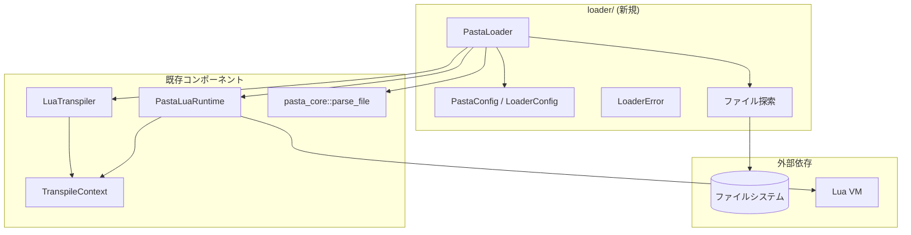
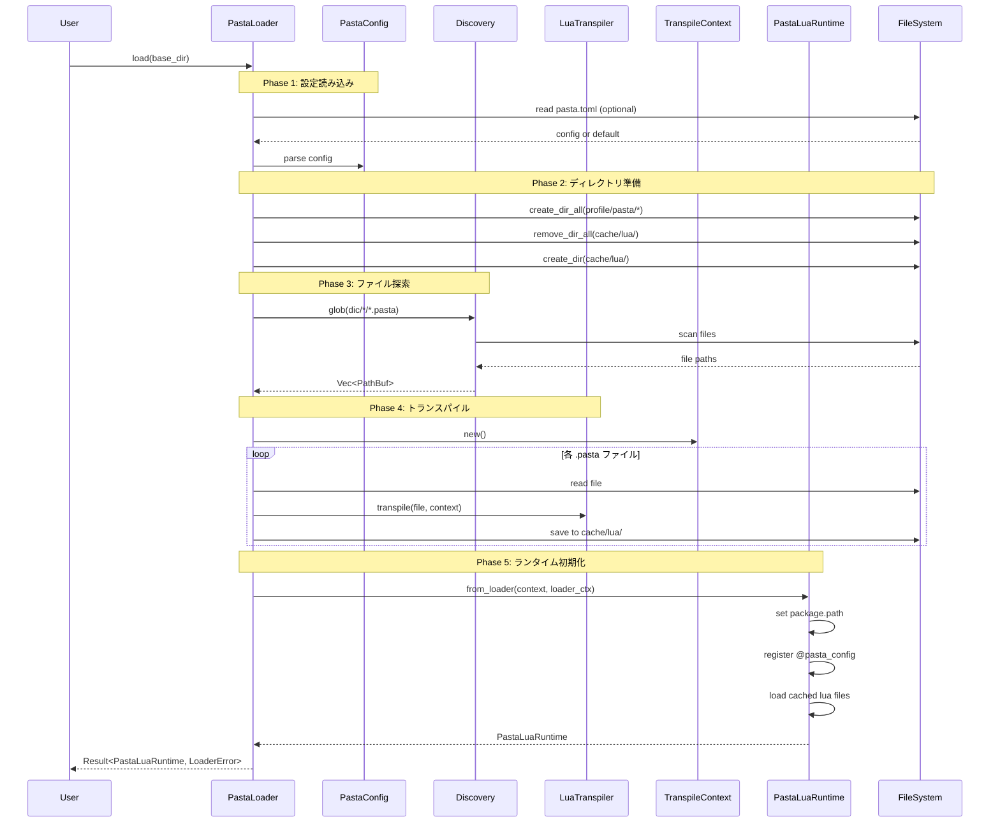
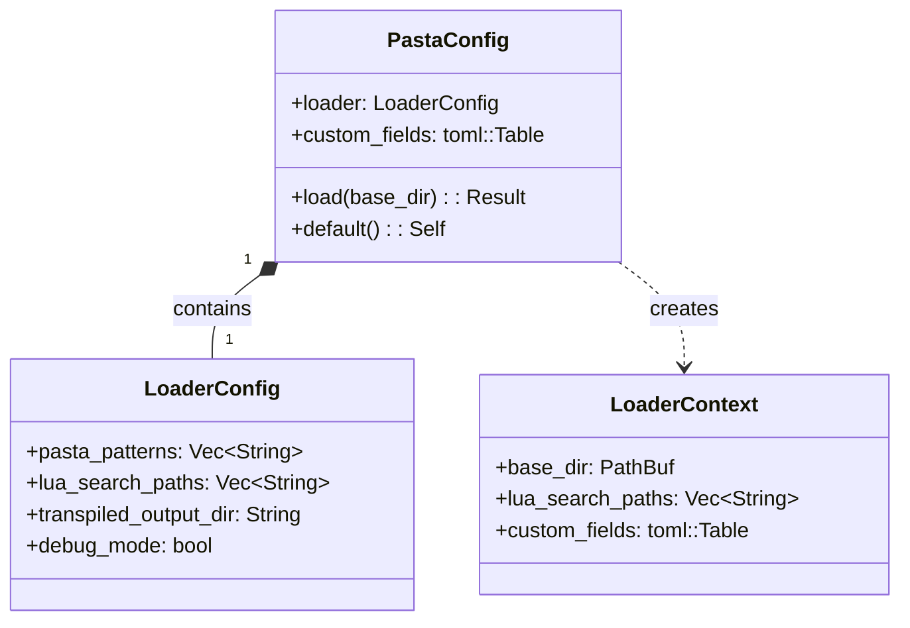

# Design Document

## Overview

**Purpose**: 本機能は、pasta_luaの「起動シーケンス」を確立し、起動ディレクトリからPastaスクリプトの発見・トランスパイル・ロード・ランタイム起動までを統合する。

**Users**: 
- **ゴースト開発者**: 起動ディレクトリを指定するだけで、複雑なファイル指定なしにPastaスクリプトを実行できる
- **pasta_lua利用者**: シンプルな1行API（`PastaLoader::load(path)`）でランタイムを取得できる

**Impact**: 現在の手動ファイル指定・個別初期化から、自動探索・統合初期化へ移行。既存API（`LuaTranspiler`, `PastaLuaRuntime`）は互換性を維持。

### Goals
- 起動ディレクトリから `dic/*/*.pasta` パターンでPastaファイルを自動収集
- `pasta.toml` 設定ファイルで起動オプションを制御可能に
- 複数ファイルを統合トランスパイルし、単一ランタイムで実行
- 1つのエントリーポイント（`PastaLoader::load`）で全起動シーケンスを実行
- Luaから `@pasta_config` モジュールで設定値を参照可能に

### Non-Goals
- キャッシュによるトランスパイル省略（毎回フルトランスパイル）
- ファイル変更検知・ホットリロード
- 複数ランタイムインスタンスの同時管理
- 非同期起動シーケンス

## Architecture

### Existing Architecture Analysis

**現行コンポーネント:**
- `LuaTranspiler` - 単一PastaFileをLuaコードにトランスパイル（責務維持）
- `PastaLuaRuntime` - Lua VM初期化、モジュール登録（責務維持）
- `TranspileContext` - シーン/単語レジストリ管理（責務維持）
- `pasta_core::parse_file` - Pastaファイル解析

**既存パターン:**
- `thiserror` による構造化エラー型
- `tracing` によるログ出力
- モジュール単位の責務分離（`transpiler.rs`, `runtime/mod.rs`）

**技術的負債:** なし（新規機能追加のみ）

### Architecture Pattern & Boundary Map



**Architecture Integration:**
- **Selected Pattern**: Facade パターン - `PastaLoader` が既存コンポーネントを統合
- **Domain/Feature Boundaries**: 
  - `loader/` - 起動シーケンス統合（新規）
  - `transpiler/` - コード生成（既存）
  - `runtime/` - VM実行（既存）
- **Existing Patterns Preserved**: エラー型階層、モジュール分離、tracing統合
- **New Components Rationale**: 
  - `PastaLoader` - 統合エントリーポイント（tech.mdの「Engine層」相当）
  - `LoaderError` - 起動シーケンス固有のエラー型
- **Steering Compliance**: tech.mdのレイヤー構成に準拠

### Technology Stack

| Layer | Choice / Version | Role in Feature | Notes |
|-------|------------------|-----------------|-------|
| ファイル探索 | glob 0.3 | `dic/*/*.pasta` パターン探索 | pasta_runeで実績あり |
| 設定解析 | toml 0.9.8 + serde 1.0 | `pasta.toml` デシリアライズ | #[serde(flatten)]使用 |
| ファイルIO | std::fs | ディレクトリ作成、ファイル読み書き | 標準ライブラリ |
| Lua VM | mlua 0.11 | package.path設定、@pasta_config登録 | serialize feature有効 |
| ロギング | tracing 0.1 | 起動進捗出力 | 既存依存 |
| エラー型 | thiserror 2 | LoaderError定義 | 既存依存 |

## System Flows

### 起動シーケンスフロー



## Requirements Traceability

| Requirement | Summary | Components | Interfaces | Flows |
|-------------|---------|------------|------------|-------|
| 1.1-1.5 | 起動ディレクトリ探索 | Discovery, PastaLoader | discover_files() | Phase 3 |
| 2.1-2.8 | 設定ファイル解釈 | PastaConfig, LoaderConfig | PastaConfig::load() | Phase 1-2 |
| 3.1-3.8 | 複数ファイルトランスパイル | PastaLoader, LuaTranspiler | transpile_all() | Phase 4 |
| 4.1-4.6 | ランタイム初期化 | PastaLuaRuntime, LoaderContext | from_loader() | Phase 5 |
| 5.1-5.5 | 統合起動API | PastaLoader | load() | 全Phase |
| 6.1-6.5 | エラーハンドリング | LoaderError | Display, From traits | 全Phase |
| 7.1-7.6 | @pasta_configモジュール | PastaLuaRuntime | register_config_module() | Phase 5 |

## Components and Interfaces

### Summary

| Component | Domain/Layer | Intent | Req Coverage | Key Dependencies | Contracts |
|-----------|--------------|--------|--------------|------------------|-----------|
| PastaLoader | loader/Engine | 統合起動API | 5.1-5.5 | Discovery, Transpiler, Runtime (P0) | Service |
| PastaConfig | loader/Config | 設定ファイル解析 | 2.1-2.8 | toml, serde (P0) | Service |
| LoaderConfig | loader/Config | ローダー設定 | 2.2 | serde (P0) | State |
| LoaderError | loader/Error | エラー型 | 6.1-6.5 | thiserror (P0) | - |
| Discovery | loader/Discovery | ファイル探索 | 1.1-1.5 | glob (P0), std::fs (P0) | Service |
| LoaderContext | loader/Context | ランタイム初期化情報 | 4.1-4.6, 7.1-7.6 | toml::Table (P0) | State |

### loader/

#### PastaLoader

| Field | Detail |
|-------|--------|
| Intent | 起動ディレクトリからPastaLuaRuntimeを生成する統合API |
| Requirements | 5.1, 5.2, 5.3, 5.4, 5.5 |

**Responsibilities & Constraints**
- 起動シーケンス全体のオーケストレーション
- 各フェーズの進捗をtracingでログ出力
- エラー発生時は発生フェーズとエラー詳細を含むLoaderErrorを返す

**Dependencies**
- Inbound: なし（エントリーポイント）
- Outbound: Discovery, PastaConfig, LuaTranspiler, PastaLuaRuntime (P0)
- External: std::fs, pasta_core::parse_file (P0)

**Contracts**: Service [x]

##### Service Interface
```rust
impl PastaLoader {
    /// 起動ディレクトリからランタイムを生成
    /// 
    /// # Arguments
    /// * `base_dir` - 起動ディレクトリパス（ghost/master/相当）
    /// 
    /// # Returns
    /// * `Ok(PastaLuaRuntime)` - 実行可能なランタイム
    /// * `Err(LoaderError)` - 起動失敗
    pub fn load(base_dir: impl AsRef<Path>) -> Result<PastaLuaRuntime, LoaderError>;
    
    /// カスタム設定で起動
    pub fn load_with_config(
        base_dir: impl AsRef<Path>,
        runtime_config: RuntimeConfig,
    ) -> Result<PastaLuaRuntime, LoaderError>;
}
```
- Preconditions: `base_dir` が存在するディレクトリ
- Postconditions: 返されたランタイムは即座に `exec()` 可能
- Invariants: 起動シーケンスはべき等ではない（毎回フルトランスパイル）

#### PastaConfig

| Field | Detail |
|-------|--------|
| Intent | pasta.toml設定ファイルの読み込み・デシリアライズ |
| Requirements | 2.1, 2.2, 2.3, 2.4, 2.5 |

**Responsibilities & Constraints**
- TOML形式の設定ファイル解析
- `[loader]` セクションをLoaderConfigにマッピング
- 未知のフィールドはcustom_fieldsとして保持
- ファイル不在時はデフォルト値で構築

**Dependencies**
- Inbound: PastaLoader (P0)
- Outbound: LoaderConfig (P0)
- External: toml, serde (P0)

**Contracts**: Service [x] / State [x]

##### Service Interface
```rust
impl PastaConfig {
    /// 設定ファイルを読み込む（ファイル不在時はデフォルト）
    pub fn load(base_dir: &Path) -> Result<Self, LoaderError>;
    
    /// デフォルト設定を生成
    pub fn default() -> Self;
}
```

##### State Management
```rust
#[derive(Debug, Deserialize)]
pub struct PastaConfig {
    #[serde(default)]
    pub loader: LoaderConfig,
    
    /// [loader]以外のすべてのフィールド・セクション
    #[serde(flatten)]
    pub custom_fields: toml::Table,
}
```
- Persistence: pasta.toml（読み取り専用）
- Consistency: 起動時に1回読み込み、実行中は変更不可

#### LoaderConfig

| Field | Detail |
|-------|--------|
| Intent | [loader]セクションの設定値を保持 |
| Requirements | 2.2 |

**Contracts**: State [x]

##### State Management
```rust
#[derive(Debug, Clone, Deserialize)]
pub struct LoaderConfig {
    /// Pastaファイル探索パターン
    #[serde(default = "default_pasta_patterns")]
    pub pasta_patterns: Vec<String>,
    
    /// Luaモジュール検索パス（優先順）
    #[serde(default = "default_lua_search_paths")]
    pub lua_search_paths: Vec<String>,
    
    /// トランスパイル結果出力先
    #[serde(default = "default_transpiled_output_dir")]
    pub transpiled_output_dir: String,
    
    /// デバッグモード（キャッシュ保存有無）
    #[serde(default = "default_debug_mode")]
    pub debug_mode: bool,
}

fn default_pasta_patterns() -> Vec<String> {
    vec!["dic/*/*.pasta".to_string()]
}

fn default_lua_search_paths() -> Vec<String> {
    vec![
        "profile/pasta/save/lua".to_string(),
        "scripts".to_string(),
        "profile/pasta/cache/lua".to_string(),
        "scriptlibs".to_string(),
    ]
}

fn default_transpiled_output_dir() -> String {
    "profile/pasta/cache/lua".to_string()
}

fn default_debug_mode() -> bool {
    true
}
```

#### LoaderError

| Field | Detail |
|-------|--------|
| Intent | 起動シーケンスのエラー型 |
| Requirements | 6.1, 6.2, 6.3, 6.4, 6.5 |

**Contracts**: State [x]

##### State Management
```rust
#[derive(Debug, thiserror::Error)]
pub enum LoaderError {
    /// ファイルIO エラー
    #[error("ファイル '{0}' の読み込みに失敗しました: {1}")]
    Io(PathBuf, #[source] std::io::Error),
    
    /// 設定ファイル解析エラー
    #[error("設定ファイル '{0}' の解析に失敗しました: {1}")]
    Config(PathBuf, #[source] toml::de::Error),
    
    /// Pastaパースエラー
    #[error("Pastaファイル '{0}' のパースに失敗しました")]
    Parse(PathBuf, #[source] pasta_core::ParseError),
    
    /// トランスパイルエラー
    #[error("トランスパイルに失敗しました")]
    Transpile(#[from] TranspileError),
    
    /// Luaランタイムエラー
    #[error("Luaランタイムの初期化に失敗しました: {0}")]
    Runtime(#[from] mlua::Error),
    
    /// ディレクトリ不存在
    #[error("起動ディレクトリ '{0}' が存在しません")]
    DirectoryNotFound(PathBuf),
    
    /// Glob パターンエラー
    #[error("ファイル探索パターンが不正です: {0}")]
    GlobPattern(#[from] glob::PatternError),
}
```

#### Discovery (内部モジュール)

| Field | Detail |
|-------|--------|
| Intent | dic/*/*.pasta パターンでファイルを探索 |
| Requirements | 1.1, 1.3, 1.4, 1.5 |

**Contracts**: Service [x]

##### Service Interface
```rust
/// Pastaファイルを探索
/// 
/// # Arguments
/// * `base_dir` - 起動ディレクトリ
/// * `patterns` - glob パターン（例: ["dic/*/*.pasta"]）
/// 
/// # Returns
/// * 発見されたファイルパスのVec（glob返却順）
/// * ファイルが見つからない場合は空Vec（警告ログ出力）
pub fn discover_files(
    base_dir: &Path,
    patterns: &[String],
) -> Result<Vec<PathBuf>, LoaderError>;
```

#### LoaderContext

| Field | Detail |
|-------|--------|
| Intent | ランタイム初期化に必要な情報を保持 |
| Requirements | 4.1, 4.2, 7.1, 7.2 |

**Contracts**: State [x]

##### State Management
```rust
/// PastaLoader から PastaLuaRuntime への受け渡しコンテキスト
pub struct LoaderContext {
    /// 起動ディレクトリ（絶対パス）
    pub base_dir: PathBuf,
    
    /// Luaモジュール検索パス（相対パス）
    pub lua_search_paths: Vec<String>,
    
    /// カスタム設定（@pasta_config用）
    pub custom_fields: toml::Table,
}
```

### runtime/ (拡張)

#### PastaLuaRuntime (拡張)

| Field | Detail |
|-------|--------|
| Intent | LoaderContextからランタイムを初期化する新規ファクトリメソッド追加 |
| Requirements | 4.1, 4.2, 4.3, 4.6, 7.1, 7.2, 7.3, 7.4, 7.5, 7.6 |

**Contracts**: Service [x]

##### Service Interface (追加)
```rust
impl PastaLuaRuntime {
    /// LoaderContextからランタイムを初期化
    /// 
    /// 既存のnew()/with_config()に加えて追加
    pub fn from_loader(
        context: TranspileContext,
        loader_context: LoaderContext,
        config: RuntimeConfig,
    ) -> LuaResult<Self>;
}
```

**Implementation Notes**
- 内部で `setup_package_path()` を呼び出し、4階層の検索パスを設定
- 内部で `register_config_module()` を呼び出し、@pasta_configを登録

##### Internal Methods
```rust
impl PastaLuaRuntime {
    /// package.pathを設定（内部メソッド）
    fn setup_package_path(
        lua: &Lua,
        base_dir: &Path,
        search_paths: &[String],
    ) -> LuaResult<()>;
    
    /// @pasta_configモジュールを登録（内部メソッド）
    fn register_config_module(
        lua: &Lua,
        custom_fields: &toml::Table,
    ) -> LuaResult<()>;
    
    /// toml::Value → mlua::Value 変換（内部メソッド）
    fn toml_to_lua(lua: &Lua, value: &toml::Value) -> LuaResult<mlua::Value>;
}
```

## Data Models

### Domain Model



**Business Rules:**
- `pasta.toml` が存在しない場合、全フィールドはデフォルト値
- `custom_fields` は `[loader]` 以外のすべてのフィールド・セクション
- `lua_search_paths` の順序は優先順位を表す（前方優先）

### Logical Data Model

**pasta.toml 構造:**
```toml
[loader]
pasta_patterns = ["dic/*/*.pasta"]
lua_search_paths = [
    "profile/pasta/save/lua",
    "scripts",
    "profile/pasta/cache/lua",
    "scriptlibs"
]
transpiled_output_dir = "profile/pasta/cache/lua"
debug_mode = true

# カスタムフィールド（任意）
ghost_name = "MyGhost"

[user_data]
key1 = "value1"
key2 = 123
```

**Consistency & Integrity:**
- 設定ファイルは起動時に1回のみ読み込み
- 実行中の設定変更は不可（イミュータブル）
- `@pasta_config` は読み取り専用

## Error Handling

### エラーフロー

| Phase | Error Type | Recovery Strategy |
|-------|------------|-------------------|
| 設定読み込み | LoaderError::Config | エラー詳細を返却、起動中断 |
| ディレクトリ準備 | LoaderError::Io | エラー詳細を返却、起動中断 |
| ファイル探索 | LoaderError::GlobPattern | エラー詳細を返却、起動中断 |
| ファイル読み込み | LoaderError::Io | エラー詳細を返却、起動中断 |
| パース | LoaderError::Parse | ファイル名・エラー詳細を返却、起動中断 |
| トランスパイル | LoaderError::Transpile | ファイル名・行番号を返却、起動中断 |
| ランタイム初期化 | LoaderError::Runtime | エラー詳細を返却、起動中断 |

### エラーメッセージ例

```
[ERROR] ファイル 'dic/greeting/hello.pasta' のパースに失敗しました
        at line 15, column 3
        unexpected token: '{'
        
[ERROR] 設定ファイル 'pasta.toml' の解析に失敗しました
        at line 8, column 1
        expected string, found integer
```

## Testing Strategy

## Implementation Details

### Requirement 4.3: トランスパイル結果のロード

**採用アプローチ: Option B（メモリ直接exec）**

設計判断: Requirements 3.5/3.8によりキャッシュ再利用しない設計のため、トランスパイル結果は`mlua::Lua::load()`でメモリ上のバイト列から直接実行する。キャッシュファイル（`.pasta_cache/*.lua`）への保存はデバッグ目的の副次的機能として実装する。

```rust
// 擬似コード（実装イメージ）
for transpile_result in transpiled {
    // デバッグ用: キャッシュファイルに書き込み（オプション）
    if config.cache_enabled() {
        std::fs::write(cache_path, &transpile_result.lua_code)?;
    }
    
    // メモリ上のバイト列から直接実行
    runtime.lua()
        .load(&transpile_result.lua_code)
        .set_name(&transpile_result.module_name)
        .exec()?;
}
```

**将来拡張:**
- Requirements 3.5/3.8が変更され、キャッシュ再利用が必要になった場合、`dofile()`順次ロードまたは統合ファイル方式に変更可能な設計を維持する

### ユニットテスト
- `loader/config.rs` - PastaConfig デシリアライズ
- `loader/discovery.rs` - ファイル探索パターン
- `runtime/mod.rs` - package.path設定、@pasta_config登録

### 統合テスト
- `tests/loader_integration_test.rs` - 全起動シーケンス
- `tests/fixtures/loader/` - テスト用ディレクトリ構造

### テストフィクスチャ構造
```
tests/fixtures/loader/
├── minimal/               # 最小構成
│   └── dic/
│       └── test/
│           └── hello.pasta
├── with_config/           # pasta.toml付き
│   ├── pasta.toml
│   └── dic/
│       └── test/
│           └── hello.pasta
└── with_custom_config/    # カスタム設定付き
    ├── pasta.toml         # [user_data] セクションあり
    └── dic/
        └── test/
            └── hello.pasta
```

## File Changes

### 新規ファイル
- `crates/pasta_lua/src/loader/mod.rs` - PastaLoader
- `crates/pasta_lua/src/loader/config.rs` - PastaConfig, LoaderConfig
- `crates/pasta_lua/src/loader/error.rs` - LoaderError
- `crates/pasta_lua/src/loader/discovery.rs` - ファイル探索
- `crates/pasta_lua/src/loader/context.rs` - LoaderContext
- `crates/pasta_lua/tests/loader_integration_test.rs` - 統合テスト
- `crates/pasta_lua/tests/fixtures/loader/` - テストフィクスチャ

### 変更ファイル
- `crates/pasta_lua/src/lib.rs` - loader モジュール追加、re-export
- `crates/pasta_lua/src/runtime/mod.rs` - from_loader() メソッド追加

### 変更なし
- `crates/pasta_lua/src/transpiler.rs` - 既存APIそのまま使用
- `crates/pasta_lua/src/context.rs` - 既存APIそのまま使用
