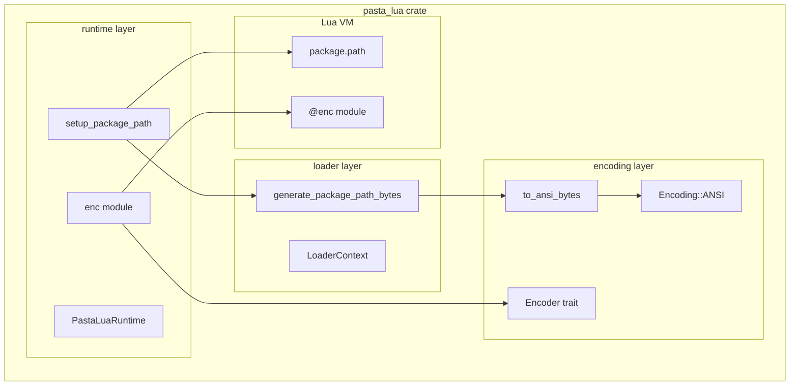
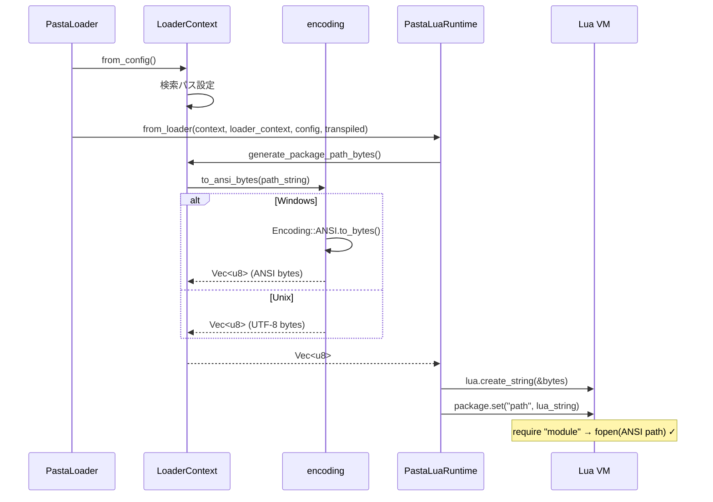
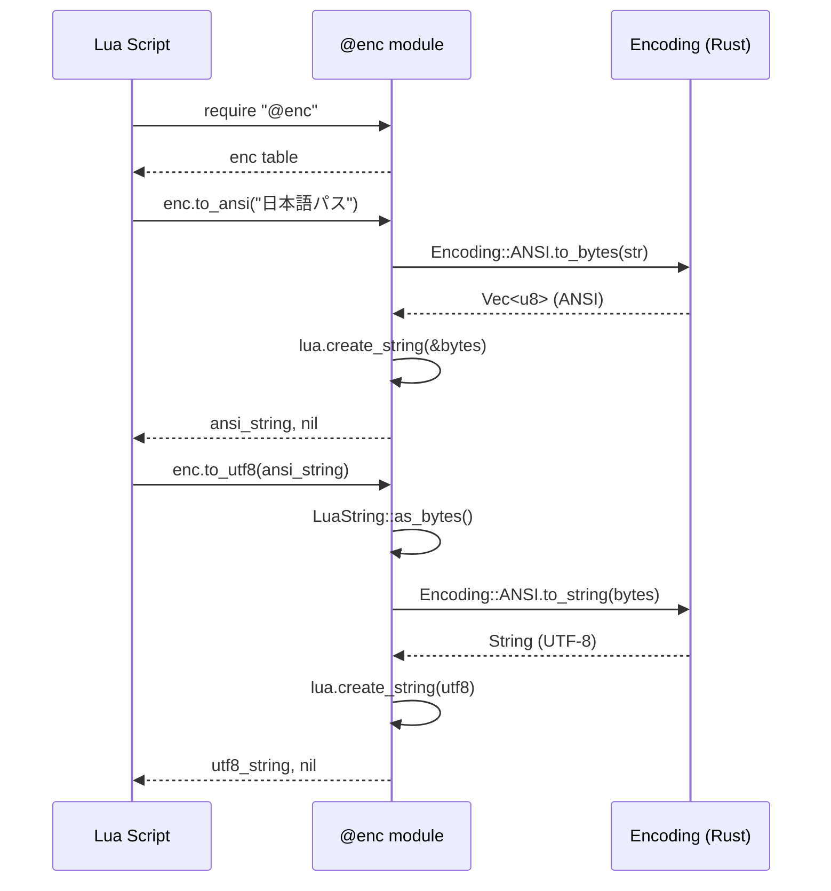

# Technical Design Document

## Overview

**Purpose**: この機能は、Windows環境でのLuaモジュールロード時のパスエンコーディング問題を解決し、日本語などの非ASCII文字を含むパスでも`require`が正しく動作するようにする。

**Users**: 
- ゴースト開発者: 日本語パスを含むディレクトリでスクリプト配置
- Luaスクリプト開発者: `@enc`モジュールでエンコーディング変換

**Impact**: 既存の`package.path`設定をバイト列ベースに変更し、`@enc`モジュールを新規追加する。既存APIは変更なし。

### Goals
- Windows環境で日本語パスを含む`require`が正しく動作する
- Lua側でUTF-8/ANSI変換APIを提供する（`@enc`モジュール）
- 既存の公開APIを維持し後方互換性を確保する

### Non-Goals
- OEM変換（コンソールI/O用）は将来対応とし本仕様では含まない
- 非Windows環境でのANSI変換（パススルー動作）
- カスタムサーチャー実装（不要と判明）

---

## Architecture

### Existing Architecture Analysis

**現在のパス設定フロー**:
```
LoaderContext::generate_package_path() → String (UTF-8)
    ↓
setup_package_path() → package.set("path", string)
    ↓
Lua require → fopen(path) → ANSIとして解釈
    ↓
❌ Windows: 日本語パスが文字化けしてファイルが見つからない
```

**問題点**:
- `generate_package_path()`がUTF-8文字列を返す
- Luaの`fopen`はWindowsでANSIコードページを使用
- 日本語パスがANSI未変換のため解決失敗

### Architecture Pattern & Boundary Map



**Architecture Integration**:
- **Selected pattern**: 既存レイヤー構造を維持した最小修正
- **Domain boundaries**: encoding（変換）→ loader（パス生成）→ runtime（VM設定）
- **Existing patterns preserved**: モジュール登録パターン（`@pasta_search`同様）
- **New components rationale**: 
  - `to_ansi_bytes`: 汎用エンコーディング変換（`@enc`内部でも使用）
  - `enc.rs`: Lua側エンコーディングAPI提供
- **Steering compliance**: pasta_lua構造規約に準拠

### Technology Stack

| Layer | Choice / Version | Role in Feature | Notes |
|-------|------------------|-----------------|-------|
| Runtime | mlua 0.11 | `Lua::create_string(&[u8])`でバイト列をLua文字列化 | 既存依存 |
| Encoding | windows-sys 0.59 | Windows API（MultiByteToWideChar等） | 既存依存、Windows専用 |
| Config | toml 0.9 | LoaderContext設定 | 既存依存 |

**新規依存追加なし** - 全て既存依存で実装可能

---

## System Flows

### package.path設定フロー（修正後）



### @encモジュール使用フロー



---

## Requirements Traceability

| Requirement | Summary | Components | Interfaces | Flows |
|-------------|---------|------------|------------|-------|
| 1.1-1.5 | package.pathのANSI設定 | LoaderContext, PastaLuaRuntime | generate_package_path_bytes, setup_package_path | package.path設定 |
| 2.1-2.5 | to_ansi_bytes追加 | encoding/mod.rs | to_ansi_bytes() | - |
| 3.1-3.4 | LoaderContextバイト列生成 | LoaderContext | generate_package_path_bytes() | package.path設定 |
| 4.1-4.5 | runtime設定修正 | PastaLuaRuntime | setup_package_path() | package.path設定 |
| 5.1-5.8 | @encモジュール実装 | runtime/enc.rs | to_ansi(), to_utf8() | @enc使用 |
| 6.1-6.5 | encoding再利用 | encoding/mod.rs | Encoder trait | - |
| 7.1-7.6 | @encドキュメント | runtime/enc.rs | _VERSION, _DESCRIPTION | - |
| 8.1-8.4 | 後方互換性 | 全コンポーネント | 既存API維持 | - |

---

## Components and Interfaces

### Summary Table

| Component | Domain/Layer | Intent | Req Coverage | Key Dependencies | Contracts |
|-----------|--------------|--------|--------------|------------------|-----------|
| to_ansi_bytes | encoding | UTF-8→ANSIバイト列変換 | 2.1-2.5, 6.1-6.4 | Encoding::ANSI (P0) | Service |
| LoaderContext | loader | package.pathバイト列生成 | 3.1-3.4 | to_ansi_bytes (P0) | Service |
| PastaLuaRuntime | runtime | VM初期化、モジュール登録 | 1.1-1.5, 4.1-4.5 | LoaderContext (P0), enc (P0) | Service |
| enc module | runtime | Luaエンコーディング変換API | 5.1-5.8, 7.1-7.6 | Encoding trait (P0) | API |

---

### encoding layer

#### to_ansi_bytes

| Field | Detail |
|-------|--------|
| Intent | UTF-8文字列をシステムネイティブエンコーディングのバイト列に変換 |
| Requirements | 2.1, 2.2, 2.3, 2.4, 2.5 |

**Responsibilities & Constraints**
- UTF-8文字列をANSIバイト列（Windows）またはUTF-8バイト列（Unix）に変換
- `Encoding::ANSI.to_bytes()`を内部で使用
- 変換失敗時は`std::io::Error`を返す

**Dependencies**
- Inbound: LoaderContext, enc module — バイト列変換 (P0)
- External: Encoding trait — 実際の変換処理 (P0)

**Contracts**: Service [x]

##### Service Interface
```rust
/// UTF-8文字列をシステムネイティブエンコーディングのバイト列に変換する。
/// 
/// Windows: ANSIコードページ（Shift_JIS/CP932等）に変換
/// Unix: UTF-8バイト列をそのまま返す
/// 
/// # Errors
/// エンコーディング変換が失敗した場合（無効な文字等）
pub fn to_ansi_bytes(s: &str) -> std::io::Result<Vec<u8>>;
```
- Preconditions: `s`はvalid UTF-8文字列
- Postconditions: 返却バイト列はシステムネイティブエンコーディング
- Invariants: 変換は冪等（同じ入力に対して同じ出力）

**Implementation Notes**
- `#[cfg(windows)]` / `#[cfg(not(windows))]`で分岐
- Windows: `Encoding::ANSI.to_bytes(s)`
- Unix: `Ok(s.as_bytes().to_vec())`

---

#### path_to_lua廃止

| Field | Detail |
|-------|--------|
| Intent | バグのある関数を削除 |
| Requirements | 2.5 |

**Implementation Notes**
- `path_to_lua`関数とテストを削除
- `path_from_lua`は維持（別用途で使用可能性あり）

---

### loader layer

#### LoaderContext::generate_package_path_bytes

| Field | Detail |
|-------|--------|
| Intent | package.path用のANSIエンコードされたバイト列を生成 |
| Requirements | 3.1, 3.2, 3.3, 3.4 |

**Responsibilities & Constraints**
- 検索パスを結合し`?.lua`および`?/init.lua`パターンを生成
- 生成した文字列を`to_ansi_bytes`で変換
- 既存の`generate_package_path()`は維持（後方互換性）

**Dependencies**
- Outbound: to_ansi_bytes — パスのエンコーディング変換 (P0)
- Inbound: PastaLuaRuntime — package.path設定 (P0)

**Contracts**: Service [x]

##### Service Interface
```rust
impl LoaderContext {
    /// package.path用のバイト列を生成する。
    /// 
    /// 検索パスを結合し、システムネイティブエンコーディングに変換する。
    /// Windows: ANSIバイト列、Unix: UTF-8バイト列
    /// 
    /// # Errors
    /// エンコーディング変換が失敗した場合
    pub fn generate_package_path_bytes(&self) -> std::io::Result<Vec<u8>>;
}
```
- Preconditions: `lua_search_paths`と`base_dir`が設定済み
- Postconditions: セミコロン区切りの`?.lua;?/init.lua`パターンのバイト列
- Invariants: 出力形式はLuaのpackage.path仕様に準拠

**Implementation Notes**
- 既存の`generate_package_path()`を内部で呼び出し、結果を`to_ansi_bytes`で変換
- または直接バイト列生成（UTF-8結合→最後に変換が効率的）

---

### runtime layer

#### PastaLuaRuntime::setup_package_path修正

| Field | Detail |
|-------|--------|
| Intent | package.pathにANSIバイト列を設定 |
| Requirements | 4.1, 4.2, 4.3, 4.4, 4.5 |

**Responsibilities & Constraints**
- `generate_package_path_bytes()`でバイト列取得
- `lua.create_string(&bytes)`でLua文字列化
- `package.set("path", lua_string)`で設定

**Dependencies**
- Inbound: from_loader — ランタイム初期化 (P0)
- Outbound: LoaderContext — バイト列生成 (P0)
- Outbound: Lua VM — package.path設定 (P0)

**Contracts**: Service [x]

##### Service Interface
```rust
impl PastaLuaRuntime {
    /// package.pathをANSIエンコードされたバイト列で設定する。
    /// 
    /// # Errors
    /// バイト列生成またはLua設定が失敗した場合
    fn setup_package_path(lua: &Lua, loader_context: &LoaderContext) -> LuaResult<()>;
}
```
- Preconditions: `lua`は初期化済み、`loader_context`は有効
- Postconditions: `package.path`がANSIバイト列で設定される
- Invariants: 既存の標準サーチャーがそのまま使用可能

**Implementation Notes**
- `io::Error`を`mlua::Error`に変換
- tracingでdebugログ出力（UTF-8として解釈可能な範囲）

---

#### enc module

| Field | Detail |
|-------|--------|
| Intent | Lua側でUTF-8/ANSIエンコーディング変換を提供 |
| Requirements | 5.1-5.8, 7.1-7.6 |

**Responsibilities & Constraints**
- `@enc`モジュールとして`package.loaded`に登録
- `to_ansi(utf8_str)`と`to_utf8(ansi_str)`を提供
- 変換失敗時はLua標準エラーパターン（`nil, err`）で返却

**Dependencies**
- Inbound: PastaLuaRuntime — モジュール登録 (P0)
- External: Encoding trait — 変換処理 (P0)

**Contracts**: API [x]

##### API Contract

**モジュール構造**:
```lua
-- require "@enc" で取得
local enc = {
    _VERSION = "0.1.0",
    _DESCRIPTION = "Encoding conversion (UTF-8 <-> ANSI)",
    
    -- UTF-8エンコードされたLua文字列をANSIエンコードされたLua文字列に変換
    to_ansi = function(utf8_string) end,
    
    -- ANSIエンコードされたLua文字列をUTF-8エンコードされたLua文字列に変換
    to_utf8 = function(ansi_string) end,
}
```

**関数仕様**:

| Function | Input | Output | Errors |
|----------|-------|--------|--------|
| to_ansi | UTF-8 Lua文字列 | ANSI Lua文字列, nil | nil, エラーメッセージ |
| to_utf8 | ANSI Lua文字列 | UTF-8 Lua文字列, nil | nil, エラーメッセージ |

**エラーハンドリング**:
```lua
local ansi, err = enc.to_ansi("日本語パス")
if err then
    print("変換エラー: " .. err)
end
```

##### Service Interface (Rust)
```rust
/// @encモジュールを登録する。
/// 
/// package.loadedに登録し、require "@enc"で取得可能にする。
/// 
/// # Returns
/// 登録されたモジュールテーブル
pub fn register(lua: &Lua) -> LuaResult<Table>;
```

**Implementation Notes**
- 新規ファイル: `src/runtime/enc.rs`
- `runtime/mod.rs`に`mod enc;`追加
- `from_loader`内で`enc::register(&lua)?`呼び出し
- 型エラー時は`mlua`の自動型チェックを活用

---

## Data Models

本機能では永続化データモデルの変更なし。

### Domain Model

**エンコーディング変換の概念モデル**:
- **UTF-8文字列**: Rust側の標準文字列表現（`String`, `&str`）
- **ANSIバイト列**: Windows APIが期待するバイト表現（`Vec<u8>`）
- **Lua文字列**: 任意のバイト列を格納可能な内部表現

**変換フロー**:
```
UTF-8 String ─→ to_ansi_bytes() ─→ Vec<u8> (ANSI)
                                      ↓
                              Lua::create_string(&bytes)
                                      ↓
                              LuaString (ANSI bytes内部)
                                      ↓
                              LuaString::as_bytes()
                                      ↓
                              &[u8] (ANSI bytes)
                                      ↓
                              Encoding::ANSI.to_string()
                                      ↓
                              String (UTF-8)
```

---

## Testing Strategy

### テスト分類

| Category | Scope | Platform | Files |
|----------|-------|----------|-------|
| Unit | to_ansi_bytes | Windows/Unix | encoding/mod.rs |
| Unit | generate_package_path_bytes | Windows/Unix | loader/context.rs |
| Unit | enc module functions | Windows/Unix | runtime/enc.rs |
| Integration | package.path設定 | Windows | tests/ |
| Integration | 日本語パスでのrequire | Windows | tests/ |

### 必須テストケース

1. **ASCII パス変換**: 全プラットフォームで変換なしで動作
   - テストパス例: `"test/path/file.lua"`, `"scripts/init.lua"`
   - 期待値: 入力と同じバイト列が出力される

2. **日本語パス変換** (Windows): UTF-8→ANSI→UTF-8のラウンドトリップ
   - テストパス例: `"C:\\ユーザー\\テスト\\scripts"`, `"日本語フォルダ/モジュール.lua"`
   - 期待値: `to_ansi_bytes` → ANSI変換成功、`Encoding::ANSI.to_string` → 元のUTF-8に復元
   - Windows専用: `#[cfg(windows)]`または`#[cfg_attr(not(windows), ignore)]`でマーク

3. **@enc.to_ansi**: UTF-8入力、ANSI出力確認
   - 入力例: `enc.to_ansi("日本語パス")`
   - 期待値: `(ansi_string, nil)` - Lua文字列内部がANSIバイト列
   - 検証: `#ansi_string > 0`でバイト列存在確認

4. **@enc.to_utf8**: ANSI入力、UTF-8出力確認
   - 前提: Test 3のANSI出力を入力として使用
   - 期待値: `(utf8_string, nil)` - 元の"日本語パス"に復元
   - 検証: `utf8_string == "日本語パス"`

5. **エラーハンドリング**: 無効な入力時の`nil, err`返却
   - 型エラー: `enc.to_ansi(123)` → `nil, "bad argument"` (mlua自動検証)
   - 変換エラー: 無効なANSIバイト列 → `nil, エラーメッセージ文字列`

6. **後方互換性**: 既存テストが変更なしで合格
   - `cargo test --all` - 全テストが成功
   - リグレッション検出: 既存テスト失敗時は即座に原因調査

### テスト実装ガイドライン

**ユニットテスト配置**:
- `encoding/mod.rs`: `to_ansi_bytes`のテスト（Windows/Unix分岐）
- `loader/context.rs`: `generate_package_path_bytes`のテスト
- `runtime/enc.rs`: `@enc`モジュールのテスト（`#[cfg(test)]`ブロック内）

**統合テスト配置**:
- `tests/pasta_lua_encoding_test.rs`: 新規作成
  - Windows日本語パスでの`require`成功テスト
  - `@enc`モジュールのE2Eテスト

**CI設定方針**:
- GitHub Actions: `windows-latest`と`ubuntu-latest`マトリックス
- Windows専用テスト: `#[cfg(windows)]`または`#[cfg_attr(not(windows), ignore)]`
- 日本語パステスト: テストフィクスチャとしてUTF-8ファイル名を使用

### CI考慮事項
- Windows環境でのみ日本語パステスト実行
- Unix環境ではパススルー動作確認
- CI設定例（GitHub Actions）:
  ```yaml
  strategy:
    matrix:
      os: [windows-latest, ubuntu-latest]
  steps:
    - run: cargo test --all
  ```

---

## Migration & Compatibility

### 後方互換性

**変更なしで動作するAPI**:
- `PastaLuaRuntime::new()`, `with_config()`, `from_loader()`
- `@pasta_config`モジュール
- トランスパイル済みコードのロード
- 既存Luaスクリプト

**内部変更（ユーザー影響なし）**:
- `setup_package_path`内部実装
- `generate_package_path_bytes`新規追加（既存メソッド維持）

**削除項目**:
- `path_to_lua`関数（本番コード未使用）
- 関連テスト

### 非破壊的追加
- `@enc`モジュール: オプトイン使用（requireしなければ影響なし）
- `to_ansi_bytes`: 新規公開関数（既存コードに影響なし）
