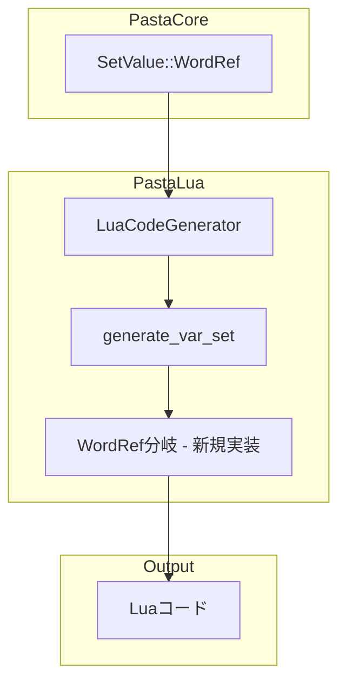

# 技術設計書

## Overview

本設計書は、pasta_lua トランスパイラーにおける `SetValue::WordRef` 構文のLuaコード生成機能を定義する。

**Purpose**: `＄変数＝＠単語` 形式のPasta DSL構文を `var.変数名 = act:word("単語名")` 形式のLuaコードに変換する機能を提供する。

**Users**: Pasta DSLを使用してゴースト会話スクリプトを作成する開発者が、単語参照結果を変数に代入する際に利用する。

**Impact**: 既存の `generate_var_set()` メソッド内の `SetValue::WordRef` 分岐を実装し、現在のエラー返却を正常なコード生成に置き換える。

### Goals

- `SetValue::WordRef` パターンのLuaコード生成を実装
- ローカル変数（`var.X`）・グローバル変数（`save.X`）の両スコープをサポート
- 既存の `SetValue::Expr` 処理との互換性を維持
- テストフィクスチャ `sample.lua` の期待値と一致するコードを生成

### Non-Goals

- Luaランタイム `act:word()` メソッドの実装（別仕様で対応）
- pasta_rune への横展開（廃止予定のため対象外）
- 単語名のエスケープ処理（XID識別子のため不要）
- Global変数WordRef代入のテストケース追加（既存テストで検証可能）

## Architecture

### Existing Architecture Analysis

**現行アーキテクチャ**:
- `LuaCodeGenerator` クラスが AST から Lua コードを生成
- `generate_var_set()` メソッドが `VarSet` ノードを処理
- `SetValue` 列挙型で代入値の種類を判別（`Expr` / `WordRef`）

**現行の制約**:
- `SetValue::WordRef` 分岐は `TranspileError::unsupported` を返却
- `Action::WordRef` は既に実装済み（同一パターンを踏襲可能）

**統合ポイント**:
- `generate_var_set()` メソッド内の `match &var_set.value` ブロック

### Architecture Pattern & Boundary Map



**Architecture Integration**:
- **Selected pattern**: 既存メソッド拡張（分岐追加）
- **Domain boundaries**: トランスパイラー層のコード生成責務内で完結
- **Existing patterns preserved**: `Action::WordRef` の実装パターンを踏襲
- **New components rationale**: 新規コンポーネント不要（既存メソッド内の分岐追加のみ）
- **Steering compliance**: pasta_lua 単独実装、型安全性維持

### Technology Stack

| Layer | Choice / Version | Role in Feature | Notes |
|-------|------------------|-----------------|-------|
| Backend | Rust 2024 edition | トランスパイラー実装言語 | 既存 |
| Parser | pasta_core | AST定義（SetValue列挙型） | 既存・変更なし |
| Code Generator | pasta_lua | Luaコード生成 | 拡張対象 |
| Test Framework | Rust test | 統合テスト | 既存 |

## Requirements Traceability

| Requirement | Summary | Components | Interfaces | Flows |
|-------------|---------|------------|------------|-------|
| 1.1 | WordRef基本生成 | LuaCodeGenerator | generate_var_set | VarSet処理 |
| 1.2 | ローカル変数WordRef | LuaCodeGenerator | generate_var_set | var.X = act:word |
| 1.3 | グローバル変数WordRef | LuaCodeGenerator | generate_var_set | save.X = act:word |
| 2.1 | Expr互換性維持 | LuaCodeGenerator | generate_var_set | 既存分岐維持 |
| 2.2 | 混在処理 | LuaCodeGenerator | generate_var_set | match式で分岐 |
| 3.1 | テスト期待値 | sample.lua | - | 文字列比較 |
| 3.2 | トランスパイルテスト | transpiler_integration_test | - | 期待値検証 |
| 3.3 | ランタイム非検証 | - | - | 対象外 |
| 4.1 | Args代入エラー | LuaCodeGenerator | generate_var_set | 既存エラー処理 |

## Components and Interfaces

### Component Summary

| Component | Domain/Layer | Intent | Req Coverage | Key Dependencies | Contracts |
|-----------|--------------|--------|--------------|------------------|-----------|
| LuaCodeGenerator | Transpiler | Luaコード生成 | 1.1-1.3, 2.1-2.2, 4.1 | pasta_core (P0) | Service |
| sample.lua | Test Fixture | 期待値定義 | 3.1 | - | - |
| transpiler_integration_test | Test | 検証 | 3.2-3.3 | LuaCodeGenerator (P0) | - |

### Transpiler Layer

#### LuaCodeGenerator

| Field | Detail |
|-------|--------|
| Intent | Pasta ASTからLuaソースコードを生成 |
| Requirements | 1.1, 1.2, 1.3, 2.1, 2.2, 4.1 |

**Responsibilities & Constraints**
- `VarSet` ノードを Lua の変数代入文に変換
- `SetValue::Expr` と `SetValue::WordRef` を適切に分岐処理
- `VarScope::Args` への代入はエラーを返却（既存動作維持）

**Dependencies**
- Inbound: Transpiler — VarSet ノード処理 (P0)
- Outbound: Writer — Lua コード出力 (P0)
- External: pasta_core::parser — AST 型定義 (P0)

**Contracts**: Service [x]

##### Service Interface

```rust
impl<'a, W: Write> LuaCodeGenerator<'a, W> {
    /// Generate variable assignment.
    ///
    /// # Behavior
    /// - VarScope::Local + SetValue::WordRef → `var.{name} = act:word("{word_name}")`
    /// - VarScope::Global + SetValue::WordRef → `save.{name} = act:word("{word_name}")`
    /// - VarScope::Local + SetValue::Expr → `var.{name} = {expr}` (既存)
    /// - VarScope::Global + SetValue::Expr → `save.{name} = {expr}` (既存)
    /// - VarScope::Args → TranspileError::InvalidAst (既存)
    fn generate_var_set(&mut self, var_set: &VarSet) -> Result<(), TranspileError>;
}
```

- **Preconditions**: `var_set` は有効な `VarSet` ノード
- **Postconditions**: 
  - 成功時: 適切なLuaコードが `self.writer` に出力される
  - 失敗時: `TranspileError` が返却される
- **Invariants**: 既存の `SetValue::Expr` 処理は変更されない

**Implementation Notes**
- Integration: `Action::WordRef` の既存実装パターン（L399-402）を踏襲
- Validation: 単語名はXID識別子のためエスケープ不要
- Risks: なし（既存パターンの単純な適用）

## Data Models

### Domain Model

**SetValue 列挙型（既存・変更なし）**:

```rust
pub enum SetValue {
    /// 式代入: ＄変数＝式
    Expr(Expr),
    /// 単語参照代入: ＄変数＝＠単語
    WordRef { name: String },
}
```

**VarSet 構造体（既存・変更なし）**:

```rust
pub struct VarSet {
    pub name: String,
    pub scope: VarScope,
    pub value: SetValue,
    pub span: Span,
}
```

### Logical Data Model

**生成コードパターン**:

| Input | Scope | Output |
|-------|-------|--------|
| `＄場所＝＠場所` | Local | `var.場所 = act:word("場所")` |
| `＄＊グローバル＝＠単語` | Global | `save.グローバル = act:word("単語")` |
| `＄場所＝10` | Local (Expr) | `var.場所 = 10` |
| `＄＊グローバル＝＠関数()` | Global (Expr) | `save.グローバル = SCENE:関数(ctx)` |

## Error Handling

### Error Strategy

**既存エラー処理を維持**:
- `VarScope::Args` への代入 → `TranspileError::InvalidAst`
- WordRef 分岐では新規エラーなし（正常なコード生成のみ）

### Error Categories and Responses

| Error Type | Condition | Response | Requirements |
|------------|-----------|----------|--------------|
| InvalidAst | Args変数への代入 | "Cannot assign to scene argument" | 4.1 |

## Testing Strategy

### Unit Tests

1. **WordRef Local代入テスト**: `SetValue::WordRef` + `VarScope::Local` → `var.X = act:word("Y")`
2. **WordRef Global代入テスト**: `SetValue::WordRef` + `VarScope::Global` → `save.X = act:word("Y")`
3. **既存Expr代入の互換性**: `SetValue::Expr` の既存動作が維持されること

### Integration Tests

1. **sample.pasta トランスパイル**: `＄場所＝＠場所` が `var.場所 = act:word("場所")` に変換
2. **期待値一致検証**: 生成コードと `sample.lua` の行単位比較
3. **混在処理**: 同一ファイル内の Expr/WordRef 両方の処理

### Existing Test Coverage

- `test_transpile_sample_pasta_line_comparison()`: 行単位の一致率テスト
- `test_transpile_reference_code_patterns()`: パターンカバレッジテスト

**Note**: 既存テストは実装後に自動的に合格する設計（期待値は既に `sample.lua` に記述済み）。

