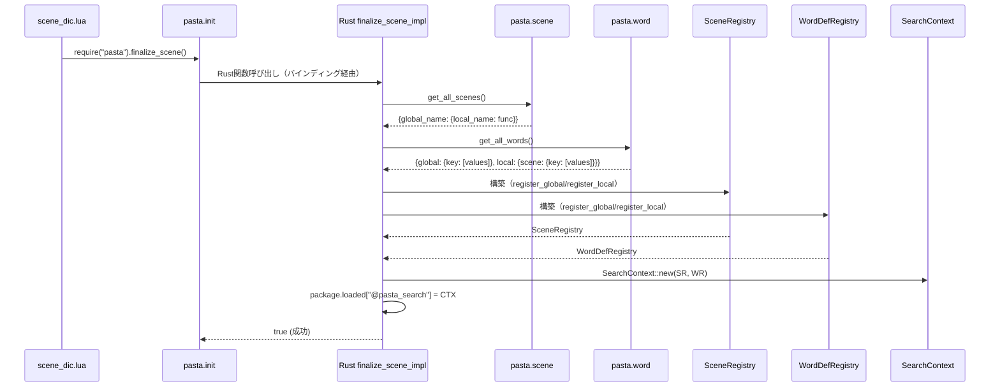
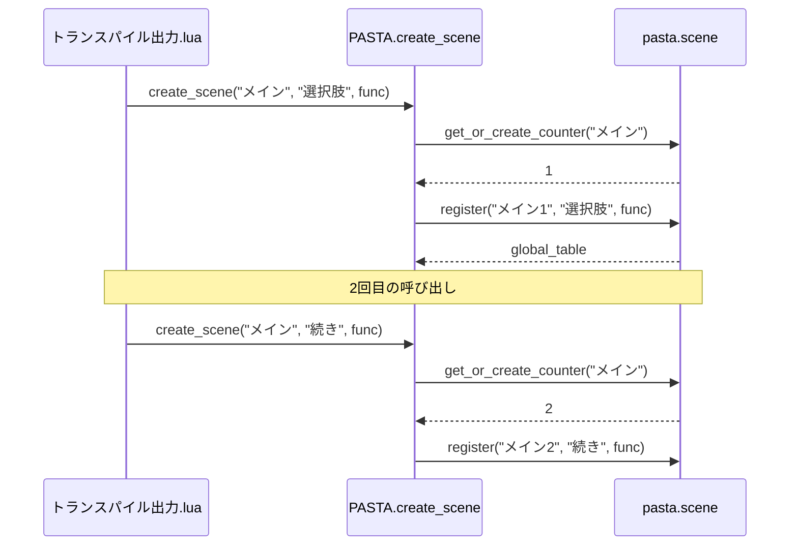

# Design Document

## Overview

**Purpose**: 本機能は `finalize_scene()` スタブを本実装に置き換え、Lua側レジストリから収集したシーン・単語情報を用いて SearchContext を構築する。

**Users**: ゴースト開発者がトランスパイル済み Lua コードからシーン/単語検索機能を利用可能にする。

**Impact**: トランスパイル時の Rust 側レジストリ構築を廃止し、Lua 実行時のレジストリ収集・SearchContext 構築に移行する。

### Goals

- Lua側 `pasta.scene` レジストリからシーン情報を収集
- 新規 `pasta.word` レジストリから単語情報を収集
- 収集データから `SceneRegistry` / `WordDefRegistry` を構築
- `SearchContext` を構築し `@pasta_search` モジュールとして登録
- シーン名カウンタをLua側で管理
- 単語辞書のビルダーパターン API を提供

### Non-Goals

- アクター辞書の実装（後続仕様で対応）
- パフォーマンス最適化（Rust移行は将来検討）
- 仕様分割（すべての要件を単一サイクルで実装）

## Architecture

### Existing Architecture Analysis

**現在のフロー**:
```
Pasta DSL → Transpiler → [Rust側 SceneRegistry/WordDefRegistry 構築] → SearchContext → Runtime
```

**変更後のフロー**:
```
Pasta DSL → Transpiler → Lua コード出力のみ
                            ↓
                    Lua 実行時にレジストリ登録
                            ↓
                    finalize_scene() 呼び出し
                            ↓
                    Rust関数がLua側レジストリ収集
                            ↓
                    SceneRegistry/WordDefRegistry/SearchContext 構築
```

**既存パターン**:
- UserData パターン: `SearchContext` が UserData として実装
- Module Registration パターン: `package.loaded` にモジュール登録
- Function Binding パターン: `lua.create_function()` で Rust 関数をバインド

### Architecture Pattern & Boundary Map

```mermaid
graph TB
    subgraph Transpiler
        DSL[Pasta DSL] --> CodeGen[LuaCodeGenerator]
        CodeGen --> LuaCode[Lua コード出力]
    end

    subgraph LuaRuntime
        LuaCode --> PastaScene[pasta.scene]
        LuaCode --> PastaWord[pasta.word]
        PastaScene --> SceneRegistry[シーンレジストリ]
        PastaWord --> WordRegistry[単語レジストリ]
    end

    subgraph RustRuntime
        SceneDicLua[scene_dic.lua] --> Finalize[finalize_scene]
        Finalize --> Collector[レジストリ収集]
        SceneRegistry --> Collector
        WordRegistry --> Collector
        Collector --> SceneReg[SceneRegistry]
        Collector --> WordReg[WordDefRegistry]
        SceneReg --> SearchCtx[SearchContext]
        WordReg --> SearchCtx
        SearchCtx --> PastaSearch[@pasta_search]
    end
```

**Architecture Integration**:
- 選択パターン: Hybrid Approach（Phase 1 インライン実装）
- ドメイン境界: Lua側レジストリ管理 ↔ Rust側検索装置構築
- 既存パターン保持: UserData, Module Registration, Function Binding
- 新規コンポーネント: `pasta.word` モジュール、`finalize_scene_impl` 関数

### Technology Stack

| Layer          | Choice / Version | Role in Feature                | Notes                             |
| -------------- | ---------------- | ------------------------------ | --------------------------------- |
| Backend        | Rust (mlua 0.10) | Lua ↔ Rust 連携                | `create_function()`, テーブル走査 |
| Script Runtime | Lua 5.4 (mlua)   | シーン/単語レジストリ管理      | `pasta.scene`, `pasta.word`       |
| Core Types     | pasta_core       | SceneRegistry, WordDefRegistry | 既存型をそのまま使用              |

## System Flows

### finalize_scene() 実行フロー



### シーン名カウンタ生成フロー



## Requirements Traceability

| Requirement | Summary                   | Components                                        | Interfaces                             | Flows                    |
| ----------- | ------------------------- | ------------------------------------------------- | -------------------------------------- | ------------------------ |
| 1.1-1.6     | Lua側シーン情報収集       | pasta.scene, finalize_scene_impl                  | get_all_scenes(), collect_scenes()     | finalize_scene実行フロー |
| 2.1-2.8     | 単語辞書情報収集          | pasta.word, LuaCodeGenerator, finalize_scene_impl | create_word():entry(), get_all_words() | finalize_scene実行フロー |
| 3.1-3.5     | SearchContext構築・登録   | finalize_scene_impl, search::register             | SearchContext::new(), register()       | finalize_scene実行フロー |
| 4.1-4.5     | Rust-Lua連携              | finalize_scene_impl, pasta.init                   | finalize_scene() binding               | finalize_scene実行フロー |
| 5.1-5.4     | 初期化タイミング制御      | runtime/mod.rs                                    | with_config()修正                      | -                        |
| 6.1-6.5     | エラーハンドリング        | finalize_scene_impl                               | LuaError, tracing                      | -                        |
| 7.1-7.3     | 将来拡張                  | finalize_scene_impl                               | 拡張ポイント設計                       | -                        |
| 8.1-8.6     | シーン名カウンタLua側管理 | pasta.scene, pasta.init                           | counter management                     | カウンタ生成フロー       |
| 9.1-9.6     | 単語辞書ビルダーAPI       | pasta.word                                        | create_word():entry()                  | -                        |

## Components and Interfaces

| Component               | Domain/Layer | Intent                                 | Req Coverage     | Key Dependencies                                         | Contracts |
| ----------------------- | ------------ | -------------------------------------- | ---------------- | -------------------------------------------------------- | --------- |
| finalize_scene_impl     | Runtime      | Lua側レジストリ収集・SearchContext構築 | 1, 2, 3, 4, 6, 7 | pasta.scene (P0), pasta.word (P0), search::register (P0) | Service   |
| pasta.scene (拡張)      | Lua Script   | シーンレジストリ + カウンタ管理        | 1.6, 8           | -                                                        | State     |
| pasta.word (新規)       | Lua Script   | 単語レジストリ + ビルダーAPI           | 2.3-2.5, 9       | -                                                        | State     |
| pasta.init (修正)       | Lua Script   | 公開API（finalize_scene置換対応）      | 4.1, 8.5         | pasta.scene (P0), pasta.word (P0)                        | API       |
| LuaCodeGenerator (修正) | Transpiler   | 単語定義Lua出力                        | 2.1, 2.2         | -                                                        | -         |
| runtime/mod.rs (修正)   | Runtime      | SearchContext初期構築削除              | 5                | -                                                        | -         |

### Runtime Layer

#### finalize_scene_impl

| Field        | Detail                                                     |
| ------------ | ---------------------------------------------------------- |
| Intent       | Lua側レジストリからデータ収集し SearchContext を構築・登録 |
| Requirements | 1.1-1.6, 2.6-2.8, 3.1-3.5, 4.2-4.5, 6.1-6.5, 7.1-7.3       |

**Responsibilities & Constraints**
- Lua側 `pasta.scene` レジストリから全シーン情報を収集
- Lua側 `pasta.word` レジストリから全単語情報を収集
- `SceneRegistry` / `WordDefRegistry` を構築
- `SearchContext` を構築し `@pasta_search` に登録
- エラー発生時は `LuaError` として伝播

**Dependencies**
- Inbound: scene_dic.lua → finalize_scene() 呼び出し (P0)
- Outbound: search::register() → SearchContext 登録 (P0)
- External: pasta.scene モジュール (P0), pasta.word モジュール (P0)

**Contracts**: Service [x] / State [ ]

##### Service Interface

```rust
/// Lua側レジストリからデータを収集し SearchContext を構築する
///
/// # Arguments
/// * `lua` - Luaインスタンス参照
///
/// # Returns
/// * `Ok(true)` - 構築成功
/// * `Err(LuaError)` - 構築失敗
fn finalize_scene_impl(lua: &Lua) -> LuaResult<bool>;

/// pasta.scene レジストリからシーン情報を収集
///
/// # Returns
/// * `Ok(Vec<(global_name, local_name)>)` - シーン情報リスト
/// * `Err(e)` - 収集エラー
fn collect_scenes(lua: &Lua) -> LuaResult<Vec<(String, String)>>;

/// pasta.word レジストリから単語情報を収集
///
/// # Returns
/// * `Ok(Vec<(key, values, is_local, scene_name)>)` - 単語情報リスト
/// * `Err(e)` - 収集エラー
fn collect_words(lua: &Lua) -> LuaResult<Vec<WordCollectionEntry>>;
```

- Preconditions: Lua側レジストリ（pasta.scene, pasta.word）がロード済み
- Postconditions: `@pasta_search` モジュールが登録され検索可能
- Invariants: 既存の `@pasta_search` がある場合は置換

**Implementation Notes**
- Integration: `package.loaded["pasta"]` の `finalize_scene` フィールドを Rust 関数で上書き
- Validation: レジストリが空の場合は警告ログを出力し空の SearchContext を構築
- Risks: Luaテーブル構造が想定外の場合のエラーハンドリング

### Lua Script Layer

#### pasta.scene (拡張)

| Field        | Detail                              |
| ------------ | ----------------------------------- |
| Intent       | シーンレジストリ管理 + カウンタ管理 |
| Requirements | 1.6, 8.1-8.6                        |

**Responsibilities & Constraints**
- 既存: シーン登録・取得機能
- 新規: ベース名ごとのカウンタ管理
- 新規: `get_all_scenes()` API で全シーン情報を返却

**Contracts**: State [x]

##### State Management

```lua
-- 内部状態
local registry = {}  -- {global_name: {__global_name__, local_name: func}}
local counters = {}  -- {base_name: counter}

-- 公開API
function SCENE.get_or_increment_counter(base_name)
    -- カウンタをインクリメントして返す
end

function SCENE.get_all_scenes()
    -- {global_name: {local_name: func}} 形式で返す
end
```

- 状態モデル: `registry` (シーン登録), `counters` (カウンタ)
- 永続性: Lua実行中のみ（永続化なし）
- 並行性: 単一スレッド（Lua VM）

#### pasta.word (新規)

| Field        | Detail                                   |
| ------------ | ---------------------------------------- |
| Intent       | 単語レジストリ管理 + ビルダーパターンAPI |
| Requirements | 2.3-2.5, 9.1-9.6                         |

**Responsibilities & Constraints**
- グローバル単語レジストリ（key → values[][]）
- ローカル単語レジストリ（scene_name → {key → values[][]}）
- ビルダーパターン API: `create_word(key):entry(...)`

**Contracts**: State [x]

##### State Management

```lua
-- 内部状態
local global_words = {}  -- {key: {{v1, v2}, {v3, v4}}}
local local_words = {}   -- {scene_name: {key: {{v1, v2}}}}

-- ビルダーオブジェクト
local WordBuilder = {}
WordBuilder.__index = WordBuilder

function WordBuilder:entry(...)
    -- 可変長引数を配列として追加
    return self  -- メソッドチェーン用
end

-- 公開API
function WORD.create_global(key)
    -- グローバル単語ビルダーを返す
end

function WORD.create_local(scene_name, key)
    -- ローカル単語ビルダーを返す
end

function WORD.get_all_words()
    -- {global: {...}, local: {...}} 形式で返す
end
```

- 状態モデル: `global_words`, `local_words`
- 永続性: Lua実行中のみ
- 並行性: 単一スレッド

#### pasta.init (修正)

| Field        | Detail                                   |
| ------------ | ---------------------------------------- |
| Intent       | 公開API更新（カウンタ対応、単語API追加） |
| Requirements | 4.1, 8.5, 9.1-9.2                        |

**Modifications**
- `create_scene()`: カウンタ管理を使用した番号付与
- `create_word()`: グローバル単語ビルダー返却
- `finalize_scene()`: スタブのまま（Rust側で上書き）

```lua
function PASTA.create_scene(base_name, local_name, scene_func)
    local counter = SCENE.get_or_increment_counter(base_name)
    local global_name = base_name .. counter
    if scene_func and local_name then
        SCENE.register(global_name, local_name, scene_func)
    end
    return SCENE.get_global_table(global_name) or SCENE.create_global_table(global_name)
end

function PASTA.create_word(key)
    return WORD.create_global(key)
end
```

### Transpiler Layer

#### LuaCodeGenerator (修正)

| Field        | Detail                                                |
| ------------ | ----------------------------------------------------- |
| Intent       | シーン/単語定義のLua出力コード修正                    |
| Requirements | 2.1, 2.2, 8.5                                         |
| Files        | `crates/pasta_lua/src/code_generator.rs`              |

**修正対象関数**:

1. **`generate_global_scene()`** (lines 162-221):
   - **現状**: `PASTA.create_scene("{module_name}")` 出力（カウンタ付き）
   - **変更後**: `PASTA.create_scene("{base_name}")` 出力（カウンタなし）
   - 行180-182の `module_name` を `scene.name` に変更
   - `scene_counter` パラメータは引き続き使用（ローカルシーン番号付けのため保持）

2. **`generate_local_scene()`** (lines 237-286):
   - 修正不要（ローカルシーン名の番号付けは既存ロジック維持）

3. **単語定義出力** (新規実装):
   - PastaFile の単語定義を走査し、`PASTA.create_word(key):entry(v1, v2, ...)` 出力
   - LocalSceneScope の単語定義を走査し、`SCENE:create_word(key):entry(v1, v2, ...)` 出力
   - ファイルレベル: グローバルスコープに出力（do block 外）
   - シーンレベル: ローカルシーン関数内に出力

**Output Format**:
```lua
-- ファイルレベル（do block 外）
PASTA.create_word("挨拶"):entry("こんにちは", "おはよう")

-- シーンレベル（ローカルシーン関数内）
function SCENE.__start__(act, ...)
    local args = { ... }
    local save, var = act:init_scene(SCENE)
    
    SCENE:create_word("選択肢"):entry("はい", "いいえ")
    
    -- 以降、アクション行など
end
```

**実装詳細**:
- `pasta_core::parser::PastaFile` に単語定義フィールドが存在するか確認（AST構造依存）
- 単語定義の AST ノード構造を確認し、適切な走査ロジックを実装
- カンマ区切り値のパース処理（grammar.pest の `words` ルールに従う）

### Runtime Modification

#### with_config() 修正

| Field        | Detail                       |
| ------------ | ---------------------------- |
| Intent       | SearchContext 初期構築の削除 |
| Requirements | 5.1-5.4                      |

**Changes**:
- `crate::search::register()` 呼び出しを削除
- `@pasta_search` モジュールは `finalize_scene()` で登録

```rust
// 削除する行（lines 160）
// crate::search::register(&lua, scene_registry, word_registry)?;
```

#### finalize_scene バインディング登録

**Location**: `from_loader_with_scene_dic()` または新規初期化関数

```rust
/// finalize_scene() の Rust 実装を pasta モジュールに登録
fn register_finalize_scene(lua: &Lua) -> LuaResult<()> {
    let finalize_fn = lua.create_function(|lua, ()| {
        finalize_scene_impl(lua)
    })?;
    
    let package: Table = lua.globals().get("package")?;
    let loaded: Table = package.get("loaded")?;
    let pasta: Table = loaded.get("pasta")?;
    pasta.set("finalize_scene", finalize_fn)?;
    
    Ok(())
}
```

## Data Models

### Domain Model

**シーンエントリ（Lua側収集形式）**:
```
SceneCollectionEntry {
    global_name: String     -- "メイン1"
    local_name: String      -- "__start__" または "__選択肢_1__"
    -- 関数参照はLua側で保持（Rust側では名前のみ必要）
}
```

**単語エントリ（Lua側収集形式）**:
```
WordCollectionEntry {
    key: String             -- "挨拶" (global) または ":メイン1:挨拶" (local)
    values: Vec<String>     -- ["こんにちは", "おはよう"]
}
```

### Logical Data Model

**Lua側シーンレジストリ構造**:
```
registry: Table
├── "メイン1": Table
│   ├── __global_name__: "メイン1"
│   ├── "__start__": function
│   └── "__選択肢_1__": function
└── "メイン2": Table
    ├── __global_name__: "メイン2"
    └── "__start__": function
```

**Lua側単語レジストリ構造**:
```
global_words: Table
├── "挨拶": Table
│   ├── [1]: {"こんにちは", "おはよう"}
│   └── [2]: {"やあ"}
└── "名前": Table
    └── [1]: {"太郎", "花子"}

local_words: Table
└── "メイン1": Table
    └── "選択肢": Table
        └── [1]: {"はい", "いいえ"}
```

## Error Handling

### Error Strategy

| Error Type        | Source                    | Response                  | Recovery         |
| ----------------- | ------------------------- | ------------------------- | ---------------- |
| Lua Table Access  | pasta.scene/word 取得失敗 | LuaError 返却             | 呼び出し元で処理 |
| Invalid Structure | 想定外のテーブル構造      | LuaError + 詳細メッセージ | ログ出力後エラー |
| SceneTable Build  | 重複シーン名              | LuaError + 原因           | エラー報告       |
| WordTable Build   | 構築失敗                  | LuaError + 原因           | エラー報告       |
| Empty Registry    | シーン/単語なし           | 警告ログ + 空Context      | 正常続行         |

### Monitoring

- `tracing::debug!`: 収集シーン数・単語数
- `tracing::warn!`: 空レジストリ、構造異常
- `tracing::info!`: SearchContext構築完了

## Testing Strategy

### Unit Tests

1. `pasta.scene` カウンタ管理テスト（Lua）
2. `pasta.word` ビルダーパターンテスト（Lua）
3. `collect_scenes()` シーン収集テスト（Rust）
4. `collect_words()` 単語収集テスト（Rust）
5. `finalize_scene_impl()` 統合テスト（Rust）

### Integration Tests

1. トランスパイル → Lua実行 → finalize_scene → 検索 E2E
2. 複数ファイル + シーン辞書統合テスト
3. 空レジストリでのエラーハンドリングテスト
4. 既存テスト + finalize_scene() 呼び出し追加

### Test Fixtures

- 既存 `tests/fixtures/` の Pasta ファイルを活用
- 新規: 単語定義を含むテストケース追加

## Migration Strategy

### 既存テスト影響範囲

**調査結果**: `PastaLuaRuntime::new/with_config/from_loader` の使用箇所を全調査（53箇所）

#### 修正が必要なテストファイル（@pasta_search使用テスト）

| ファイル                       | 使用箇所 | SearchContext 依存 | 修正方針                           |
| ------------------------------ | -------- | ------------------ | ---------------------------------- |
| `search_module_test.rs`        | 16箇所   | ✅ 全テストが依存  | 全テストに `finalize_scene()` 追加 |
| `stdlib_modules_test.rs` (一部) | 1箇所    | ✅ minimal config  | finalize_scene() 追加              |

**search_module_test.rs の修正パターン**:
```rust
// Before
let runtime = PastaLuaRuntime::new(ctx).unwrap();
let result: String = runtime.exec(r#"
    local SEARCH = require "@pasta_search"
    return SEARCH:search_scene("test")
"#).unwrap();

// After
let runtime = PastaLuaRuntime::new(ctx).unwrap();
runtime.exec(r#"require('pasta').finalize_scene()"#).unwrap();  // ← 追加
let result: String = runtime.exec(r#"
    local SEARCH = require "@pasta_search"
    return SEARCH:search_scene("test")
"#).unwrap();
```

#### 修正が不要なテストファイル（SearchContext 非依存）

| ファイル                      | 使用箇所 | SearchContext 依存 | 理由                               |
| ----------------------------- | -------- | ------------------ | ---------------------------------- |
| `pasta_lua_encoding_test.rs`  | 6箇所    | ❌ なし            | エンコーディングテストのみ         |
| `loader_integration_test.rs`  | 調査必要 | 不明               | ローダー統合テスト（要調査）       |
| `transpiler_integration_test.rs` | 調査必要 | 不明               | トランスパイラテスト（要調査）     |
| `stdlib_modules_test.rs`      | 17箇所   | ❌ ほぼなし        | assertions, testing, env テストのみ |
| `stdlib_regex_test.rs`        | 13箇所   | ❌ なし            | regex モジュールテストのみ         |
| `japanese_identifier_test.rs` | 調査必要 | 不明               | 識別子テスト（要調査）             |
| `ucid_test.rs`                | 調査必要 | 不明               | UCID テスト（要調査）              |

**次のアクション**:
- `loader_integration_test.rs`, `transpiler_integration_test.rs`, `japanese_identifier_test.rs`, `ucid_test.rs` の @pasta_search 使用有無を確認
- 確認後、修正不要テストリストを確定

### Rollback Plan

- `with_config()` の SearchContext 構築を復元
- `finalize_scene()` バインディング登録をスキップ
- 既存スタブ実装に戻る
