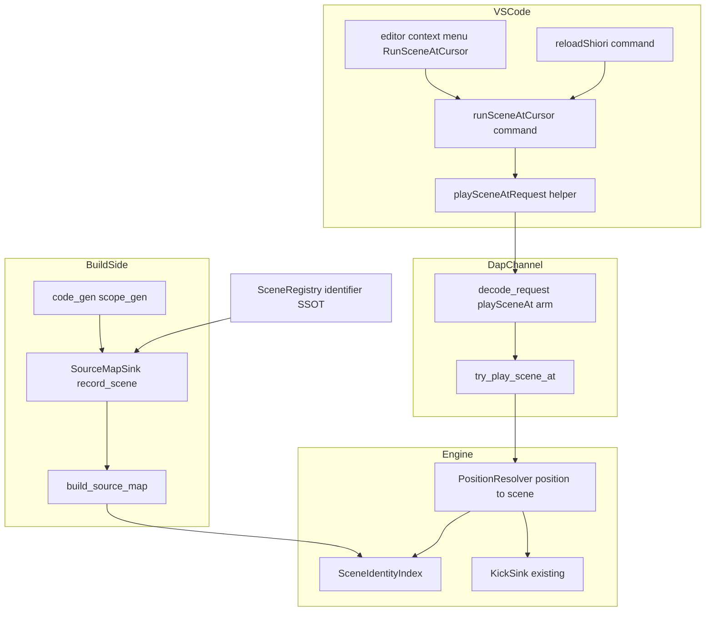
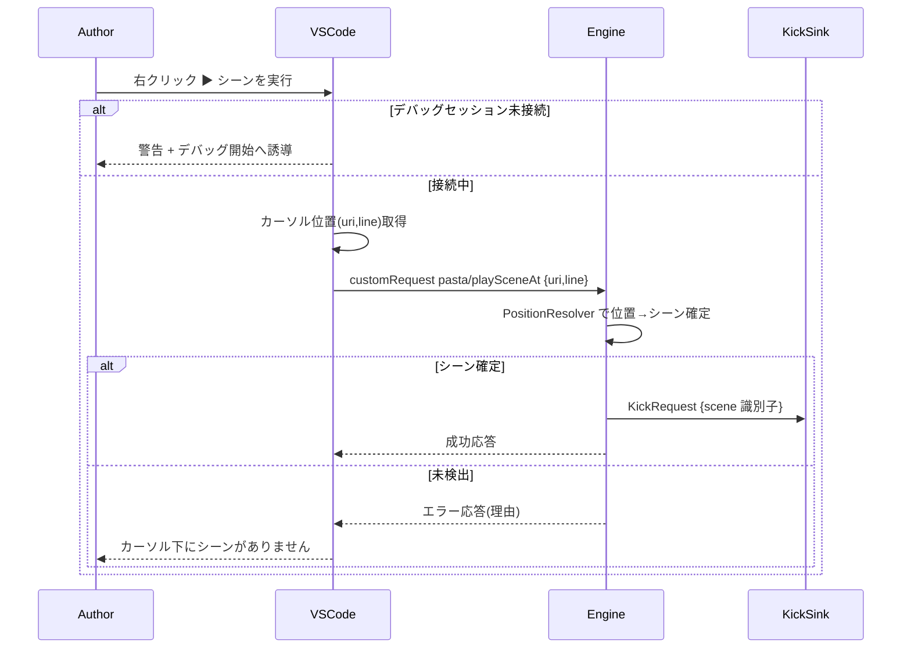
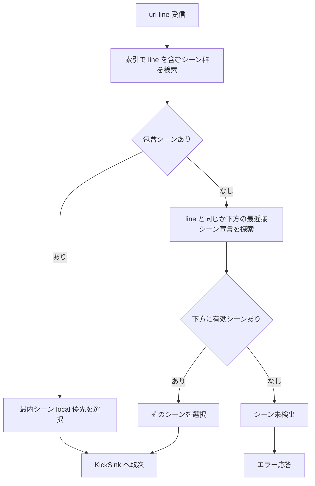
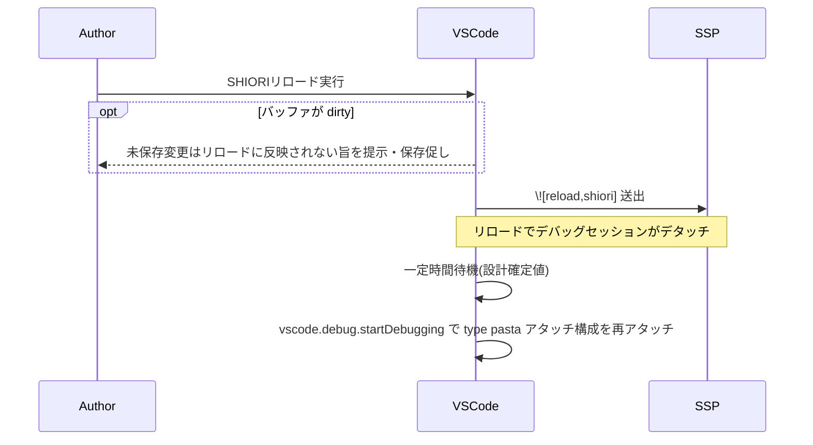

# 技術設計書: pasta-scene-kick-from-cursor

## Overview

本機能は、ゴースト作者が `.pasta` エディタ上の任意のシーン位置で右クリックし、コンテキストメニュー最上段の「▶ シーンを実行」を選ぶだけで、即時にそのシーンをライブ SSP で再生できる動線を確立する。作者が知り得ない内部識別子（サニタイズ済みシーン名）の手入力を完全に廃止し、作者が知っている「編集中ファイル上のカーソル位置」を起点とする。

エディタは位置 (uri + line) のみをエンジンへ送る。位置→シーンの確定は、トランスパイラと同一の `SceneRegistry` 由来情報を保持する実行中エンジン側が「動いているゴースト基準」で行い（案 B・エンジン解決）、確定したシーンを既存 kick backend（`pasta-scene-kick`）へ取り次ぐ。

**Impact**: 既存の `pasta.debug.playScene`（`showInputBox`）動線を廃止し、位置ベースの新動線 `pasta.runSceneAtCursor` に一本化する。ソースマップに「シーン同一性索引」（`.pasta` (file, 行範囲) → シーン識別子）を新設し、新カスタムリクエスト `pasta/playSceneAt`{uri, line} を既存 DAP チャネルに追加する。kick 実行本体のセマンティクスは変更しない。

### Goals
- 作者がカーソル位置を指すだけでシーンを再生できる（内部識別子の知識を一切要求しない）。
- 位置→シーンの確定をエンジン側で権威的に行い、エディタ側の重複実装による名前ドリフトを排除する。
- 既存の行マッピング機能を後方非破壊で維持しつつ、シーン同一性索引を追加する。
- 旧シーン名入力動線・旧外部トランスポートを完全に撤去し、シーンキックの作者向け動線を位置ベース一本に統一する。

### Non-Goals
- kick 実行本体のセマンティクス（co_scene 設置・preempt-and-abort・初回ビートのワンショット抑制突破・OnSecondChange シーン継続）の再設計（`pasta-scene-kick` を継承）。
- LSP（エディタ側）でのシーン解決（案 A・不採用）。
- 第三者拡張 Code Runner 連携（不採用）。
- SSTP・ライブ SSP 以外の出力先・別プレビュー画面。
- `*.pasta` 編集ウィンドウからのキック（別境界 `pasta-authoring-window`・将来）。

## Boundary Commitments

### This Spec Owns
- `.pasta` エディタの `editor/context` 右クリックメニュー最上段「▶ シーンを実行」項目と新コマンド `pasta.runSceneAtCursor`、ならびにそのカーソル位置 (uri, line) 取得・送信ロジック。
- 「SHIORIリロード」コマンド（右クリックメニュー＋デバッグツールバー）と、リロードによるデタッチ後の自動再アタッチ制御。
- 新カスタムリクエスト `pasta/playSceneAt`{uri, line} のワイヤフォーマットと、そのデコード・ディスパッチ・応答（成功／エラー）。
- エンジン側の位置→シーン解決ロジック（最内 local 優先・後方フォールバック・未検出判定）。
- ソースマップへの「シーン同一性索引」（`(pasta_file, 行範囲) → scene 識別子`）の追加と、トランスパイル時の `SceneRegistry` 由来シーン識別子・span の受け渡し経路。
- 旧 `pasta.debug.playScene` コマンド・`showInputBox` フロー・旧外部トランスポート `pasta/playScene`{scene 名} の撤去。

### Out of Boundary
- kick 実行セマンティクス（co_scene 設置・preempt-and-abort・OnSecondChange 継続）。`pasta-scene-kick` の `KickSink`/`KickRequest` をそのまま再利用する。
- 既存の行マッピング機能（`resolve_lua_to_pasta` / `resolve_pasta_to_lua` / `nearest_pasta_line_with_mapping`）の動作変更。索引を追加するのみ。
- SHIORI プロトコル実装、Lua ランタイム実装、ライブ SSP 描画機構。
- staleness を解消するための自動リロード（kick 経路内での `\![reload,shiori]` 自動送出は行わない。手動「SHIORIリロード」コマンドに一本化）。

### Allowed Dependencies
- `pasta-scene-kick`: `crates/pasta_lua/src/debug/kick.rs` の `KickRequest { scene: String }` / `KickSink = Arc<dyn Fn(KickRequest) + Send + Sync>`。確定済みシーン識別子を渡す内部取次点として再利用。
- `pasta-source-map`: `crates/pasta_lua/src/debug/source_map/mod.rs` の `SourceMap` / `ChunkSourceMap` / `PastaPos`。索引を追加する拡張対象。
- `pasta-vscode-lua-debug`: DAP カスタムリクエストチャネル（`decode_request` 分岐・`Decoded`・wiring ディスパッチ）。新リクエストを同チャネルに追加。
- `pasta-debug-lua-view-toggle`（`pasta/sourcePresentation`）: 4 層テンプレート（decode → wiring dispatch → VSCode command → pure helper）の前例として参照。
- `pasta_core::SceneRegistry`: シーン識別子（`fn_name` 等）の SSOT。索引の識別子はここ由来とし二重実装しない。

### Revalidation Triggers
- `KickRequest` / `KickSink` のシグネチャ変更（→ `pasta-scene-kick` 再検証）。
- `SourceMap` / `ChunkSourceMap` の既存公開 API（`resolve_*`）の挙動変更（→ `pasta-source-map` 消費者再検証）。
- `SceneRegistry` のシーン識別子生成規則（`sanitize_name` ＋連番）の変更（→ 索引整合の再検証）。
- DAP カスタムリクエストのワイヤフォーマット（`pasta/playSceneAt` の引数形）変更（→ VSCode 拡張・エンジン双方の再検証）。
- `editor/context` メニューの `when` 句・コマンド ID 変更（→ VSCode 拡張 UI 再検証）。

## Architecture

### Existing Architecture Analysis

本機能は既存 3 仕様の拡張・置換である。確認済みの現状アーキテクチャ:

- **DAP カスタムリクエスト 4 層**: `decode.rs::decode_request`（command 文字列で分岐、引数を `Decoded` へ載せる）→ `wiring/inbound.rs::handle_inbound`（固定順 A→B→C→D→E でディスパッチ、`try_*` ヘルパが `Some(bool)`/`None` を返す）→ VSCode `customRequest` → pure helper（vscode 非依存）。`pasta/sourcePresentation` と `pasta/playScene` が前例。
- **kick backend**: `try_play_scene_kick` が `sink(KickRequest { scene })` を呼ぶ（fire-and-forget）。`KickSink` は `enable()` 時にホストから注入され、`None` のとき経路は不活性。成功／エラー応答ビルダ（`play_scene_response` / `play_scene_error`）が既存。
- **ソースマップ**: producer 側 `SourceMapSink::record_line(lua_line, pasta_line)`（code_gen が各構文ヘッダ行で `record_span` を呼ぶ）。consumer 側 `SourceMap`（`chunks: HashMap<ChunkName, ChunkSourceMap>` ＋ `reverse` 索引）。loader の `build_source_map` が `.pasta` ごとに parse → sink attach → transpile → `finish(&shift)` → `insert_chunk` で集約し `Arc<SourceMap>` を構築。`enable()` が `Arc<SourceMap>` ＋ `KickSink` をブリッジスレッドへ供給。
- **SceneRegistry**: `SceneEntry { id, name, fn_path, fn_name, parent, attributes }`。識別子は `sanitize_name(name)` ＋連番で生成。**シーンの `.pasta` 上 span（行範囲）は保持していない**。

**重要な時系列制約**: シーン登録は Lua ランタイム（SHIORI finalize）で行われるのに対し、`.pasta` span は **code_gen 時**に `SourceMapSink` 経由で記録される。両者は別フェーズで発生するため、「span（code_gen 由来）と実シーン identity（ランタイム由来）の突合」をどこで行うかが本設計の中核論点である。**確定（Decision 1・案1: ランタイム権威キャプチャ）**: code_gen は base 名のみ出力し連番は Lua ランタイムが実行順に付与する（`scope_gen.rs:120`／`scene.lua:129` `create_scene` = `base_name .. counter`、例 `会話1`）。ランタイムの実シーンキーは `会話1` であり Rust `SceneRegistry` の `会話_1`（アンダースコア）と**形式が異なる**ため、SceneRegistry を識別子 SSOT とする突合は採らない。代わりに finalize（`runtime/finalize.rs::collect_scenes` が `STORE.scenes` から実 global_name を収集する箇所）で得られるランタイム実 identity を、code_gen が記録した span と join key で突合して索引を構築する（下記 Design Decision 1 / Open Questions OQ-1 参照）。

### Architecture Pattern & Boundary Map



**Architecture Integration**:
- **採用パターン**: 既存 DAP カスタムリクエスト 4 層テンプレートの踏襲（decode → wiring dispatch → VSCode command → pure helper）。新規性が低くリスクが小さい。
- **ドメイン境界**: build-side（索引構築）/ runtime（位置→シーン解決＋取次）/ transport（`pasta/playSceneAt`）/ VSCode UI（右クリック動線・リロード）の 4 つに分離。各境界は独立して実装可能。
- **保持する既存パターン**: 行マッピング API・kick sink 注入・`Decoded` 分岐・`try_*` ディスパッチ・pure helper の vscode 非依存。
- **新コンポーネントの根拠**: シーン同一性索引（行マッピングだけでは位置→シーンを確定できない）、位置→シーン解決器（最内優先・フォールバックの判定が必要）、新トランスポート（シーン名でなく位置を運ぶ専用口）。
- **依存方向**: `SceneRegistry`（識別子 SSOT）→ `SourceMapSink`（記録）→ `SourceMap`/`SceneIdentityIndex`（保持）→ `PositionResolver`（参照）→ `KickSink`（取次）。VSCode 層は DAP transport のみに依存し、エンジン内部型に依存しない。

### Technology Stack

| Layer | Choice / Version | Role in Feature | Notes |
|-------|------------------|-----------------|-------|
| Editor / UI | VSCode 拡張 (TypeScript) | `editor/context` 右クリック動線・リロード・再アタッチ | 既存 `editors/vscode` を拡張。新規 `editor/context` 貢献は本機能が初。 |
| Transport | DAP custom request (JSON) | `pasta/playSceneAt`{uri, line} の授受 | 既存 `pasta-vscode-lua-debug` チャネルに追加。 |
| Backend / Runtime | Rust (`pasta_lua`) | 位置→シーン解決・kick 取次・索引保持 | `debug` サブシステム。既定無効・ゼロコスト方針を維持。 |
| Build / Transpile | Rust (`pasta_lua` code_gen / loader, `pasta_core` registry) | シーン同一性索引の構築・識別子受け渡し | `SourceMapSink` 拡張＋`SceneRegistry` 識別子参照。 |

> 詳細な調査ノート・代替案比較は `research.md` を参照。

## File Structure Plan

### Directory Structure（変更箇所中心）
```
crates/pasta_lua/src/
├── debug/
│   ├── dap/decode.rs                 # [変更] pasta/playSceneAt arm 追加・応答ビルダ追加・旧 pasta/playScene arm 削除
│   ├── wiring/inbound.rs             # [変更] try_play_scene_at 追加・try_play_scene_kick(旧 pasta/playScene 外部口) 削除
│   ├── kick.rs                       # [不変] KickRequest/KickSink を再利用
│   ├── source_map/
│   │   ├── mod.rs                    # [変更] SceneIdentityIndex 保持・lookup API 追加(行マッピングは非破壊)
│   │   └── scene_index.rs            # [新規] SceneIdentityIndex 型と位置→シーン解決ロジック
│   └── position_resolver.rs          # [新規] (uri,line)→scene 確定(最内優先・後方フォールバック・未検出)
├── code_gen/
│   ├── source_map.rs                 # [変更] SourceMapSink に record_scene(scene_id, span) を追加
│   └── scope_gen.rs                  # [変更] global/local シーン生成時に record_scene を呼ぶ
└── loader/
    └── source_map_build.rs           # [変更] シーン索引を chunk へ集約し SourceMap へ受け渡し

crates/pasta_core/src/registry/
└── scene_registry.rs                 # [変更(Decision 1 採用案による)] 識別子参照口を露出 or 不変

editors/vscode/
├── package.json                      # [変更] runSceneAtCursor/reloadShiori コマンド・editor/context・debug/toolBar 貢献追加, 旧 playScene 貢献削除
└── src/
    ├── extension.ts                  # [変更] 新コマンド登録・旧 playScene 登録削除・再アタッチ制御
    ├── runSceneAtCursorRequest.ts    # [新規] pure helper: requestCommand='pasta/playSceneAt', setPayload(uri,line)
    ├── reloadShiori.ts               # [新規] pure helper: リロード送出さくらスクリプト生成・待機/再アタッチ方針
    └── playSceneRequest.ts           # [削除] 旧 pasta/playScene helper
```

### Modified Files
- `crates/pasta_lua/src/debug/dap/decode.rs` — `pasta/playSceneAt` および `pasta/reloadShiori` デコード arm と各応答ビルダ（`play_scene_at_*`）を追加。旧 `pasta/playScene` arm と `Decoded.kick_scene` を削除。
- `crates/pasta_lua/src/debug/wiring/inbound.rs` — `try_play_scene_at`（位置→シーン解決→既存 `KickSink`）と `try_reload_shiori`（エンジンが `\![reload,shiori]` をさくらスクリプト出力に載せる）を `handle_inbound` 固定順に追加。旧 `try_play_scene_kick`（外部 `pasta/playScene` 受理）を削除。
- `crates/pasta_lua/src/debug/source_map/mod.rs` — `SceneIdentityIndex` を `SourceMap`/`ChunkSourceMap` に保持させ、`scene_at(pasta_file, line)` 系 lookup を追加。既存 `resolve_*` は非破壊維持。
- `crates/pasta_lua/src/code_gen/source_map.rs` — `SourceMapSink` に `record_scene(scene_id: &str, span: Span)` を追加（デフォルト no-op で後方非破壊）。
- `crates/pasta_lua/src/code_gen/scope_gen.rs` — global/local シーン生成箇所で `record_scene` を呼び、シーン span と `SceneRegistry` 由来識別子を sink へ流す。
- `crates/pasta_lua/src/loader/source_map_build.rs` — chunk ごとのシーン索引を集約し `SourceMap` へ受け渡す。
- `crates/pasta_core/src/registry/scene_registry.rs` — （Decision 1 で採用案により）code_gen がシーン識別子を引ける参照口を露出、または不変。
- `editors/vscode/package.json` — 新コマンド `pasta.runSceneAtCursor`（`editor/context` `group: navigation@1`, `when: resourceLangId == pasta`）と `pasta.reloadShiori`（`editor/context` ＋ `debug/toolBar`、両方 `when: debugType == 'pasta'`）を追加。旧 `pasta.debug.playScene` の commands/menus 貢献を削除。
- `editors/vscode/src/extension.ts` — 新コマンド登録・カーソル位置取得・`customRequest('pasta/playSceneAt', ...)` 送信・セッション未接続時の警告/誘導・リロード送出と自動再アタッチ。旧 `registerPlaySceneCommand` を削除。

## System Flows

### カーソル位置からのシーン実行（成功・未検出・未接続）



### 位置→シーン解決の判定ロジック



> シーンの行範囲は「宣言行〜次の同レベル以上のシーン宣言の直前」と定義する（2.1）。最内優先は包含確定を後方フォールバックに優先する（2.2 > 2.5）。

### SHIORIリロードと自動再アタッチ



## Requirements Traceability

| Requirement | Summary | Components | Interfaces | Flows |
|-------------|---------|------------|------------|-------|
| 1.1 | 右クリック最上段に項目表示 | RunSceneAtCursor (VSCode) | package.json `editor/context` navigation@1 | カーソル実行 |
| 1.2 | カーソル位置 (uri,line) 取得 | RunSceneAtCursor | `vscode.window.activeTextEditor.selection` | カーソル実行 |
| 1.3 | 位置を新トランスポートで送信 | RunSceneAtCursor, PlaySceneAt transport | `pasta/playSceneAt` customRequest | カーソル実行 |
| 1.4 | シーン名手入力を要求しない | RunSceneAtCursor | (showInputBox 不使用) | カーソル実行 |
| 1.5 | 確定シーンをライブ SSP 再生 | PositionResolver, KickSink | `KickRequest` | カーソル実行 |
| 2.1 | 行範囲でシーン確定 | SceneIdentityIndex, PositionResolver | `scene_at` lookup | 解決ロジック |
| 2.2 | 最内 local 優先 | PositionResolver | 解決アルゴリズム | 解決ロジック |
| 2.3 | 確定シーンを kick 取次点へ | PositionResolver, KickSink | `KickRequest` | カーソル実行 |
| 2.4 | 解決はエンジン側で実施 | PositionResolver | (エンジン内) | 解決ロジック |
| 2.5 | 後方フォールバック | PositionResolver | `nearest scene at or below` | 解決ロジック |
| 2.6 | 未検出時は再生せず提示 | PositionResolver, PlaySceneAt transport | error 応答 | 解決ロジック |
| 3.1 | (file,行範囲)→識別子を索引記録 | SourceMapSink, scope_gen | `record_scene(scene_id, span)` | (build) |
| 3.2 | 逆引き索引を提供 | SceneIdentityIndex | `scene_at` API | 解決ロジック |
| 3.3 | 識別子を SceneRegistry 由来に一致 | scope_gen, SceneRegistry | 識別子参照 | (build) |
| 3.4 | 行マッピングを後方非破壊維持 | SourceMap | `resolve_*` 不変 | (build) |
| 4.1 | 位置を既存チャネルで授受 | PlaySceneAt transport | `pasta/playSceneAt` | カーソル実行 |
| 4.2 | 成功応答 | decode, wiring | `play_scene_at_response` | カーソル実行 |
| 4.3 | エラー応答(理由) | decode, wiring | `play_scene_at_error` | カーソル実行 |
| 4.4 | 入力はシーン名でなく位置 | decode | `{uri, line}` payload | カーソル実行 |
| 5.1 | 旧 playScene コマンド削除 | extension.ts, package.json | (削除) | — |
| 5.2 | パレット/ツールバーからの名前入力廃止 | package.json | (削除) | — |
| 5.3 | 位置ベースを唯一の動線に | RunSceneAtCursor | — | カーソル実行 |
| 5.4 | 旧外部トランスポート撤去 | decode, wiring, playSceneRequest.ts | (削除) | — |
| 5.5 | 内部 kick 取次点は保持 | KickSink, PositionResolver | `KickRequest` | カーソル実行 |
| 6.1 | 項目は .pasta なら常時表示 | package.json | `when: resourceLangId == pasta` | カーソル実行 |
| 6.2 | 未接続時は送らず警告/誘導 | extension.ts | `isPastaSession` 判定 | カーソル実行 |
| 6.3 | 誘導でデバッグ開始 | extension.ts | `vscode.debug.startDebugging` | カーソル実行 |
| 6.4 | エラー応答を提示 | extension.ts | showErrorMessage | カーソル実行 |
| 7.1 | ロード済み辞書で解決 | PositionResolver, SourceMap | (ロード時索引) | 解決ロジック |
| 7.2 | staleness 時はリロード誘導 | extension.ts, PositionResolver | (Decision 4) | リロード |
| 7.3 | kick 経路で自動リロードしない | wiring | (送出なし) | — |
| 7.4 | dirty バッファは保存促し | reloadShiori (VSCode) | `editor.document.isDirty` | リロード |
| 7.5 | staleness 検知方式は設計確定 | (Decision 4) | — | — |
| 7.6 | 解決不能なら未検出扱い | PositionResolver | error 応答 | 解決ロジック |
| 8.1 | kick セマンティクス継承 | KickSink | `KickRequest`(不変) | カーソル実行 |
| 8.2 | SHIORI/3.0・OnSecondChange≤1s 維持 | wiring | (取次は fire-and-forget) | — |
| 8.3 | GET ブロックを短く維持 | wiring, PositionResolver | (索引 lookup は O(log n)) | — |
| 9.1 | リロードコマンドを両所に提供 | reloadShiori, package.json | `editor/context`＋`debug/toolBar` | リロード |
| 9.2 | `\![reload,shiori]` 送出 | reloadShiori | さくらスクリプト送出 | リロード |
| 9.3 | デタッチ後に自動再アタッチ | extension.ts | `vscode.debug.startDebugging` | リロード |
| 9.4 | 待機/リトライ/再実行方式は設計確定 | (Decision 5) | — | リロード |
| 9.5 | リロードの表示/有効化条件は設計確定 | (Decision 5) | `when` 句 | リロード |

## Components and Interfaces

| Component | Domain/Layer | Intent | Req Coverage | Key Dependencies | Contracts |
|-----------|--------------|--------|--------------|------------------|-----------|
| SceneIdentityIndex | Build/Runtime data | (file,行範囲)→scene 識別子 の逆引き索引 | 3.1, 3.2, 2.1 | SourceMapSink (P0) | State |
| PositionResolver | Runtime | (uri,line)→scene 確定(最内優先・フォールバック・未検出) | 2.1-2.6, 7.1, 7.6 | SceneIdentityIndex (P0), KickSink (P0) | Service |
| SourceMapSink 拡張 | Build | code_gen からシーン識別子+span を記録 | 3.1, 3.3, 3.4 | SceneRegistry (P0) | Service |
| PlaySceneAt transport | Transport | `pasta/playSceneAt`{uri,line} の decode/dispatch/応答 | 4.1-4.4, 2.6 | decode/wiring (P0) | API |
| RunSceneAtCursor | VSCode UI | 右クリック動線・カーソル位置送信・未接続誘導 | 1.1-1.4, 5.1-5.3, 6.1-6.4 | PlaySceneAt transport (P0) | API |
| ReloadShiori | VSCode UI | SHIORI リロード送出＋自動再アタッチ | 9.1-9.5, 7.2, 7.4 | VSCode debug API (P0) | API |

### Build / Runtime データ層

#### SceneIdentityIndex

| Field | Detail |
|-------|--------|
| Intent | `.pasta` (file, 行範囲) → シーン識別子の逆引き索引を保持し、位置から所属シーンを返す |
| Requirements | 3.1, 3.2, 2.1 |

**Responsibilities & Constraints**
- `.pasta` ファイル単位で、各シーンの行範囲 `[start_line, end_line)` と識別子（`SceneRegistry` 由来 `fn_name` 等）の対応を保持する。
- 行範囲は「宣言行〜次の同レベル以上のシーン宣言の直前」と定義（2.1）。global 内に local が入れ子になる階層関係を表現できること。
- ロード済みソースマップ（実行中エンジンが保持する `Arc<SourceMap>`）の一部として存在し、既存の行マッピングと共存する（3.4 非破壊）。
- lookup は SHIORI GET 処理ブロックを延ばさないため O(log n) 級（行範囲を昇順 `BTreeMap` 等で保持）であること（8.3）。

**Dependencies**
- Inbound: PositionResolver — 位置→シーン確定で参照 (P0)
- Inbound: build_source_map — chunk 集約時に構築・受け渡し (P0)
- External: なし

**Contracts**: State [x]

##### State Management
- State model: `pasta_file -> ordered map(start_line -> SceneSpan { end_line, scene_id, parent_scene_id })`。最内判定のため `parent_scene_id`（または入れ子レベル）を保持。
- Persistence & consistency: ロード時に一度構築され、リロードまで不変（イミュータブル）。staleness はロード時版とディスク版の差として扱う（Decision 4）。
- Concurrency strategy: `Arc<SourceMap>` 内に同梱され読み取り専用で共有。

**Implementation Notes**
- Integration: producer は `SourceMapSink::record_scene`、集約は `build_source_map`、所有は `Arc<SourceMap>`（`enable()` でブリッジへ供給）。
- Validation: 識別子は `SceneRegistry` 生成結果と一致すること（3.3）。行範囲が重なる場合（global ⊃ local）は最内が一意に決まること。
- Risks: end_line（範囲終端）の確定。終端は「次の同レベル以上のシーン宣言の直前」。最後のシーンの終端はファイル末尾（または chunk 末尾）。

#### SourceMapSink 拡張（record_scene）

| Field | Detail |
|-------|--------|
| Intent | code_gen がシーン識別子と `.pasta` span を sink へ流し、索引を構築可能にする |
| Requirements | 3.1, 3.3, 3.4 |

**Responsibilities & Constraints**
- 既存 `record_line(lua_line, pasta_line)` / `record(lua_line, span)` を一切変更しない（3.4）。
- 新メソッド `record_scene(scene_id, span)` をデフォルト実装 no-op で追加し、既存 sink 実装を後方非破壊にする。
- 識別子は `SceneRegistry` の生成規則と一致させる（`sanitize_name` ＋連番を二重実装しない・3.3）。

**Contracts**: Service [x]

##### Service Interface
```rust
pub trait SourceMapSink {
    fn record_line(&mut self, lua_line: u32, pasta_line: u32);        // 既存・不変
    fn record(&mut self, lua_line: u32, span: Span) { /* 既存・不変 */ }
    // 追加: デフォルト no-op で後方非破壊。
    // 連番付き最終 identity は code_gen 時点では未確定のため、ここでは
    // join key（base 名 + 出現順 など、finalize 側と再現可能な決定的キー）と span を記録する。
    fn record_scene(&mut self, _scene_join_key: &str, _span: Span) {}
}
```
- Preconditions: `scene_join_key` は code_gen と finalize の双方で決定的に再現できる突合キー（例: `sanitize_name(base) + 出現順`）。連番付き実 identity（`会話1`）はここでは未確定。`span` はシーン宣言の行範囲を含む。
- Postconditions: ビルダ実装（`MapBuilderSink`）が当該シーンの (start_line, end_line, scene_join_key) を蓄積。最終 identity は finalize の join で付与される。
- Invariants: 行マッピングの記録内容・順序は不変。

**Implementation Notes**
- Integration: `scope_gen.rs` の global/local シーン生成箇所（既存 `record_span(scene.span)` 近傍）で `record_scene` を併せて呼ぶ。end_line は次シーン宣言検出時、または finish 時に確定。
- Join（Decision 1・案1）: `runtime/finalize.rs::collect_scenes` がランタイム実 global_name（`会話1`）を列挙する際、同じ join key で span 側と突合し、(file, 行範囲) → 実 identity の索引を確定させる。code_gen 側で連番を再実装しない（形式ドリフト回避）。
- Validation: 索引の identity がランタイム実シーンテーブルおよび `@pasta_search:search_scene` の解決対象と一致すること（impl 時に search_scene のキー仕様と整合確認＋特性化テスト）。join key の決定性（ソース出現順＝ランタイム create_scene 実行順、跨ファイルは load 順）を特性化テストで固定。
- Risks: 入れ子（global ⊃ local）の範囲確定とレベル情報の受け渡し。跨ファイル同名 base の load 順依存。

### Runtime 層

#### PositionResolver

| Field | Detail |
|-------|--------|
| Intent | (uri, line) を SceneIdentityIndex で解決し、確定シーン識別子を kick 取次点へ渡す |
| Requirements | 2.1-2.6, 7.1, 7.6, 1.5, 2.3 |

**Responsibilities & Constraints**
- 入力 (uri, line) を `.pasta` ファイルパス＋行番号へ正規化（uri スキーム→ファイルパス、索引キーとの照合）。
- 包含するシーンが複数（global ⊃ local）の場合は最内（local 優先）を選択（2.2）。
- 包含シーンが無い場合は、同じか下方（より大きい行番号）の最近接有効シーン宣言を選択（後方フォールバック・2.5）。下方に無ければ未検出（2.6, 7.6）。
- 確定後は既存 `KickSink`（`pasta-scene-kick`）を `KickRequest { scene: 識別子 }` で呼ぶ（fire-and-forget、セマンティクス継承・8.1）。
- 解決はロード済み索引に基づく（7.1）。

**Dependencies**
- Inbound: PlaySceneAt transport (try_play_scene_at) — 解決要求 (P0)
- Outbound: SceneIdentityIndex — lookup (P0)
- Outbound: KickSink — 確定シーンの取次 (P0)

**Contracts**: Service [x]

##### Service Interface
```rust
/// uri を正規化したファイルパス + 1-based 行番号で解決
pub enum ResolveError { NotFound }
pub fn resolve_scene_at(
    index: &SceneIdentityIndex,
    pasta_file: &str,
    line: u32,
) -> Result<String /* scene_id */, ResolveError>;
```
- Preconditions: `index` はロード済み（ロード時版）。`line` は 1-based。
- Postconditions: 成功時は `SceneRegistry` 由来の識別子。失敗時は `NotFound`。
- Invariants: lookup は索引を変更しない（読み取り専用）。GET ブロックを延ばさない（8.3）。

**Implementation Notes**
- Integration: `try_play_scene_at`（wiring）から呼ばれ、成功なら `sink(KickRequest { scene })` ＋ 成功応答、`NotFound` ならエラー応答。
- Validation: 最内優先 > 後方フォールバックの優先順位（2.2 > 2.5）。フォールバック対象が無いときのみ未検出（2.6）。
- Risks: uri→ファイルパス正規化（Windows パス・URI エンコード・chunk 名との対応）。staleness による誤解決（Decision 4・OPEN QUESTION）。

### Transport 層

#### PlaySceneAt transport

| Field | Detail |
|-------|--------|
| Intent | `pasta/playSceneAt`{uri, line} の decode・wiring ディスパッチ・成功/エラー応答 |
| Requirements | 4.1-4.4, 2.6 |

**Contracts**: API [x]

##### API Contract
| Direction | Command | Request | Response (success) | Response (error) |
|-----------|---------|---------|--------------------|------------------|
| VSCode→Engine | `pasta/playSceneAt` | `{ uri: string, line: number }` | `{ success: true }` | `{ success: false, message: string }` |

- `decode.rs`: `"pasta/playSceneAt"` arm を追加。`args.uri`（string）と `args.line`（number, 1-based）を strict parse し `Decoded` へ載せる。旧 `"pasta/playScene"` arm と `Decoded.kick_scene` を削除（5.4）。
- `wiring/inbound.rs`: `try_play_scene_at` を `handle_inbound` 固定順に追加。`PositionResolver` を呼び、成功→`play_scene_at_response`、`NotFound`→`play_scene_at_error("カーソル下にシーンがありません")`。
- 応答ビルダ `play_scene_at_response(request_seq)` / `play_scene_at_error(request_seq, message)` を既存 `play_scene_*` 同型で追加。

**Implementation Notes**
- Integration: 既存 `pasta/sourcePresentation` の 4 層パターンに正確に倣う。
- Validation: `line` の型・範囲（1-based, 正数）。`uri` の非空。
- Risks: 旧 `pasta/playScene` 撤去に伴う後方互換（Decision 3：内部取次は `KickSink` のままで外部口のみ撤去）。

### VSCode UI 層

#### RunSceneAtCursor（summary + note）

`editor/context` `group: navigation@1`・`when: resourceLangId == pasta` で「▶ シーンを実行」を常時表示（1.1, 6.1）。コマンドは `vscode.window.activeTextEditor` から (uri, line=selection.active.line+1) を取得（1.2）、`isPastaSession` で接続判定。未接続なら送らず警告＋「デバッグ開始」アクション（`vscode.debug.startDebugging`）へ誘導（6.2, 6.3）。接続中は `customRequest('pasta/playSceneAt', { uri, line })`（1.3, 5.3）。エラー応答は `showErrorMessage` で提示（6.4）。`showInputBox` は使用しない（1.4）。pure helper `runSceneAtCursorRequest.ts`（`requestCommand`, `setPayload(uri, line)`）を vscode 非依存で実装。旧 `pasta.debug.playScene` 登録・`playSceneRequest.ts` を削除（5.1, 5.2）。

**Implementation Notes**
- Integration: `extension.ts` の登録パターンは `toggleSourcePresentation` に倣う。
- Validation: `activeTextEditor` 不在時の防御。
- Risks: 「デバッグ開始」誘導の具体的起動手段（`launch.json` 構成参照・自動アタッチ可否）は OPEN QUESTION（Decision 5 関連）。

#### ReloadShiori（summary + note）

`editor/context` ＋ `debug/toolBar` 両方に「SHIORIリロード」を提供し、いずれも `when: debugType == 'pasta'`（接続中のみ表示・Decision 5 ④）（9.1, 9.5）。実行時、dirty バッファがあれば未保存変更が反映されない旨を提示し保存を促す（7.4）。新カスタムリクエスト `pasta/reloadShiori` を送り、**エンジンが `\![reload,shiori]`（SHIORI のみ・非同期）をさくらスクリプト出力として吐く**（9.2・Decision 5 ①）。リロードでデバッグセッションがデタッチされるため、「リロード指示→数秒待機→`vscode.debug.startDebugging`（`type: 'pasta'`）でアタッチ試行→失敗なら短間隔リトライ（上限/タイムアウト付き）」で自動再アタッチ（9.3, 9.4・Decision 5 ②）。再アタッチ完了後のキック自動再実行は v1 では行わない（手動再キック・Decision 5 ③）。pure helper `reloadShiori.ts` にさくらスクリプト生成・待機/再アタッチ方針を集約。

**Implementation Notes**
- Integration: 送出は `pasta/reloadShiori` カスタムリクエスト → エンジンが `\![reload,shiori]` を応答出力に載せる（decode/wiring に arm を追加）。SSP への直送はしない。
- Validation: 再アタッチのアタッチ構成特定（既定 `type: 'pasta'`）。リトライ上限/タイムアウトの具体値は実装時に調整。
- Risks: リロード非同期完了とアタッチ試行の競合 → リトライで吸収。

## Error Handling

### Error Strategy
- **未接続**（6.2）: 要求を送らず、警告＋デバッグ開始誘導アクションを提示。エンジンへは到達しない。
- **シーン未検出**（2.6, 7.6, 4.3）: エンジンが `NotFound` を返し、`play_scene_at_error` でエラー応答。VSCode は「カーソル下にシーンがありません」を提示。再生は行わない。
- **staleness**（7.2）: ロード済み索引で解決するため、未リロード時は誤解決の可能性。v1 はエディタ側 dirty 検知でkick時に警告（保存＋リロード推奨）し、エンジンは best-effort 解決＋未解決は未検出扱い（7.6）を安全網とする（Decision 4）。保存済み未リロードの mtime/ハッシュ照合は将来拡張。
- **再アタッチ失敗**（9.x）: 待機後の `startDebugging` 失敗時の扱い（リトライ/タイムアウト）は Decision 5（OPEN QUESTION）。

### Error Categories and Responses
- User Errors: カーソルがシーン外（未検出提示）、未接続（誘導）、dirty バッファ（保存促し）。
- System Errors: `customRequest` 例外（`showErrorMessage`）。再アタッチ失敗（誘導/リトライ）。
- Business Logic Errors: なし（位置→シーンは決定的）。

### Monitoring
既存 debug サブシステムの `@pasta_log` 経路を流用。位置→シーン解決の結果（確定識別子 or 未検出）と要求受理をログ出力（既存ログ規約に従う）。

## Testing Strategy

### Unit Tests
- `PositionResolver`: 包含1件→確定 / global⊃local→最内(local)選択(2.2) / シーン外→後方フォールバック(2.5) / 最終シーン後→未検出(2.6) / 空ファイル→未検出。
- `SceneIdentityIndex`: 行範囲確定（宣言行〜次の同レベル以上宣言の直前・2.1）/ 入れ子レベルの保持 / 識別子が `SceneRegistry` 生成結果と一致(3.3)。
- `decode.rs`: `pasta/playSceneAt` の strict parse（uri/line 型・範囲）/ 旧 `pasta/playScene` arm 不在の確認(5.4)。
- pure helper（`runSceneAtCursorRequest.ts`）: `setPayload(uri,line)` の形・`requestCommand` 文字列一致。

### Integration Tests
- transport 往復: `try_play_scene_at` 成功→`play_scene_at_response`＋`KickSink` 呼出 / 未検出→`play_scene_at_error`(4.2, 4.3)。
- build→runtime: `.pasta` を transpile→索引構築→ロード→位置解決が `SceneRegistry` 識別子に一致(3.1, 3.3)。
- 後方非破壊: 既存 `resolve_lua_to_pasta`/`resolve_pasta_to_lua` の挙動不変（索引追加後・3.4）。
- kick セマンティクス継承: 確定識別子で既存 `KickSink` 経由となること（同 sink 使用・8.1）。

### E2E / UI Tests（VSCode）
- 右クリック→「▶ シーンを実行」最上段表示（`resourceLangId==pasta`・1.1, 6.1）。
- 未接続→警告＋デバッグ開始誘導（6.2, 6.3）。
- シーン位置で実行→ライブ SSP 再生（1.5）。
- SHIORIリロード→デタッチ→自動再アタッチ（9.1-9.3）。dirty 時の保存促し（7.4）。

### Performance
- 索引 lookup が SHIORI GET 処理ブロックを延ばさない（O(log n) 級・8.3）。OnSecondChange ≤1 秒維持（8.2、kick セマンティクス継承で自然達成）。

## Open Questions / Risks

以下は要件・research を超える設計判断が必要な項目。design-discussion フェーズで解決する（暫定方針は best-effort で本設計に反映済み・明示ラベル付き）。

- **OQ-1（Decision 1: span と識別子の突合箇所）→ 解決済み: 案1（ランタイム権威キャプチャ）**。code_gen は base 名のみ出力し、連番は Lua ランタイムが実行順に付与する（`scope_gen.rs:120`／`scene.lua:129`）。ランタイム実キー `会話1` は Rust `SceneRegistry` の `会話_1` と形式が異なるため、SceneRegistry を識別子 SSOT とする旧 Option C/A は**不採用**。代わりに finalize（`runtime/finalize.rs::collect_scenes`）でランタイム実 identity を列挙し、code_gen が記録した span と join key（base+出現順）で突合して (file, 行範囲) → 実 identity 索引を構築する。形式ドリフト・順序推測を排し『動いているゴーストが権威』(案B)と一貫。索引の値は `@pasta_search:search_scene` の解決対象と揃える（impl 時に整合検証＋特性化テスト）。
- **OQ-2（Decision 4: staleness 検知方式）→ 解決済み: v1 はエディタ側 dirty 検知＋best-effort 解決**。kick 実行時、VSCode 拡張がアクティブバッファの `isDirty`（未保存）を確認し、未保存なら「実行中ゴーストと実態がずれる可能性。保存＋SHIORIリロードを推奨」を警告する（最頻 staleness ＝編集中を安価に捕捉。エンジン無改修）。これに加え、エンジン側はロード済み索引で best-effort 解決し、解決不能は未検出扱い（7.6）を安全網とする。**保存済み・未リロード**を捕捉するエンジン側 mtime/ハッシュ照合は v1 スコープ外（YAGNI）とし、将来拡張に回す。要件 7.4（リロード時 dirty 保存促し）と同じ dirty 信号を kick 経路でも用いて一貫させる。
- **OQ-3（Decision 5: 再アタッチ詳細）→ 解決済み**:
  - **① 送出経路**: 新カスタムリクエスト `pasta/reloadShiori` を介し、エンジンが `\![reload,shiori]` を**さくらスクリプト出力**として吐く（SSP は次 GET で受けてリロード）。さくらスクリプトは SHIORI 応答経由でしか SSP に届かないため、拡張から SSP へ直送はしない。
  - **② 待機＋再アタッチ**: 「リロード指示 → 数秒待機 → アタッチ試行、失敗なら短間隔リトライ（上限/タイムアウト付き）」。固定1回ではなくリトライで堅牢化。
  - **③ キック自動再実行**: v1 はしない（再アタッチ後に作者が手動で再キック）。デタッチ跨ぎの保留キック状態管理を避け予測可能性優先。
  - **④ 表示/有効化条件**: 接続中のみ（`when: debugType == 'pasta'`）。リロードは動作中 SHIORI への操作のため。kick 項目の常時表示とは前提が異なる。
- **OQ-4（デバッグ開始誘導の具体手段）**: 6.3 の「デバッグ開始」アクションが `launch.json` 構成参照か自動アタッチかの具体手段。**暫定: `vscode.debug.startDebugging` で既定 `type: 'pasta'` 構成を起動**。確定要。
- **Risk: uri 正規化**: VSCode uri → エンジン索引キー（chunk 名/ファイルパス）の正規化（Windows パス・URI エンコード）。CI 8.3 短縮名パス等の既知リスク（メモリ）に注意。
- **Risk: end_line 確定**: シーン範囲終端（次の同レベル以上宣言の直前/ファイル末尾）の正確な算出。入れ子レベルの受け渡し。
