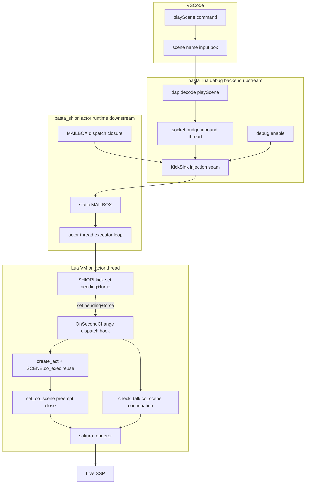

# Technical Design: pasta-scene-kick

## Overview

**Purpose**: ゴースト作者がオーサリング／デバッグ中に「任意のシーンを今すぐライブ SSP 上で再生して観る」を実現する。VSCode 拡張のコマンドからシーン名を指名してキックすると、本物のゴーストが実 SSP 上で ≤1 秒（実 SSP の tick 周期依存）で反応する。

**Users**: ゴースト作者（`*.pasta` 辞書のオーサリング／デバッグ担当）。VSCode 上で pasta デバッグセッションに attach した状態でキックコマンドを実行する。

**Impact**: 既存の `pasta-actor-runtime`（アクタースレッド＋mailbox marshaling）と `pasta-vscode-lua-debug`（DAP-over-TCP）の上に、**キック追加経路**を載せる。SHIORI/3.0 の pull 契約（OnSecondChange の GET 機会）を破らず、キックされたシーンを**既存のマルチビート・トーク継続機構（`STORE.co_scene`）にそのまま載せて** 1 tick ＝ 1 ビートで配信し、ライブ SSP へ届ける。キック専用の出力キューは設けない。通常 SHIORI 会話挙動は不変（キックは追加経路）。

### 検証で確定した配信モデル（設計の核）

通常のマルチビート・トークは次のように配信される（コード実証済み）:
1. `resume_until_valid`（`event/init.lua`）は**最初の有効 yield で停止**し、1 ビート分のさくらを返す（全 yield 集約はしない）。
2. 残りビートは `set_co_scene` で中断 co を `STORE.co_scene` に保存。
3. 次の OnSecondChange で `dispatcher.dispatch` → `check_talk`（`virtual_dispatcher.lua`）が `if STORE.co_scene then return STORE.co_scene` で**既存 co を継続 resume** → 次ビートを吐く。
4. この継続は `is_blocked(status)` でゲートされ、SSP `talking` の間は次ビートを待つ（自然なペース配分）。

→ キックは「完成さくら文字列を貯める FIFO」では**マルチ yield で破綻**する（初回を FIFO・残りを co_scene 継続に分けると同 tick で二重発火・順序逆転・co 状態不定）。よって本設計は **`co_scene` 継続機構そのものを流用**する。キックは「次の OnSecondChange で指定シーンを強制再生せよ」という**保留フラグ**を立てるだけで、実行・レンダリング・継続は既存機構が担う。

### Goals
- VSCode コマンドからシーン名を指名し、既存 debug DAP チャネル（`playScene` custom request）でエンジンへ運ぶ。
- キック到着時はブロックせず、`STORE.kick_pending`（シーン名）＋ `STORE.kick_force`（割り込み許可）を立てるだけ。
- 直後の OnSecondChange で、`is_blocked` を**ワンショット突破**して指定シーンを既存トーク機構で起動（`create_act` 流用→`SCENE.co_exec`→`set_co_scene`）。前会話は `set_co_scene` の置換で閉じる（preempt-and-abort）。
- 2 ビート目以降は通常の `co_scene` 継続で配信（`is_blocked` による自然なペース配分）。
- キック未使用時の通常 SHIORI 応答を**バイト不変**に保つ。

### Non-Goals
- 非即時（アイドル待ち）キックモード、SSP `Status: talking` を権威とする**恒常的**抑制ゲート（即時再生オンリーのため不採用。ただし初回ビートのワンショット突破を除き、ビート間ペースは既存 `is_blocked` を尊重）。
- 即時キックされた会話の退避→復帰セマンティクス（採用は preempt-and-abort のみ）。
- キック専用の talk FIFO / 出力キュー（`co_scene` 継続流用で不要）。
- VSCode／キック要求からのシーン引数・アクター指定（ctx 合成はエンジン既定・UI 引数は将来別境界）。
- ライブ SSP 以外の出力先（別プレビュー画面）、SSTP / `\![raise]` 押し出し、`*.pasta` 編集ウィンドウからのキック、`pasta_novel` アダプタ。

## Boundary Commitments

### This Spec Owns
- **キック transport の一般化**: 既存 debug DAP チャネルへ `playScene` custom request を追加（decode・配線）。
- **kick sink seam**: `pasta_lua` の `debug::enable` に汎用キック注入口を新設し、`pasta_shiori` が `MAILBOX` 投函クロージャを注入する配線。
- **`ActorMsg::Kick` variant**: 同一 mailbox への variant merge（予約済み）と executor ループの実行ハンドラ（→ Lua `SHIORI.kick`）。
- **キック保留状態**: `STORE.kick_pending`（シーン名）／`STORE.kick_force`（割り込み許可）の設置と消費。
- **OnSecondChange dispatch フック**: `kick_force` による `is_blocked` ワンショット突破＋`kick_pending` シーンの起動注入（既存 `check_talk`/random talk より前段）。
- **キック起点の ctx 合成・preempt 流用**: 通常トーク再生の合成手順（`create_act`→`SCENE.co_exec`→`resume_until_valid`→`set_co_scene`）をキック起点から流用する結線（`set_co_scene` の置換が前 `co_scene` close ＝ preempt）。
- **VSCode キックコマンド／シーン名入力 UI**。

### Out of Boundary
- ctx 合成手順そのものの実装（`create_act`/`SCENE.co_exec`/`resume_until_valid`/`set_co_scene` 等は既存・本機能は呼ぶだけ）。
- マルチビート継続機構そのもの（`check_talk` の `STORE.co_scene` 継続）＝既存。本機能は前段にフックを足すのみ。
- アクター mailbox marshaling 本体（GET/NOTIFY・teardown）＝`pasta-actor-runtime` 所有。
- DAP transport の TCP/フレーミング・停止状態機械＝`pasta-vscode-lua-debug` 所有。
- レンダラ（さくらスクリプト描画）本体＝既存 `renderer_injection` 所有。
- 通常イベント経路の抑制ゲート（`is_blocked()`/`BLOCKED_STATUSES`）＝OnHour/OnTalk のビート間ペースで従来どおり機能（本機能は初回のみワンショット突破し、機構自体は変えない）。
- 非即時モード・恒常抑制待ち・退避復帰・SSTP 押し出し・別プレビュー（全て Non-Goals）。

### Allowed Dependencies
- **`pasta-actor-runtime`（上流・同一クレート `pasta_shiori`）**: `ActorMsg`/`static MAILBOX`/executor ループ/`PastaShiori`/`RuntimeConfig` 透過。
- **`pasta-vscode-lua-debug`（上流・`pasta_lua` debug backend）**: `debug::enable`/`dap::decode`/`wiring::inbound`/socket-bridge スレッド/`pasta/sourcePresentation` 前例。
- **既存 Lua dispatch（`pasta_scripts`）**: `EVENT.fire`/`create_act`/`SCENE.co_exec`/`resume_until_valid`/`set_co_scene`/`check_talk`/`second_change.lua`。
- **クレート依存方向の不変条件**: `pasta_shiori` → `pasta_lua` の一方向のみ。`pasta_lua` 側コードは `pasta_shiori::MAILBOX` を直接参照してはならない（kick sink は型を知らない汎用 seam）。

### Revalidation Triggers
- `ActorMsg` の variant 形状変更（`Kick` payload 追加・改名）→ executor ループ・marshaling の再検証。
- `KickSink` 型・`debug::enable` シグネチャ変更 → `pasta_shiori` 注入側・socket-bridge 呼び出し側の再検証。
- `playScene` custom request の payload スキーマ変更 → VSCode TS 側 `setPayload`/`decode.rs` の同期。
- ctx 合成・継続手順（`create_act`/`SCENE.co_exec`/`set_co_scene`/`check_talk`）の契約変更 → キック起点の流用結線・dispatch フックの再検証。
- OnSecondChange ハンドラ（`second_change.lua`/`virtual_dispatcher.lua`）の応答・分岐形状変更 → dispatch フック・バイト不変回帰テストの再検証。

## Architecture

### Existing Architecture Analysis

- **アクター単一 mailbox / 単一 consumer 不変条件**: `ActorMsg`（`#[non_exhaustive]`）は flume unbounded・FIFO・単一 consumer。別チャンネル＋`select!` は flume cancel 欠陥回避のため**禁止**（mailbox docstring が `Kick` を variant merge で予約）。
- **VM pin（`!Send`）**: Lua VM はアクタースレッドに pin され越境しない。キックの状態設定・ctx 合成・レンダリングは必ずアクタースレッド上で行う。`ActorMsg::Kick` と OnSecondChange GET は同一 mailbox を単一 consumer が直列処理するため、`STORE.kick_pending` の設置（Kick 処理）と読み出し（次 OnSecondChange）は競合しない。
- **マルチビート継続**: `resume_until_valid` は 1 yield で停止。`STORE.co_scene` ＋ `check_talk` の継続が次 tick 以降のビートを配信。`is_blocked` がビート間ペースをゲート。
- **ゼロコスト debug**: `DebugConfig` 既定 `enabled=false`／`listen=None`。無効時は port・hook・thread を起こさない。キック経路は debug 有効が前提（R2.6）。
- **DAP 停止ループ制約**: `SessionCommand` はブレーク停止中（stop_loop）のみ消費。ライブ実行中は stop_loop に入らないため、ライブキックは停止非依存の socket-bridge inbound から運ぶ必要がある。
- **クレート依存方向**: `pasta_shiori`（`MAILBOX` 所有）→ `pasta_lua`（debug backend 所有）。逆参照は不可。kick sink はこの制約を満たす汎用注入口とする。

### Architecture Pattern & Boundary Map

選定パターン: **Client-injected sink seam ＋ mailbox variant merge ＋ 既存 co_scene 継続流用（保留フラグ駆動）**（research.md Option C・検証反映版）。VSCode→DAP→sink→mailbox→アクタースレッドで保留フラグ設置→次 OnSecondChange で dispatch フックが強制起動→既存トーク機構が継続配信→ライブ SSP、の単方向追加経路。



**Architecture Integration**:
- **Selected pattern**: client-injected sink で依存方向を順守しつつ debug backend をアクターのクライアント化（R2.4）。配信は既存 `co_scene` 継続を流用。
- **Domain/feature boundaries**: transport/コマンド（`pasta_lua` debug）／sink 注入（`pasta_shiori`）／保留フラグ・dispatch フック・継続流用（Lua `pasta_scripts`）を層で分離。
- **Existing patterns preserved**: 単一 mailbox・単一 consumer・ゼロコスト debug・`pasta/sourcePresentation` 前例・VM pin・マルチビート `co_scene` 継続。
- **New components rationale**: `KickSink`（クレート越境を疎結合化）／`ActorMsg::Kick`（予約済み variant）／`STORE.kick_pending`/`kick_force`（保留フラグ・新規最小状態）／dispatch フック（既存 `check_talk` 前段の薄い分岐）。**talk FIFO は不採用**（co_scene 継続で代替）。
- **Steering compliance**: バイト不変（既存リリース DLL の挙動不変）・送信パスに Mutex を置かない（lock-free `MAILBOX.load_full`）。

### Technology Stack

| Layer | Choice / Version | Role in Feature | Notes |
|-------|------------------|-----------------|-------|
| Frontend / CLI | VSCode 拡張（TypeScript・既存） | キックコマンド・シーン名入力・customRequest 送信 | `pasta/sourcePresentation` 前例を逐語ミラー。`showInputBox` は新規（標準 API） |
| Backend / Services | Rust（`pasta_lua` debug ＋ `pasta_shiori` actor・既存クレート） | `playScene` decode・kick sink seam・`ActorMsg::Kick`・executor ハンドラ | 新規外部依存ゼロ。flume / arc-swap は既存 |
| Messaging / Events | flume mailbox（既存）＋ `KickSink` クロージャ（新規） | DAP→sink→`MAILBOX`→アクタースレッド | 別チャンネル新設なし（R2.3）。単一 consumer 不変条件継承 |
| State / Runtime | Lua `STORE.kick_pending` / `STORE.kick_force`（新規・最小フラグ） | 次 OnSecondChange での強制起動の保留 | アクタースレッド VM 内・session スコープ。FIFO/キュー無し |
| Infrastructure / Runtime | アクタースレッド（`wintf_winmsg_executor`・既存） | ctx 合成・継続レンダリングの実行コンテキスト | VM pin（`!Send`）。キック処理は全てこの上 |

## File Structure Plan

### Modified Files

**Rust — `pasta_lua`（debug backend・上流）**
- `crates/pasta_lua/src/debug/dap/decode.rs` — `"pasta/playScene"` 文字列マッチを追加。`args.scene`（文字列）を抽出し `Decoded` に詰める。空/欠落は `None`（不正）として扱う。
- `crates/pasta_lua/src/debug/wiring/inbound.rs` — `handle_inbound` に playScene 自己完結ハンドラ（`try_play_scene_kick()`）を `pasta/sourcePresentation` と同列で追加。decode 済みシーン名を `KickSink` へ渡し即応答（成功 ack／空名エラー）。汎用 routing（stop_loop 経由）に**落とさない**。
- `crates/pasta_lua/src/debug/enable.rs` — `enable(...)` に `kick_sink: Option<KickSink>` 引数を追加。socket-bridge spawn 時に sink を `run_socket_bridge` へ渡す。`enabled=false` 時は sink 未使用（経路非活性・R2.6）。
- `crates/pasta_lua/src/debug/wiring/mod.rs`（または socket-bridge 配線元） — `run_socket_bridge(...)` に `kick_sink` を追加し inbound ハンドラへ供給。
- `crates/pasta_lua/src/debug/kick.rs`（新規・型定義） — `KickSink` 型エイリアス（`Arc<dyn Fn(KickRequest) + Send + Sync>`）と `KickRequest { scene: String }` を定義。`pasta_lua` は中身（`ActorMsg`/`MAILBOX`）を知らない。
- `crates/pasta_lua/src/runtime/runtime_config.rs` — `RuntimeConfig` に `kick_sink: Option<KickSink>` を builder（`with_kick_sink`）で持たせる。
- `crates/pasta_lua/src/runtime/mod.rs` — `with_config_and_source_map` の `debug::enable(...)` 呼び出しへ `config.kick_sink.clone()` を透過。

**Rust — `pasta_shiori`（actor runtime・下流）**
- `crates/pasta_shiori/src/actor/mailbox.rs` — `ActorMsg` に `Kick { scene: String }` variant を追加（予約 docstring を実体化）。
- `crates/pasta_shiori/src/actor/thread.rs` — executor `match msg` に `ActorMsg::Kick { scene }` 腕を追加。アクタースレッド上で Lua の `SHIORI.kick(scene)`（保留フラグ設置）を呼ぶ。reply 無し（fire-and-forget）。
- `crates/pasta_shiori/src/actor/lifecycle.rs`（または VM 構築点） — VM 構築前に `RuntimeConfig` へ `MAILBOX` 投函クロージャ（`|req| if let Some(tx)=MAILBOX.load_full() { let _ = tx.try_send(ActorMsg::Kick{scene:req.scene}); }`）を `with_kick_sink` で束縛する。
- `crates/pasta_shiori/src/shiori.rs`（VM 入口） — Lua の `SHIORI.kick(scene)` を呼ぶ Rust 側入口（GET/NOTIFY と同列の薄いブリッジ）。

**Lua — `pasta_lua/pasta_scripts`**
- `crates/pasta_lua/pasta_scripts/pasta/shiori/event/kick.lua` —（新規）`KICK.install(scene_name)`: `STORE.kick_pending = scene_name`／`STORE.kick_force = true` を設置するのみ（resume しない）。`KICK.try_dispatch(act) -> co|nil`: `kick_pending` があれば `create_act` 流用済み `act` で当該シーンを `act:find_scene`→`SCENE.co_exec` し co を返す（解決不能なら nil＋診断ログ・R3.5）。呼び出し後フラグ消費。
- `crates/pasta_lua/pasta_scripts/pasta/shiori/event/virtual_dispatcher.lua` —（修正）`dispatch(act)` 入口で、(a) `STORE.kick_force` が真なら当該 tick の `is_blocked` ゲートを**ワンショット突破**、(b) `KICK.try_dispatch(act)` を `check_talk`/random talk より**前段**で呼び、非 nil co を得たら `set_co_scene` 経由で前 `co_scene` を閉じて（preempt）当該 co を継続対象として返す。フラグは消費して通常状態へ戻す。
- `crates/pasta_lua/pasta_scripts/pasta/store.lua`（STORE 定義／`STORE.reset`） — `kick_pending`（既定 nil）／`kick_force`（既定 false）フィールドを追加し `reset` で初期化。
- `crates/pasta_lua/pasta_scripts/pasta/shiori/init.lua`（SHIORI ディスパッチ登録元） — `SHIORI.kick(scene)` を公開し `KICK.install` へ委譲。

**TypeScript — `editors/vscode`**
- `editors/vscode/src/playSceneRequest.ts` —（新規）`requestCommand = 'pasta/playScene'`、`setPayload(scene: string): { scene: string }`、`validateSceneName(name): boolean`（空チェック）。`sourcePresentationToggle.ts` の純ロジック構造をミラー。
- `editors/vscode/src/extension.ts` — `registerCommand('pasta.debug.playScene', ...)`: `isPastaSession()` ガード（未接続なら案内）→`showInputBox` でシーン名取得（取消なら送信しない・R1.4）→`session.customRequest('pasta/playScene', setPayload(scene))`→try/catch でエラー提示（R1.3/R2.5）。
- `editors/vscode/package.json` — `contributes.commands` に `pasta.debug.playScene`、`contributes.menus`（`commandPalette`/`debug/toolBar`・`when: debugType == 'pasta'`）を追加。

### New Files Summary
- Rust: `KickSink`/`KickRequest` 定義（`pasta_lua/src/debug/kick.rs`）。
- Lua: `event/kick.lua`（`KICK.install`/`KICK.try_dispatch`）。
- TS: `playSceneRequest.ts`、`test/playSceneRequest.test.ts`。

## System Flows

### キック起動〜ライブ SSP 反映（保留フラグ → 既存継続流用）

```mermaid
sequenceDiagram
    participant Author
    participant VSCode
    participant SocketBridge as socket-bridge inbound thread
    participant Sink as KickSink closure
    participant Mailbox as static MAILBOX
    participant Actor as actor thread executor
    participant Lua as Lua VM
    participant SSP as Live SSP

    Author->>VSCode: playScene command
    VSCode->>VSCode: showInputBox scene name
    VSCode->>SocketBridge: customRequest pasta/playScene scene
    SocketBridge->>SocketBridge: decode + validate scene
    alt scene empty or invalid
        SocketBridge-->>VSCode: error response (R2.5)
    else valid
        SocketBridge->>Sink: invoke KickRequest scene
        SocketBridge-->>VSCode: ack response (best-effort)
        Sink->>Mailbox: load_full + try_send ActorMsg Kick
        Mailbox->>Actor: FIFO deliver Kick
        Actor->>Lua: SHIORI.kick scene
        Lua->>Lua: set STORE.kick_pending=scene, kick_force=true (no resume)
    end
    Note over SSP,Lua: 次 tick の OnSecondChange GET（同一 mailbox・直列）
    SSP->>Lua: OnSecondChange GET
    Lua->>Lua: dispatch hook: kick_force -> bypass is_blocked (one-shot)
    alt kick_pending set
        Lua->>Lua: KICK.try_dispatch: find_scene + SCENE.co_exec
        alt scene unresolved
            Lua->>Lua: clear flags + diagnostic log (R3.5), fall through (old talk kept)
            Lua-->>SSP: normal dispatch response (byte-invariant R6.3)
        else resolved
            Lua->>Lua: set_co_scene(kick_co) -> close prev co_scene (preempt R5.2)
            Lua->>Lua: resume_until_valid -> beat 1 (render)
            Lua-->>SSP: beat 1 sakura (R4.2 / R5.1)
        end
    else no pending
        Lua-->>SSP: normal dispatch (byte-invariant when kick unused)
    end
    Note over SSP,Lua: 後続 tick（通常継続・is_blocked ペース）
    SSP->>Lua: OnSecondChange GET
    Lua->>Lua: check_talk -> STORE.co_scene continuation -> beat N
    Lua-->>SSP: beat N sakura (R4.1)
```

**Flow-level decisions**:
- **停止ループ迂回**: sink 呼び出しは socket-bridge スレッド（停止非依存）で行い、`SessionCommand`/stop_loop を経由しない（ライブ実行中もキック可能）。
- **非ブロッキング設置**: `ActorMsg::Kick` 受信時はフラグを立てるだけ（resume しない）。GET を待たせない（R3.1）。
- **既存継続流用**: 実行・preempt・配信は既存 `create_act`/`SCENE.co_exec`/`set_co_scene`/`check_talk` が担う。キック専用キューなし。
- **ワンショット突破**: `kick_force` は初回ビートのみ `is_blocked` を突破（R5.5）。2 ビート目以降は通常の `is_blocked` ペース配分（R4.1）。
- **バイト不変**: `kick_pending` 不在時は dispatch フックが完全素通り → 既存 dispatch のまま（R6.3）。

## Requirements Traceability

| Requirement | Summary | Components | Interfaces | Flows |
|-------------|---------|------------|------------|-------|
| 1.1 | VSCode がシーン名を受け取る | PlaySceneCommand | `showInputBox` | キック起動 |
| 1.2 | シーン名をデバッグチャネルで送信 | PlaySceneCommand / PlaySceneRequest | `customRequest('pasta/playScene')` | キック起動 |
| 1.3 | 未接続時はエラー／案内 | PlaySceneCommand | `isPastaSession()` ガード | キック起動 alt |
| 1.4 | 取消時は送信しない | PlaySceneCommand | `showInputBox` 取消分岐 | キック起動 |
| 2.1 | `playScene` custom request 受理 | PlaySceneDecode | `decode_request` マッチ | キック起動 |
| 2.2 | シーン名抽出 | PlaySceneDecode | `args.scene` 抽出 | キック起動 |
| 2.3 | 別 transport 新設せず既存拡張 | PlaySceneDecode / KickInboundHandler | 既存 DAP チャネル | （構造制約） |
| 2.4 | debug backend をアクタークライアント化・取次 | KickSinkSeam / MailboxKickInjector | `KickSink` / `MAILBOX.try_send` | キック起動 |
| 2.5 | 空/不正シーン名はエラー返却 | PlaySceneDecode / KickInboundHandler | validate→error response | キック起動 alt |
| 2.6 | debug 無効時は経路非活性 | KickSinkSeam | sink 未注入（`enabled=false`） | （ゲート） |
| 3.1 | 非ブロッキング設置（GET を待たせない） | ActorKickMsg / KickInstall | `ActorMsg::Kick`（fire-and-forget）/ フラグ設置 | キック起動 |
| 3.2 | ctx 合成を通常再生から流用 | KickDispatchHook | `create_act`/`SCENE.co_exec`/`resume_until_valid` | キック起動 |
| 3.3 | レンダリング・配信を既存継続へ委譲（専用キュー無し） | KickDispatchHook / 既存 check_talk | `STORE.co_scene` 継続 | キック起動 / 継続 |
| 3.4 | GET ごと高々1ビート | KickDispatchHook / 既存 resume_until_valid | 1 yield/GET | キック起動 / 継続 |
| 3.5 | 未解決シーンは破棄＋診断記録 | KickDispatchHook | `try_dispatch`=nil + `tracing` | キック起動 alt |
| 4.1 | ビートをコルーチン順に配信 | KickDispatchHook / 既存 co_scene 継続 | `check_talk` 継続 | 継続 |
| 4.2 | OnSecondChange でキック co を resume 配信 | KickDispatchHook | dispatch フック → set_co_scene | キック起動 |
| 4.3 | 保留 co 不在時は通常応答 | KickDispatchHook | `kick_pending`=nil 素通り | キック起動 alt |
| 4.4 | ≤1 秒（tick 周期依存）で SSP 反映 | KickDispatchHook | 次 GET で起動 | キック起動 |
| 4.5 | 配信は pull 機会限定・押し出ししない | KickDispatchHook | OnSecondChange のみ | 継続 |
| 5.1 | 会話中でも preempt（割り込み起動） | KickDispatchHook / KickForceGate | `kick_force` 突破＋set_co_scene | キック起動 |
| 5.2 | 中断側の前 `co_scene` を閉じる | KickPreempt（set_co_scene 流用） | 前 `co_scene` 置換 close | キック起動 |
| 5.3 | 自動復帰しない | KickPreempt | 退避スタック非保持 | キック起動 |
| 5.4 | 即時単一モード（非即時提供しない） | KickInstall | モードフラグ無し | （構造制約） |
| 5.5 | 初回のみ `is_blocked` ワンショット突破・後続は通常ペース | KickForceGate | `kick_force` 1回消費 | キック起動 / 継続 |
| 6.1 | ライブ SSP 反映・別プレビュー無し | KickDispatchHook | 既存レンダラ直結 | 継続 |
| 6.2 | 通常会話挙動を不変 | KickDispatchHook | 追加経路（フック素通り） | キック起動 alt |
| 6.3 | キック未使用時はバイト不変 | KickDispatchHook | `kick_pending`=nil 素通り | キック起動 alt |
| 6.4 | `Status` ヘッダ準拠維持 | KickForceGate / 既存 is_blocked | 既存解釈不変（初回突破除く） | 継続 |

## Components and Interfaces

| Component | Domain/Layer | Intent | Req Coverage | Key Dependencies (P0/P1) | Contracts |
|-----------|--------------|--------|--------------|--------------------------|-----------|
| PlaySceneCommand | VSCode TS | コマンド登録・シーン名入力・送信 | 1.1, 1.2, 1.3, 1.4 | activeDebugSession (P0), PlaySceneRequest (P1) | Service |
| PlaySceneRequest | VSCode TS | 純ロジック（command 名・payload・validate） | 1.2, 2.5 | — | Service |
| PlaySceneDecode | Rust debug dap | `playScene` decode・scene 抽出・validate | 2.1, 2.2, 2.3, 2.5 | DapAdapter (P0) | Service |
| KickInboundHandler | Rust debug wiring | 自己完結ハンドラ・sink 呼び出し・即応答 | 2.3, 2.5 | KickSinkSeam (P0) | Service |
| KickSinkSeam | Rust debug enable/kick | 汎用 `KickSink` 注入口（依存方向順守） | 2.4, 2.6 | RuntimeConfig (P0) | Service, State |
| MailboxKickInjector | Rust pasta_shiori | `MAILBOX` 投函クロージャ注入 | 2.4 | static MAILBOX (P0) | Service |
| ActorKickMsg | Rust pasta_shiori | `ActorMsg::Kick` variant＋executor 腕 | 3.1 | mailbox (P0) | State |
| KickInstall | Lua | `SHIORI.kick` でフラグ設置（非ブロッキング） | 3.1, 5.4 | STORE (P0) | Service, State |
| KickForceGate | Lua | `is_blocked` ワンショット突破 | 5.1, 5.5, 6.4 | STORE.kick_force (P0), is_blocked (P1) | State |
| KickDispatchHook | Lua | 保留シーン起動注入・継続委譲 | 3.2, 3.3, 3.4, 3.5, 4.1, 4.2, 4.3, 4.4, 4.5, 5.1, 6.1, 6.2, 6.3 | create_act/SCENE.co_exec/check_talk (P0) | Service |
| KickPreempt | Lua | 前 `co_scene` 破棄・自動復帰なし（set_co_scene 流用） | 5.2, 5.3 | set_co_scene (P0) | State |

### VSCode TS Layer

#### PlaySceneRequest

| Field | Detail |
|-------|--------|
| Intent | `playScene` の command 名・payload・シーン名検証を純関数として提供 |
| Requirements | 1.2, 2.5 |

**Responsibilities & Constraints**
- `requestCommand = 'pasta/playScene'`（Rust decode 文字列と一致が契約）。
- payload は `{ scene: string }` のみ（モードフラグ無し・即時単一）。
- 空文字／空白のみのシーン名は invalid（送信前検証）。

**Contracts**: Service [x] / API [ ] / Event [ ] / Batch [ ] / State [ ]

##### Service Interface
```typescript
export const requestCommand = 'pasta/playScene' as const;
export function setPayload(scene: string): { scene: string };
export function validateSceneName(name: string): boolean; // trims; false if empty
```
- Preconditions: `name` は UI 入力文字列。
- Postconditions: `setPayload` は `{ scene }` を返す。`validateSceneName` は非空のとき true。
- Invariants: command 文字列は Rust 側 decode と完全一致。

**Implementation Notes**
- Integration: `sourcePresentationToggle.ts` の純ロジック構造を逐語ミラー。
- Validation: 単体テスト（`playSceneRequest.test.ts`）で payload／validate を検証。
- Risks: 低（前例網羅）。

#### PlaySceneCommand

| Field | Detail |
|-------|--------|
| Intent | VSCode コマンド登録・セッションガード・シーン名入力・customRequest 送信 |
| Requirements | 1.1, 1.2, 1.3, 1.4 |

**Responsibilities & Constraints**
- `registerCommand('pasta.debug.playScene')`。
- `isPastaSession(activeDebugSession)` が false なら警告提示し送信しない（R1.3）。
- `showInputBox` でシーン名取得。取消（undefined）なら送信しない（R1.4）。
- `session.customRequest(requestCommand, setPayload(scene))` を try/catch で囲み失敗を `showErrorMessage`（R2.5 のバックエンドエラー含む）。

**Dependencies**
- Inbound: VSCode command palette / debug toolbar — トリガ（P0）
- Outbound: `activeDebugSession.customRequest` — DAP 送信（P0）
- External: `vscode.window.showInputBox` — シーン名入力（P1・新パターン）

**Contracts**: Service [x]

**Implementation Notes**
- Integration: `extension.ts` L150-219 の toggle 登録と同型。`package.json` に command＋menu（`when: debugType == 'pasta'`）。
- Validation: モック session（`vscodeModules.test.ts` 流）で送信 payload と未接続／失敗時メッセージを検証。
- Risks: `showInputBox` は既存未使用だが標準 API。

### Rust debug backend Layer（pasta_lua・上流）

#### PlaySceneDecode

| Field | Detail |
|-------|--------|
| Intent | `pasta/playScene` を decode しシーン名を抽出・検証 |
| Requirements | 2.1, 2.2, 2.3, 2.5 |

**Responsibilities & Constraints**
- `decode_request` に `"pasta/playScene"` 文字列マッチを追加（`pasta/sourcePresentation` と同列）。
- `args.scene`（文字列）を抽出。欠落／空は `None`（invalid）として表現。
- 別 transport を新設せず既存 DAP frame の拡張（R2.3）。

**Contracts**: Service [x]

##### Service Interface
```rust
// decode.rs 内 match 腕（擬似シグネチャ）
"pasta/playScene" => Decoded {
    kick_scene: parse_scene_strict(args), // Option<String>: None when empty/missing
    ..Decoded::default()
}
```
- Preconditions: inbound JSON frame（socket-bridge 由来）。
- Postconditions: 有効時 `kick_scene = Some(name)`、無効時 `None`。
- Invariants: `Decoded` の他フィールドは default（routing に落とさない）。

**Implementation Notes**
- Integration: `Decoded` に `kick_scene: Option<String>` フィールド追加。
- Validation: decode 単体テスト（空名→None・正常→Some）。
- Risks: 低（前例どおり）。

#### KickInboundHandler

| Field | Detail |
|-------|--------|
| Intent | playScene を自己完結処理し sink を呼ぶ・即応答 |
| Requirements | 2.3, 2.5 |

**Responsibilities & Constraints**
- `handle_inbound` の固定順に `try_play_scene_kick()` を追加（`try_source_presentation_toggle` と同列・汎用 routing に落とさない）。
- `kick_scene = Some(name)` かつ sink あり → sink 呼び出し＋成功 ack。
- `None`（空/不正）→ キック実行せずエラー応答（R2.5）。
- sink が None（debug 無効・未注入）→ 経路非活性（R2.6 と整合）。

**Dependencies**
- Inbound: socket-bridge inbound decode — トリガ（P0）
- Outbound: KickSinkSeam（`KickSink`）— キック取次（P0）

**Contracts**: Service [x]

**Implementation Notes**
- Integration: `wiring/inbound.rs` の A→B→C→D→E 系に自己完結ハンドラを 1 つ追加。
- Validation: sink をモックし「有効名→sink 1 回呼ばれる」「空名→sink 呼ばれずエラー応答」。
- Risks: ハンドラ順序の誤りで routing に漏れる→順序テストで担保。

#### KickSinkSeam

| Field | Detail |
|-------|--------|
| Intent | `pasta_lua` 側の汎用キック注入口（中身を知らない） |
| Requirements | 2.4, 2.6 |

**Responsibilities & Constraints**
- `KickSink = Arc<dyn Fn(KickRequest) + Send + Sync>`、`KickRequest { scene: String }` を `pasta_lua` に定義。
- `enable(lua, cfg, source_map, kick_sink)` で受け取り socket-bridge へ供給。
- `enabled=false` 時は sink を消費せず経路非活性（ゼロコスト・R2.6）。
- `pasta_lua` は sink の実体（`ActorMsg`/`MAILBOX`）を知らない（依存方向順守）。

**Dependencies**
- Inbound: RuntimeConfig（`kick_sink`）— 注入（P0）
- Outbound: KickInboundHandler — 供給（P0）

**Contracts**: Service [x] / State [x]

##### Service Interface
```rust
pub type KickSink = std::sync::Arc<dyn Fn(KickRequest) + Send + Sync>;
pub struct KickRequest { pub scene: String }

// enable シグネチャ拡張
pub fn enable(
    lua: &mlua::Lua,
    cfg: &DebugConfig,
    source_map: Option<Arc<SourceMap>>,
    kick_sink: Option<KickSink>,   // 追加
) -> Result<Option<DebugHandle>, DebugError>;
```
- Preconditions: `enabled=true` のとき sink が `Some` なら経路有効。
- Postconditions: socket-bridge が inbound playScene で sink を呼ぶ。
- Invariants: sink は `Send + Sync`（スレッド越境可）。`pasta_lua` は型を不透明に扱う。

**Implementation Notes**
- Integration: `RuntimeConfig.with_kick_sink` → `with_config_and_source_map` → `enable` → `run_socket_bridge`。
- Validation: enable 有効＋sink Some で inbound→sink 到達、`enabled=false` で sink 非消費。
- Risks: 配線段増による注入忘れ→型で Option を明示し未注入=非活性で安全側。

#### MailboxKickInjector

| Field | Detail |
|-------|--------|
| Intent | `pasta_shiori` 側で `MAILBOX` 投函クロージャを sink として注入 |
| Requirements | 2.4 |

**Responsibilities & Constraints**
- VM 構築前に `RuntimeConfig.with_kick_sink(closure)` を束縛。
- クロージャ: `move |req: KickRequest| { if let Some(tx) = MAILBOX.load_full() { let _ = tx.try_send(ActorMsg::Kick { scene: req.scene }); } }`。
- teardown/reload 競合は `load_full()=None` で no-op（D6）。`try_send` 失敗（満杯/切断）は診断ログ後に破棄（デバッグ用途で許容）。

**Dependencies**
- Inbound: KickSinkSeam（`KickSink` 型）— 注入先（P0）
- Outbound: static MAILBOX — `ActorMsg::Kick` 送信（P0）

**Contracts**: Service [x]

**Implementation Notes**
- Integration: アクタースレッド spawn 時の VM 構築（`RuntimeConfig` 生成箇所）で束縛。
- Validation: `MAILBOX` 設定時→`Kick` 到達、`swap(None)` 後→no-op。
- Risks: クロージャが `MAILBOX` の `'static` 寿命に依存（`static` なので満たす）。

#### ActorKickMsg

| Field | Detail |
|-------|--------|
| Intent | `ActorMsg::Kick` variant と executor 実行腕 |
| Requirements | 3.1 |

**Responsibilities & Constraints**
- `ActorMsg`（`#[non_exhaustive]`）に `Kick { scene: String }` を追加（予約 docstring 実体化）。
- executor `match msg` に腕を追加し、アクタースレッド上で `SHIORI.kick(scene)`（フラグ設置のみ）を呼ぶ。reply 無し（fire-and-forget・NOTIFY 同型）。
- 複数 `Kick` は FIFO 順に処理（各々が `kick_pending` を上書き＝最後のキックが有効）。

**Dependencies**
- Inbound: MailboxKickInjector（`Kick` 送信）— 取次（P0）
- Outbound: KickInstall（Lua `SHIORI.kick`）— フラグ設置（P0）

**Contracts**: State [x]

##### State Management
- State model: mailbox の 1 メッセージ（`Kick`）。VM 状態（`STORE.kick_pending`/`kick_force`/`co_scene`）はアクタースレッド VM 内。
- Persistence & consistency: VM session スコープ。`Kick` 設置と OnSecondChange 読み出しは単一 consumer の直列処理で一貫。
- Concurrency strategy: 単一 consumer・単一 mailbox（`select!` 不使用）。

**Implementation Notes**
- Integration: `thread.rs` の `match` に 1 腕。Lua 入口は `shiori.rs` の薄いブリッジ。
- Validation: `Kick` 受信で `SHIORI.kick` が 1 回呼ばれる。複数 `Kick` で `kick_pending` が最後の値。
- Risks: 低（GET/NOTIFY と同型・fire-and-forget）。

### Lua Layer（pasta_scripts）

#### KickInstall

| Field | Detail |
|-------|--------|
| Intent | `SHIORI.kick` でキック保留フラグを設置（非ブロッキング・resume しない） |
| Requirements | 3.1, 5.4 |

**Responsibilities & Constraints**
- `SHIORI.kick(scene_name)` → `KICK.install(scene_name)`: `STORE.kick_pending = scene_name`／`STORE.kick_force = true` を設置するのみ。シーン解決・resume・レンダリングは行わない（次 OnSecondChange の dispatch フックに委ねる）。
- 即時単一モード（モードフラグ無し・R5.4）。
- 連続キックは `kick_pending` を上書き（最後のキックが次 tick で起動）。

**Dependencies**
- Inbound: ActorKickMsg（`SHIORI.kick`）— 起動（P0）
- Outbound: STORE（`kick_pending`/`kick_force`）— フラグ設置（P0）

**Contracts**: Service [x] / State [x]

##### Service Interface
```
KICK.install(scene_name: string) -> nil   -- 副作用: STORE.kick_pending/kick_force 設置のみ
```
- Preconditions: アクタースレッド VM 上で呼ばれる（`!Send` 制約）。
- Postconditions: `STORE.kick_pending = scene_name`、`STORE.kick_force = true`。シーンは未起動。
- Invariants: GET をブロックしない（重い処理を行わない・R3.1）。

**Implementation Notes**
- Integration: `event/kick.lua` 新規。`init.lua` の `SHIORI.kick` から委譲。
- Validation: `SHIORI.kick("intro")` 後に `STORE.kick_pending=="intro"`・`STORE.kick_force==true`、co_scene は未変更（resume していない）。
- Risks: 低。

#### KickForceGate

| Field | Detail |
|-------|--------|
| Intent | キック初回ビートのみ `is_blocked` をワンショット突破 |
| Requirements | 5.1, 5.5, 6.4 |

**Responsibilities & Constraints**
- `dispatch(act)` 入口で `STORE.kick_force` が真なら、当該 tick の `is_blocked(status)` ゲートを突破（会話中でもキックを通す）。
- 突破は **1 回限り**。キックシーン起動（または未解決判定）の後に `kick_force` を消費（false 化）。
- 2 ビート目以降は `kick_force` が偽のため通常の `is_blocked` ペース配分に従う（R5.5）。
- `Status` ヘッダ解釈そのものは不変（突破は本機能のキック時のみ・R6.4）。

**Dependencies**
- Inbound: KickDispatchHook — フラグ参照（P0）
- Outbound: is_blocked（既存）— 突破対象（P1）

**Contracts**: State [x]

##### State Management
- State model: `STORE.kick_force`（bool・既定 false）。
- Persistence & consistency: 単一 VM・単一 consumer 上で逐次。1 回消費。
- Concurrency strategy: アクタースレッド単独。

**Implementation Notes**
- Integration: `virtual_dispatcher.lua` の `is_blocked` ゲート条件に `and not STORE.kick_force` 相当を加える。
- Validation: `kick_force=true`＋`status="talking"` で dispatch がブロックされずキック起動・直後に `kick_force=false`。後続 `talking` tick はブロックされる。
- Risks: 突破解除漏れ→キックが恒常的に抑制突破する回帰。消費を起動経路で確実化＋テスト。

#### KickDispatchHook

| Field | Detail |
|-------|--------|
| Intent | 保留キックシーンを既存トーク機構へ注入し、継続配信を委譲 |
| Requirements | 3.2, 3.3, 3.4, 3.5, 4.1, 4.2, 4.3, 4.4, 4.5, 5.1, 6.1, 6.2, 6.3 |

**Responsibilities & Constraints**
- `dispatch(act)` 入口で `KickForceGate` 適用後、`check_talk`/random talk より**前段**に：
  - `STORE.kick_pending` が nil → 何もせず通常 dispatch へ素通り（R4.3・R6.2・R6.3 バイト不変）。
  - `STORE.kick_pending` が非 nil → `KICK.try_dispatch(act)`:
    1. `co = act:find_scene(scene)` → `SCENE.co_exec(act, scene)`（ctx は当該 OnSecondChange の `act` を流用・R3.2）。
    2. 解決成功 → 返した co を `set_co_scene` 経由で据える（前 `co_scene` を閉じる＝preempt・R5.2/R5.3）→ 既存 `resume_until_valid` で初回ビートを resume・レンダリング（R3.4 1 yield）→ GET 応答として返す（R4.2/R5.1）。
    3. 解決不能 → co を据えず（前会話保持）、診断ログ（R3.5）、フラグ消費して通常 dispatch へ素通り。
  - いずれの場合も `kick_pending`/`kick_force` を消費。
- 2 ビート目以降は既存 `check_talk` の `STORE.co_scene` 継続が担う（本フックは関与しない・R4.1）。
- 配信は OnSecondChange の pull 限定（押し出ししない・R4.5）。別プレビュー画面を作らずライブ SSP へ（R6.1）。

**Dependencies**
- Inbound: OnSecondChange dispatch（`second_change.lua`→`virtual_dispatcher.dispatch`）— トリガ（P0）
- Outbound: create_act/find_scene/SCENE.co_exec/resume_until_valid/set_co_scene（既存・流用）— ctx 合成・起動・preempt（P0）、check_talk（既存）— 後続継続（P1）

**Contracts**: Service [x]

##### Service Interface
```
KICK.try_dispatch(act) -> co|nil   -- kick_pending を解決し co を返す（未解決 nil）。フラグ消費。
```
- Preconditions: アクタースレッド VM・OnSecondChange dispatch 内。
- Postconditions: 解決成功→`set_co_scene(co)` 済み・初回ビート resume 可能。未解決→co_scene 不変＋ログ。
- Invariants: ctx 合成はキック専用構築をせず既存関数を流用（R3.2）。専用キューを作らない（R3.3）。

**Implementation Notes**
- Integration: `virtual_dispatcher.lua` の `dispatch` に前段分岐を 1 つ追加し、`event/kick.lua` の `KICK.try_dispatch` を呼ぶ。実行・継続は既存 `EVENT.fire`/`check_talk` 系の流用。
- Validation: 解決成功→初回ビートが返り `STORE.co_scene` がキック co、前 co が閉じる；未解決→co_scene 不変＋ログ；`kick_pending`=nil→完全素通り（バイト不変）。
- Risks: フック挿入位置の誤りで通常 dispatch を変質→`kick_pending`=nil 素通りの回帰テスト（R6.3）で担保。

#### KickPreempt

| Field | Detail |
|-------|--------|
| Intent | キックシーン起動時に進行中会話の前 `co_scene` 破棄・自動復帰なし |
| Requirements | 5.2, 5.3 |

**Responsibilities & Constraints**
- 実体は `set_co_scene(kick_co)` の既存「前シーン置換」ロジックを流用（前 `co_scene` ≠ 新 co のとき前を `coroutine.close`＝LuaJIT で no-op＝参照上書き＋GC）。
- LuaJIT `coroutine.close` 非搭載前提のため**強制 dead 化せず参照不到達＋GC**でモデル化（research D5）。
- 退避スタックを持たず自動復帰しない（R5.3）。
- R5.2 の「閉じた」観測契約 = **前 `co_scene` が `STORE` から不到達になり以後 resume されない**。

**Dependencies**
- Inbound: KickDispatchHook — キック co 据え（P0）
- Outbound: set_co_scene（既存）— 状態置換（P0）

**Contracts**: State [x]

##### State Management
- State model: `STORE.co_scene`（`thread|nil`・session スコープ）。
- Persistence & consistency: 単一 VM・単一 consumer 上で逐次更新。
- Concurrency strategy: アクタースレッド単独（競合なし）。

**Implementation Notes**
- Integration: `set_co_scene` の置換経路をキックから利用（新規 close API は作らない）。
- Validation: preempt 後に前シーンが通常 dispatch で再開されないこと（特性化テスト）。
- Risks: 中断コルーチンが GC まで生存（実害なし・観測契約は参照不到達）。

## Error Handling

### Error Strategy
- **入力検証（fail fast）**: VSCode 側で空シーン名は送信前に弾く（R1.4 取消含む）。Rust decode 側でも空/欠落を `None` として再検証しエラー応答（R2.5）。二重防御。
- **未接続セッション**: `isPastaSession()` false → 警告提示し送信しない（R1.3）。
- **解決不能シーン**: dispatch フックの `KICK.try_dispatch` が nil → `co_scene` を据えず（前会話保持）破棄＋診断ログ（R3.5・`seam = "kick.unresolved"`）。フラグは消費。
- **ライフサイクル競合**: teardown/reload 中のキックは `MAILBOX.load_full()=None` で黙って no-op＋診断ログ（`seam = "kick.drop"`・デバッグ用途で許容）。
- **debug 無効**: sink 未注入＝経路非活性（R2.6・エラーですらない＝そもそも到達しない）。

### Error Categories and Responses
- **User Errors**: 空シーン名／未接続→VSCode 上で警告・エラーメッセージ（実行されない）。
- **System Errors**: `try_send` 失敗（mailbox 切断）→破棄＋ログ。VM レンダリング失敗→`resume_until_valid` の `ok=false` を捕捉しログ（co を据えても初回 resume 失敗は通常応答へフォールバック）。
- **Business Logic Errors**: 解決不能シーン→破棄＋診断（R3.5）。

### Monitoring
- `tracing` seam ログ: `kick.inbound`（受理）/`kick.install`（フラグ設置）/`kick.unresolved`（未解決）/`kick.drop`（ライフサイクル競合破棄）/`kick.start`（初回ビート起動）。debug 無効時ゼロコスト（既存方針）。

## Testing Strategy

### Unit Tests
- `PlaySceneRequest`（TS）: `setPayload('intro')={scene:'intro'}`、`validateSceneName('')=false`、`validateSceneName(' x ')=true`。
- `PlaySceneDecode`（Rust）: `pasta/playScene` 正常名→`kick_scene=Some`、空/欠落→`None`。
- `KickInstall`（Lua）: `SHIORI.kick('intro')` 後に `kick_pending=='intro'`・`kick_force==true`・`co_scene` 未変更。
- `KickForceGate`（Lua）: `kick_force=true`＋`status='talking'` で dispatch 非ブロック→消費後 false。
- `KickPreempt`（Lua）: preempt 後に前 `co_scene` が `STORE` から不到達（参照 nil 化観測）。

### Integration Tests
- **キック取次経路**（Rust）: inbound `pasta/playScene` decode → sink（モック）1 回呼ばれる → `ActorMsg::Kick` 送信（`MAILBOX` モック）。空名→sink 呼ばれずエラー応答。
- **debug 無効ゲート**（Rust）: `enabled=false` で sink 非注入・キック経路非活性（R2.6）。
- **ctx 合成流用＋起動**（Lua）: `kick_pending` 設置後の OnSecondChange dispatch で `create_act`/`SCENE.co_exec`/`set_co_scene` を経由し初回ビートが返る（R3.2/R4.2）。未解決シーン→co_scene 不変＋ログ＋通常応答（R3.5）。
- **割り込み起動**（Lua）: `status='talking'` でも `kick_force` で初回ビートが配信される（R5.1/R5.5）。直後 tick の `talking` は通常どおりブロック（後続ペース）。

### E2E / Regression Tests
- **バイト不変回帰**（特性化・最重要 R6.3）: キック未使用時（`kick_pending`=nil）、OnSecondChange を含む通常 SHIORI 応答がキック導入前とバイト一致（`shiori-event-test-framework`・PASTA_DEBUG ガード留意）。
- **マルチビート配信**（最重要・ユーザー懸念）: 複数 yield を持つシーンをキック→初回ビートが直後 OnSecondChange で割り込み配信→**2 ビート目以降が既存 `co_scene` 継続で後続 tick に順序どおり配信**（`is_blocked` ペース）。同一 tick での二重出力・順序逆転・co stuck が無いこと。
- **即時 preempt-and-abort**: 進行中会話中にキック→前会話が中断され前 `co_scene` が再開されない（R5.2/R5.3）。複数キック連続→`kick_pending` 上書きで最後のキックが起動・前キック co も `set_co_scene` 置換で閉じる。
- **VSCode コマンド**（モック session）: 未接続→警告・送信なし、取消→送信なし、失敗→エラーメッセージ。

### Performance
- **GET 短さ（R3.4/R4.4）**: キック到着（`ActorMsg::Kick`）はフラグ設置のみ（O(1)・非ブロッキング）。OnSecondChange GET は 1 ビート（1 yield）resume のみで通常トークと同等の短さ。専用キュー drain は無い。

## Open Questions / Risks
（design-discussion フェーズで解決済みのものは ✓。残課題は実装時/タスクで確定）

1. ✓ **`create_act` のキック用最小 `req` 受容性** → 解決済み（検証）。`SHIORI_ACT.new(actors, req)` は `req` を格納するだけで、最小 `{id=scene}` ないし `nil` 許容。ただし本設計では `try_dispatch` が OnSecondChange の `act` を流用するため、キック専用 `req` 合成すら不要（`act:find_scene(scene)` でシーン名解決）。
2. ✓ **`SHIORI.kick` の Rust↔Lua ブリッジ形** → 解決済み（ディスカッション）。(B) フラグ設置型を採用（`SHIORI.kick`＝`STORE` フラグを立てるだけ）。実シーン起動は次 OnSecondChange の既存 dispatch が担うため、擬似リクエスト合成も専用実行ブリッジも不要。
3. ✓ **マルチ yield 会話の配信制御**（ユーザー懸念・検証済み） → 解決済み。初回ビートのみ `kick_force` 突破で割り込み、2 ビート目以降は既存 `co_scene` 継続（`is_blocked` ペース）。完成さくらを貯める FIFO 案は二重発火で破綻するため不採用。
4. **`kick_force` 消費の正確な位置**（実装時確定）: `try_dispatch` 成功時・未解決時の双方で確実に false 化する位置（`dispatch` 前段の単一地点で消費が安全）。回帰テストで「初回のみ突破」を担保。
5. **`KickSink`/`KickRequest` の公開パス**（実装時確定）: `pasta_lua/src/debug/kick.rs` 公開・`runtime_config` が `use`。
6. **複数キック連続時の挙動**（要確認・軽）: `kick_pending` 上書きで最後のキックのみ起動。既に起動済みキックの進行中 co は後続キックが `set_co_scene` 置換で preempt。enqueue 済み完成出力という概念は無い（キュー不採用のため）。
7. **`kick.drop`（teardown 競合破棄）の UX**（要確認・軽）: ack はベストエフォート（sink 呼び出し成立で ack・実 mailbox 到達は保証しない）。VSCode への失敗通知要否は discussion 残topic。
