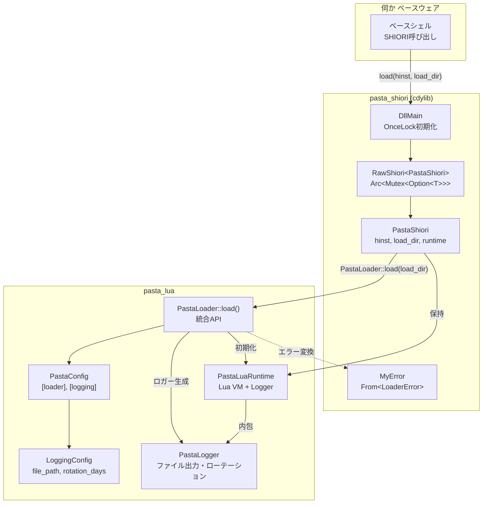
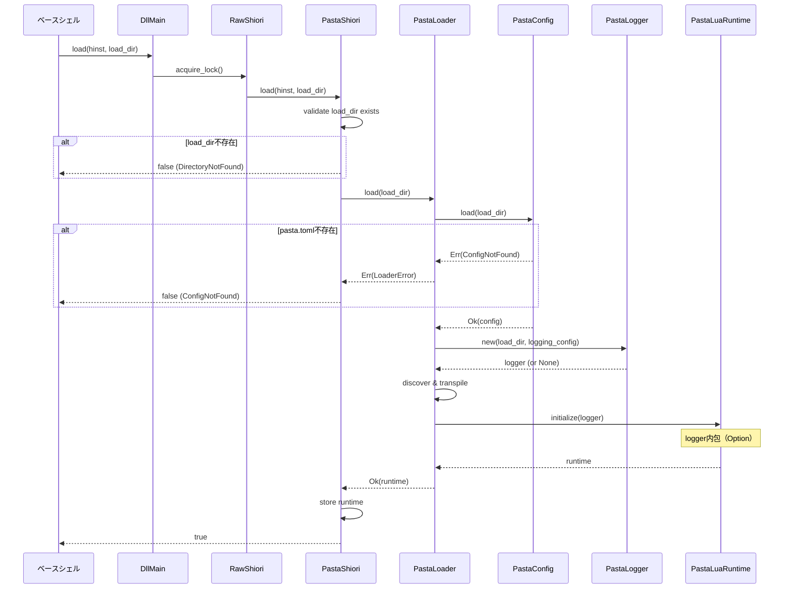

# Technical Design Document

## Overview

**Purpose**: PastaShioriのload関数にpasta_luaエンジン統合を実装し、SHIORI DLLとしてのランタイム初期化機能を提供する。

**Users**: 「伺か」ゴースト開発者がPastaスクリプトエンジンを使用してゴーストを作成する際に、このload実装がエンジン初期化を担当する。

**Impact**: 既存のPastaShiori構造体を拡張し、PastaLoader::load()統合とロギング機能を追加する。

### Goals
- PastaShiori::load()でPastaLuaRuntimeを初期化・保持する
- pasta.toml必須化によるエラー検出の強化
- 各ゴーストインスタンスごとの独立ログファイル出力

### Non-Goals
- request()関数の完全実装（本仕様はload()のみ）
- pasta_runeバックエンドの統合（将来の別仕様）
- ログレベルやフォーマットのカスタマイズ（将来拡張）

---

## Architecture

### Existing Architecture Analysis

**現行のpasta_shiori構造**:
- `RawShiori<T>` — OnceLockシングルトン、Arc<Mutex<Option<T>>>パターンでライフサイクル管理
- `PastaShiori` — Shioriトレイト実装、現在はhinst/load_dirのみ保持
- `MyError` — エラー型、to_shiori_response()でSHIORI 500レスポンス生成

**既存の制約**:
- Windows FFI境界（C ABI互換）
- スレッドセーフティ必須（複数ゴースト同時ロード可能）
- SHIORI規約（load → request → unloadライフサイクル）

### Architecture Pattern & Boundary Map



**Architecture Integration**:
- **Selected pattern**: 既存コンポーネント拡張（Option A）
- **Domain boundaries**: pasta_shiori（SHIORI FFI層）、pasta_lua（ランタイム層）
- **Existing patterns preserved**: Arc<Mutex<Option<T>>>、OnceLock、MyError変換
- **New components rationale**: 
  - LoggingConfig: [logging]セクション読み込み
  - PastaLogger: インスタンスごとのファイル出力
- **Steering compliance**: Rust 2024 edition、thiserror/tracing使用

### Technology Stack

| Layer | Choice / Version | Role in Feature | Notes |
|-------|------------------|-----------------|-------|
| Backend | Rust 2024 edition | コア実装 | Cargo.toml `edition = "2024"` |
| Runtime | pasta_lua (mlua 0.11) | Lua VMホスト | PastaLuaRuntime |
| Logging | tracing 0.1, tracing-subscriber 0.3, tracing-appender 0.2 | ログ出力 | 新規依存 |
| Configuration | toml 0.9.8, serde 1 | pasta.toml解析 | 既存依存 |
| FFI | windows-sys 0.59 | Windows DLL | cfg(windows)ゲート |

---

## System Flows

### load()シーケンス



**Key Decisions**:
- load_dir存在確認はPastaShiori側で実施（FFI境界での早期エラー検出）
- PastaLoader::load()がログローテーション込みの初期化を完結し、PastaLuaRuntimeに内包
- PastaShioriはPastaLoggerの存在を知らない（カプセル化）
- エラー発生時はMyError::Load(String)に変換してfalse返却
- API変更なし（既存13テスト無修正で動作）

---

## Requirements Traceability

| Requirement | Summary | Components | Interfaces | Flows |
|-------------|---------|------------|------------|-------|
| 1.1, 1.2, 1.3 | Runtime初期化・保持 | PastaShiori, PastaLoader, PastaLuaRuntime | Shiori::load() | load()シーケンス |
| 2.1, 2.2, 2.3 | load_dirパス処理 | PastaShiori | PathBuf変換 | load()シーケンス |
| 3.1, 3.2, 3.3, 3.4 | エラーハンドリング | MyError, LoaderError | From<LoaderError> | load()シーケンス |
| 4.1, 4.2 | pasta.toml必須化 | PastaConfig | LoaderError::ConfigNotFound | load()シーケンス |
| 5.1, 5.2 | hinst保持 | PastaShiori | isize field | - |
| 6.1, 6.2, 6.3 | Runtime状態管理 | PastaShiori | Option<PastaLuaRuntime> | - |
| 7.1-7.8 | ロギング機能 | PastaLuaRuntime, LoggingConfig, PastaLogger | PastaLoader::load() | load()シーケンス |

---

## Components and Interfaces

| Component | Domain/Layer | Intent | Req Coverage | Key Dependencies | Contracts |
|-----------|--------------|--------|--------------|------------------|-----------|
| PastaShiori | pasta_shiori/SHIORI | SHIORIライフサイクル管理 | 1, 2, 3, 5, 6 | PastaLoader (P0), MyError (P0) | Service |
| MyError | pasta_shiori/Error | エラー型変換 | 3 | LoaderError (P0) | Service |
| GlobalLoggerRegistry | pasta_shiori/Logging | グローバルロガー管理とSpan振り分け | 7.7 | PastaLogger (P0) | Service |
| PastaConfig | pasta_lua/Config | pasta.toml解析 | 4, 7.2 | toml (P1), serde (P1) | Service |
| LoggingConfig | pasta_lua/Config | [logging]セクション | 7.2, 7.3, 7.4 | serde (P1) | State |
| PastaLogger | pasta_lua/Logging | ファイル出力・ローテーション | 7.1, 7.3-7.8 | tracing-appender (P0) | Service |
| PastaLuaRuntime | pasta_lua/Runtime | Lua VM実行環境 | 1, 7.7 | PastaLogger (P0) | Service |
| PastaLoader | pasta_lua/Loader | 統合初期化API | 1, 7.1 | PastaConfig (P0), PastaLogger (P0) | Service |

---

### pasta_shiori Layer

#### PastaShiori

| Field | Detail |
|-------|--------|
| Intent | SHIORIライフサイクル管理とpasta_lua統合 |
| Requirements | 1.1, 1.2, 1.3, 2.1, 2.2, 2.3, 5.1, 5.2, 6.1, 6.2, 6.3 |

**Responsibilities & Constraints**
- SHIORI load/request/unloadライフサイクルの管理
- PastaLuaRuntimeインスタンスの保持と状態追跡
- FFI境界でのエラー変換とログ出力

**Dependencies**
- Outbound: PastaLoader — ランタイム初期化 (P0)
- Outbound: MyError — エラー変換 (P0)
- External: tracing — ログ出力 (P1)

**Contracts**: Service [x]

##### Service Interface

```rust
pub(crate) trait Shiori {
    fn load<S: AsRef<OsStr>>(&mut self, hinst: isize, load_dir: S) -> MyResult<bool>;
    fn request<S: AsRef<str>>(&mut self, request: S) -> MyResult<String>;
}

#[derive(Default)]
pub(crate) struct PastaShiori {
    hinst: isize,
    load_dir: Option<PathBuf>,
    runtime: Option<PastaLuaRuntime>,
}
```

- **Preconditions**: load_dirはOsStr形式、hinst有効なHINSTANCE
- **Postconditions**: 成功時runtime=Some、失敗時runtime=None
- **Invariants**: load()成功後のみrequest()が有効

**Implementation Notes**
- Integration: PastaLoader::load()呼び出しでランタイムとロガーを取得
- Validation: load_dir存在確認、pasta.toml存在確認（PastaLoader経由）
- Risks: 複数回load()呼び出し時の既存ランタイム解放順序
- **Logging Initialization**: グローバルtracing Subscriberの初期化はRawShiori::new()（DllMain時）でOnceLockにより1回のみ実行。2回目以降のゴースト起動時はno-opとなり、既存Subscriberを再利用。初期化失敗時はログ出力を無効化し、エンジン起動は継続（panic回避）。
- **Span Strategy**: 
  - load/unload: `info_span!("shiori_load/unload", load_dir = %path)` — 頻度低、重要イベント
  - request: `debug_span!("shiori_request", load_dir = %path)` — 頻度高、詳細トレース
  - Span内のすべてのログ（trace～error）にload_dirフィールドが自動付与され、GlobalLoggerRegistryが振り分け

---

#### MyError

| Field | Detail |
|-------|--------|
| Intent | LoaderErrorからの変換とSHIORIレスポンス生成 |
| Requirements | 3.1, 3.2, 3.3, 3.4 |

**Contracts**: Service [x]

##### Service Interface

```rust
#[derive(Clone, Eq, PartialEq, Debug, Error)]
pub enum MyError {
    #[error("load error: {0}")]
    Load(String),
    
    #[error("not initialized error")]
    NotInitialized,
    
    // ... 他のバリアント
}

impl From<LoaderError> for MyError {
    fn from(e: LoaderError) -> Self {
        MyError::Load(format!("{}", e))
    }
}
```

- **Preconditions**: LoaderErrorが有効
- **Postconditions**: MyError::Load(String)に変換
- **Invariants**: エラーメッセージにデバッグ情報を含む

---

#### GlobalLoggerRegistry

| Field | Detail |
|-------|--------|
| Intent | 複数PastaLoggerの管理とSpan識別による振り分け |
| Requirements | 7.7 |

**Responsibilities & Constraints**
- load時にPastaLoggerをload_dirで登録
- unload時にPastaLoggerを削除
- MakeWriter実装でSpanのload_dirを見て対応ロガーに振り分け

**Dependencies**
- Internal: PastaLogger — 各インスタンスのロガー (P0)
- External: tracing — Span情報取得 (P0)

**Contracts**: Service [x]

##### Service Interface

```rust
pub struct GlobalLoggerRegistry {
    loggers: Arc<Mutex<HashMap<PathBuf, Arc<PastaLogger>>>>,
}

impl GlobalLoggerRegistry {
    /// シングルトンインスタンス取得
    pub fn instance() -> &'static Self;
    
    /// ロガー登録（PastaShiori::load時）
    pub fn register(&self, load_dir: PathBuf, logger: Arc<PastaLogger>);
    
    /// ロガー削除（PastaShiori::unload時）
    pub fn unregister(&self, load_dir: &Path);
}

impl<'a> MakeWriter<'a> for GlobalLoggerRegistry {
    type Writer = Box<dyn io::Write + 'a>;
    
    fn make_writer(&'a self) -> Self::Writer {
        // 現在のSpanから load_dir を取得
        let span = tracing::Span::current();
        if let Some(load_dir) = span.field("load_dir") {
            // 対応するPastaLoggerを探す
            if let Some(logger) = self.loggers.lock().get(load_dir) {
                return Box::new(logger.make_writer());
            }
        }
        // 該当なしはno-op
        Box::new(io::sink())
    }
}
```

- **Preconditions**: RawShiori::new()でSubscriber初期化済み
- **Postconditions**: Spanのload_dirに基づいて適切なPastaLoggerに出力
- **Invariants**: 登録されていないload_dirのログは破棄（sink）

**Implementation Notes**
- Integration: RawShiori::new()でSubscriberに登録、PastaShiori::load/unloadで登録/削除
- Thread Safety: Arc<Mutex<HashMap>>で複数スレッド対応
- Performance: Span情報取得はO(1)、HashMap検索もO(1)

---

### pasta_lua Layer

#### PastaLuaRuntime (拡張)

| Field | Detail |
|-------|--------|
| Intent | Lua VM実行環境とログ管理の統合 |
| Requirements | 1.1, 1.2, 1.3, 7.7 |

**Responsibilities & Constraints**
- Lua VMのライフサイクル管理
- インスタンスごとのロガー保持（Option<PastaLogger>）
- ロガーとランタイムの同期的破棄

**Dependencies**
- Internal: PastaLogger — ログ出力 (P0、Optional）

**Contracts**: Service [x]

##### Service Interface (拡張)

```rust
pub struct PastaLuaRuntime {
    // ... 既存フィールド（Lua VM関連）
    
    /// インスタンスごとのロガー（[logging]なければNone）
    logger: Option<PastaLogger>,
}
```

- **Preconditions**: PastaLoader::load()で初期化済み
- **Postconditions**: ロガーが設定されていればログ出力可能
- **Invariants**: loggerのライフサイクルはランタイムと一致

**Implementation Notes**
- Integration: PastaLoader::load()内でロガーを生成しruntimeに格納
- Encapsulation: pasta_shioriはPastaLoggerの存在を知らない（カプセル化）
- Risks: Drop順序（logger→runtime）の保証

---

#### LoggingConfig

| Field | Detail |
|-------|--------|
| Intent | [logging]セクションのデシリアライズ |
| Requirements | 7.2, 7.3, 7.4 |

**Contracts**: State [x]

##### State Management

```rust
#[derive(Debug, Clone, Deserialize, Default)]
pub struct LoggingConfig {
    /// ログファイルパス（load_dirからの相対パス）
    /// デフォルト: "profile/pasta/logs/pasta.log"
    #[serde(default = "default_file_path")]
    pub file_path: String,
    
    /// ログローテーション日数
    /// デフォルト: 7
    #[serde(default = "default_rotation_days")]
    pub rotation_days: usize,
}

fn default_file_path() -> String {
    "profile/pasta/logs/pasta.log".to_string()
}

fn default_rotation_days() -> usize {
    7
}
```

- **State model**: イミュータブル設定値
- **Persistence**: pasta.tomlから読み込み
- **Concurrency strategy**: Clone可能、スレッドセーフ

---

#### PastaLogger

| Field | Detail |
|-------|--------|
| Intent | インスタンスごとのファイルログ出力とローテーション |
| Requirements | 7.1, 7.3, 7.4, 7.5, 7.6, 7.7, 7.8 |

**Responsibilities & Constraints**
- 各PastaLoaderインスタンスが独立したログファイルを持つ
- profile/pasta/logs/ディレクトリへの自動作成
- N日間のログローテーション

**Dependencies**
- External: tracing-appender — ローテーション処理 (P0)
- External: tracing-subscriber — フォーマット処理 (P1)

**Contracts**: Service [x]

##### Service Interface

```rust
pub struct PastaLogger {
    /// ログファイルの絶対パス
    log_path: PathBuf,
    
    /// ローテーション設定（日数）
    rotation_days: usize,
    
    /// 非同期書き込みガード（Dropで自動フラッシュ）
    _guard: Option<tracing_appender::non_blocking::WorkerGuard>,
}

impl PastaLogger {
    /// ロガー生成（[logging]セクション設定に基づく）
    pub fn new(base_dir: &Path, config: Option<&LoggingConfig>) -> Result<Self, LoaderError>;
    
    /// ログ出力が有効かどうか
    pub fn is_enabled(&self) -> bool;
}

impl Drop for PastaLogger {
    fn drop(&mut self) {
        // WorkerGuardのDropでログをフラッシュ
    }
}
```

- **Preconditions**: base_dirが有効なパス
- **Postconditions**: ログディレクトリが作成され、ファイルハンドルが確保
- **Invariants**: profile配下にのみファイルを作成

**Implementation Notes**
- Integration: PastaLoader::load()内で生成、PastaShioriに所有権移転
- Validation: パス正規化、ディレクトリ作成権限確認
- Risks: ファイル書き込み権限エラー時のフォールバック（ログ無効化）
- **Global Subscriber Strategy**: グローバルtracing Subscriberは`RawShiori::new()`で初期化（OnceLockパターン）。各PastaLoggerはインスタンスごとのMakeWriter実装を通じて独立したファイルに出力。グローバルSubscriberへの登録は1回のみで、2回目以降のゴースト起動時はSubscriber再利用により複数インスタンス対応を実現。
- **Span-based Routing**: PastaShioriがSpan（`info_span!`/`debug_span!`）でload_dirを設定。GlobalLoggerRegistryがSpanのload_dirフィールドを見て対応するPastaLoggerに振り分け。該当なしならno-op。

---

#### PastaConfig (拡張)

| Field | Detail |
|-------|--------|
| Intent | [logging]セクションの読み込み追加 |
| Requirements | 7.2 |

**Contracts**: Service [x]

##### Service Interface (追加メソッド)

```rust
impl PastaConfig {
    /// [logging]セクションを取得（存在しない場合None）
    pub fn logging(&self) -> Option<LoggingConfig> {
        self.custom_fields
            .get("logging")
            .and_then(|v| v.clone().try_into().ok())
    }
}
```

- **Preconditions**: PastaConfig::load()成功
- **Postconditions**: [logging]存在時はSome、なければNone
- **Invariants**: custom_fieldsから安全にデシリアライズ

---

#### PastaLoader (拡張)

| Field | Detail |
|-------|--------|
| Intent | ロガー初期化をload()シーケンスに統合 |
| Requirements | 7.1 |

**Contracts**: Service [x]

##### Service Interface

```rust
impl PastaLoader {
    /// ランタイムをロード（[logging]設定に基づきロガーも内部初期化）
    pub fn load(base_dir: impl AsRef<Path>) -> Result<PastaLuaRuntime, LoaderError>;
}
```

**Implementation Notes**
- Integration: Phase 0.5としてロガー初期化を追加、PastaLuaRuntime内部に格納
- Validation: [logging]セクションの有無でロガー生成判断（なければNone）
- Backward Compatibility: API変更なし、既存13テスト無修正で動作

---

## Data Models

### Domain Model

**Aggregates**:
- `PastaShiori` — SHIORIライフサイクルのルートエンティティ
- `PastaLuaRuntime` — Lua VMライフサイクルのルートエンティティ

**Entities**:
- `PastaLogger` — ログファイルライフサイクル管理

**Value Objects**:
- `LoggingConfig` — 不変の設定値
- `LoaderConfig` — 不変の設定値

### Logical Data Model

**pasta.toml構造**:

```toml
[loader]
pasta_patterns = ["dic/*/*.pasta"]
lua_search_paths = ["scripts", "scripts/pasta"]
transpiled_output_dir = "profile/pasta/cache/lua"
debug_mode = true

[logging]
file_path = "profile/pasta/logs/pasta.log"
rotation_days = 7

# カスタムフィールド（ゴースト固有設定）
ghost_name = "パスタちゃん"
version = "1.0.0"
```

**LoggingConfig → ファイル出力マッピング**:

| 設定 | デフォルト | 説明 |
|------|-----------|------|
| file_path | profile/pasta/logs/pasta.log | load_dirからの相対パス |
| rotation_days | 7 | ログ保持日数（max_log_filesにマッピング） |

---

## Error Handling

### Error Strategy

LoaderErrorからMyErrorへの変換で、SHIORI 500レスポンスを生成。

### Error Categories and Responses

| Error Source | MyError Variant | X-ERROR-REASON | Recovery |
|--------------|-----------------|----------------|----------|
| load_dir不存在 | Load("Directory not found: ...") | パス情報 | ゴースト配置確認 |
| pasta.toml不存在 | Load("Config not found: ...") | パス情報 | pasta.toml作成 |
| pasta.tomlパースエラー | Load("Config error: ...") | 詳細メッセージ | TOML構文修正 |
| トランスパイルエラー | Load("Transpile error: ...") | 詳細メッセージ | スクリプト修正 |
| Luaランタイムエラー | Load("Runtime error: ...") | 詳細メッセージ | スクリプト修正 |
| ログファイル作成失敗 | （エラーにせず続行） | - | ログ無効化 |

### Monitoring

- tracingマクロ（error!, warn!, info!, debug!）でログ出力
- PastaLoggerによるファイル永続化
- X-ERROR-REASONでSHIORIレスポンスにエラー詳細を含める

---

## Testing Strategy

### Unit Tests

1. **From<LoaderError> for MyError変換** — 各LoaderErrorバリアントの変換確認
2. **LoggingConfig::default()** — デフォルト値の確認
3. **PastaConfig::logging()** — [logging]セクション有無の読み込み
4. **PastaLogger::new()** — ディレクトリ作成、ファイルハンドル確保

### Integration Tests

1. **PastaLoader::load() with [logging]** — ロガー付きロード成功
2. **PastaLoader::load() without [logging]** — ロガーなしロード成功
3. **PastaShiori::load() success path** — 完全なload()シーケンス
4. **PastaShiori::load() failure paths** — 各エラーケース（DirectoryNotFound, ConfigNotFound等）

### E2E Tests

1. **SHIORI load → request → unload サイクル** — 完全なライフサイクル
2. **複数インスタンス同時ロード** — 独立したログファイル出力確認

---

## Optional Sections

### Security Considerations

- **ファイルパス検証**: profile/pasta/配下以外への書き込みを防止
- **パストラバーサル防止**: file_path設定値の正規化と検証

### Performance & Scalability

- **ロード時間目標**: 1-3秒以内（既存PastaLoader::load()で達成見込み）
- **非同期ログ書き込み**: tracing_appender::non_blockingで書き込みブロッキング回避

---

## Supporting References

詳細な調査結果は [research.md](research.md) を参照。

- tracingの複数ファイル出力アーキテクチャ調査
- tracing_appenderのローテーション実装詳細
- ログファイル分割アプローチの比較検討
