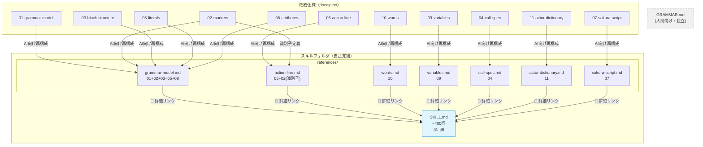

# Design Document: pasta-skill-grammar-authority

## Overview

**Purpose**: pasta-ghost-authoring スキルを `SKILL.md` ＋ `references/` の2層アーキテクチャに再構成し、Pasta DSL文法の**権威スキル**に昇格させる。root cause であるインライン要素の区切りルール欠落を修正しつつ、`doc/spec/`（01〜11章）の文法ルールをAI向けに再構成して自己完結的に内包する。

**Users**: LLMコーディングエージェント（Pasta DSLコード生成時にスキルを参照）、ゴースト辞書作者（AIが生成するコードの品質向上）。

**Impact**: 既存の `pasta-ghost-authoring/SKILL.md`（353行）に `references/`（7ファイル）を新設。SKILL.md は §1〜§6 構造を維持したまま約400行に拡張。コード変更なし（ドキュメントのみ）。

### Goals
- インライン要素の区切りルール（root cause）を SKILL.md §3.2 に直接記載し、LLMが必ず参照する位置に配置
- `doc/spec/` 11章の文法ルールを AI向けに再構成した `references/` を新設し、スキルフォルダの自己完結性を確保
- 姉妹スキル `pasta-lua-coding` と同一のアーキテクチャパターンを適用
- スキル内部の情報階層（`references/` → `SKILL.md`）を明確化し、自己完結性を確保

### Non-Goals
- `doc/spec/12-future.md`（未確定仕様）の移植（コード生成には不要）
- SKILL.md §6 Authoring Patterns の変更（スキル固有知識として維持）
- Rust クレート（pasta_dsl, pasta_core 等）のコード変更
- `GRAMMAR.md`（人間向け学習マニュアル）の変更
- メンテナンスワークフローの定義（Kiro ステアリングの責務）

## Architecture

### Existing Architecture Analysis

**現行構造**:
```
.agents/skills/pasta-ghost-authoring/
└── SKILL.md   (353行, §1-§6, references/ なし)
```

**制約**:
- SKILL.md §1〜§6 の構造を維持（後方互換）
- §6 Authoring Patterns（110行）はスキル固有知識として SKILL.md 本体に残す
- `doc/spec/` への外部参照に依存しない（自己完結性: 1.5）

**問題点**:
- §3.2 Action Lines がインライン区切りルールを記載していない（root cause）
- `references/` が存在しない（姉妹スキルとのアーキテクチャ不一致）
- `doc/spec/` の詳細ルール（識別子定義、最長一致、スコープ解決等）が未移植

### Architecture Pattern & Boundary Map



**情報権威フロー**: `doc/spec/`（権威仕様書）→ `references/`（AI向け再構成）→ `SKILL.md`（要約＋パターン集）。一方向のみ。`GRAMMAR.md` はこのフローに含まれない独立文書。

**Architecture Integration**:
- **Selected pattern**: 2層スキルアーキテクチャ（姉妹スキル `pasta-lua-coding` と同一パターン）
- **Domain boundaries**: SKILL.md = 要約＋Quick Reference＋パターン集、references/ = AI向け詳細リファレンス
- **Existing patterns preserved**: §1〜§6構造、マーカー一覧表、Authoring Patterns
- **New components rationale**: references/ 7ファイルは doc/spec/ 11章のAI向け再構成を自己完結的に内包するため
- **Steering compliance**: 自己完結性（product.md）、重複回避原則（requirements Introduction）

### Technology Stack

| Layer | Choice / Version | Role in Feature | Notes |
|-------|------------------|-----------------|-------|
| スキル定義 | Markdown (.md) | SKILL.md＋references/ | YAML frontmatter 付き |
| 情報ソース | doc/spec/ (01-11) | 権威仕様書 | 1,026行（12-future.md 除く） |
| LLMインターフェース | `read_file` tool | references/ のオンデマンドロード | SKILL.md の📖リンクで導線 |

## Requirements Traceability

| Requirement | Summary | Components | Interfaces | Flows |
|-------------|---------|------------|------------|-------|
| 1.1 | 2層構造導入 | SKILL.md, references/ (7ファイル) | — | — |
| 1.2 | §1-§6維持＋文法ルール補完 | SKILL.md §3.2 | — | — |
| 1.3 | doc/spec/対応の分割ファイル | references/ (7ファイル) | — | — |
| 1.4 | references/への参照パス | SKILL.md §2, §3 各サブセクション | 📖 導線リンク | — |
| 1.5 | 自己完結性 | スキルフォルダ全体 | — | — |
| 2.1 | §3.2にインライン区切りサブセクション | SKILL.md §3.2 | — | — |
| 2.2 | 空白区切りの正例・誤例 | SKILL.md §3.2 | — | — |
| 2.3 | 最長一致ルール＋意図しない吸収例 | SKILL.md §3.2 | — | — |
| 2.4 | 変数参照の同ルール適用 | SKILL.md §3.2 | — | — |
| 2.5 | インライン要素後の空白判断情報 | SKILL.md §3.2 | — | — |
| 2.6 | インライン判定ルールのreferences/収録 | references/action-line.md | — | — |
| 3.1 | 06-action-line.md 再構成 | references/action-line.md | — | — |
| 3.2 | 10-words.md 再構成 | references/words.md | — | — |
| 3.3 | 09-variables.md 再構成 | references/variables.md | — | — |
| 3.4 | 04-call-spec.md 再構成 | references/call-spec.md | — | — |
| 3.5 | 11-actor-dictionary.md 再構成 | references/actor-dictionary.md | — | — |
| 3.6 | 07-sakura-script.md 再構成 | references/sakura-script.md | — | — |
| 3.7 | 残り5章の再構成 | references/grammar-model.md | — | — |
| 3.8 | 12-future.md 対象外 | — | — | — |
| 3.9 | 冒頭に情報源明記 | references/ (全7ファイル) | — | — |
| 4.1 | §2にreferences/リンク追加 | SKILL.md §2 | 📖 導線リンク | — |
| 4.2 | §3に📖導線追加 | SKILL.md §3 各サブセクション | 📖 導線リンク | — |
| 4.3 | 情報権威フローの整理 | SKILL.md §1 | — | — |
| 4.4 | §6維持 | SKILL.md §6 | — | — |
| 4.5 | references/が正 | SKILL.md §1, references/ | — | — |
| 5.1 | §3.2に⚠️よくある間違い | SKILL.md §3.2 | — | — |
| 5.2 | ❌/✅対比形式 | SKILL.md §3.2 | — | — |
| 5.3 | 4パターンの危険パターン | SKILL.md §3.2 | — | — |
| 5.4 | 完全な区切りルール保持 | references/action-line.md | — | — |
| 5.5 | 検証可能なルール記述 | SKILL.md §3.2, references/action-line.md | — | — |
| 6.1 | §1にスキル内部情報階層明記 | SKILL.md §1 | — | — |
| 6.2 | GRAMMAR.md参照を含まない | SKILL.md 全体 | — | — |

## Components and Interfaces

| Component | Domain/Layer | Intent | Req Coverage | Key Dependencies | Contracts |
|-----------|-------------|--------|--------------|------------------|-----------|
| SKILL.md §1 修正 | スキル/メイン | スキル内部情報階層＋自己完結性明記 | 4.3, 4.5, 6.1, 6.2 | — | — |
| SKILL.md §2 修正 | スキル/メイン | マーカー表にreferences/リンク列追加 | 4.1 | references/ (P1) | — |
| SKILL.md §3.2 拡張 | スキル/メイン | インライン区切りルール＋ピットフォール | 2.1-2.5, 5.1-5.3, 5.5 | references/action-line.md (P0) | — |
| SKILL.md §3.x 導線追加 | スキル/メイン | 各サブセクションに📖リンク | 1.4, 4.2 | references/ (P1) | — |
| references/grammar-model.md | スキル/リファレンス | 文法基盤（行指向、ブロック、リテラル、属性） | 3.7, 3.9 | doc/spec/ 01,02,03,05,08 | — |
| references/action-line.md | スキル/リファレンス | アクション行＋インライン判定ルール | 2.6, 3.1, 3.9, 5.4 | doc/spec/ 06, 02(識別子) | — |
| references/words.md | スキル/リファレンス | 単語定義＋スコープ解決 | 3.2, 3.9 | doc/spec/ 10 | — |
| references/variables.md | スキル/リファレンス | 変数スコープ＋代入構文 | 3.3, 3.9 | doc/spec/ 09 | — |
| references/call-spec.md | スキル/リファレンス | Call仕様＋スコープ解決 | 3.4, 3.9 | doc/spec/ 04 | — |
| references/actor-dictionary.md | スキル/リファレンス | アクター辞書＋フォールバック | 3.5, 3.9 | doc/spec/ 11 | — |
| references/sakura-script.md | スキル/リファレンス | さくらスクリプトタグ＋透過ルール | 3.6, 3.9 | doc/spec/ 07 | — |

### スキル / メイン層

#### SKILL.md §1 修正

| Field | Detail |
|-------|--------|
| Intent | スキル内部の情報階層（references/ → SKILL.md）と権威関係を明記 |
| Requirements | 4.3, 4.5, 6.1, 6.2 |

**Responsibilities & Constraints**
- スキル内部の情報階層（`references/` → `SKILL.md`）を明記
- `references/` が SKILL.md より権威であることを明記（4.5）
- `GRAMMAR.md` への参照を含めない（6.2 — 現行で既に準拠）
- 自己完結性の宣言を維持
- **`doc/spec/` のパスを §1 に記載しない**（自己完結性: 1.5。LLMが外部ファイルを読みに行くリスクを排除）

**変更内容**:
現行 §1:
```markdown
**役割分離**: 本スキルはLLMによるコード生成に特化する。
Pasta DSL言語仕様の設計判断やパーサー実装には関与しない。
本スキルは自己完結型であり、必要な情報をすべて内包している。
```

変更後 §1（追加部分）:
```markdown
**役割分離**: 本スキルはLLMによるコード生成に特化する。
Pasta DSL言語仕様の設計判断やパーサー実装には関与しない。
- `references/`（詳細リファレンス）と `SKILL.md`（要約＋パターン集）の2層構成
- SKILL.md と `references/` の記述に矛盾がある場合、`references/` を正とする

**自己完結性**: 本スキルフォルダは単体で完結しており、外部ファイルへの参照に依存しない。
必要な文法ルールはすべて `references/` に内包している。
```

---

#### SKILL.md §2 修正

| Field | Detail |
|-------|--------|
| Intent | マーカー一覧表に references/ 対応リンク列を追加 |
| Requirements | 4.1 |

**変更内容**:
現行のマーカー表にリファレンス列を追加:

| マーカー名 | 全角 | 半角 | 用途 | リファレンス |
|-----------|------|------|------|-------------|
| グローバルシーン | `＊` | `*` | シーン定義 | [grammar-model.md](references/grammar-model.md) |
| ローカルシーン | `・` | `-` | サブシーン定義 | [grammar-model.md](references/grammar-model.md) |
| 単語/関数 | `＠` | `@` | 単語定義・参照・関数呼び出し | [words.md](references/words.md) |
| 変数 | `＄` | `$` | 変数宣言・参照 | [variables.md](references/variables.md) |
| Call | `＞` | `>` | シーン呼び出し | [call-spec.md](references/call-spec.md) |
| 属性 | `＆` | `&` | メタデータ | [grammar-model.md](references/grammar-model.md) |
| コメント | `＃` | `#` | コメント行 | [grammar-model.md](references/grammar-model.md) |
| アクター辞書 | `％` | `%` | アクター辞書定義 | [actor-dictionary.md](references/actor-dictionary.md) |
| キューコマンド | `！` | `!` | 演出キュー | [grammar-model.md](references/grammar-model.md) |
| コロン | `：` | `:` | キー・値の区切り | [grammar-model.md](references/grammar-model.md) |
| さくらスクリプト | `\` | `\` | 表情・タイミング制御 | [sakura-script.md](references/sakura-script.md) |

**Implementation Notes**: 現行テーブルの「使用例」列を削除する代わりに「リファレンス」列を追加。使用例は §3 各サブセクションに存在するため冗長。これにより列数を維持（5列→5列）。

---

#### SKILL.md §3.2 拡張

| Field | Detail |
|-------|--------|
| Intent | インライン要素の区切りルールとピットフォールを §3.2 に直接記載（root cause fix） |
| Requirements | 2.1, 2.2, 2.3, 2.4, 2.5, 5.1, 5.2, 5.3, 5.5 |

**変更内容**:
§3.2 の末尾に以下の2つのサブセクションを追加。

##### サブセクション1: インライン要素の区切り文字（2.1〜2.5）

3パターンの明記:

1. **空白区切り** — `＠単語名　テキスト` で単語参照と通常テキストを分離。空白はトークン区切りとして消費され出力に含まれない。空白数は無関係（1つ以上で1トークン）
2. **最長一致（空白なし）** — 空白がない場合、識別子（XID_START＋XID_CONTINUE*）に含まれない文字が現れるまでを最長一致で切り出す。日本語文字（平仮名・カタカナ・漢字）はXID_CONTINUEに含まれるため、`＠天気ですね` は「天気ですね」全体を識別子として吸収する
3. **＠＠エスケープ** — リテラルの「＠」を出力するには `＠＠` と記述

正例・誤例ペア（2.2）:
```
❌ ＠地名からおらんようなってもた
✅ ＠地名　からおらんようなってもた
```

変数参照にも同ルール適用（2.4）:
```
❌ ＄nameさん
✅ ＄name　さん
```

##### サブセクション2: ⚠️ よくある間違い（5.1〜5.3）

4パターンの❌/✅対比:

| # | パターン | ❌ まちがい | ✅ ただしい | 理由 |
|---|---------|-----------|-----------|------|
| a | ＠単語参照の空白なし | `＠地名からおらんようなってもた` | `＠地名　からおらんようなってもた` | 最長一致で「地名からおらんようなってもた」全体が識別子に |
| b | ＄変数参照の空白なし | `＄nameさん` | `＄name　さん` | 最長一致で日本語文字も識別子に含まれる |
| c | 行継続で行マーカー使用 | 継続行を`＠`で開始 | 継続行はマーカーなしで開始 | マーカーで始まる行は別の行種として解釈 |
| d | 属性をアクション行の後に配置 | アクション行→属性行 | 属性行→アクション行 | 属性はシーン定義の直後にのみ配置可能 |

**導線**:
```markdown
> 📖 詳細: [references/action-line.md](references/action-line.md)
```

---

#### SKILL.md §3 各サブセクション 導線追加

| Field | Detail |
|-------|--------|
| Intent | §3.1〜§3.9 各末尾に references/ への📖導線を追加 |
| Requirements | 1.4, 4.2 |

**マッピング**:

| §3 サブセクション | 📖導線先 |
|-------------------|---------|
| §3.1 Scenes | references/grammar-model.md |
| §3.2 Action Lines | references/action-line.md |
| §3.3 Words | references/words.md |
| §3.4 Variables | references/variables.md |
| §3.5 Call Statements | references/call-spec.md |
| §3.6 Actor Dictionary | references/actor-dictionary.md |
| §3.7 Sakura Script | references/sakura-script.md |
| §3.8 Lua Code Blocks | references/grammar-model.md |
| §3.9 Comments & Attributes | references/grammar-model.md |

**形式**: 姉妹スキルと同一フォーマット:
```markdown
> 📖 詳細: [references/xxx.md](references/xxx.md)
```

---

### スキル / リファレンス層

各 references/ ファイルの共通仕様:

**共通ヘッダ形式**:
```markdown
# タイトル

> Pasta DSL文法の[トピック名]に関する詳細リファレンス。
> 本ファイルは完全な情報を内包しており、外部ファイルへの参照は不要。
```

**メンテナー向け注記（実装時のみ）**: 各ファイルの情報源は `doc/spec/` の対応章。ファイル末尾にHTMLコメント `<!-- source: doc/spec/XX-xxx.md -->` で出自を記録する（Req 3.9）。LLMには見えず、メンテナー向けのトレーサビリティ情報。

**共通制約**:
- AI向けに再構成（表、コード例、ルール要約を重視）。元仕様の完全コピーではない
- 同一情報の冗長な重複を避ける（重複回避の原則）
- 各ファイルが `read_file` 1回で必要情報を取得できるサイズ（80〜200行目標）
- `GRAMMAR.md` への参照を含めない
- **`doc/spec/` へのパス・参照を本文に含めない**（自己完結性: 1.5）

---

#### references/grammar-model.md

| Field | Detail |
|-------|--------|
| Intent | Pasta DSL文法の基盤知識（行指向モデル、ブロック構造、マーカー定義、リテラル、属性）を統合 |
| Requirements | 3.7, 3.9 |

**情報源**: doc/spec/ 01-grammar-model.md, 02-markers.md（識別子定義を除く）, 03-block-structure.md, 05-literals.md, 08-attributes.md

**収録内容**:
1. **行指向文法モデル**: 行頭マーカーによる行種判定、インデント有無のバイナリ判定（01章）
2. **マーカー定義一覧**: 全マーカーの全角/半角・セマンティクス（02章、識別子定義を除く）
3. **空白・改行の定義**: WHITE_SPACE文字クラス、改行文字、コロン（02章）
4. **演算子**: 算術・比較演算子の全角/半角対応表（02章）
5. **ブロック構造**: グローバルブロック → グローバルシーンブロック → ローカルブロック の階層（03章）
6. **Luaブロック配置**: `__start__` 暗黙ブロック内配置、関数定義のみ許可（03章）
7. **リテラル**: 型変換ルール（05章）
8. **属性**: 配置ルール（シーン定義直後のみ）、キー・値形式（08章）
9. **式サポート**: 算術式、括弧、変数含む式（01章）

**推定行数**: 150〜200行

---

#### references/action-line.md

| Field | Detail |
|-------|--------|
| Intent | アクション行の完全仕様 — 特にインライン判定ルールと区切り文字（root cause 関連） |
| Requirements | 2.6, 3.1, 3.9, 5.4 |

**情報源**: doc/spec/06-action-line.md 全体, doc/spec/02-markers.md の識別子定義（§2.1）

**収録内容**:
1. **基本構文**: `actor ： action [NEWLINE continuation_line*]` の形式定義
2. **アクター**: アクター名の形式（コロン前のテキスト）
3. **インライン要素一覧表**: 通常テキスト、単語参照、動的単語参照、＠＠エスケープ、変数参照、関数呼び出し、さくらスクリプト（06章 §6.3 テーブル）
4. **インライン判定ルール**: 左から右への走査、マーカー文字列での分岐、最長一致での切り出し（06章 §6.3）
5. **識別子定義**: XID_START＋XID_CONTINUE*、最長一致切り出し規則（02章 §2.1 から統合）
6. **インライン要素の区切り文字**: 空白による区切り（トークン区切り）、空白なしの最長一致、意図しない吸収の例（06章 §6.3）
7. **行継続**: continuation_line の構文、行マーカー制約（06章 §6.4）
8. **改行セマンティクス**: Sakura `\n` による改行、暗黙改行（06章 §6.5）

**推定行数**: 120〜150行

**Implementation Notes**: root cause fix の中核ファイル。§6.3 の区切りルールと §2.1 の識別子定義を統合することで、LLMがインライン要素の解析ロジックを一箇所で理解できるようにする。

---

#### references/words.md

| Field | Detail |
|-------|--------|
| Intent | 単語定義の完全仕様 — スコープ解決、動的参照、複数キー |
| Requirements | 3.2, 3.9 |

**情報源**: doc/spec/10-words.md

**収録内容**:
1. **単語定義構文**: 単一キー `＠word：val1、val2`、複数キー `＠key1、key2：val1、val2`
2. **スコープ**: グローバル（インデントなし）、ローカル（インデントあり）、アクター（アクター辞書配下）
3. **単語参照**: `＠word_name` でシャッフル＆順次消費方式による選択
4. **動的単語参照**: `＠＄var_name` で変数値を単語名として間接参照
5. **スコープ解決アルゴリズム**: ローカル → グローバル → アクター の前方一致検索
6. **値区切り**: 全角読点（`、`）、全角コンマ（`，`）、半角カンマ（`,`）

**推定行数**: 60〜80行

---

#### references/variables.md

| Field | Detail |
|-------|--------|
| Intent | 変数仕様 — スコープ、代入構文、式サポート |
| Requirements | 3.3, 3.9 |

**情報源**: doc/spec/09-variables.md

**収録内容**:
1. **変数スコープ**: ローカル変数 `＄var`（シーン終了まで有効）、グローバル変数 `＄＊var`（永続）
2. **代入構文**: `＄var＝value`、`＄var：value`（コロン形式）
3. **許可される値の型**: リテラル値、単語参照、変数参照、式、関数呼び出し
4. **式サポート**: 算術式（+, -, *, /, %）、括弧、変数含む式
5. **変数宣言行 vs 変数参照**: 宣言は専用行、アクション行内では参照のみ（`＄var`）
6. **区切りルール**: アクション行内の変数参照にも空白区切り・最長一致が適用（action-line.md への相互参照）

**推定行数**: 70〜90行

---

#### references/call-spec.md

| Field | Detail |
|-------|--------|
| Intent | Call仕様 — スコープ解決アルゴリズム、フィルター、動的ターゲット |
| Requirements | 3.4, 3.9 |

**情報源**: doc/spec/04-call-spec.md

**収録内容**:
1. **基本構文**: `＞シーン名`、`＞＄変数名`（動的ターゲット）
2. **スコープ解決アルゴリズム**: ローカルシーン → グローバルシーン の2段階検索
3. **前方一致検索**: 部分名による候補取得、複数候補時のランダム選択
4. **フィルター**: `＞target＆key＝value` 形式の属性フィルタリング
5. **特殊Call**: `＞ゴースト終了（ミリ秒）`、`＞チェイントーク` / `＞yield`
6. **動的ターゲット**: 変数値をシーン名として解決する機構

**推定行数**: 80〜100行

---

#### references/actor-dictionary.md

| Field | Detail |
|-------|--------|
| Intent | アクター辞書 — スコープ指定、フォールバック検索、バルーン連動 |
| Requirements | 3.5, 3.9 |

**情報源**: doc/spec/11-actor-dictionary.md

**収録内容**:
1. **定義構文**: `％アクター名` でアクター辞書ブロック開始
2. **アクター単語**: 辞書配下の `＠単語名：値` でアクター固有の単語定義
3. **スコープ指定**: シーン内 `％名前1、名前2` でバルーン連動を有効化
4. **フォールバック検索**: アクター辞書 → ローカル → グローバル の検索順序
5. **バルーン連動**: `pasta.toml` の `[actor."名前"]` `spot` 設定との関係
6. **コード例**: 定義と参照の完全例

**推定行数**: 80〜110行

---

#### references/sakura-script.md

| Field | Detail |
|-------|--------|
| Intent | さくらスクリプトタグ一覧と透過ルール |
| Requirements | 3.6, 3.9 |

**情報源**: doc/spec/07-sakura-script.md

**収録内容**:
1. **透過ルール**: Pasta はさくらスクリプトの内容を解釈せずそのまま透過
2. **エスケープ文字**: 半角バックスラッシュ（`\`）のみ
3. **タグ一覧表**: 表情変更（`\s[ID]`）、改行（`\n`）、ウェイト（`\w数字`, `\_w[数字]`）等
4. **字句構造**: コマンド文字クラスの定義
5. **配置ルール**: アクション行のインライン要素としてのみ使用可能

**推定行数**: 50〜60行

---

## Data Models

本フィーチャーはコード変更を含まないため、従来のデータモデル設計は不要。代わりにファイル構造定義を記す。

### Target File Structure

```
.agents/skills/pasta-ghost-authoring/
├── SKILL.md                       # ~400行（現行353行 + ~50行追加）
└── references/
    ├── grammar-model.md           # 150-200行 (01+02+03+05+08)
    ├── action-line.md             # 120-150行 (06+02識別子)
    ├── words.md                   # 60-80行  (10)
    ├── variables.md               # 70-90行  (09)
    ├── call-spec.md               # 80-100行 (04)
    ├── actor-dictionary.md        # 80-110行 (11)
    └── sakura-script.md           # 50-60行  (07)
```

**Total references/**: 610〜790行（推定）
**Total skill folder**: 1,010〜1,190行（SKILL.md 400行 + references/ 610-790行）

### SKILL.md 変更差分サマリ

| セクション | 現行行数 | 変更後行数 | 変更内容 |
|-----------|---------|-----------|---------|
| §1 Purpose | 8行 | 18行 | スキル内部情報階層＋自己完結性追加 |
| §2 Quick Reference | 18行 | 20行 | リファレンス列追加（使用例列と入替） |
| §3.1 Scenes | 15行 | 17行 | 📖導線追加 |
| §3.2 Action Lines | 10行 | 55行 | 区切りルール＋ピットフォール＋📖導線追加 |
| §3.3 Words | 18行 | 20行 | 📖導線追加 |
| §3.4 Variables | 10行 | 12行 | 📖導線追加 |
| §3.5 Call Statements | 12行 | 14行 | 📖導線追加 |
| §3.6 Actor Dictionary | 16行 | 18行 | 📖導線追加 |
| §3.7 Sakura Script | 12行 | 14行 | 📖導線追加 |
| §3.8 Lua Code Blocks | 18行 | 20行 | 📖導線追加 |
| §3.9 Comments & Attributes | 12行 | 14行 | 📖導線追加 |
| §4 Project Structure | 45行 | 45行 | 変更なし |
| §5 Event Mapping | 16行 | 16行 | 変更なし |
| §6 Authoring Patterns | 110行 | 110行 | 変更なし |
| YAML frontmatter | 17行 | 17行 | version 更新のみ |
| **合計** | **353行** | **~400行** | **+~50行** |

## Testing Strategy

### Manual Validation

コード変更がないため、自動テストは不要。以下の手動検証を実施:

1. **情報整合性検証**: 各 references/ ファイルの記述が doc/spec/ の対応章と矛盾しないことを確認
2. **自己完結性検証**: スキルフォルダを別ディレクトリにコピーし、SKILL.md と references/ のリンクがすべて有効であることを確認
3. **GRAMMAR.md 参照排除検証**: SKILL.md 全文に `GRAMMAR.md` への参照がないことを grep で確認
4. **ピットフォール検証**: §3.2 の4パターンがすべて ❌/✅ 対比形式で記載されていることを確認
5. **📖導線検証**: §3.1〜§3.9 のすべてに `references/` への導線が存在することを確認
6. **冒頭情報源検証**: 7ファイルすべてに情報源（doc/spec/章番号）が明記されていることを確認
7. **root cause 再現テスト**: LLMに SKILL.md のみを読ませ、`＠地名からおらんようなってもた` と `＠地名　からおらんようなってもた` の違いを正しく説明できるかを確認
